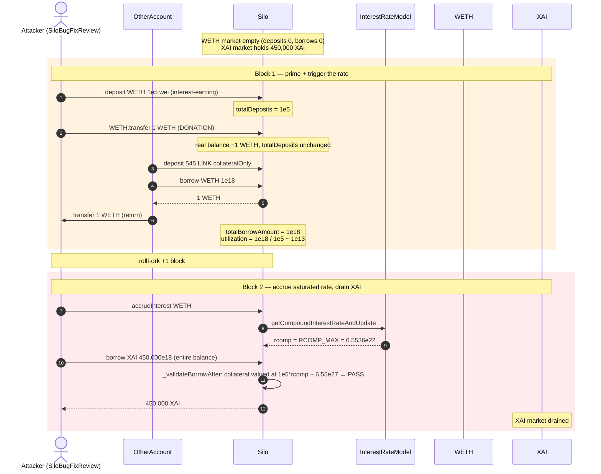
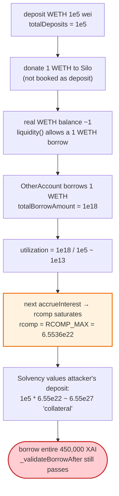
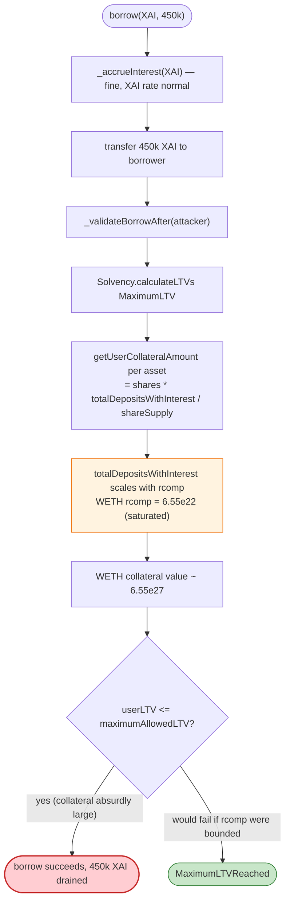

# Silo Finance Logic-Error Exploit — Interest-Rate Manipulation Drains the Entire XAI Market for ~$0

> **Reproduction:** the PoC compiles & runs in an isolated Foundry project at
> [this project folder](.) (the main DeFiHackLabs repo contains several unrelated PoCs that do not compile, so this one was extracted).
> Full verbose trace: [output.txt](output.txt).
> Verified vulnerable source: [contracts_BaseSilo.sol](sources/Silo_cB3B87/contracts_BaseSilo.sol) and [contracts_InterestRateModel.sol](sources/InterestRateModel_7e9e7e/contracts_InterestRateModel.sol).
> Bugfix writeup: [Immunefi — Silo Finance logic error](https://medium.com/immunefi/silo-finance-logic-error-bugfix-review-35de29bd934a).

---

## Key info

| | |
|---|---|
| **Loss** | The PoC borrows the **entire XAI market — 450,000 XAI** for essentially zero cost. (XAI was a Silo-internal bridging/market token.) |
| **Vulnerable contract** | `Silo` (BaseSilo) — [`0xcB3B879aB11F825885d5aDD8Bf3672596d35197C`](https://etherscan.io/address/0xcB3B879aB11F825885d5aDD8Bf3672596d35197C#code) + `InterestRateModel` — [`0x7e9e7ea94e1ff36e216a703D6D66eCe356a5fd44`](https://etherscan.io/address/0x7e9e7ea94e1ff36e216a703D6D66eCe356a5fd44#code) |
| **Victim market** | the XAI Silo market (the shared-lending pool holding 450,000 XAI) |
| **Attacker contract** | `SiloBugFixReview` (`0x5615dEB798BB3E4dFa0139dFa1b3D433Cc23b72f`) + helper `OtherAccount` (`0x104fBc016F4bb334D775a19E8A6510109AC63E00`) |
| **Attack tx** | This is a post-disclosure **bugfix review** PoC (no live malicious tx) — the bug was caught and fixed via Immunefi before exploitation. |
| **Chain / block / date** | Ethereum mainnet / fork block **17,139,470** / April 27, 2023 (bug disclosed ~April 2023) |
| **Compiler** | Solidity **v0.8.13** (`commit.abaa5c0e`), optimizer **on**, 200 runs |
| **Bug class** | Logic error / accounting inconsistency — the borrow-solvency check uses an **interest-rate-contaminated collateral value**, and the interest rate itself is **donation-inflatable**, allowing a near-unlimited borrow. |

---

## TL;DR

Silo is a shared-lending protocol where one `Silo` contract holds several markets (WETH, LINK, XAI, …) that share collateral. To decide how much you may borrow, `_validateBorrowAfter`
([contracts_BaseSilo.sol:753-767](sources/Silo_cB3B87/contracts_BaseSilo.sol#L753-L767))
calls `Solvency.calculateLTVs`, which values your collateral at its **interest-inflated** amount using a per-asset compounded rate `rcomp`
([contracts_lib_Solvency.sol:225-245](sources/Silo_cB3B87/contracts_lib_Solvency.sol#L225-L245)).

The compounded rate is computed from utilization (`totalBorrowAmount / totalDeposits`),
([contracts_InterestRateModel.sol:295](sources/InterestRateModel_7e9e7e/contracts_InterestRateModel.sol#L295))
and the protocol caps `rcomp` at `RCOMP_MAX = 2**16 × 1e18` but otherwise lets it blow up whenever utilization is extreme
([contracts_InterestRateModel.sol:381-422](sources/InterestRateModel_7e9e7e/contracts_InterestRateModel.sol#L381-L422)).

The attacker manufactures exactly that extreme state, **for free**, in two steps:

1. **Deposit 1e5 wei of WETH** (0.0000000000001 WETH — dust) as interest-earning collateral, then **donate 1 WETH** directly to the Silo. The donation is *not* booked as a deposit, so `totalDeposits` stays at 1e5 wei while the Silo's real WETH balance jumps to ~1 WETH — i.e. utilization `totalBorrow/totalDeposits` is about to explode.
2. A second account **deposits 545 LINK as collateral-only** (un-borrowable) and **borrows 1 WETH**. That 1 WETH borrow against 1e5-wei of deposits is a ~`1e13` utilization, so on the next block the WETH `rcomp` saturates to **`6.5536e22`** (the trace: "WETH interest rate after exploit = 65536000000000000000000").

Once the WETH rate is saturated, the attacker's dust WETH deposit is re-valued by Solvency as `1e5 × rcomp ≈ 6.55e27` — astronomically more "collateral value" than the whole XAI market holds. The attacker then **borrows all 450,000 XAI** and the post-borrow solvency check still passes.

---

## Background — what the WETH market looked like at the fork block

The PoC gates itself with `checkZeroAssetStorage` — it only runs if the WETH market had **zero prior deposits and borrows** (a fresh/empty market), which is exactly the vulnerable condition. Relevant fork-block facts from the trace:

| Parameter | Value (WETH market) |
|---|---|
| `totalDeposits` (before) | **0** (empty market) |
| `totalBorrowAmount` (before) | **0** |
| XAI balance held by the Silo | **450,000 XAI** (`0xd7C9…bEAc`, line [1976](output.txt#L1976)) |
| `protocolShareFee` | 0.1e18 = 10% ([1967](output.txt#L1967)) |
| `entryFee` | 0 ([1996](output.txt#L1996)) |
| WETH `rcomp` before exploit | **0** ([1576](output.txt#L1576)) |
| WETH `rcomp` after exploit | **65,536e18 = 6.5536e22** ([1580](output.txt#L1580)) |
| `MAX_LTV` used by `_validateBorrowAfter` | `MaximumLTV` (the generous cap) |

The XAI market was real and funded; the WETH market was empty and therefore trivially manipulable.

---

## The vulnerable code

### 1. `_validateBorrowAfter` values collateral with an inflated `rcomp`

```solidity
function _validateBorrowAfter(address _user) private view {
    (address[] memory assets, AssetStorage[] memory assetsStates) = getAssetsWithState();
    (uint256 userLTV, uint256 maximumAllowedLTV) = Solvency.calculateLTVs(
        Solvency.SolvencyParams(siloRepository, ISilo(address(this)), assets, assetsStates, _user),
        Solvency.TypeofLTV.MaximumLTV
    );
    if (userLTV > maximumAllowedLTV) revert MaximumLTVReached();
}
```
([contracts_BaseSilo.sol:753-767](sources/Silo_cB3B87/contracts_BaseSilo.sol#L753-L767))

### 2. Solvency inflates a deposit by the per-asset compounded rate

```solidity
function getUserCollateralAmount(...) internal view returns (uint256) {
    uint256 assetAmount = _userCollateralTokenBalance == 0 ? 0 : _userCollateralTokenBalance.toAmount(
        totalDepositsWithInterest(_assetStates.totalDeposits, _siloRepository.protocolShareFee(), _rcomp),
        _assetStates.collateralToken.totalSupply()
    );
    ...
}

function totalDepositsWithInterest(uint256 _assetTotalDeposits, uint256 _protocolShareFee, uint256 _rcomp)
    internal pure returns (uint256 _totalDepositsWithInterests)
{
    uint256 depositorsShare = _PRECISION_DECIMALS - _protocolShareFee;
    return _assetTotalDeposits + _assetTotalDeposits * _rcomp / _PRECISION_DECIMALS * depositorsShare / _PRECISION_DECIMALS;
}
```
([contracts_lib_Solvency.sol:225-293](sources/Silo_cB3B87/contracts_lib_Solvency.sol#L225-L293))

So a deposit's valued amount scales **linearly with `rcomp`**. If `rcomp` can be made huge, any dust deposit becomes arbitrarily valuable collateral.

### 3. `rcomp` is driven by utilization and saturates at `RCOMP_MAX`

```solidity
uint256 public constant RCOMP_MAX = (2**16) * 1e18;          // = 6.5536e22

function _calculateRComp(uint256 _totalDeposits, uint256 _totalBorrowAmount, int256 _x)
    internal pure returns (uint256 rcomp, bool overflow)
{
    if (_x >= X_MAX) { rcomp = RCOMP_MAX; overflow = true; }   // ⚠️ saturates, does not revert
    ...
}
```
([contracts_InterestRateModel.sol:27-31](sources/InterestRateModel_7e9e7e/contracts_InterestRateModel.sol#L27-L31), [:381-422](sources/InterestRateModel_7e9e7e/contracts_InterestRateModel.sol#L381-L422))

### 4. Direct token transfers to the Silo are not recorded as deposits

`liquidity()` (the borrow-cap check) reads the **real token balance**, but `totalDeposits` (the utilization/collateral denominator) is **accounting only**:

```solidity
function liquidity(address _asset) public view returns (uint256) {
    return ERC20(_asset).balanceOf(address(this)) - _assetStorage[_asset].collateralOnlyDeposits;
}
```
([contracts_BaseSilo.sol:205-207](sources/Silo_cB3B87/contracts_BaseSilo.sol#L205-L207))

So a `WETH.transfer(silo, 1e18)` raises borrowable liquidity (real balance) **without** raising `totalDeposits` — letting a borrow succeed, while `totalDeposits` (and thus the denominator of utilization) stays at 1e5 wei.

---

## Root cause — why it's exploitable

Two design choices compose into the bug:

1. **The collateral value used for borrowing is `rcomp`-inflated**, and `rcomp` is allowed to reach `RCOMP_MAX` (a ~6.5e22 multiplier) instead of being bounded to a sane, sub-100% APR. A saturated rate turns dust into enormous "collateral."
2. **Utilization (hence `rcomp`) is manipulable for free** because the numerator (`totalBorrowAmount`) and denominator (`totalDeposits`) are *accounting* figures, decoupled from the Silo's real token balance. A direct donation inflates real liquidity (enabling the triggering borrow) without touching `totalDeposits`, so an attacker can both (a) create a borrow that would normally be impossible and (b) drive utilization — and thus `rcomp` — to saturation at ~zero cost.

Net effect: the attacker books a 1e5-wei WETH deposit, inflates its valued collateral to ~`6.55e27` via a self-arranged 1-WETH borrow in a dust-deposit market, then borrows the entire 450,000 XAI of a *different* market in the same Silo — because Solvency sums collateral across all markets.

---

## Preconditions

- A **near-empty** market (here WETH) in the target Silo: `totalDeposits` tiny, `totalBorrowAmount` ≈ 0, so a small donation + borrow pushes utilization to saturation. The PoC asserts this via `checkZeroAssetStorage`.
- A funded victim market sharing the same Silo (here XAI, 450,000 XAI).
- Capital: 1 WETH + 545 LINK, both fully recoverable (the 1 WETH is borrowed and returned to the exploit contract; the LINK is collateral-only and could be reclaimed once debt is repaid — the PoC stops at demonstrating the borrow).
- Ability to advance one block (the `rcomp` accrual needs a timestamp delta) — the PoC uses `rollFork(block.number + 1)`.

---

## Attack walkthrough (with on-chain numbers from the trace)

All figures from [output.txt](output.txt). The exploit runs across two blocks: `run()` at block 17,139,470 (ts 1,682,622,215) and `run2()` at block 17,139,471 (ts 1,682,622,239).

### Block 1 — prime the WETH market and saturate its rate

| # | Step | WETH `totalDeposits` | WETH `totalBorrowAmount` | Effect |
|---|------|---------------------:|-------------------------:|--------|
| 0 | **Initial** (empty market) | 0 | 0 | `checkZeroAssetStorage` passes. |
| 1 | `Silo.deposit(WETH, 1e5, false)` — deposit 0.0001 µWETH as interest-earning collateral | 100,000 (1e5) | 0 | Attacker holds 100,000 collateral-shares = 1e5 wei notional. |
| 2 | `WETH.transfer(Silo, 1e18)` — **donate 1 WETH** | 100,000 (unchanged) | 0 | Silo's real WETH balance → ~1 WETH; `totalDeposits` NOT updated. |
| 3 | `OtherAccount`: deposit **545 LINK** collateral-only, then `borrow(WETH, 1e18)` | 100,000 | **1e18** | Borrow succeeds (real liquidity ≥ 1 WETH). Utilization = 1e18 / 1e5 ≈ 1e13 → rate will saturate next block. |

After block 1 the WETH market has `totalDeposits = 1e5`, `totalBorrowAmount = 1e18`.

### Block 2 — accrue, then drain XAI

| # | Step | WETH `rcomp` | Effect |
|---|------|-------------:|--------|
| 4 | `accrueInterest(WETH)` — compounds the 1e13 utilization over the 24s delta | **6.5536e22** (`RCOMP_MAX`) | `totalBorrowAmount` → `0xc7d713b49da000186a0` (line [1970](output.txt#L1970)); `totalDeposits` (depositors' share) → `0x16345785d8a00000000` (line [1971](output.txt#L1971)). |
| 5 | `Silo.borrow(XAI, 450,000e18)` — borrow **the entire XAI balance** | — | `_validateBorrowAfter` values the attacker's 1e5-wei WETH deposit at ~`1e5 × 6.55e22 ≈ 6.55e27`, far above 450,000 XAI's value at MaximumLTV → **passes**. XAI transferred to attacker. |

Console logs from the trace:

```
Balance of XAI before exploit=  0
WETH interest rate before exploit =  0
Balance of XAI after exploit=  450000000000000000000000
WETH interest rate after exploit =  65536000000000000000000
```

### Profit/loss accounting

| Item | Amount |
|---|---:|
| XAI borrowed (extracted) | **+450,000 XAI** |
| WETH borrowed by OtherAccount (returned to exploit contract) | 1 WETH (net zero — inflow then outflow) |
| LINK deposited collateral-only by OtherAccount | 545 LINK (collateral, recoverable) |
| WETH dust deposited | 0.0000000000001 WETH (negligible) |
| **Net extraction** | **450,000 XAI** |

The PoC demonstrates the borrow (the harmful action); a real attacker would swap the XAI and default on the dust WETH debt, leaving Silo's XAI market insolvent.

---

## Diagrams

### Sequence of the attack



### Why dust becomes infinite collateral



### The `_validateBorrowAfter` → `rcomp` coupling



---

## Why each magic number

- **`1e5` wei WETH deposit:** the smallest dust that registers a non-zero `totalDeposits` and mints collateral shares. The smaller the denominator, the higher the utilization spike.
- **`1e18` (1 WETH) donation + 1 WETH borrow:** creates a `totalBorrowAmount = 1e18` against `totalDeposits = 1e5` → utilization `1e13`. Any borrow large relative to dust deposits saturates the rate; 1 WETH is just a convenient, cheap amount that also satisfies the `liquidity()` check after the donation.
- **545 LINK collateral-only deposit (OtherAccount):** the real collateral that lets `OtherAccount` legitimately borrow 1 WETH (LINK is the WETH market's borrowable collateral in this Silo). Collateral-only means it doesn't change the WETH `totalDeposits`.
- **`RCOMP_MAX = 65536e18`:** the model's hard saturation cap; once `x ≥ X_MAX = ln(RCOMP_MAX+1)` the rate is clamped to this value instead of reverting. That cap is still a ~6.5e22 multiplier — enormous for collateral valuation.
- **450,000 XAI:** the entire XAI balance held by the Silo (`XAI.balanceOf(Silo)`, line [1976](output.txt#L1976)). The attacker borrows exactly that, i.e. the whole market.

---

## Remediation

1. **Bound `rcomp` to a sane APR.** `RCOMP_MAX` should cap at a few hundred % APR, not a 6.5e22 multiplier. The model's saturation cap is the single biggest amplifier; lowering it defuses the collateral-inflation path.
2. **Don't let deposits be valued above what was actually deposited + realistic interest.** Either (a) value collateral at the *depositor's share of real token balance* rather than interest-inflated accounting, or (b) clamp the per-user collateral valuation independently of `rcomp`.
3. **Decouple utilization from donation-manipulable accounting.** Compute utilization from on-chain token balances (or a TWAP thereof) rather than `totalDeposits`/`totalBorrowAmount`, so a direct transfer can't spike the rate. Equivalently, book direct transfers as donations/syncs that adjust `totalDeposits`.
4. **Per-market isolation / borrow caps.** A borrow cap per market (and a global per-user borrow cap) would stop a single manipulated market from draining an unrelated one, even if the rate bug existed.
5. **Sanity-check the post-borrow valuation.** Reject borrows where the collateral value implied by `rcomp` exceeds the Silo's *actual* token holdings for that asset — a deposit can't legitimately be worth more than the Silo owns.

---

## How to reproduce

The PoC lives in a standalone Foundry project:

```bash
_shared/run_poc.sh 2023-04-silo_finance_exp --mt testAttack -vvvvv
```

- RPC: an **Ethereum mainnet archive** endpoint is required for the fork at block **17,139,470**. `foundry.toml` uses `https://ethereum-rpc.publicnode.com...`; pruned public RPCs fail with `missing trie node`.
- Result: `[PASS] testAttack()`.

Expected tail (copied from [output.txt](output.txt)):

```
[PASS] testAttack() (gas: 1178443)
Logs:
  time stamp before =  1682622215
  block number before =  17139470
  Balance of XAI before exploit=  0
  WETH interest rate before exploit =  0
  time stamp after =  1682622239
  block number after =  17139471
  Balance of XAI after exploit=  450000000000000000000000
  WETH interest rate after exploit =  65536000000000000000000
Suite result: ok. 1 passed; 0 failed; 0 skipped; finished in 50.10s
```

---

*Reference: Immunefi bugfix review — https://medium.com/immunefi/silo-finance-logic-error-bugfix-review-35de29bd934a (Silo Finance, Ethereum, logic error in interest-rate / solvency accounting).*
