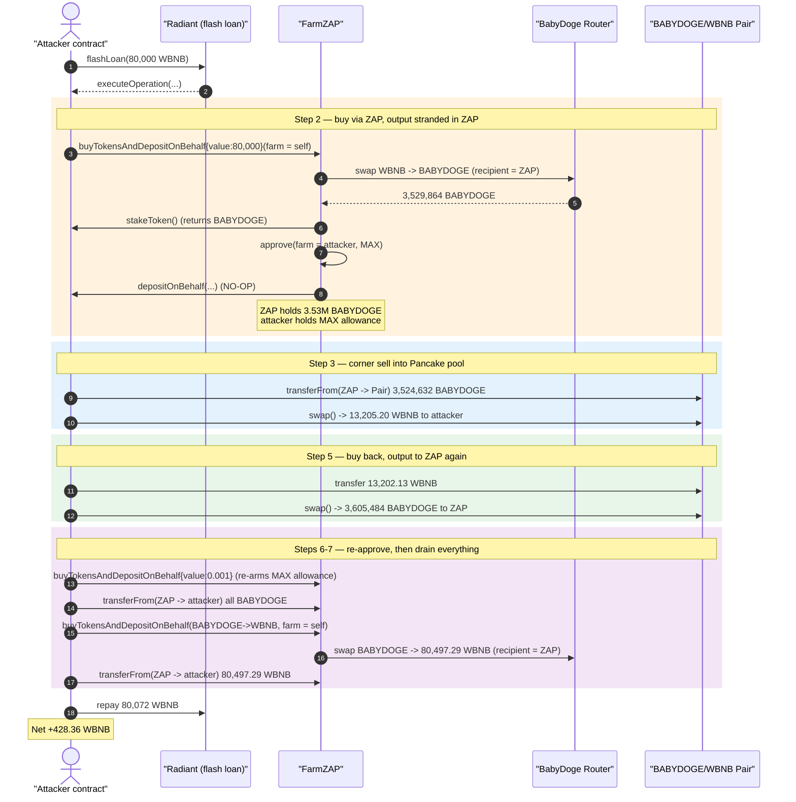
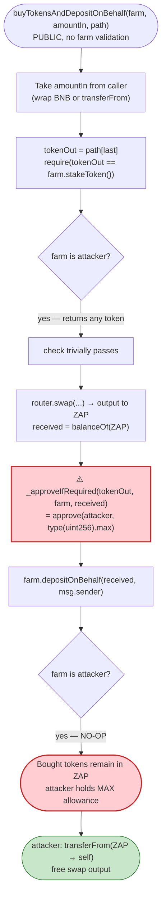
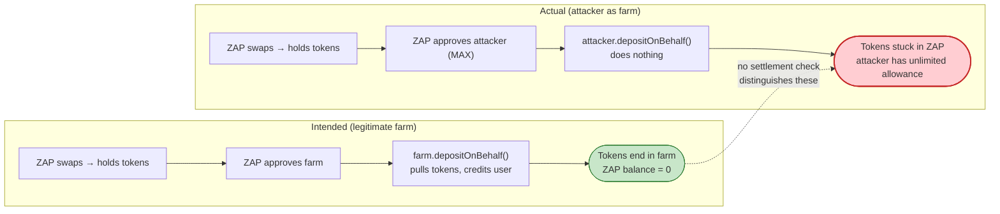

# BabyDoge FarmZAP Exploit — Untrusted `farm` Callback Lets Anyone Drain Swapped Tokens

> **Reproduction:** the PoC compiles & runs in an isolated Foundry project at
> [this project folder](.) (the umbrella DeFiHackLabs repo
> contains many unrelated PoCs that do not whole-compile, so this one was extracted).
> Full verbose trace: [output.txt](output.txt).
> Verified vulnerable source: [contracts_FarmZap.sol](sources/FarmZAP_451583/contracts_FarmZap.sol).

---

## Key info

| | |
|---|---|
| **Loss** | **~$7.5M** total across repeated runs (per DeFiHackLabs header). This single reproduced transaction nets **428.36 WBNB** (~$128K) of profit. |
| **Vulnerable contract** | `FarmZAP` — [`0x451583B6DA479eAA04366443262848e27706f762`](https://bscscan.com/address/0x451583B6DA479eAA04366443262848e27706f762#code) |
| **Token involved** | BabyDoge `CoinToken` — [`0xc748673057861a797275CD8A068AbB95A902e8de`](https://bscscan.com/address/0xc748673057861a797275CD8A068AbB95A902e8de#code) |
| **Pool manipulated** | BABYDOGE/WBNB PancakePair — `0xc736cA3d9b1E90Af4230BD8F9626528B3D4e0Ee0` |
| **Routing pair (BabyDogeSwap)** | `0x0536c8b0c3685b6e3C62A7b5c4E8b83f938f12D1` (used by the BabyDoge router `0xC9a0…`) |
| **Attacker EOA** | `0xcBC0d0c1049Eb011D7C7cFc4ff556d281f0aFEbb` |
| **Attacker contract** | `0x51873a0b615a51115f2cfbc2e24d9db4bfa2e6e2` |
| **Attack tx (canonical)** | `0x098e7394a1733320e0887f0de22b18f5c71ee18d48a0f6d30c76890fb5c85375` |
| **Chain / block / date** | BSC / 28,593,354 / **May 28, 2023** |
| **Compiler (FarmZAP)** | Solidity v0.8.16, optimizer 200 runs |
| **Bug class** | Untrusted external call / phantom-deposit: caller-supplied `farm` is used for `stakeToken()`, `depositOnBehalf()` **and** receives a max token allowance, leaving the swapped tokens recoverable from the ZAP contract |

---

## TL;DR

`FarmZAP.buyTokensAndDepositOnBehalf(IFarm farm, …)`
([contracts_FarmZap.sol:184-223](sources/FarmZAP_451583/contracts_FarmZap.sol#L184-L223))
is meant to: take your input token, swap it to a farm's stake token through the BabyDoge
router, then deposit the result *into that farm on your behalf*. The fatal mistake is that the
`farm` address is **entirely caller-controlled and never validated**. The function:

1. Reads the destination token from `farm.stakeToken()` — attacker-controlled.
2. Performs the swap, leaving the bought tokens sitting **in the ZAP contract**.
3. Grants the `farm` a `type(uint256).max` allowance over the bought token via `_approveIfRequired`
   ([:210](sources/FarmZAP_451583/contracts_FarmZap.sol#L210), [:564-572](sources/FarmZAP_451583/contracts_FarmZap.sol#L564-L572)).
4. Calls `farm.depositOnBehalf(received, msg.sender)` — attacker-controlled, **does nothing**.

The attacker simply passes **their own contract** as `farm`. Their `stakeToken()` returns whatever
token the swap should produce, and their `depositOnBehalf()` is a no-op. The result: the freshly
swapped tokens are stranded inside `FarmZAP`, but the attacker now holds an **unlimited allowance**
over them and pulls them out with a plain `transferFrom`. Each invocation is a free
swap-and-keep — the ZAP funds the swap, the attacker walks away with the output.

By chaining several such swaps (WBNB → BABYDOGE → WBNB) and routing them through both PancakeSwap
and the BabyDogeSwap router, the attacker round-trips a flash-loaned 80,000 WBNB and extracts
**428.36 WBNB of profit** in a single atomic transaction — fully flash-loan funded, zero capital at
risk.

---

## Background — what FarmZAP does

`FarmZAP` ([source](sources/FarmZAP_451583/contracts_FarmZap.sol)) is a convenience "zapper": a
helper that lets a user provide one input token and, in one call, get LP tokens or farm stake tokens
deposited into a yield farm. The relevant entry point is `buyTokensAndDepositOnBehalf`:

```solidity
function buyTokensAndDepositOnBehalf(
    IFarm farm,                 // ⚠️ caller-controlled, never checked
    uint256 amountIn,
    uint256 amountOutMin,
    address[] calldata path
) external payable returns(uint256) {
    if (msg.value > 0) {
        require(address(WBNB) == path[0], "Input token != WBNB");
        require(amountIn == msg.value, "Invalid msg.value");
        WBNB.deposit{value: amountIn}();
    } else {
        IERC20(path[0]).transferFrom(msg.sender, address(this), amountIn);
    }
    address tokenOut = path[path.length - 1];
    require(tokenOut == farm.stakeToken(), "Not a stake token");      // ⚠️ trusts attacker

    _approveIfRequired(path[0], address(router), amountIn);
    router.swapExactTokensForTokensSupportingFeeOnTransferTokens(     // swap; output stays in ZAP
        amountIn, amountOutMin, path, address(this), block.timestamp + 1200
    );
    uint256 received = IERC20(tokenOut).balanceOf(address(this));

    _approveIfRequired(tokenOut, address(farm), received);           // ⚠️ MAX approve to attacker
    farm.depositOnBehalf(received, msg.sender);                      // ⚠️ no-op for attacker

    emit TokensBoughtAndDeposited(address(farm), msg.sender, path[0], tokenOut, amountIn, received);
    return received;
}
```

The design *assumes* `farm` is a legitimate farm contract whose `depositOnBehalf` will actually pull
the approved tokens (`transferFrom(zap → farm)`) and credit the user. There is no registry, no
allow-list, no `onlyOwner`, and no check that `farm` is a real BabyDoge farm.

The BABYDOGE token itself ([CoinToken](sources/CoinToken_c74867/CoinToken.sol)) is an ordinary
reflection/auto-LP token (5% fee that accumulates and periodically `swapAndLiquify`s into the
PancakePair). It is *not* the root cause — it merely makes the bought/sold amounts non-round due to
fee-on-transfer, and its `swapAndLiquify` side-effect ([CoinToken.sol:1048-1069](sources/CoinToken_c74867/CoinToken.sol#L1048-L1069))
fires once during the attack when tokens are routed through it, nudging the pool reserves. The attack
works because of FarmZAP's broken trust model.

---

## The vulnerable code

### 1. `farm` is never validated, yet drives control flow and approvals

```solidity
require(tokenOut == farm.stakeToken(), "Not a stake token");   // L198
...
_approveIfRequired(tokenOut, address(farm), received);          // L210
farm.depositOnBehalf(received, msg.sender);                     // L211
```

[contracts_FarmZap.sol:198-211](sources/FarmZAP_451583/contracts_FarmZap.sol#L198-L211)

Three uses of an unchecked address:
- `farm.stakeToken()` decides which token the swap targets — the attacker returns any token they want.
- `_approveIfRequired(tokenOut, address(farm), received)` hands `farm` (the attacker) a
  `type(uint256).max` allowance over the bought tokens.
- `farm.depositOnBehalf(...)` is supposed to consume that allowance and move the tokens to the farm.
  An attacker's implementation simply returns.

### 2. The allowance is unlimited and never reset

```solidity
function _approveIfRequired(address token, address spender, uint256 minAmount) private {
    if (IERC20(token).allowance(address(this), spender) < minAmount) {
        IERC20(token).approve(spender, type(uint256).max);   // ⚠️ MAX, not exact, never revoked
    }
}
```

[contracts_FarmZap.sol:564-572](sources/FarmZAP_451583/contracts_FarmZap.sol#L564-L572)

Because the approval is `type(uint256).max` and is granted to `farm == attacker`, the attacker can
`transferFrom(FarmZAP → attacker, …)` at any time afterwards, for any token FarmZAP holds, with no
further interaction from the ZAP.

### 3. The swap output is left in the ZAP, not the user

```solidity
router.swapExactTokensForTokensSupportingFeeOnTransferTokens(
    amountIn, amountOutMin, path, address(this), block.timestamp + 1200   // recipient = ZAP
);
uint256 received = IERC20(tokenOut).balanceOf(address(this));
```

[contracts_FarmZap.sol:201-208](sources/FarmZAP_451583/contracts_FarmZap.sol#L201-L208)

The swap deposits into `address(this)` (the ZAP) on the expectation that `depositOnBehalf` will
immediately forward it. With a no-op farm, the tokens remain in the ZAP — perfectly positioned for
the attacker to pull via the max allowance.

---

## Root cause — why it was possible

> **The protocol's only safety check (`tokenOut == farm.stakeToken()`) is enforced against an
> attacker-supplied contract, and the same attacker-supplied contract is both granted an unlimited
> token allowance and trusted to move the funds. No part of the ZAP verifies that `farm` is a
> legitimate, protocol-deployed farm.**

The failure composes from these decisions:

1. **No farm allow-list / registry.** `farm` is a raw `IFarm` parameter. Any address — including the
   caller's own contract — satisfies the signature. A trusted-source check (e.g. `factory`-deployed
   farm, or an on-chain registry) would have blocked the entire class.
2. **Max approval to an untrusted address.** `_approveIfRequired` grants `type(uint256).max` to
   `farm`. Even if `depositOnBehalf` had been benign, this standing unlimited allowance to a
   caller-controlled address is itself a critical hazard.
3. **"Push to ZAP, then forward" pattern with no settlement check.** The function never verifies that
   `received` actually left the ZAP after `depositOnBehalf`. A post-condition assertion
   (`balanceOf(this)` returned to its prior value, or the farm's stake balance increased) would have
   reverted the no-op deposit.
4. **No return of leftover output to `msg.sender`.** Unlike `buyLpTokens` (which calls `_returnTokens`),
   this path has no mechanism to refund residual tokens, so anything left in the ZAP is silently
   recoverable by whoever holds the allowance — i.e. the attacker.

The attacker turns FarmZAP into a free swap router that *funds the swap and then lets the caller keep
the output*, and uses that primitive to round-trip a large flash loan profitably.

---

## Preconditions

- A live BABYDOGE/WBNB pool with real liquidity (≈30,420 WBNB / 4,583,396 BABYDOGE at the fork block).
- `FarmZAP` reachable and functioning (it is permissionless).
- Working capital in WBNB to size the round-trip. The PoC flash-loans **80,000 WBNB** from Radiant
  (Aave-fork) and repays **80,072 WBNB** (0.09% premium); everything is recovered intra-transaction,
  so the attack is **flash-loan-funded with zero attacker capital**.

There is no timing gate, no privileged role, and no need to pre-stage state. Any address can perform
this at will.

---

## Attack walkthrough (with on-chain numbers from the trace)

All figures are taken directly from the `Swap`/`Sync` events and balance reads in
[output.txt](output.txt). The PoC `Pair` (`0xc736…`) is oriented `reserve0 = WBNB`, `reserve1 = BABYDOGE`.

| # | Step (PoC function) | What happens | Key numbers |
|---|---------------------|--------------|-------------|
| 0 | `flashLoan` | Borrow 80,000 WBNB from Radiant (owes 80,072) | flash = 80,000 WBNB ([:1590](output.txt#L1590)) |
| 1 | `executeOperation` | `WBNB.withdraw(80,000)` → native BNB | 80,000 BNB |
| 2 | `buyTokensAndDepositOnBehalf{value:80000}` (`farm = attacker`) | ZAP wraps→swaps WBNB→BABYDOGE via BabyDoge router; output **stays in ZAP**; ZAP MAX-approves attacker; `depositOnBehalf` no-op | ZAP gains **3,529,864 BABYDOGE** ([:1662](output.txt#L1662)); attacker has max allowance ([:1668](output.txt#L1668)) |
| 3 | `BABYDOGEToWBNBInPancake()` | Pull `BABYReserve×769/1000` from ZAP into Pair, then `Pair.swap(out=WBNB)` to attacker | move 3,524,632 BABYDOGE ([:1679](output.txt#L1679)); attacker receives **13,205.20 WBNB** ([:1690-1702](output.txt#L1690)); Pair → 17,214 WBNB / 8,108,028 BABYDOGE |
| 4 | `transferFrom(ZAP→BABYDOGE, bal−1)` then `transferFrom(ZAP→attacker, 1)` | Moves ZAP's leftover 5,232 BABYDOGE to the token contract, then a 1-wei transfer **triggers BABYDOGE `swapAndLiquify`** (sell 105,000 BABYDOGE → 219.54 WBNB, re-add LP) | ZAP residual 5,232 BABYDOGE ([:1709](output.txt#L1709)); auto-LP fires ([:1811](output.txt#L1811)); Pair → 17,212 WBNB / 8,318,028 BABYDOGE ([:1799](output.txt#L1799)) |
| 5 | `WBNBToBABYDOGEInPancake()` | Push `WBNBReserve×767/1000` from attacker into Pair, then `Pair.swap(out=BABYDOGE)` **to the ZAP** | send 13,202.13 WBNB ([:1822](output.txt#L1822)); ZAP receives **3,605,484 BABYDOGE** ([:1830-1842](output.txt#L1830)); Pair → 30,414 WBNB / 4,712,543 BABYDOGE |
| 6 | `buyTokensAndDepositOnBehalf{value:0.001}` (`farm = attacker`) | Tiny dust buy whose *real purpose* is to re-fire `_approveIfRequired(BABYDOGE, attacker)` so attacker can pull the 3.6M BABYDOGE the ZAP just received in step 5 | ZAP BABYDOGE ≈ 3,605,484.95 ([:1899](output.txt#L1899)); fresh max allowance ([:1904](output.txt#L1904)) |
| 7 | `BABYDOGEToWBNBInFarmZAP()` | `transferFrom(ZAP→attacker)` all BABYDOGE; then `buyTokensAndDepositOnBehalf(path=[BABYDOGE,WBNB], farm=attacker)` swaps it to WBNB **into the ZAP**, MAX-approves attacker on WBNB, no-op deposit; finally `transferFrom(ZAP→attacker)` all WBNB | pull 3,605,484.95 BABYDOGE ([:1911](output.txt#L1911)); swap→ **80,497.29 WBNB** into ZAP ([:1976](output.txt#L1976)); pull 80,497.29 WBNB to attacker ([:1993](output.txt#L1993)) |
| 8 | return → Radiant repays | Flash repayment pulls 80,072 WBNB | repay 80,072 WBNB ([:2050](output.txt#L2050)) |
| 9 | **Final balance** | — | **428.36 WBNB** ([:2065](output.txt#L2065)) |

The `stakeToken()` mock returns BABYDOGE on calls #1–#2 and WBNB on call #3
([BabyDogeCoin_exp.sol:120-127](test/BabyDogeCoin_exp.sol#L120-L127)), so the `tokenOut ==
farm.stakeToken()` check always passes for whichever direction the attacker is swapping.

### Profit accounting (WBNB)

| Direction | Amount |
|---|---:|
| Borrowed (flash) | 80,000.00 |
| Spent — buy #1 (step 2) | 80,000.00 (the 80,000 BNB withdrawn) |
| Received — corner sell (step 3) | +13,205.20 |
| Spent — buy-back into pool (step 5) | −13,202.13 |
| Spent — dust buy (step 6) | −0.001 |
| Received — final BABYDOGE→WBNB drain (step 7) | +80,497.29 |
| Repaid (flash + 0.09% premium) | −80,072.00 |
| **Net profit** | **+428.36** |

The reconstructed balance reconciles exactly to the trace value **428.359232393301834793 WBNB**
([output.txt:2065](output.txt#L2065)). The DeFiHackLabs header reports a cumulative loss of ~$7.5M,
reflecting repeated exploitation of the same FarmZAP flaw; the single transaction reproduced here is
one such drain.

---

## Diagrams

### Sequence of the attack



### The trust flaw inside `buyTokensAndDepositOnBehalf`



### Intended vs. actual settlement



---

## Remediation

1. **Validate `farm` against a trusted source.** Maintain an on-chain registry / allow-list of
   protocol-deployed farms (or require the farm to have been created by a known factory) and
   `require(isRegisteredFarm[address(farm)])` before any interaction. Never let the caller supply an
   arbitrary `IFarm` that the contract then trusts.
2. **Never grant `type(uint256).max` to a caller-controlled address.** Approve the *exact* `received`
   amount, and reset the allowance to zero after `depositOnBehalf` returns. Better: have the farm
   pull within a bounded, single-use approval.
3. **Assert settlement (post-condition check).** After `farm.depositOnBehalf(...)`, verify the tokens
   actually left the ZAP — e.g. `require(IERC20(tokenOut).balanceOf(address(this)) == balanceBefore)`
   or that the farm's recorded stake for `msg.sender` increased. A no-op deposit would then revert.
4. **Refund residual output to `msg.sender`.** As the LP path does via `_returnTokens`, any tokens
   left in the ZAP after the operation should be returned to the user, not left recoverable by a
   standing allowance.
5. **Avoid the "push-to-self then forward" pattern.** Where possible, swap directly to the final
   recipient (the farm), or use a transient approval that cannot be reused across transactions.

The minimal fix that eliminates the exploit is (1) + (2): a farm allow-list plus an exact,
self-revoking approval. Either alone breaks the attack — without trust in `farm`, the attacker cannot
make the swap output land in a position they control.

---

## How to reproduce

The PoC was extracted into a standalone Foundry project (the umbrella DeFiHackLabs repo does not
whole-compile under `forge test`):

```bash
_shared/run_poc.sh 2023-05-BabyDogeCoin_exp -vvvvv
```

- RPC: a **BSC archive** endpoint is required (fork block 28,593,354). `foundry.toml` uses
  `https://bsc-mainnet.public.blastapi.io`, which serves historical state at that block; most public
  BSC RPCs prune it and fail with `header not found` / `missing trie node`.
- Result: `[PASS] testExploit()` with the attacker WBNB balance ≈ **428.36 WBNB**.

Expected tail:

```
Ran 1 test for test/BabyDogeCoin_exp.sol:ContractTest
[PASS] testExploit() (gas: 2564484)
Logs:
  Attacker WBNB balance after exploit: 428.359232393301834793

Suite result: ok. 1 passed; 0 failed; 0 skipped; finished in 41.18s
```

---

*References: DeFiHackLabs PoC header (Total Lost ~$7.5M); Phalcon analysis —
https://twitter.com/Phalcon_xyz/status/1662744426475831298 . Verified vulnerable source:
[FarmZAP](sources/FarmZAP_451583/contracts_FarmZap.sol).*
