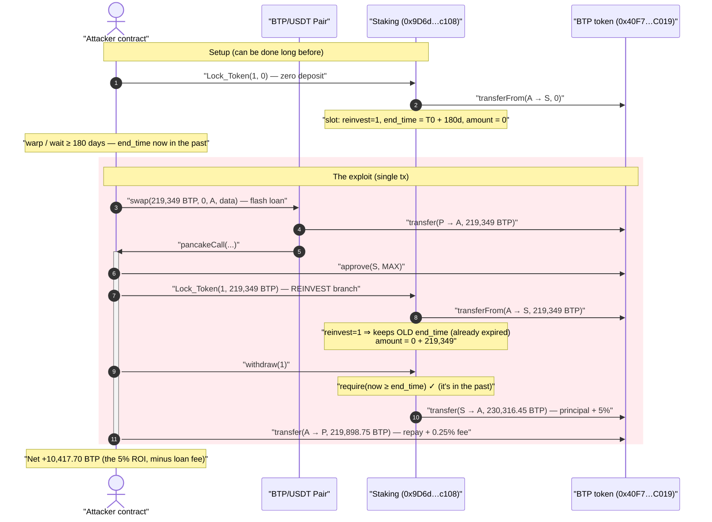
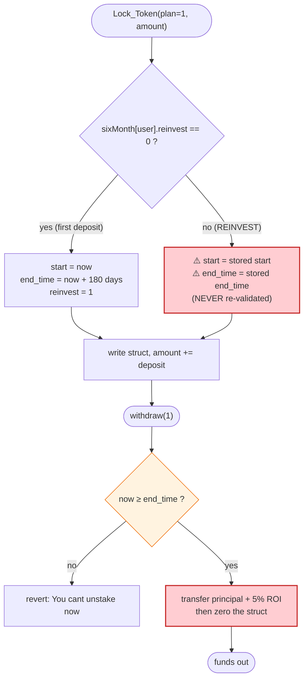
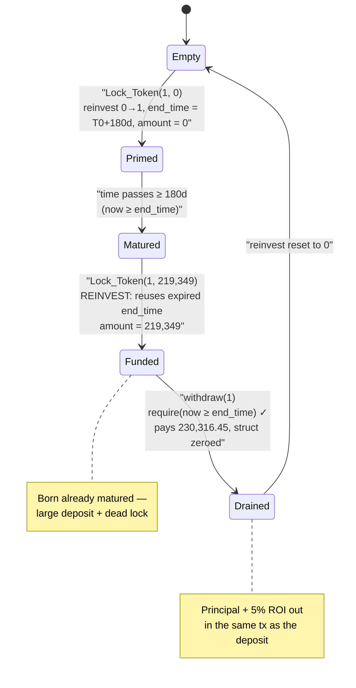

# Bitpaidio (BTP) Staking Exploit — Stale-Lock Reinvest Bug Enables Instant Flash-Loaned Staking ROI

> **One-liner:** The `Staking` contract re-uses an *already-expired* `end_time` whenever a user "reinvests", so an attacker can flash-loan tokens, deposit them into a pre-aged lock, and `withdraw()` principal + 5% ROI **in the same transaction** — pocketing the ROI for free.

> **Reproduction:** the PoC compiles & runs in an isolated Foundry project at
> [this project folder](.) (the umbrella DeFiHackLabs repo contains several unrelated PoCs that
> do not whole-compile, so this one was extracted).
> Full verbose trace: [output.txt](output.txt).
> Verified vulnerable source: [sources/Staking_9D6d81/Staking.sol](sources/Staking_9D6d81/Staking.sol).

---

## Key info

| | |
|---|---|
| **Loss** | ~$30K (PoC nets **10,417.70 BTP** of free ROI per round; the live drain repeated to empty the staking contract) |
| **Vulnerable contract** | `Staking` — [`0x9D6d817ea5d4A69fF4C4509bea8F9b2534Cec108`](https://bscscan.com/address/0x9d6d817ea5d4a69ff4c4509bea8f9b2534cec108#code) |
| **Token / victim** | `CommonBEP20` (BTP, "Bitpaidio") — [`0x40F75eD09c7Bc89Bf596cE0fF6FB2ff8D02aC019`](https://bscscan.com/address/0x40F75eD09c7Bc89Bf596cE0fF6FB2ff8D02aC019) |
| **Flash-loan source** | BTP/USDT PancakeSwap pair — `0x858DE6F832c9b92E2EA5C18582551ccd6add0295` |
| **Attacker EOA** | [`0x878a36edfb757e8640ff78b612f839b63adc2e51`](https://bscscan.com/address/0x878a36edfb757e8640ff78b612f839b63adc2e51) |
| **Attacker contract** | [`0x7b9265c6aa4b026b7220eee2e8697bf5ffa6bb9a`](https://bscscan.com/address/0x7b9265c6aa4b026b7220eee2e8697bf5ffa6bb9a) |
| **Attack tx** | [`0x1ae499ccf292a2ee5e550702b81a4a7f65cd03af2c604e2d401d52786f459ba6`](https://bscscan.com/tx/0x1ae499ccf292a2ee5e550702b81a4a7f65cd03af2c604e2d401d52786f459ba6) |
| **Chain / fork block / date** | BSC / 28,176,675 / May 2023 |
| **Compiler** | `Staking`: Solidity v0.8.14, optimizer 200 runs · `CommonBEP20`: v0.8.3 |
| **Bug class** | Broken time-lock invariant — stale (cached) lock-expiry reused across deposits ⇒ instant withdrawal |

---

## TL;DR

Bitpaidio's `Staking` contract offers fixed-term staking (6 / 9 / 12-month plans) that pays a flat
ROI (5% / 10% / 20%) when the lock expires. To support topping up an existing stake, `Lock_Token`
has a "first deposit vs. reinvest" branch keyed on a per-user `reinvest` flag
([Staking.sol:342-351](sources/Staking_9D6d81/Staking.sol#L342-L351)):

- **First deposit** (`reinvest == 0`): set `start_time = now`, `end_time = now + 180 days`, `reinvest = 1`.
- **Reinvest** (`reinvest == 1`): **keep the existing `start_time` / `end_time`**, only bump `amount`.

The fatal mistake is that the reinvest branch **never re-checks whether the inherited `end_time`
is still in the future.** So if a user's stake position has already matured (`end_time` is in the
past) but the position has been emptied to `amount == 0`, the `reinvest` flag is *still* `1`, and the
*expired* `end_time` is *still* stored. A new deposit into that slot inherits the dead lock and is
therefore **immediately withdrawable**.

The attacker weaponizes this with a flash loan:

1. **Prime the slot** (months in advance, or just once): call `Lock_Token(1, 0)` with **zero** tokens.
   This writes `reinvest = 1` and `end_time = now + 180 days` for the attacker — a do-nothing deposit
   that exists only to age.
2. **Wait** until that `end_time` has passed (≥ 180 days).
3. **Flash-loan** ~219,349 BTP from the BTP/USDT Pancake pair.
4. Inside the callback, `Lock_Token(1, 219_349 BTP)` — the **reinvest branch** re-uses the long-dead
   `end_time`, so the position is matured the instant it is funded.
5. `withdraw(1)` — `require(now >= end_time)` passes, and the contract pays back **principal + 5% ROI
   = 230,316.45 BTP**.
6. Repay the flash loan (219,898.75 BTP incl. the 0.25% Pancake fee) and keep the difference:
   **10,417.70 BTP profit, with zero capital and zero time at risk.**

There is no oracle, no reentrancy guard, and no balance accounting bug involved — the entire exploit
rests on a single missing freshness check on a cached timestamp.

---

## Background — what the Staking contract does

`Staking` ([source](sources/Staking_9D6d81/Staking.sol)) is a small, hand-rolled fixed-term staking
contract for the BTP token. It has three plans, each a separate `mapping(address => struct)`:

| Plan | Mapping | Lock duration | ROI | ROI helper |
|---|---|---|---|---|
| 1 | `sixMonth` | 180 days | **5%** | `plan_1_Roi` ([:454-456](sources/Staking_9D6d81/Staking.sol#L454-L456)) |
| 2 | `nineMonth` | 270 days | 10% | `plan_2_Roi` ([:458-460](sources/Staking_9D6d81/Staking.sol#L458-L460)) |
| 3 | `twelveMonth` | 365 days | 20% | `plan_3_Roi` ([:462-464](sources/Staking_9D6d81/Staking.sol#L462-L464)) |

Each per-user struct stores `{user_address, amount, start_time, end_time, reinvest}`
([:305-311](sources/Staking_9D6d81/Staking.sol#L305-L311)). The intended lifecycle is:

- `Lock_Token` to stake (and later top up via the reinvest branch).
- `withdraw` after `end_time` to receive `amount + ROI`, which **zeroes the entire struct**
  ([:425](sources/Staking_9D6d81/Staking.sol#L425) for plan 1).

The token itself ([CommonBEP20.sol](sources/CommonBEP20_40F75e/CommonBEP20.sol)) is a plain
OpenZeppelin-style ERC20 — 18 decimals, no transfer tax, no rebasing. It contributes nothing to the
bug; it is purely the staked/paid asset.

The ROI rewards come out of the staking contract's *own* BTP balance (the contract holds a reserve
funded by the project). So every successful round of the exploit drains BTP out of that reserve.

---

## The vulnerable code

### 1. `Lock_Token` — the reinvest branch reuses a stale `end_time`

```solidity
function Lock_Token(uint256 plan, uint256 _amount) external {
  if(plan == 1) {
      address contractAddress = address(this);
      uint256 currentAmount = sixMonth[msg.sender].amount;
      uint256 total = SafeMath.add(currentAmount,_amount);
      if(sixMonth[msg.sender].reinvest == 0) {
          uint256 startTime = block.timestamp;
          uint256 endTime   = block.timestamp + 180 days;          // fresh lock
          sixMonth[msg.sender] = TimeLock_Six_Month(msg.sender,total,startTime,endTime,1);
      }
      else {
          uint256 startTime = sixMonth[msg.sender].start_time;      // ⚠️ inherited
          uint256 endTime   = sixMonth[msg.sender].end_time;        // ⚠️ inherited — never re-validated!
          sixMonth[msg.sender] = TimeLock_Six_Month(msg.sender,total,startTime,endTime,1);
      }
      ERC20interface.transferFrom(msg.sender, contractAddress, _amount);
  }
  ...
}
```
[Staking.sol:337-353](sources/Staking_9D6d81/Staking.sol#L337-L353)

When `reinvest == 1`, the new deposit adopts whatever `end_time` was already stored. If that
`end_time` is in the past, the brand-new deposit is born already matured.

### 2. `withdraw` — only gate is the inherited `end_time`

```solidity
function withdraw(uint256 _plan) public {
    if(_plan == 1) {
        require(block.timestamp >= sixMonth[msg.sender].end_time, "You cant unstake now");
        uint256 roi          = sixMonth[msg.sender].amount;
        uint256 RoiReturn    = plan_1_Roi(roi);                 // 5% of amount
        uint256 investedAmount = sixMonth[msg.sender].amount;
        uint256 total        = SafeMath.add(RoiReturn,investedAmount);
        ERC20interface.transfer(msg.sender, total);             // pay principal + 5%
        sixMonth[msg.sender] = TimeLock_Six_Month(msg.sender,0,0,0,0);   // ⚠️ resets reinvest=0 too
    }
    ...
}
```
[Staking.sol:416-426](sources/Staking_9D6d81/Staking.sol#L416-L426)

The **only** thing standing between a deposit and a withdrawal is `block.timestamp >= end_time`.
Because the reinvest branch let the attacker carry a dead `end_time` into a fresh, large deposit,
this check is satisfied immediately.

> Note: `withdraw` *does* reset the struct (including `reinvest → 0`). So the cheapest reusable setup
> is the `Lock_Token(1, 0)` "zero deposit" — it sets `reinvest = 1` and `end_time` **without ever
> being withdrawn**, leaving the aged, expired lock sitting in storage to be reused on demand.

---

## Root cause — why it was possible

Two design choices combine into a critical bug:

1. **Cached lock-expiry is reused without revalidation.** The "reinvest" branch trusts the stored
   `end_time` blindly. The implicit invariant the code *should* enforce — *"a deposit must be locked
   for at least 180 days from the moment funds are added"* — is silently dropped whenever
   `reinvest == 1`. A correct top-up would either extend `end_time` to `now + 180 days`, or weight the
   remaining lock by the new amount. Here it does neither.

2. **`Lock_Token(1, 0)` is a valid, free way to set the timer.** Depositing `_amount = 0` still runs
   the first-deposit branch (`reinvest` flips `0 → 1`, `end_time = now + 180 days`) and performs a
   harmless `transferFrom(..., 0)`. This lets anyone *plant* an aging timer at zero cost, with no
   tokens locked, ready to be "filled" later via the reinvest branch.

Once those two facts hold, the attack is fully **flash-loanable**: the attacker never needs its own
principal. The flash loan funds the deposit, the matured-on-arrival lock lets `withdraw` pay it back
plus 5%, and the loan is repaid in the same transaction. The 5% ROI is pure, risk-free profit drawn
from the staking contract's reserve.

There is **no reentrancy, no oracle, no math overflow** — `SafeMath` and Solidity 0.8 checked
arithmetic are present and irrelevant. The vulnerability is purely a broken temporal invariant.

---

## Preconditions

- A pre-aged plan-1 slot for the attacker with `reinvest == 1`, `amount == 0`, and a **past**
  `end_time`. The PoC creates this with `Lock_Token(1, 0)` and then `vm.warp`s 180 days + 1000 s
  forward ([test/Bitpaidio_exp.sol:38-40, 47-49](test/Bitpaidio_exp.sol#L38-L49)). In the live attack
  the slot had simply matured naturally.
- The staking contract holds enough BTP to pay `amount + 5% ROI` of the borrowed size. Drains can be
  repeated until the reserve is exhausted.
- A flash-loan source for BTP — here the BTP/USDT PancakeSwap pair, drained and repaid via
  `swap(...)` + `pancakeCall` (0.25% fee). The pair held ~219,349 BTP, which bounds one round's size.

---

## Step-by-step attack walkthrough (with on-chain numbers from the trace)

All figures below are read directly from [output.txt](output.txt). Plan 1 ROI is a flat **5%**.

| # | Action | Trace evidence | Effect on attacker's `sixMonth` slot |
|---|--------|----------------|--------------------------------------|
| 0 | **Prime the timer:** `Lock_Token(1, 0)` (zero-value deposit) | [output.txt:15-25](output.txt) — `transferFrom(attacker, staking, 0)`; storage writes: `reinvest 0→1`, `start_time → 0x645f9db5` (2023-05-13 14:24:53 UTC), `end_time → 0x654cebb5` (2023-11-09 14:24:53 UTC), `user → attacker` | `{amount:0, start:T₀, end:T₀+180d, reinvest:1}` |
| 1 | **Age the lock:** `warp(block.timestamp + 6·30·24·60·60 + 1000)` → `1699540893` (2023-11-09 14:41:33 UTC) | [output.txt:26-27](output.txt) | now (`1699540893`) **≥** `end_time` (`1699539893`) by ~17 min ⇒ slot is matured |
| 2 | **Flash-loan** 219,349 BTP from the BTP/USDT pair via `Pair.swap(219349e18, 0, this, data)` | [output.txt:28-30](output.txt) — pair `transfer`s `219349000000000000000000` BTP to attacker, then calls back | attacker holds 219,349 BTP |
| 3 | *(in `pancakeCall`)* `BTP.approve(staking, type(uint256).max)` | [output.txt:36-40](output.txt) | allowance set |
| 4 | *(in `pancakeCall`)* `Lock_Token(1, balanceOf(this)=219349e18)` — **reinvest branch** | [output.txt:43-54](output.txt) — `transferFrom(attacker→staking, 219349e18)`; `amount` slot `0 → 0x2e72eee0bb30a6340000` (= 219,349 BTP); **`start_time` / `end_time` unchanged (still in the past)** | `{amount:219349, start:T₀, end:T₀+180d (past), reinvest:1}` — matured on arrival |
| 5 | *(in `pancakeCall`)* `withdraw(1)` — `require(now ≥ end_time)` passes | [output.txt:55-67](output.txt) — `transfer(staking→attacker, 230316450000000000000000)` = **230,316.45 BTP**; struct zeroed | principal 219,349 + 5% ROI 10,967.45 returned; slot reset |
| 6 | *(in `pancakeCall`)* Repay the flash loan: `transfer(pair, flashAmount·10000/9975 + 1000)` | [output.txt:68-73](output.txt) — `transfer(attacker→pair, 219898746867167919800498)` = **219,898.75 BTP** (incl. 0.25% Pancake fee) | loan repaid; `swap` invariant satisfied |
| 7 | **Profit booked** | [output.txt:86-90](output.txt) — `balanceOf(attacker) = 10417703132832080199502` | **10,417.70 BTP retained** |

### Why the 5% ROI is the profit

The attacker borrowed 219,349 BTP and had to give the pair back 219,898.75 BTP (the 0.25% PancakeSwap
swap fee on top). The staking contract paid out principal + 5%:

- ROI paid = `219,349 × 5% = 10,967.45 BTP`.
- Pancake fee cost = `219,898.75 − 219,349 = 549.75 BTP`.
- Net = `10,967.45 − 549.75 = 10,417.70 BTP` ✓ (matches the final balance to the wei).

Each round nets the ROI minus the flash-loan fee; the attacker repeats it to bleed the staking
contract's BTP reserve dry — the live incident totaled roughly **$30K**.

---

## Profit / loss accounting (one round, BTP)

| Direction | Amount (BTP) | Source |
|---|---:|---|
| Borrowed from pair (flash loan in) | 219,349.00 | [output.txt:29](output.txt) |
| Deposited into `Staking` via `Lock_Token` | −219,349.00 | [output.txt:44](output.txt) |
| Withdrawn from `Staking` (principal + 5%) | **+230,316.45** | [output.txt:56-57](output.txt) |
| Repaid to pair (flash loan + 0.25% fee) | −219,898.75 | [output.txt:69](output.txt) |
| **Net attacker profit** | **+10,417.70** | [output.txt:87](output.txt) |

The loss is borne by the **`Staking` contract's BTP reserve** — the protocol's funds set aside to pay
honest stakers' ROI. The token contract, the pair's LPs, and honest stakers' *principals* are not
directly touched in a single round, but a repeated drain depletes the reward pool and breaks the
staking program for everyone.

---

## Diagrams

### Sequence of the attack



### The flaw inside `Lock_Token` / `withdraw`



### Slot state evolution (the stale-lock lifecycle)



---

## Remediation

1. **Re-validate (or extend) the lock on every deposit.** The reinvest branch must never inherit an
   expired `end_time`. The minimal fix: on a top-up, set `end_time = block.timestamp + 180 days`
   (and `start_time = block.timestamp`) so freshly added funds are always locked for the full term.
   A fairer variant computes an amount-weighted remaining lock, but at minimum the new end time must
   be `≥ now + lockDuration`.

   ```solidity
   else {
       // extend the lock for the (now larger) position
       uint256 startTime = block.timestamp;
       uint256 endTime   = block.timestamp + 180 days;   // was: stored end_time
       sixMonth[msg.sender] = TimeLock_Six_Month(msg.sender, total, startTime, endTime, 1);
   }
   ```

2. **Reject zero-value deposits.** Add `require(_amount > 0, "zero amount")` so `Lock_Token(1, 0)`
   cannot plant a free, aging timer with no locked principal.

3. **Don't let a single struct serve both "active" and "consumed" states.** After `withdraw` zeroes
   the position, `reinvest` is reset to `0`, which is correct — but the zero-deposit prime sidesteps
   that. Consider tracking the *funded* lock start independently of the `reinvest` flag, and treat any
   position with `amount == 0` as "no active lock" for time-gating purposes.

4. **Make staking flash-loan-resistant by construction.** Even with the timer fixed, ensure the
   reward path cannot be entered and exited within one transaction: enforce that `withdraw` reverts
   when `start_time == block.timestamp` (same-block deposit-and-withdraw), or require a minimum number
   of blocks/seconds between the last deposit and any withdrawal.

5. **Pay ROI from a dedicated, bounded reward pool** and cap per-transaction payouts so a single
   exploited withdrawal cannot drain the entire reserve.

---

## How to reproduce

The PoC was extracted into a standalone Foundry project (the umbrella DeFiHackLabs repo has several
unrelated PoCs that fail to compile under `forge test`'s whole-project build):

```bash
_shared/run_poc.sh 2023-05-Bitpaidio_exp --mt testExploit -vvvvv
```

- RPC: a **BSC archive** endpoint is required (the fork block 28,176,675 is from May 2023). Most public
  BSC RPCs prune that state and fail with `header not found` / `missing trie node`; use an archive
  provider.
- Result: `[PASS] testExploit()`, logging the attacker's final BTP balance ≈ **10,417.70 BTP** of
  profit per round.

Expected tail:

```
Ran 1 test for test/Bitpaidio_exp.sol:ContractTest
[PASS] testExploit() (gas: 234892)
Logs:
  Attacker BTP balance after exploit: 10417.703132832080199502

Suite result: ok. 1 passed; 0 failed; 0 skipped
```

---

*References: PoC header in [test/Bitpaidio_exp.sol](test/Bitpaidio_exp.sol) — BlockSec disclosure
https://twitter.com/BlockSecTeam/status/1657411284076478465 ; verified vulnerable source
[sources/Staking_9D6d81/Staking.sol](sources/Staking_9D6d81/Staking.sol).*
