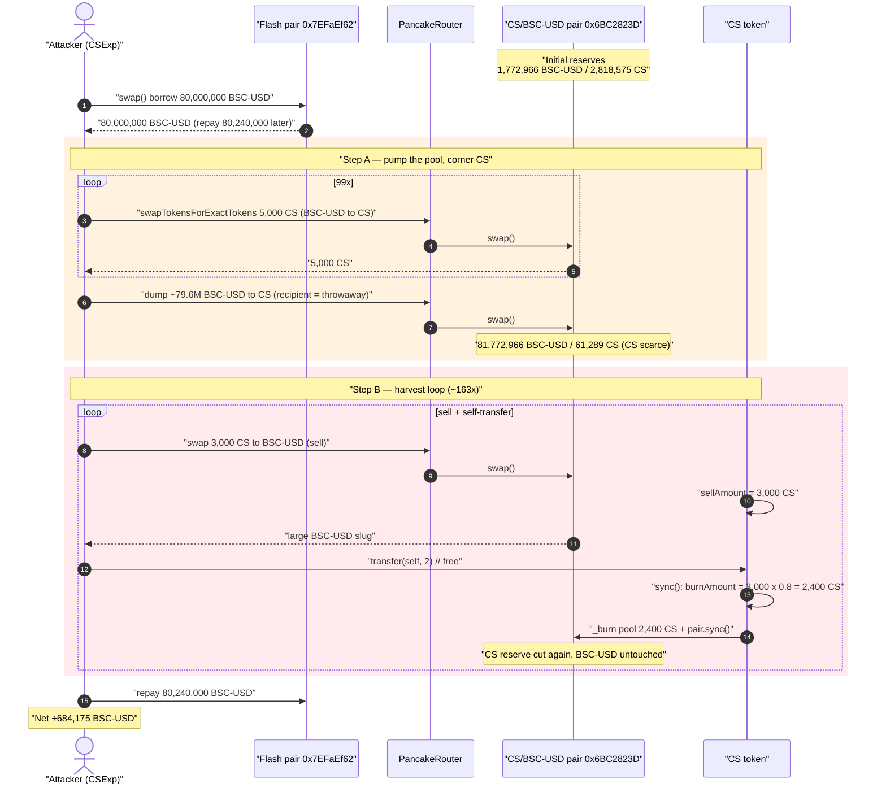
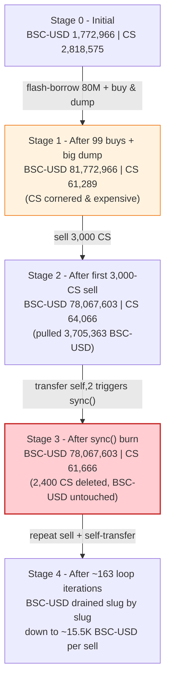
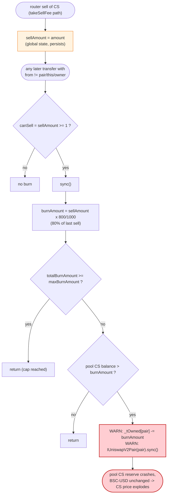

# CS Token Exploit — Stale Global `sellAmount` Drives an Attacker-Triggerable Pool Burn

> **Reproduction:** the PoC compiles & runs in an isolated Foundry project at
> [this project folder](.) (the umbrella DeFiHackLabs repo contains many unrelated
> PoCs that do not whole-compile, so this one was extracted standalone).
> Full verbose trace: [output.txt](output.txt).
> Verified vulnerable source: [sources/CS_8BC6Ce/CS.sol](sources/CS_8BC6Ce/CS.sol).

---

## Key info

| | |
|---|---|
| **Loss** | ~**684,175 BSC-USD** (≈ $684K) extracted in a single transaction |
| **Vulnerable contract** | `CS` token — [`0x8BC6Ce23E5e2c4f0A96429E3C9d482d74171215e`](https://bscscan.com/address/0x8BC6Ce23E5e2c4f0A96429E3C9d482d74171215e#code) |
| **Victim pool** | CS / BSC-USD PancakeSwap pair — `0x6BC2823De2c3718D3669C2E7036E1D888C4107a1` (token0 = BSC-USD, token1 = CS) |
| **Flash-loan pool** | BSC-USD pair `0x7EFaEf62fDdCCa950418312c6C91Aef321375A00` (token0 = BSC-USD) — source of the 80M flash swap |
| **Attacker contract** | `CSExp` (PoC harness `0x7FA9385bE102ac3EAc297483Dd6233D62b3e1496` in fork) |
| **Burn sink** | `0x382e9652AC6854B56FD41DaBcFd7A9E633f1Edd5` (dump-sell recipient) / `0x…dEaD` (CS burn address) |
| **Attack tx** | [`0x906394b2ee093720955a7d55bff1666f6cf6239e46bea8af99d6352b9687baa4`](https://explorer.phalcon.xyz/tx/bsc/0x906394b2ee093720955a7d55bff1666f6cf6239e46bea8af99d6352b9687baa4) |
| **Chain / fork block / date** | BSC / 28,466,976 / May 2023 |
| **Compiler** | CS token: Solidity v0.8.18, optimizer **500 runs**; pair: v0.5.16 |
| **Bug class** | Outdated/uncleared global accounting variable (`sellAmount`) feeding an attacker-triggerable, un-compensated pool burn — broken AMM `x·y=k` invariant |

`BSC-USD` is the token at `0x55d398326f99059fF775485246999027B3197955` (commonly labelled "USDT" on BSC, and "BUSD" in the PoC's variable names). Throughout this document it is the stable side of the pool.

---

## TL;DR

`CS` is a fee-on-transfer token with a "deflation" feature that **burns CS directly out of its own
liquidity pool**. The amount it burns is read from a **global state variable `sellAmount`**
([CS.sol:739](sources/CS_8BC6Ce/CS.sol#L739)) that is written during a sell
([CS.sol:707](sources/CS_8BC6Ce/CS.sol#L707)) and only later consumed inside `sync()`. Crucially, the
burn-and-`pair.sync()` is triggered by **the next ordinary transfer**
([CS.sol:690-693](sources/CS_8BC6Ce/CS.sol#L690-L693)) — including a trivial self-transfer that anyone
can make. `sync()` removes `sellAmount × 80%` of CS from the pair and force-syncs the reserves
([CS.sol:735-752](sources/CS_8BC6Ce/CS.sol#L735-L752)), an **un-compensated** deletion of one side of
the pool that no swap pays for.

The attacker turns this into a money pump:

1. **Flash-borrows 80,000,000 BSC-USD** from an unrelated pair.
2. **Pumps the CS/BSC-USD pool**: buys CS 99× then dumps the remaining ~79.6M BSC-USD for CS into a
   throwaway address, leaving the pool holding **~81.77M BSC-USD against only ~61,289 CS** — CS made
   artificially scarce and very expensive.
3. **Sells 3,000 CS, then self-transfers 2 wei** in a tight loop (~163 iterations). Each sell sets
   `sellAmount = 3,000 CS`; each 2-wei self-transfer then fires `sync()`, which **burns
   `3,000 × 0.8 = 2,400 CS` straight out of the pool** and re-syncs. With CS already scarce, each burn
   keeps inflating the CS price so each successive 3,000-CS sell pulls out a large slug of BSC-USD.
4. **Repays the 80,240,000 BSC-USD flash loan** and walks away with the difference.

Net: starting from 0.01 BSC-USD the attacker ends holding **684,175.12 BSC-USD**
([output.txt:1565](output.txt)), all of it real pool liquidity.

---

## Background — what the CS token does

`CS` ([sources/CS_8BC6Ce/CS.sol](sources/CS_8BC6Ce/CS.sol)) is a 100,000,000-supply BEP-20 with a
fee/anti-bot layer bolted onto a PancakeSwap pair:

- **Buy/sell/transfer fees** computed in `_getBuyParam` / `_getSellParam` / `_getTransferParam`
  ([CS.sol:828-863](sources/CS_8BC6Ce/CS.sol#L828-L863)) — a 3% sell fee (`totalSellFee = 30/1000`),
  plus price-drop "plus fees" and an early-launch 77% fee window.
- **A daily-style deflation burn** that destroys CS *held by the pool*, implemented in the private
  `sync()` function ([CS.sol:735-752](sources/CS_8BC6Ce/CS.sol#L735-L752)) — capped by
  `maxBurnAmount = 90,000,000 CS`.
- **A global `sellAmount`** ([CS.sol:483](sources/CS_8BC6Ce/CS.sol#L483)) that records the size of the
  most recent sell and is the **sole input** to how much the pool burn destroys.

On-chain pool state at the fork block (first `getReserves`, [output.txt:1596](output.txt)):

| Parameter | Value |
|---|---|
| Pool BSC-USD reserve (reserve0) | **1,772,966 BSC-USD** |
| Pool CS reserve (reserve1) | **2,818,575 CS** |
| `totalSellFee` | 30 / 1000 = **3%** |
| burn fraction in `sync()` | `sellAmount × 800 / 1000` = **80% of the last sell** |
| `maxBurnAmount` | 90,000,000 CS (never reached here) |
| `totalBurnAmount` at start | 0 |

The whole exploit is built on one fact: **the pool's own CS can be deleted, for free, by anyone, in an
amount the attacker controls via a prior sell.**

---

## The vulnerable code

### 1. A sell writes the global `sellAmount` (and never clears it on the same call)

```solidity
// _transfer(), sell branch — CS.sol:702-722
if(takeSellFee){
    require(amount <= limitSell,"exceeds selling limit!");
    uint256 price = getSellPrice(to);
    updatePrice(price);
    _getSellParam(amount,param);
    sellAmount = amount;            // ⚠️ global state set to the size of THIS sell
    ...
}
```
[CS.sol:702-722](sources/CS_8BC6Ce/CS.sol#L702-L722)

### 2. The *next* transfer triggers the burn from `sellAmount`

```solidity
// _transfer(), top — CS.sol:690-693
bool canSell =  sellAmount >= 1;
if(canSell && from != address(this) && from != uniswapV2Pair
            && from != owner() && to != owner() && !_isLiquidity(from,to)){
    sync();                         // ⚠️ fires on ANY ordinary transfer once sellAmount is set
}
```
[CS.sol:690-693](sources/CS_8BC6Ce/CS.sol#L690-L693)

### 3. `sync()` burns CS out of the pool and force-syncs the pair

```solidity
function sync() private lockTheSync{
    if (totalBurnAmount>=maxBurnAmount){ return; }
    uint256 burnAmount = sellAmount.mul(800).div(1000);   // ⚠️ 80% of the LAST sell
    sellAmount = 0;
    if(totalBurnAmount + burnAmount > maxBurnAmount){
        burnAmount = maxBurnAmount - totalBurnAmount;
    }
    if (_tOwned[uniswapV2Pair] > burnAmount ){
        totalBurnAmount += burnAmount;
        _tOwned[uniswapV2Pair] -= burnAmount;             // ⚠️ deletes CS from the pair's balance
        _tOwned[address(burnAddress)] += burnAmount;
        emit Transfer(uniswapV2Pair, address(burnAddress), burnAmount);
        emit Burn(uniswapV2Pair,address(burnAddress),burnAmount);
        IUniswapV2Pair(uniswapV2Pair).sync();             // ⚠️ forces the reduced balance as reserve
    }
}
```
[CS.sol:735-752](sources/CS_8BC6Ce/CS.sol#L735-L752)

The PoC's own summary names the root cause exactly: *"Outdated global variable `sellAmount` for
calculating `burnAmount`"* ([test/CS_exp.sol:13](test/CS_exp.sol#L13)).

---

## Root cause — why it was possible

A Uniswap-V2 / PancakeSwap pair derives price purely from its reserves and only enforces `x·y ≥ k`
*inside* `swap()`. `sync()` exists to let the pair adopt its real token balances. CS abuses that trust:
it **destroys CS held by the pair** (`_tOwned[uniswapV2Pair] -= burnAmount`) and then calls
`pair.sync()`, telling the pair "your CS reserve is now this much smaller." No BSC-USD ever leaves the
pair, so `k` collapses and the CS price spikes — at the moment of the attacker's choosing.

Three independent design flaws compose into the exploit:

1. **Stale global accounting.** `sellAmount` is a single persistent slot
   ([CS.sol:483](sources/CS_8BC6Ce/CS.sol#L483)) shared across transactions. A sell writes it; an
   *unrelated, later* transfer reads it. There is no per-call binding between the sell that pays the
   fee and the burn that destroys pool liquidity. The attacker sets it large with a cheap 3,000-CS sell
   and then redeems the 2,400-CS pool burn with a free 2-wei self-transfer.
2. **The burn target is the pool, and it is un-compensated.** Burning CS out of the pair without
   removing the paired BSC-USD is a direct transfer of value to whoever still holds CS
   ([CS.sol:746-750](sources/CS_8BC6Ce/CS.sol#L746-L750)). The attacker makes sure that party is the
   pool's residual reserve that *they* are about to sell into.
3. **The burn is permissionlessly triggerable.** `sync()` is reached from the public `_transfer`
   guard ([CS.sol:690-693](sources/CS_8BC6Ce/CS.sol#L690-L693)); the only excluded `from` addresses are
   the contract, the pair, and the owner. Any EOA — including the attacker's own contract doing a
   `transfer(self, 2)` — satisfies the condition and fires the pool burn.

The intended fee machinery never claws value back: the 3% sell fee on 3,000 CS is trivial next to the
2,400-CS pool burn it unlocks, and the burn enriches exactly the reserve the attacker dumps into.

---

## Preconditions

- `totalBurnAmount < maxBurnAmount` (0 < 90M CS ✓ — the cap is never approached).
- A sell has set `sellAmount ≥ 1`, then a subsequent transfer with a non-exempt `from` runs — both are
  produced trivially by the attacker (`router sell` then `CS.transfer(self, 2)`).
- Working capital in BSC-USD large enough to corner the pool's CS side. The PoC sources it from a
  **flash swap** of 80,000,000 BSC-USD on pair `0x7EFaEf62…`
  ([test/CS_exp.sol:28](test/CS_exp.sol#L28)), repaid in full with the 0.3% fee
  (80,240,000 BSC-USD, [output.txt:29877](output.txt)) inside the same transaction — so the attack is
  effectively capital-free.

---

## Attack walkthrough (with on-chain numbers from the trace)

Pool `0x6BC2823De2…`: `token0 = BSC-USD` (reserve0), `token1 = CS` (reserve1). All figures are pulled
directly from `Sync`/`Swap` events in [output.txt](output.txt).

| # | Step | Pool BSC-USD | Pool CS | Effect |
|---|------|------------:|--------:|--------|
| 0 | **Initial** ([:1596](output.txt)) | 1,772,966 | 2,818,575 | Honest pool. |
| 1 | **Flash-borrow 80,000,000 BSC-USD** from pair `0x7EFaEf62…` ([:1577](output.txt)) | — | — | Attacker now holds ~80M BSC-USD. |
| 2 | **99× buy 5,000 CS** via `swapTokensForExactTokens` (path BSC-USD→CS, [:1594](output.txt)) | rising | falling | Pumps BSC-USD in, drains CS out incrementally. |
| 3 | **Dump remaining ~79,621,258 BSC-USD → CS** to throwaway `0x382e96…` ([:7041](output.txt)) | **81,772,966** | **61,289** | CS in pool now tiny & expensive; attacker holds ~490,050 CS. |
| 4 | **Sell 3,000 CS** (path CS→BSC-USD), 2,910 CS reach pool after 3% fee → `sellAmount = 3,000 CS` ([:7088](output.txt)) | 81,772,966 → 78,067,603 | 64,066 | First effective sell pulls **3,705,363 BSC-USD** out ([:7157](output.txt)). |
| 5 | **`CS.transfer(self, 2)`** → `sync()` burns `3,000 × 0.8 = 2,400 CS` from pool + `pair.sync()` ([:7177-7187](output.txt)) | 78,067,603 | 64,066 → 61,666 | **Un-compensated burn**: CS reserve cut, BSC-USD untouched → CS price re-inflated. |
| 6 | **Repeat steps 4–5 ~163×** ([loops: :7197 … :29837](output.txt)) | grinding down | held scarce by burns | Each 3,000-CS sell extracts a declining-but-large BSC-USD slug (3.70M → 3.50M → 3.31M → … → 0.0155M). |
| 7 | **Repay flash loan** — transfer 80,240,000 BSC-USD to `0x7EFaEf62…` ([:29877](output.txt)) | — | — | Loan + 0.3% fee returned. |
| 8 | **Profit** ([:1565](output.txt)) | — | — | Attacker BSC-USD balance: **684,175.12**. |

### Why the burn loop is profitable

The pump (steps 2–3) leaves the pool holding ~81.77M BSC-USD against only ~61,289 CS — so a single CS
is worth ~1,334 BSC-USD inside the pool. In the harvest loop:

- A 3,000-CS router sell sends 2,910 CS to the pool (3% fee) and the constant-product math returns a
  large BSC-USD amount because CS is so scarce — the first sell alone yields **3,705,363 BSC-USD**
  ([output.txt:7157](output.txt)).
- The `sync()` burn then deletes another **2,400 CS** from the pool reserve for free
  ([output.txt:7177-7184](output.txt)), re-tightening CS supply so the *next* 3,000-CS sell again
  fetches an outsized BSC-USD payout.

Each iteration's payout declines as the pool's BSC-USD side is drained (3.70M → 3.50M → 3.31M → …
→ 15.5K BSC-USD, [output.txt:29837](output.txt)), but the cumulative extraction far exceeds the cost
of the CS the attacker spends. The CS reserve is held artificially low the entire time by the
attacker-controlled burns rather than by honest market pressure.

### Profit accounting (BSC-USD)

| Item | Amount |
|---|---:|
| Starting balance | 0.01 |
| Flash-borrowed | 80,000,000 |
| Repaid (loan + 0.3% fee) | 80,240,000 |
| **Net profit retained** | **+684,175.11** |

The profit is pure pool liquidity: BSC-USD that real LPs deposited, redirected to the attacker by
the artificially scarce CS reserve the burns maintained.

---

## Diagrams

### Sequence of the attack



### Pool state evolution



### The flaw inside `sellAmount` / `sync()`



---

## Remediation

1. **Never burn from the liquidity pool.** A burn must only destroy tokens the protocol owns (its own
   balance / a treasury). Deleting `_tOwned[uniswapV2Pair]` and calling `pair.sync()`
   ([CS.sol:746-750](sources/CS_8BC6Ce/CS.sol#L746-L750)) is an un-compensated reserve removal; remove
   it entirely. If "deflation reaching the pool" is a product goal, route it through the pair's own
   `burn()` (LP redemption) so both reserves move together and `k` is preserved.
2. **Do not drive state-changing accounting from a persistent global.** Bind the burn amount to the
   sell that pays for it within a single call rather than reading a stale `sellAmount`
   ([CS.sol:483](sources/CS_8BC6Ce/CS.sol#L483), [:707](sources/CS_8BC6Ce/CS.sol#L707),
   [:739](sources/CS_8BC6Ce/CS.sol#L739)). At minimum, clear `sellAmount` in the same transaction it
   is set, and never let an unrelated transfer consume it.
3. **Gate the burn trigger.** The pool burn should not be reachable from arbitrary user transfers
   ([CS.sol:690-693](sources/CS_8BC6Ce/CS.sol#L690-L693)). Restrict it to a trusted keeper/time-gated
   path, and exclude generic EOAs (a `transfer(self, 2)` must not be able to fire it).
4. **Cap single-operation reserve impact.** Any internal operation that can move a pool reserve by more
   than a small percentage should revert; an 80%-of-last-sell burn landing on a pool the attacker has
   thinned is a clear red flag.

---

## How to reproduce

The PoC was extracted into a standalone Foundry project (the umbrella DeFiHackLabs repo has many
unrelated PoCs that fail to compile under a whole-project `forge build`):

```bash
_shared/run_poc.sh 2023-05-CS_exp -vvvvv
```

- RPC: a **BSC archive** endpoint is required (fork block 28,466,976). Most public BSC RPCs prune that
  far back and fail with `header not found` / `missing trie node`; `foundry.toml` is configured with an
  archive-capable endpoint.
- Result: `[PASS] testExp()`; the attacker's BSC-USD balance grows from `0.01` to `684,175.12`.

Expected tail (from [output.txt](output.txt)):

```
  [Start] Attacker BUSD Balance: 0.010000000000000000
  [End] Attacker BUSD Balance: 684175.116324164899752569

Suite result: ok. 1 passed; 0 failed; 0 skipped; finished in 20.76s
Ran 1 test suite: 1 tests passed, 0 failed, 0 skipped (1 total tests)
```

---

*References: BlockSec — https://twitter.com/BlockSecTeam/status/1661098394130198528 ;
Numen Cyber — https://twitter.com/numencyber/status/1661207123102167041 ;
tx on Phalcon — https://explorer.phalcon.xyz/tx/bsc/0x906394b2ee093720955a7d55bff1666f6cf6239e46bea8af99d6352b9687baa4*
