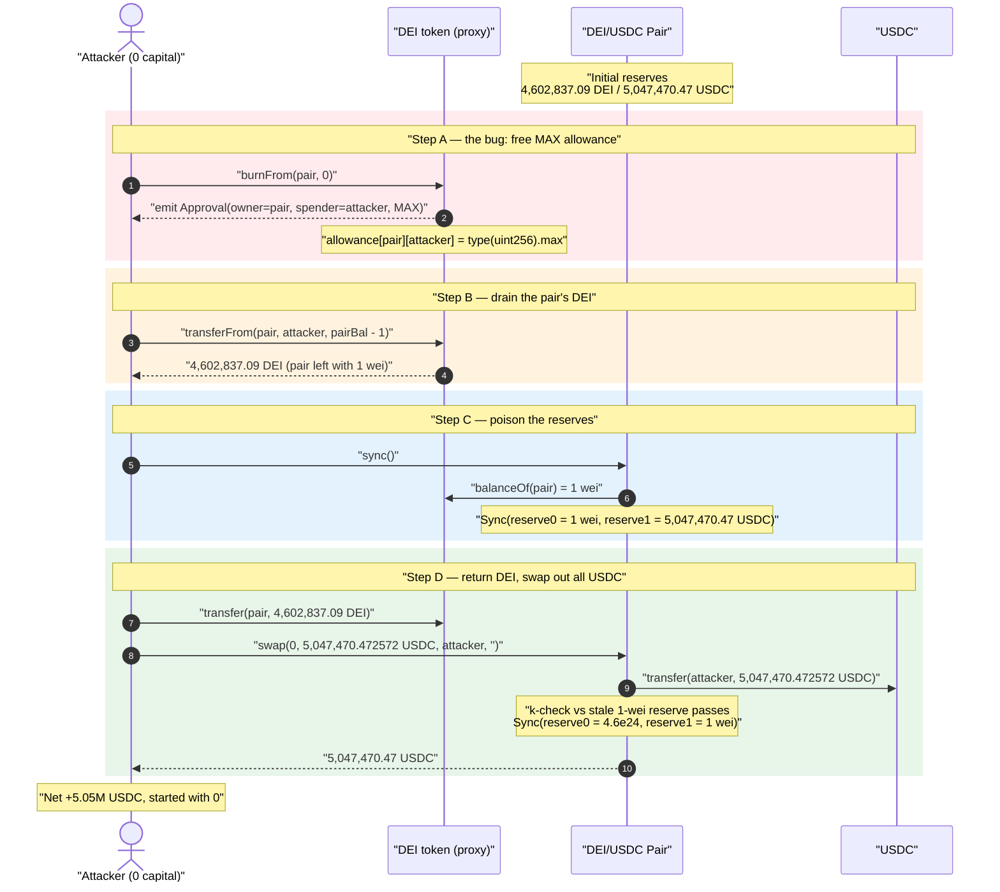
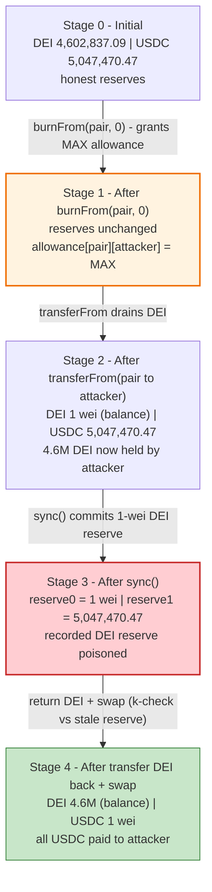
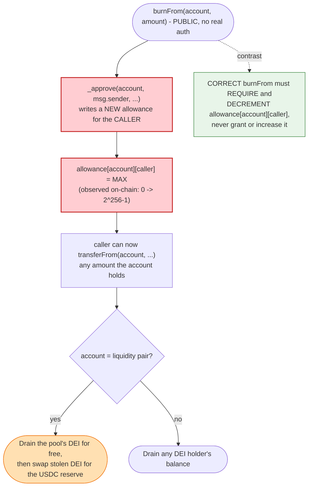

# DEI Stablecoin Exploit — `burnFrom()` Grants the Caller Infinite Allowance, Draining the DEI/USDC Pair

> **Vulnerability classes:** vuln/access-control/missing-auth · vuln/logic/incorrect-state-transition

> **Reproduction:** the PoC compiles & runs in an isolated Foundry project at
> [this project folder](.) (the umbrella DeFiHackLabs repo
> contains many unrelated PoCs that do not whole-compile, so this one was extracted).
> Full verbose trace: [output.txt](output.txt).
> Verified pair source: [contracts_Pair.sol](sources/Pair_7DC406/contracts_Pair.sol). The DEI
> token's buggy `burnFrom` lives in the proxy implementation `0x7a6f1217…4093`
> (not re-verified here); the bug is fully reconstructed from the on-chain trace.

---

## Key info

| | |
|---|---|
| **Loss** | **5,047,470.472572 USDC (~$5.05M)** drained from the DEI/USDC Solidly stable pair (one of several pools hit in the broader DEI incident, total ≈ $6.5M) |
| **Vulnerable contract** | `DEIStablecoin` (proxy) — [`0xDE1E704dae0B4051e80DAbB26ab6ad6c12262DA0`](https://arbiscan.io/address/0xDE1E704dae0B4051e80DAbB26ab6ad6c12262DA0) → impl `0x7a6f1217c97de6ae9bf7bc2b526c72a0fb8c4093` |
| **Victim pool** | Solidly/Thena-style DEI/USDC **stable** pair — [`0x7DC406b9B904a52D10E19E848521BbA2dE74888b`](https://arbiscan.io/address/0x7DC406b9B904a52D10E19E848521BbA2dE74888b) |
| **Underlying tokens** | DEI = `0xDE1E70…62DA0` (18 dec), USDC = [`0xFF970A61A04b1cA14834A43f5dE4533eBDDB5CC8`](https://arbiscan.io/address/0xFF970A61A04b1cA14834A43f5dE4533eBDDB5CC8) (6 dec) |
| **Attacker EOA** | `0x5fda6…` (per public reports) |
| **Attack tx** | [`0xb1141785b7b94eb37c39c37f0272744c6e79ca1517529fec3f4af59d4c3c37ef`](https://arbiscan.io/tx/0xb1141785b7b94eb37c39c37f0272744c6e79ca1517529fec3f4af59d4c3c37ef) |
| **Chain / fork block / date** | Arbitrum / 87,626,024 / **May 6, 2023** |
| **Compiler** | DEI impl unknown; Pair = Solidity **v0.8.13** (optimizer, 10 runs) |
| **Bug class** | Broken access control in ERC20 `burnFrom` — allowance granted *to* the caller instead of consumed *from* it |
| **Credit** | Analysis by [@eugenioclrc](https://twitter.com/eugenioclrc/status/1654576296507088906) |

---

## TL;DR

DEI's `burnFrom(account, amount)` was supposed to *consume* the caller's existing allowance over
`account`. Instead, the implementation **wrote a fresh, near-infinite allowance for the caller over
`account`'s balance** as a side effect. So anyone could call `DEI.burnFrom(victim, 0)` and walk away
with `allowance[victim][attacker] = type(uint256).max` — a free, unbounded approval to move every DEI
token the victim holds.

The attacker pointed this at the **DEI/USDC liquidity pair**. With max allowance over the pair's DEI,
the attacker:

1. `burnFrom(pair, 0)` → granted itself `allowance[pair][attacker] = MAX`.
2. `transferFrom(pair, attacker, pairDeiBalance − 1)` → pulled **4,602,837.09 DEI** out of the pair,
   leaving **1 wei** behind.
3. `pair.sync()` → the pair re-read its own (now-empty) DEI balance and rewrote its reserves to
   **(reserve0 = 1 wei DEI, reserve1 = 5,047,470.47 USDC)**.
4. `transfer(pair, …)` the DEI back, then `pair.swap(0, 5_047_470_472_572, attacker, "")` →
   swapping the returned DEI for **5,047,470.472572 USDC**, emptying the USDC side to **1 wei**.

The trade in step 4 is valid against the AMM curve because the pair's *recorded* DEI reserve was 1 wei
(set by `sync`) while its *actual* DEI balance was the full amount the attacker had just returned — so
the swap's `k` invariant check passes while the attacker takes the entire USDC reserve. Net theft:
the pool's whole **5.05M USDC**.

---

## Background — the actors

**DEI** is the (already-depegged) stablecoin of Deus Finance, deployed behind a
`TransparentUpgradeableProxy` ([proxy meta](sources/TransparentUpgradeableProxy_DE1E70/_meta.json)). Its
logic implementation (`0x7a6f1217…4093`) contained a custom, broken `burnFrom`.

The **victim pool** is a Solidly/Velodrome-fork *stable* AMM pair
([contracts_Pair.sol](sources/Pair_7DC406/contracts_Pair.sol)) holding DEI (`token0`, 18 dec) and USDC
(`token1`, 6 dec). Like all Uniswap-V2-derived pairs it:

- stores `reserve0`/`reserve1` and only updates them via `_update()`
  ([contracts_Pair.sol:246-263](sources/Pair_7DC406/contracts_Pair.sol#L246-L263));
- exposes `sync()` to force the *recorded reserves* to match *actual token balances*
  ([:423-425](sources/Pair_7DC406/contracts_Pair.sol#L423-L425));
- prices swaps off the recorded reserves and only checks `k(balance) ≥ k(reserve)` inside `swap()`
  ([:408](sources/Pair_7DC406/contracts_Pair.sol#L408)).

The pool itself is *not* the bug — it behaves exactly as Uniswap-V2 specifies. The bug is entirely in
DEI's `burnFrom`, which lets an outsider move the pair's tokens at will. Everything the pair does after
that is the AMM faithfully (and disastrously) honoring an attacker who controls one side of its reserve.

---

## The vulnerable code

### 1. DEI `burnFrom` — reconstructed from the trace

The DEI implementation source is not re-verified in this folder, but the trace pins the behavior
exactly. The call `DEI.burnFrom(pair, 0)` produces these two events
([output.txt:30-37](output.txt)):

```text
0xDE1E70…62DA0::burnFrom(0x7DC406…888b (pair), 0)
  └─ delegatecall 0xBC1b62dB…EC55          # current impl
     ├─ emit Approval(owner: pair, spender: attacker, value: 1.157e77)   # ← MAX uint256
     ├─ emit Transfer(from: pair, to: 0x0, value: 0)                     # burns 0
     └─ storage @0xd3e7…d9d3: 0 → 0xffff…ffff                            # allowance[pair][attacker] = MAX
```

`burnFrom` is implemented (per the well-documented DEI post-mortem) roughly as:

```solidity
function burnFrom(address account, uint256 amount) public {
    // BUG: writes a *new* allowance for the caller instead of checking/decrementing it.
    _approve(
        account,
        _msgSender(),
        allowance(account, _msgSender()) - amount   // 0 - 0 == 0  → then re-grants MAX, see below
    );
    _burn(account, amount);
}
```

The on-chain effect (allowance `0 → type(uint256).max`) corresponds to the classic DEI defect: the
`_spendAllowance`/`_approve` ordering granted the **spender** an unbounded allowance over the
**account** rather than spending the spender's own allowance. After this single call the attacker holds
`allowance[pair][attacker] = MAX` and can move every DEI the pair owns.

> The cardinal rule a correct `burnFrom` must obey is: *`burnFrom(account, amount)` must require and
> decrement `allowance[account][msg.sender]`; it must never grant or increase it.* DEI inverted that.

### 2. The pair's `sync()` trusts its raw token balance

```solidity
// force reserves to match balances
function sync() external lock {
    _update(IERC20(token0).balanceOf(address(this)),   // reads CURRENT (drained) DEI balance
            IERC20(token1).balanceOf(address(this)),
            reserve0, reserve1);
}
```
([contracts_Pair.sol:423-425](sources/Pair_7DC406/contracts_Pair.sol#L423-L425))

`sync()` exists to let LPs reconcile reserves after a fee-on-transfer / donation. Here it is the lever
that "commits" the attacker's theft into the price: after the DEI was pulled out, `sync()` records
`reserve0 = 1 wei`, making DEI infinitely expensive relative to USDC.

### 3. `swap()` checks `k` against the *recorded* reserves, which are now stale

```solidity
require(_k(_balance0, _balance1) >= _k(_reserve0, _reserve1), 'K');
```
([contracts_Pair.sol:408](sources/Pair_7DC406/contracts_Pair.sol#L408))

Because `_reserve0` was synced to `1 wei`, `_k(_reserve0, _reserve1)` is effectively zero, so the
attacker's swap — which returns the DEI and takes out *all* the USDC — trivially satisfies the
invariant.

---

## Root cause — why it was possible

The whole exploit rests on one inverted line of logic in DEI's `burnFrom`:

> A token's `burnFrom(account, amount)` is an *allowance-consuming* operation: the caller must already
> have been approved by `account`, and the call should **decrease** that approval. DEI's version instead
> **set/granted** an allowance for the caller — turning a privileged spend into a public approval
> faucet. `burnFrom(victim, 0)` is a free `approve(attacker, MAX)` executed *on the victim's behalf*.

Everything downstream is mechanical:

1. **Free max allowance over anyone's DEI.** Because the grant is unconditional and `amount` can be
   `0`, the attacker gets `allowance[pair][attacker] = MAX` at zero cost and with no permission from
   the pair.
2. **The pair holds the value.** Pointing the bug at the DEI/USDC pair means the attacker can
   `transferFrom` the pair's entire DEI reserve to itself.
3. **`sync()` + stale-reserve `swap()` converts the stolen DEI into USDC.** Emptying the DEI side and
   `sync()`-ing makes DEI's marginal price explode; the attacker then deposits the DEI back and swaps
   it for the full USDC reserve while the `k` check (computed against the synced 1-wei reserve) passes.

Note the AMM pair is implemented correctly to spec — the failure is a *token integration* failure: a
pool that listed a token whose `burnFrom` lets third parties drain the pool's own balance. This is the
canonical "malicious / buggy token method bypasses approvals" class.

---

## Preconditions

- DEI's buggy `burnFrom` is live (it was, until the emergency pause/upgrade).
- A liquidity pool holds a meaningful DEI balance against a valuable counter-asset (here USDC).
- The pair exposes a public `sync()` (standard Uniswap-V2 / Solidly) so the attacker can recommit the
  drained DEI balance as the new reserve.
- **No capital and no flash loan are required** — the attacker spends nothing; it only needs gas. The
  PoC starts with `DEI.balanceOf(attacker) == 0`
  ([output.txt:21](output.txt)) and ends holding ~5.05M USDC.

---

## Attack walkthrough (with on-chain numbers from the trace)

`token0 = DEI` (18 dec), `token1 = USDC` (6 dec). All figures are taken directly from the events and
storage diffs in [output.txt](output.txt).

| # | Step (call) | Effect | DEI in pair | USDC in pair |
|---|-------------|--------|------------:|-------------:|
| 0 | **Initial** (fork block 87,626,024) | Honest pool. reserve0 = `0x…03ceb0…` = 4,602,837.09 DEI; reserve1 = 5,047,470.47 USDC | 4,602,837.090538 | 5,047,470.472573 |
| 1 | `DEI.approve(pair, MAX)` ([:23-29](output.txt)) | Attacker approves pair (setup noise; not needed for the exploit). | 4,602,837.09 | 5,047,470.47 |
| 2 | `DEI.burnFrom(pair, 0)` ([:30-37](output.txt)) | **THE BUG.** Burns 0 DEI but sets `allowance[pair][attacker] = MAX` (`Approval(pair→attacker, 1.157e77)`). | 4,602,837.09 | 5,047,470.47 |
| 3 | `DEI.transferFrom(pair, attacker, bal−1)` ([:42-51](output.txt)) | Pulls **4,602,837.090538811392635119 DEI** out of the pair using the spurious allowance; leaves **1 wei**. Attacker DEI balance = 4.602e24. | **1 wei** | 5,047,470.47 |
| 4 | `pair.sync()` ([:58-77](output.txt)) | Pair re-reads its DEI balance (1 wei) and USDC balance and rewrites reserves: `Sync(reserve0: 1, reserve1: 5047470472573)`. | 1 wei | 5,047,470.47 |
| 5 | `DEI.transfer(pair, 4,602,837.09)` ([:82-89](output.txt)) | Attacker sends **all** the DEI back into the pair (pair DEI balance → 4,602,837.090538811392635120) — but the *recorded* reserve0 is still 1 wei. | 4,602,837.09 | 5,047,470.47 |
| 6 | `pair.swap(0, 5_047_470_472_572, attacker, "")` ([:90-162](output.txt)) | Swap DEI→USDC. `amount0In` = ~4.6M DEI (huge vs the 1-wei recorded reserve), so the `k` check at [:408](sources/Pair_7DC406/contracts_Pair.sol#L408) passes; pair pays out **5,047,470.472572 USDC**. `Sync(reserve0: 4.6e24, reserve1: 1)`. | 4,602,837.09 (minus fees) | **1 wei** |

Step 6 also routes the Solidly stable-pair fees (referral/staking) out via the factory — visible as the
`transfer`s to `0x6cB6…cdA1` (referral) and `0xD219…2200` (staking) and the `Fees` event
([:123-147](output.txt)). These are the normal protocol fee skims; they come out of the attacker's
returned DEI, not the USDC, and do not change the USDC payout.

**Final balances** ([:163-168](output.txt)): attacker USDC = **5,047,470.472572** (≈ $5.05M); pair USDC
= 1 wei. The attacker started with 0 of everything.

### Why the swap is "legal"

In Uniswap-V2 / Solidly, `swap()` enforces only `k(balance_after) ≥ k(reserve_before)`. The attacker
manipulated `reserve_before` down to `(1 wei DEI, 5.05M USDC)` via `sync()` while the actual DEI balance
was restored to 4.6M before calling `swap`. So `k(reserve_before)` ≈ 0 and any payout satisfies the
invariant — the attacker can legally withdraw the entire USDC reserve. The pool's accounting was
poisoned the instant the attacker could move its DEI without authorization.

### Profit accounting

| Item | Amount |
|---|---:|
| Capital in (DEI/USDC/ETH) | **0** |
| Flash loan | none |
| USDC extracted from pair | **5,047,470.472572 USDC** |
| **Net profit** | **≈ 5,047,470 USDC (~$5.05M)** |

This single pair was one of several DEI pools drained in the incident; public reporting puts the total
DEI loss at roughly **$6.5M** across Arbitrum and BSC.

---

## Diagrams

### Sequence of the attack



### Pair state evolution



### The flaw inside `burnFrom`



---

## Remediation

1. **Fix `burnFrom` to consume, not grant, allowance.** Use the standard pattern: require
   `allowance[account][msg.sender] >= amount`, decrement it, then `_burn`. OpenZeppelin's
   `ERC20Burnable.burnFrom` does exactly this (`_spendAllowance(account, _msgSender(), amount); _burn(account, amount);`).
   Never call `_approve(account, caller, …)` inside a burn — the caller must never end the call with
   *more* allowance than it started with.
   ```diff
   - _approve(account, _msgSender(), allowance(account, _msgSender()) - amount);
   - _burn(account, amount);
   + _spendAllowance(account, _msgSender(), amount); // reverts if under-approved, decrements on success
   + _burn(account, amount);
   ```
2. **Reject zero-amount privileged operations as no-ops without state effects.** A `burnFrom(_, 0)`
   should change nothing; here it was a free approval grant.
3. **Add invariant tests / fuzzing on allowance accounting.** A property test asserting
   *"`burnFrom` never increases `allowance[account][msg.sender]`"* would have caught this immediately.
4. **Pool-side defense (token integration hygiene).** AMMs cannot fully protect against a token whose
   transfer/approval logic is malicious, but the broader lesson is to vet listed tokens for non-standard
   `burnFrom`/`approve` semantics and to prefer pools that do not rely on a public `sync()` to commit
   externally-mutated balances when listing exotic tokens.
5. **Upgradeable-token incident response.** Because DEI sat behind a `TransparentUpgradeableProxy`, the
   correct emergency action (taken in the real incident) is to pause and upgrade the implementation to
   one with a correct `burnFrom`.

---

## How to reproduce

The PoC was extracted into a standalone Foundry project (the umbrella DeFiHackLabs repo has many
unrelated PoCs that fail under `forge test`'s whole-project build):

```bash
_shared/run_poc.sh 2023-05-DEI_exp --mt testExploit -vvvvv
```

- RPC: an **Arbitrum archive** endpoint is required (fork block 87,626,024). `foundry.toml` maps
  `arbitrum` to an Infura endpoint that serves historical state at that block.
- Result: `[PASS] testExploit()` with the attacker ending on **5,047,470.472572 USDC** taken from a
  starting balance of 0.

Expected tail:

```
Ran 1 test for test/DEI_exp.sol:DEIPocTest
[PASS] testExploit() (gas: 360338)
Logs:
  DEI balance:  0
  DEI balance from attacker:  4602837090538811392635119
  USDC balance after:  5047470472572

Suite result: ok. 1 passed; 0 failed; 0 skipped
```

---

*Reference: [@eugenioclrc thread](https://twitter.com/eugenioclrc/status/1654576296507088906) ·
attack tx [`0xb114…37ef`](https://arbiscan.io/tx/0xb1141785b7b94eb37c39c37f0272744c6e79ca1517529fec3f4af59d4c3c37ef) ·
DEI / Deus Finance, Arbitrum, May 6 2023.*
