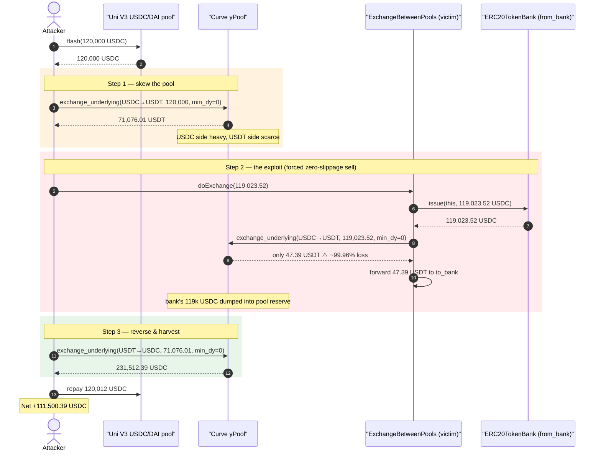
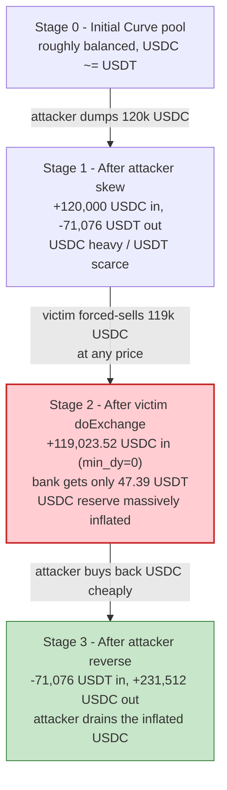
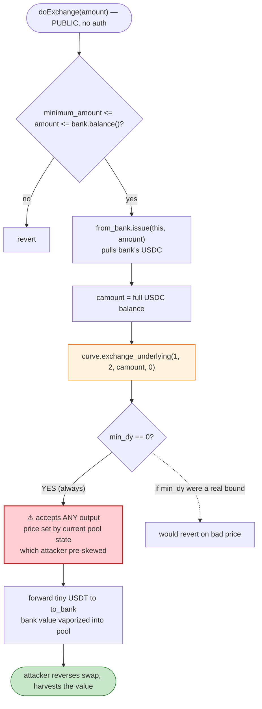

# ERC20TokenBank / ExchangeBetweenPools Exploit — Zero-Slippage Curve Swap Sandwich

> **Vulnerability classes:** vuln/defi/slippage · vuln/defi/sandwich-attack · vuln/logic/missing-validation

> **Reproduction:** the PoC compiles & runs in an isolated Foundry project at
> [this project folder](.) (the umbrella DeFiHackLabs repo contains many unrelated
> PoCs that do not compile together, so this one was extracted).
> Full verbose trace: [output.txt](output.txt).
> Verified vulnerable source: [ExchangeBetweenPools.sol](sources/ExchangeBetweenPools_765b8d/ExchangeBetweenPools.sol).

---

## Key info

| | |
|---|---|
| **Loss** | ~$111,500 — **111,500.39 USDC** extracted in a single transaction |
| **Vulnerable contract** | `ExchangeBetweenPools` — [`0x765b8d7Cd8FF304f796f4B6fb1BCf78698333f6D`](https://etherscan.io/address/0x765b8d7Cd8FF304f796f4B6fb1BCf78698333f6D#code) |
| **Victim funds** | `ERC20TokenBank` (`from_bank`) — [`0x9Ab872A34139015Da07EE905529a8842a6142971`](https://etherscan.io/address/0x9Ab872A34139015Da07EE905529a8842a6142971) holding **119,023.52 USDC** |
| **Manipulated AMM** | Curve **yPool** (yDAI/yUSDC/yUSDT/yTUSD) — [`0x45F783CCE6B7FF23B2ab2D70e416cdb7D6055f51`](https://etherscan.io/address/0x45F783CCE6B7FF23B2ab2D70e416cdb7D6055f51) |
| **Flash-loan source** | Uniswap V3 USDC/DAI pool — [`0x5777d92f208679DB4b9778590Fa3CAB3aC9e2168`](https://etherscan.io/address/0x5777d92f208679DB4b9778590Fa3CAB3aC9e2168) |
| **Attacker EOA** | [`0xc0ffeebabe5d496b2dde509f9fa189c25cf29671`](https://etherscan.io/address/0xc0ffeebabe5d496b2dde509f9fa189c25cf29671) |
| **Attacker contract** | [`0x7c28e0977f72c5d08d5e1ac7d52a34db378282b3`](https://etherscan.io/address/0x7c28e0977f72c5d08d5e1ac7d52a34db378282b3) |
| **Attack tx** | [`0x578a195e05f04b19fd8af6358dc6407aa1add87c3167f053beb990d6b4735f26`](https://etherscan.io/tx/0x578a195e05f04b19fd8af6358dc6407aa1add87c3167f053beb990d6b4735f26) |
| **Chain / block / date** | Ethereum mainnet / fork at block 17,376,906 / ~May 2023 |
| **Compiler (victim)** | Solidity **v0.5.10**, optimizer enabled (200 runs) |
| **Bug class** | Missing slippage protection (`min_dy = 0`) on a forced, permissionlessly-triggerable Curve swap |

---

## TL;DR

`ExchangeBetweenPools.doExchange()` ([ExchangeBetweenPools.sol:230-244](sources/ExchangeBetweenPools_765b8d/ExchangeBetweenPools.sol#L230-L244))
takes USDC out of a partner `ERC20TokenBank`, immediately market-sells **all of it**
into the Curve yPool via `exchange_underlying(1, 2, camount, 0)` — and the last argument,
`min_dy`, is **hard-coded to `0`**. There is no oracle, no slippage bound, and the function is **callable by anyone**.

The attacker simply wraps that forced swap in a flash-loan sandwich:

1. **Flash-borrow 120,000 USDC** from a Uniswap V3 pool.
2. **Skew the Curve pool** by dumping the borrowed 120,000 USDC into it (USDC→USDT), driving the
   USDC side heavy and the USDT side scarce.
3. **Call the victim's `doExchange()`**, which dutifully sells the bank's **119,023.52 USDC** into the
   *already-poisoned* pool with `min_dy = 0`. At the manipulated price it receives only **47.39 USDT** —
   a ~99.96% loss — and the pool's USDC side becomes even more bloated.
4. **Swap back** the attacker's USDT for USDC. Because the bank's huge USDC dump moved the curve, the
   attacker's USDT now redeems for **231,512.39 USDC**.
5. **Repay the flash loan** (120,012 USDC) and keep the rest.

Net profit: **111,500.39 USDC** — essentially the entire balance of the victim bank, with no collateral
and no privileges required.

---

## Background — what these contracts do

`ERC20TokenBank` (`from_bank`, [`0x9Ab8…2971`](https://etherscan.io/address/0x9Ab872A34139015Da07EE905529a8842a6142971))
is a simple treasury that holds USDC and lets *trusted* callers `issue()` (withdraw) tokens out of it. In the trace
its `issue()` checks `is_trusted(caller)` ([output.txt:270](output.txt)) and `ExchangeBetweenPools` is whitelisted, so
the bank will hand over its full USDC balance on demand.

`ExchangeBetweenPools` ([source](sources/ExchangeBetweenPools_765b8d/ExchangeBetweenPools.sol)) is glue that is
supposed to rebalance the bank's holdings: pull USDC out of `from_bank`, convert it to USDT through Curve, and deposit
the USDT into `to_bank` ([`0x21A3…345C`](https://etherscan.io/address/0x21A3dbeE594a3419D6037D6D8Cee0B1E10Bf345C)).
Its constructor resolves `curve` to the Curve yPool deposit's underlying pool
([ExchangeBetweenPools.sol:217-218](sources/ExchangeBetweenPools_765b8d/ExchangeBetweenPools.sol#L217-L218)).

The Curve **yPool** ([`0x45F7…5f51`](https://etherscan.io/address/0x45F783CCE6B7FF23B2ab2D70e416cdb7D6055f51), Vyper
`0.1.0b16`) is a 4-asset stablecoin pool (yDAI/yUSDC/yUSDT/yTUSD). `exchange_underlying(i, j, dx, min_dy)` swaps the
underlying stable `i` for underlying `j`; `min_dy` is the caller-supplied minimum acceptable output. Index `1` = USDC,
index `2` = USDT (confirmed by the `TokenExchangeUnderlying` events in the trace, e.g.
[output.txt:257](output.txt)).

The on-chain facts at the fork block:

| Fact | Value | Source |
|---|---|---|
| USDC held by `from_bank` (the prize) | **119,023.523157 USDC** | [output.txt:266](output.txt) |
| `ExchangeBetweenPools` whitelisted in bank | `is_trusted = 1` | [output.txt:270-271](output.txt) |
| Curve `min_dy` passed by victim | **0** (no slippage bound) | [ExchangeBetweenPools.sol:238](sources/ExchangeBetweenPools_765b8d/ExchangeBetweenPools.sol#L238) |
| `doExchange` access control | **none** (`public`) | [ExchangeBetweenPools.sol:230](sources/ExchangeBetweenPools_765b8d/ExchangeBetweenPools.sol#L230) |

---

## The vulnerable code

### `doExchange` — forced, full-balance, zero-slippage market sell

```solidity
function doExchange(uint256 amount) public returns(bool){          // ← anyone can call
    require(amount >= minimum_amount, "invalid amount");
    require(amount <= ERC20TokenBankInterface(from_bank).balance(), "too much amount");

    ERC20TokenBankInterface(from_bank).issue(address(this), amount); // pull USDC out of the bank

    uint256 camount = usdc.balanceOf(address(this));                 // sell the WHOLE balance...
    usdc.safeApprove(address(curve), camount);
    curve.exchange_underlying(1, 2, camount, 0);                     // ⚠️ min_dy = 0 → no slippage check

    uint256 namount = usdt.balanceOf(address(this));
    usdt.safeTransfer(to_bank, namount);                             // forward whatever came out

    return true;
}
```

[ExchangeBetweenPools.sol:230-244](sources/ExchangeBetweenPools_765b8d/ExchangeBetweenPools.sol#L230-L244)

Three independent design errors stack here:

1. **`min_dy = 0`** — the swap accepts *any* output, including near-zero. There is no oracle price reference,
   no `get_virtual_price()` sanity bound (even though the `PriceInterface` exposes one,
   [ExchangeBetweenPools.sol:181-185](sources/ExchangeBetweenPools_765b8d/ExchangeBetweenPools.sol#L181-L185), it is never used).
2. **No access control** — `doExchange` is `public`, so an arbitrary attacker decides *when* the swap fires,
   i.e. immediately after they have poisoned the pool.
3. **Full-balance sell** — it sells `usdc.balanceOf(address(this))` (the bank's entire 119k USDC) in one shot,
   maximizing the price impact and therefore the value the attacker can capture.

### `PriceInterface` — the unused safety it ignores

```solidity
contract PriceInterface{
  function get_virtual_price() public view returns(uint256);                 // never called
  function exchange_underlying(int128 i, int128 j, uint256 dx, uint256 min_dy) public;
  function exchange(int128 i, int128 j, uint256 dx, uint256 min_dy) public;
}
```

[ExchangeBetweenPools.sol:181-185](sources/ExchangeBetweenPools_765b8d/ExchangeBetweenPools.sol#L181-L185)

---

## Root cause

A Curve `exchange_underlying` price is a pure function of the pool's *current* balances. With `min_dy = 0`,
the swap will execute at whatever price the pool is in at the instant it runs — and that instant is chosen by
the caller. The `doExchange` flow therefore exposes an entirely **uncompensated, attacker-timed market order**:

> The bank's value is converted at a price the attacker controls. The attacker pushes the Curve pool to an
> extreme imbalance, then calls `doExchange()` to make the bank *sell into that extreme at any price*, and finally
> reverses their own position to harvest the value the bank just gave up.

This is the canonical "swap without slippage protection" bug, made worse by being **permissionless** and
**full-balance**. The flash loan is merely working capital — the attacker recovers it intra-transaction, so the
attack has effectively zero cost of funds.

---

## Preconditions

- The victim bank holds a meaningful USDC balance (here 119,023.52 USDC) and `ExchangeBetweenPools` is
  `is_trusted` in that bank so `issue()` succeeds ([output.txt:269-285](output.txt)).
- `amount` passed to `doExchange` satisfies `minimum_amount ≤ amount ≤ bank.balance()`. The attacker passes the
  exact bank balance (`119_023_523_157`, [ERC20TokenBank_exp.sol:31,55](test/ERC20TokenBank_exp.sol#L31)).
- Working capital in USDC to skew the Curve pool. This is **flash-loanable** — the PoC borrows 120,000 USDC from a
  Uniswap V3 pool via `Pair.flash(...)` ([ERC20TokenBank_exp.sol:46](test/ERC20TokenBank_exp.sol#L46)) and repays it
  in the same callback ([ERC20TokenBank_exp.sol:57](test/ERC20TokenBank_exp.sol#L57)).

---

## Attack walkthrough (with on-chain numbers from the trace)

All figures are taken directly from the `TokenExchangeUnderlying` / `Transfer` / `Flash` events in
[output.txt](output.txt). USDC and USDT both have 6 decimals.

| # | Step | Call | Output | Source |
|---|------|------|-------:|--------|
| 0 | **Flash-borrow** 120,000 USDC from the Uni V3 USDC/DAI pool | `Pair.flash(this, 0, 120_000e6, …)` | +120,000 USDC | [output.txt:35,42](output.txt) |
| 1 | **Skew the pool** — attacker dumps the borrowed USDC into Curve | `exchange_underlying(1, 2, 120_000e6, 0)` | 71,076.01 USDT | [output.txt:51,257](output.txt) |
| 2 | **Trigger the victim** — bank issues its full 119,023.52 USDC to `ExchangeBetweenPools`, which sells it into the now-poisoned pool at `min_dy = 0` | `doExchange(119_023_523_157)` → `exchange_underlying(1, 2, 119_023.52e6, 0)` | **47.39 USDT** | [output.txt:262,507](output.txt) |
| 2b | …the 47.39 USDT (the bank's entire "proceeds") is forwarded to `to_bank` | `usdt.safeTransfer(to_bank, 47_391_215)` | — | [output.txt:514](output.txt) |
| 3 | **Reverse** — attacker swaps its 71,076.01 USDT back for USDC; the bank's huge USDC dump moved the curve in its favor | `exchange_underlying(2, 1, 71_076.01e6, 0)` | **231,512.39 USDC** | [output.txt:523,730](output.txt) |
| 4 | **Repay** the flash loan (principal + 12 USDC fee) | `usdc.transfer(pair, 120_012e6)` | −120,012 USDC | [output.txt:735,750](output.txt) |
| 5 | **Profit** — leftover USDC retained by the attacker | `balanceOf(attacker)` | **111,500.39 USDC** | [output.txt:756,762](output.txt) |

**The crux (step 2):** the bank sold **119,023.52 USDC and received 47.39 USDT** — an exchange rate of roughly
**2,511 USDC per USDT**, when fair value is ~1:1. With `min_dy = 0`, nothing reverted. That ~119,000 USDC of value
did not vanish; it was injected into the Curve pool's USDC reserve, which is exactly what made the attacker's
reverse swap (step 3) redeem 71,076 USDT for 231,512 USDC.

### Profit accounting (USDC, 6 dp)

| Direction | Amount (USDC) |
|---|---:|
| Flash-loan principal (in) | +120,000.00 |
| Skew swap out (→ 71,076.01 USDT held) | −120,000.00 |
| Reverse swap (71,076.01 USDT → USDC) | +231,512.39 |
| Flash-loan repayment (principal + 12 fee) | −120,012.00 |
| **Net retained** | **+111,500.39** |

The attacker's net **111,500.39 USDC** is funded almost entirely by the bank's catastrophic step-2 swap
(119,023.52 USDC sold for 47.39 USDT). The PoC's final log confirms it to the wei:
`Attacker USDC balance after exploit: 111500.390369` ([output.txt:5,762](output.txt)).

---

## Diagrams

### Sequence of the attack



### Pool state intuition — how the bank's value is transferred



### The flaw inside `doExchange`



---

## Why each magic number

- **Flash borrow 120,000 USDC** ([ERC20TokenBank_exp.sol:46](test/ERC20TokenBank_exp.sol#L46)): just enough working
  capital to push the Curve pool into a strong imbalance before the victim swap. It is fully repaid
  ([output.txt:735](output.txt)), so size is bounded only by available flash liquidity.
- **`doExchange(119_023_523_157)`** ([ERC20TokenBank_exp.sol:31,55](test/ERC20TokenBank_exp.sol#L31)): exactly the
  bank's USDC balance ([output.txt:266](output.txt)), so the maximum possible amount is force-sold at the
  manipulated price.
- **`min_dy = 0`** on both attacker swaps ([ERC20TokenBank_exp.sol:54,56](test/ERC20TokenBank_exp.sol#L54)): the
  attacker doesn't need slippage protection for itself — it is *exploiting* the victim's lack of it. The harm comes
  entirely from the victim's hard-coded `0` at [ExchangeBetweenPools.sol:238](sources/ExchangeBetweenPools_765b8d/ExchangeBetweenPools.sol#L238).

---

## Remediation

1. **Enforce slippage / oracle bounds on every swap.** Replace `exchange_underlying(1, 2, camount, 0)` with a
   non-zero `min_dy` derived from a trusted reference (e.g. `get_virtual_price()` is already exposed but unused, or an
   off-chain quote with a deadline). A swap that can return ~0 must always revert.
2. **Restrict `doExchange`.** It moves the entire bank balance and should never be permissionless. Gate it behind
   `onlyOwner`/keeper, or behind a trusted automation contract — so an attacker cannot choose the moment of the swap.
3. **Cap per-call size / rate-limit.** Selling the full balance in one transaction maximizes price impact; chunking
   the rebalance over time or capping single-swap notional drastically reduces extractable value.
4. **Validate received amount against expectation.** After the swap, assert that the USDT received is within an
   expected band of the USDC sold (stable≈stable), reverting on anomaly.
5. **Treat reserve-derived prices as untrusted within a transaction.** Any logic that relies on an AMM spot price is
   manipulable by a flash loan; require a TWAP or external oracle.

---

## How to reproduce

The PoC was extracted into a standalone Foundry project (the umbrella DeFiHackLabs repo has many unrelated PoCs that
fail to compile under a whole-project `forge test` build):

```bash
_shared/run_poc.sh 2023-05-ERC20TokenBank_exp -vvvvv
```

- RPC: an **Ethereum mainnet archive** endpoint is required (the fork is pinned to block `17_376_906` in
  `setUp()`, [ERC20TokenBank_exp.sol:36](test/ERC20TokenBank_exp.sol#L36)). `foundry.toml` points `mainnet` at an
  Infura archive URL; most pruned public RPCs will fail with `missing trie node` at that historical block.
- Result: `[PASS] testExploit()`.

Expected tail:

```
Ran 1 test for test/ERC20TokenBank_exp.sol:ContractTest
[PASS] testExploit() (gas: 1592733)
Logs:
  Attacker USDC balance after exploit: 111500.390369

Suite result: ok. 1 passed; 0 failed; 0 skipped
```

---

*References: BlockSec — https://twitter.com/BlockSecTeam/status/1663810037788311561 (ERC20TokenBank / ExchangeBetweenPools, Ethereum, ~$111K).*
