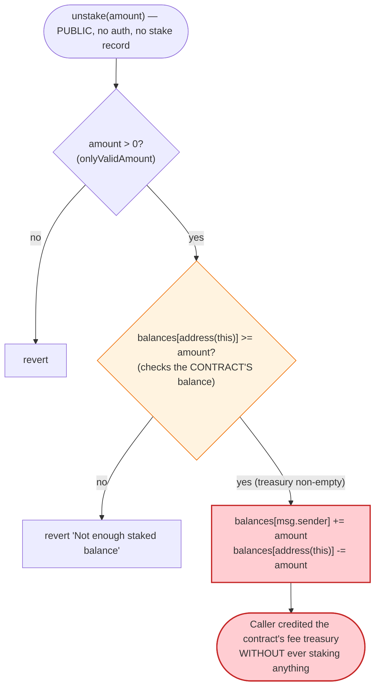
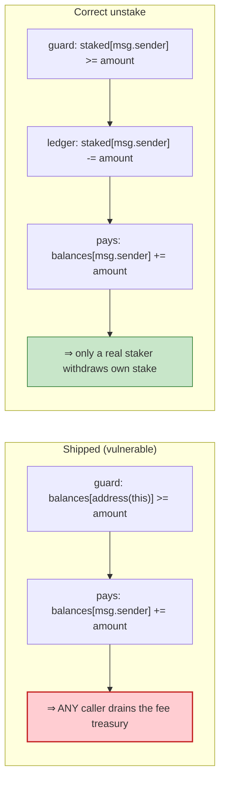

# FAPEN (Father Pepe Inu) Exploit — `unstake()` Mints Free Tokens via Backwards Balance Check

> **Vulnerability classes:** vuln/access-control/missing-auth · vuln/logic/missing-check · vuln/logic/state-update

> **Reproduction:** the PoC compiles & runs in an isolated Foundry project at
> [this project folder](.) (the umbrella DeFiHackLabs repo contains many
> unrelated PoCs that do not whole-compile, so this one was extracted).
> Full verbose trace: [output.txt](output.txt).
> Verified vulnerable source: [FatherPepeInu.sol](sources/FatherPepeInu_f3F1aB/FatherPepeInu.sol).

---

## Key info

| | |
|---|---|
| **Loss** | ~$600 — **2.042256597375684021 WBNB** drained from the FAPEN/WBNB PancakeSwap pair |
| **Vulnerable contract** | `FatherPepeInu` (FAPEN) — [`0xf3F1aBae8BfeCA054B330C379794A7bf84988228`](https://bscscan.com/address/0xf3F1aBae8BfeCA054B330C379794A7bf84988228#code) |
| **Victim pool** | FAPEN/WBNB PancakeSwap-V2 pair — [`0x1d1043D07B842c97a948E51c50470FDc7A02B9da`](https://bscscan.com/address/0x1d1043D07B842c97a948E51c50470FDc7A02B9da) |
| **Attacker EOA / contract** | the exploit is a single self-contained transaction; the PoC harness `ContractTest` stands in for the attacker contract |
| **Router** | PancakeSwap V2 Router — [`0x10ED43C718714eb63d5aA57B78B54704E256024E`](https://bscscan.com/address/0x10ED43C718714eb63d5aA57B78B54704E256024E) |
| **Attack tx / analysis** | [hexagate writeup](https://twitter.com/hexagate_/status/1663501550600302601) |
| **Chain / block / date** | BSC / 28,637,846 / ~May 29, 2023 |
| **Compiler** | Solidity `v0.8.9+commit.e5eed63a`, optimizer **off** (200 runs nominal) |
| **Bug class** | Broken access control / accounting — a public `unstake()` with an inverted balance check mints the *contract's own* token balance to any caller for free |

---

## TL;DR

`FatherPepeInu` collects a 1% fee on every transfer into its **own** contract balance
(`balances[address(this)]`). It exposes a public function `unstake(uint256 amount)` that is *supposed*
to return previously-staked tokens to a user — but the contract has **no staking ledger at all**.
The function's only guard is `require(balances[address(this)] >= amount, ...)`: it checks that the
**contract itself** holds at least `amount`, then **credits the caller** with that amount and debits
the contract ([FatherPepeInu.sol:106-111](sources/FatherPepeInu_f3F1aB/FatherPepeInu.sol#L106-L111)).

Because there is no per-user staked-balance accounting, **anyone** can call
`unstake(balanceOf(address(this)))` and walk away with every fee token the contract has accumulated —
no prior deposit, no stake, no authorization. The attacker then dumps those free tokens into the
FAPEN/WBNB pool and converts them to BNB.

In the reproduced transaction the contract held **9,521,992.386510669 FAPEN** of accumulated fees.
The attacker `unstake`d all of it (paying nothing), sold it through the PancakeSwap router, and
received **2.0423 WBNB** starting from a zero balance.

---

## Background — what FatherPepeInu does

`FatherPepeInu` ([source](sources/FatherPepeInu_f3F1aB/FatherPepeInu.sol)) is a minimal "meme" ERC-20
with a transfer fee bolted on:

- **9-decimal token**, fixed `totalSupply = 1,000,000,000 × 10⁹` (1e18 base units), all minted to the
  deployer in the constructor ([:42-45](sources/FatherPepeInu_f3F1aB/FatherPepeInu.sol#L42-L45)).
- **1% transfer fee** — both `transfer` and `transferFrom` skim `fee = amount × feeSeller/100`
  (or `feeBuyer/100`) and route it to `address(this)`, the token contract itself
  ([:51-59](sources/FatherPepeInu_f3F1aB/FatherPepeInu.sol#L51-L59),
  [:81-95](sources/FatherPepeInu_f3F1aB/FatherPepeInu.sol#L81-L95)). Over the token's life these fees
  pile up in `balances[address(this)]`.
- A function literally named **`unstake`** ([:106-111](sources/FatherPepeInu_f3F1aB/FatherPepeInu.sol#L106-L111))
  whose name implies a staking mechanism — but **there is no `stake()` function, no staking mapping,
  and no record of who deposited what**. The contract never tracks staked balances anywhere.

The whole exploit hinges on that last fact: `unstake` reads from and writes to `balances` directly,
with a check that points at the *wrong* account.

---

## The vulnerable code

```solidity
function unstake(uint256 amount) external onlyValidAmount(amount) {
    require(balances[address(this)] >= amount, "Not enough staked balance to unstake");

    balances[msg.sender]      += amount;   // ← credit the CALLER
    balances[address(this)]   -= amount;   // ← debit the CONTRACT
}
```
[FatherPepeInu.sol:106-111](sources/FatherPepeInu_f3F1aB/FatherPepeInu.sol#L106-L111)

There is no `stake()` counterpart and no `staked[msg.sender]` mapping anywhere in the contract — the
only state are the standard `balances` and `allowances` mappings
([:23-24](sources/FatherPepeInu_f3F1aB/FatherPepeInu.sol#L23-L24)). Contrast with a correct
unstaking primitive, which must verify that *the caller* has a recorded staked position:

```solidity
// WHAT A CORRECT unstake WOULD CHECK (not present here):
require(staked[msg.sender] >= amount, "...");
staked[msg.sender] -= amount;
balances[msg.sender] += amount;   // funded from a pool the user previously deposited into
```

The shipped version checks `balances[address(this)]` — the **contract's** balance, which is funded by
fees from *every* user — and then hands that amount to **`msg.sender`** without ever asking whether
`msg.sender` deposited anything. It is effectively a public faucet that pays out the fee treasury.

---

## Root cause — why it was possible

Two independent design errors compose into a free-mint:

1. **Wrong subject in the balance check.** The guard validates the *source* of funds
   (`balances[address(this)]`) instead of the *caller's entitlement*. A function that pays the caller
   must verify the caller's claim, not merely that the till is non-empty. Here the only precondition is
   "the contract has tokens," which is always true while fees accrue.
2. **No staking ledger exists.** The function is named `unstake` but the protocol has no `stake`
   function and no `staked[]` mapping. Without per-user accounting there is *no possible* correct
   implementation — the function cannot tell a legitimate unstaker from an arbitrary caller, so it
   treats everyone as entitled to the entire treasury.

The net effect: `balances[address(this)]` (the accumulated transfer-fee pot) is **withdrawable by
anyone, in full, with a single permissionless call.** The attacker then needs only a liquid market to
convert the windfall to BNB — which PancakeSwap provides.

---

## Preconditions

- The contract has accumulated some fee balance, i.e. `balances[address(this)] > 0` (it was
  **9,521,992.386510669 FAPEN** at the fork block). Any prior transfer activity satisfies this.
- A FAPEN/WBNB liquidity pool exists to sell the windfall into (it did, with **5.4509 WBNB** of
  reserve).
- `amount > 0` to pass the `onlyValidAmount` modifier
  ([:37-40](sources/FatherPepeInu_f3F1aB/FatherPepeInu.sol#L37-L40)).

No flash loan, no privileged role, no capital is required — the attacker starts with **0 BNB**.

---

## Attack walkthrough (with on-chain numbers from the trace)

All figures are taken directly from [output.txt](output.txt). The PoC is in
[test/FAPEN_exp.sol](test/FAPEN_exp.sol). Token amounts are shown in human units (FAPEN has 9
decimals, WBNB has 18).

The pair's reserves at block 28,637,846 (`getReserves()` →
`5450932044005715904, 15694636930535451`). FAPEN (`0xf3f1…`) sorts **after** WBNB (`0xbb4c…`), so
`token0 = WBNB`, `token1 = FAPEN` ⇒ **reserveWBNB = 5.4509 WBNB**, **reserveFAPEN = 15,694,636.93 FAPEN**.

| # | Step | Trace evidence | Effect |
|---|------|----------------|--------|
| 0 | **Start** — attacker has 0 BNB; read `FAPEN.balanceOf(FAPEN)` | `balanceOf(FAPEN) = 9521992386510669` ([L25-26](output.txt)) | Contract holds **9,521,992.39 FAPEN** of accrued fees. |
| 1 | **`unstake(9521992386510669)`** — drain the whole treasury to self | storage: attacker slot `0 → 0x21d4339dc07f4d`, contract slot `0x21d4339dc07f4d → 0` ([L27-31](output.txt)) | Attacker now holds **9,521,992.39 FAPEN**, paid **nothing**. |
| 2 | **`approve(Router, type(uint256).max)`** | [L32-36](output.txt) | Let the router pull the FAPEN. |
| 3 | **`swapExactTokensForETHSupportingFeeOnTransferTokens(9521992386510669, 0, [FAPEN,WBNB], self, …)`** | [L39](output.txt) | Sell the entire windfall for BNB. |
| 3a | `transferFrom` applies the 1% fee on the way into the pool | `Transfer(self→pair, 9426772462645563)` + `Transfer(self→FAPEN, 95219923865106)` ([L40-48](output.txt)) | **9,426,772.46 FAPEN** reach the pair; **95,219.92 FAPEN** skimmed back to the contract as fee. |
| 3b | Pair `swap()` pays out WBNB | `Swap(amount1In = 9426772462645563, amount0Out = 2042256597375684021)` ([L53-65](output.txt)) | Pair FAPEN reserve → **25,121,409.39 FAPEN**; **2.0423 WBNB** out to the router. |
| 3c | Router unwraps WBNB → BNB to attacker | `WBNB.withdraw(2042256597375684021)` → `receive{value: 2042256597375684021}` ([L73-81](output.txt)) | Attacker receives **2.042256597375684021 BNB**. |
| 4 | **End** | `Amount of BNB after attack: 2.042256597375684021` ([L83](output.txt)) | Pure profit from a zero start. |

### Verifying the swap math

PancakeSwap-V2 `getAmountOut` with the 0.25% fee (`9975/10000`):

```
amountOut = (amountIn·9975·reserveOut) / (reserveIn·10000 + amountIn·9975)
          = (9,426,772,462,645,563 · 9975 · 5,450,932,044,005,715,904)
            / (15,694,636,930,535,451 · 10000 + 9,426,772,462,645,563 · 9975)
          = 2,042,256,597,375,684,021  ✓  (matches the trace to the wei)
```

(`reserveIn` = FAPEN side = 15,694,636,930,535,451; `reserveOut` = WBNB side =
5,450,932,044,005,715,904.)

### Profit / loss accounting

| Item | Amount |
|---|---:|
| Attacker BNB in | **0** |
| FAPEN obtained free via `unstake` | 9,521,992.386510669 FAPEN |
| FAPEN delivered to pool (after 1% sell fee) | 9,426,772.462645564 FAPEN |
| Fee skimmed back to the FAPEN contract | 95,219.923865106 FAPEN |
| WBNB received from the pool | 2.042256597375684021 WBNB |
| BNB at end | **2.042256597375684021 BNB** |
| **Net profit** | **+2.0423 BNB (~$600)** |

The loss is borne by the FAPEN/WBNB pool's LPs (their WBNB is bought out with tokens the attacker
never paid for) and by every prior FAPEN user whose accumulated transfer fees were swept out of the
contract.

---

## Diagrams

### Sequence of the attack

```mermaid
sequenceDiagram
    autonumber
    actor A as "Attacker (starts 0 BNB)"
    participant T as "FAPEN token"
    participant R as "PancakeRouter"
    participant P as "FAPEN/WBNB Pair"
    participant W as "WBNB"

    Note over T: "balances[FAPEN] = 9,521,992.39 FAPEN<br/>(accrued 1% transfer fees)"

    rect rgb(255,235,238)
    Note over A,T: "Step 1 — the bug: free withdrawal"
    A->>T: "unstake(balanceOf(FAPEN))"
    Note over T: "require(balances[address(this)] >= amount)<br/>checks CONTRACT, not caller"
    T->>T: "balances[A] += 9.52M;  balances[FAPEN] -= 9.52M"
    Note over A: "Attacker now holds 9,521,992.39 FAPEN, paid nothing"
    end

    rect rgb(232,245,233)
    Note over A,P: "Steps 2-3 — convert to BNB"
    A->>T: "approve(Router, max)"
    A->>R: "swapExactTokensForETHSupportingFeeOnTransferTokens(9.52M FAPEN)"
    R->>T: "transferFrom(A -> pair, 9,426,772.46)  (1% fee -> FAPEN)"
    R->>P: "swap()"
    P->>W: "transfer(Router, 2.0423 WBNB)"
    R->>W: "withdraw(2.0423)"
    R-->>A: "2.042256597375684021 BNB"
    end

    Note over A: "Net +2.0423 BNB"
```

### Control flow of the flawed `unstake()`



### Where the check should point vs. where it points



---

## Remediation

1. **Introduce a real staking ledger and check the caller, not the contract.** If `unstake` is meant
   to return user deposits, add a `mapping(address => uint256) staked`, populate it in a `stake()`
   function, and guard with `require(staked[msg.sender] >= amount)` while decrementing
   `staked[msg.sender]`. The subject of the entitlement check must be `msg.sender`, never
   `address(this)`.
2. **If there is no staking product, delete `unstake` entirely.** The function as written is a public
   withdrawal of the contract's own balance to arbitrary callers — it serves no legitimate purpose and
   must be removed.
3. **Protect the fee treasury.** Tokens accumulated in `balances[address(this)]` (the 1% fee pot)
   should only be movable by an `onlyOwner`/treasury function with explicit intent (e.g. a controlled
   `withdrawFees(to, amount)`), never by an unauthenticated path.
4. **Add tests that assert "a caller who never staked cannot `unstake`."** The bug would have been
   caught by a single negative test: `unstake` from a fresh address with no deposit must revert.

---

## How to reproduce

The PoC was extracted into a standalone Foundry project (the umbrella DeFiHackLabs repo has many
unrelated PoCs that fail to compile under a whole-project `forge build`):

```bash
_shared/run_poc.sh 2023-05-FAPEN_exp -vvvvv
```

- RPC: a **BSC archive** endpoint is required (`createSelectFork("bsc", 28_637_846)` — the block is far
  in the past, so pruned/public RPCs may fail with `header not found` / `missing trie node`).
- Result: `[PASS] testUnstake()` with the attacker ending at **2.0423 BNB** from a 0-BNB start.

Expected tail:

```
Ran 1 test for test/FAPEN_exp.sol:ContractTest
[PASS] testUnstake() (gas: 152410)
Logs:
  Amount of BNB before attack: 0.000000000000000000
  Amount of BNB after attack: 2.042256597375684021

Suite result: ok. 1 passed; 0 failed; 0 skipped
```

---

*Reference: hexagate analysis — https://twitter.com/hexagate_/status/1663501550600302601 (FAPEN, BSC, ~$600).*
