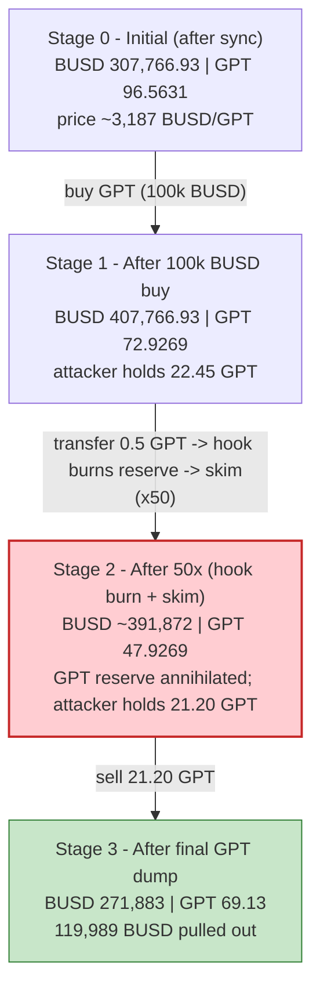
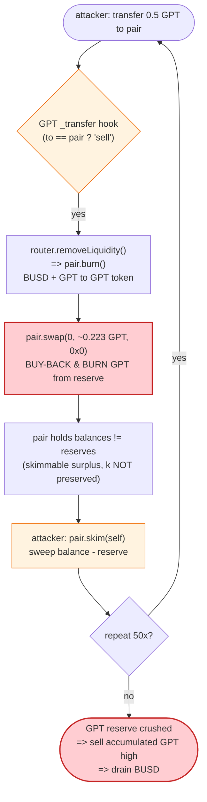

# GPT Token Exploit — Deflationary `transfer`-Hook + `skim()` Pool Drain

> **One-line summary:** A reflectionary/deflationary token (`GPT`) runs `removeLiquidity` + buy-back-and-burn logic *inside its own transfer hook*; by repeatedly poking that hook against the BUSD/GPT pair and harvesting the surplus with `pair.skim()`, the attacker mispriced the pool until ~21 GPT was worth ~120,000 BUSD, netting ~19,989 BUSD on a flash-loaned BUSD stack.

> **Reproduction:** the PoC compiles & runs in an isolated Foundry project at
> [this project folder](.). Full verbose trace:
> [output.txt](output.txt). The PoC test is
> [test/GPT_exp.sol](test/GPT_exp.sol). The funding-source contract source is
> [sources/DPPOracle_FeAFe2/DPPOracle.sol](sources/DPPOracle_FeAFe2/DPPOracle.sol);
> the pair is the standard [sources/PancakePair_77a684/PancakePair.sol](sources/PancakePair_77a684/PancakePair.sol).
> The vulnerable `GPT` token itself was not verified on-chain — its behavior below is
> reconstructed directly from the execution trace (`output.txt`), which is the ground truth.

---

## Key info

| | |
|---|---|
| **Loss** | **~19,989.31 BUSD** extracted by the attacker (≈ the BUSD liquidity / value that was in the GPT/BUSD pool) |
| **Vulnerable contract** | `GPT` token — [`0xa1679abEF5Cd376cC9A1C4c2868Acf52e08ec1B3`](https://bscscan.com/address/0xa1679abEF5Cd376cC9A1C4c2868Acf52e08ec1B3) |
| **Victim pool** | PancakeSwap V2 BUSD/GPT pair — [`0x77a684943aA033e2E9330f12D4a1334986bCa3ef`](https://bscscan.com/address/0x77a684943aA033e2E9330f12D4a1334986bCa3ef) (token0 = BUSD, token1 = GPT) |
| **Quote token / prize** | BUSD — [`0x55d398326f99059fF775485246999027B3197955`](https://bscscan.com/address/0x55d398326f99059fF775485246999027B3197955) |
| **Flash-loan source** | 5 DODO `DPPOracle` pools (BUSD side), chained — see PoC |
| **Attacker contract (PoC)** | `CSExp` @ `0x7FA9385bE102ac3EAc297483Dd6233D62b3e1496` (Foundry default) |
| **Original attack tx** | [`0xb77cb34cd01204bdad930d8c172af12462eef58dea16199185b77147d6533391`](https://explorer.phalcon.xyz/tx/bsc/0xb77cb34cd01204bdad930d8c172af12462eef58dea16199185b77147d6533391) |
| **Chain / fork block / date** | BSC / 28,494,868 / ~May 24, 2023 |
| **Compiler (pair)** | PancakePair `v0.5.16`; DPPOracle `v0.6.9` |
| **Bug class** | Deflationary-token transfer hook performs AMM-mutating actions; combined with permissionless `skim()` → constant-product invariant manipulation / pool drain |
| **Reference** | [Phalcon analysis](https://twitter.com/Phalcon_xyz/status/1661424685320634368) |

---

## TL;DR

`GPT` is a "reflection + auto-liquidity + buy-back-and-burn" token. Its transfer logic
(triggered whenever GPT moves **to/from the pair**, i.e. on a swap) does three AMM-touching
things in one call:

1. **Pulls its own protocol-owned LP out of the pair** via `PancakeRouter.removeLiquidity(...)`, which calls `pair.burn()` and ships BUSD + GPT back to the token contract.
2. **Pushes BUSD back into the pair** and **sells/burns GPT** through a direct `pair.swap(...)`, destroying GPT supply.
3. Charges a **5% transfer tax** on outgoing transfers (4.75% to recipient, 0.25% to a marketing wallet `0x4af79BFb...`).

All of that mutates the pair's two balances **without preserving `k`**, and crucially it
leaves *unsynced surplus* sitting in the pair. PancakeSwap's permissionless
[`skim(to)`](sources/PancakePair_77a684/PancakePair.sol#L483) lets *anyone* sweep
`balance − reserve` for both tokens to an arbitrary address.

The attacker:

1. Flash-borrows **~2,625,146 BUSD** across five DODO `DPPOracle` pools (nested).
2. Buys **22.45 GPT** with 100,000 BUSD to get a working GPT position.
3. Runs a **50× loop**: send `0.5 GPT` into the pair (firing GPT's transfer hook, which
   `removeLiquidity` + sells/burns GPT and shoves BUSD around) → then `pair.skim(self)` to
   sweep the leftover surplus back out.
4. Each round shrinks the pair's **GPT reserve** (token1 falls from **96.56 → 47.93 GPT**)
   while the **BUSD reserve** stays ~390–407k. GPT becomes wildly scarce/expensive inside
   the pool, and the attacker steadily accumulates GPT in its own wallet (ending with
   **21.20 GPT**).
5. **Sells the accumulated 21.20 GPT** in one swap for **119,989.31 BUSD**.
6. Repays all five flash loans; walks away with **19,989.31 BUSD** profit.

---

## Background — what GPT does

`GPT` is a BSC meme/utility token with the common "tax + auto-LP + reflect/burn" feature set
welded onto ERC-20 `_transfer`. The token contract **owns LP tokens** of its own BUSD/GPT
PancakeSwap pair, and its transfer path auto-manages that liquidity. The smoking-gun calls in
the trace, every time GPT is moved against the pair, are:

- `PancakeRouter.removeLiquidity(BUSD, GPT, <lpAmount>, 10, 10, GPT, deadline)` — the token
  redeems its protocol-owned LP, which fires `pair.burn(GPT)` and returns BUSD + GPT to the
  token contract. ([trace: removeLiquidity → pair.burn](output.txt))
- A direct `pair.swap(0, <gptOut>, 0x0, "")` that sends GPT to `address(0)` — the token's
  buy-back-and-burn, destroying GPT held by the pair.
- A `BUSD.transfer(GPT, <amount>)` that pushes BUSD back into the token contract / pair as
  part of re-adding "liquidity value".
- A 5% tax split on every outgoing GPT transfer: `Transfer(pair → attacker, 0.475 GPT)` +
  `Transfer(pair → 0x4af79BFb..., 0.025 GPT)`.

On-chain state at the fork block (read from the trace, **token0 = BUSD, token1 = GPT**):

| Parameter | Value |
|---|---|
| Initial pair reserve0 (BUSD) | **307,766.93 BUSD** |
| Initial pair reserve1 (GPT) | **96.5631 GPT** |
| Implied GPT price | **~3,187 BUSD / GPT** |
| GPT transfer tax | **5%** (4.75% recipient, 0.25% marketing `0x4af79BFb...`) |
| GPT total supply (small, deflationary) | ~5,436 GPT and falling |
| Pair `kLast` / fee-on | standard PancakeSwap V2 |

That last detail — a **tiny GPT reserve (96 GPT) against a huge BUSD reserve (307k BUSD)** —
is what makes the pool so fragile: a handful of GPT controls the entire BUSD side, and the
token's own transfer hook keeps *burning GPT out of that reserve*.

---

## The vulnerable code

### 1. The lever: PancakeSwap's permissionless `skim()`

```solidity
// sources/PancakePair_77a684/PancakePair.sol:483
// force balances to match reserves
function skim(address to) external lock {
    address _token0 = token0; // gas savings
    address _token1 = token1; // gas savings
    _safeTransfer(_token0, to, IERC20(_token0).balanceOf(address(this)).sub(reserve0));
    _safeTransfer(_token1, to, IERC20(_token1).balanceOf(address(this)).sub(reserve1));
}
```

[PancakePair.sol:483-489](sources/PancakePair_77a684/PancakePair.sol#L483) — `skim()` is
correct and standard. It is **not** itself the bug; it is the *harvest tool* the attacker uses
to extract the surplus that GPT's transfer hook keeps creating in the pair.

### 2. `sync()` — also weaponizable when balances are mutated out-of-band

```solidity
// sources/PancakePair_77a684/PancakePair.sol:491
function sync() external lock {
    _update(IERC20(token0).balanceOf(address(this)),
            IERC20(token1).balanceOf(address(this)),
            reserve0, reserve1);
}
```

The attack opens with a `pair.sync()`
([trace](output.txt)) to commit the current real balances into the reserves before starting.

### 3. The root flaw (GPT token — reconstructed from trace)

GPT's `_transfer` (not on-chain-verified, but unambiguous from the trace) does, on any
transfer touching the pair, the moral equivalent of:

```solidity
// GPT._transfer(...) when `to == pair` (a "sell"):
//   1. removeLiquidity of protocol-owned LP  -> pair.burn() -> BUSD + GPT to token
//   2. pair.swap(0, gptOut, address(0), "")   -> dump & BURN GPT held by the pair
//   3. BUSD.transfer(pair/token, busdAmount)  -> re-shuffle BUSD
//   4. take 5% tax on the outgoing transfer
// ...all WITHOUT a matching liquidity add that preserves k,
//    and leaving un-synced surplus the caller can skim().
```

Each invocation **removes GPT from the pair (burn) and moves BUSD around**, monotonically
shrinking the GPT reserve while the BUSD reserve barely moves. There is **no guard preventing
this from being driven externally** — anyone can call `transfer`/`transferFrom` to the pair to
fire it, and anyone can `skim()` the resulting surplus.

---

## Root cause

The vulnerability is **not** a single line; it is a *composition* of three independently-reasonable
mechanisms that are catastrophic together:

1. **AMM-mutating logic inside a token transfer hook.** GPT performs `removeLiquidity`,
   `pair.burn`, `pair.swap` and BUSD shuffling **as a side effect of an ordinary transfer.**
   This means the pool's two balances change every time GPT moves, in a way that does **not**
   preserve the constant product `k`. An external actor controls *when and how often* this
   fires simply by transferring GPT to the pair.

2. **The hook never re-syncs the pair to a consistent reserve.** It leaves the pair holding a
   balance that differs from its stored reserves, i.e. a *skimmable surplus*.

3. **`skim()` is permissionless.** Anyone can sweep `balance − reserve` to themselves. So the
   surplus the GPT hook keeps creating is free money for whoever calls `skim()` first.

The economic consequence: by hammering the hook 50 times and skimming after each, the attacker
drives the GPT reserve from **96.56 → 47.93 GPT** (GPT burned out of the pool) while the BUSD
reserve stays ~400k. The marginal price of GPT explodes, and the attacker — who has been
accumulating GPT the whole time — dumps **21.20 GPT for 119,989 BUSD**, far more than the GPT
is "worth" at the honest starting price.

In short: **a deflationary token that burns its own liquidity-pool reserve on every transfer,
combined with permissionless `skim()`, lets an attacker convert the pool's BUSD into their
pocket.** This is the classic 2023-era "fee-on-transfer / reflection token + skim" pool-drain
pattern.

---

## Preconditions

- The GPT token's transfer hook must be **externally triggerable** against the pair — satisfied
  because ERC-20 `transfer`/`transferFrom` to the pair address are permissionless.
- The pool must be **thin on the GPT side** so that burning GPT out of the reserve meaningfully
  moves the price — satisfied (96.56 GPT vs 307,766 BUSD).
- Working capital in BUSD to (a) buy the initial GPT position and (b) provide the headroom the
  router/skim arithmetic needs. **Fully flash-loanable** — the PoC borrows ~2.63M BUSD from
  five DODO `DPPOracle` pools and repays them in the same transaction (DODO flash loans are
  zero-fee, see [DPPOracle.flashLoan](sources/DPPOracle_FeAFe2/DPPOracle.sol#L1195)).
- `skim()` must be reachable — it is, on every PancakeSwap V2 pair.

---

## Attack walkthrough (with on-chain numbers from the trace)

All figures are taken directly from `Sync` events and call arguments in
[output.txt](output.txt). **token0 = BUSD (reserve0), token1 = GPT (reserve1).**

### Funding: nested DODO flash loans

[test/GPT_exp.sol:32-44](test/GPT_exp.sol#L32) borrows BUSD from five `DPPOracle` pools,
nested via the `DPPFlashLoanCall` callback so all five are open at once before the attack body
runs:

| DODO oracle | BUSD borrowed |
|---|---:|
| `0xFeAFe2…` (oracle1) | 571,265.39 |
| `0x9ad32e…` (oracle2) | 877,685.77 |
| `0x26d0c6…` (oracle3) | 932,497.96 |
| `0x6098A5…` (oracle4) | 105,779.53 |
| `0x81917e…` (oracle5) | 137,917.35 |
| **Total** | **2,625,146.00 BUSD** |

### The attack body (inside the innermost callback)

| # | Step | BUSD reserve (r0) | GPT reserve (r1) | Effect |
|---|------|------------------:|-----------------:|--------|
| 0 | **`pair.sync()`** — commit real balances | 307,766.93 | 96.5631 | Honest starting pool (~3,187 BUSD/GPT). |
| 1 | **Buy GPT** — `swapExactTokensForTokens(100,000 BUSD → GPT)` | 407,766.93 | 72.9269 | Attacker receives **22.4544 GPT** net (23.6362 gross − 5% tax). |
| 2 | **Loop ×50** — `transferFrom(self → pair, 0.5 GPT)` then `pair.skim(self)` | ~407k → ~392k (slow drift) | **72.93 → 47.93** | Each round: GPT hook does `removeLiquidity`+`pair.burn`, then `pair.swap(0, ~0.223 GPT, → 0x0)` **burning GPT out of the reserve**, then `skim` sweeps the surplus. GPT reserve steadily annihilated; attacker GPT balance grows. |
| 3 | **Read attacker GPT balance** | — | — | Attacker now holds **21.2044 GPT**. |
| 4 | **Final sell** — `getAmountsOut(21.20 GPT) → 119,989.31 BUSD`, transfer GPT to pair, `pair.swap(119,989.31 BUSD, 0, self)` | 391,872 → **271,883** | 47.93 → 69.13 | Dumps the accumulated GPT for **119,989.31 BUSD** at the inflated price. |
| 5 | **Repay** all 5 flash loans (2,625,146 BUSD) | — | — | Loans returned in-tx. |
| 6 | **Profit** | — | — | Attacker BUSD: **0.01 → 19,989.32**. |

### One loop iteration, decoded (round 1, [trace](output.txt))

1. `GPT.transferFrom(attacker → pair, 0.5 GPT)` — recipient is the pair ⇒ GPT's "sell" hook fires.
2. Hook reads `pair.totalSupply()` (LP) and calls
   `PancakeRouter.removeLiquidity(BUSD, GPT, 20.64 LP, 10, 10, GPT, …)` →
   `pair.burn(GPT)` returns **1,547.73 BUSD + 0.2768 GPT** to the token; LP burned.
3. Token re-pushes **1,547.73 BUSD** back into the pair and **burns 0.2768 GPT** (`Transfer → 0x0`).
4. Token then does `pair.swap(0, 0.2231 GPT, 0x0, "")` — another buy-back-and-**burn** of GPT
   straight out of the pair's reserve. (`Sync` after this shows GPT reserve drop.)
5. The original 0.5 GPT transfer-in lands; `Sync` records the new (lower-GPT) reserves.
6. Attacker calls `pair.skim(self)` — sweeps the BUSD surplus (0 this round) **and** the GPT
   surplus (`0.5 GPT`, of which **0.475 GPT** reaches the attacker after the 5% tax, 0.025 GPT
   to marketing `0x4af79BFb…`).

The net of (2)–(4) is **GPT permanently destroyed from the pool's reserve**, repeated 50 times,
while the attacker re-collects most of the GPT it injects and lets the *burns* do the price
work. By the end the pool holds far less GPT, so the 21.20 GPT the attacker accumulated is worth
~120k BUSD instead of ~67k at the honest price.

---

## Profit / loss accounting (BUSD)

| Direction | Amount |
|---|---:|
| Flash-borrowed (5 DODO pools) | 2,625,146.00 |
| Spent — initial GPT buy | 100,000.00 |
| Received — final GPT sale | 119,989.31 |
| Repaid — flash loans | 2,625,146.00 |
| **Net profit (attacker BUSD)** | **+19,989.31** |

Confirmed by the test logs:

```
[Start] Attacker BUSD Balance: 0.010000000000000000
[End]   Attacker BUSD Balance: 19989.315635130444653426
```

The ~19,989 BUSD profit is, in effect, the BUSD value the pool gave up: the attacker bought
GPT cheap (≈3,187 BUSD/GPT), used GPT's own burn-its-reserve mechanism to crank the price up,
and sold the GPT back at the inflated rate — pocketing the difference out of honest LPs' BUSD.

---

## Diagrams

### Sequence of the attack

```mermaid
sequenceDiagram
    autonumber
    actor A as Attacker (CSExp)
    participant D as DODO DPPOracles (x5)
    participant R as PancakeRouter
    participant P as BUSD/GPT Pair
    participant T as GPT Token

    Note over D: Nested flash loans:<br/>~2,625,146 BUSD borrowed

    A->>D: flashLoan(BUSD) x5 (nested via DPPFlashLoanCall)
    D-->>A: 2,625,146 BUSD

    rect rgb(232,245,233)
    Note over A,T: Setup
    A->>P: sync()  (commit reserves: 307,766 BUSD / 96.56 GPT)
    A->>R: swap 100,000 BUSD -> GPT
    R->>P: swap()
    P-->>A: 22.45 GPT (net of 5% tax)
    end

    rect rgb(255,243,224)
    Note over A,T: Loop x50  -  shrink the GPT reserve
    loop 50 times
        A->>T: transferFrom(self -> pair, 0.5 GPT)
        T->>R: removeLiquidity()  ("auto-LP" hook)
        R->>P: burn()  -> BUSD + GPT back to GPT token
        T->>P: swap(0, ~0.223 GPT, 0x0)  ("buy-back-and-BURN")
        Note over P: GPT reserve drops a little each round
        A->>P: skim(self)  -> sweep surplus GPT (0.475 net)
    end
    Note over P: GPT reserve 96.56 -> 47.93;<br/>attacker now holds 21.20 GPT
    end

    rect rgb(255,235,238)
    Note over A,T: Cash out
    A->>R: getAmountsOut(21.20 GPT) = 119,989 BUSD
    A->>P: transfer 21.20 GPT to pair
    A->>P: swap(119,989 BUSD, 0, self)
    P-->>A: 119,989.31 BUSD
    end

    A->>D: repay 2,625,146 BUSD (x5)
    Note over A: Net +19,989.31 BUSD
```

### Pool state evolution



### The flaw: a transfer that mutates the AMM, then a free skim



---

## Why each magic number

- **100,000 BUSD initial buy:** large enough to acquire a meaningful GPT position (22.45 GPT)
  given the tiny GPT reserve, while leaving the pool's GPT side small so the subsequent burns
  swing the price hard.
- **0.5 GPT per loop iteration:** a small, fixed poke that reliably fires GPT's transfer hook
  (and its `removeLiquidity` / buy-back-burn) without reverting, repeated 50× to grind the GPT
  reserve down step by step. The exact size balances gas vs. per-round reserve impact.
- **50 iterations:** enough rounds to push the GPT reserve from 72.93 → 47.93 and accumulate
  21.20 GPT in the attacker wallet at a steadily rising price.
- **~2.63M BUSD flash loan:** headroom so the router's `removeLiquidity`/swap arithmetic and the
  initial buy never run short of BUSD; the entire stack is repaid in-transaction.

---

## Remediation

1. **Never perform AMM-mutating actions inside a token transfer hook.** `removeLiquidity`,
   `pair.burn`, `pair.swap`, and pushing/pulling reserves from within `_transfer` is the core
   defect. Auto-liquidity / buy-back-and-burn must be done in a dedicated, **access-controlled**
   keeper function with reentrancy protection — not as a side effect of arbitrary user transfers.
2. **Do not let the token burn the pair's own reserve.** Burning GPT held *by the pair* without
   removing the matching BUSD breaks `x·y=k` in an attacker-controllable direction. Burns must
   only touch tokens the protocol *owns* (treasury), or be implemented as a symmetric LP
   redemption that moves both reserves together.
3. **Guard the hook against being driven externally.** Track and block reentrant/recursive
   liquidity operations; gate the auto-LP path so it cannot be fired by direct transfers to the
   pair, or skip it entirely when `msg.sender`/`to` is the pair.
4. **Treat `skim()`/`sync()` as adversarial.** Any token whose balance in a pair can change
   out-of-band (fee-on-transfer, rebasing, reflection, auto-burn) is incompatible with naive AMM
   pairing. If such a token must be listed, the token itself must keep the pair perfectly synced
   (no residual skimmable surplus ever) and must never reduce the pair's reserve without a
   matching counter-side change.
5. **Use a single, audited ERC-20.** The safest fix is to ship a plain, non-fee, non-reflection
   ERC-20 and implement deflation/buy-back via an external treasury process that buys from the
   open market — keeping pool invariants untouched.

---

## How to reproduce

The PoC was extracted into a standalone Foundry project (the umbrella DeFiHackLabs repo has
many unrelated PoCs that fail to compile under a whole-project `forge test` build):

```bash
_shared/run_poc.sh 2023-05-GPT_exp --mt testExp -vvvvv
```

- **RPC:** a **BSC archive** endpoint is required (fork block `28,494,868`). `foundry.toml` is
  configured with a `bsc` alias; most pruned public RPCs will fail with `header not found` /
  `missing trie node` at this historical block.
- **Result:** `[PASS] testExp()` with the attacker BUSD balance rising from `0.01` to
  `19,989.32`.

Expected tail ([output.txt](output.txt)):

```
Ran 1 test for test/GPT_exp.sol:CSExp
[PASS] testExp() (gas: 6964040)
Logs:
  [Start] Attacker BUSD Balance: 0.010000000000000000
  [End] Attacker BUSD Balance: 19989.315635130444653426

Suite result: ok. 1 passed; 0 failed; 0 skipped
```

---

*Reference: Phalcon — https://twitter.com/Phalcon_xyz/status/1661424685320634368 (GPT, BSC, ~$20K).*
