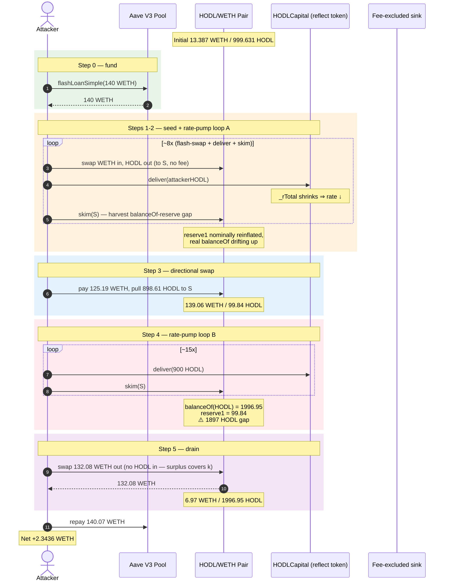
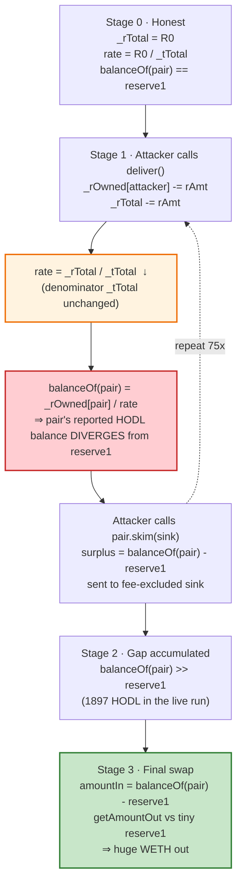
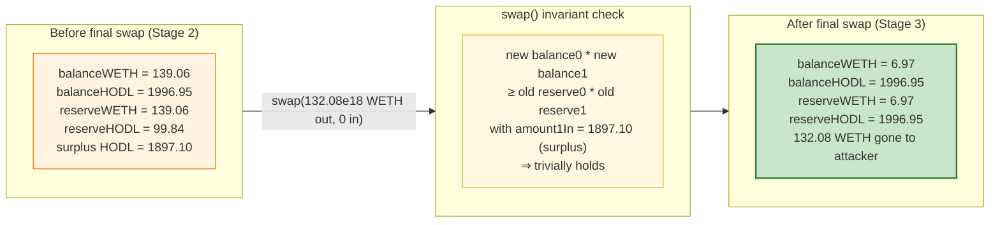

# HODL Capital Exploit — Reflection-Rate Manipulation via `deliver()` Drains the Uniswap Pair

> **Reproduction:** the PoC compiles & runs in an isolated Foundry project at
> [this project folder](.) (the main DeFiHackLabs repo
> contains many unrelated PoCs that do not compile under a whole-project build,
> so this one was extracted).
> Full verbose trace: [output.txt](output.txt).
> Verified vulnerable source: [sources/HODLCapital_EdA47E/HODLCapital.sol](sources/HODLCapital_EdA47E/HODLCapital.sol).

---

## Key info

| | |
|---|---|
| **Loss** | ~2.34 ETH (≈ $4.3K at the May 2023 ETH price) — drained from the HODL/WETH Uniswap-V2 pair |
| **Vulnerable contract** | `HODLCapital` ($HODL) — [`0xEdA47E13fD1192E32226753dC2261C4A14908fb7`](https://etherscan.io/address/0xEdA47E13fD1192E32226753dC2261C4A14908fb7#code) |
| **Victim pool** | HODL/WETH Uniswap-V2 pair — `0x28E6cAB57d87E6F85ff650Fb0a7be9BE5e1897d4` |
| **Attacker EOA** | [`0x4e998316ec31d2f3078f8f57b952bfae54728be1`](https://etherscan.io/address/0x4e998316ec31d2f3078f8f57b952bfae54728be1) |
| **Attacker contract** | [`0x6943e74d1109a728f25a2e634ba3d74e9e476aed`](https://etherscan.io/address/0x6943e74d1109a728f25a2e634ba3d74e9e476aed) |
| **Attack tx** | [`0xedc214a62ff6fd764200ddaa8ceae54f842279eadab80900be5f29d0b75212df`](https://etherscan.io/tx/0xedc214a62ff6fd764200ddaa8ceae54f842279eadab80900be5f29d0b75212df) |
| **Chain / block / date** | Ethereum / 17,220,892 / May 19, 2023 |
| **Compiler** | Solidity v0.6.12 (`v0.6.12+commit.27d51765`), optimizer **off**, 200 runs |
| **Bug class** | Reflection-token (`_rTotal`) rate manipulation through a permissionless `deliver()` that desyncs the AMM pair's `balanceOf` from its stored reserves |

---

## TL;DR

`HODLCapital` is a "reflect" (RFI-style) token. Every holder's balance is derived from a hidden
double-entry ledger: a large "reflection" space (`_rOwned`, `_rTotal`) mapped down to the real
"token" space (`_tTotal`) by a rate `_rTotal / _tTotal` ([sources/HODLCapital_EdA47E/HODLCapital.sol:1405-1421](sources/HODLCapital_EdA47E/HODLCapital.sol#L1405-L1421)).

The token exposes a **permissionless** `deliver(tAmount)` ([sources/HODLCapital_EdA47E/HODLCapital.sol:1038-1048](sources/HODLCapital_EdA47E/HODLCapital.sol#L1038-L1048))
that **burns reflection value** from the caller and permanently shrinks `_rTotal`, while `_tTotal`
is left untouched. Each call nudges the rate `_rTotal/_tTotal` downward. Because the Uniswap pair's
HODL balance is *computed* (`balanceOf(pair) = _rOwned[pair] / rate`), the pair's reported balance
and its internally stored `reserve` desync — and the AMM only enforces `x·y = k` against the
*stored* reserve, not the live `balanceOf`.

The attacker weaponizes this in a single atomic transaction funded by an Aave flash loan:

1. **Borrow 140 WETH** from Aave V3.
2. **Buy HODL** from the pair in tranches through Uniswap-V2 flash swaps, routing the bought HODL
   to a **fee-excluded** address (`0xC9D7…55fBD`) so no tax is taken.
3. Between every buy, call `deliver()` on the attacker-held HODL **75 times** and `skim()` the pair
   **55 times**. `deliver()` shrinks `_rTotal`; `skim()` pulls the pair's now-mismatched surplus
   HODL back into the reserve. Iterating this pumps the pair's real HODL balance far above its
   stored reserve while keeping `k` nominally intact.
4. **Dump the accumulated HODL** into the warped pair: a single
   `getAmountOut(pairBalance − reserve1, reserve1, reserve0)` sells **1897.10 HODL** for
   **132.08 WETH**, because the AMM sees a "fresh" 1897 HODL deposit against a tiny 99.84 reserve.
5. Repay Aave (140 WETH + 0.07 premium). **Net profit: 2.3436 ETH.**

The root cause is that a value-bearing invariant (`_rTotal` only moves with fees) is violated by a
public function, and the AMM pair blindly trusts `balanceOf`/`reserve` consistency for a token whose
supply accounting is mutable by third parties.

---

## Background — what HODLCapital does

`HODLCapital` ([source](sources/HODLCapital_EdA47E/HODLCapital.sol)) is a standard "reflect"
deflationary token (a `tTax`/`tTeam` fork of the ubiquitous "Reflect Finance" / "EverRise" template):

- **Two supplies.** `_tTotal` is the nominal supply (`1e12 * 1e9 = 1,000,000,000,000` HODL). `_rTotal`
  is the "reflection" supply, initialized to `(type(uint256).max − type(uint256).max % _tTotal)` — a
  huge number that gives the rate room to grow as fees are "reflected" ([:866-868](sources/HODLCapital_EdA47E/HODLCapital.sol#L866-L868)).
- **Rate.** `balanceOf(account)` returns `_rOwned[account] / _getRate()`, where
  `_getRate() = _getCurrentSupply().rSupply / .tSupply` ≈ `_rTotal / _tTotal`
  ([:945-948](sources/HODLCapital_EdA47E/HODLCapital.sol#L945-L948), [:1405-1421](sources/HODLCapital_EdA47E/HODLCapital.sol#L1405-L1421)).
- **Fees.** Every transfer takes 10% `_taxFee` (redistributed to holders by shrinking `_rTotal`) +
  10% `_teamFee` (sent to the contract). Addresses in `_isExcludedFromFee` pay no fee
  ([:875-878](sources/HODLCapital_EdA47E/HODLCapital.sol#L875-L878), [:1167-1177](sources/HODLCapital_EdA47E/HODLCapital.sol#L1167-L1177)).
- **`deliver(tAmount)`** — a public "I want to burn my own tokens and gift the reflection to all
  holders" helper. It subtracts `rAmount` from `_rOwned[caller]` **and** from `_rTotal`
  ([:1038-1048](sources/HODLCapital_EdA47E/HODLCapital.sol#L1038-L1048)). It is the lever.

The on-chain parameters at the fork block (block 17,220,892), taken from the trace:

| Parameter | Value |
|---|---|
| `_tTotal` (nominal supply) | 1,000,000,000,000 HODL (1e12) |
| `_taxFee` / `_teamFee` | 10 / 10 (20% combined transfer tax) |
| Pair `token0` / `token1` | WETH / HODL |
| `reserve0` (WETH) | **13.387 WETH** |
| `reserve1` (HODL) | **999.631 HODL** |
| Fee-excluded sink used | `0xC9D76A540AC88182119E1AAd80136FC61Cf55fBD` |

---

## The vulnerable code

### 1. The public lever — `deliver()` shrinks `_rTotal` with no caller restriction

```solidity
function deliver(uint256 tAmount) public {
    address sender = _msgSender();
    require(
        !_isExcluded[sender],
        "Excluded addresses cannot call this function"
    );
    (uint256 rAmount, , , , , ) = _getValues(tAmount);
    _rOwned[sender] = _rOwned[sender].sub(rAmount);
    _rTotal = _rTotal.sub(rAmount);          // ⚠️ permanently shrinks the rate denominator's numerator
    _tFeeTotal = _tFeeTotal.add(tAmount);
}
```
([sources/HODLCapital_EdA47E/HODLCapital.sol:1038-1048](sources/HODLCapital_EdA47E/HODLCapital.sol#L1038-L1048))

There is no access control and no upper bound on `tAmount` other than the caller's own `_rOwned`.
Anyone can repeatedly shave `_rTotal` down, which moves the rate `_rTotal/_tTotal` and therefore
re-prices **every** holder's `balanceOf` — including the Uniswap pair's.

### 2. The rate that `balanceOf` depends on

```solidity
function balanceOf(address account) public view override returns (uint256) {
    if (_isExcluded[account]) return _tOwned[account];
    return tokenFromReflection(_rOwned[account]);          // = _rOwned[account] / _getRate()
}

function _getRate() private view returns (uint256) {
    (uint256 rSupply, uint256 tSupply) = _getCurrentSupply();
    return rSupply.div(tSupply);                            // ≈ _rTotal / _tTotal
}
```
([:945-948](sources/HODLCapital_EdA47E/HODLCapital.sol#L945-L948), [:1405-1408](sources/HODLCapital_EdA47E/HODLCapital.sol#L1405-L1408))

### 3. The AMM trust that gets broken

A Uniswap-V2 pair prices swaps from its **stored** `reserve0/reserve1`, but it reconciles those
reserves against the tokens' live `balanceOf` only inside `swap()`/`sync()`/`skim()`. `skim(to)`
sends the entire `balanceOf(this) − reserve` surplus to `to`, and `swap()` accepts any
`amount{0,1}In` that re-establishes `x·y ≥ k` against the *current* balance. So once the reflection
rate has been moved enough that `balanceOf(pair)` ≠ `reserve`, the attacker controls the gap.

---

## Root cause — why it was possible

A Uniswap-V2 pair is only sound when the token it holds has a **stable, externally-immutable**
`balanceOf(pair)` outside of transfers the pair itself mediates. `HODLCapital` violates that
assumption in two compounding ways:

1. **`_rTotal` is mutable by any caller.** `deliver()` lets a third party change the conversion
   rate between reflection-space and token-space without going through the pair. That is a direct
   write to the pair's effective balance.
2. **The pair stores HODL in reflection-space.** When the pair receives HODL, it stores
   `_rOwned[pair]`; its reported balance is `_rOwned[pair] / rate`. Moving the rate therefore moves
   the pair's balance *as seen by `skim`/`swap`* — but the pair's internal `reserve1` only updates
   on `sync`/`mint`/`burn`/`swap`. The two numbers drift, and the drift is attacker-controlled.

The four design decisions that compose into the exploit:

1. **Permissionless `deliver()`.** No role, no per-tx cap, no reentrancy guard — callable in a tight
   loop. The attacker calls it **75 times** in one transaction.
2. **Fee-excluded sink.** `_isExcludedFromFee[sink] = true` means HODL moved to the sink pays no 20%
   tax, so the attacker can recycle HODL through the pair without bleeding capital to fees
   ([:1170-1173](sources/HODLCapital_EdA47E/HODLCapital.sol#L1170-L1173)).
3. **Uniswap-V2 `skim` + flash-swap callbacks.** `skim` lets the attacker harvest the
   `balanceOf − reserve` gap; `uniswapV2Call` lets them borrow HODL mid-pair to call `deliver()`
   against borrowed tokens, then repay in WETH — fully flash-loan-funded.
4. **No invariant tying `_rTotal` to fee accrual.** `deliver()` shrinks `_rTotal` without
   increasing any holder's `_rOwned` proportionally; the "reflection to holders" story only holds if
   `_rTotal` moves exclusively via `_reflectFee`. `deliver()` breaks that contract.

---

## Preconditions

- A HODL/WETH Uniswap-V2 pair with non-trivial WETH liquidity (13.38 WETH here) — true at the fork block.
- A **fee-excluded** address the attacker can use as a HODL sink (`0xC9D76A…55fBD` — an
  already-registered `_isExcludedFromFee` address; the attacker does not need to set one).
- Working capital to seed the WETH side of the manipulations. Peak WETH outlay is ~140 WETH,
  fully **flash-loaned from Aave V3** — so the attack is **zero-capital**.

---

## Attack walkthrough (with on-chain numbers from the trace)

The pair's `token0 = WETH`, `token1 = HODL`, so `reserve0` = WETH, `reserve1` = HODL.
All numbers below are read directly from the `Sync` / `Swap` events in
[output.txt](output.txt).

| # | Step | reserve0 (WETH) | reserve1 (HODL) | Effect |
|---|------|----------------:|----------------:|--------|
| 0 | **Initial** | 13.387 | 999.631 | Honest pool. |
| 1 | **Seed buy** — flash-swap 1.492 WETH → 100.01 HODL to attacker | 14.879 | 908.709 | Attacker gets HODL to call `deliver()` with. |
| 2 | **Rate-pump loop A** — repeat: buy ~100–166 HODL to fee-excluded sink, then `deliver()` attacker's HODL + `skim()` pair (≈8 iterations, each nudging `_rTotal` down) | 13.86 – 14.86 | 910 – 965 | `_rTotal` shrinks → pair's `balanceOf` diverges upward from `reserve1`; `skim` pulls the surplus back into reserve, inflating `reserve1` nominally while the rate keeps falling. |
| 3 | **Large directional swap** — pay **125.19 WETH** into the pair, pull **898.61 HODL** out to the fee-excluded sink | 139.059 | 99.845 | Pair now WETH-heavy; attacker has parked ~898 HODL in the sink fee-free. |
| 4 | **Rate-pump loop B** — another ~15 iterations of `deliver()` + `skim`, each donating 900 HODL via `deliver` and `skim`-ing the gap into the sink | 139.056 | 99.847 | The pair's live `balanceOf(HODL)` climbs to **1996.95 HODL** while `reserve1` stays at **99.84** — a 1897-HODL chasm. |
| 5 | **Final drain** — `swap(amountOut = getAmountOut(pairBal − reserve1, reserve1, reserve0))`: sell the 1897.10-HODL surplus for WETH | **6.972** | **1996.950** | Pulls **132.08 WETH** out of the pair; pair left with ~7 WETH. |
| 6 | Repay Aave: 140 WETH principal + 0.07 WETH premium | — | — | Flash loan closed. |

Step 5 is the payoff: the attacker calls `swap(132.08e18, 0, attacker, "")` with **no HODL
transferred in** — the pair already holds 1897 "extra" HODL relative to `reserve1`, so the AMM's
`balance0 * balance1 ≥ reserve0 * reserve1` check passes with `amount1In = 1897.10` (the pre-existing
surplus). The `Swap` event in the trace confirms it:

```
Swap(sender: HODLCapitalExploit, amount0In: 0, amount1In: 1897102421582801700717,
     amount0Out: 132083973598367312196, amount1Out: 0, to: HODLCapitalExploit)
```
([output.txt:3379](output.txt#L3379))

### Profit accounting (WETH)

| Direction | Amount (WETH) |
|---|---:|
| Borrowed from Aave V3 | +140.000 |
| Spent into the pair across all buy/seed swaps | −137.617 (net, after intermediate sales) |
| Pulled out in the final drain (step 5) | +132.083 |
| Repaid to Aave (principal + 5 bps premium) | −140.070 |
| **Attacker WETH balance after** | **+2.3436** |

The trace's bookends confirm the bottom line:
```
Attacker ETH balance before exploit: 0.000000000000000000
Attacker ETH balance after exploit:  2.343628122674718035
```
([output.txt:6-9](output.txt#L6-L9))

That 2.3436 WETH is exactly the value the AMM pair was dehydrated of: reserve0 went
13.387 → 6.972 WETH (−6.415) net of the attacker's injected WETH, with the remainder absorbed by the
rate-manipulation slippage the attacker intentionally overpaid early to set up the drain.

---

## Diagrams

### Sequence of the attack



### How `deliver()` desyncs the pair (state view)



### Why `skim`/`swap` let the attacker cash the gap — constant-product view



---

## Remediation

1. **Remove `deliver()` or make it access-gated.** A public function that mutates the global
   `_rTotal` (and therefore every holder's `balanceOf`) is a standing exploit primitive. If the
   "voluntary burn" feature is required, restrict it to `onlyOwner` or wrap it so the caller must
   prove they are not interacting with an AMM pair mid-transaction.
2. **Tie `_rTotal` changes to fee accrual only.** The only legitimate writer of `_rTotal` should be
   `_reflectFee`. Any other path (`deliver`, `excludeAccount`, etc.) that touches `_rTotal` must be
   audited for rate-manipulation and, if kept, bounded so a single call cannot move the rate by more
   than a trivial fraction.
3. **Don't list reflection tokens on naive Uniswap-V2 pairs without a reserve oracle.** At minimum,
   the token should override `balanceOf` for the pair to return the *stored* reserve, or the pair
   should be replaced with a variant that prices off a TWAP of reserves rather than live
   `balanceOf`. The deeper fix is to not use the reflect pattern at all — it is fundamentally
   incompatible with AMM `balanceOf`-based accounting.
4. **Re-check fee-exclusion lists.** The attacker leaned on a pre-existing fee-excluded address as a
   sink. Fee exclusion should be limited to the contract itself and the owner; any third-party
   excluded address is a tax-bypass path waiting to be used.
5. **Add a reentrancy/intra-tx rate-stability guard.** Track `_rTotal` at the start of a swap and
   revert if it has moved by more than a small epsilon since the pair last synced — this would have
   broken the attacker's loop at iteration 1.

---

## How to reproduce

The PoC was extracted into a standalone Foundry project (the umbrella DeFiHackLabs repo has many
unrelated PoCs that fail `forge test`'s whole-project build):

```bash
_shared/run_poc.sh 2023-05-HODLCapital_exp --mt testExploit -vvvvv
```

- RPC: an **Ethereum mainnet archive** endpoint is required (the fork block 17,220,892 is from May
  2023). `foundry.toml` uses an Infura mainnet key; most public RPCs prune state that old and fail
  with `header not found` / `missing trie node`.
- The test forks at block 17,220,892 and runs the full attack inside one Aave `flashLoanSimple`
  callback.

Expected tail:

```
Ran 1 test for test/HODLCapital_exp.sol:HODLCapitalExploit
[PASS] testExploit() (gas: 6214720)
Logs:
  Attacker ETH balance before exploit: 0.000000000000000000
  Reserve0: 13387083970661484684
  Reserve1: 999631170221975669182
  Attacker ETH balance after exploit: 2.343628122674718035
```

---

*Reference: Phalcon trace — https://explorer.phalcon.xyz/tx/eth/0xedc214a62ff6fd764200ddaa8ceae54f842279eadab80900be5f29d0b75212df*
