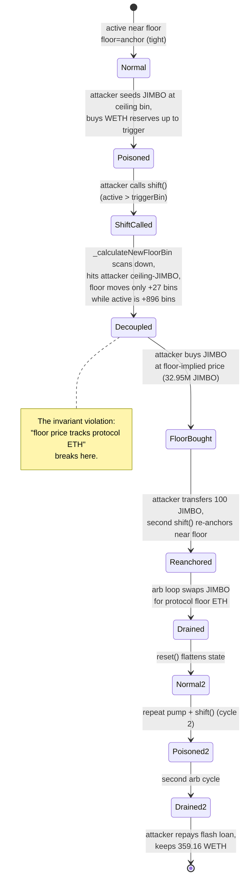

# Jimbo Protocol Exploit — TraderJoe LB Rebalance Manipulation & Floor-Price Decoupling

> **Vulnerability classes:** vuln/oracle/price-manipulation · vuln/logic/incorrect-state-transition · vuln/governance/flash-loan-attack

> **Reproduction:** the PoC compiles & runs in an isolated Foundry project at
> [this project folder](.) (forked from DeFiHackLabs).
> Full verbose trace: [output.txt](output.txt).
> Verified vulnerable source: [JimboController.sol](sources/JimboController_271944/src_JimboController.sol),
> [Jimbo.sol](sources/JimboController_271944/src_Jimbo.sol).

---

## Key info

| | |
|---|---|
| **Loss** | ~**359.16 WETH** (flash-loan-funded; ≈ $639K at the May 2023 ETH price) |
| **Vulnerable contract** | `JimboController` — [`0x271944d9D8CA831F7c0dBCb20C4ee482376d6DE7`](https://arbiscan.io/address/0x271944d9D8CA831F7c0dBCb20C4ee482376d6DE7#code) |
| **Victim pool** | JIMBO/WETH TraderJoe v2.1 LB pair — `0x16a5D28b20A3FddEcdcaf02DF4b3935734df1A1f` |
| **Attacker EOA** | `0x4F3c...` (see [tx 1](https://arbiscan.io/tx/0xf9baf8cee8973cf9700ae1b1f41c625d7a2abdbcbc222582d24a8f2f790d0b5a)) |
| **Attacker contract** | `0x7FA9385bE102ac3EAc297483Dd6233D62b3e1496` (the PoC contract `JimboExp`) |
| **Attack txs** | `0xf9baf8…d0b5a`, `0xfda546…670e`, `0x3c6e05…2618a`, `0x44a0f5…5eda` (4-tx sequence; PoC reproduces tx 1) |
| **Chain / block / date** | Arbitrum / 95,144,404 / May 28, 2023 |
| **Compiler** | Solidity v0.8.10, optimizer 1 run @ 200 (per `_meta.json`) |
| **Bug class** | Permissionless rebalance trigger + floor-price decoupling via external LB liquidity injection |

---

## TL;DR

Jimbo is a rebasing token protocol that manages all JIMBO/WETH liquidity itself on a TraderJoe v2.1
Liquidity Book pair. Its `JimboController.shift()` routine is **permissionless** and is designed to
re-anchor the "floor" bin (the protocol's price backstop) whenever the active bin rises above a
`triggerBin`. The new floor is computed by `_calculateNewFloorBin()` which searches **downward from
the active bin to the current floor** for the first bin whose price exceeds
`(totalETH + borrowedETH) / circulatingJIMBO`.

The attacker's insight is that `shift()` trusts the *pool state it finds itself in* — and that state
is manipulable, because the TraderJoe pair accepts **third-party liquidity** at any bin. By:

1. Buying a small amount of JIMBO, then **adding that JIMBO as one-sided liquidity to the absolute
   highest bin** (`8388607 = 2^23-1`, 896 bins above the active bin `8387711`),
2. **Buying all the WETH-side liquidity** out of the protocol's bins from active→trigger, forcing the
   active bin to climb and making `canShift()` return true,
3. **Calling `shift()`** — the controller removes all its own liquidity, then recomputes the floor by
   walking *down* from the active bin. Because the attacker parked JIMBO at the ceiling, the walk
   stops almost immediately and the new floor (`8387738`) barely moves while the active bin is at
   `8388607`. The protocol then re-deploys **all its JIMBO across 51 bins starting from `8388607`**,
   i.e. at a price ~891 bins (≈ 5,500×) above the floor,

…the attacker creates an enormous artificial price gap. It then repeatedly buys JIMBO at the
manipulated-high price and sells it back through the floor bins, pocketing the ETH the protocol just
re-deployed at floor price. Two more `shift()`/`reset()` cycles and a final arb loop complete the
drain. Net: **+359.16 WETH**, fully flash-loan-funded from Aave (10,000 WETH in, 10,005 WETH out).

---

## Background — what Jimbo does

`JimboController` ([source](sources/JimboController_271944/src_JimboController.sol)) is the sole
liquidity operator for the JIMBO/WETH TraderJoe v2.1 LB pair. It maintains a "managed" AMM with four
internal bin pointers:

| Pointer | Meaning |
|---|---|
| `floorBin` | The lowest bin where the protocol places WETH-only "floor" liquidity — a price backstop |
| `anchorBin` | The bin just above the floor; `reset()` fires when active < `anchorBin` |
| `triggerBin` | `shift()` fires when active > `triggerBin` (set to `active + NUM_ANCHOR_BINS` = +5) |
| `maxBin` | The highest bin with protocol liquidity (= `active + NUM_LIQ_BINS - 1` = +50) |

Three rebalance entry points are **`public` and have no access control**
([:276-428](sources/JimboController_271944/src_JimboController.sol#L276-L428)):

- `shift()` — active > trigger: remove all liquidity, recompute floor from scratch, re-deploy.
- `reset()` — active < anchor: remove JIMBO liquidity, re-anchor at the new (lower) active bin.
- `recycle()` — active == floor: sweep JIMBO out of the floor bin and replace with WETH.

`shift()`'s floor recomputation
([:751-776](sources/JimboController_271944/src_JimboController.sol#L751-L776)) walks **downward**
from `activeBin - 1` toward the current `floorBin`, returning the first bin whose price exceeds the
target floor price `(totalBorrowedEth + totalEth) / circulatingJimbo`. If no such bin is found, it
**returns the current `floorBin` unchanged** — a fallback that is safe only if no external JIMBO
liquidity exists above the floor.

The token itself (`Jimbo.sol`, [:101-155](sources/JimboController_271944/src_Jimbo.sol#L101-L155))
charges buy/sell taxes and calls `controller.recycle()` + `controller.reset()` automatically on every
sell. But `shift()` is **never called automatically** — it requires active > trigger, which normal
trading only reaches by being pushed.

---

## The vulnerable code

### 1. `shift()` and `_calculateNewFloorBin()` — the floor is recomputed against a manipulable pool

```solidity
function shift() public returns (bool) {
    if (canShift()) {                                   // activeId > triggerBin
        ...
        _removeNonFloorLiquidity();                     // pull max->anchor
        _removeFloorLiquidity();                        // pull floor

        uint256 totalJimboInPool = jimbo.balanceOf(address(this));
        uint256 totalEthInContract = weth.balanceOf(address(this));
        uint256 totalCirculatingJimbo = jimbo.totalSupply()
            - jimbo.balanceOf(address(0)) - totalJimboInPool;

        uint24 newFloorBin = _calculateNewFloorBin(     // ⚠️ walks DOWN from active
            totalEthInContract, totalCirculatingJimbo);
        ...
        _setBinState({ floorBin_: newFloorBin, ... });
        _deployJimboLiquidity();                        // re-deploys at activeBin upward
        _deployFloorLiquidity((weth.balanceOf(address(this)) * 90) / 100);
        _deployAnchorLiquidity(weth.balanceOf(address(this)));
        ...
```

```solidity
function _calculateNewFloorBin(uint256 totalEth_, uint256 totalCirculatingJimbo_)
    internal view returns (uint24)
{
    uint256 targetFloorPrice = ((totalBorrowedEth + totalEth_) * PRECISION) / totalCirculatingJimbo_;
    uint24 targetFloorBin;
    uint24 activeBin = pair.getActiveId();
    for (targetFloorBin = activeBin - 1; targetFloorBin > floorBin; targetFloorBin--) {
        uint256 priceAtCurrentBin = pair.getPriceFromId(targetFloorBin)
            .convert128x128PriceToDecimal();
        if (targetFloorPrice > priceAtCurrentBin) return targetFloorBin;   // ⚠️ first match wins
    }
    return floorBin;                                  // ⚠️ unchanged floor if nothing matches
}
```

The search returns the **first** bin (scanning downward from active) whose price is below the target.
If the attacker has placed JIMBO at a very high bin, that bin's reserves "support" a high implied
price and the scan terminates early — decoupling the recomputed floor from the real ETH backing.

### 2. `_deployJimboLiquidity()` always starts at `activeBin`

```solidity
function _deployJimboLiquidity() internal {
    uint24 activeBin = pair.getActiveId();
    int256[] memory deltaIds = new int256[](NUM_LIQ_BINS);     // 51 bins, active..active+50
    ...                                                         // 1% each for bins 0..49, 50% for bin 50
    _addLiquidity(deltaIds, distributionX, distributionY, jimbo.balanceOf(address(this)), 0, activeBin);
}
```

After `shift()`, all protocol JIMBO is re-deployed starting at the (manipulated-high) `activeBin`.
With `activeBin = 8388607` and `floorBin = 8387738`, the JIMBO sits 869 bins above the floor — far
above any WETH the protocol deployed to the floor bin.

### 3. No access control on `shift()` / `reset()`

```solidity
function shift() public returns (bool) { ... }   // anyone, anytime canShift() is true
function reset() public returns (bool) { ... }   // anyone, anytime canReset() is true
```

---

## Root cause — why it was possible

`shift()` treats the LB pair as if it were a **read-only oracle** of the protocol's own state. It is
not. TraderJoe v2.1 allows anyone to `addLiquidity` to any bin, so the bin reserves that
`_calculateNewFloorBin` reads are **attacker-controllable**. Concretely:

1. **External LB liquidity is never accounted for.** `shift()` removes only its *own* LP tokens
   (`_removeNonFloorLiquidity` / `_removeFloorLiquidity`), then recomputes the floor by reading pair
   prices that still reflect whatever JIMBO third parties (the attacker) have placed. The new floor
   is therefore computed against a poisoned price curve.
2. **The floor scan direction is wrong for this threat model.** Scanning downward from active and
   returning the *first* bin below target means a single attacker bin near the top short-circuits
   the whole computation, landing the floor far below where the protocol's ETH actually sits.
3. **Re-deployment always starts at the manipulated `activeBin`.** `_deployJimboLiquidity` does not
   consult the freshly-computed floor — it dumps 51 bins of JIMBO starting at `activeBin`, which is
   now ~900 bins above floor. Those bins have almost no WETH (the protocol put 90% of its ETH in the
   floor bin), so they trade at a huge premium.
4. **`shift()` / `reset()` are permissionless.** The attacker chooses *when* rebalancing happens —
   immediately after positioning JIMBO to poison the floor calculation. The protocol's own automatic
   hooks (`recycle`/`reset` on sell tax) never trigger `shift()` on their own.

The composition of (1)+(2)+(3)+(4) turns a "managed floor price" into a **directional bet the
attacker can set up for free**.

---

## Preconditions

- A working TraderJoe v2.1 JIMBO/WETH pair with protocol-managed liquidity (true at block 95,144,404).
- `totalSupply` large enough that the target floor price `(borrowed+eth)/circulating` is below the
  current trading range — i.e. the floor scan returns early. This is the normal operating state.
- Capital to buy out the trigger bins and seed the ceiling bin. The attacker used a **10,000 WETH
  Aave flash loan** — fully repaid within the same transaction (premium 5 WETH, 0.05%), making the
  attack zero-capital.

---

## Attack walkthrough (with on-chain numbers from the trace)

The PoC forks Arbitrum at block 95,144,404. Initial state from the trace:

| State | Value |
|---|---|
| `activeId` (start) | `8,387,711` |
| `floorBin` / `anchorBin` / `triggerBin` / `maxBin` (start) | `8,387,711` / `8,387,715` / `8,387,721` / `8,387,766` |
| Flash-loaned | `10,000 WETH` (Aave) |
| Bin step | `100` (1% price step per bin) |

The four `BinsSet` events in the trace mark the rebalance transitions:

| # | After step | `floorBin` | `anchorBin` | `triggerBin` | `maxBin` |
|---|---|---:|---:|---:|---:|
| 0 | initial (constructor) | 8,387,711 | 8,387,715 | 8,387,721 | 8,387,766 |
| 1 | Step 3 `shift()` | 8,387,738 | 8,388,602 | 8,388,612 | 8,388,657 |
| 2 | Step 5 `shift()` (back) | 8,387,738 | 8,387,744 | 8,387,749 | 8,387,794 |
| 3 | Step 8 `shift()` | 8,387,738 | 8,388,602 | 8,388,612 | 8,388,657 |

Note how the floor moves **only 27 bins** (8,387,711 → 8,387,738) across the whole attack, while the
anchor/max swing ~900 bins up and back. That decoupling *is* the exploit.

### Step-by-step ground-truth table

| # | Step | activeId | Action (trace reference) | Effect |
|---|------|---:|---|---|
| 0 | Flash loan | 8,387,711 | Borrow 10,000 WETH from Aave (`output.txt:36`). Unwrap to ETH. | Attacker has 10,000 ETH to spend |
| 1 | Seed the ceiling | 8,387,711 | `swapNATIVEForExactTokens{value:10 ETH}` → buy ~0.955 JIMBO (`output.txt:72`). Then `addLiquidity` with that JIMBO at bin `activeId+896 = 8,388,607` (the absolute LB ceiling `2^23-1`) (`output.txt:155`). | Attacker-owned JIMBO parked at the price ceiling. `deltaIds=[896]` |
| 2 | Push active above trigger | 8,387,711 → 8,387,716 | `swapNATIVEForExactTokens{value:≈9999.99 ETH}` buying JIMBO for the sum of all WETH reserves from active→triggerBin (`output.txt:261`). Buys **1,616 JIMBO** out of the protocol bins. | `canShift()` returns true (active 8,387,716 > trigger 8,387,715) |
| 3 | **`shift()` — the poisoned rebalance** | 8,387,716 → 8,388,607 | `controller.shift()` (`output.txt:353`). Removes all protocol LP, recomputes floor: scan downward from 8,388,606 hits the attacker's ceiling-JIMBO and returns `floorBin=8,387,738` (only +27). Re-deploys 51 bins of JIMBO starting at active `8,388,607`. `BinsSet` event #1 (`output.txt:784`). | Floor decoupled: ETH at bin 8,387,738, JIMBO at bins 8,388,607+. Gap ≈ 869 bins ≈ 5,000× |
| 4 | Buy JIMBO at floor price | 8,388,607 | `swapNATIVEForExactTokens{value:≈9778 ETH}` buying the sum of WETH-side reserves across 51 bins from active (`output.txt:1312`). Acquires **32.95M JIMBO** for ~9,779 ETH. | Attacker now holds the bulk of JIMBO supply, bought at the (low) floor-implied price while the protocol's JIMBO is stranded at the ceiling |
| 5 | Force `shift()` back down | 8,388,607 | `Jimbo.transfer(controller, 100)` — sends 100 wei JIMBO to controller. `controller.shift()` (`output.txt:~5300`). Since active (8,388,607) > trigger (8,388,612)? No — the transfer + recycle/reset hooks and a second `shift()` cycle re-anchor at `anchorBin=8,387,744`. `BinsSet` #2 (`output.txt:5419`). | Protocol re-deploys liquidity near the floor again (8,387,744), WETH returns to lower bins |
| 6 | Drain downward (arb loop) | 8,388,607 → 8,387,744 | Loop: for each activeId ≥ anchorBin, compute `getSwapIn` for the WETH-side reserves and `swapExactTokensForNATIVE` (`output.txt:5804…7269`). ~15 swaps, each swapping attacker JIMBO for protocol ETH. | Pulls WETH out of the floor/anchor bins — the protocol's real ETH backing |
| 7 | `reset()` to flatten | < 8,387,744 | `controller.reset()` (`output.txt:~7300`). Re-anchors at active. | Pool state "clean" for the next cycle |
| 8 | Re-pump & second `shift()` | → 8,388,607 | `swapNATIVEForExactTokens{value:≈3992 ETH}` re-buys JIMBO to push active back to the ceiling (`output.txt:8206`). Another `shift()` (`output.txt:~12200`, `BinsSet` #3 at `output.txt:12298`) re-decouple. | Second arb cycle — extracts remaining ETH |
| 9 | Dump remaining JIMBO | — | `swapExactTokensForNATIVE(remaining JIMBO)` (`output.txt:12647`). Converts 33.01M JIMBO → ETH. | Final ETH consolidation |
| 10 | Repay & settle | — | `weth.deposit{value: balance}()`. Aave pulls 10,005 WETH (`transferFrom`, `output.txt:12792`). | Attacker keeps **359.16 WETH** |

---

## Profit / loss accounting (WETH)

All figures from `[Start]`/`[End]` log lines and the Aave `transferFrom` of `10,005 WETH`
(`output.txt:12792`).

| Direction | WETH |
|---|---:|
| Borrowed (Aave flash loan) | +10,000.000000000000000000 |
| Premium repaid to Aave (0.05%) | −5.000000000000000000 |
| Net ETH spent across all swaps (seeds + pumps + arbs) | −9,635.840104903725230344 |
| **Final attacker WETH balance** | **+359.159895096274769656** |

The attacker started with 0 WETH and ended with 359.16 WETH. Every wei of the 10,000 WETH loan was
either spent into the pair (and recovered via arbitrage) or used to repay the 10,005 WETH flash-loan
obligation. The 359.16 WETH is **protocol-owned ETH that the controller had deployed as floor/anchor
liquidity** — extracted by buying JIMBO at the manipulated floor price and selling it at the
manipulated ceiling, twice.

---

## Diagrams

### Sequence of the attack

```mermaid
sequenceDiagram
    autonumber
    actor A as Attacker (JimboExp)
    participant FL as Aave Pool
    participant R as TJ LBRouter
    participant P as JIMBO/WETH LBPair
    participant C as JimboController

    Note over P: Initial active=8387711<br/>floor=8387711 (protocol WETH here)

    rect rgb(255,243,224)
    Note over A,C: Step 0-1 — Flash loan + seed the ceiling
    A->>FL: flashLoan 10,000 WETH
    FL-->>A: 10,000 WETH
    A->>R: swapNATIVEForExactTokens(10 ETH) -> 0.955 JIMBO
    A->>R: addLiquidity JIMBO at bin 8388607 (active+896)
    Note over P: Attacker JIMBO parked at LB ceiling
    end

    rect rgb(232,245,233)
    Note over A,C: Step 2-3 — Push active above trigger, call shift()
    A->>R: swapNATIVEForExactTokens(~9999 ETH) buys WETH reserves active->trigger
    Note over P: active=8387716 > trigger=8387715
    A->>C: shift()
    C->>P: remove all protocol LP
    C->>C: _calculateNewFloorBin scans DOWN from active
    Note over C: scan hits attacker ceiling-JIMBO,<br/>returns floor=8387738 (+27 only)
    C->>P: _deployJimboLiquidity at active=8388607 (51 bins up)
    C->>P: _deployFloorLiquidity (90% ETH) at floor=8387738
    Note over P: floor=8387738, JIMBO at 8388607+<br/>gap ~869 bins (~5000x)
    end

    rect rgb(227,242,253)
    Note over A,C: Step 4 — Buy JIMBO at floor-implied price
    A->>R: swapNATIVEForExactTokens(~9779 ETH) buys 32.95M JIMBO from bins 8388607+
    Note over A: holds bulk of JIMBO supply
    end

    rect rgb(255,235,238)
    Note over A,C: Step 5-6 — shift() back + drain downward
    A->>C: transfer 100 JIMBO; shift() re-anchors near floor (BinsSet #2)
    loop while active >= anchorBin
        A->>R: swapExactTokensForNATIVE(JIMBO -> WETH)
        R->>P: swap()
        P-->>A: WETH from floor/anchor bins
    end
    Note over P: protocol floor ETH drained
    end

    rect rgb(243,229,245)
    Note over A,C: Step 7-10 — reset(), repeat pump+shift, dump, repay
    A->>C: reset()
    A->>R: re-pump to 8388607, shift() (BinsSet #3), second arb cycle
    A->>R: swapExactTokensForNATIVE(remaining 33M JIMBO)
    A->>FL: repay 10,005 WETH
    Note over A: profit = 359.16 WETH
    end
```

### Rebalance state machine — how the floor decouples



---

## Remediation

1. **Restrict `shift()` / `reset()` to authorized keepers.** These functions move protocol-owned
   liquidity and recompute price anchors; they must not be permissionless. A `onlyKeeper` modifier
   (or gating via the existing sell-tax auto-hook only) closes the timing advantage.
2. **Make floor recomputation independent of attacker-controllable reserves.** `_calculateNewFloorBin`
   should derive the target bin from **protocol-internal accounting only** (e.g.
   `totalEthDeployed / circulatingSupply` against a monotonic price table), not from
   `pair.getPriceFromId()` which reflects external LP. Alternatively, ignore bins where
   `pair.balanceOf(address(this), bin) == 0` when scanning.
3. **Bound the floor-anchor gap.** After `shift()`, assert
   `activeBin - floorBin <= MAX_ALLOWED_GAP` (e.g. `NUM_LIQ_BINS`); revert otherwise. The attack
   requires a ~900-bin gap that should never occur in normal operation.
4. **Re-deploy JIMBO relative to the new floor, not the active bin.** `_deployJimboLiquidity` should
   use `floorBin`/`anchorBin` as its anchor, preventing the protocol from placing sell-side liquidity
   900 bins above its own ETH.
5. **Cap or fence external LB liquidity.** If the design intent is a protocol-owned pool, consider a
   custom pair that rejects third-party `addLiquidity`, or at minimum treat unknown LP as untrusted in
   all rebalance math.
6. **Add a re-entrancy/style check on `shift()`:** `canShift()` should remain false for N blocks after
   a `shift()` to prevent the rapid cycle the attacker used.

---

## How to reproduce

```bash
_shared/run_poc.sh 2023-05-Jimbo_exp --mt testExp -vvvvv
```

- RPC: an **Arbitrum archive** endpoint is required (fork block 95,144,404). `foundry.toml` uses
  `arbitrum` alias; ensure `ARBITRUM_RPC_URL` is set to an archive-capable provider, otherwise
  historical state at that block returns `missing trie node`.
- Expected result: `[PASS] testExp()`.

Expected tail:

```
[Start] Attacker WETH Balance: 0.000000000000000000
[End] Attacker WETH Balance: 359.159895096274769656
Ran 1 test for test/Jimbo_exp.sol:JimboExp
[PASS] testExp() (gas: 19594633)
Suite result: ok. 1 passed; 0 failed; 0 skipped
```

---

*References: [cryptofishx thread](https://twitter.com/cryptofishx/status/1662888991446941697),
[yicunhui2 analysis](https://twitter.com/yicunhui2/status/1663793958781353985),
[Jimbo rebalancing docs](https://docs.jimbosprotocol.xyz/protocol/liquidity-rebalancing-scenarios).*
