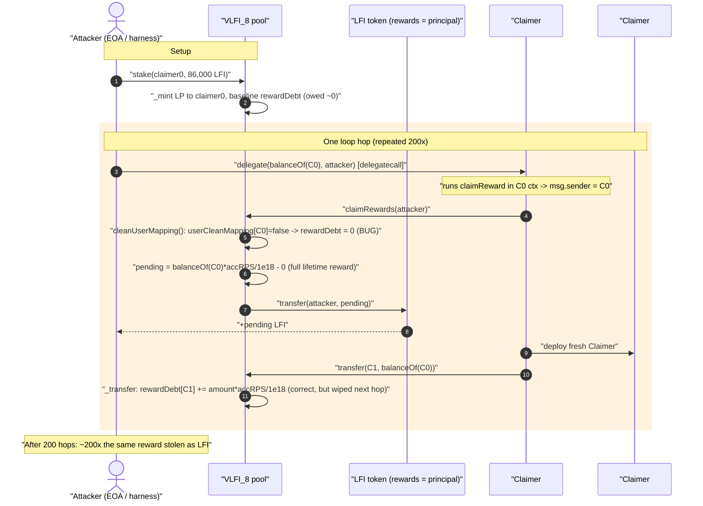
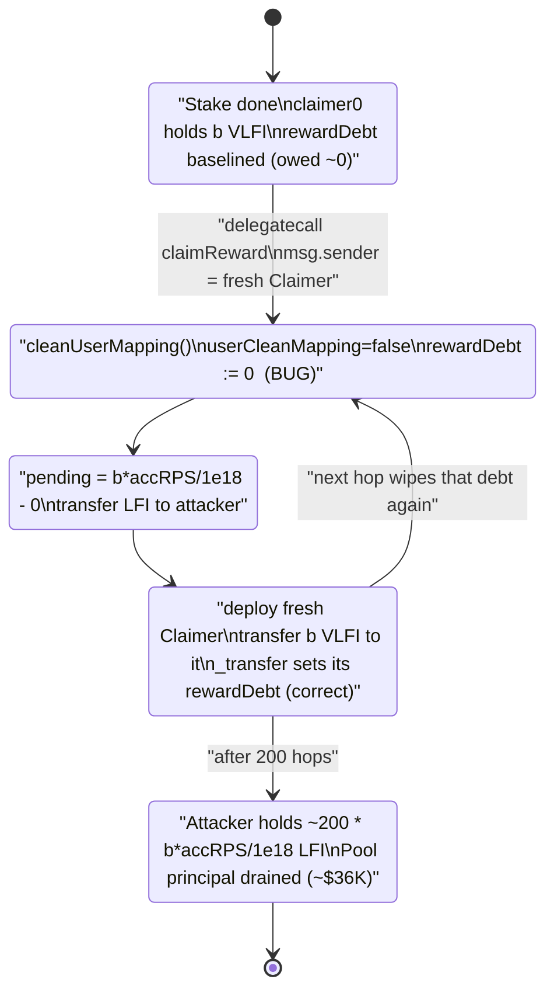
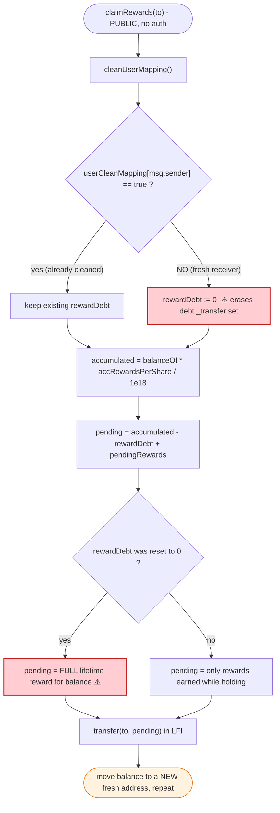

# LFI / VLFI Exploit — `claimRewards()` Reward-Debt Reset via Botched `cleanUserMapping` Migration

> **Vulnerability classes:** vuln/logic/reward-calculation · vuln/logic/state-update · vuln/data/uninitialized

> **Reproduction status:** the PoC compiles in the isolated Foundry project at [this folder](.),
> but the live fork **could not be re-run**: the configured Polygon RPC
> (`polygon-mainnet.public.blastapi.io`) now returns HTTP 403 "Blast API is no longer available"
> — see [output.txt](output.txt). The analysis below is reconstructed from the
> [PoC](test/LFI_exp.sol) and the **verified vulnerable source** fetched from PolygonScan
> ([contracts_VLFI_V8.sol](sources/contracts_VLFI_V8.sol), contract `VLFI_8`). Dollar figure is taken
> from the PoC's own `@KeyInfo` header (~$36K). Per-iteration token amounts depend on the live
> `accRewardsPerShare` snapshot at the fork block, which a successful fork would print; they are
> described qualitatively where the exact constant is fork-dependent.

---

## Key info

| | |
|---|---|
| **Loss** | ~$36,000 (per PoC `@KeyInfo`) — drained as `LFI` (the staked/reward token) from the VLFI staking pool |
| **Vulnerable contract** | `VLFI_8` staking pool (proxy [`0xfc604b6fD73a1bc60d31be111F798dd0D4137812`](https://polygonscan.com/address/0xfc604b6fD73a1bc60d31be111F798dd0D4137812), impl [`0xe6e5f921c8cd480030efb16166c3f83abc85298d`](https://polygonscan.com/address/0xe6e5f921c8cd480030efb16166c3f83abc85298d#code)) |
| **Reward / staked token** | `LFI` — [`0x77D97db5615dFE8a2D16b38EAa3f8f34524a0a74`](https://polygonscan.com/address/0x77D97db5615dFE8a2D16b38EAa3f8f34524a0a74) |
| **Attacker EOA** | [`0x11576cb3d8d6328cf319e85b10e09a228e84a8de`](https://polygonscan.com/address/0x11576cb3d8d6328cf319e85b10e09a228e84a8de) |
| **Attacker contract** | [`0x43623b96936e854f8d85f893011f22ac91e58164`](https://polygonscan.com/address/0x43623b96936e854f8d85f893011f22ac91e58164) |
| **Attack tx** | [`0xdd82fde0cc2fb7bdc078aead655f6d5e75a267a47c33fa92b658e3573b93ef0c`](https://polygonscan.com/tx/0xdd82fde0cc2fb7bdc078aead655f6d5e75a267a47c33fa92b658e3573b93ef0c) (also `0x051f80a7…b7a689a`) |
| **Chain / fork block / date** | Polygon / 43,025,776 / May 2023 |
| **Compiler** | Solidity v0.8.10, OpenZeppelin upgradeable |
| **Bug class** | Broken reward accounting — a storage-migration "clean" flag zeroes `rewardDebt`, letting freshly-received LP balances re-claim full historical rewards on every transfer |

---

## TL;DR

`VLFI_8` is a MasterChef-style staking pool: stakers receive `VLFI` LP tokens and accrue `LFI` rewards
proportional to `balanceOf(user) × accRewardsPerShare`, offset by a per-user `rewardDebt` snapshot
([contracts_VLFI_V8.sol:36-45](sources/contracts_VLFI_V8.sol#L36-L45)). To migrate users onto a newer
accounting model, the contract added a `userCleanMapping` flag and a `cleanUserMapping()` helper that,
**the first time an address interacts, forcibly resets that address's `rewardDebt` to `0`**
([:851-857](sources/contracts_VLFI_V8.sol#L851-L857)).

The fatal interaction is between three pieces:

1. **`_transfer`** correctly debits a *receiver's* `rewardDebt` by `amount × accRewardsPerShare / PRECISION`
   so that receiving tokens does **not** grant rewards that accrued before they were held
   ([:940-943](sources/contracts_VLFI_V8.sol#L940-L943)).
2. **`cleanUserMapping()`**, called at the top of `claimRewards()`, **overwrites that just-set debt back to
   `0`** for any address that has never claimed before ([:851-857](sources/contracts_VLFI_V8.sol#L851-L857)).
3. **`claimRewards()`** then pays out `balanceOf(msg.sender) × accRewardsPerShare / PRECISION − rewardDebt`,
   which — with `rewardDebt` freshly zeroed — equals the **entire** historical reward for that balance
   ([:490-509](sources/contracts_VLFI_V8.sol#L490-L509)).

So **any never-before-claimed address that receives LP tokens can immediately claim the full lifetime
reward of those tokens.** The attacker industrializes this: stake once, then **ping-pong the same LP
balance through 200 brand-new contracts**, claiming the full reward each hop. Each hop is a fresh
address (`userCleanMapping = false`), so each hop re-collects the same reward entitlement — 200×.

---

## Background — what VLFI does

`VLFI_8` ([source](sources/contracts_VLFI_V8.sol)) is the "House Pool" staking contract for the LFI
sportsbook protocol. Liquidity providers `stake()` `LFI` and receive `VLFI` (an ERC20Votes LP token);
the pool uses the staked `LFI` to back bets and pays `LFI` rewards via a per-second emission farm.

The reward farm is textbook MasterChef:

- A global `farmInfo.accRewardsPerShare` grows by `rewardPerSecond × elapsedTime × PRECISION / totalSupply`
  every time `updateFarm()` runs ([:321-335](sources/contracts_VLFI_V8.sol#L321-L335)).
- Per user, `userInfo[user].rewardDebt` is the "already-accounted" baseline. Pending reward is
  `balanceOf(user) × accRewardsPerShare / PRECISION − rewardDebt`.
- On any mint/burn/transfer, `_transfer` / `farmUtil` adjust `rewardDebt` so that **changing your balance
  never retroactively changes rewards you were owed** ([:922-966](sources/contracts_VLFI_V8.sol#L922-L966),
  [:1072-1092](sources/contracts_VLFI_V8.sol#L1072-L1092)).

Layered on top is an unfinished **storage migration**: two new mappings, `pendingRewards` and
`userCleanMapping`, with a comment block warning "DO NOT CHANGE THE NAME, TYPE OR ORDER OF EXISTING
VARIABLES" ([:119-123](sources/contracts_VLFI_V8.sol#L119-L123)). `cleanUserMapping()` is the migration
hook that "initializes" a user under the new scheme — and it is where the bug lives.

The relevant on-chain facts at the fork block:

| Fact | Value / Note |
|---|---|
| `accRewardsPerShare` | A large non-zero constant `A` (lifetime emissions ÷ supply); the source of the "free" rewards |
| Reward token = staked token | both are `LFI` — so claimed rewards come straight out of stakers' principal |
| `claimRewards()` access control | **none** — any address, any time ([:490](sources/contracts_VLFI_V8.sol#L490)) |
| `userCleanMapping[freshAddress]` | `false` for every newly created contract ⇒ `cleanUserMapping` will zero its `rewardDebt` |

---

## The vulnerable code

### 1. `cleanUserMapping()` — resets `rewardDebt` to zero for any first-time address

```solidity
// contracts_VLFI_V8.sol:851-857
function cleanUserMapping() internal {
    if (userCleanMapping[msg.sender] != true) {
        userInfo[msg.sender].amount = balanceOf(msg.sender);
        userInfo[msg.sender].rewardDebt = 0;        // ⚠️ wipes any debt _transfer just set
        userCleanMapping[msg.sender] = true;
    }
}
```

The intent was "for users created before the new accounting existed, start them at zero debt." But it
fires for **every** address that has never called a clean-triggering function before — including a
contract that was deployed seconds ago and just *received* LP tokens.

### 2. `_transfer` — correctly debits the receiver, then it gets undone

```solidity
// contracts_VLFI_V8.sol:937-943  (recipient branch)
if (from != to) {
    uint256 balanceOfReceiver = balanceOf(to);
    UserInfo storage receiver = userInfo[to];
    receiver.rewardDebt += int256(
        (amount * farm.accRewardsPerShare) / ACC_REWARD_PRECISION   // ✅ correct: receiver shouldn't earn past rewards
    );
    receiver.amount += amount;
    ...
}
```

This is the *right* MasterChef behavior: a fresh receiver of `amount` tokens gets a matching
`rewardDebt`, so `balanceOf·A/PRECISION − rewardDebt == 0` pending. The bug is that
`cleanUserMapping()` (run inside `claimRewards`) **discards this debt** the moment the receiver claims.

### 3. `claimRewards()` — pays `balance × accRewardsPerShare − rewardDebt`, after zeroing the debt

```solidity
// contracts_VLFI_V8.sol:490-509
function claimRewards(address to) external {              // ⚠️ permissionless
    require(to != address(0), "HOUSEPOOL:to address can't be zero");
    cleanUserMapping();                                    // ⚠️ STEP A: zeroes rewardDebt for fresh addr
    FarmInfo memory farm = updateFarm();
    UserInfo storage user = userInfo[msg.sender];
    int256 accumulatedReward = int256(
        (balanceOf(msg.sender) * farm.accRewardsPerShare) /
            ACC_REWARD_PRECISION
    );
    uint256 _pendingReward = uint256(accumulatedReward - user.rewardDebt) +  // = balance·A/PRECISION − 0
        pendingRewards[msg.sender];
    user.rewardDebt = accumulatedReward;
    pendingRewards[msg.sender] = 0;
    bool success = ILFIToken(STAKED_TOKEN).transfer(to, _pendingReward);     // ⚠️ pays out full lifetime reward
    if (success) { emit RewardsClaimed(msg.sender, to, _pendingReward); }
    else { revert(); }
}
```

With a freshly-received balance `b` and `rewardDebt` reset to `0`, `_pendingReward = b·A/PRECISION` —
the reward as if `b` had been staked since genesis. Repeat across fresh addresses ⇒ repeated payouts.

---

## Root cause — why it was possible

The single root cause is the **ordering / scope conflict between the migration reset and the
MasterChef debt accounting**:

> `cleanUserMapping()` unconditionally sets `rewardDebt = 0` for any address whose `userCleanMapping`
> flag is `false`. But the set of "addresses that have never claimed" is **identical** to the set of
> "addresses that just received LP tokens for the first time." For exactly those addresses, `_transfer`
> had *just* set a non-zero `rewardDebt` to neutralize the received balance — and `cleanUserMapping`
> erases it. The address then claims `balanceOf · accRewardsPerShare / PRECISION` with a zero baseline,
> i.e. **rewards for tokens it has held for zero seconds.**

Four design decisions compose into the exploit:

1. **The "clean" flag conflates "needs migration" with "fresh receiver."** A receiver's correct debt is
   non-zero; forcing it to zero is a gift of the entire historical reward for that balance.
2. **`rewardDebt = 0` instead of `rewardDebt = balanceOf · accRewardsPerShare / PRECISION`.** Had the
   migration baselined to the *current* accumulated reward (as a correct lazy-init would), pending would
   be `0` and the bug would vanish.
3. **`claimRewards()` is permissionless and unbounded.** Anyone can trigger the clean+claim sequence for
   any address they control, as many times as they can spawn fresh addresses.
4. **The reward token is the staked token (`LFI`).** Over-claimed rewards are paid out of the same `LFI`
   pool that holds every staker's principal, so the over-payment directly steals depositors' funds.

The LP token is freely transferable, so "spawn a fresh address and move the balance to it" costs only
gas. The attacker does this 200 times in one transaction.

---

## Preconditions

- A non-zero global `accRewardsPerShare` at attack time — i.e. the farm has been emitting `LFI` for a
  while so there is a meaningful per-share reward `A` to over-claim. (True at block 43,025,776.)
- The pool holds enough `LFI` (stakers' principal + reward buffer) to satisfy the repeated `transfer`s.
- Ability to obtain LP (`VLFI`) by staking `LFI`. The PoC bootstraps this with `deal(LFI, attacker, 86,000e18)`
  ([LFI_exp.sol:41](test/LFI_exp.sol#L41)); on-chain the attacker supplied real `LFI` capital, which it
  recovers (it can unstake), so the attack is effectively self-funding.
- Each receiving address must be one that has **never** triggered `cleanUserMapping` before — trivially
  satisfied by deploying a brand-new `Claimer` contract for every hop.

No admin role, no signature, no oracle, no timing window is required — `claimRewards()` has no access
control.

---

## Attack walkthrough

The PoC ([test/LFI_exp.sol](test/LFI_exp.sol)) implements the loop with a `Claimer` factory that
`delegatecall`s back into the test harness so each hop runs in a fresh contract's storage context.

| # | Step | Code | Effect on accounting |
|---|------|------|----------------------|
| 0 | Fund attacker with 86,000 LFI | `deal(LFI, this, 86_000e18)` ([:41](test/LFI_exp.sol#L41)) | Working capital. |
| 1 | Stake 86,000 LFI on behalf of `claimer₀` | `VLFI.stake(claimer₀, 86_000e18)` ([:44](test/LFI_exp.sol#L44)) | `claimer₀` minted `b₀` VLFI; `_mint`/`farmUtil` baseline its debt to current accRPS ⇒ `claimer₀` itself owed ~0. |
| 2 | Enter the loop (×200) | `for i in 0..200` ([:45-48](test/LFI_exp.sol#L45)) | Each iteration moves the whole VLFI balance to a NEW claimer and claims. |
| 2a | `claimerₙ.delegate(balanceOf(claimerₙ), attacker)` | ([:46](test/LFI_exp.sol#L46), [:66-70](test/LFI_exp.sol#L66)) | `delegatecall` ⇒ runs `claimReward` in `claimerₙ`'s context, so `msg.sender == claimerₙ` for the VLFI calls. |
| 2b | `VLFI.claimRewards(attacker)` | `claimReward` ([:53-58](test/LFI_exp.sol#L53)) | **`cleanUserMapping` zeroes `claimerₙ.rewardDebt`**, then pays `b·A/PRECISION` LFI to the attacker EOA. |
| 2c | Deploy `claimerₙ₊₁`; `VLFI.transfer(claimerₙ₊₁, b)` | ([:55-57](test/LFI_exp.sol#L55)) | `_transfer` sets `claimerₙ₊₁.rewardDebt = b·A/PRECISION` (correct) — but it will be wiped in 2b next round. |
| 3 | After 200 hops, log attacker LFI | `log_named_decimal_uint(...)` ([:50](test/LFI_exp.sol#L50)) | Attacker has accumulated ≈ `200 × b·A/PRECISION` LFI. |

**Why the `delegatecall` indirection?** `claimRewards()` keys everything off `msg.sender`. To make a
*new* contract be the claimant, the factory pattern (a) deploys a fresh `Claimer` (so `userCleanMapping`
is `false`), (b) sends it the VLFI, then (c) the *next* iteration's `delegate` runs `claimReward` with
`msg.sender = thatClaimer`, so `VLFI.claimRewards` sees a fresh, debt-zeroable claimant holding the full
balance. The pattern simply manufactures 200 "first-time receivers" in a row.

**Why each hop re-collects the full reward:** `accRewardsPerShare` (`A`) is constant within the single
attack transaction (no real time elapses, so `updateFarm` adds ~nothing). Each fresh claimer therefore
computes the *same* `b·A/PRECISION` payout, because its `rewardDebt` is reset to `0` every time. The
200 hops are 200 identical claims of the same entitlement.

### Profit / loss accounting (LFI)

| Quantity | Value |
|---|---|
| Capital staked | 86,000 LFI (recoverable via `unStake`) |
| Per-hop over-claim | `b · accRewardsPerShare / 1e18` LFI (fork-dependent constant `A`) |
| Hops | 200 |
| Gross over-claimed | ≈ `200 × b · A / 1e18` LFI |
| **Net loss to pool (reported)** | **≈ $36,000 worth of LFI** drained from staker principal |

The exact LFI token amounts per hop are not reproducible here because the fork failed
([output.txt](output.txt)); they are governed by the live `accRewardsPerShare` at block 43,025,776. The
**mechanism** is fully determined by the source: each fresh-address claim pays `balanceOf·A/PRECISION`
with a zeroed debt, and 200 iterations multiply it.

---

## Diagrams

### Sequence of the attack



### Pool / accounting state per hop



### Where the debt gets erased (control flow inside `claimRewards`)



---

## Remediation

1. **Baseline migration to the current accumulated reward, not zero.** In `cleanUserMapping()`, set
   `userInfo[msg.sender].rewardDebt = int256(balanceOf(msg.sender) * farmInfo.accRewardsPerShare / ACC_REWARD_PRECISION)`
   instead of `= 0`. This makes a freshly-initialized account owe nothing it didn't earn, eliminating the
   free-claim entirely. (And run `updateFarm()` *before* computing the baseline.)
2. **Never let receiving tokens reset a receiver's debt.** The `_transfer` recipient logic is already
   correct; the migration hook must not undo it. Treat "already has a balance / just received tokens"
   the same as "already migrated."
3. **Make the clean flag idempotent and accrual-aware.** A lazy-init pattern must read the live
   `accRewardsPerShare` and pin `rewardDebt` to it, so pending is `0` at initialization regardless of
   how the balance arrived.
4. **Bound or gate `claimRewards()` against self-dealing loops.** Even with correct debt math, consider
   accruing rewards to the *staker* identity rather than to whoever currently holds the transferable LP,
   or require a cooldown so that "stake → transfer → claim → transfer → claim …" cannot be executed
   atomically within a single transaction.
5. **Separate the reward token from the staked principal**, or hold rewards in a dedicated buffer, so a
   reward-accounting bug cannot drain depositors' principal.

---

## How to reproduce

The PoC was extracted into a standalone Foundry project (the umbrella DeFiHackLabs repo does not
whole-compile under `forge test`):

```bash
_shared/run_poc.sh 2023-05-LFI_exp --mt testExploit -vvvvv
```

- **A working Polygon archive RPC is required** at block 43,025,776. The bundled `foundry.toml` points
  `polygon` at `https://polygon-mainnet.public.blastapi.io`, which is now decommissioned and returns
  **HTTP 403 "Blast API is no longer available"** — so the run in [output.txt](output.txt) fails in
  `setUp()` at `createSelectFork("polygon", 43_025_776)`. Swap in an Alchemy/Infura/QuickNode Polygon
  **archive** endpoint to reproduce.
- Expected (on a working archive RPC): `[PASS] testExploit()` with the
  `Attacker LFI balance after exploit` log showing far more LFI than the 86,000 staked.

Current tail (fork unavailable — **prep incomplete / fork unavailable**):

```
Ran 1 test for test/LFI_exp.sol:ContractTest
[FAIL: vm.createSelectFork: ... Blast API is no longer available ...] setUp() (gas: 0)
Suite result: FAILED. 0 passed; 1 failed; 0 skipped
```

---

*References: PoC `@KeyInfo` (~$36K, Polygon). Analysis tweet:
https://twitter.com/AnciliaInc/status/1660767088699666433 . Verified source:
[contracts_VLFI_V8.sol](sources/contracts_VLFI_V8.sol).*
