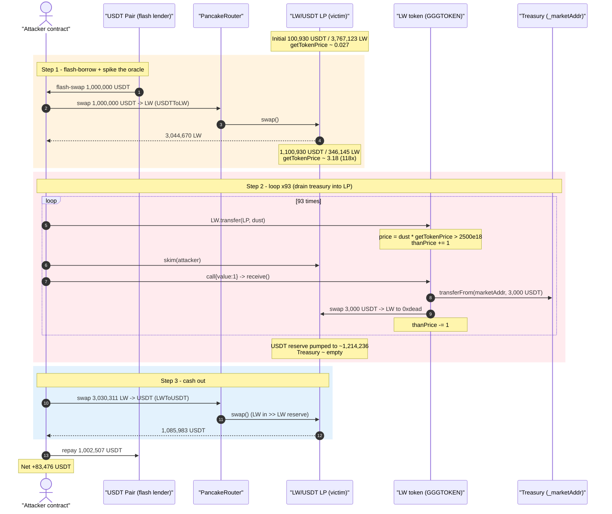
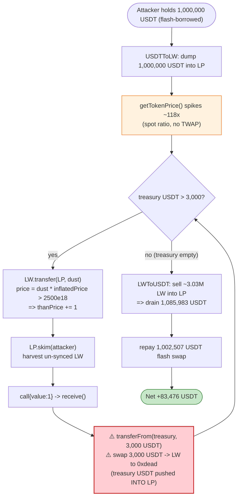
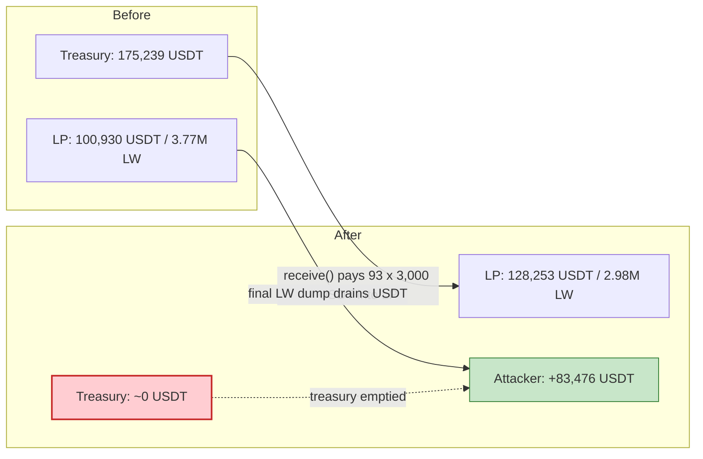

# LW Token Exploit — Spot-Price Oracle Manipulation Drains Protocol "Buyback" Treasury into the LP, Then Drains the LP

> **Reproduction:** the PoC compiles & runs in an isolated Foundry project at
> [this project folder](.) (the umbrella DeFiHackLabs repo contains many
> unrelated PoCs that do not whole-compile, so this one was extracted).
> Full verbose trace: [output.txt](output.txt).
> Verified vulnerable source: [GGGTOKEN.sol](sources/GGGTOKEN_7B8C37/GGGTOKEN.sol).

---

## Key info

| | |
|---|---|
| **Loss** | ~$50K live (two txs); the single-tx PoC nets **83,476.06 USDT** (≈ $83.5K) profit |
| **Vulnerable contract** | `LW` / `GGGTOKEN` — [`0x7B8C378df8650373d82CeB1085a18FE34031784F`](https://bscscan.com/address/0x7B8C378df8650373d82CeB1085a18FE34031784F#code) |
| **Victim pool** | LW/USDT PancakePair `LP` — [`0x6D2D124acFe01c2D2aDb438E37561a0269C6eaBB`](https://bscscan.com/address/0x6D2D124acFe01c2D2aDb438E37561a0269C6eaBB) |
| **Treasury drained** | `_marketAddr` — `0xae2f168900D5bb38171B01c2323069E5FD6b57B9` (held ~175,239 USDT of protocol fees) |
| **Flash-swap source** | USDT-side `Pair` — `0x16b9a82891338f9bA80E2D6970FddA79D1eb0daE` |
| **Attacker EOA** | [`0x4404de29913e0fd055190e680771a016777973e5`](https://bscscan.com/address/0x4404de29913e0fd055190e680771a016777973e5) |
| **Attacker contract** | [`0xa4fbc2c95ac4240277313bf3f810c54309dfcd6c`](https://bscscan.com/address/0xa4fbc2c95ac4240277313bf3f810c54309dfcd6c) |
| **Attack tx** | [`0xb846f3ae…975e4e4a`](https://bscscan.com/tx/0xb846f3aeb9b3027fe138b23bbf41901c155bd6d4b24f08d6b83bd37a975e4e4a) (and `0x96b34dc3…ba2b3713`) |
| **Chain / block / date** | BSC / 28,133,285 / 2023-05-12 (PoC fork block) |
| **Compiler** | Solidity v0.8.6, optimizer **on, 200 runs** |
| **Bug class** | Manipulable spot-price oracle (`getTokenPrice`) driving a "buyback/burn" loop; reserve-vs-balance accounting abuse |

---

## TL;DR

`LW` (deployed as contract `GGGTOKEN`) is a fee-on-transfer token with a homemade
"price-defense" mechanism. It reads the **instantaneous PancakeSwap pool ratio** as its
price via [`getTokenPrice()`](sources/GGGTOKEN_7B8C37/GGGTOKEN.sol#L787-L789):

```solidity
function getTokenPrice() public view returns(uint256){
    return (IERC20(_token).balanceOf(_uniswapV2Pair))*1e18
           /(IERC20(address(this)).balanceOf(_uniswapV2Pair));
}
```

When someone sells a "large enough" amount (`price > 2500e18`) it bumps a counter `thanPrice`
([`_transfer`:534-540](sources/GGGTOKEN_7B8C37/GGGTOKEN.sol#L534-L540)). Every time the token's
`receive()` fallback is poked, while `thanPrice > 0`, the contract **spends 3,000 USDT out of its
own market/treasury wallet** to "buy back & burn" LW — by swapping that 3,000 USDT into the LP for
LW sent to `0xdead` ([`receive()`:815-822](sources/GGGTOKEN_7B8C37/GGGTOKEN.sol#L815-L822) →
[`swapTokensForDead`:791-810](sources/GGGTOKEN_7B8C37/GGGTOKEN.sol#L791-L810)).

The attacker flash-borrows 1,000,000 USDT, dumps it into the LP so `getTokenPrice()` spikes ~118×,
then loops: each iteration nudges `thanPrice` up by selling a dust amount of LW (whose USD value is
inflated by the manipulated price), and pokes `receive()` so the token **drains 3,000 USDT of
treasury into the LP** while burning LW out of it. After ~93 iterations the treasury is empty and
the LP's USDT reserve has been pumped up with the treasury's money. The attacker then sells the
~3.03M LW it had accumulated back into the LP, extracting **1,085,983 USDT**, repays the
1,002,507 USDT flash loan, and walks away with **83,476 USDT**.

The protocol literally **paid the attacker out of its own treasury** to crash its own pool.

---

## Background — what the LW token does

`GGGTOKEN` ([source](sources/GGGTOKEN_7B8C37/GGGTOKEN.sol)) is an ERC20 ("LW", 9,000,000 supply,
18 decimals) paired against USDT on PancakeSwap, with several bolted-on "DeFi" features:

- **Fee-on-transfer** — `getBuyFee()`/`getSellFee()`
  ([:618-665](sources/GGGTOKEN_7B8C37/GGGTOKEN.sol#L618-L665)) charge a time-decaying buy/sell tax
  (~11%/12% initially). The fee LW is collected to the token contract and periodically swapped for
  USDT, **65% of which is forwarded to `_marketAddr`** ([`transferSwap`:568-585](sources/GGGTOKEN_7B8C37/GGGTOKEN.sol#L568-L585)).
  This is how `_marketAddr` had accumulated ~175,239 USDT.
- **A homemade spot oracle** — `getTokenPrice()`
  ([:787-789](sources/GGGTOKEN_7B8C37/GGGTOKEN.sol#L787-L789)) returns the raw, manipulable LP ratio.
- **A "price-defense" buyback** — when `thanPrice > 0`, the token's `receive()` fallback spends
  3,000 USDT of treasury per poke to buy & burn LW
  ([:815-822](sources/GGGTOKEN_7B8C37/GGGTOKEN.sol#L815-L822)). `thanPrice` is incremented inside
  `_transfer` whenever a "sell" has a USD value above 2,500e18
  ([:534-540](sources/GGGTOKEN_7B8C37/GGGTOKEN.sol#L534-L540)).
- **An interest/rebase mechanism** — `balanceOf` returns `_tOwned + getInterest`, and `getInterest`
  silently mints LW to holders over elapsed time ([:727-756](sources/GGGTOKEN_7B8C37/GGGTOKEN.sol#L727-L756)).

The on-chain state at the fork block (read from the trace):

| Parameter | Value | Source |
|---|---|---|
| LP reserves (USDT = token0, LW = token1) | **USDT 100,930.09 / LW 3,767,123.49** | [output.txt:54](output.txt) |
| `_marketAddr` USDT balance (treasury) | **~175,239.35 USDT** | [output.txt:82](output.txt) |
| Buyback amount per `receive()` poke | **3,000 USDT** | `receive()` line 818 |
| Sell-USD threshold to bump `thanPrice` | **2,500e18** | `_transfer` line 536 |

The USDT-side `Pair` (`0x16b9…`) is an unrelated, deep USDT pool that the attacker uses only as a
**flash-swap lender** for 1,000,000 USDT.

---

## The vulnerable code

### 1. The price is the raw, instantaneous pool ratio

[`getTokenPrice()` — GGGTOKEN.sol:787-789](sources/GGGTOKEN_7B8C37/GGGTOKEN.sol#L787-L789):

```solidity
function getTokenPrice() public view returns(uint256){
    return (IERC20(_token).balanceOf(_uniswapV2Pair))*1e18
           /(IERC20(address(this)).balanceOf(_uniswapV2Pair));   // ⚠️ spot ratio, no TWAP
}
```

This is `USDT_in_pool / LW_in_pool`, readable and movable inside a single transaction by anyone who
can change the pool's balances (i.e. anyone with capital / a flash loan).

### 2. A "sell" above $2,500 arms the buyback counter

[`_transfer` — GGGTOKEN.sol:534-540](sources/GGGTOKEN_7B8C37/GGGTOKEN.sol#L534-L540):

```solidity
} else if(getSellFee() > 0 && to==_uniswapV2Pair){ // sell
    uint256 price = (amount*getTokenPrice())/1e18;
    if(2500e18 < price && _startTimeForSwap + 72*60*60 < block.timestamp){
        thanPrice += 1;          // ⚠️ armed by a manipulated `getTokenPrice()`
        pr[from] = price;
    }
    amount = takeSell(from, amount);
}
```

Because `getTokenPrice()` is inflated, even a **dust** LW transfer to the pair crosses the
`2500e18` USD threshold and increments `thanPrice`.

### 3. Poking `receive()` spends 3,000 USDT of treasury into the LP

[`receive()` — GGGTOKEN.sol:815-822](sources/GGGTOKEN_7B8C37/GGGTOKEN.sol#L815-L822):

```solidity
receive() external payable {
    if(thanPrice==0) return;
    if(IERC20(_token).balanceOf(_marketAddr) >= 3000e18){
        IERC20(_token).transferFrom(_marketAddr, address(this), 3000e18); // pull treasury USDT
        swapTokensForDead(3000e18);   // ⚠️ swap 3000 USDT -> LW into 0xdead, pushing USDT into LP
        thanPrice -= 1;
    }
}
```

[`swapTokensForDead` — GGGTOKEN.sol:791-810](sources/GGGTOKEN_7B8C37/GGGTOKEN.sol#L791-L810) routes
`USDT -> LW` to `0xdead`, so each poke **adds 3,000 USDT to the LP reserve** (and burns the LW it
buys). The treasury is drained 3,000 USDT at a time; the LP's USDT side keeps growing.

### 4. The buyback is wide open: anyone can poke `receive()`

`receive()` has no access control and fires on any plain value transfer. The attacker triggers it 93
times with `payable(LW).call{value: 1}("")` ([test/LW_exp.sol:62](test/LW_exp.sol#L62)).

---

## Root cause — why it was possible

The protocol built an automated, value-moving control loop on top of a **single-block-manipulable
spot price**, and made every link in that loop **permissionless**:

1. **Manipulable oracle.** `getTokenPrice()` reads the raw LP ratio. A flash-loaned USDT dump moves
   it ~118× in one call (from `100,930/3,767,123 ≈ 0.027` to `1,100,930/346,145 ≈ 3.18`), so the
   "is this a big sell?" gate (`price > 2500e18`) is trivially satisfiable with dust.
2. **Permissionless arming.** `thanPrice` is bumped by any LW→pair transfer that clears the inflated
   USD threshold — the attacker controls both the input amount and the price.
3. **Permissionless, treasury-funded payout.** `receive()` is callable by anyone and *spends the
   protocol's own USDT treasury* (3,000 at a time) to buy LW into the pool. Each poke is a free
   injection of treasury USDT into the LP — value the attacker will later swap out.
4. **Reserve/balance & interest accounting.** Fee-on-transfer LW, the `skim` of un-synced balances,
   and the `getInterest` rebase let the attacker amass ~3.03M LW cheaply, so the final sell against
   the (now treasury-fattened) USDT reserve drains ~89% of it.

In short: the attacker manipulates the oracle so the protocol misclassifies dust as a "huge sell",
then repeatedly triggers the protocol's defense to pour its **own treasury** into the LP, and finally
sells into the enriched pool. The "buyback & burn" defense is the exploit primitive.

---

## Preconditions

- `_marketAddr` holds USDT (the protocol fee treasury) — here ~175,239 USDT. The loop drains it
  3,000 at a time; it is also continuously **replenished** because the loop's own swaps generate
  fee-LW that `transferSwap` converts to USDT and sends 65% back to `_marketAddr`, which is why the
  loop ran **93 times** (≈ 279,000 USDT cycled) on a 175K starting treasury.
- `_startTimeForSwap + 72h < block.timestamp` so the `thanPrice` bump branch is live (true at the
  fork block).
- Working capital to spike the oracle and to mint the LW inventory — supplied here by a **flash swap**
  of 1,000,000 USDT from the unrelated `Pair`, repaid in full intra-transaction
  ([test/LW_exp.sol:47,65](test/LW_exp.sol#L47-L65)). The exploit is therefore self-funding.

---

## Attack walkthrough (with on-chain numbers from the trace)

The LP's `token0 = USDT`, `token1 = LW`, so `reserve0 = USDT`, `reserve1 = LW`. All figures are taken
directly from `getReserves`/`Sync` events in [output.txt](output.txt).

| # | Step | LP USDT reserve | LP LW reserve | Treasury (marketAddr) USDT | Effect |
|---|------|----------------:|--------------:|---------------------------:|--------|
| 0 | **Initial** ([:54](output.txt)) | 100,930.09 | 3,767,123.49 | 175,239.35 | Honest pool; `getTokenPrice` ≈ 0.027 |
| 1 | **Flash-borrow** 1,000,000 USDT from `Pair`; **`USDTToLW`** swap 1,000,000 USDT → 3,044,670 LW ([:58-72](output.txt)) | 1,100,930.10 | 346,145.03 | 175,239.35 | Oracle spiked ~118× to ≈ 3.18; attacker now holds 3.04M LW |
| 2 | **Loop × 93** — each: `LW.transfer(LP, dust)` bumps `thanPrice`; `LP.skim(attacker)`; `call{value:1}` → `receive()` pulls **3,000 USDT** from treasury and swaps it into the LP, LW → `0xdead` | climbs 1,100,930 → **1,214,236** | oscillates ~314k–347k | drained 175,239 → < 3,000 | Treasury USDT is pumped **into the LP**; LW burned out to dead |
| 3 | **`LWToUSDT`** — attacker sells **3,030,311 LW** (≈ 2,666,674 reaches pool after tax) ([tail:124,292-293](output.txt)) | drops 1,214,236 → **128,253** | — | ~0 | Drains **1,085,983 USDT** (≈ 89% of reserve) out to attacker |
| 4 | **Repay** flash swap: `USDT.transfer(Pair, 1,002,507)` ([tail:300-312](output.txt)) | — | — | — | Loan + 0.25% fee repaid |
| 5 | **Final balance** ([tail:320](output.txt)) | — | — | — | Attacker USDT = **83,476.06** |

### Why the final sell drains the pool

At step 3 the LP's stored reserves are `USDT ≈ 1,214,236 / LW ≈ 314,145`. The attacker feeds
~2,666,674 LW in — roughly **8.5× the entire LW reserve**. PancakeSwap's `getAmountOut` then returns
nearly the whole USDT reserve:

`out = (in·9975·reserveUSDT) / (reserveLW·10000 + in·9975)` → with `in ≫ reserveLW`, `out → reserveUSDT`.

So the attacker pulls **1,085,983 USDT** out. Crucially, ~113,000 USDT of that came from the
**treasury** that the loop forced into the pool in step 2.

### Profit accounting (USDT)

| Direction | Amount |
|---|---:|
| Flash-borrowed | 1,000,000.00 |
| Spent — `USDTToLW` (into LP) | 1,000,000.01 |
| Received — final `LWToUSDT` | 1,085,983.06 |
| Repaid — flash swap (incl. 0.25% fee) | 1,002,507.00 |
| **Net attacker USDT** | **+83,476.06** |

The profit is sourced from (a) the ~175K treasury that the protocol's own `receive()` poured into the
LP, minus what was burned to `0xdead`, and (b) ordinary LPs' liquidity, captured via the inflated
final swap. The protocol funded most of its own loss.

---

## Diagrams

### Sequence of the attack



### The malicious control loop



### Where the value moves



---

## Why each magic number

- **`Pair.swap(1_000_000e18, 0, ...)`** ([test:47](test/LW_exp.sol#L47)): a flash swap that lends
  1,000,000 USDT (callback repays 1,002,507 USDT = principal + 0.25% Pancake fee). Provides both the
  oracle-spike capital and the LW-minting capital with zero attacker equity.
- **`2510e18 * 1e18 / getTokenPrice()`** ([test:58](test/LW_exp.sol#L58)): the per-iteration LW dust
  amount, sized just above the `2500e18` USD sell threshold using the *inflated* price, so it reliably
  bumps `thanPrice` while spending almost no LW.
- **`while marketAddr USDT > 3000e18`** ([test:56](test/LW_exp.sol#L56)): mirrors `receive()`'s
  guard; keeps poking until the treasury can no longer fund a 3,000-USDT buyback.
- **`USDT.transfer(Pair, 1_002_507e18)`** ([test:65](test/LW_exp.sol#L65)): exact flash-swap
  repayment (1,000,000 × 1.0025025 rounding to the integer used by Pancake's K-check).

---

## Remediation

1. **Do not derive prices from spot LP reserves.** Replace `getTokenPrice()` with a manipulation-
   resistant source (Chainlink, or a Uniswap-V2 TWAP accumulated over multiple blocks). Any
   value-moving logic keyed off an in-block ratio is exploitable with a flash loan.
2. **Never let an unprivileged call spend the treasury.** The `receive()` buyback transfers protocol
   USDT on every poke with no access control and no rate limit. Gate it to a trusted keeper/owner,
   make it pull-based, and cap spend per block.
3. **Decouple "burn/buyback" from attacker-controllable triggers.** `thanPrice` is armed by a
   user-chosen transfer against a manipulated price; arming and execution must not both be
   permissionless and in the same transaction.
4. **Don't push treasury funds into the very pool being priced.** `swapTokensForDead` injects
   treasury USDT into the LP, directly enriching whoever can drain that reserve next. Burn from
   owned tokens, not by trading treasury capital into the market.
5. **Fix the reserve/balance & interest accounting.** Fee-on-transfer + `skim` of un-synced balances
   + a time-based `getInterest` mint let the attacker accumulate a huge LW inventory cheaply. Audit
   these so a holder cannot acquire far more sellable balance than they paid for.

---

## How to reproduce

The PoC was extracted into a standalone Foundry project (the umbrella DeFiHackLabs repo does not
whole-compile under `forge test`):

```bash
_shared/run_poc.sh 2023-05-LW_exp -vvvvv
```

- RPC: a **BSC archive** endpoint is required (fork block 28,133,285). `foundry.toml` uses
  `https://bsc-mainnet.public.blastapi.io`, which serves historical state; most public BSC RPCs prune
  it and fail with `header not found` / `missing trie node`.
- Result: `[PASS] testExploit()` with attacker USDT balance ≈ 83,476.

Expected tail:

```
Ran 1 test for test/LW_exp.sol:ContractTest
[PASS] testExploit() (gas: 26252664)
Logs:
  Attacker USDT balance after exploit: 83476.060256134142898801
```

---

*References: PeckShieldAlert https://twitter.com/PeckShieldAlert/status/1656850634312925184 ·
Hexagate https://twitter.com/hexagate_/status/1657051084131639296 · SlowMist Hacked https://hacked.slowmist.io/ (LW, BSC, ~$50K).*
