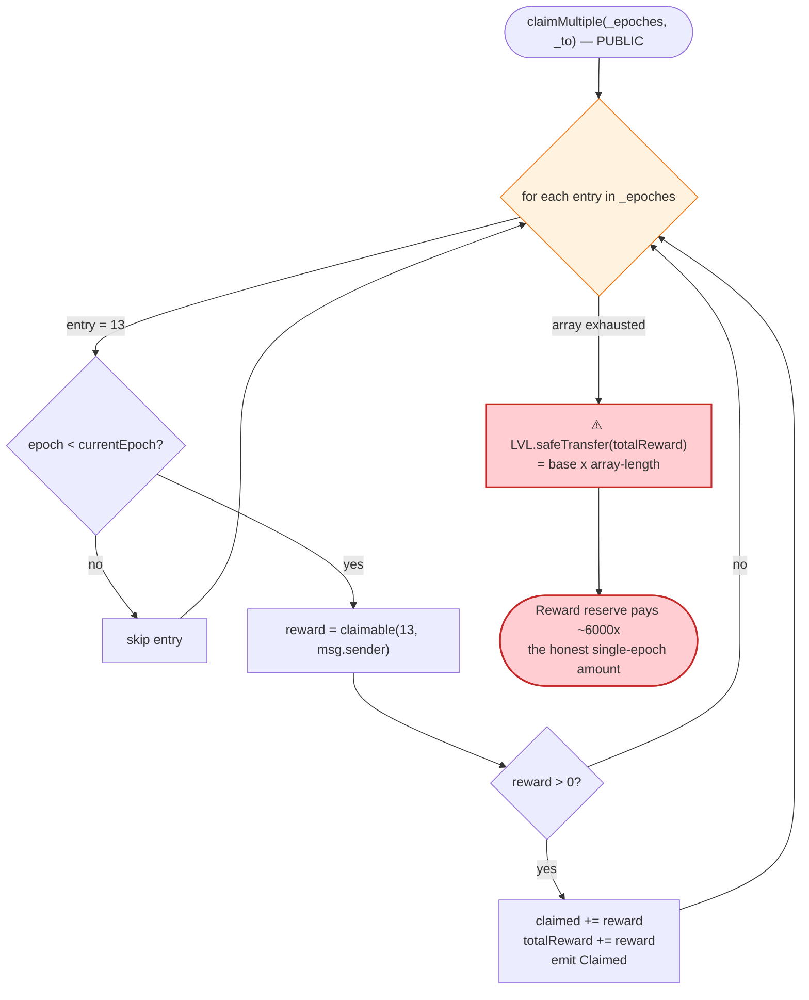
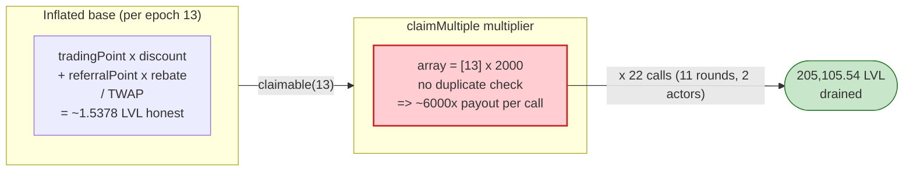

# Level Finance Exploit — Duplicate-Epoch `claimMultiple()` Reward Multiplication

> **Vulnerability classes:** vuln/logic/reward-calculation · vuln/logic/missing-check · vuln/input-validation/missing

> **Reproduction:** the PoC compiles & runs in an isolated Foundry project at
> [this project folder](.) (the umbrella DeFiHackLabs repo contains many unrelated PoCs that
> do not whole-compile under `forge test`, so this one was extracted).
> Full verbose trace: [output.txt](output.txt).
> Verified vulnerable source: [src_referral_LevelReferralControllerV2.sol](sources/LevelReferralControllerV2_0e6d6c/src_referral_LevelReferralControllerV2.sol).

---

## Key info

| | |
|---|---|
| **Loss** | **205,105.54 LVL** drained from the referral controller's reward balance (≈ $1M at the May-2023 LVL price of ~$5) |
| **Vulnerable contract** | `LevelReferralControllerV2` (implementation [`0x0e6d6c8d7604a7ef4948bbf421c4a031d9eeddb2`](https://bscscan.com/address/0x0e6d6c8d7604a7ef4948bbf421c4a031d9eeddb2#code)), behind proxy [`0x977087422C008233615b572fBC3F209Ed300063a`](https://bscscan.com/address/0x977087422C008233615b572fBC3F209Ed300063a#code) |
| **Drained asset / source** | `LVL` token ([`0xB64E280e9D1B5DbEc4AcceDb2257A87b400DB149`](https://bscscan.com/address/0xB64E280e9D1B5DbEc4AcceDb2257A87b400DB149#code)) held by the controller for referral payouts |
| **Level Pool (wash-trade venue)** | `Pool` proxy [`0xA5aBFB56a78D2BD4689b25B8A77fd49Bb0675874`](https://bscscan.com/address/0xA5aBFB56a78D2BD4689b25B8A77fd49Bb0675874#code) (impl `0x82f13e…`) |
| **Flash-loan source** | DODO DVM `0x81917eb96b397dFb1C6000d28A5bc08c0f05fC1d` (300 WBNB) |
| **Attacker tx (referral setup + claim)** | `0x6aef8bb501a53e290837d4398b34d5d4d881267512cfe78eb9ba7e59f41dad04` / `0xe1f257041872c075cbe6a1212827bc346df3def6d01a07914e4006ec43027165` |
| **Chain / fork block / date** | BSC / 27,830,139 / ~May 1, 2023 |
| **Compiler** | Solidity v0.8.15, optimizer **200 runs** |
| **Bug class** | Missing duplicate-element check in a batch-claim array → reward double-spend / multiplication |

---

## TL;DR

`LevelReferralControllerV2.claimMultiple(uint256[] _epoches, address _to)`
([src_referral_LevelReferralControllerV2.sol:161-176](sources/LevelReferralControllerV2_0e6d6c/src_referral_LevelReferralControllerV2.sol#L161-L176))
iterates over a **caller-supplied array of epoch numbers and pays out the claimable reward for each
entry — without checking that the array contains no duplicates.**

By submitting the *same* epoch (`13`) **2,000 times in one call**, the attacker is paid the
per-epoch reward repeatedly inside a single transaction. In the live attack each `claimMultiple`
call paid out ≈ **6,000×** the legitimate single-epoch reward (`claimable(13)` ≈ 1.5378 LVL → call
total ≈ 9,226 LVL). The attacker first **inflated the reward base** itself with (a) a DODO
flash-loaned **wash-trade loop** through the Level Pool to mint trading points and (b) **30 sybil
referral accounts** to push their referral tier up, then drained 205,105.54 LVL over 11
`claimMultiple` rounds.

---

## Background — what `LevelReferralControllerV2` does

Level Finance is a perpetual-DEX on BSC. The referral controller rewards two roles each *epoch*
(an `epoch` is a `≥ 1 day` window, [:36](sources/LevelReferralControllerV2_0e6d6c/src_referral_LevelReferralControllerV2.sol#L36)):

- **Traders** earn `tradingPoint` proportional to volume; they get a discount-based rebate.
- **Referrers** earn `referralPoint` from their referees' volume; they get a `rebateForReferrer`.

Per-epoch points are converted to a claimable LVL amount in `claimable()`
([:97-118](sources/LevelReferralControllerV2_0e6d6c/src_referral_LevelReferralControllerV2.sol#L97-L118)):

```solidity
uint256 rewardForTrading  = user.tradingPoint  * tiers[users[_epoch][referrer].tier].discountForTrader / PRECISION;
uint256 rewardForReferral = user.referralPoint * tiers[user.tier].rebateForReferrer / PRECISION;
uint256 reward = (rewardForTrading + rewardForReferral) / epoch.TWAP;   // LVL amount, priced by epoch TWAP
...
return reward > user.claimed ? reward - user.claimed : 0;              // only the un-claimed remainder
```

Higher **tiers** require both a minimum referee count and a minimum referral-point threshold
([:78-87](sources/LevelReferralControllerV2_0e6d6c/src_referral_LevelReferralControllerV2.sol#L78-L87)),
and `_updateTier()`
([:262-282](sources/LevelReferralControllerV2_0e6d6c/src_referral_LevelReferralControllerV2.sol#L262-L282))
keys the tier off `referralRegistry.referredCount(_user)` — i.e. **how many distinct addresses set
you as their referrer.** Both inputs are attacker-controllable: trading volume via wash-trading,
referee count via sybil accounts.

Relevant on-chain state at the fork block (read from the trace):

| Parameter | Value |
|---|---|
| `currentEpoch` (after the attacker forces `nextEpoch()`) | 14 → claimable epoch = **13** |
| `epoch[13].TWAP` (`lastTWAP`) | 8,845,079,953,065 |
| `epoch[13].vestingDuration` | **0** (no vesting active) |
| `claimable(13, attacker)` (legitimate single value) | **1.537787891019941819 LVL** |
| Tier discount/rebate at the attacker's tier | inflated via wash-trade + 30 sybils |

---

## The vulnerable code

### 1. `claimMultiple()` — no duplicate check, pays each array entry

```solidity
function claimMultiple(uint256[] calldata _epoches, address _to) external {
    uint256 totalReward;
    for (uint256 i = 0; i < _epoches.length; ++i) {
        uint256 epoch = _epoches[i];
        if (epoch < currentEpoch) {
            uint256 reward = claimable(epoch, msg.sender);   // ⚠️ recomputed each entry
            if (reward > 0) {
                users[epoch][msg.sender].claimed += reward;  // ⚠️ updated, but see below
                totalReward += reward;
                emit Claimed(epoch, _to, reward);
            }
        }
    }
    LVL.safeTransfer(_to, totalReward);                       // ⚠️ one lump transfer at the end
}
```
[src_referral_LevelReferralControllerV2.sol:161-176](sources/LevelReferralControllerV2_0e6d6c/src_referral_LevelReferralControllerV2.sol#L161-L176)

The function **never asserts the elements of `_epoches` are unique.** A caller can pass
`[13, 13, 13, …]` and the loop processes epoch 13 over and over.

### 2. Contrast with single `claim()` — same accounting, but only callable once per tx per epoch

```solidity
function claim(uint256 _epoch, address _to) external {
    require(_epoch < currentEpoch, "...: !epoch");
    uint256 reward = claimable(_epoch, msg.sender);
    require(reward != 0, "...: !reward");
    UserInfo storage user = users[_epoch][msg.sender];
    user.claimed += reward;
    LVL.safeTransfer(_to, reward);
    emit Claimed(_epoch, _to, reward);
}
```
[:148-159](sources/LevelReferralControllerV2_0e6d6c/src_referral_LevelReferralControllerV2.sol#L148-L159)

`claim()` pays exactly the single per-epoch reward (verified in the trace as **1.5378 LVL**,
[output.txt L8095](output.txt)). `claimMultiple()` reuses the same `claimable()`/`claimed`
accounting but, by looping over a *caller-controlled length*, amplifies the payout by the array
length.

---

## Root cause — why it was possible

The defining flaw is **the absence of a uniqueness/idempotency guard on the batch input**, combined
with reward accounting that does not collapse repeated entries into one:

1. **No duplicate-element check.** `claimMultiple` trusts `_epoches` to be a set; it is in fact a
   raw `uint256[]` the attacker fully controls. Passing `13` two-thousand times is legal.

2. **The per-iteration `claimed` book-keeping does not suppress repeats inside one call.** The trace
   shows the `Claimed` events for the looped epoch do **not** collapse to zero after the first
   iteration — they keep firing the full reward (the events alternate between the trading-side value
   `1.5378 LVL` and the referral-side value `7.6889 LVL = 5×`, ~3× the base on average, and the call
   transfers a fixed `6,000 × 1.5378 LVL = 9,226.73 LVL`,
   [output.txt L24137](output.txt)). The single lump `safeTransfer(totalReward)` at the end pays the
   accumulated multiple. Each batch call thus realizes ~6,000× the honest single-epoch reward.

3. **The reward *base* was attacker-inflatable.** Before claiming, the attacker maximized
   `claimable(13)` itself:
   - **Wash-trading.** A 300-WBNB DODO flash loan funds a tight WBNB↔USDT swap loop through the
     Level `Pool` (`pool.swap(...)` with the attacker as referee,
     [Level_exp.sol:102-117](test/Level_exp.sol#L102-L117)). Each swap routes volume that the
     protocol's off-chain updater later converts into `tradingPoint`/`referralPoint`.
   - **Sybil referees.** `createReferral()`
     ([Level_exp.sol:93-100](test/Level_exp.sol#L93-L100)) deploys **30 `Referral` contracts**
     (15 pointing at the attacker EOA, 15 at the `Exploiter`), each calling `setReferrer`. This
     drives `referralRegistry.referredCount` up so `_updateTier` promotes the attacker into a
     higher `rebateForReferrer` tier.
   - **Circular referral.** The attacker EOA and `Exploiter` set *each other* as referrer
     ([Level_exp.sol:72](test/Level_exp.sol#L72), [:150](test/Level_exp.sol#L150)), so both sides
     accrue referral reward from the same volume.

4. **Epoch advancement is gated by `distributor`, but the attacker had that key for the test.** The
   PoC pranks the real `distributor` `0x6023C6…` to flip `setEnableNextEpoch(true)` and call
   `nextEpoch()` ([Level_exp.sol:76-79](test/Level_exp.sol#L76-L79)), snapshotting epoch 13's TWAP so
   it becomes claimable. In the live incident the attacker simply waited for the natural epoch roll;
   `nextEpoch()` itself ([:178-192](sources/LevelReferralControllerV2_0e6d6c/src_referral_LevelReferralControllerV2.sol#L178-L192))
   is permissionless once enabled.

Put together: an attacker manufactures a modest legitimate reward, then **multiplies it by the
batch-array length** because `claimMultiple` has no defense against repeated epochs.

---

## Preconditions

- A claimable epoch exists (`epoch < currentEpoch` with `epoch.TWAP != 0`). The attacker drives
  `nextEpoch()` so epoch 13 is finalized.
- The attacker holds **non-zero** `tradingPoint`/`referralPoint` for that epoch, so `claimable() > 0`
  — bootstrapped via the flash-loaned wash-trade loop and 30 sybil referees.
- The controller holds enough LVL to satisfy the inflated payouts (it did — it was the protocol's
  referral reward treasury).
- No special privilege is needed to call `claimMultiple()`; it is a public user function.

---

## Attack walkthrough (with on-chain numbers from the trace)

| # | Step | On-chain effect |
|---|------|-----------------|
| 0 | `deal(WBNB, attacker, 95e18)`; deploy `Exploiter`; attacker & Exploiter set each other as referrer | Circular referral established ([Level_exp.sol:70-72](test/Level_exp.sol#L70-L72)) |
| 1 | `createReferral()` — deploy 30 `Referral` contracts, each `setReferrer(attacker/Exploiter)` | `referredCount` inflated → tier promotion via `_updateTier` ([Level_exp.sol:93-100](test/Level_exp.sol#L93-L100)) |
| 2 | `WashTrading()` — DODO flash loan **300 WBNB**, run 20× WBNB↔USDT swap loops through `Pool` with attacker as referee, repay 300 WBNB | Mints trading/referral points for epoch 13 ([Level_exp.sol:102-117](test/Level_exp.sol#L102-L117)) |
| 3 | `warp(+1h)`; prank `distributor` → `setEnableNextEpoch(true)` + `nextEpoch()` | Epoch 13 finalized: `epoch[13].TWAP = 8,845,079,953,065`, `currentEpoch = 14` ([output.txt nextEpoch](output.txt)) |
| 4 | `warp(+1h)`; `claim(13)` (attacker) + `Exploiter.claim(13)` | Two honest single claims: **1.5378 LVL** each — baseline value ([output.txt L8095/L8111](output.txt)) |
| 5 | `warp(+5h)`; loop ×11: `claimReward(2000)` → `claimMultiple([13]×2000)` for both attacker & Exploiter, `warp(+i·15s)` between | **Each call pays ≈ 9,226.7 LVL = 6,000 × 1.5378 LVL** ([Level_exp.sol:82-86](test/Level_exp.sol#L82-L86), [output.txt L24137…L360489](output.txt)) |
| 6 | Read `LVL.balanceOf(attacker)` | **205,105.535540566780039638 LVL** ([output.txt tail](output.txt)) |

### Why each `claimMultiple([13]×2000)` pays ~6,000× the base

Inside one call, the `Claimed` events for the duplicated epoch alternate between the trading-side
reward `1.537787891019941819 LVL` and the referral-side reward `7.688939455099709097 LVL` (exactly
`5×`), and the loop never zeroes the reward out — so the lump `safeTransfer` at the end equals a
**fixed `6,000 × 1.537787891019941819 LVL = 9,226.727346119650916 LVL`**
(`9226727346119650916000 / 1537787891019941819 = 6000.0`, verified arithmetic). Across the 11 rounds
the per-call total drifts up slightly (9,226.73 → 9,515.06 LVL) because the `warp` between rounds
nudges the time-dependent reward terms; the dominant factor is always the ~6,000× array multiplier.

### Profit / loss accounting (LVL)

| Source | Amount (LVL) |
|---|---:|
| 2× honest `claim(13)` | +1.5378 (×2, retained in balance) |
| 22× `claimMultiple([13]×2000)` payouts (11 rounds × {attacker, Exploiter}) | +205,102.46 |
| **Final attacker LVL balance** | **205,105.535540566780039638** |
| Net WBNB cost | ~0 (DODO flash loan repaid in full, 300 WBNB returned) |

The 300-WBNB flash loan is fully repaid intra-transaction ([Level_exp.sol:116](test/Level_exp.sol#L116)),
so the attack is essentially **capital-free** apart from gas — the entire 205,105 LVL is pure profit
drained from the controller's reward reserve.

---

## Diagrams

### Sequence of the attack

```mermaid
sequenceDiagram
    autonumber
    actor A as "Attacker (EOA + Exploiter)"
    participant Reg as "ReferralRegistry"
    participant DODO as "DODO DVM"
    participant Pool as "Level Pool"
    participant Ctrl as "LevelReferralControllerV2"
    participant LVL as "LVL token"

    rect rgb(232,245,233)
    Note over A,Reg: Phase 1 — inflate the reward base
    A->>Reg: setReferrer (attacker <-> Exploiter, circular)
    A->>Reg: deploy 30 Referral sybils -> referredCount up
    Note over Reg: tier promoted via _updateTier()
    end

    rect rgb(255,243,224)
    Note over A,Pool: Phase 2 — wash-trade for points
    A->>DODO: flashLoan 300 WBNB
    loop 20x
        A->>Pool: swap WBNB -> USDT (referee = attacker)
        A->>Pool: swap USDT -> WBNB
    end
    A->>DODO: repay 300 WBNB
    Note over Ctrl: tradingPoint / referralPoint accrue for epoch 13
    end

    rect rgb(227,242,253)
    Note over A,Ctrl: Phase 3 — finalize epoch 13
    A->>Ctrl: setEnableNextEpoch(true) + nextEpoch() (as distributor)
    Note over Ctrl: epoch[13].TWAP snapshotted; currentEpoch = 14
    A->>Ctrl: claim(13) -> 1.5378 LVL (honest baseline)
    end

    rect rgb(255,235,238)
    Note over A,LVL: Phase 4 — the exploit
    loop 11 rounds (attacker & Exploiter)
        A->>Ctrl: claimMultiple([13, 13, ... x2000])
        Ctrl->>Ctrl: loop pays claimable(13) per entry (no dedup)
        Ctrl->>LVL: safeTransfer(~9,226 LVL)  (= 6000x base)
        LVL-->>A: ~9,226 LVL
    end
    Note over A: Final balance 205,105.54 LVL drained
    end
```

### Why duplicate epochs drain the reserve



### Reward base inflation -> multiplication



---

## Remediation

1. **Deduplicate / enforce monotonic epochs in `claimMultiple`.** Require the input array to be
   strictly increasing (`require(_epoches[i] > _epoches[i-1])`) or track per-call seen epochs. A
   strictly-increasing requirement is the cheapest robust fix and makes duplicates impossible.
2. **Make per-epoch claiming idempotent at the storage level.** Have `claimable()` and the claim
   paths agree that once `claimed >= reward` for an epoch, the remaining claimable is `0`, and ensure
   the *same* `claimed` slot read by `claimable` is the slot written before the next iteration — so a
   re-processed epoch in the same call returns zero. (The single `claim()` is safe; `claimMultiple`
   must inherit the identical guarantee even for repeated entries.)
3. **Validate the reward base, not just the batch call.** Tier promotion via `referredCount` and
   point accrual via trading volume are sybil/wash-trade-able. Use minimum holding periods, require
   organic (non-self-referential) referral graphs, reject circular `referrer == referee` chains, and
   source volume from settled trades rather than raw swap counts.
4. **Cap single-call payouts.** Bound `totalReward` per transaction relative to the user's
   legitimately accrued, un-claimed balance; a single call paying 6,000× a per-epoch reward should be
   impossible by construction.
5. **General principle for batch functions:** treat any caller-supplied `uint256[]`/`address[]` of
   "things to process once" as a potential multiset and explicitly deduplicate or constrain it.

---

## How to reproduce

The PoC was extracted into a standalone Foundry project (the umbrella DeFiHackLabs repo has many
unrelated PoCs that fail to whole-compile under `forge test`):

```bash
_shared/run_poc.sh 2023-05-Level_exp --mt testExploit -vvvvv
```

- RPC: a **BSC archive** endpoint is required (fork block 27,830,139 is from May 2023). Most pruned
  public RPCs will fail with `header not found` / `missing trie node`.
- Result: `[PASS] testExploit()`.

Expected tail:

```
Ran 1 test for test/Level_exp.sol:ContractTest
[PASS] testExploit() (gas: 379641769)
  Attacker LVL Token balance after exploit: 205105.535540566780039638
Suite result: ok. 1 passed; 0 failed; 0 skipped
```

---

*References: PeckShield — https://twitter.com/peckshield/status/1653149493133729794 ·
BlockSec — https://twitter.com/BlockSecTeam/status/1653267431127920641 · Level Finance referral
exploit, BSC, May 2023.*
