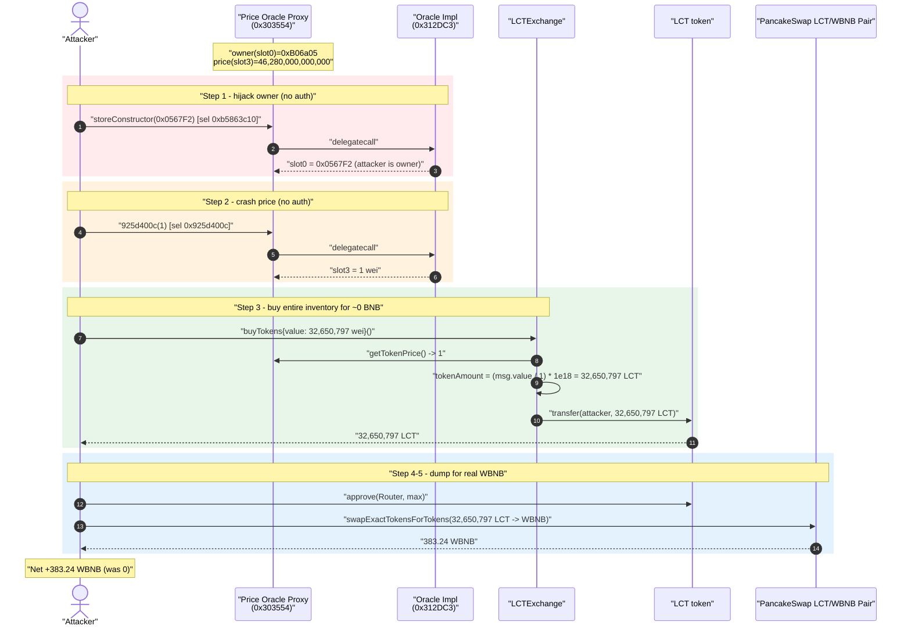
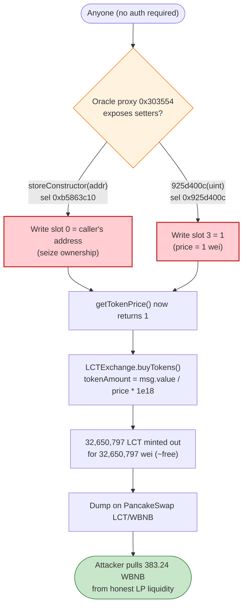
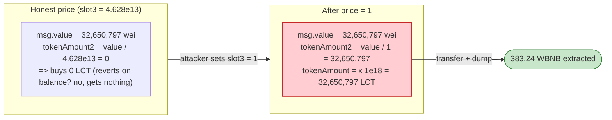

# LocalTrader2 (LCT) Exploit — Unprotected Proxy Implementation Lets Anyone Set the Token Price to 1 wei

> **Vulnerability classes:** vuln/access-control/uninitialized-proxy · vuln/access-control/missing-auth · vuln/oracle/price-manipulation

> **Reproduction:** the PoC compiles & runs in an isolated Foundry project at
> [this project folder](.) (the umbrella DeFiHackLabs repo
> contains many unrelated PoCs that do not whole-compile, so this one was extracted).
> Full verbose trace: [output.txt](output.txt).
> Verified vulnerable sources: [LCTExchange.sol](sources/LCTExchange_cE3e12/LCTExchange.sol),
> [LocalTraders.sol](sources/LocalTraders_5C65BA/LocalTraders.sol).

---

## Key info

| | |
|---|---|
| **Loss** | **383.24 WBNB** (~$110K at the time) drained from the LCT/WBNB PancakeSwap pool |
| **Vulnerable contract** | LCT "live-price" oracle implementation behind `TransparentUpgradeableProxy` — proxy [`0x303554d4D8Bd01f18C6fA4A8df3FF57A96071a41`](https://bscscan.com/address/0x303554d4D8Bd01f18C6fA4A8df3FF57A96071a41#code), implementation [`0x312DC37075646c7e0DBA21DF5BdFe69E76475fdc`](https://bscscan.com/address/0x312DC37075646c7e0DBA21DF5BdFe69E76475fdc) |
| **Companion contract** | `LCTExchange` (the token vendor) — [`0xcE3e12bD77DD54E20a18cB1B94667F3E697bea06`](https://bscscan.com/address/0xcE3e12bD77DD54E20a18cB1B94667F3E697bea06#code) |
| **Token** | LCT (`Local Traders`) — [`0x5C65BAdf7F97345B7B92776b22255c973234EfE7`](https://bscscan.com/address/0x5C65BAdf7F97345B7B92776b22255c973234EfE7#code) |
| **Victim pool** | LCT/WBNB PancakeSwap pair — `0x64b266Cd63fF3239E6491d6c2c58A5B8552c8724` |
| **Attacker EOA** | `0x0567F2323251f0Aab15c8dFb1967E4e8A7D42aeE` (the address written into the owner slot) |
| **Attack txs** | [tx1 — set owner](https://bscscan.com/tx/0x57b589f631f8ff20e2a89a649c4ec2e35be72eaecf155fdfde981c0fec2be5ba), [tx2 — set price](https://bscscan.com/tx/0xbea605b238c85aabe5edc636219155d8c4879d6b05c48091cf1f7286bd4702ba), [tx3 — buyTokens](https://bscscan.com/tx/0x49a3038622bf6dc3672b1b7366382a2c513d713e06cb7c91ebb8e256ee300dfb), [tx4 — dump](https://bscscan.com/tx/0x042b8dc879fa193acc79f55a02c08f276eaf1c4f7c66a33811fce2a4507cea63) |
| **Chain / block / date** | BSC / fork at 28,460,897 (attack spans 28,460,897–28,461,207) / ~May 23, 2023 |
| **Compiler** | Exchange `v0.8.3`, oracle proxy `v0.8.9` (optimizer 1), token `v0.8.7` |
| **Bug class** | Missing access control on an upgradeable-proxy implementation → attacker-controlled price oracle → free token mint-out → AMM dump |

---

## TL;DR

The LCT vendor contract `LCTExchange.buyTokens()` prices its token sales by reading an external
"live price" oracle: `tokenAmount = (msg.value / getLivePriceFromInheritance()) * 1e18`
([LCTExchange.sol:308-332](sources/LCTExchange_cE3e12/LCTExchange.sol#L308-L332)). That oracle is a
`TransparentUpgradeableProxy` whose implementation exposes **two state-setting functions with no access
control whatsoever**:

- selector `0xb5863c10` (`storeConstructor(address)`) writes **slot 0**, which holds the oracle's
  owner address.
- selector `0x925d400c` writes **slot 3**, which holds the token price returned by `getTokenPrice()`.

Anyone can call these directly on the proxy. The attacker:

1. **Overwrites the owner** (slot 0) with their own address — `0xB06a05...` → `0x0567F2...`.
2. **Overwrites the price** (slot 3) from `46,280,000,000,000` wei (0.00004628 BNB/LCT) down to **`1` wei**.
3. **Calls `LCTExchange.buyTokens()`** sending only `32,650,797` wei (≈3.3e-11 BNB). With the price now 1,
   `buyTokens` mints them `32,650,797 × 1e18 = 32,650,797 LCT` — essentially the exchange's entire
   inventory (32.65M LCT) **for free**.
4. **Dumps the 32.65M LCT** into the real LCT/WBNB PancakeSwap pool, swapping it for **383.24 WBNB**.

The attacker started with `0` WBNB and ended with `383.24` WBNB. The price oracle never had any
authorization on its setters, so the whole chain cost the attacker nothing but gas.

---

## Background — what LocalTrader2 / LCT is

`LCTExchange` ([source](sources/LCTExchange_cE3e12/LCTExchange.sol)) is a simple "token vendor" that
sells the `LCT` ERC-20 to users in exchange for BNB. The amount of LCT a buyer receives is computed
from a per-token price fetched from a separate oracle contract:

```solidity
function getLivePriceFromInheritance() public view returns (uint) {
    return LCTLivePriceInterface(lctLivePriceInterfaceAddr).getTokenPrice();
}
```
[LCTExchange.sol:276-278](sources/LCTExchange_cE3e12/LCTExchange.sol#L276-L278)

`lctLivePriceInterfaceAddr` points at the `TransparentUpgradeableProxy`
`0x303554...`, whose implementation (`0x312DC3...`) keeps the price in **storage slot 3** and the owner
in **storage slot 0**. The implementation's source was not verified on BscScan, but the trace shows its
exact behaviour: two unprotected functions mutate those slots.

On-chain facts at the fork block (read directly from the trace):

| Parameter | Value | Where |
|---|---|---|
| Oracle owner (slot 0) | `0xB06a05c7f92578Ef927860604EdAc89fD68dfEC9` | [output.txt:37](output.txt) |
| Oracle price (slot 3) | `46,280,000,000,000` wei = 0.00004628 BNB/LCT | [output.txt:56-57](output.txt) |
| LCT held by `LCTExchange` | `32,650,798.7462 LCT` | [output.txt:71-72](output.txt) |
| LCT/WBNB pair reserves | `38,546,702.8 LCT / 836.82 WBNB` | [output.txt:119-120](output.txt) |
| Attacker WBNB (start) | `0` | [output.txt:35](output.txt) |

The price `0.00004628` matches the developer's own comment in the source:
`// 1 / 0.00004628 = 21607.605877269` ([LCTExchange.sol:311](sources/LCTExchange_cE3e12/LCTExchange.sol#L311)).

---

## The vulnerable code

### 1. `buyTokens()` trusts an external, mutable price with no sanity bounds

```solidity
function buyTokens() public payable returns (uint, uint) {
    require(msg.value > 0, "Send ETH to buy some tokens");

    // uint256 tokenAmount = msg.value / livePriceRate; // 1 / 0.00004628 = 21607.605877269
    uint256 tokenAmount2 = msg.value / getLivePriceFromInheritance();   // ⚠️ divisor is attacker-controlled
    uint256 tokenAmount  = tokenAmount2 * 1000000000000000000;          // ⚠️ then scaled by 1e18

    require(
        token.balanceOf(address(this)) >= tokenAmount,
        "Vendor contract has not enough tokens in its balance"
    );

    bool sent = token.transfer(msg.sender, tokenAmount);               // ⚠️ ships the inventory
    require(sent, "Failed to transfer token to user");
    ...
}
```
[LCTExchange.sol:308-332](sources/LCTExchange_cE3e12/LCTExchange.sol#L308-L332)

If `getTokenPrice()` returns `1`, then `tokenAmount2 = msg.value / 1 = msg.value`, and
`tokenAmount = msg.value × 1e18`. A buyer sending a *tiny* `msg.value` of `32,650,797` wei therefore
"buys" `32,650,797 × 1e18 = 32,650,797 LCT` — capped only by the exchange's actual LCT balance. The
attacker sized `msg.value` to be exactly `(exchangeBalance / 1e18) − 1` so the
`balanceOf(exchange) >= tokenAmount` check passes by one whole token
([LocalTrader2_exp.sol:74](test/LocalTrader2_exp.sol#L74)).

### 2. The price oracle proxy has unprotected setters

The implementation behind the proxy exposes the two functions the attacker used. From the trace
(`delegatecall` into `0x312DC3...`):

```text
Proxy::storeConstructor(0x0567F2...)          // selector 0xb5863c10
  delegatecall → impl::storeConstructor(...)
    storage changes:
      @ 0: 0x...b06a05c7... → 0x...0567f2323251f0aab15c8dfb1967e4e8a7d42aee   // owner overwritten
      @ 2: ...                                                                // (book-keeping)
      @ 3: 0x145abff33800 → 0x2a1766f5d000                                    // (re-init)
      @ 1: ...

Proxy::925d400c(0x...01)                       // selector 0x925d400c
  delegatecall → impl::925d400c(1)
    storage changes:
      @ 3: 0x2a1766f5d000 → 1                                                 // price set to 1 wei
```
[output.txt:39-46](output.txt) and [output.txt:58-63](output.txt)

Neither call reverts, and neither is gated by `onlyOwner` or any equivalent. `storeConstructor`
(a "re-run the constructor" style initializer) is callable repeatedly by anyone and lets the caller
seize ownership; `0x925d400c` is a bare price setter callable by anyone. The PoC even verifies the
writes with `vm.load`/`assertEq` ([LocalTrader2_exp.sol:48-69](test/LocalTrader2_exp.sol#L48-L69)).

> **Note on the proxy.** This is a `TransparentUpgradeableProxy`. The transparent-proxy pattern only
> protects the *upgrade* admin functions; **any function the implementation itself declares is forwarded
> to non-admin callers**. Putting unauthenticated setters in the implementation defeats the proxy's
> protection — the proxy faithfully forwards `storeConstructor` and `925d400c` to the attacker.

---

## Root cause — why it was possible

The exploit is a two-link chain, but both links are the *same* class of mistake — **missing access
control** — and the second link is what turns a wrong price into money:

1. **The price oracle's state setters are permissionless.** `storeConstructor(address)` (slot 0 / owner)
   and `0x925d400c(uint256)` (slot 3 / price) can be called by anyone directly on the proxy. There is no
   `onlyOwner`, no initializer guard, no role check. This is the primary vulnerability.

2. **`LCTExchange.buyTokens()` blindly trusts that price and has no bounds.** It uses
   `msg.value / price` as the token quantity. A price of `1` makes LCT effectively free; there is no
   minimum-price floor, no slippage/sanity check, and no per-purchase cap besides the exchange's own
   balance. So the corrupted oracle reading is converted 1:1 into a free withdrawal of the entire token
   inventory.

3. **The free tokens have real market value.** A genuine LCT/WBNB PancakeSwap pool (`0x64b266...`) held
   ~836 WBNB of liquidity against ~38.5M LCT. Dumping 32.65M freshly-acquired LCT into that pool
   converts the worthless mint into **383.24 WBNB** of honest liquidity.

In short: *an unauthenticated oracle setter* + *an unbounded price-driven vendor* + *a real AMM market*
compose into "anyone drains the LCT pool for the price of gas."

---

## Preconditions

- The oracle proxy's setter functions are callable by anyone (always true — no auth). The attacker
  first seizes ownership via `storeConstructor`, though for the price write itself even ownership is
  unnecessary since `0x925d400c` is also unguarded.
- `LCTExchange` holds a non-trivial LCT inventory (32.65M LCT here) — that is the cap on the free mint.
- A liquid LCT/WBNB market exists to sell the tokens into (PancakeSwap pair `0x64b266...`, ~836 WBNB).
- No working capital is required: the attacker spends ~`3.3e-11` BNB on `buyTokens` and pays only gas;
  the proceeds (383.24 WBNB) are pure profit. The attack is trivially self-funding.

---

## Attack walkthrough (with on-chain numbers from the trace)

All figures are taken directly from [output.txt](output.txt).

| # | Step | Call | State change | Effect |
|---|------|------|--------------|--------|
| 0 | **Initial** | — | oracle owner = `0xB06a05…`, price (slot 3) = `46,280,000,000,000`; attacker WBNB = 0 | Honest configuration. |
| 1 | **Hijack owner** | `proxy.storeConstructor(0x0567F2…)` (sel `0xb5863c10`) | slot 0: `0xB06a05…` → `0x0567F2…` | Attacker becomes oracle owner. |
| 2 | **Crash the price** | `proxy.925d400c(1)` (sel `0x925d400c`) | slot 3: `46,280,000,000,000` → `1` | `getTokenPrice()` now returns 1 wei. |
| 3 | **Buy the inventory for free** | `LCTExchange.buyTokens{value: 32,650,797}()` | exchange LCT `32,650,798.75` → `1.75`; attacker LCT `0` → `32,650,797` | `tokenAmount = 32,650,797 × 1e18`; whole inventory shipped for ≈0 BNB. |
| 4 | **Approve router** | `LCT.approve(Router, type(uint256).max)` | allowance = max | Prep the dump. |
| 5 | **Dump on PancakeSwap** | `Router.swapExactTokensForTokensSupportingFeeOnTransferTokens(32,650,797 LCT, …, [LCT,WBNB], attacker)` | pair reserves `38.55M LCT / 836.82 WBNB` → `71.20M LCT / 453.58 WBNB` (Sync); attacker WBNB `0` → `383.24` | 32.65M LCT swapped out for **383.24 WBNB**. |

Steps 1–4 in the live incident were the four separate transactions linked in the Key-info table; the PoC
condenses them with `vm.roll` between blocks ([LocalTrader2_exp.sol:53-93](test/LocalTrader2_exp.sol#L53-L93)).

**Why `buyTokens` gives 32.65M LCT.** With slot 3 = 1:
`tokenAmount2 = msg.value / getTokenPrice() = 32,650,797 / 1 = 32,650,797`, then
`tokenAmount = 32,650,797 × 1e18 = 32,650,797 LCT`. The exchange held `32,650,798.7462 LCT`, so the
`balanceOf >= tokenAmount` guard passes ([output.txt:78-90](output.txt)). The attacker deliberately set
`msg.value = (balance / 1e18) − 1` so the requested amount is one token below the balance.

### Profit / loss accounting (WBNB)

| Direction | Amount |
|---|---:|
| Spent — `buyTokens` value | 0.0000000000326508 WBNB (32,650,797 wei) |
| Spent — capital at risk | 0 (self-funded; gas only) |
| **Received — LCT dump on PancakeSwap** | **383.240638704329950072 WBNB** |
| **Net profit** | **≈ +383.24 WBNB** |

The 383.24 WBNB came straight out of the LCT/WBNB pool's WBNB reserve (the pair's WBNB reserve fell from
`836.82` to `453.58` WBNB per the `Sync` event at [output.txt:134](output.txt)). That liquidity belonged
to honest LCT LPs.

---

## Diagrams

### Sequence of the attack



### Where the access-control hole sits



### Price → quantity blow-up inside `buyTokens`



---

## Remediation

1. **Add access control to the oracle's setters.** `storeConstructor(address)` and the price setter
   (`0x925d400c`) must be `onlyOwner`/role-gated. If `storeConstructor` is a constructor-replacement for
   the implementation, guard it with an `initializer`/`reinitializer` modifier (OpenZeppelin
   `Initializable`) so it can run exactly once, and never lets an arbitrary caller rewrite the owner slot.
2. **Do not put privileged logic in a transparent-proxy implementation without auth.** The transparent
   proxy only shields admin/upgrade calls; every implementation function is reachable by ordinary callers.
   Treat implementation functions as if they were on a normal contract and protect them accordingly.
3. **Bound and sanity-check the price in `buyTokens()`.** Reject prices outside a sane range
   (`require(price >= MIN_PRICE && price <= MAX_PRICE)`), reject `price == 0`/`price == 1`, and cap the
   LCT sold per call. A vendor that mints its entire inventory for ~0 value on a single bad oracle read
   has no defense-in-depth.
4. **Use a tamper-resistant price source.** A single mutable storage slot is not an oracle. Use a
   Chainlink feed, a TWAP from a deep pool, or at minimum a multisig/timelock-gated admin price with
   change-rate limits.
5. **Separate ownership from initialization.** The fact that `storeConstructor` could overwrite the owner
   slot means even a price-floor check could be bypassed by an attacker who first re-takes ownership.
   Make ownership transfer a deliberate, single-purpose, authenticated action.

---

## How to reproduce

The PoC was extracted into a standalone Foundry project (the umbrella DeFiHackLabs repo has many
unrelated PoCs that fail to compile under `forge test`'s whole-project build):

```bash
_shared/run_poc.sh 2023-05-LocalTrader2_exp -vvvvv
```

- RPC: a **BSC archive** endpoint is required (fork block 28,460,897). `foundry.toml` uses
  `https://bsc-mainnet.public.blastapi.io`, which serves historical state at that block; most pruned
  public BSC RPCs would fail with `header not found` / `missing trie node`.
- Result: `[PASS] testAccess()` ending with `[4] Attacker amount of WBNB after attack: 383.24…`.

Expected tail:

```
Ran 1 test for test/LocalTrader2_exp.sol:LocalTraders
[PASS] testAccess() (gas: 244263)
Logs:
  [1] Attacker amount of WBNB before attack: 0.000000000000000000
  [1] Address value in slot 0 before first call: 0xB06a05c7f92578Ef927860604EdAc89fD68dfEC9
  [1] Address value in slot 0 after first call: 0x0567F2323251f0Aab15c8dFb1967E4e8A7D42aeE
  [2] Uint value (token price) in slot 3 before second call: 46280000000000
  [2] Uint value (token price) in slot 3 after second call: 1
  [3] Bought LCT tokens: 32650797.000000000000000000
  [4] Attacker amount of WBNB after attack: 383.240638704329950072
Suite result: ok. 1 passed; 0 failed; 0 skipped
```

---

*References: PoC `@TX`s in [test/LocalTrader2_exp.sol](test/LocalTrader2_exp.sol#L7-L11); analysis by
Numen Cyber — https://twitter.com/numencyber/status/1661213691893944320 (LocalTrader2, BSC, May 2023).*
