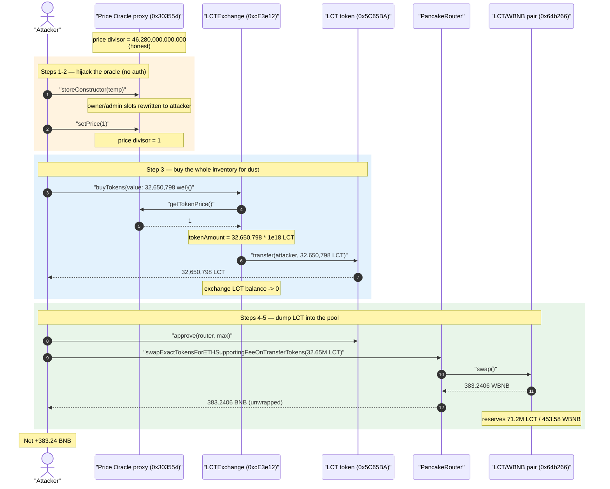
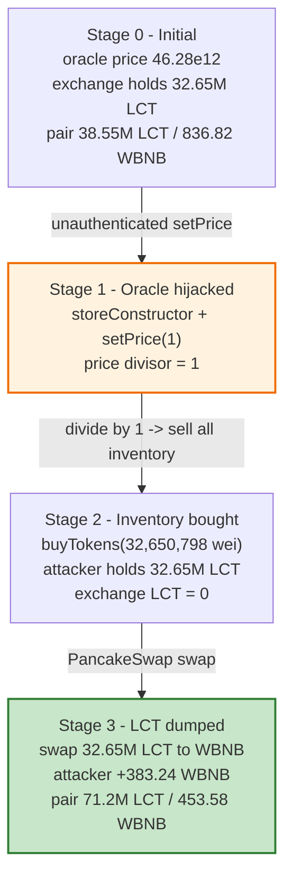
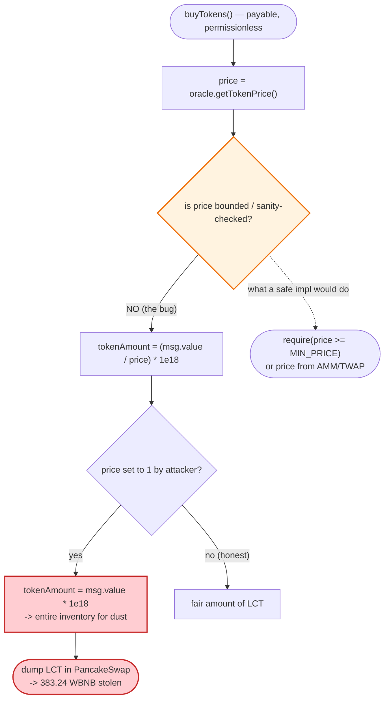

# LocalTraders (LCT) Exploit — Unprotected Price-Oracle Initializer Drains the LCT/WBNB Pool

> **Vulnerability classes:** vuln/access-control/uninitialized-proxy · vuln/access-control/missing-auth · vuln/oracle/price-manipulation

> **Reproduction:** the PoC compiles & runs in an isolated Foundry project at
> [this project folder](.) (the umbrella DeFiHackLabs repo contains many unrelated PoCs that do
> not whole-compile, so this one was extracted).
> Full verbose trace: [output.txt](output.txt).
> Verified vulnerable sources: [LCTExchange.sol](sources/LCTExchange_cE3e12/LCTExchange.sol),
> [LocalTraders.sol](sources/LocalTraders_5C65BA/LocalTraders.sol).
> The price-oracle implementation (`0x312dc37…`, behind the proxy `0x303554…`) is **not source-verified**;
> its behaviour is reconstructed from the trace's storage diffs.

---

## Key info

| | |
|---|---|
| **Loss** | ~383.24 WBNB drained from the LCT/WBNB PancakeSwap pair (≈ **$120K** at the May-2023 BNB price of ~$310) |
| **Vulnerable contract** | Price-oracle behind proxy `LCTLivePriceInterface` — [`0x303554d4D8Bd01f18C6fA4A8df3FF57A96071a41`](https://bscscan.com/address/0x303554d4D8Bd01f18C6fA4A8df3FF57A96071a41) (impl `0x312DC37075646c7e0DBA21DF5BdFe69E76475fdc`) |
| **Drained contracts** | `LCTExchange` [`0xcE3e12bD77DD54E20a18cB1B94667F3E697bea06`](https://bscscan.com/address/0xcE3e12bD77DD54E20a18cB1B94667F3E697bea06#code) (cheap LCT) + the LCT/WBNB pair [`0x64b266Cd63fF3239E6491d6c2c58A5B8552c8724`](https://bscscan.com/address/0x64b266Cd63fF3239E6491d6c2c58A5B8552c8724) (WBNB cash-out) |
| **LCT token** | `LocalTraders` [`0x5C65BAdf7F97345B7B92776b22255c973234EfE7`](https://bscscan.com/address/0x5C65BAdf7F97345B7B92776b22255c973234EfE7#code) |
| **Attack tx (one of several)** | `0x57b589f631f8ff20e2a89a649c4ec2e35be72eaecf155fdfde981c0fec2be5ba` ([Phalcon](https://explorer.phalcon.xyz/tx/bsc/0x57b589f631f8ff20e2a89a649c4ec2e35be72eaecf155fdfde981c0fec2be5ba)) |
| **Chain / block / date** | BSC / 28,460,897 / ~May 23 2023 |
| **Compiler** | LCTExchange `v0.8.3` (opt off); LocalTraders `v0.8.7` (opt off); proxy `v0.8.9` (opt 1 run) |
| **Bug class** | Missing access control on an upgradeable contract's (re-)initializer + a price-divisor oracle that the exchange trusts blindly |

---

## TL;DR

`LCTExchange.buyTokens()` mints (well, *sells*) LCT at a price taken live from an external oracle:
`tokenAmount = (msg.value / price) * 1e18` ([LCTExchange.sol:312-313](sources/LCTExchange_cE3e12/LCTExchange.sol#L312-L313)).
The `price` comes from a proxied oracle contract (`getTokenPrice()` via
`getLivePriceFromInheritance()`, [:276-278](sources/LCTExchange_cE3e12/LCTExchange.sol#L276-L278)).

That oracle is an **upgradeable proxy whose implementation exposes two unprotected functions**: a
re-runnable initializer (`storeConstructor(address)`, selector `0xb5863c10`) that rewrites the owner
slot, and a `setPrice(uint256)` (selector `0x925d400c`) that overwrites the stored price. Neither is
access-controlled. The attacker simply:

1. **Calls `storeConstructor(temp)`** to (re)initialize the oracle and seize owner-equivalent rights.
2. **Calls `setPrice(1)`** to set the price divisor to **1 wei**.
3. **Calls `LCTExchange.buyTokens{value: 32,650,798 wei}()`** — with `price == 1`, the exchange hands
   over its *entire* LCT inventory (**32,650,798 LCT**) for ~0.0000000327 BNB.
4. **Dumps the 32.65M LCT into the PancakeSwap LCT/WBNB pair**, swapping it for **383.24 WBNB** — the
   pool's real liquidity.

The exchange never re-checks that the oracle price is sane, and the oracle never restricts who can set
it. Net profit ≈ **383.24 BNB** for a 1-BNB-funded attacker, almost all of which was honest pool/exchange
liquidity.

---

## Background — the three pieces

**`LocalTraders` (LCT)** ([source](sources/LocalTraders_5C65BA/LocalTraders.sol)) is a vanilla OZ ERC20.
Its constructor mints 300,000,000 LCT and transfers the whole supply to the deployer
([LocalTraders.sol:534-539](sources/LocalTraders_5C65BA/LocalTraders.sol#L534-L539)). It has **no price
logic and no special transfer logic** — it is a passive victim asset.

**`LCTExchange`** ([source](sources/LCTExchange_cE3e12/LCTExchange.sol)) is an OTC vendor: users send BNB
to `buyTokens()` and receive LCT from the exchange's own inventory at a "live price." At the fork block
the exchange held **32,650,798.7462 LCT** (read in the trace at
[output.txt:1592-1593](output.txt#L1592)).

**The price oracle** is a `TransparentUpgradeableProxy` at `0x303554…`
([_meta.json](sources/TransparentUpgradeableProxy_303554/_meta.json)) delegating to implementation
`0x312DC37…`. `LCTExchange` was configured so that `lctLivePriceInterfaceAddr == 0x303554…`, i.e. the
exchange reads its price from this proxy via the `LCTLivePriceInterface.getTokenPrice()` interface
([LCTExchange.sol:195-197, 276-278](sources/LCTExchange_cE3e12/LCTExchange.sol#L195-L197)). The
implementation's source was never published; from the trace, its storage layout is:

| Slot | Meaning (inferred) | Value at fork | After attack |
|---|---|---|---|
| 0 | owner | `0xb06a05c7…` | `0x0567f232…` (attacker's `temp`) |
| 1 | role/admin A | `0xc1c6c591…` | attacker contract |
| 2 | role/admin B | `0xffdf0d05…` | attacker contract |
| 3 | **price divisor** | `0x2a1766f5d000` = **46,280,000,000,000** | **1** |

The honest price `46,280,000,000,000` matches the dev comment in `buyTokens`:
*"1 / 0.00004628 = 21607.605877269"* ([LCTExchange.sol:311](sources/LCTExchange_cE3e12/LCTExchange.sol#L311)).

---

## The vulnerable code

### 1. The exchange divides by an externally-controlled price, then sells from inventory

```solidity
function getLivePriceFromInheritance() public view returns (uint) {
    return LCTLivePriceInterface(lctLivePriceInterfaceAddr).getTokenPrice();  // ← trusts the oracle
}

function buyTokens() public payable returns (uint, uint) {
    require(msg.value > 0, "Send ETH to buy some tokens");

    uint256 tokenAmount2 = msg.value / getLivePriceFromInheritance(); // ← divide by attacker-set price
    uint256 tokenAmount  = tokenAmount2 * 1000000000000000000;        // ← scale up by 1e18

    require(
        token.balanceOf(address(this)) >= tokenAmount,
        "Vendor contract has not enough tokens in its balance"
    );
    bool sent = token.transfer(msg.sender, tokenAmount);              // ← ships inventory at that price
    require(sent, "Failed to transfer token to user");
    ...
}
```

[LCTExchange.sol:276-332](sources/LCTExchange_cE3e12/LCTExchange.sol#L276-L332). There is **no bound on
the price**, no staleness/sanity check, and `tokenAmount` is computed purely from `msg.value / price`.
With `price = 1`, `tokenAmount2 = msg.value` (in wei), so sending `32,650,798` wei buys
`32,650,798 × 1e18 = 32,650,798 LCT` — the exchange's whole stash — for **0.0000000327 BNB**.

### 2. The oracle's initializer and price-setter are unprotected (reconstructed from the trace)

The implementation `0x312DC37…` is not verified, but the trace shows two externally callable functions
with no access guard:

```
storeConstructor(address)   // selector 0xb5863c10 — re-runnable "constructor"/initializer
setPrice(uint256)           // selector 0x925d400c — overwrites slot 3 (the price divisor)
```

From [output.txt:1577-1591](output.txt#L1577-L1591):

```
0x303554…::storeConstructor(0x0567F2323251f0Aab15c8dFb1967E4e8A7D42aeE)
  └─ delegatecall 0x312DC37…::storeConstructor(...)
       storage: slot 0 (owner)  b06a05c7… → 0567f232…   // attacker resets owner
                slot 1          c1c6c591… → 7fa9385b…   // attacker becomes admin
                slot 2          ffdf0d05… → 7fa9385b…
0x303554…::925d400c(0x…01)                              // setPrice(1)
  └─ delegatecall storage: slot 3  0x2a1766f5d000 → 1   // price 46.28e12 → 1
```

`storeConstructor` behaving like a public initializer (it rewrites the owner/admin slots on every call)
is the textbook "uninitialized / re-initializable upgradeable contract" bug. `setPrice` then has no
`onlyOwner`, so even the ownership grab is incidental — anyone could set the price directly.

---

## Root cause — why it was possible

Two independent failures compose into a full drain:

1. **Unauthenticated oracle mutation.** The price-oracle proxy's implementation exposes a re-runnable
   initializer (`storeConstructor`) and an unguarded `setPrice`. There is no `initializer` modifier and
   no `onlyOwner`, so an attacker can set the LCT price divisor to `1` at will. This is the primary bug.

2. **Blind oracle consumption by the exchange.** `LCTExchange.buyTokens()` divides `msg.value` by the
   oracle price with **no lower bound, no sanity range, and no comparison against an AMM/TWAP reference**.
   A divisor of `1` turns "buy a few tokens" into "buy the entire inventory for dust." A single
   `require(price >= MIN_PRICE)` — or pricing against the on-chain pool — would have neutered the attack.

The LCT token itself is blameless; the PancakeSwap pair is simply where the stolen LCT is converted to
real WBNB at honest constant-product pricing. The mispriced *primary sale* is the value leak; the AMM is
just the cash register.

---

## Preconditions

- The oracle implementation `0x312DC37…` must (still) expose the unguarded `storeConstructor`/`setPrice`.
  In the live attack this was true; the PoC reproduces it on a BSC fork at block 28,460,897.
- `LCTExchange` must hold sellable LCT inventory and read its price from that oracle. At the fork it held
  **32,650,798.7462 LCT** ([output.txt:1592](output.txt#L1592)).
- The LCT/WBNB PancakeSwap pair (`0x64b266…`) must hold enough WBNB to make the dump profitable. At the
  fork the reserves were **38,546,702.8 LCT / 836.82 WBNB** ([output.txt:1631-1632](output.txt#L1631-L1632)).
- Working capital: ~1 BNB (the PoC `deal`s 1 BNB); the actual BNB spent on `buyTokens` was **32,650,798 wei
  ≈ 3.3e-8 BNB** — effectively free. No flash loan needed.

---

## Attack walkthrough (with on-chain numbers from the trace)

All figures are taken directly from [output.txt](output.txt). The attacker contract is the Foundry test
address `0x7FA9385bE102ac3EAc297483Dd6233D62b3e1496`; `temp` is the throwaway address
`0x0567F2…` written into the oracle's owner slot.

| # | Step | Call (trace line) | Effect |
|---|------|-------------------|--------|
| 0 | **Initial** | — | Exchange holds 32,650,798.75 LCT; oracle price = 46,280,000,000,000; pair = 38.55M LCT / 836.82 WBNB. |
| 1 | **Seize the oracle** | `storeConstructor(temp)` → delegatecall [output.txt:1577-1584](output.txt#L1577) | Owner slot 0 set to `temp`; admin slots 1–2 set to attacker. |
| 2 | **Set price to 1** | `setPrice(1)` (`0x925d400c`) [output.txt:1586-1590](output.txt#L1586) | Oracle price divisor: `46.28e12 → 1`. |
| 3 | **Buy the whole inventory** | `buyTokens{value: 32,650,798 wei}()` [output.txt:1594-1616](output.txt#L1594) | `getTokenPrice()=1` ⇒ `tokenAmount = 32,650,798 × 1e18` LCT transferred to attacker; exchange LCT balance → 0. |
| 4 | **Approve router** | `LCT.approve(router, max)` [output.txt:1617](output.txt#L1617) | Allowance set for the PancakeSwap router. |
| 5 | **Dump into the pool** | `swapExactTokensForETHSupportingFeeOnTransferTokens(32,650,798e18, …)` [output.txt:1624-1664](output.txt#L1624) | 32.65M LCT swapped for **383.2406 WBNB** (`Swap` at [output.txt:1647](output.txt#L1647)); WBNB unwrapped to BNB. |
| 6 | **End** | balance log [output.txt:1665](output.txt#L1665) | Attacker BNB: **384.2406** (started at 1.0). |

The swap output reproduces PancakeSwap's constant-product formula exactly:

```
out = (amountIn·9975·reserveOut) / (reserveIn·10000 + amountIn·9975)
    = (32,650,798e18 · 9975 · 836.82e18) / (38,546,702.8e18 · 10000 + 32,650,798e18 · 9975)
    = 383,240,645,066,400,097,764 wei  =  383.2406 WBNB   ✓ (matches trace to the wei)
```

After the swap the pair reserves were **71,197,500.8 LCT / 453.58 WBNB**
([Sync at output.txt:1646](output.txt#L1646)) — the attacker took 383.24 of the 836.82 WBNB the pool held.

### Profit / loss accounting

| Item | Amount (BNB/WBNB) |
|---|---:|
| Spent on `buyTokens` | 0.0000000327 (32,650,798 wei) |
| Received from LCT → WBNB swap | 383.2406 |
| Starting balance (PoC `deal`) | 1.0000 |
| **Ending balance** | **384.2406** |
| **Net profit** | **≈ 383.24 BNB** |

The loss is split between two parties: the **LCTExchange** lost its entire 32.65M-LCT inventory (sold for
dust), and the **LCT/WBNB LPs** lost 383.24 WBNB of liquidity as that LCT was dumped on them at honest AMM
pricing. (DeFiHackLabs records multiple attack txs; the live total across them was larger — this PoC
reproduces one drain of ~383 WBNB.)

---

## Diagrams

### Sequence of the attack



### Value-flow / state evolution



### The flaw inside the buy path



---

## Remediation

1. **Protect the oracle's initializer and setters.** Use OpenZeppelin's `Initializable` so
   `storeConstructor`-style functions can run **exactly once**, and gate `setPrice` behind `onlyOwner`
   (or a trusted role / timelock). An unguarded, re-runnable initializer on a proxy is the single root
   cause here.
2. **Bound and sanity-check the price in `buyTokens`.** Add `require(price >= MIN_PRICE && price <= MAX_PRICE)`
   and reject zero/near-zero divisors. A divide-by-`1` should never be silently honored.
3. **Don't price an OTC sale off a single mutable scalar.** Derive the sale price from a manipulation-
   resistant source — a Chainlink feed or a PancakeSwap **TWAP** — rather than a hand-set storage slot.
4. **Cap per-transaction sale size.** Limit how much inventory `buyTokens` can release in one call, so a
   mispricing leaks a bounded amount instead of the entire treasury.
5. **Verify and audit upgradeable implementations.** The exploited contract was never source-verified;
   an unverified, unprotected implementation behind a transparent proxy is a standing liability.

---

## How to reproduce

The PoC was extracted into a standalone Foundry project (the umbrella DeFiHackLabs repo has many
unrelated PoCs that fail to whole-compile under `forge test`):

```bash
_shared/run_poc.sh 2023-05-LocalTrader_exp --mt testExp -vvvvv
```

- RPC: a **BSC archive** endpoint is required (fork block 28,460,897 is long pruned by most public nodes).
- Result: `[PASS] testExp()`; attacker BNB balance goes from **1.0 → 384.24** (≈ **+383.24 BNB** profit).

Expected tail:

```
Ran 1 test for test/LocalTrader_exp.sol:LCTExp
[PASS] testExp() (gas: 207380)
Logs:
  [Start] Attacker BNB Balance: 1.000000000000000000
  [End] Attacker BNB Balance: 384.240645066367446966

Suite result: ok. 1 passed; 0 failed; 0 skipped
```

---

*References: Numen Cyber — https://twitter.com/numencyber/status/1661213691893944320 ; DeFiHackLabs
(LocalTraders, BSC, May 2023). Attack txs include
`0x57b589f631f8ff20e2a89a649c4ec2e35be72eaecf155fdfde981c0fec2be5ba` and three sibling txs listed in the
PoC header.*
