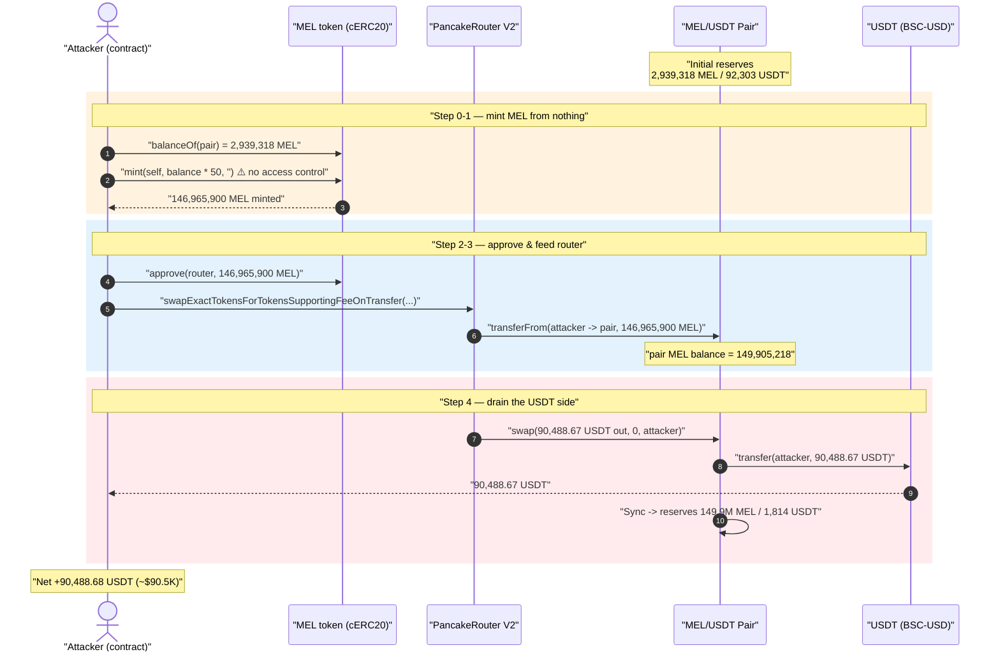
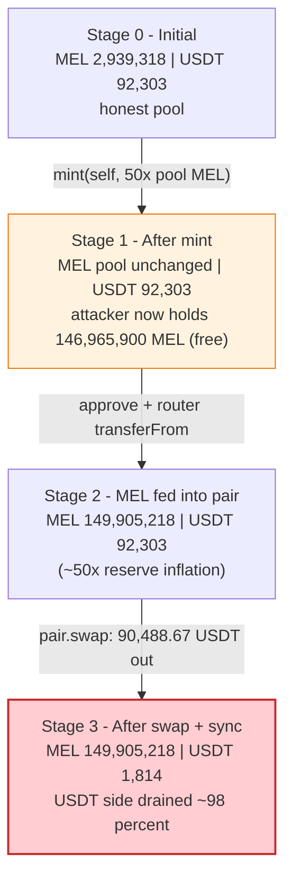
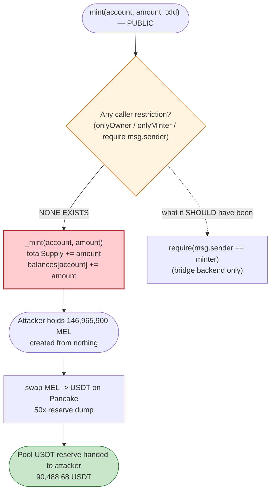

# Melo (MEL) Exploit — Unprotected `mint()` → Infinite-Supply Pool Drain

> **Reproduction:** the PoC compiles & runs in an isolated Foundry project at
> [this project folder](.) (the umbrella DeFiHackLabs repo contains several
> unrelated PoCs that do not whole-compile, so this one was extracted).
> Full verbose trace: [output.txt](output.txt).
> Verified vulnerable source: [cERC20.sol](sources/cERC20_9A1aEF/cERC20.sol).

---

## Key info

| | |
|---|---|
| **Loss** | ~$90,488 — **90,488.68 USDT** drained from the MEL/USDT PancakeSwap pair |
| **Vulnerable contract** | `cERC20` (the MEL token) — [`0x9A1aEF8C9ADA4224aD774aFdaC07C24955C92a54`](https://bscscan.com/address/0x9A1aEF8C9ADA4224aD774aFdaC07C24955C92a54#code) |
| **Victim pool** | MEL/USDT PancakePair — [`0x6a8C4448763C08aDEb80ADEbF7A29b9477Fa0628`](https://bscscan.com/address/0x6a8C4448763C08aDEb80ADEbF7A29b9477Fa0628) |
| **Token drained** | BSC-USD (USDT) — `0x55d398326f99059fF775485246999027B3197955` |
| **Router** | PancakeSwap V2 Router — `0x10ED43C718714eb63d5aA57B78B54704E256024E` |
| **Attack tx** | [`0x3f1973fe56de5ecd59a815d3b14741cf48385903b0ccfe248f7f10c2765061f7`](https://bscscan.com/tx/0x3f1973fe56de5ecd59a815d3b14741cf48385903b0ccfe248f7f10c2765061f7) |
| **Chain / block / date** | BSC / 27,960,445 / May 5, 2023 |
| **Compiler** | `cERC20` Solidity **v0.5.11**, optimizer disabled (`runs=200`, off) |
| **Bug class** | Missing access control on a privileged `mint()` (CWE-284 / unprotected token minting) |
| **Reference** | PeckShield — https://twitter.com/peckshield/status/1654667621139349505 |

---

## TL;DR

The MEL token (`cERC20`) exposes a **`public mint(address, uint256, string)`** function with **no
owner / role / minter check whatsoever**
([cERC20.sol:313-321](sources/cERC20_9A1aEF/cERC20.sol#L313-L321)). Anybody can mint an arbitrary
quantity of MEL to any address, for free.

The attacker simply:

1. Reads the MEL balance held by the MEL/USDT pair (`2,939,318.00 MEL`).
2. Mints itself **50×** that amount — `146,965,900.20 MEL` — out of thin air.
3. Swaps the entire minted bag for USDT through the PancakeSwap router.

Because the minted MEL dwarfs the pool's MEL reserve by ~50×, the swap pushes the AMM curve to its
limit and the attacker walks away with essentially **all of the pool's USDT — 90,488.68 USDT** — in a
single transaction. No flash loan, no price oracle trick, no reentrancy: just `mint()` with the
front door left wide open.

---

## Background — what MEL / `cERC20` is

`cERC20` is a textbook OpenZeppelin-v2-style ERC20 written in Solidity 0.5.11. It has the usual
`_balances`, `_allowances`, `_totalSupply`, the SafeMath helpers, and standard `transfer` /
`approve` / `transferFrom`. The constructor mints an initial supply to a designated account
([cERC20.sol:202-213](sources/cERC20_9A1aEF/cERC20.sol#L202-L213)).

The one non-standard addition is a `mint(account, amount, txId)` entry point
([cERC20.sol:313-321](sources/cERC20_9A1aEF/cERC20.sol#L313-L321)). The third argument `txId` and the
`Minted(account, amount, txId)` event
([cERC20.sol:44](sources/cERC20_9A1aEF/cERC20.sol#L44)) strongly suggest this was meant to be a
**bridge / off-chain-deposit mint** — a backend service was supposed to call `mint` with the
originating transaction id when a user deposited funds elsewhere. That design *requires* the minter to
be a trusted, restricted address.

It is not restricted at all.

At the fork block the MEL/USDT PancakeSwap pair held:

| Reserve | Value |
|---|---|
| Pair MEL balance (`balanceOf(pair)`) | **2,939,318.004043799027926976 MEL** |
| Pair reserves (`getReserves`) → `reserve0` (USDT) | **92,302.979570391110751867 USDT** |
| Pair reserves → `reserve1` (MEL) | **2,939,318.004043799027926976 MEL** |

(`token0 = USDT`, `token1 = MEL`; confirmed because `MEL.balanceOf(pair)` equals `reserve1`.)
The pool's ~92,303 USDT is the prize.

---

## The vulnerable code

### The unprotected mint

```solidity
// cERC20.sol:313-321
function mint(
    address account,
    uint256 amount,
    string memory txId
) public returns (bool) {        // ⚠️ PUBLIC — no onlyOwner / onlyMinter / require(msg.sender == ...)
    _mint(account, amount);      // mints `amount` to ANY caller-chosen account
    emit Minted(account, amount, txId);
    return true;
}

// cERC20.sol:323-329
function _mint(address account, uint256 amount) internal {
    require(account != address(0), "ERC20: mint to the zero address");
    _totalSupply = _totalSupply.add(amount);          // supply inflates
    _balances[account] = _balances[account].add(amount);
    emit Transfer(address(0), account, amount);
}
```

There is no modifier, no `require`, no `Ownable`/`AccessControl` inheritance, and no minter mapping
anywhere in the contract. The function is reachable by **any EOA or contract**. Note also that
`amount` here is interpreted in raw token units (18-decimal base units) — the attacker passes the full
`146,965,900.20 × 1e18`-scaled value directly.

Compare with the *constructor's* mint, which scales by decimals
([cERC20.sol:212](sources/cERC20_9A1aEF/cERC20.sol#L212)) — the public `mint` does not, but that is
irrelevant to the attacker, who just reads the pair balance (already in base units) and multiplies.

### What `mint` *should* have looked like

A bridge-mint must be gated, e.g.:

```solidity
address public minter;
modifier onlyMinter() { require(msg.sender == minter, "not minter"); _; }
function mint(address account, uint256 amount, string calldata txId)
    external onlyMinter returns (bool) { ... }
```

---

## Root cause — why it was possible

A single missing authorization check. `mint()` was almost certainly intended to be called only by a
custodial/bridge backend (hence the `txId` argument that records the off-chain originating
transaction), but it was deployed `public` with no guard. That turns the token's supply into an
attacker-controlled dial.

Once supply is attacker-controlled, the AMM does the rest. PancakeSwap prices MEL purely from the
pair's reserves. By minting ~50× the pool's MEL and dumping it through `swap`, the constant-product
formula must hand back nearly the entire opposing (USDT) reserve. Specifically, PancakeSwap's
`getAmountOut` is:

```
out = (in · 9975 · reserveUSDT) / (reserveMEL · 10000 + in · 9975)
```

With `reserveMEL = 2,939,318`, `reserveUSDT = 92,303`, and `in = 146,965,900` (≈ 50× the reserve), the
`in·9975` term overwhelmingly dominates the denominator, driving the ratio
`(in·9975)/(reserveMEL·10000 + in·9975)` toward 1 — so `out` approaches the *entire* USDT reserve. The
trace confirms the attacker received **90,488.67 USDT**, i.e. ~98% of the pool's 92,303 USDT, in one
swap.

The `txId` parameter being a free-form `string` with no validation is a secondary smell — even if a
minter check existed, an attacker who compromised it could forge arbitrary `txId`s — but the primary,
sufficient bug is the absent caller restriction.

---

## Preconditions

- The MEL/USDT pair must hold a non-trivial USDT reserve (it held ~92,303 USDT). ✓
- `mint()` is permanently callable by anyone — no timing, role, or state precondition. ✓
- A swap venue (PancakeSwap router) with a MEL/USDT pair must exist. ✓
- **No capital required.** The attacker needs only gas; the MEL is minted for free and immediately
  sold. (In the live tx the attacker also had a trivial 0.01 USDT pre-balance, visible as the
  difference between the 90,488.670 received and the 90,488.680 final balance.)

---

## Attack walkthrough (with on-chain numbers from the trace)

The pair is `token0 = USDT`, `token1 = MEL`, so `reserve0 = USDT`, `reserve1 = MEL`.
All figures are taken directly from the calls/events in [output.txt](output.txt).

| # | Step | MEL reserve (pair) | USDT reserve (pair) | Effect |
|---|------|-------------------:|--------------------:|--------|
| 0 | **Read pool MEL** — `MEL.balanceOf(pair)` ([:15-16](output.txt)) returns `2,939,318.004` MEL | 2,939,318.004 | 92,302.980 | Honest pool. `mintAmount = balance × 50`. |
| 1 | **Mint** `146,965,900.202` MEL to attacker ([:17-26](output.txt)); `totalSupply` storage slot `@2` jumps from `0x33…000000` to `0xacda…d20380` | 2,939,318.004 | 92,302.980 | Attacker holds 146.97M MEL from nothing. |
| 2 | **Approve** router for the full `146,965,900.202` MEL ([:27-31](output.txt)) | — | — | Allowance set. |
| 3 | **`swapExactTokensForTokensSupportingFeeOnTransferTokens`** ([:32](output.txt)): router pulls the MEL into the pair via `transferFrom` ([:33-40](output.txt)) — pair MEL balance becomes `149,905,218.206` MEL ([:46](output.txt)) | 149,905,218.206 | 92,302.980 | All minted MEL now inside the pair. |
| 4 | **`pair.swap(90,488.670 USDT, 0, attacker, 0x)`** ([:47](output.txt)): pair sends out `90,488.670389646322334139` USDT ([:48-49](output.txt)) and `Sync`s | 149,905,218.206 | **1,814.309** | USDT reserve crashes from ~92.3K → 1.8K. |
| 5 | **Result** — `USDT.balanceOf(attacker)` = `90,488.680389646322334139` ([:66/:68-69](output.txt)) | — | — | Pool USDT drained ~98%. |

The `Sync` event at [output.txt:58](output.txt) shows the post-swap reserves directly:
`reserve0 (USDT) = 1,814.309180744788417728`, `reserve1 (MEL) = 149,905,218.206233750424275776`. The
USDT side went from ~92,303 to ~1,814 — the missing ~90,489 USDT is exactly what the attacker received.

### Profit accounting (USDT)

| Direction | Amount |
|---|---:|
| Capital in (MEL minted for free) | 0 (only gas) |
| USDT received from swap | 90,488.670389646322334139 |
| Pre-existing attacker USDT | 0.010000000000000000 |
| **Final attacker USDT balance** | **90,488.680389646322334139** |
| **Net profit** | **+90,488.68 USDT (~$90.5K)** |

The minted MEL is worthless residue left inside the now-degenerate pool (149.9M MEL backed by ~1.8K
USDT). The attacker's entire profit is the honest LPs' USDT.

---

## Diagrams

### Sequence of the attack



### Pool state evolution



### The flaw: where the authorization check is missing



---

## Remediation

1. **Restrict `mint()` to a trusted minter.** The function was clearly a bridge/off-chain-deposit mint
   (it takes a `txId`). It must be gated with `onlyOwner`, a dedicated `minter` role, or
   OpenZeppelin `AccessControl` `MINTER_ROLE`. This single change kills the attack:
   ```solidity
   function mint(address account, uint256 amount, string calldata txId)
       external onlyMinter returns (bool) { ... }
   ```
2. **Treat any unbounded, externally-callable mint as critical.** Token supply must never be a value
   that arbitrary callers can move. If a public mint is genuinely required (e.g. a faucet), cap it and
   rate-limit it; for a bridge mint there is no legitimate "anyone" case.
3. **Validate / dedupe `txId`.** Even with a minter check, the off-chain `txId` should be recorded and
   prevented from being replayed, so a single deposit cannot be minted twice.
4. **Cap or monitor supply growth.** Emit and monitor `Minted`/`Transfer(0 -> x)` events; a mint of 50×
   a live pool's balance should trip an alarm / circuit breaker.
5. **For AMM-listed tokens specifically:** an uncapped mint is equivalent to giving the minter the right
   to drain every pool the token trades in. Listing such a token is only safe if the mint authority is a
   well-secured multisig/timelock — never a `public` function.

---

## How to reproduce

The PoC was extracted into a standalone Foundry project (the umbrella DeFiHackLabs repo has several
unrelated PoCs that fail to compile under `forge test`'s whole-project build):

```bash
_shared/run_poc.sh 2023-05-Melo_exp --mt testExploit -vvvvv
```

- RPC: a **BSC archive** endpoint is required (fork block 27,960,445 is old; pruning public RPCs fail
  with `header not found` / `missing trie node`). `foundry.toml` is configured with a working
  historical endpoint.
- Result: `[PASS] testExploit()` — attacker ends with **90,488.68 USDT**.

Expected tail (see [output.txt](output.txt)):

```
Ran 1 test for test/Melo_exp.sol:ContractTest
[PASS] testExploit() (gas: 123068)
Logs:
  Attacker USDT balance after exploit: 90488.680389646322334139

Suite result: ok. 1 passed; 0 failed; 0 skipped; finished in 5.14s
```

---

*Bug class: missing access control on a privileged token-mint function. Reference: PeckShield —
https://twitter.com/peckshield/status/1654667621139349505 ; SlowMist Hacked — https://hacked.slowmist.io/*
