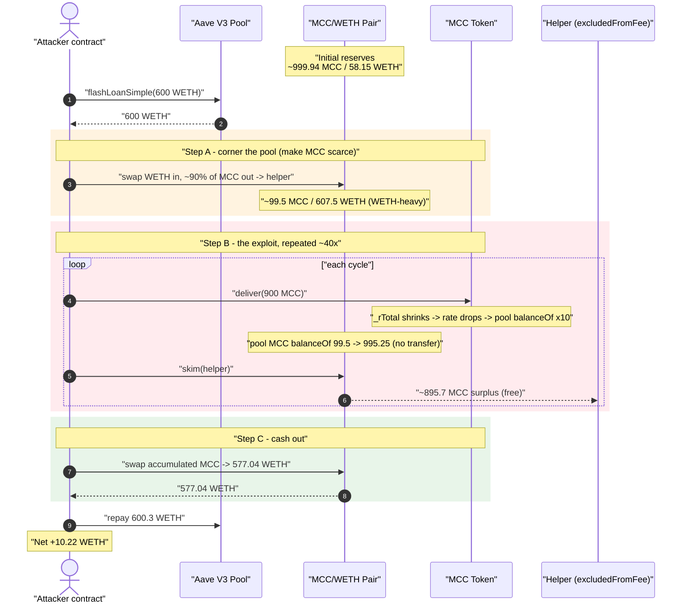
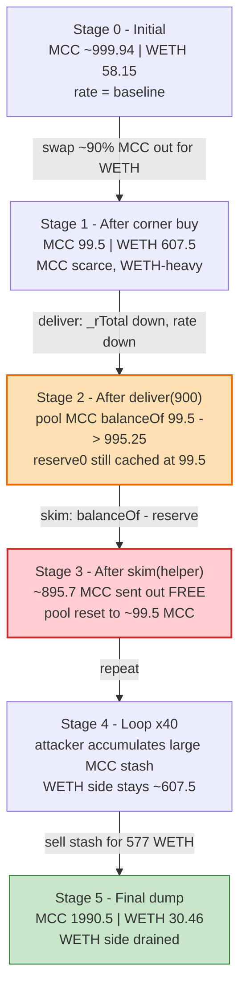
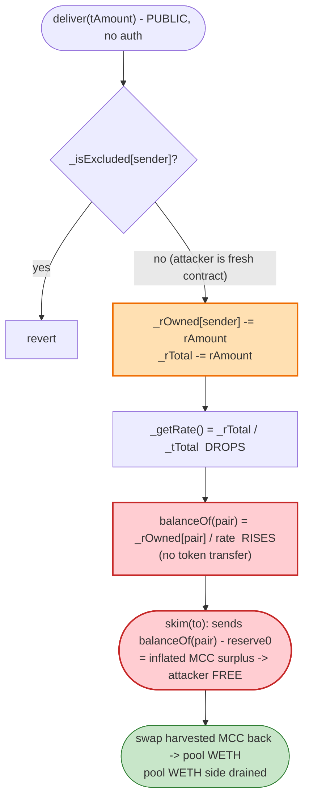

# Multi-Chain Capital ($MCC) Exploit — Reflection-Rate Inflation via `deliver()` + `skim()`

> **Vulnerability classes:** vuln/logic/incorrect-state-transition · vuln/logic/state-update · vuln/defi/slippage

> **Reproduction:** the PoC compiles & runs in an isolated Foundry project at
> [this project folder](.) (the umbrella DeFiHackLabs repo contains many unrelated PoCs that do
> not compile under a whole-repo `forge build`, so this one was extracted).
> Full verbose trace: [output.txt](output.txt).
> Verified vulnerable source: [MultiChainCapital.sol](sources/MultiChainCapital_1a7981/MultiChainCapital.sol).

---

## Key info

| | |
|---|---|
| **Loss** | ~10.2 WETH net profit (≈ 10 ETH, ~$19K at the time) — drained from the MCC/WETH Uniswap V2 pool |
| **Vulnerable contract** | `MultiChainCapital` (MCC) — [`0x1a7981D87E3b6a95c1516EB820E223fE979896b3`](https://etherscan.io/address/0x1a7981D87E3b6a95c1516EB820E223fE979896b3#code) |
| **Victim pool** | MCC/WETH Uniswap V2 pair — [`0xDCA79f1f78b866988081DE8a06F92b5e5D316857`](https://etherscan.io/address/0xDCA79f1f78b866988081DE8a06F92b5e5D316857) |
| **Attacker EOA** | [`0x8a4571c3a618e00d04287ca6385b6b020ce7a305`](https://etherscan.io/address/0x8a4571c3a618e00d04287ca6385b6b020ce7a305) |
| **Attacker contract** | [`0x52d74eb7C01C763219DCE713dA97EBAE8B91728E`](https://etherscan.io/address/0x52d74eb7C01C763219DCE713dA97EBAE8B91728E) |
| **Attack tx** | [`0xf72f1d10fc6923f87279ce6c0aef46e372c6652a696f280b0465a301a92f2e26`](https://etherscan.io/tx/0xf72f1d10fc6923f87279ce6c0aef46e372c6652a696f280b0465a301a92f2e26) |
| **Chain / fork block / date** | Ethereum mainnet / 17,221,445 (attack at 17,221,446) / May 9, 2023 |
| **Compiler** | Solidity v0.6.12 (`+commit.27d51765`), optimizer enabled, 200 runs |
| **Bug class** | Reflection-token (RFI) accounting flaw — public `deliver()` inflates the global reflection rate, silently re-pricing the pool's balance, harvested via `skim()` |

---

## TL;DR

`MultiChainCapital` is a SafeMoon/RFI-style "reflection" token: holder balances are stored as a
reflection share `_rOwned[account]`, and the displayed balance is computed on the fly as
`tokenFromReflection(_rOwned[account]) = _rOwned / rate`, where `rate = _rTotal / _tTotal`
([MultiChainCapital.sol:814-818](sources/MultiChainCapital_1a7981/MultiChainCapital.sol#L814-L818)).

The token exposes a **public, unrestricted** `deliver()` function
([:794-801](sources/MultiChainCapital_1a7981/MultiChainCapital.sol#L794-L801)) that lets the caller
"donate" tokens to all holders: it subtracts `rAmount` from the caller's `_rOwned` **and from the
global `_rTotal`**. Because `_rTotal` shrinks while `_tTotal` is unchanged, the reflection **rate
falls**, so *everyone else's* displayed balance — including the **Uniswap pair's** — silently
**grows** with no token transfer.

The Uniswap V2 pair caches its reserves in storage (`reserve0`, `reserve1`) and exposes `skim(to)`,
which sends out `balanceOf(pair) − reserve` of each token. Since `deliver()` inflates the pair's
*actual* `balanceOf` above its cached `reserve0`, `skim()` lets anyone **withdraw the inflated MCC
surplus from the pool for free**.

The attacker:

1. Flash-borrows **600 WETH** from Aave V3.
2. Swaps the pool to be deeply **WETH-heavy** (≈ 99.5 MCC vs ≈ 607 WETH), making MCC scarce in the pool.
3. Repeatedly calls `deliver(900 MCC)` → the pool's MCC `balanceOf` jumps ~10× (e.g. 99.5 → 995.25 MCC), then `skim()` harvests the ~895 MCC surplus to a helper address — **for free**.
4. Re-injects the harvested MCC and finally swaps it all back for WETH, draining the pool's WETH.
5. Repays the **600.3 WETH** flash loan (0.3 WETH premium) and keeps **≈ 10.22 WETH** profit.

---

## Background — what MCC is

`MultiChainCapital` ([source](sources/MultiChainCapital_1a7981/MultiChainCapital.sol)) is a classic
RFI / "reflection" token (the same `_rOwned` / `_rTotal` / `_getRate()` design popularized by
SafeMoon). Its accounting primitives:

- **Total supply** `_tTotal = 1,000,000,000,000 × 10⁹` (1e12 tokens, 9 decimals)
  ([:676](sources/MultiChainCapital_1a7981/MultiChainCapital.sol#L676)).
- **Reflection total** `_rTotal = MAX − (MAX % _tTotal)` — a huge number; the *rate* is `_rTotal/_tTotal`
  ([:677](sources/MultiChainCapital_1a7981/MultiChainCapital.sol#L677)).
- **Balance read**: `balanceOf(a) = tokenFromReflection(_rOwned[a]) = _rOwned[a] / _getRate()` for
  non-excluded accounts ([:747-750](sources/MultiChainCapital_1a7981/MultiChainCapital.sol#L747-L750),
  [:814-818](sources/MultiChainCapital_1a7981/MultiChainCapital.sol#L814-L818)).
- **Rate**: `_getRate() = rSupply / tSupply`, where `rSupply` starts at `_rTotal` and `tSupply` at
  `_tTotal`, minus excluded accounts
  ([:1048-1063](sources/MultiChainCapital_1a7981/MultiChainCapital.sol#L1048-L1063)).

The Uniswap pair holds MCC as a *normal* (non-excluded) holder, so its on-chain balance is **derived
from the global rate**. Any change to the rate re-prices the pair's holdings.

On-chain state at the fork block (from the trace's `Reserve0`/`Reserve1` logs,
[output.txt:7-8](output.txt)):

| Parameter | Value |
|---|---|
| Pair `token0` / `token1` | MCC / WETH |
| Pool MCC reserve (`reserve0`) | 999,944,057,661,999,343,963 raw (≈ 999.94 MCC after /1e9 display) |
| Pool WETH reserve (`reserve1`) | 58,151,841,933,973,974,148 ≈ **58.15 WETH** |
| `_taxFee` / `_teamFee` | 10% / 10% |
| `deliver()` access control | **none** (any address) |

---

## The vulnerable code

### 1. `deliver()` — public, burns the caller's reflection AND the global reflection total

```solidity
function deliver(uint256 tAmount) public {
    address sender = _msgSender();
    require(!_isExcluded[sender], "Excluded addresses cannot call this function");
    (uint256 rAmount,,,,,) = _getValues(tAmount);
    _rOwned[sender] = _rOwned[sender].sub(rAmount);
    _rTotal       = _rTotal.sub(rAmount);   // ⚠️ shrinks rTotal ⇒ rate drops ⇒ everyone else's balance grows
    _tFeeTotal    = _tFeeTotal.add(tAmount);
}
```
[MultiChainCapital.sol:794-801](sources/MultiChainCapital_1a7981/MultiChainCapital.sol#L794-L801)

There is **no access control** — `deliver()` is plain `public`. The caller pays for the donation out
of its own `_rOwned`, but the donation is distributed pro-rata to **all** non-excluded holders by
reducing `_rTotal`.

### 2. `balanceOf` / `tokenFromReflection` — the pool's balance is a function of the rate

```solidity
function balanceOf(address account) public view override returns (uint256) {
    if (_isExcluded[account]) return _tOwned[account];
    return tokenFromReflection(_rOwned[account]);     // pair is NOT excluded → derived balance
}

function tokenFromReflection(uint256 rAmount) public view returns (uint256) {
    require(rAmount <= _rTotal, "Amount must be less than total reflections");
    uint256 currentRate = _getRate();                 // _rTotal / _tTotal
    return rAmount.div(currentRate);                  // ⚠️ smaller rate ⇒ larger reported balance
}
```
[MultiChainCapital.sol:747-750](sources/MultiChainCapital_1a7981/MultiChainCapital.sol#L747-L750),
[:814-818](sources/MultiChainCapital_1a7981/MultiChainCapital.sol#L814-L818)

Because the pair's `_rOwned[pair]` is fixed across a `deliver()` call while the rate drops, the pair's
`balanceOf` (and thus `skim`-able surplus) **rises mechanically**.

### 3. Uniswap V2 `skim()` — pays out `balanceOf − reserve` to anyone

`skim(to)` (in the pair) transfers `IERC20(token).balanceOf(pair) − reserve` of each token to `to`.
This is intended to recover accidental over-transfers. Combined with `deliver()` inflating the pair's
MCC `balanceOf` above its cached `reserve0`, `skim()` becomes a **free MCC faucet** drawing straight
out of the pool. In the trace this is the repeated `deliver(900e18)` → `skim(0xfA21…BEEBc)` cycle
(e.g. [output.txt:1925-1945](output.txt)).

---

## Root cause — why it was possible

The token's reflection rate is a **global, mutable price multiplier** applied to every holder's
balance, and it is **decreasable by an unprivileged caller** through `deliver()`. The protocol never
considered that one of those "holders" is an **AMM pair whose price depends on its token balance**.

Three design facts compose into a critical bug:

1. **`deliver()` is permissionless and rate-moving.** Anyone can shrink `_rTotal`, which deflates the
   rate and *inflates every other holder's balance* — a value transfer **to** all current holders
   funded by the caller. The pair is a holder, so the pool's MCC balance grows out of thin air.
2. **The Uniswap pair is not fee/rate excluded.** The pair's balance is computed via
   `tokenFromReflection`, so it tracks the rate. (Excluding the pair would have made its balance a
   fixed `_tOwned`, immune to `deliver()`.) The router itself *cannot* be excluded — the contract
   explicitly forbids it ([:820-821](sources/MultiChainCapital_1a7981/MultiChainCapital.sol#L820-L821)).
3. **`skim()` exists and harvests `balanceOf − reserve`.** It turns the inflated *balance* into
   *withdrawable tokens*, then a swap turns the withdrawn MCC back into the pool's WETH.

By first **cornering** the pool so it is WETH-heavy and MCC-scarce (≈ 99.5 MCC vs ≈ 607 WETH), the
attacker maximizes the leverage: a single `deliver()` then multiplies the pool's *small* MCC balance
by ~10×, and `skim()` carries away ~90% of the pool's MCC for free. Each MCC so harvested is worth a
disproportionate amount of WETH because MCC is the scarce side.

The 10%/10% transfer tax never protects the pool here: `deliver()` and `skim()` bypass the taxed
`_transfer` path entirely, and the attacker routes residual MCC through the
`SupportingFeeOnTransferTokens` router functions and direct `pair.swap` calls.

---

## Preconditions

- `deliver()` callable by the attacker contract → it must **not** be `_isExcluded` (it is a fresh
  contract, so it is not). The `require(!_isExcluded[sender], …)` guard is the only check.
- The MCC/WETH pair must hold MCC as a **non-excluded** holder (true — only owner/contract are
  fee-excluded; the pair is a normal holder whose balance derives from the rate).
- Working capital in WETH to corner the pool. The attacker used a **600 WETH Aave V3 flash loan**
  ([test/MultiChainCapital_exp.sol:65](test/MultiChainCapital_exp.sol#L65)), repaid in the same tx
  with a 0.3 WETH premium — so the attack is effectively self-funding / flash-loanable.

---

## Attack walkthrough (with on-chain numbers from the trace)

The pair's `token0 = MCC`, `token1 = WETH`, so `reserve0 = MCC`, `reserve1 = WETH`. All `Sync` /
`Swap` figures below are taken directly from [output.txt](output.txt).

| # | Step | MCC reserve (reserve0) | WETH reserve (reserve1) | Effect |
|---|------|-----------------------:|------------------------:|--------|
| 0 | **Initial** ([output.txt:7-8](output.txt)) | 999.944e18 | 58.15e18 (58.15 WETH) | Honest pool. |
| 1 | **Flash loan** 600 WETH from Aave V3 ([:65](test/MultiChainCapital_exp.sol#L65)) | — | — | Attacker now holds 600 WETH. |
| 2 | **Priming swaps + `deliver`/buy cycles** ([output.txt:64-840](output.txt)) | gradually rises | gradually falls | Attacker buys MCC, uses small `deliver()`s to nudge the rate; pool MCC climbs to ~998e18, WETH ~59e18. |
| 3 | **Corner buy** — swap ≈ 90% of `reserve0` MCC out to a helper (`reserve0 * 9003/10000`), pushing the pool deeply WETH-heavy. The big swap pulls 898.72e18 MCC out for 547.11 WETH in ([output.txt:1904-1916](output.txt)) | **99.525e18** | **607.52e18 (607.5 WETH)** | MCC now scarce in pool; WETH side loaded by the attacker's own WETH. |
| 4 | **`deliver(900 MCC)`** ([output.txt:1922-1925](output.txt)) | balance 99.5 → **995.25** | 607.5 | Rate drops 10×; pool's MCC `balanceOf` inflates ~10× with **no transfer**. |
| 5 | **`skim(helper)`** ([output.txt:1925-1945](output.txt)) | reserve resets to ~99.5 | 607.5 | **895.73e18 MCC** surplus skimmed out to the attacker **for free**. |
| 6 | **Repeat deliver+skim** ~30–40× (loops `func1d89`/`func19c`) ([output.txt:1946-3010](output.txt)) | oscillates 99.5↔995 | ~607.5 | Each cycle harvests ~895 MCC; attacker accumulates a large MCC stash. |
| 7 | **Final dump** — re-inject all harvested MCC and `pair.swap(0, 577.04 WETH)` ([output.txt:3309-3320](output.txt)) | 1,990.5e18 | **30.46e18** | Attacker sells the accumulated MCC for **577.04 WETH**, emptying most of the WETH side. |
| 8 | **Repay** 600.3 WETH to Aave ([output.txt:3343](output.txt)) | — | — | Premium = 0.3 WETH. |
| 9 | **Final balance** ([output.txt:3368](output.txt)) | — | — | Attacker WETH = **10.2186 WETH** net. |

### How `deliver()` mechanically inflates the pool (Step 4 → 5)

At Step 3 the pool's cached state is `reserve0 ≈ 99.525e18 MCC`, and `balanceOf(pair) == reserve0`.
Calling `deliver(900e18)` reduces `_rTotal` by `rAmount`, dropping the rate by ~10× (the pool's MCC is
now a tiny fraction of `tSupply`, so the rate change is dramatic). Immediately after, the trace shows:

```
MCC::balanceOf(pair)  ⇒ 995,250,102,700,894,453,279   (≈ 995.25e18)   # was ≈ 99.5e18
MCC-WETH skim(helper) ⇒ transfer 895,725,092,430,805,007,952 MCC to helper   # the surplus, free
```
[output.txt:1925-1934](output.txt)

The pair's `reserve0` was never updated by `deliver()` (it is a passive storage cache), so `skim`
sees `balanceOf(995.25e18) − reserve0(99.5e18) ≈ 895.7e18` of "excess" MCC and ships it out.

---

## Profit / loss accounting (WETH)

| Direction | Amount (WETH) |
|---|---:|
| Flash loan borrowed (Aave V3) | 600.000 |
| Flash loan repaid (principal + 0.05% premium) | 600.300 |
| **Premium cost** | **0.300** |
| Attacker WETH balance **before** ([output.txt:6](output.txt)) | 0.000 |
| Attacker WETH balance **after** ([output.txt:9](output.txt)) | **10.2186** |
| **Net profit** | **≈ 10.22 WETH** |

The ~10.2 WETH profit is liquidity extracted from the MCC/WETH pool: the attacker recovers all of its
own injected WETH plus the pool's genuine WETH, net of the flash-loan premium and Uniswap swap fees.
The pool, which started with 58.15 WETH, was left with ~30.46 WETH after the final dump (Step 7), the
balance of value having been bled out across the priming and skim/dump cycles.

---

## Diagrams

### Sequence of the attack



### Pool / rate state evolution



### The flaw inside `deliver()` + `skim()`



---

## Why the attacker cornered the pool first

`skim()` only pays out `balanceOf(pair) − reserve0`, and `deliver()` multiplies the pool's *current*
MCC `balanceOf` by the rate-drop factor. If the pool held a large MCC reserve (its honest ~999.94e18),
a single `deliver(900e18)` would move the rate only marginally and skim little. By first swapping ~90%
of the MCC out of the pool (Step 3), the attacker made MCC **scarce** in the pool (≈ 99.5e18) and
**WETH-heavy** (≈ 607.5e18). Now each `deliver(900e18)` is enormous relative to the pool's tiny MCC
holding, so the pool's `balanceOf` jumps ~10× per cycle and `skim()` harvests ~895e18 MCC each time —
MCC that is worth a large amount of WETH precisely because it is the scarce side of the pool.

---

## Remediation

1. **Restrict or remove rate-moving public functions.** `deliver()` lets an unprivileged caller move
   the global reflection rate. Either gate it (trusted role) or, better, redesign so that "reflection"
   never lets an external party silently re-price third-party balances. The pool must never gain tokens
   it did not receive via a real transfer.
2. **Exclude AMM pairs from reflection.** Mark every liquidity pair as `_isExcluded` so its balance is
   stored as a fixed `_tOwned` rather than derived from the mutable rate. Then `deliver()` cannot inflate
   the pair's balance and `skim()` finds no phantom surplus. (Note: the contract forbids excluding the
   *router* — [:820-821](sources/MultiChainCapital_1a7981/MultiChainCapital.sol#L820-L821) — but the
   *pair* can and should be excluded.)
3. **Reconsider the reflection model entirely.** RFI tokens that derive balances from a global rate are
   fundamentally incompatible with AMM pools unless the pool is rate-excluded. Use a standard ERC20 with
   explicit, transfer-based fee distribution instead of `_rOwned`/`_rTotal` share accounting.
4. **Guard against `skim()`-harvestable surplus.** Any mechanism that can raise `balanceOf(pair)` without
   a matching reserve update creates a free-withdrawal via `skim`. Avoid rebasing/reflection balances on
   pooled tokens, or use a custom pair that re-syncs on balance reads.

---

## How to reproduce

The PoC was extracted into a standalone Foundry project (the umbrella DeFiHackLabs repo has many
unrelated PoCs that fail under a whole-project `forge build`):

```bash
_shared/run_poc.sh 2023-05-MultiChainCapital_exp --mt testExploit -vvvvv
```

- RPC: an **Ethereum mainnet archive** endpoint is required (fork at block 17,221,445; the attack runs
  after `rollFork(17_221_445)`). `foundry.toml`'s `mainnet` endpoint must serve historical state at that
  block.
- Result: `[PASS] testExploit()`. The attacker's WETH balance goes from `0` to `10.2186 WETH`.

Expected tail ([output.txt](output.txt)):

```
  Attacker ETH balance before exploit: 0.000000000000000000
  Reserve0: 999944057661999343963
  Reserve1: 58151841933973974148
  Attacker ETH balance after exploit: 10.218561559752308479

Suite result: ok. 1 passed; 0 failed; 0 skipped; finished in 13.93s
```

---

*Reference: Beosin alert — https://twitter.com/BeosinAlert/status/1655846558762692608 (MCC, Ethereum, ~10 ETH).*
