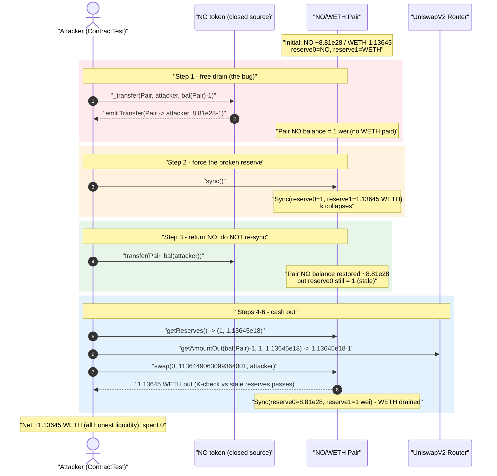
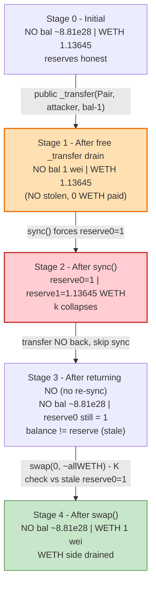
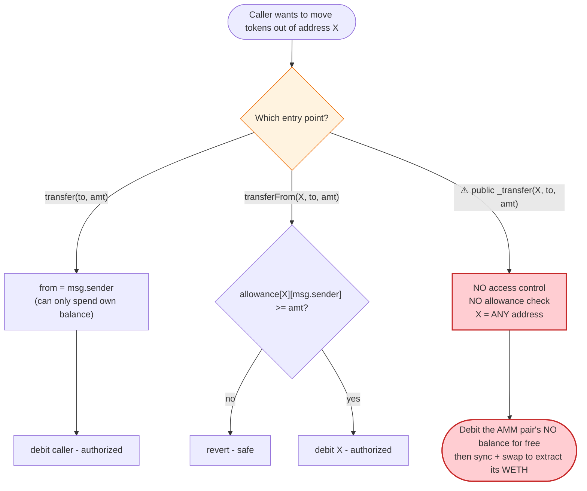

# NOON (NO) Exploit — Public `_transfer()` Lets Anyone Drain the AMM Pool For Free

> **Vulnerability classes:** vuln/access-control/missing-auth · vuln/logic/missing-allowance · vuln/oracle/price-manipulation

> **Reproduction:** the PoC compiles & runs in an isolated Foundry project at
> [this project folder](.) (the umbrella DeFiHackLabs repo contains many unrelated PoCs that do
> not whole-compile, so this one was extracted).
> Full verbose trace: [output.txt](output.txt).
> The NO token is **closed-source** on-chain; the only verified source available is the
> [UniswapV2Pair](sources/UniswapV2Pair_421A56/UniswapV2Pair.sol) the attacker drained.

---

## Key info

| | |
|---|---|
| **Loss** | **1.13645 WETH (~$2K)** drained from the NO/WETH Uniswap-V2 pair |
| **Vulnerable contract** | `NO` token (closed source) — [`0x6fEAc5F3792065b21f85BC118D891b33e0673bD8`](https://etherscan.io/address/0x6fEAc5F3792065b21f85BC118D891b33e0673bD8#code) |
| **Victim pool** | NO/WETH Uniswap-V2 pair — [`0x421A5671306CB5f66FF580573C1c8D536E266c93`](https://etherscan.io/address/0x421A5671306CB5f66FF580573C1c8D536E266c93) |
| **Attacker (this PoC)** | `ContractTest` test harness `0x7FA9385bE102ac3EAc297483Dd6233D62b3e1496` |
| **Reference tx** | Hexagate report, "second tx" — `twitter.com/hexagate_/status/1663501545105702912` |
| **Chain / block / date** | Ethereum mainnet / 17,366,979 / ~May 29, 2023 (block ts `1685391671`) |
| **Pair compiler** | UniswapV2Pair `v0.5.16+commit.9c3226ce`, optimizer 999999 runs |
| **Bug class** | Wrong function visibility — `_transfer(from,to,amount)` is publicly callable, allowing an un-owned, un-approved transfer of any holder's balance |

---

## TL;DR

The `NO` token exposes its internal balance-moving primitive as a **public** function with the raw
ERC-20-internal signature `_transfer(address sender, address recipient, uint256 amount)`. There is
**no access control** and **no allowance check** on `sender`. Consequently anyone can move tokens
**out of any address** — including the AMM pair — into their own wallet, for free.

The attacker:

1. Calls `NO._transfer(Pair, attacker, balanceOf(Pair) - 1)` — yanking essentially the pair's entire
   NO balance (`88,104,775,387,217,598,184,058,610,576` base units, i.e. all but 1 wei) into the
   attacker's account. No ETH/WETH paid, no swap.
2. Calls `Pair.sync()` — forcing the pair to record its now-gutted NO balance (`1` wei) as
   `reserve0`, while `reserve1` (WETH) stays untouched at `1.13645 WETH`. The constant product `k`
   collapses; the marginal price of NO explodes.
3. Sends the stolen NO **back** to the pair and (without re-syncing) calls `Pair.swap()` so the
   pool's still-stale `reserve0 = 1` treats the giant NO inflow as a swap input, paying out almost
   the entire WETH reserve.

Net result: the attacker walks away with **1.13645 WETH** — the pool's entire honest WETH
liquidity — having spent nothing but gas.

---

## Background — what's in play

There are two contracts involved:

- **`NO` token** ([`0x6fEAc…3bD8`](https://etherscan.io/address/0x6fEAc5F3792065b21f85BC118D891b33e0673bD8#code))
  — a non-standard ERC-20 whose source was **never verified** on Etherscan. The PoC's own header
  notes this and hypothesizes the bug:
  > *"Closed source contract. Probable vulnerabilities: Wrong function (`_transfer`) visibility /
  > Non-standard ERC20 implementation."*

  The trace confirms the hypothesis: the test calls a function with the four-argument-style internal
  signature `_transfer(address,address,uint256)` directly on the token and it succeeds, moving
  another account's balance without authorization.

- **The NO/WETH Uniswap-V2 pair**
  ([`0x421A…6c93`](sources/UniswapV2Pair_421A56/UniswapV2Pair.sol)) — a perfectly standard
  Uniswap-V2 pair (`token0 = NO`, `token1 = WETH`). It is **not** the buggy contract; it is the
  victim. Its `sync()`/`swap()` accounting trusts that token balances only move through mechanisms it
  can reason about. The NO bug breaks that assumption.

On-chain state at the fork block, read from the trace:

| Parameter | Value | Source |
|---|---|---|
| Pair `token0` | **NO** (`reserve0`) | `Sync(reserve0=NO, reserve1=WETH)` — [output.txt:42](output.txt) |
| Pair `token1` | **WETH** (`reserve1`) | same |
| Pool NO balance | `88,104,775,387,217,598,184,058,610,577` (≈ 8.81e28) | [output.txt:30](output.txt) |
| Pool WETH balance (the prize) | `1,136,449,063,099,364,002` wei = **1.13645 WETH** | [output.txt:41](output.txt) |
| Attacker WETH before | `0` | [output.txt:24](output.txt) |

---

## The vulnerable code

The NO token is closed-source, so we cannot quote its `_transfer` body. But the PoC interface and the
execution trace fully characterize the flaw.

### What the attacker declared (PoC interface)

```solidity
interface INO {
    function _transfer(address sender, address recipient, uint256 amount) external; // ⚠️ PUBLIC internal-style fn
    function transfer(address to, uint256 value) external;
    function balanceOf(address account) external returns (uint256);
}
```
[test/NOON_exp.sol:17-25](test/NOON_exp.sol#L17-L25)

`_transfer(sender, recipient, amount)` is the canonical *internal* OpenZeppelin signature for moving
tokens between two arbitrary accounts. In a correct ERC-20 it is `internal` and is only reached via
`transfer()` (which forces `sender == msg.sender`) or `transferFrom()` (which checks `allowance`).
Here it is exposed `external` with **neither guard**, so the caller may name **any** `sender`.

### What the trace proves

```
[28433] NO::_transfer(Pair: [0x421A…6c93], ContractTest: [0x7FA9…1496], 88104775387217598184058610576)
  ├─ emit Transfer(from: Pair, to: ContractTest, value: 88104775387217598184058610576)
  └─ ← [Stop]
```
[output.txt:31-36](output.txt) — `msg.sender` (the attacker) is **neither the `Pair` nor approved by
it**, yet the call moves the pair's NO balance to the attacker and emits a normal `Transfer`. That is
the entire vulnerability.

---

## Root cause — why it was possible

> **A privileged internal balance-moving routine (`_transfer(from,to,amount)`) was given external
> visibility with no `msg.sender == from` check and no allowance deduction.** It is the smart-contract
> equivalent of leaving the bank vault's internal "move money between any two accounts" lever on the
> public lobby wall.

Standard ERC-20 enforces exactly two ways to debit an account:

| Path | Guard |
|---|---|
| `transfer(to, amount)` | implicitly sets `from = msg.sender` — you can only spend your own tokens |
| `transferFrom(from, to, amount)` | requires `allowance[from][msg.sender] >= amount` |

The NO token added (or left) a third, unguarded path — a public `_transfer(from, to, amount)` — which
bypasses both guards. Once such a primitive exists, **any token balance in the system becomes the
caller's to take**, and the most lucrative balance is the one sitting inside the AMM pool.

The Uniswap-V2 pair amplifies this from "steal NO" into "steal WETH":

- The pair prices NO purely from `reserve0`/`reserve1`. After the attacker empties the pair's NO and
  `sync()`s, `reserve0 = 1` wei while `reserve1 = 1.13645 WETH` is untouched — `k` collapses and NO
  becomes "infinitely valuable" against WETH.
- `swap()` only checks the K-invariant against the **stored reserves** (`require(balance0Adjusted *
  balance1Adjusted >= reserve0 * reserve1 * 1000²)` — [UniswapV2Pair.sol:477](sources/UniswapV2Pair_421A56/UniswapV2Pair.sol#L477)).
  By feeding NO back into the pair *without* a fresh `sync()`, the attacker leaves `reserve0` at the
  stale `1`, so the K check is trivially satisfied for an almost-total WETH withdrawal.

---

## Preconditions

- The NO token exposes a public, unauthorized `_transfer(from, to, amount)` (the core bug — always
  true for this token).
- A live NO/WETH AMM pair holds real WETH liquidity (the pool held `1.13645 WETH`).
- No capital is required beyond gas: the theft is a direct balance move, not a trade. **Fully
  permissionless and free** — no flash loan, no approvals, no ownership.

---

## Step-by-step attack walkthrough (with on-chain numbers from the trace)

Pair `token0 = NO` ⇒ `reserve0 = NO`; `token1 = WETH` ⇒ `reserve1 = WETH`. All figures are taken
directly from the `Transfer`/`Sync`/`Swap` events and `getReserves`/`getAmountOut` returns in
[output.txt](output.txt). NO amounts are in base units (token decimals ≈ 18; the headline figure is
~8.81e28 ≈ 88.1 billion NO).

| # | Step (PoC line) | Pool NO balance | Pair `reserve0` (NO) | Pair `reserve1` (WETH) | Effect |
|---|---|---:|---:|---:|---|
| 0 | **Initial** | 8.81045e28 | (stale) | 1.13645 WETH | Honest pool. |
| 1 | **Free drain** — `NO._transfer(Pair, attacker, bal(Pair)-1)` ([:50](test/NOON_exp.sol#L50)) | **1 wei** | (still stale) | 1.13645 WETH | Pair's entire NO balance (minus 1 wei) moved to attacker; **no payment**. |
| 2 | **`Pair.sync()`** ([:52](test/NOON_exp.sol#L52)) | 1 wei | **1** | 1.13645 WETH | Reserves forced to match: `Sync(reserve0=1, reserve1=1136449063099364002)`. `k` collapses. |
| 3 | **Send NO back** — `NO.transfer(Pair, bal(attacker))` ([:54](test/NOON_exp.sol#L54)) | 8.81045e28 | **1 (NOT re-synced)** | 1.13645 WETH | Pair NO **balance** restored, but `reserve0` still reads `1`. |
| 4 | **Read reserves** — `Pair.getReserves()` ([:56](test/NOON_exp.sol#L56)) | 8.81045e28 | 1 | 1.13645 WETH | `getReserves() → (1, 1136449063099364002, …)`. |
| 5 | **Quote** — `Router.getAmountOut(bal(Pair)-1, reserve0=1, reserve1=1.13645e18)` ([:60](test/NOON_exp.sol#L60)) | — | — | — | Returns `1136449063099364001` (≈ all WETH minus 1 wei). |
| 6 | **`Pair.swap(0, 1136449063099364001, attacker, "")`** ([:62](test/NOON_exp.sol#L62)) | 8.81045e28 | 8.81045e28 | **1 wei** | K check passes against stale reserves; pays out **1.13645 WETH** to attacker. `Sync(reserve0=8.81e28, reserve1=1)`. |

A subtle but important detail in step 6: the swap's K invariant compares the *new balances*
(NO already returned in step 3) against the *stale reserves* (`reserve0 = 1`). Because the pool's
actual NO balance is now ~8.81e28 while the stored `reserve0` is `1`, the input side `amount0In` is
enormous relative to the recorded reserve, so `getAmountOut(in, reserveIn=1, reserveOut=1.13645e18)`
returns essentially the whole WETH reserve.

### The "1 wei" trick

The attacker leaves **1 wei** of NO in the pair (transfers `balanceOf(Pair) - 1`, not the full
balance) so that the post-`sync()` `reserve0 = 1` rather than `0`. A `reserve0` of `0` would make the
pair's swap math divide-by-zero / revert (`getAmountOut` requires a non-zero input reserve), and would
make `reserve0 * reserve1 = 0` degenerate. With `reserve0 = 1`, the swap is well-formed but priced as
if NO is essentially infinitely scarce — letting a flood of returned NO buy out the WETH side.

---

## Profit / loss accounting (WETH)

| Direction | Amount (wei) | WETH |
|---|---:|---:|
| Attacker WETH before | 0 | 0 |
| WETH paid in (capital) | 0 | 0 |
| WETH received from `swap()` | 1,136,449,063,099,364,001 | **1.13645** |
| **Net profit** | **1,136,449,063,099,364,001** | **+1.13645** |

[output.txt:82-86](output.txt) — attacker WETH balance goes `0 → 1136449063099364001` (≈ 1.13645
WETH). The pool started with `1,136,449,063,099,364,002` wei of WETH and ends with `1` wei — the
attacker took the entire honest WETH liquidity to the wei (≈ $2K at ~May 2023 ETH prices), spending
**zero** capital.

---

## Diagrams

### Sequence of the attack



### Pool state evolution



### The flaw: authorized vs. unauthorized debit paths



---

## Remediation

1. **Make `_transfer` internal.** The balance-moving primitive `_transfer(from, to, amount)` must be
   `internal` (or `private`), never `external`/`public`. This single change closes the hole entirely.
2. **If an external mover is genuinely required, guard `from`.** Any externally callable function that
   debits a named `from` MUST enforce either `from == msg.sender` (like `transfer`) or
   `allowance[from][msg.sender] >= amount` with a decrement (like `transferFrom`). Never let an
   arbitrary caller name an arbitrary `sender`.
3. **Use a vetted ERC-20 base.** Inherit OpenZeppelin's `ERC20`, where `_transfer` is `internal` by
   construction, instead of hand-rolling a "non-standard" implementation. Most of these closed-source,
   custom-token rugs share this exact mistake.
4. **Verify source & audit before listing liquidity.** A closed-source token paired with real WETH on
   a public AMM is an open invitation; LPs and front-ends should treat unverified tokens as
   untrusted. (Hexagate flagged this on-chain.)
5. **(Defense-in-depth on the AMM side, not a fix for this token):** the fact that `swap()` can be
   driven by stale reserves after an external balance manipulation is intrinsic to Uniswap V2 and is
   why arbitrary token-balance writes are catastrophic — there is no pair-side mitigation; the token
   must not allow unauthorized balance moves in the first place.

---

## How to reproduce

The PoC was extracted into a standalone Foundry project (the umbrella DeFiHackLabs repo has many
unrelated PoCs that fail the whole-project `forge build`):

```bash
_shared/run_poc.sh 2023-05-NOON_exp --mt testTransfer -vvvvv
```

- RPC: an **Ethereum mainnet archive** endpoint is required (fork block 17,366,979). `foundry.toml`
  uses an Infura mainnet endpoint; any archive provider serving historical state at that block works.
- Result: `[PASS] testTransfer()` with attacker WETH going from `0` to `1.136449063099364001`.

Expected tail ([output.txt:3-8](output.txt)):

```
Ran 1 test for test/NOON_exp.sol:ContractTest
[PASS] testTransfer() (gas: 130425)
Logs:
  Attacker amount of WETH before exploitation of vulnerability: 0.000000000000000000
  Attacker amount of WETH after exploitation of vulnerability: 1.136449063099364001
```

---

*References: Hexagate (https://twitter.com/hexagate_/status/1663501545105702912, second tx);
DeFiHackLabs. NO token, Ethereum mainnet, ~$2K.*
