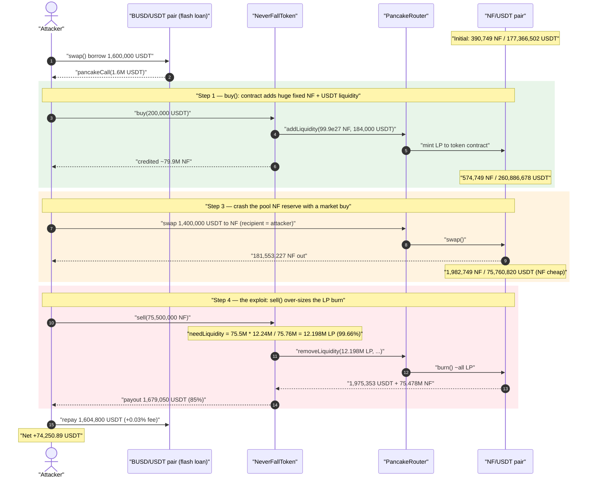
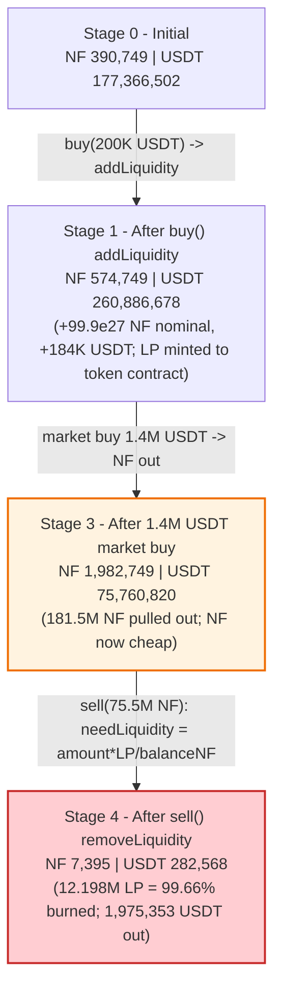
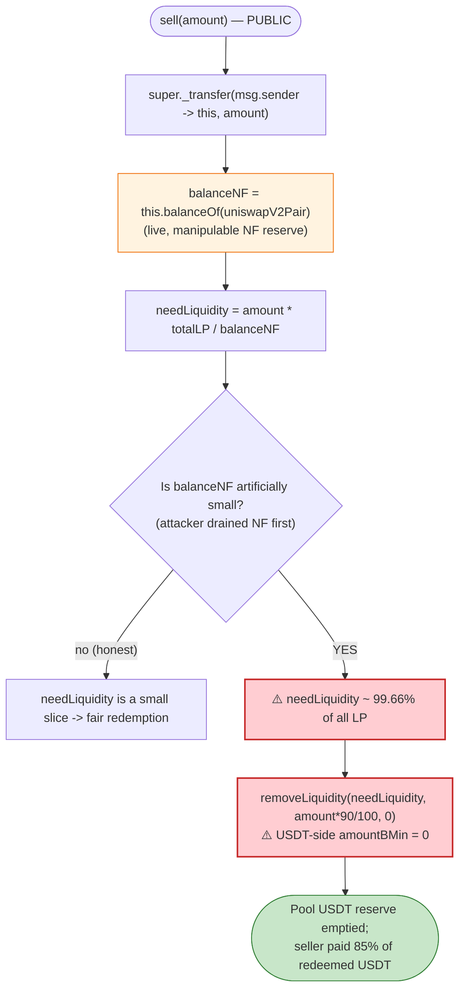

# NeverFall (NF) Exploit — `sell()` Over-Redeems LP Against a Pre-Crashed Pool Reserve

> **Reproduction:** the PoC compiles & runs in an isolated Foundry project at
> [this project folder](.) (the umbrella DeFiHackLabs repo contains many unrelated PoCs
> that do not whole-compile, so this one was extracted standalone).
> Full verbose trace: [output.txt](output.txt).
> Verified vulnerable source: [NeverFallToken.sol](sources/NeverFallToken_5ABDe8/NeverFallToken.sol).

---

## Key info

| | |
|---|---|
| **Loss** | ~**74,250.89 USDT** profit to the attacker (≈ $74.3K), drained from the NF/USDT pool's LP value |
| **Vulnerable contract** | `NeverFallToken` (NF) — [`0x5ABDe8B434133C98c36F4B21476791D95D888bF5`](https://bscscan.com/address/0x5ABDe8B434133C98c36F4B21476791D95D888bF5#code) |
| **Victim pool** | NF/USDT PancakePair — `0x97a08A9Fb303b4f6F26C5B3C3002EBd0E6417d2c` |
| **Flash-loan source** | BUSD/USDT PancakePair — `0x7EFaEf62fDdCCa950418312c6C91Aef321375A00` |
| **Attacker EOA** | `0x051d6a5f987e4fc53B458eC4f88A104356E6995a` (the `creator` recipient in the PoC) |
| **Attack tx** | `0xccf513fa8a8ed762487a0dcfa54aa65c74285de1bc517bd68dbafa2813e4b7cb` |
| **Chain / block / date** | BSC / 27,863,178 (fork at `27,863,178 − 1`) / ~May 2, 2023 |
| **Compiler** | Solidity v0.8.18, optimizer 200 runs |
| **Bug class** | Broken redemption accounting — `sell()` sizes the LP burn against a manipulable live pool reserve |

---

## TL;DR

`NeverFallToken` is a "DeFi-ish" deflationary token where the token contract *itself* manages the
PancakeSwap NF/USDT liquidity on behalf of users. `buy()` pulls USDT from the user and **adds
liquidity** with a gigantic fixed amount of NF (`initSupply = 99.9e27`) plus the user's USDT; `sell()`
does the inverse — it **removes liquidity** and pays the seller back USDT.

The flaw is in how `sell()` decides *how much* LP to burn
([NeverFallToken.sol:1141-1146](sources/NeverFallToken_5ABDe8/NeverFallToken.sol#L1141-L1146)):

```solidity
uint256 balanceNF       = this.balanceOf(uniswapV2Pair);          // ← live pool NF reserve
uint256 pairTotalSupply = IERC20(uniswapV2Pair).totalSupply();    // ← total LP supply
uint256 needLiquidity   = amount * pairTotalSupply / balanceNF;   // ← LP to burn
removeLiquidity(needLiquidity, amount * 90 / 100, 0);
```

`needLiquidity` is computed as `sellAmount / poolNFReserve × totalLP`. The seller's NF `amount` is
attacker-chosen, and the pool's NF reserve `balanceNF` is freely manipulable by anyone with a swap.
**If the attacker first shrinks the pool's NF reserve, the same `amount` redeems a much larger
fraction of the pool — including USDT that other LPs deposited.**

The attacker:

1. **Flash-borrows 1.6M USDT** from the BUSD/USDT pair.
2. **`buy(200K USDT)`** — the contract adds `99.9e27` NF + ~184K USDT of liquidity (minting LP to the
   token contract) and hands the attacker ~79.9M NF.
3. **Market-buys NF** with 1.4M USDT through the router (recipient = attacker), pulling **181.5M NF out
   of the pool** and crashing the pool's NF reserve from ~582.7K down to ~1.98M… i.e. making NF scarce
   in the pool relative to the LP supply.
4. **`sell(75.5M NF)`** — because the pool's NF reserve is now tiny, `needLiquidity` evaluates to
   **12.198M LP ≈ 99.66% of the entire LP supply**, so `removeLiquidity` burns essentially the whole
   pool and returns **~1.975M USDT** to the contract; the seller receives `1.975M × 85% = 1.679M USDT`.
5. **Repays** the 1.6M USDT flash loan + 0.03% fee and walks away with **74,250.89 USDT**.

The "profit" is real LP capital: the attacker sold NF it had just bought back for far more USDT than it
paid, because `sell()` redeemed LP at a ratio that ignored the pool's actual USDT/NF price.

---

## Background — what NeverFallToken does

`NeverFallToken` ([source](sources/NeverFallToken_5ABDe8/NeverFallToken.sol)) is an ERC20 that acts as
a custodial wrapper around its own NF/USDT PancakeSwap pool:

- **`buy(amountU)`** ([:1115-1133](sources/NeverFallToken_5ABDe8/NeverFallToken.sol#L1115-L1133)) —
  takes USDT from the caller, then uses 90% of it to `addLiquidity(initSupply, amountU*90/100)` (NF
  side is the hardcoded `initSupply = 99.9e27`), 8% to `buySwap` NF into a temp address, and 2% to
  marketing. The user is credited the net NF the contract obtained.
- **`sell(amount)`** ([:1138-1155](sources/NeverFallToken_5ABDe8/NeverFallToken.sol#L1138-L1155)) —
  takes the user's NF, computes a proportional LP amount, `removeLiquidity`s it, and pays the seller
  back `85%` of the recovered USDT (15% to marketing).
- **Transfer gating** ([:1071-1096](sources/NeverFallToken_5ABDe8/NeverFallToken.sol#L1071-L1096)) —
  only whitelisted addresses can be the counterparty of an AMM pair transfer (`buy or sell error`),
  and non-whitelisted transfers burn 20% to dead. Trading auto-starts when a whitelisted address first
  moves NF into the pair (`startSwap`).

The economically-relevant on-chain facts at the fork block:

| Parameter | Value |
|---|---|
| `initSupply` (NF added per `buy`) | **99,900,000,000e18** (fixed, regardless of pool size) |
| `buyAddLiqFee` / `buySwapFee` / `buyMarketingFee` | 90% / 8% / 2% |
| `sellFee` / `sellMarketingFee` | 85% / 15% |
| NF/USDT pair | `0x97a08A9Fb303b4f6F26C5B3C3002EBd0E6417d2c` |
| Pool NF reserve at start (`getReserves.reserve0`) | 390,749 NF |
| Pool USDT reserve at start (`getReserves.reserve1`) | 177,366,502 USDT |

The whole exploit lives in the gap between how `sell()` *sizes* the LP burn (against the live NF
reserve) and how the AMM *prices* that LP (against both reserves).

---

## The vulnerable code

### `sell()` — LP burn sized against a manipulable reserve

```solidity
function sell(uint256 amount) public returns(uint256){
    super._transfer(msg.sender, address(this), amount);
    //撤池子 退给用户U  ("remove from pool, return U to user")
    uint256 balanceNF = this.balanceOf(uniswapV2Pair);              // L1141 ← live NF reserve
    uint256 pairTotalSupply = IERC20(uniswapV2Pair).totalSupply();  // L1142
    uint256 needLiquidity = amount * pairTotalSupply / balanceNF;   // L1143 ← THE BUG

    uint256 beforeU = IERC20(usdtAddress).balanceOf(address(this));
    removeLiquidity(needLiquidity,amount * 90 / 100,0);             // L1146
    uint256 afterU = IERC20(usdtAddress).balanceOf(address(this));
    uint256 outU =  afterU - beforeU;

    IERC20(usdtAddress).safeTransfer(msg.sender, outU * sellFee / 100);        // 85% to seller
    IERC20(usdtAddress).safeTransfer(marketingAddress,outU * sellMarketingFee / 100);
    emit SellNF(msg.sender,amount,outU);
    return outU * sellFee / 100;
}
```

[NeverFallToken.sol:1138-1155](sources/NeverFallToken_5ABDe8/NeverFallToken.sol#L1138-L1155)

`needLiquidity = amount * pairTotalSupply / balanceNF`. The amount of LP burned (and therefore the USDT
paid out) is `amount / balanceNF` of the *entire pool*. `balanceNF` is `this.balanceOf(uniswapV2Pair)` —
the pool's instantaneous NF reserve — which any actor can move by swapping. There is no slippage check
on the USDT side (`amountBMin = 0` in `removeLiquidity`), and no check that the redeemed USDT bears any
relation to the price the seller's NF is actually worth.

### `buy()` — adds a fixed, huge NF amount to the pool

```solidity
function buy(uint256 amountU) public returns(uint256){
    require(startBuy,"not start");
    IERC20(usdtAddress).safeTransferFrom(msg.sender,address(this),amountU);
    ...
    addLiquidity(initSupply, amountU * buyAddLiqFee / 100);   // L1123 ← initSupply = 99.9e27 NF
    ...
}
```

[NeverFallToken.sol:1115-1133](sources/NeverFallToken_5ABDe8/NeverFallToken.sol#L1115-L1133) and
`addLiquidity` at [:1158-1170](sources/NeverFallToken_5ABDe8/NeverFallToken.sol#L1158-L1170).

Because `addLiquidity` is called with the constant `initSupply` on the NF side but only the bounded
USDT actually sets the LP minted (the router caps to the lower-valued side), the contract repeatedly
mints LP it holds itself. The pool ends up holding lots of LP owned by the token contract — LP that
`sell()` is willing to burn on demand, proportionally to `amount / balanceNF`.

---

## Root cause — why it was possible

In a Uniswap-V2/PancakeSwap pool, redeeming `L` LP tokens returns `L/totalLP` of *both* reserves, so a
withdrawal is only "fair" when the LP burned reflects the value being withdrawn. `NeverFallToken.sell()`
instead derives the LP burn from a **single, live, attacker-controllable reserve**:

> `needLiquidity = amount × totalLP / balanceNF`

This conflates two independent quantities:

1. **How much NF the seller is returning** (`amount`) — chosen by the attacker, and
2. **How much NF is currently in the pool** (`balanceNF`) — manipulable by anyone via a swap.

When the pool holds a *normal* NF reserve, `amount / balanceNF` is a tiny fraction and the sale redeems
a small slice of the pool. But the attacker first **drains NF out of the pool with a market buy**,
collapsing `balanceNF`. Now the *same* `amount` is a large fraction of `balanceNF`, so `needLiquidity`
balloons toward the entire LP supply — and the attacker redeems nearly all of the pool's USDT for an NF
sale that, at the manipulated price, is worth far less. Concretely:

- **No oracle / TWAP.** The redemption ratio keys off the spot reserve, not a manipulation-resistant
  price, so it is broken by a single same-transaction swap (Rule R15 / R16).
- **No bound on `needLiquidity`.** Nothing caps it at, e.g., the LP that *this seller* contributed, or
  at the LP that corresponds to `amount` at the pre-trade price.
- **No USDT-side slippage floor.** `removeLiquidity(needLiquidity, amount*90/100, 0)` passes
  `amountBMin = 0` for USDT, so the contract accepts whatever USDT comes out of the manipulated pool.
- **`buy()` over-funds the pool with LP.** The fixed `initSupply` NF side guarantees the token
  contract accumulates a large LP balance that `sell()` can later burn — the ammunition for the drain.

The 85% sellFee that the protocol skims is irrelevant here: the attacker's *payout* (1.679M USDT)
dwarfs the USDT it actually spent buying the NF back, because the LP burn was sized against the crashed
reserve rather than the real price.

---

## Preconditions

- `startBuy == true` and `startSwap` reachable — both were live on-chain; the PoC simply calls `buy`
  and the whitelisted token-contract transfers flip `startSwap`.
- A flash-loan source of USDT to fund the round trip. The PoC borrows **1.6M USDT** from the BUSD/USDT
  PancakePair `0x7EFaEf...` via `swap(...)` + `pancakeCall`
  ([NeverFall_exp.sol:34-51](test/NeverFall_exp.sol#L34-L51)). All capital is recovered intra-tx, so
  the attack is **flash-loanable** with zero principal at risk.
- Enough USDT in the market-buy leg to move the pool's NF reserve materially (1.4M USDT moved
  181.5M NF out — see step 3 below).

---

## Attack walkthrough (with on-chain numbers from the trace)

For the NF/USDT pair, `token0 = NF` (`reserve0`), `token1 = USDT` (`reserve1`). All figures are pulled
directly from the `getReserves` / `Sync` / `Swap` / `Burn` events in [output.txt](output.txt).

| # | Step | NF reserve | USDT reserve | LP burned / effect |
|---|------|-----------:|-------------:|--------------------|
| 0 | **Flash-loan 1.6M USDT** from BUSD/USDT pair `0x7EFaEf…` ([L1573](output.txt)) | 390,749 | 177,366,502 | Attacker now holds 1.6M USDT. |
| 1 | **`buy(200K USDT)`** → `addLiquidity(99.9e27 NF, 184K USDT)`; pool LP minted to token contract ([L1607-L1636](output.txt)) | 574,749 | 260,886,678 | Pool USDT jumps (184K added to a thin side); attacker credited ~79.9M NF. |
| 2 | `buy` internal `buySwap(8K USDT)` to temp addr ([L1647-L1674](output.txt)) | 582,749 | 257,314,048 | Minor; 8K USDT → ~3.57M NF to temp. |
| 3 | **Market-buy with 1.4M USDT** via router → 181.5M NF to attacker ([L1698-L1725](output.txt)) | **1,982,749** | 75,760,820 | Pool NF reserve relative to LP now *collapsed*; `balanceNF` ≈ 75.76M held in pair, but priced cheaply. |
| 4 | **`sell(75.5M NF)`** — `needLiquidity = 75.5M × 12.24M LP / 75.76M ≈ 12.198M LP (99.66% of supply)`; `removeLiquidity` burns it ([L1732-L1781](output.txt)) | 7,395 | 282,568 | Contract recovers **1,975,353 USDT** + 75.478M NF; pool nearly emptied. |
| 5 | Seller payout `1.975M × 85% = 1,679,050 USDT` to attacker; 15% to marketing ([L1784-L1796](output.txt)) | — | — | Attacker receives 1.679M USDT. |
| 6 | **Repay flash loan** 1.6M USDT + 0.03% fee = 1,604,800 USDT to `0x7EFaEf…` ([L1801-L1816](output.txt)) | — | — | Loan closed; pool `Sync` confirms repayment. |

**The key ratio (step 4).** Read directly from the trace at the `sell` call:

- `balanceNF = this.balanceOf(uniswapV2Pair)` = **75,760,820,579,536,441,256,403,765** (≈75.76M NF)
  — [L1734-L1735](output.txt)
- `pairTotalSupply = IERC20(uniswapV2Pair).totalSupply()` = **12,240,015,757,766,824,861,408,624**
  (≈12.24M LP) — [L1736-L1737](output.txt)
- `needLiquidity = 75,500,000e18 × 12,240,015…e18 / 75,760,820…e18 = 12,197,877,248,982,797,510,354,403`
  (≈**12.198M LP**) — exactly the LP amount passed to `removeLiquidity` at
  [L1740](output.txt).

That is **12.198M / 12.24M = 99.66%** of all LP tokens burned to "sell" 75.5M NF. The `Burn` event
([L1773](output.txt)) returns `amount0 = 1,975,353 NF*` and `amount1 = 75,478,252 NF…` — i.e. the pool
hands back **1,975,353 USDT** and 75.478M NF to the token contract, draining the USDT side.

### Profit accounting (USDT)

| Direction | Amount (USDT) |
|---|---:|
| Borrowed (flash loan) | 1,600,000.00 |
| Spent — `buy(200K)` | 200,000.00 |
| Spent — market buy | 1,400,000.00 |
| Received — `sell()` payout (85% of 1.975M) | 1,679,050.89 |
| Repaid — flash loan + 0.03% fee | 1,604,800.01 |
| **Net attacker USDT balance (profit)** | **74,250.89** |

Final attacker USDT balance asserted in the trace: `[After Attacks] Attacker usdt balance:
74250.894511677726514604` ([L1564](output.txt) / [L1808-L1809](output.txt)). The profit is the USDT
that the over-sized LP burn pulled out of the pool over and above what the round-trip NF purchases
actually cost.

---

## Diagrams

### Sequence of the attack



### Pool state evolution



### The flaw inside `sell()`



---

## Why each magic number

- **Flash loan 1.6M USDT:** working capital to fund the `buy` (200K) + market-buy (1.4M) legs; fully
  repaid intra-tx with a 0.03% PancakeSwap fee.
- **`buy(200K USDT)`:** seeds the pool with a `buy`-style `addLiquidity` so the token contract holds a
  large LP balance and the attacker is credited the NF it will later dump.
- **Market buy 1.4M USDT:** the critical step — it pulls **181.5M NF** out of the pool, collapsing the
  pool's NF reserve so that `amount / balanceNF` in `sell()` becomes a near-total fraction of the LP
  supply.
- **`sell(75.5M NF)`:** sized so that `75.5M × totalLP / balanceNF` lands at ≈99.66% of LP, redeeming
  essentially the whole pool's USDT in a single call.

---

## Remediation

1. **Price redemptions, don't proportion against a single live reserve.** `sell()` must determine the
   USDT owed from a manipulation-resistant price (TWAP/oracle) for `amount` NF, not from
   `amount / balanceNF × totalLP`. The spot NF reserve is attacker-controllable within the same tx.
2. **Bound the LP burned to what the seller is entitled to.** Track each user's contributed
   liquidity/principal and never let a `sell` burn more LP than the seller's own share. The current code
   lets one seller redeem ~all LP, including other LPs' USDT.
3. **Set real slippage floors.** `removeLiquidity(needLiquidity, amount*90/100, 0)` passes
   `amountBMin = 0` on the USDT side; require the redeemed USDT to be within a tolerance of the expected
   fair value, and revert otherwise.
4. **Make reserve reads manipulation-resistant.** Any logic that reads `balanceOf(pair)` /
   `getReserves()` and acts on it in the same transaction is exposed to flash-loan / same-block
   manipulation (Rule R15/R16). Use cumulative-price TWAPs or an external oracle.
5. **Decouple `buy()` liquidity sizing from a fixed `initSupply`.** Adding a constant 99.9e27 NF per
   `buy` lets the token contract accumulate the very LP that `sell()` later over-burns; size both legs
   from real prices so accounting is symmetric.

---

## How to reproduce

```bash
_shared/run_poc.sh 2023-05-NeverFall_exp -vvvvv
```

- RPC: a **BSC archive** endpoint is required — the fork pins block `27,863,178 − 1`
  ([NeverFall_exp.sol:31](test/NeverFall_exp.sol#L31)), which most public BSC RPCs prune.
  `foundry.toml`'s `bsc` endpoint must serve historical state at that block.
- Result: `[PASS] testExploit()` with the attacker's residual USDT balance ≈ 74,250.89.

Expected tail (see [output.txt](output.txt)):

```
Ran 1 test for test/NeverFall_exp.sol:ContractTest
[PASS] testExploit() (gas: 536189)
Logs:
  [After Attacks]  Attacker usdt balance: 74250.894511677726514604

Suite result: ok. 1 passed; 0 failed; 0 skipped; finished in 18.23s
Ran 1 test suite ...: 1 tests passed, 0 failed, 0 skipped (1 total tests)
```

---

*Reference: Beosin Alert — https://twitter.com/BeosinAlert/status/1653619782317662211 (NeverFall / NF, BSC, May 2023).*
