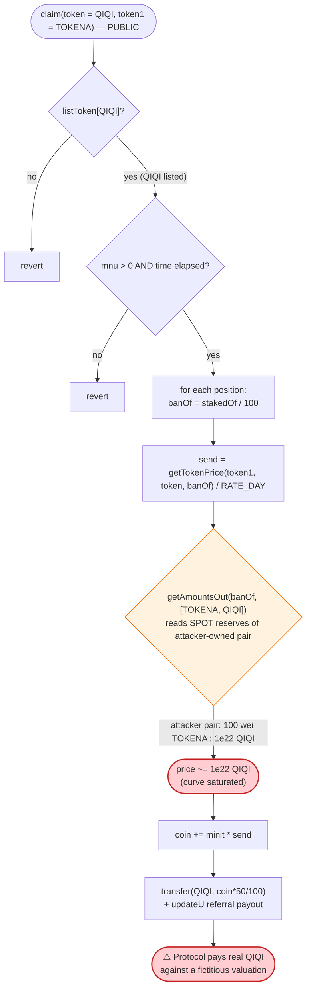
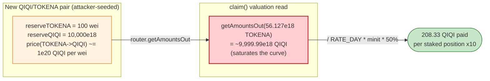

# SELLC / QIQI StakingRewards Exploit — Attacker-Chosen Reward-Valuation Token Drains the Reward Pool

> **Reproduction:** the PoC compiles & runs in an isolated Foundry project at
> [this project folder](.) (the umbrella DeFiHackLabs repo
> contains many unrelated PoCs that do not whole-compile, so this one was extracted).
> Full verbose trace: [output.txt](output.txt).
> Verified vulnerable source: [StakingRewards.sol](sources/StakingRewards_eaF834/StakingRewards.sol).

---

## Key info

| | |
|---|---|
| **Loss** | ~**1,983.33 QIQI** drained from the StakingRewards reward pool in one transaction (PoC log `Attacker QIQI balance after exploit: 1983.33`). The protocol header reports total loss as "unclear US$"; the reward pool held ~34.36M QIQI at the time. |
| **Vulnerable contract** | `StakingRewards` — [`0xeaF83465025b4Bf9020fdF9ea5fB6e71dC8a0779`](https://bscscan.com/address/0xeaF83465025b4Bf9020fdF9ea5fB6e71dC8a0779#code) |
| **Reward token / victim asset** | `QIQI` (a `SellToken`) — [`0x0B464d2C36d52bbbf3071B2b0FcA82032DCf656d`](https://bscscan.com/address/0x0B464d2C36d52bbbf3071B2b0FcA82032DCf656d) |
| **Other in-scope tokens** | `SELLC` [`0xa645995e9801F2ca6e2361eDF4c2A138362BADe4`](https://bscscan.com/address/0xa645995e9801F2ca6e2361eDF4c2A138362BADe4), `USDT` `0x55d3...7955` |
| **QIQI/SELLC pair (PancakeV2)** | `0x56712D77e5048d025946cC9d1987c5Dc72b37F49` |
| **Flash-loan source (PancakeV3 QIQI pool)** | `Pair` = `0x4B1aC1E4B828EBC81FcaC587BEf64e4aDd1dBCEc` |
| **Attacker EOA** | [`0xa3aa817587556C023e78B2285D381C68CEe17069`](https://bscscan.com/address/0xa3aa817587556c023e78b2285d381c68cee17069) |
| **Attack contracts** | `0x9a366027e6be5ae8441c9f54455e1d6c41f12e3c`, `0xc2f54422c995f6c2935bc52b0f55a03c2f3e429c` |
| **Attack txs** | `0xfe80df5d689137810df01e83b4bb51409f13c865e37b23059ecc6b3d32347136`, `0x8a453c61f0024e8e11860729083088507a02a38100da8b0c3b2d558788662fa0` |
| **Chain / block / date** | BSC / **28,187,317** / May 2023 |
| **Compiler** | `StakingRewards`: Solidity **v0.8.4**, optimizer **200 runs**; `SellToken` (QIQI/SELLC): v0.8.16 |
| **Bug class** | Price/oracle manipulation via a **caller-supplied valuation token** + a permissionless `claim()` reward formula reading a spot AMM price |

---

## TL;DR

`StakingRewards.claim(address token, address token1)`
([StakingRewards.sol:623-641](sources/StakingRewards_eaF834/StakingRewards.sol#L623-L641))
computes the reward payout by asking a PancakeSwap router for the spot price of the staked principal,
**denominated in a token (`token1`) that the caller passes in as a free argument**:

```solidity
uint banOf = stakedOf[token][msg.sender][i+1] / 100;
uint send  = getTokenPrice(token1, token, banOf) / RATE_DAY;  // token1 is attacker-chosen!
coin += minit * send;
...
IERC20(token).transfer(msg.sender, coin*50/100);              // pays out QIQI
```

`getTokenPrice(token1, token, banOf)` is just `router.getAmountsOut(banOf, [token1, token])[1]`
([:677-682](sources/StakingRewards_eaF834/StakingRewards.sol#L677-L682)) — a raw spot quote with no
oracle, no TWAP, no validation that `token1` is a legitimate reward-denomination asset.

The attacker:

1. **Stakes legitimately** (10 staking positions, each 100 USDT) to obtain `stakedOf[...] > 0` and a
   referral up-chain. This is the only "honest" cost (≈1000 USDT), and most of it is recycled into the
   QIQI/SELLC pool by the protocol's own `stake()` logic.
2. **Mints a worthless token `TOKENA`** and, inside a flash-loan callback, creates a brand-new
   `QIQI/TOKENA` PancakeSwap pair seeded at an **extreme ratio: 10,000 QIQI : 100 wei TOKENA**. This makes
   the spot price of TOKENA, expressed in QIQI, astronomically high.
3. **Calls `claim(QIQI, TOKENA)`** for every staked position. The reward formula values the staked
   principal at the manipulated `TOKENA→QIQI` price and pays out ~208.33 QIQI per position — totalling
   ~2,083 QIQI — straight out of the StakingRewards reward pool.
4. **Unwinds**: removes the QIQI/TOKENA liquidity (recovering the 10,000 QIQI) and repays the
   10,000 QIQI flash loan + 100 QIQI fee, keeping the ~1,983 QIQI of stolen rewards.

Net result: **~1,983.33 QIQI** extracted from the protocol's reward reserve in a single atomic
transaction, funded almost entirely by a flash loan.

---

## Background — what StakingRewards does

`StakingRewards` ([source](sources/StakingRewards_eaF834/StakingRewards.sol)) is a referral-style
staking/farming contract on BSC. Users stake USDT (or SELLC); the contract converts the stake into a
QIQI/SELLC LP position and records a per-user "principal" (`stakedOf`) plus a time window
(`stakedOfTimeSum`). Over time the user accrues rewards in the staked `token` (here QIQI), claimable via
`claim()`, with a multi-level referral payout to up-line addresses (`updateU` / `getUp`).

The protocol's reward accounting at the fork block:

| Item | Value (from trace) |
|---|---|
| QIQI held by StakingRewards (reward reserve) | **≈ 34,360,845 QIQI** ([output.txt:1776](output.txt)) |
| QIQI/SELLC pair reserves | ≈ 2,030,457 QIQI / 4,089,913 SELLC |
| `RATE_DAY` | 86,400 (1 day) |
| Stake per position (USDT) | 100 USDT → ≈ **5,612.73 SELLC** (`SELL`) per position |
| `stakedOf[QIQI][exploiter][1]` after a stake | ≈ 5,612.73e18 |
| `banOf = stakedOf / 100` | ≈ **56.127e18** |
| Time elapsed before claim (`minit`) | **3,600 s** (`vm.warp(+1 hour)`) |

The whole exploit hinges on one fact: the reward valuation in `claim()` is read from a **spot AMM
price of a pair (`token1`/`token`) the caller chooses freely**, and that pair can be created and
priced by the attacker.

---

## The vulnerable code

### 1. `claim()` values rewards at an attacker-chosen spot price

[StakingRewards.sol:623-641](sources/StakingRewards_eaF834/StakingRewards.sol#L623-L641):

```solidity
function claim(address token, address token1) public {
    require(listToken[token]);
    require(users[token][msg.sender].mnu > 0);
    require(block.timestamp > stakedOfTime[token][msg.sender]);
    uint minit = block.timestamp - stakedOfTime[token][msg.sender];
    uint coin;
    for (uint i = 0; i < users[token][msg.sender].mnu; i++) {
        if (stakedOfTimeSum[token][msg.sender][i+1] > minit && stakedOf[token][msg.sender][i+1] > 0) {
            uint banOf = stakedOf[token][msg.sender][i+1] / 100;
            uint send  = getTokenPrice(token1, token, banOf) / RATE_DAY;  // ⚠️ token1 is caller-controlled
            coin += minit * send;
            stakedOfTimeSum[token][msg.sender][i+1] -= minit;
        }
    }
    bool isok = IERC20(token).transfer(msg.sender, coin*50/100);          // ⚠️ pays out the manipulated amount
    require(isok);
    stakedOfTime[token][msg.sender] = block.timestamp;
    updateU(token, msg.sender, coin*50/100);                             // ⚠️ also pays referral up-line
}
```

`token1` is **not validated** against any whitelist — it is whatever address the caller passes. The
reward is `minit * getTokenPrice(token1, token, banOf) / RATE_DAY`, so it scales linearly with the spot
price `getAmountsOut(banOf, [token1, token])`.

### 2. `getTokenPrice` is a raw, manipulable spot quote

[StakingRewards.sol:677-682](sources/StakingRewards_eaF834/StakingRewards.sol#L677-L682):

```solidity
function getTokenPrice(address usdt, address _tolens, uint bnb) view private returns(uint){
    address[] memory routePath = new address[](2);
    routePath[0] = usdt;     // == token1 (attacker-chosen)
    routePath[1] = _tolens;  // == token  (QIQI)
    return IRouters.getAmountsOut(bnb, routePath)[1];
}
```

No oracle, no TWAP, no sanity bound. It reads the **instantaneous reserves** of the
`token1`/`token` pair. If the attacker is the only liquidity provider in that pair, the attacker sets
the price.

### 3. The `stake()` precondition the attacker satisfies cheaply

[StakingRewards.sol:463-504](sources/StakingRewards_eaF834/StakingRewards.sol#L463-L504): staking 100 USDT
(`token2 == USDT` branch requires only `amount >= 100 ether`) records
`stakedOf[QIQI][msg.sender][mnu] += SELL`, `users[QIQI][msg.sender].mnu++`, and seeds the referral
graph. `require(listToken[token])` is satisfied because QIQI is already a listed token. The first staker
piggybacks on the seeded `users[QIQI][owner].tz = 100 ether` so the `require(users[token][up].tz > 0 ...)`
gate passes; each subsequent staker uses the previous exploiter as `up`.

---

## Root cause — why it was possible

The reward valuation trusts a **price feed that the caller fully controls in two independent ways**:

1. **`token1` (the denomination asset) is a free function argument.** Nothing forces it to be USDT,
   SELLC, or any sanctioned reward base. The attacker passes a freshly-minted token (`TOKENA`).
2. **The price source is a spot `getAmountsOut` on a pair the attacker created and seeded.** With
   reserves of `10,000 QIQI : 100 wei TOKENA`, the marginal price of TOKENA in QIQI is enormous, so
   `getAmountsOut(56.127e18 TOKENA, [TOKENA, QIQI])` returns essentially the **entire QIQI side of that
   pool (~9,999.99e18 QIQI)** — saturating the curve.

Concretely, the reward per claimed position is:

```
send = getTokenPrice(TOKENA, QIQI, 56.127e18) / 86400
     ≈ 1.0e22 / 86400 ≈ 1.157e17 QIQI/s
coin = minit * send = 3600 * 1.157e17 ≈ 4.166e20
payout = coin * 50 / 100 ≈ 2.083e20 = 208.33 QIQI per position
```

This matches the trace exactly: each `claim` paid `208333333333333332000` QIQI ([output.txt:3858](output.txt)).
Because the reward is denominated in `token` (QIQI) and paid from the contract's own QIQI reserve, a
manipulated *valuation* converts directly into a real QIQI outflow — the attacker prints rewards out of
thin air and the protocol's QIQI pool covers them.

Four design decisions compose into the critical bug:

1. **Caller-chosen valuation token.** `claim(token, token1)` lets the attacker pick the price's
   denominator.
2. **Spot price, not oracle.** `getAmountsOut` is read live, so a freshly-seeded pair sets the rate.
3. **`claim()` is permissionless** beyond holding a (cheap) stake; anyone who stakes once can claim.
4. **The payout asset is the contract's own reserve.** A fictitious valuation becomes a real transfer
   of QIQI the protocol actually holds, plus referral payouts via `updateU`.

---

## Preconditions

- Attacker holds ≥ 1 staked position so `users[QIQI][attacker].mnu > 0` and `stakedOf > 0`. The PoC
  opens **10** positions of 100 USDT each (`stakeFactory(10)`), chained as referral up-lines so each
  claim also pays the up-line exploiter contracts ([SELLC02_exp.sol:67-82](test/SELLC02_exp.sol#L67-L82)).
- `block.timestamp > stakedOfTime[QIQI][attacker]` and `stakedOfTimeSum > minit`. The PoC warps
  +1 hour (`minit = 3600`) ([SELLC02_exp.sol:56](test/SELLC02_exp.sol#L56)).
- A `QIQI/TOKENA` pair the attacker controls, seeded at an extreme ratio. Created inside the flash
  callback with `Router.addLiquidity(QIQI, TOKENA, 10_000e18, 100, ...)`.
- Working QIQI to seed the pool — supplied by a **PancakeV3 flash loan of 10,000 QIQI**
  ([SELLC02_exp.sol:60](test/SELLC02_exp.sol#L60)), fully repaid intra-transaction. The only
  non-recovered capital is the staking USDT, most of which the protocol recycles into LP.

---

## Attack walkthrough (with on-chain numbers from the trace)

| # | Step | Concrete values (from [output.txt](output.txt)) | Effect |
|---|------|---|--------|
| 0 | **Fund & stake ×10** — `stakeFactory(10)`: each Exploiter stakes 100 USDT | per stake: 100 USDT → ≈5,612.73 SELLC (`SELL`); `stakedOf[QIQI][exploiter][1]` ≈ 5,612.73e18; `mnu = 1` | Establishes 10 valid staking positions + referral chain. |
| 1 | **Warp +1h** — `vm.warp(block.timestamp + 3600)` | `minit = 3600 s` | Makes `claim()` reward window non-zero. |
| 2 | **Mint junk token** — `TokenA.mint(100)` | `TOKENA.totalSupply = 100 wei`, all held by attacker | Worthless valuation token. |
| 3 | **Flash-borrow 10,000 QIQI** — `Pair.flash(this, 10_000e18, 0, "")` from PancakeV3 pool `0x4B1aC1…` | borrowed `1e22` QIQI; fee `paid0 = 100e18` QIQI | Capital to seed the rigged pool. |
| 4 | **Create rigged pool** (in callback) — `Router.addLiquidity(QIQI, TOKENA, 10_000e18, 100)` | new pair `0x8788B9…`, reserves **10,000e18 QIQI : 100 wei TOKENA**; `getReserves() = (1e22, 100)` | Spot price of TOKENA→QIQI is now astronomical. |
| 5 | **Claim ×10** — each `Exploiter.claim(TOKENA)` → `StakingRewards.claim(QIQI, TOKENA)` | `getAmountsOut(56.127e18 TOKENA,[TOKENA,QIQI]) ≈ 9,999.99e18`; payout **208.33 QIQI** per claim, plus up-line referral payouts (62.5 / 31.25 QIQI…) | Drains QIQI from the StakingRewards reserve; proceeds funnel to attacker (`QIQI.transfer(msg.sender, …)` in `Exploiter.claim`). |
| 6 | **Unwind LP** — `Router.removeLiquidity(QIQI, TOKENA, 999999999000)` | returns **9,999.99e18 QIQI + 99 wei TOKENA**; pair left at `(1e13, 1)` | Recovers the QIQI used to seed the rigged pool. |
| 7 | **Repay flash** — `QIQI.transfer(Pair, 10_100e18)` | `1.01e22` QIQI returned (10,000 principal + 100 fee) | Flash loan settled. |
| 8 | **Final balance** | `QIQI.balanceOf(attacker) = 1983333323333333320000` = **1,983.33 QIQI** | Profit retained. |

The 10 claims each emitted `getAmountsOut(~56e18 TOKENA, [TOKENA, QIQI])` returning ~9,999.99e18 QIQI
([output.txt:3854, 3893, 3939, …](output.txt)), confirming the curve was saturated on every claim.

### Profit / loss accounting (QIQI)

| Direction | Amount (QIQI) |
|---|---:|
| Flash-borrowed (returned) | 10,000.00 |
| Seed rigged pool (recovered via removeLiquidity) | ~10,000.00 → ~9,999.99 |
| **Rewards minted from StakingRewards reserve (10 claims + referral)** | ≈ **2,083.33** |
| Flash-loan fee paid | −100.00 |
| LP dust / rounding loss | ≈ −0.0001 |
| **Net retained profit** | **≈ +1,983.33** |

The ~1,983.33 QIQI of net profit is genuine value removed from the StakingRewards reward reserve — the
contract paid out QIQI it actually held, against a reward figure that was pure price fiction. (The
separate ~1000 USDT of staking principal is largely recycled by the protocol into the QIQI/SELLC LP
during `stake()`; the headline figure is the QIQI drained.)

---

## Diagrams

### Sequence of the attack

```mermaid
sequenceDiagram
    autonumber
    actor A as "Attacker (ContractTest)"
    participant X as "Exploiter[i] (10x)"
    participant S as StakingRewards
    participant R as PancakeRouter
    participant V3 as "PancakeV3 QIQI pool (flash)"
    participant NP as "QIQI/TOKENA pair (rigged)"

    rect rgb(232,245,233)
    Note over A,S: Phase 1 — establish 10 cheap stakes
    loop 10 times
        A->>X: stake(prevExploiter)
        X->>S: stake(QIQI, SELLC, USDT, up, 100 USDT)
        Note over S: stakedOf[QIQI][X][1] += ~5,612.73e18<br/>mnu = 1; referral up-chain set
    end
    end

    Note over A: vm.warp(+3600s) -> minit = 3600

    rect rgb(255,243,224)
    Note over A,NP: Phase 2 — flash-loan + rig the price
    A->>A: TokenA.mint(100)
    A->>V3: flash(10,000 QIQI)
    V3-->>A: 10,000 QIQI (fee 100)
    A->>R: addLiquidity(QIQI 10,000e18, TOKENA 100 wei)
    R->>NP: create pair, reserves (1e22 QIQI : 100 TOKENA)
    end

    rect rgb(255,235,238)
    Note over A,S: Phase 3 — drain via inflated claims
    loop 10 times
        A->>X: claim(TOKENA)
        X->>S: claim(QIQI, TOKENA)
        S->>R: getAmountsOut(56.127e18 TOKENA, [TOKENA, QIQI])
        R-->>S: ~9,999.99e18 QIQI (curve saturated)
        S->>X: transfer 208.33 QIQI (+ referral up-line)
        X->>A: forward QIQI
    end
    end

    rect rgb(227,242,253)
    Note over A,V3: Phase 4 — unwind & repay
    A->>R: removeLiquidity(QIQI/TOKENA)
    R-->>A: ~9,999.99 QIQI back
    A->>V3: transfer 10,100 QIQI (repay + fee)
    end

    Note over A: Net +1,983.33 QIQI from the reward reserve
```

### Where the price feed breaks down



### Rigged-pool price manipulation (before vs. claim read)



---

## Why each magic number

- **10 stakes (`stakeFactory(10)`):** maximizes the number of independent `claim()` payouts and builds a
  10-deep referral up-chain, so each claim also pays referral rewards (`updateU` → `getUp`: 30%/15%/15%…)
  to the other exploiter contracts, which forward everything to the attacker.
- **`TokenA.mint(100)` (100 wei):** a deliberately tiny TOKENA supply. Pairing 100 wei TOKENA with
  10,000 QIQI puts the pool at an extreme ratio, so a small `banOf` of TOKENA prices to nearly the whole
  QIQI reserve of the rigged pair.
- **Flash loan 10,000 QIQI:** the QIQI needed to seed the rigged pool with a large QIQI side (so the
  saturated `getAmountsOut` returns a large number). Fully recovered via `removeLiquidity`, then repaid
  with the 100 QIQI fee.
- **`minit = 3600` (warp +1h):** `claim` requires `block.timestamp > stakedOfTime`; one hour is enough to
  make the linear `minit * send` reward meaningful while keeping `stakedOfTimeSum > minit`.

---

## Remediation

1. **Do not let the caller choose the valuation token.** `claim()` must derive the reward-denomination
   asset from trusted protocol state (e.g., a per-`token` `myReward[token]` set by governance), never from
   a free `token1` argument. Reject any `token1` not on an explicit allow-list.
2. **Never price rewards from a spot `getAmountsOut`.** Use a manipulation-resistant oracle (Chainlink, or
   a long-window TWAP) for any value that becomes a real token outflow. Spot reserves of a pair the caller
   can create are not a price feed.
3. **Validate that the price pair is canonical and sufficiently liquid.** If an AMM quote must be used,
   confirm the pair is the protocol's sanctioned pair, that it pre-existed, and that its reserves exceed a
   minimum liquidity floor — a freshly-created pair with 100 wei on one side should be rejected.
4. **Bound reward payouts.** Cap per-claim and per-interval rewards relative to staked principal and a
   trusted reference price, so a corrupted valuation cannot translate into an unbounded reserve drain.
5. **Decouple valuation from payout asset.** The reward valuation (in some quote token) and the asset
   actually transferred (QIQI from the contract's reserve) should be reconciled against real, oracle-backed
   value, not a router quote against an arbitrary path.

---

## How to reproduce

The PoC was extracted into a standalone Foundry project (the umbrella DeFiHackLabs repo has many
unrelated PoCs that fail to compile under `forge test`'s whole-project build):

```bash
_shared/run_poc.sh 2023-05-SELLC02_exp --mt testExploit -vvvvv
```

- RPC: a **BSC archive** endpoint is required (fork block 28,187,317 is old). The harness selects the
  `bsc` fork alias; most public BSC RPCs prune state at this height and fail with
  `header not found` / `missing trie node`.
- Result: `[PASS] testExploit()` with `Attacker QIQI balance after exploit: 1983.33…`.

Expected tail:

```
Ran 1 test for test/SELLC02_exp.sol:ContractTest
[PASS] testExploit() (gas: 13930530)
  Attacker QIQI balance after exploit: 1983.333323333333320000

Suite result: ok. 1 passed; 0 failed; 0 skipped; finished in 50.99s
Ran 1 test suite ...: 1 tests passed, 0 failed, 0 skipped (1 total tests)
```

---

*Reference: BlockSec analysis thread — https://twitter.com/BlockSecTeam/status/1657715018908180480 ; SlowMist Hacked — https://hacked.slowmist.io/ (SELLC/QIQI, BSC, May 2023).*
