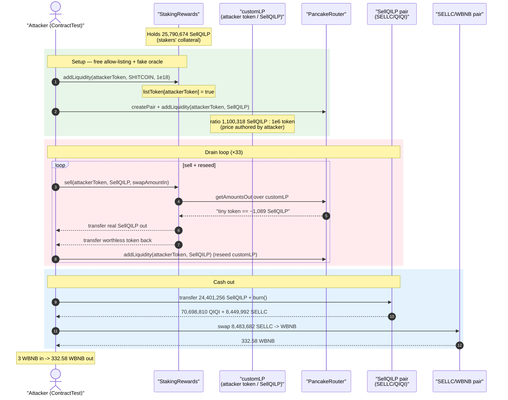
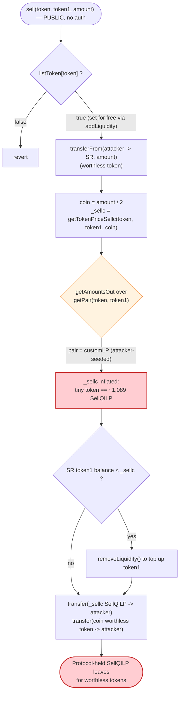

# SELLC / StakingRewards Exploit — Permissionless `sell()` Drains Staked LP Tokens via a Self-Created Price Oracle

> **Reproduction:** the PoC compiles & runs in an isolated Foundry project at
> [this project folder](.) (the umbrella DeFiHackLabs repo contains many
> unrelated PoCs that fail to compile under one whole-project build, so this one was extracted).
> Full verbose trace: [output.txt](output.txt).
> Verified vulnerable source: [StakingRewards.sol](sources/StakingRewards_274b3e/StakingRewards.sol).

---

## Key info

| | |
|---|---|
| **Loss** | ~$95K — attacker turned **3 WBNB** into **332.58 WBNB** (≈ **+329.58 WBNB** net) by draining the protocol's staked SELLC/QIQI LP tokens |
| **Vulnerable contract** | `StakingRewards` — [`0x274b3e185c9c8f4ddEF79cb9A8dC0D94f73A7675`](https://bscscan.com/address/0x274b3e185c9c8f4ddEF79cb9A8dC0D94f73A7675#code) |
| **Drained asset** | `SellQILP` = the SELLC/QIQI PancakePair LP token — [`0x4cd4Bf5079Fc09d6989B4b5B42b113377AD8d565`](https://bscscan.com/address/0x4cd4Bf5079Fc09d6989B4b5B42b113377AD8d565) (held by StakingRewards as staked liquidity) |
| **Tokens involved** | `SELLC` [`0xa645…BADe4`](https://bscscan.com/address/0xa645995e9801F2ca6e2361eDF4c2A138362BADe4), `QIQI` [`0x8121…f9C9`](https://bscscan.com/address/0x8121D345b16469F38Bd3b82EE2a547f6Be54f9C9), `WBNB` `0xbb4C…095c` |
| **Attacker EOA** | `0xc67af66b8a72d33dedd8179e1360631cf5169160` |
| **Attacker contract** | `0xf635fea87f0a8a444ede1dbb698d875dbb417829` |
| **Attack txs** | [`0x59ed06fd…05f3`](https://bscscan.com/tx/0x59ed06fd0d44aec351bed54f57eccec65874da5a25a0aa71e348611710ec05f3), [`0x904e48cc…02bf`](https://bscscan.com/tx/0x904e48ccc1a1eada85f2e3a6444debc428c55f8652ebbebe26e77d02be2902bf), [`0x247e61bd…b46d`](https://bscscan.com/tx/0x247e61bd0f41f9ec56a99558e9bbb8210d6375c2ed6efa4663ee6a960349b46d) |
| **Chain / fork block / date** | BSC / 28,092,673 / May 2023 |
| **Compiler** | StakingRewards: Solidity **v0.8.4**, optimizer 1/200 runs |
| **Bug class** | Permissionless reward function + attacker-controlled price oracle → theft of protocol-held LP collateral |

---

## TL;DR

`StakingRewards` is a yield/referral contract that holds SELLC/QIQI **LP tokens** (`SellQILP`) on
behalf of its stakers. It exposes two functions with **no meaningful access control** that, when
combined, let anyone walk off with all of those LP tokens:

1. **`addLiquidity(_token, token1, amount1)`** ([StakingRewards.sol:546-563](sources/StakingRewards_274b3e/StakingRewards.sol#L546)) — anyone can register an arbitrary `_token` and it is unconditionally added to the `listToken` allow‑list. The attacker registers a worthless self‑deployed token (`SHITCOIN`) and, separately, registers its own EOA‑contract as a "token" too.
2. **`sell(token, token1, amount)`** ([StakingRewards.sol:568-587](sources/StakingRewards_274b3e/StakingRewards.sol#L568)) — for any `listToken[token]`, it pays the caller `_sellc = getTokenPriceSellc(token, token1, amount/2)` units of `token1` **out of the contract's own balance / its staked LP**, and that price is read from `Router.getAmountsOut` over a pair the **attacker created and controls**.

The attacker fabricates a private `token / SellQILP` pair (`customLP`) with a wildly skewed ratio
(`1,100,318 SellQILP : 0.000000000001 token`). `sell()` then quotes a tiny amount of the
attacker's token as being worth ~1,089 real `SellQILP`, transfers those LP tokens out of the
StakingRewards contract to the attacker, and receives only worthless tokens in return. Repeating the
`sell → re-seed the fake pair → sell` loop ~33 times drains **24.4M SellQILP** from StakingRewards.

The attacker then **burns** the stolen LP tokens to redeem the underlying real assets
(**70.70M QIQI + 8.45M SELLC**), swaps the SELLC for **332.58 WBNB**, and exits. Starting capital
was 3 WBNB; the rest of the underlying liquidity belonged to the protocol's stakers.

---

## Background — what StakingRewards does

`StakingRewards` ([source](sources/StakingRewards_274b3e/StakingRewards.sol)) is an `Ownable`
staking + multi-level-referral contract for the SELLC ecosystem on BSC. Users stake USDT/SELLC, the
contract buys the "project token", **adds liquidity, and custodies the resulting LP tokens** as the
backing for future reward payouts. Its design therefore assumes the contract holds large balances of
real, valuable LP tokens (here, `SellQILP` = the SELLC/QIQI PancakePair).

It pays out rewards / sells using PancakeSwap as a **price oracle**, calling
`Router.getAmountsOut(...)` to convert between a project token and `token1`. The fatal assumption is
that the `token`/`token1` pair quoted is an honest, deep market. Nothing enforces that.

Relevant entry points (all reachable without privileges unless noted):

- `addLiquidity` — *not* `onlyOwner`; sets `listToken[_token]=true` for any caller-supplied token.
- `sell` — *not* `onlyOwner`; pays out `token1` based on a router quote, and removes liquidity if its
  own `token1` balance is short.
- `setListToken`, `setStartTime`, `getToken`, `updateUser` — these *are* `onlyOwner`, showing the
  authors knew about access control but left the two value-moving functions open.

On-chain state at the fork block (read from the trace):

| Parameter | Value | Trace |
|---|---|---|
| `SellQILP` held by StakingRewards (the prize) | **25,790,674 SellQILP** [2.579e25] | [output.txt:1966](output.txt) |
| SELLC/QIQI pair reserves (`SellQILP`) | 74,754,180 QIQI / 8,934,694 SELLC | [output.txt:1722-1724](output.txt) |
| `listToken[QIQI]` | `true` (hard-coded in constructor) | [StakingRewards.sol:431](sources/StakingRewards_274b3e/StakingRewards.sol#L431) |
| SELLC/WBNB pair (`0x358E…51b6`) | 6,791,193 SELLC / 599.48 WBNB | [output.txt:1665-1667](output.txt) |

---

## The vulnerable code

### 1. `addLiquidity` — permissionless allow-listing of an arbitrary token

```solidity
function addLiquidity(address _token,address token1, uint amount1)public    {   // ← no onlyOwner
    uint lp=IERC20(_token).totalSupply()*90/100;
    ...
    bool isok=IERC20(_token).transferFrom(msg.sender, address(this), IERC20(_token).totalSupply());
    isok=IERC20(token1).transferFrom(msg.sender, address(this), amount1);
    require(isok);
    ...
    listToken[_token]=true;                                                       // ← attacker token allow-listed
    users[_token][0x2F98Fa813Ced7Aa9Fd6788aB624b2F3F292B9239].tz+= 100 ether;
}
```
[StakingRewards.sol:546-563](sources/StakingRewards_274b3e/StakingRewards.sol#L546)

Anyone can call it with a token they fully control (the PoC's `SHITCOIN`). The only side effect that
matters is the last-but-one line: **`listToken[_token]=true`**, which is the sole gate guarding
`sell()`.

### 2. `sell` — pays out `token1` from the contract's balance using an attacker-controlled price

```solidity
function sell(address token,address token1,uint amount)public {                  // ← no onlyOwner
    require(listToken[token]);                                                    // ← only gate (attacker satisfies it)
    bool isok=IERC20(token).transferFrom(msg.sender, address(this), amount);      // pull worthless `token`
    require(isok);
    address pair=ISwapFactory(IRouters.factory()).getPair(token,token1);
    IERC20(pair).approve(address(address(IRouters)), 2 ** 256 - 1);
    uint lp=IERC20(pair).balanceOf(address(this))*7/1000;
    ...
    uint coin=amount*50/100;
    uint _sellc=getTokenPriceSellc(token,token1,coin);                            // ⚠️ price from attacker's pair
    if(IERC20(token1).balanceOf(address(this)) < _sellc){
     IRouters.removeLiquidity(token,token1,lp,0,0,address(this),block.timestamp+100);
    }
    IERC20(token1).transfer(msg.sender,_sellc);                                   // ⚠️ pays real token1 to attacker
    IERC20(token).transfer(msg.sender,coin);                                      // returns worthless token
}

function getTokenPriceSellc(address _tolens,address token1,uint bnb) view private returns(uint){
       address[] memory routePath = new address[](2);
       routePath[0] = _tolens;                                                    // attacker token
       routePath[1] = token1;                                                     // SellQILP
       return IRouters.getAmountsOut(bnb,routePath)[1];                           // ⚠️ quote over attacker's pool
}
```
[StakingRewards.sol:568-587](sources/StakingRewards_274b3e/StakingRewards.sol#L568) and
[:646-651](sources/StakingRewards_274b3e/StakingRewards.sol#L646)

`token1` here is `SellQILP` — the real, valuable LP token the protocol custodies. `getTokenPriceSellc`
prices the attacker's token *against `SellQILP`* by reading `Router.getAmountsOut` over the pair
`getPair(token, SellQILP)`. That pair was **created and funded by the attacker** (`customLP`), so its
ratio — and therefore the payout — is entirely attacker-chosen.

---

## Root cause — why it was possible

Three independent design defects compose into a critical theft of protocol funds:

1. **No access control on value-moving functions.** Both `addLiquidity` (which writes the
   `listToken` allow-list) and `sell` (which transfers `token1` out of the contract) are `public`
   with no `onlyOwner`/role check. The only barrier is `require(listToken[token])` in `sell`, and
   `addLiquidity` lets *anyone* flip that bit for *any* token.

2. **Spot price from a manipulable AMM as the payout oracle.** `sell` decides how much `token1` to
   hand out via `Router.getAmountsOut` over `getPair(token, token1)`. The attacker registers a token
   whose only `token1` market is a pool **they** seeded. By choosing the pool ratio, the attacker
   makes an arbitrarily small amount of their worthless token quote as a large amount of `SellQILP`.
   Spot AMM reserves are not a trustworthy price source for a function that pays out real assets.

3. **The contract pays out a valuable bearer asset it custodies for others.** `token1` is the
   pooled LP token backing all stakers. `sell` transfers it to `msg.sender` (and even calls
   `removeLiquidity` to top up its `token1` balance if short), so a caller who games the price
   simply withdraws other people's collateral.

> The contract trusts a price feed that the *caller* can author, and then uses that feed to release
> assets that belong to *everyone else*. The attacker only had to mint a junk token, list it for
> free, create a one-sided pool, and call `sell` in a loop.

The `if(totalSupply < totalSupply/10) transfer(dead, amount)` "burn", the `lp = balance*7/1000`
liquidity skim, and the `removeLiquidity` top-up are all noise around this core flaw — they merely
determine the *rate* of extraction, not whether extraction is possible.

---

## Preconditions

- **None privileged.** The attacker is an ordinary EOA; no owner key, no prior stake.
- StakingRewards must hold a meaningful balance of the target `token1` (`SellQILP`) — true at the
  fork block (25.79M LP tokens, [output.txt:1966](output.txt)).
- `token1` must be a redeemable LP token (or otherwise valuable), so the attacker can convert the
  stolen units into base assets. Here `SellQILP.burn()` redeems SELLC + QIQI.
- Working capital: only **3 WBNB** of seed funds, used to acquire a little SELLC/QIQI to bootstrap the
  attacker's own LP and fake pools. The bulk of the extracted value comes from the protocol.

---

## Attack walkthrough (with on-chain numbers from the trace)

The PoC's `ContractTest` *is* the attacker contract; it also implements a fake ERC20 (`balanceOf`,
`transfer`, `totalSupply()==100`) so it can pose as a "project token". `SellQILP` =
`0x4cd4Bf…d565` (SELLC/QIQI LP). `customLP` = `0xFcE8A0…D88f` (attacker's `ContractTest / SellQILP`
pair). Figures are taken directly from `Sync`/`getReserves`/`Transfer` events in
[output.txt](output.txt).

| # | Step | Trace | Effect |
|---|------|-------|--------|
| 0 | **Seed.** `deal` 3 WBNB + 3,188 QIQI to attacker; swap 3 WBNB → **34,070.9 SELLC** on the SELLC/WBNB pool | [:1668-1687](output.txt) | Bootstrap capital. |
| 1 | **Add SELLC/QIQI liquidity** (mint real `SellQILP`); attacker receives **1,100.3 SellQILP** | [:1703-1738](output.txt) | Gives attacker some real LP to seed the fake pool. |
| 2 | Deploy `SHITCOIN`, mint 1e18, `mint(100)` the attacker token; `addLiquidity(attacker, SHITCOIN, 1e18)` → **`listToken[attacker]=true`** | [:1739-1759](output.txt) | Free allow-listing of the attacker token. |
| 3 | `Factory.createPair(attacker, SellQILP)` then `addLiquidity(attacker=1,000,000 wei, SellQILP=1,100.3)` → **customLP** with ratio `1,100,318 SellQILP : 1e6 token` | [:1852-1933](output.txt) | Attacker-authored price oracle. |
| 4 | `init2` loop ×10 — `sell(attacker, SellQILP, swapAmountIn)` each pays out ~99% of customLP's `SellQILP` reserve, then re-adds 100 token + the proceeds back into customLP to keep the skew | [:1939-2700](output.txt) | StakingRewards LP holdings tick down: 25,790,674 → 25,253,261 SellQILP. |
| 5 | `process(23)` — same `sell` 23 more times, doubling `swapAmountIn` each round as the payout compounds | [:2700-3614](output.txt) | Drains the bulk of StakingRewards' LP balance. |
| 6 | Attacker now holds **24,401,256 SellQILP**; `transfer` them to the pair and `SellQILP.burn()` | [:3615-3654](output.txt) | Redeems **70,698,810 QIQI + 8,449,992 SELLC**. |
| 7 | Swap **8,483,682 SELLC → 332.58 WBNB** on the SELLC/WBNB pool | [:3662-3690](output.txt) | Cash out. |
| 8 | **Final attacker WBNB = 332.58** (started with 3) | [:1569, :3694](output.txt) | Net profit. |

### How one `sell()` steals LP tokens (concrete, first iteration)

From [output.txt:1939-1978](output.txt):

- customLP reserves: `1,100,318.439 SellQILP [reserve0]`, `1,000,000 wei attacker-token [reserve1]` ([:1963](output.txt)).
- attacker calls `sell(attacker, SellQILP, 198,496,242)`; `coin = amount/2 = 99,248,121` wei.
- `getTokenPriceSellc` → `getAmountsOut(99,248,121, [attacker, SellQILP])` = **1,089,315,255,005,338,726,502 ≈ 1,089.3 SellQILP** ([:1961-1964](output.txt)).
- StakingRewards (balance 25,790,674 SellQILP) then `transfer`s **1,089.3 SellQILP** to the attacker ([:1967](output.txt)) and `transfer`s back 99,248,121 wei of worthless attacker-token ([:1973](output.txt)).
- Net: attacker pays ~0.0000000002 worthless tokens, receives 1,089.3 real LP tokens. The attacker
  then folds those LP tokens back into customLP ([:1981](output.txt)) so the next `sell` quotes an even
  larger payout — a positive feedback loop that compounds with `swapAmountIn` doubling each round.

### Profit accounting

| Item | Amount |
|---|---:|
| Seed capital (WBNB) | 3.00 |
| `SellQILP` drained from StakingRewards | ~24.40M LP tokens (of 25.79M held) |
| Redeemed by burning LP | 70,698,810 QIQI + 8,449,992 SELLC |
| SELLC sold → WBNB | 8,483,682 SELLC → **332.58 WBNB** |
| **Final WBNB balance** | **332.58** ([output.txt:1569](output.txt)) |
| **Net profit (WBNB)** | **≈ +329.58** (plus ~70.7M residual QIQI) |

(The headline "~$95K" is SlowMist's USD valuation of the total extracted SELLC+QIQI at the time; the
WBNB figure above is the directly-realized portion in the PoC.)

---

## Diagrams

### Sequence of the attack



### Why `sell()` releases collateral — the trust gap



### StakingRewards LP balance draining over the loop

```mermaid
flowchart LR
    S0["Start<br/>SR holds 25,790,674 SellQILP"]
    S1["After init2 loop (×10)<br/>25,253,261 SellQILP"]
    S2["After process (×23)<br/>~1.39M SellQILP left"]
    S3["Attacker holds<br/>24,401,256 SellQILP"]
    S4["burn()<br/>70.70M QIQI + 8.45M SELLC"]
    S5["SELLC -> WBNB<br/>332.58 WBNB"]

    S0 -->|"sell + reseed customLP"| S1
    S1 -->|"sell ×23 (swapAmountIn doubles)"| S2
    S2 -->|"accumulated stolen LP"| S3
    S3 -->|"transfer + burn"| S4
    S4 -->|"swap on SELLC/WBNB"| S5

    style S3 fill:#ffcdd2,stroke:#c62828,stroke-width:2px
    style S5 fill:#c8e6c9,stroke:#2e7d32
```



---

## Why each magic number

- **`swapExactTokensForTokensSupportingFeeOnTransferTokens(3 WBNB)`** — converts the only real seed
  capital (3 WBNB) into 34,070.9 SELLC, just enough to mint the initial 1,100.3 `SellQILP` used to
  seed the fake pool.
- **customLP ratio `1,100,318 SellQILP : 1,000,000 wei token`** — a deliberately one-sided pool so the
  router quotes a tiny attacker-token input as ~1,089 real `SellQILP`. The ratio *is* the exploit:
  the larger the `SellQILP` side relative to the token side, the more collateral each `sell` releases.
- **`swapAmountIn = getAmountsIn(reserve*99/100)[0] * 2`** — sized so each `sell` extracts ~99% of
  the customLP's current `SellQILP` reserve, then the `*2` over-pulls so there is surplus to re-seed.
- **`addLiquidity(attacker, SellQILP, 100, proceeds)` after each sell** — re-injects the just-stolen
  `SellQILP` back into customLP to *restore and amplify* the skew, so the next `sell` quotes an even
  bigger payout. This is the compounding step that lets 3 WBNB snowball into 24.4M LP tokens.
- **33 iterations (10 in `init2` + 23 in `process`)** — enough rounds for the doubling `swapAmountIn`
  to sweep almost the entire 25.79M `SellQILP` balance out of StakingRewards.

---

## Remediation

1. **Add access control to value-moving functions.** `sell` and `addLiquidity` must not be callable by
   arbitrary users. At minimum gate `addLiquidity`'s `listToken[_token]=true` write behind `onlyOwner`
   (mirroring the existing `setListToken`), and restrict `sell` to genuine, accounted stakers with a
   recorded position — never let it pay out more than the caller actually staked.
2. **Never price payouts from a spot AMM the caller can create.** `getAmountsOut` over an
   attacker-listable pair is fully manipulable. Use a vetted oracle (Chainlink/TWAP with sane bounds),
   or — better — pay rewards strictly from internally-accounted balances rather than live price quotes.
3. **Validate the pricing pair.** Reject tokens whose only `token1` market is a freshly-created,
   low-liquidity, or caller-funded pool. Require minimum liquidity / minimum pool age, and verify the
   pair is a canonical, protocol-recognized market.
4. **Separate custodied collateral from payout liquidity.** The contract should never transfer (or
   `removeLiquidity` to top up) the pooled `SellQILP` that backs all stakers in response to a single
   caller's request. Track per-user entitlements and cap withdrawals to them.
5. **Treat LP tokens as bearer assets.** Any function that can move LP tokens out of the protocol is a
   withdrawal function and must enforce the same authorization, accounting, and bounds as a withdrawal.

---

## How to reproduce

The PoC was extracted into a standalone Foundry project (the umbrella DeFiHackLabs repo has many
unrelated PoCs that fail to compile under one whole-project `forge build`):

```bash
_shared/run_poc.sh 2023-05-SELLC_exp --mt testExploit -vvvvv
```

- RPC: a **BSC archive** endpoint is required (fork block 28,092,673 is well in the past). Most public
  BSC RPCs prune that state and fail with `header not found` / `missing trie node`; use an archive
  provider.
- Result: `[PASS] testExploit()` with the attacker's WBNB balance ending at **332.58 WBNB**.

Expected tail:

```
Ran 1 test for test/SELLC_exp.sol:ContractTest
[PASS] testExploit() (gas: 7796658)
  Attacker WBNB balance after exploit: 332.581723974010235854

Suite result: ok. 1 passed; 0 failed; 0 skipped; finished in 15.79s
```

---

*Reference: SlowMist Hacked — https://hacked.slowmist.io/ (SELLC / StakingRewards, BSC, ~$95K). Analysis: [@AnciliaInc](https://twitter.com/AnciliaInc/status/1656337400329834496).*
