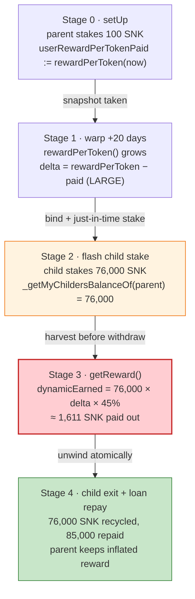
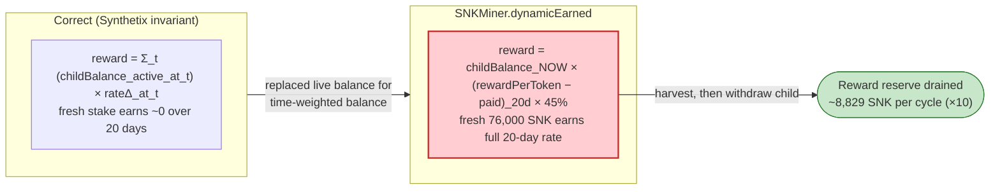

# SNK Miner Exploit — Inflated Referral Reward via Just-In-Time Child Staking

> **Reproduction:** the PoC compiles & runs in an isolated Foundry project at
> [this project folder](.) (the umbrella DeFiHackLabs repo
> contains many unrelated PoCs that do not whole-compile, so this one was extracted).
> Full verbose trace: [output.txt](output.txt).
> Verified vulnerable source: [SNKMiner.sol](sources/SNKMiner_A3f5ea/SNKMiner.sol).

---

## Key info

| | |
|---|---|
| **Loss** | The attacker minted **17,845.81 SNK** of reward across 10 sock-puppet accounts in a single transaction, netting **9,845.81 SNK ≈ 24,008 BUSD** after repaying a flash loan — vs. a legitimate **1,016.48 SNK ≈ 2,747 BUSD** for the same capital (≈ **9.7×** inflation). |
| **Vulnerable contract** | `SNKMiner` — [`0xA3f5ea945c4970f48E322f1e70F4CC08e70039ee`](https://bscscan.com/address/0xA3f5ea945c4970f48E322f1e70F4CC08e70039ee#code) |
| **Victim** | The `SNKMiner` reward reserve (SNK tokens held by the miner contract) |
| **Reward token / LP token** | `SNKToken` — [`0x05e2899179003d7c328de3C224e9dF2827406509`](https://bscscan.com/address/0x05e2899179003d7c328de3C224e9dF2827406509) |
| **Flash-loan source** | SNK/BUSD PancakePair — [`0x7957096Bd7324357172B765C4b0996Bb164ebfd4`](https://bscscan.com/address/0x7957096Bd7324357172B765C4b0996Bb164ebfd4) |
| **Invite registry** | `0xCDe4E0d76ACAa3241Cc52bf23f9c5ACbfeB71a51` |
| **Attacker tx (reference)** | `0xace112925935335d0d7460a2470a612494f910467e263c7ff477221deee90a2c` / `0x7394f2520ff4e913321dd78f67dd84483e396eb7a25cbb02e06fe875fc47013a` |
| **Chain / fork block / date** | BSC / 27,784,455 / ~May 2023 |
| **Compiler** | `SNKMiner` Solidity v0.5.17, optimizer 1 / 200 runs |
| **Bug class** | Reward-accounting flaw — referral ("community") reward multiplies a single per-token rate by the *full sum of all children's balances*, with no time-lock or staleness guard on the snapshot |

---

## TL;DR

`SNKMiner` is a Synthetix-style staking farm with a multi-level referral ("community") bonus. A
parent earns a **dynamic** reward equal to:

```
_getMyChildersBalanceOf(parent) × (rewardPerToken() − userRewardPerTokenPaid[parent]) × 45%
```

([SNKMiner.sol:585-591](sources/SNKMiner_A3f5ea/SNKMiner.sol#L585-L591)).

The fatal property: the *per-token rate delta* `(rewardPerToken − paid)` is computed exactly like
Synthetix (accrues over time, normalized by `totalSupply`), but it is then multiplied by
**`_getMyChildersBalanceOf(parent)`** — the **instantaneous, freshly-read sum of every child's
staked balance** — instead of by an *accrued, snapshotted* stake. There is no lower bound on how
recently that child balance was deposited.

So an attacker can, **inside one transaction**:

1. Set up 10 "parent" accounts that each have a tiny stale `userRewardPerTokenPaid` snapshot from
   20 days ago (large `rewardPerToken − paid` delta).
2. Flash-borrow a huge amount of SNK, freshly stake it under brand-new **child** accounts bound to
   those parents.
3. Immediately call the parent's `getReward()` — which now pays `45% × (huge fresh child balance) ×
   (20-day rate delta)`, even though that child capital was staked **microseconds ago** and earned
   nothing.
4. Withdraw the children's stake, repay the flash loan, and keep the inflated reward.

The PoC reproduces this with 10 parent/child pairs sharing a flash-loaned 76,000 SNK, harvesting
**17,845.81 SNK** total and walking away with **9,845.81 SNK** of net profit after repaying the loan
(≈ **24,008 BUSD**), against **1,016.48 SNK** for the honest path.

---

## Background — what SNKMiner does

`SNKMiner` ([source](sources/SNKMiner_A3f5ea/SNKMiner.sol)) is a staking
contract where users `stake()` SNK and receive SNK rewards that accrue at a fixed `rewardRate` and
are split into three streams:

- **Private** reward — 35% of the per-token delta on the user's *own* staked balance
  (`privateEarned`, [:594-606](sources/SNKMiner_A3f5ea/SNKMiner.sol#L594-L606)).
- **Dynamic / community** reward — 45% of the per-token delta on the user's *children's* total
  staked balance (`dynamicEarned`, [:576-592](sources/SNKMiner_A3f5ea/SNKMiner.sol#L576-L592)).
- **Node** reward — tiered bonuses based on community size (`nodeEarned`).

The referral tree is maintained by an external `Invite` registry: a child calls
`bindParent(parent)` ([:793-798](sources/SNKMiner_A3f5ea/SNKMiner.sol#L793-L798)),
which registers the parent→child relationship. A parent's "children balance" is computed on the fly
by `_getMyChildersBalanceOf`
([:749-762](sources/SNKMiner_A3f5ea/SNKMiner.sol#L749-L762)):

```solidity
function _getMyChildersBalanceOf(address user) private view returns (uint256) {
    address[] memory childers = inv.getInviterSuns(user);
    uint256 totalBalances;
    for (uint256 index = 0; index < childers.length; index++) {
        totalBalances += balanceOf(childers[index]);   // ← live, un-snapshotted balances
    }
    return totalBalances;
}
```

Like Synthetix, `SNKMiner` snapshots reward state in the `updateReward(account)` modifier
([:394-419](sources/SNKMiner_A3f5ea/SNKMiner.sol#L394-L419)) on every
mutating call, storing `userRewardPerTokenPaid[account]` and crediting accrued `prewards`/`drewards`.
The standard Synthetix invariant is: *a user only earns the rate delta that accrued **while their
stake was active**.* `SNKMiner` breaks that invariant for the dynamic stream.

On-chain parameters relevant to the attack:

| Parameter | Value at fork |
|---|---|
| `precision` | 1e18 |
| `dynamicEarned` weight | **45%** (`.mul(45).div(100)`) |
| `dynamicEarned` floor | requires `balanceOf(parent) ≥ 10e18` |
| Pool reserves (SNK / BUSD) | ≈ 84,170 SNK / 240,036 BUSD (`getReserves`) |
| SNK transfer tax | 5% (2,800 burned + 1,200 fee per 80,000 transferred) |

---

## The vulnerable code

### 1. `dynamicEarned`: per-token rate × live children balance

```solidity
function dynamicEarned(address account) public view returns (uint256) {
    if (block.timestamp < starttime) { return 0; }
    if (balanceOf(account) < 10e18) { return 0; }          // parent needs ≥10 SNK staked

    return
        _getMyChildersBalanceOf(account)                    // ⚠️ LIVE sum of child balances
            .mul(rewardPerToken().sub(userRewardPerTokenPaid[account]))  // ⚠️ rate delta over TIME
            .mul(45)
            .div(precision)
            .div(100)
            .add(drewards[account]);
}
```

The product `childBalance × (rewardPerToken − paid)` is dimensionally identical to Synthetix's
`balance × (rewardPerToken − paid)` — the correct formula for *one's own* accrued reward. But here
the `childBalance` term is read **live** at call time, while the `(rewardPerToken − paid)` term spans
the entire window since the parent's snapshot was last refreshed (20 days in the PoC). Nothing forces
the child balance to have *existed* during that window. A child staked one instruction earlier
contributes its **full** balance to a reward that "accrued" over 20 days.

### 2. `rewardPerToken`: the rate delta the attacker multiplies against

```solidity
function rewardPerToken() internal view returns (uint256) {
    if (totalSupply() == 0) return rewardPerTokenStored;
    uint256 lastTime = flag ? lastUpdateTime : starttime;
    return rewardPerTokenStored.add(
        lastTimeRewardApplicable().sub(lastTime)
            .mul(rewardRate).mul(precision).div(totalSupply())
    );
}
```

([:688-707](sources/SNKMiner_A3f5ea/SNKMiner.sol#L688-L707)) — standard Synthetix
accumulator. The parent's `userRewardPerTokenPaid` was last written when it staked 100 SNK in
`setUp`, 20 days before the harvest, so `rewardPerToken() − userRewardPerTokenPaid[parent]` is a
large positive delta.

### 3. `getReward`: pays out `dynamic + private` with no anti-flash guard

```solidity
function getReward() public updateReward(msg.sender) checkStart {
    uint256 reward = dynamicEarned(msg.sender) + privateEarned(msg.sender);
    if (reward > 0) {
        prewards[msg.sender] = 0;
        drewards[msg.sender] = 0;
        token.safeTransfer(msg.sender, reward);   // ⚠️ inflated payout leaves the contract
        ...
    }
}
```

([:498-509](sources/SNKMiner_A3f5ea/SNKMiner.sol#L498-L509)). `updateReward` runs
*before* the body, so `drewards[parent]` is set from `dynamicEarned` (the inflated value), then the
body pays it. No same-block / minimum-stake-duration check exists anywhere.

---

## Root cause — why it was possible

The dynamic-reward formula conflates two quantities that must be measured over the **same time
window**:

> A staking reward must equal `(stake that was active during Δt) × (rate that accrued during Δt)`.
> `SNKMiner` computes `(stake active *now*) × (rate accrued over the *whole* window since the
> parent's last snapshot)`.

Concretely:

1. **Live vs. snapshotted balance.** `_getMyChildersBalanceOf` reads `balanceOf(child)` at call time.
   The correct Synthetix pattern snapshots the staked balance into the per-token math at *deposit*
   time, so a deposit made now cannot retroactively earn rate that accrued before it.
2. **Stale parent snapshot.** `userRewardPerTokenPaid[parent]` is only refreshed when the *parent*
   transacts. The parent staked 20 days earlier and never refreshed, so the rate delta is enormous —
   and that delta is paid on *child* capital that did not exist for those 20 days.
3. **No minimum stake duration / same-block guard.** Stake → harvest → withdraw is allowed atomically,
   so the child's "balance" can be flash-loaned, counted once for a 20-day reward, and immediately
   removed.
4. **45% multiplier amplifies the error.** The dynamic stream is the largest of the three (45%),
   maximizing the extractable amount.

The combination makes the attack a pure, atomic, flash-loanable mint of reward tokens out of the
miner's reserve.

---

## Preconditions

- `block.timestamp > starttime` (farm started) — true at the fork; the PoC also `vm.warp`s +20 days
  in `setUp` to grow the rate delta ([SNK_exp.sol:170-171](test/SNK_exp.sol#L170-L171)).
- Parent accounts that (a) hold ≥ 10 SNK staked (to pass the `dynamicEarned` floor) and (b) have a
  stale `userRewardPerTokenPaid` snapshot. The PoC stakes 100 SNK into each of 10 parents in `setUp`
  ([SNK_exp.sol:164-169](test/SNK_exp.sol#L164-L169)).
- Working SNK capital to flash-stake under child accounts. Supplied here via a PancakePair flash swap
  of 80,000 SNK ([SNK_exp.sol:192](test/SNK_exp.sol#L192)); fully repaid intra-tx, so the attack is
  flash-loanable.
- The `Invite` registry must accept `bindParent` for fresh accounts (permissionless) — it does.

---

## Attack walkthrough (with on-chain numbers from the trace)

`setUp` ([SNK_exp.sol:161-174](test/SNK_exp.sol#L161-L174)) deals the test 1,000 SNK, deploys 10
`HackerTemplate` "parents", stakes 100 SNK into each, then `vm.warp(+20 days)` to fatten the rate
delta.

The whole exploit happens inside one `pool.swap(...)` flash-swap callback
([SNK_exp.sol:204-215](test/SNK_exp.sol#L204-L215)):

| # | Step (per parent `i`, looped 10×) | On-chain evidence |
|---|------|-------------------|
| 0 | **Flash-borrow** 80,000 SNK from the SNK/BUSD pair → SNKExp | `swap(80000e18, 0, SNKExp, 0x3078313233)`; SNK transfer 80,000 (5% tax: 2,800 burned + 1,200 fee → **76,000** net received) |
| 1 | Deploy a fresh **child** `t1`; `t1.bind(parents[i])` registers child→parent in the Invite registry | `bindParent(...)` → `Invite.invite(child, parent)` emits `Bind` |
| 2 | Transfer all 76,000 SNK to the child and `t1.stake()` | child `stake(76000e18)` → `Staked(child, 76000e18, 0)` |
| 3 | **`t.exit2()`** on the parent → calls `getReward()` then `exit()`. `dynamicEarned(parent)` = `76,000 × (20-day rate delta) × 45%` | `RewardPaid(parent_i, …)` — parent 0 receives **1,611.81 SNK** |
| 4 | `t1.exit1()` → child `exit()` returns the 76,000 SNK to SNKExp so it can be re-staked under the next parent | child SNK balance returns to SNKExp |
| 5 | After the loop, **repay** the flash swap: transfer **85,000 SNK** to the pair (covers 80,000 principal + fee) | `transfer(pool, 85000e18)`; `Swap(amount0In: 80,750e18, amount0Out: 80,000e18)` |

The 10 `RewardPaid` amounts climb each iteration (the rate delta grows as later children stake,
nudging `rewardPerToken`):

| Parent | RewardPaid (SNK) |
|---|---:|
| 1 | 1,611.81 |
| 2 | 1,648.08 |
| 3 | 1,685.11 |
| 4 | 1,722.93 |
| 5 | 1,761.55 |
| 6 | 1,800.99 |
| 7 | 1,841.27 |
| 8 | 1,882.39 |
| 9 | 1,924.39 |
| 10 | 1,967.28 |
| **Total** | **17,845.81** |

After repaying the 80,000 SNK loan (and the 5% transfer tax overhead absorbed inside the loop), the
attacker is left holding **9,845.81 SNK**, which it swaps to **24,007.99 BUSD**
([output.txt](output.txt) — `EXP SNK Amount get: 9845.81`, `EXP BUSD Amount get: 24007.99`).

### Profit / loss accounting

| Item | Amount |
|---|---:|
| Total reward minted (10 parents) | 17,845.81 SNK |
| Flash-loan principal repaid | 80,000 SNK |
| (covered from the borrowed 80k that cycled through children) | — |
| **Net SNK retained** | **9,845.81 SNK** |
| **Net SNK swapped to** | **24,007.99 BUSD** |
| Honest baseline (`testNormal`: same 10×100 SNK stake, no flash-child) | 1,016.48 SNK → 2,747.06 BUSD |
| **Inflation factor** | **≈ 9.7× (SNK) / 8.7× (BUSD)** |

The honest path (`testNormal`,
[SNK_exp.sol:176-189](test/SNK_exp.sol#L176-L189)) calls `exit2()` on the same 10 parents
*without* the just-in-time child staking and yields only **1,016.48 SNK** — the legitimately accrued
private reward on 100 SNK over 20 days. The delta (≈ 8,829 SNK) is value the attacker drained from the
miner's reward reserve.

---

## Diagrams

### Sequence of the attack

```mermaid
sequenceDiagram
    autonumber
    actor A as "SNKExp (attacker)"
    participant P as "SNK/BUSD Pair"
    participant M as "SNKMiner"
    participant I as "Invite registry"
    participant C as "Child t1 (fresh)"
    participant Par as "Parent t (staked 20d ago)"

    Note over Par: setUp: 10 parents each stake 100 SNK,<br/>then warp +20 days (stale snapshot)

    A->>P: swap(80,000 SNK, 0, A, data)  (flash borrow)
    P-->>A: 76,000 SNK (after 5% transfer tax)

    rect rgb(255,243,224)
    Note over A,C: pancakeCall — loop ×10
    A->>C: deploy child, bind(parent_i)
    C->>I: bindParent(parent_i)
    A->>C: transfer 76,000 SNK
    C->>M: stake(76,000)  (Staked event)
    Note over M: child balance = 76,000 (fresh)
    A->>Par: exit2() → getReward()
    M->>M: dynamicEarned = 76,000 × (20d rate Δ) × 45%
    M-->>Par: RewardPaid ≈ 1,600–1,967 SNK
    A->>C: exit1() → child withdraws 76,000 SNK
    Note over A: 76,000 SNK recycled to next parent
    end

    rect rgb(255,235,238)
    A->>P: transfer 85,000 SNK (repay loan + fee)
    end

    A->>P: swap 9,845.81 SNK → 24,008 BUSD
    Note over A: Net profit ≈ 9,846 SNK (8,829 SNK over honest 1,016)
```

### Reward state evolution (one parent)



### Why it is theft: correct vs. actual dynamic-reward formula



---

## Remediation

1. **Snapshot the children's balance into the reward math, not the live balance.** Mirror the
   Synthetix pattern: maintain an accrued `drewards[parent]` that is updated in `updateReward`
   *whenever a child's balance changes*, using the per-token delta and the child balance **at that
   moment**. `dynamicEarned` should then return only `drewards[parent]` (plus the delta on the
   *previously-snapshotted* community balance) — never `_getMyChildersBalanceOf` read live and
   multiplied by a historical rate.
2. **Refresh the parent's snapshot when any child stakes/withdraws.** A child's `stake`/`exit` must
   call `updateReward(parent)` for every ancestor before mutating balances, so the rate delta a
   parent can claim never spans a window during which the child's capital was absent.
3. **Add a minimum stake duration / same-block guard.** Disallow `stake` and `getReward`/`exit` for
   the same (or freshly-bound) stake within the same block, or require a minimum holding period,
   eliminating flash-loan harvesting of time-based rewards.
4. **Cap referral reward by realized accrual.** The dynamic stream should never exceed the reward the
   underlying child stake genuinely earned; assert `dynamicEarned(parent) ≤ Σ children realized
   reward`.
5. **Treat externally-mutable referral graphs as adversarial.** Because `bindParent` is permissionless
   and `getInviterSuns` is read live, any per-token reward keyed off the graph must be snapshot-based,
   not point-in-time.

---

## How to reproduce

The PoC was extracted into a standalone Foundry project (the umbrella DeFiHackLabs repo has many
unrelated PoCs that fail to compile under `forge test`'s whole-project build):

```bash
_shared/run_poc.sh 2023-05-SNK_exp -vvvvv
```

- RPC: a **BSC archive** endpoint is required (fork block 27,784,455). Most public BSC RPCs prune
  this state and fail with `header not found` / `missing trie node`.
- `testExp()` is the exploit; `testNormal()` is the honest baseline for comparison.

Expected tail:

```
[PASS] testExp() (gas: 12393204)
Logs:
  EXP SNK Amount get: 9845.810030365874658840
  EXP BUSD Amount get: 24007.985054201031097858

[PASS] testNormal() (gas: 1765343)
Logs:
  Normal SNK Amount should get: 1016.478254695601287050
  Normal BUSD Amount should get: 2747.061223778034897482

Suite result: ok. 2 passed; 0 failed; 0 skipped
```

The ≈ 9.7× gap between `EXP SNK Amount get` (9,845.81) and `Normal SNK Amount should get` (1,016.48)
is the drained value.

---

*Reference: Phalcon explorer — tx
`0xace112925935335d0d7460a2470a612494f910467e263c7ff477221deee90a2c`; analysis thread
https://twitter.com/Phalcon_xyz/status/1656176776425644032 (SNK Miner, BSC, May 2023).*
