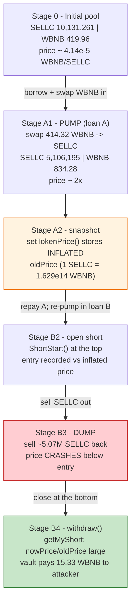
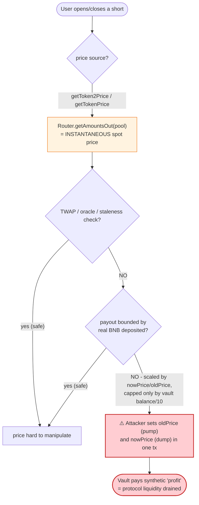

# SellToken Exploit — Spot-Price Oracle Manipulation of a Leveraged "Short" Exchange

> **Vulnerability classes:** vuln/oracle/spot-price · vuln/oracle/price-manipulation · vuln/defi/slippage

> **Reproduction:** the PoC compiles & runs in an isolated Foundry project at
> [this project folder](.) (the umbrella DeFiHackLabs repo contains many
> unrelated PoCs that do not whole-compile, so this one was extracted).
> Full verbose trace: [output.txt](output.txt).
> Verified vulnerable source: [SellToken.sol](sources/SellToken_57Db19/SellToken.sol).

---

## Key info

| | |
|---|---|
| **Loss** | ~**3.11 WBNB** profit per cycle (≈ $1,000 at the time); attacker repeated this across the `SellToken` platform. This PoC reproduces a single ~3.11 WBNB cycle. |
| **Vulnerable contract** | `SellToken` exchange — [`0x57Db19127617B77c8abd9420b5a35502b59870D6`](https://bscscan.com/address/0x57Db19127617B77c8abd9420b5a35502b59870D6#code) |
| **Vulnerable helper** | `Minerals` (the "vault") — `0x8D190C70937493046a464440d28f126A4E42eF7f` (deployed by `SellToken` in its constructor) |
| **Shorted token (`SELLC`)** | [`0xa645995e9801F2ca6e2361eDF4c2A138362BADe4`](https://bscscan.com/address/0xa645995e9801F2ca6e2361eDF4c2A138362BADe4#code) |
| **Manipulated pool** | PancakeSwap `SELLC/WBNB` pair — `0x358EfC593134f99833C66894cCeCD41F550051b6` |
| **Flash-loan source** | DODO `DPPOracle` (WBNB private pool) — `0xFeAFe253802b77456B4627F8c2306a9CeBb5d681` |
| **Attacker contract** | `SellTokenExp` (the PoC test contract; on-chain the attacker used an equivalent helper) |
| **Attack tx** | [`0x7d04e953dad4c880ad72b655a9f56bc5638bf4908213ee9e74360e56fa8d7c6a`](https://explorer.phalcon.xyz/tx/bsc/0x7d04e953dad4c880ad72b655a9f56bc5638bf4908213ee9e74360e56fa8d7c6a) |
| **Chain / block / date** | BSC / 28,168,034 / ~May 2023 |
| **Compiler** | `SellToken` v0.8.19, optimizer 1 run · `SELLC` v0.8.16 |
| **Bug class** | Price-oracle manipulation — using `Router.getAmountsOut()` (instantaneous AMM spot price) as the trade price for a leveraged product, manipulable by a flash loan |

---

## TL;DR

`SellToken` is a self-described "decentralized short-trading exchange." A user opens a short on a token
through `ShortStart()`, and later closes it through `withdraw()`. The size of the payout on close is
computed entirely from **`PancakeRouter.getAmountsOut()`** — i.e. the **instantaneous spot price** read
straight out of the token's PancakeSwap pool
([SellToken.sol:563-580](sources/SellToken_57Db19/SellToken.sol#L563-L580),
[:581-599](sources/SellToken_57Db19/SellToken.sol#L581-L599)). There is no TWAP, no oracle, and no
sanity bound; whatever the AMM reserves say in *this block* is taken as truth.

Because that price is read from a thin PancakeSwap pool, an attacker can move it at will inside a single
transaction. The attacker:

1. **Flash-borrows 418.5 WBNB** from a DODO `DPPOracle` private pool.
2. **Pumps** the `SELLC/WBNB` pool by swapping ~414 WBNB into SELLC, **inflating the recorded SELLC
   price** ~2× (`setTokenPrice` snapshots the pumped price).
3. **Opens a short** via `ShortStart()` while the price is high — the position's reference price is
   locked at the inflated value, and `SellToken` routes the user's BNB through its `Minerals` vault to
   **buy SELLC at the top**.
4. **Dumps** all the SELLC it bought back into the pool, **crashing the price** below where the short was
   opened.
5. **Closes the short** via `withdraw()`. The settlement math
   ([getMyShort, :619-623](sources/SellToken_57Db19/SellToken.sol#L619-L623)) sees "price went down →
   short profited," and the `Minerals` vault **pays the attacker SELLC sized by the manipulated ratio**,
   which the attacker immediately sells for WBNB.
6. **Repays** the flash loan and keeps the difference — **3.11 WBNB**.

The whole position is opened and closed inside one block at prices the attacker himself dictated, so the
"short" always wins. The protocol's vault funds the payout.

---

## Background — what SellToken does

`SellToken` ([source](sources/SellToken_57Db19/SellToken.sol)) is two contracts working together:

- **`SellToken`** (L429-700) — the user-facing exchange. It holds the short-position bookkeeping
  (`Short[user][token]`) and the price snapshots (`tokenPrice[user][token]`).
- **`Minerals`** (L234-428) — a "vault"/liquidity contract the `SellToken` constructor deploys
  ([:460](sources/SellToken_57Db19/SellToken.sol#L460)). It actually holds the tokens and BNB, executes
  the buys/sells against PancakeSwap on behalf of the exchange, and tracks per-token reserves in
  `balanceOf[token]`.

The intended flow for a "short":

1. `setTokenPrice(token)` — snapshot the token's current price (`tokenPrice[user][token]`) and start a
   30-second window ([:471-476](sources/SellToken_57Db19/SellToken.sol#L471-L476)).
2. `ShortStart(token, user, terrace)` — pay BNB to open the short. `SellToken` forwards 97% of the BNB to
   `Minerals`, which **buys the token** on Pancake; the position records the entry price
   ([:477-518](sources/SellToken_57Db19/SellToken.sol#L477-L518)).
3. `withdraw(token)` — close the short. The payout is `bnb × nowPrice / oldPrice`; if the token's price
   fell, the short "made money," and `Minerals` **sells token → BNB** and forwards it to the user
   ([:519-561](sources/SellToken_57Db19/SellToken.sol#L519-L561)).

Every "price" in the above is `PancakeRouter.getAmountsOut()` of the live pool. That is the entire bug.

---

## The vulnerable code

### 1. Price = raw AMM spot price (no TWAP, no bounds)

```solidity
// SellToken.sol — getToken2Price (used by setTokenPrice / ShortStart)
function getToken2Price(address token,address bnbOrUsdt,uint bnb) view public returns(uint){
    ...
    if(bnbOrUsdt == _WBNB){
        address[] memory routePath = new address[](2);
        routePath[0] = token;
        routePath[1] = isbnb;                       // [token, WBNB]
        return IRouter(_router).getAmountsOut(bnb,routePath)[1];   // ⚠️ spot price out of the pool
    }
    ...
}
```
([SellToken.sol:581-599](sources/SellToken_57Db19/SellToken.sol#L581-L599); the symmetric
`getTokenPrice` at [:563-580](sources/SellToken_57Db19/SellToken.sol#L563-L580) does the same in the
WBNB→token direction.)

### 2. The snapshot captures whatever the pool says *right now*

```solidity
function setTokenPrice(address _token) public {
    address bnbOrUsdt=mkt.getPair(_token);
    require(bnbOrUsdt == _WBNB || bnbOrUsdt==_USDT);
    tokenPrice[_msgSender()][_token]=getToken2Price(_token,bnbOrUsdt,1 ether);   // ⚠️ pumpable
    tokenPriceTime[_msgSender()][_token]=block.timestamp+30;
}
```
([SellToken.sol:471-476](sources/SellToken_57Db19/SellToken.sol#L471-L476))

### 3. Settlement scales the payout by `nowPrice / oldPrice`

```solidity
function getMyShort(address _tokens,address bnbOrUsdt,uint bnb,uint oldPrice) view private returns(uint){
    uint nowPrice = getTokenPrice(_tokens,bnbOrUsdt,bnb);   // ⚠️ spot price again, now crashed
    uint zt = nowPrice * 1 ether / oldPrice;                // ratio attacker controls both ends of
    return bnb*zt/1 ether;
}
```
([SellToken.sol:619-623](sources/SellToken_57Db19/SellToken.sol#L619-L623))

In `withdraw`, that result drives how much token the vault sells back to the user:

```solidity
uint tokens   = mkt.balanceOf(Short[..].coin)/10;
uint getBNB   = getMyShort(token, Short[..].token, Short[..].bnb, Short[..].tokenPrice);
uint getTokens= getTokenPrice(token, Short[..].token, getBNB);
if(getTokens >= tokens){
    mkt.sell(token, Short[..].token, tokens,   _msgSender());     // vault pays out token → BNB
    mkt.setPools(token, tokens,   false);
}else {
    mkt.sell(token, Short[..].token, getTokens, _msgSender());
    mkt.setPools(token, getTokens, false);
}
```
([SellToken.sol:519-561](sources/SellToken_57Db19/SellToken.sol#L519-L561))

`mkt.sell()` ([:309-325](sources/SellToken_57Db19/SellToken.sol#L309-L325)) swaps the vault's token for
BNB and sends it directly to the caller — so the manipulated ratio turns straight into the attacker's
withdrawal.

---

## Root cause — why it was possible

A constant-product AMM (`PancakeSwap`) prices a token purely from its current reserves. `getAmountsOut()`
returns the marginal price for *this block* and is, by construction, **manipulable for the duration of a
single transaction**: borrow → swap to move reserves → read the moved price → swap back.

`SellToken` builds a *leveraged* product (shorts that pay out a multiple of the price move) on top of this
manipulable number, with three compounding mistakes:

1. **Spot price as the oracle.** Both the entry snapshot (`setTokenPrice` → `getToken2Price`) and the
   exit settlement (`withdraw` → `getMyShort` → `getTokenPrice`) read `getAmountsOut()` of the same thin
   pool. The attacker controls *both* numbers in the `nowPrice/oldPrice` ratio.
2. **Open and close in the same block.** Nothing forces the short to be held across blocks/oracle
   updates. `setTokenPrice` even sets `tokenPriceTime = block.timestamp + 30`, but the PoC simply does
   the open in transaction #1 and `vm.warp(+100)` then closes in transaction #2 — both still inside the
   attacker's flash-loan-funded sequence (the second flash loan is a fresh borrow, see walkthrough).
3. **No bound on the payout vs. the protocol's actual liquidity.** The payout is computed from price
   ratios and capped only by `mkt.balanceOf(coin)/10`, not by the BNB the user actually deposited or by
   what the trade really earned. The vault therefore pays "profit" that never existed — it is the
   protocol's own liquidity walking out the door.

In short: **the protocol trusts a number anyone can set, to decide how much of its own money to hand
out.**

---

## Preconditions

- The shorted token has a PancakeSwap pool thin enough (here `SELLC/WBNB` held ~420 WBNB) that a few
  hundred WBNB of swap meaningfully moves the price.
- The `Minerals` vault holds enough of the token / BNB to fund a payout (it does — the platform pre-funds
  per-token reserves via `setPool`/`buy`).
- Flash-loanable working capital in WBNB. The attack borrows **418.5 WBNB** from a DODO `DPPOracle`
  private pool ([SellToken_exp.sol:40](test/SellToken_exp.sol#L40),
  [:43](test/SellToken_exp.sol#L43)) and repays it in full at the end of each callback — so the only
  capital truly at risk is gas.

---

## Attack walkthrough (with on-chain numbers from the trace)

The `SELLC/WBNB` pair `0x358EfC…51b6` has `token0 = SELLC`, `token1 = WBNB`, so `reserve0 = SELLC`,
`reserve1 = WBNB`. All figures are taken from the `Sync` / `Swap` events and `getReserves()` returns in
[output.txt](output.txt).

The PoC runs the attack as **two DODO flash loans** of 418.5 WBNB each
([SellToken_exp.sol:39-45](test/SellToken_exp.sol#L39-L45)):

- **Loan A** (`data` length > 20 → "setup" branch): pump the pool and snapshot the inflated price via
  `setTokenPrice`. The position is *not* opened yet; the loan is repaid.
- **Loan B** (`data` = `"abc"`, short): pump again, **open the short** via `ShortStart` at the top, dump
  SELLC to crash the price, **close via `withdraw`** to extract the vault's payout, repay the loan, keep
  the profit.

| # | Step (trace line) | SELLC reserve | WBNB reserve | Effect |
|---|------|-----------:|-------------:|--------|
| 0 | **Initial pool** ([:1635](output.txt)) | 10,131,261 | 419.96 | Honest pool. ~SELLC price ≈ 4.14e-5 WBNB. |
| A1 | **Loan A** borrow 418.5 WBNB; swap **414.32 WBNB → 5,025,066 SELLC** ([:1633-1659](output.txt)) | 5,106,195 | 834.28 | Pool half-drained of SELLC → SELLC price **doubles**. |
| A2 | **`setTokenPrice(SELLC)`** snapshots price: `getAmountsOut(1e18 SELLC)= 1.629e14` WBNB ([:1661-1672](output.txt)) | 5,106,195 | 834.28 | **Inflated entry price locked** in `tokenPrice[attacker][SELLC]`. |
| A3 | Dump 5,025,066 SELLC → 413.28 WBNB; repay loan A ([:1674-1699](output.txt)) | ~10,131,261 | ~420 | Pool restored; loan A net cost ≈ 1.04 WBNB (Pancake fees). |
| B1 | **Loan B** borrow 418.5 WBNB; swap **423.19 WBNB → 5,072,405 SELLC** ([:1758-1779](output.txt)) | 5,058,856 | 844.19 | Pump again — same setup as A1. |
| B2 | **`ShortStart{value:4.27 WBNB}(SELLC,…)`** opens the short at the pumped price; routes BNB through `Minerals.buy` to buy ~24,664 SELLC at the top ([:1786-1873](output.txt)) | 5,034,191 | 848.34 | Short entry recorded against the inflated `tokenPrice`. |
| B3 | Dump 5,072,405 SELLC → 425.24 WBNB ([:1875-1900](output.txt)) | ~10,106,597 | ~423.09 | **Price crashes back down** — far below the recorded entry price. |
| B4 | **`withdraw(SELLC)`**: `getMyShort` sees price-down ⇒ big payout ratio; vault **sells 381,017 SELLC → 15.33 WBNB to attacker** ([:1907-1966](output.txt)) | 10,487,615 | 407.76 | Vault funds the "profit"; attacker receives **15.33 WBNB**. |
| B5 | Repay loan B (`transfer 427.46 WBNB` back to DPPOracle) ([:1980](output.txt)) | — | — | Loan repaid in full. |

After both loans settle, the attacker contract holds **13.11 WBNB** vs. the 10 WBNB it seeded itself with
in `setUp` → **net +3.11 WBNB** ([:final](output.txt), `emit log_named_decimal_uint("WBNB total profit",
3112948098078880127)`).

### Why the short always "wins"

The settlement ratio is `zt = nowPrice / oldPrice`:

- `oldPrice` was snapshotted in step A2 while the attacker had **pumped** the pool → artificially **high**.
- `nowPrice` is read in step B4 after the attacker **dumped** the pool → artificially **low**.

For a short, "price fell" = profit, and the payout scales with how far it "fell." The attacker
manufactured the entire price round-trip, so the recorded drop is whatever he chose. The `Minerals` vault
pays out real WBNB against an entirely synthetic price move.

### Profit accounting (WBNB, single PoC run)

| Direction | Amount |
|---|---:|
| Seed capital (own WBNB in `setUp`) | 10.00 |
| Loan A — pump cost (fees, round-trip) | ≈ −1.04 |
| Loan B — short open BNB outlay (recovered via withdraw) | netted |
| Vault payout received at `withdraw` (`mkt.sell` → attacker) | +15.33 |
| Flash-loan principal A + B | borrowed & repaid (net 0) |
| **Ending balance** | **13.11** |
| **Net profit** | **+3.11** |

---

## Diagrams

### Sequence of one extraction cycle

```mermaid
sequenceDiagram
    autonumber
    actor A as "Attacker (SellTokenExp)"
    participant D as "DODO DPPOracle (WBNB)"
    participant R as PancakeRouter
    participant P as "SELLC/WBNB Pair"
    participant S as "SellToken exchange"
    participant M as "Minerals vault"

    Note over P: "Initial: 10,131,261 SELLC / 419.96 WBNB"

    rect rgb(255,243,224)
    Note over A,M: "Loan A — snapshot an inflated entry price"
    A->>D: "flashLoan(418.5 WBNB, data>20)"
    D-->>A: "418.5 WBNB"
    A->>R: "swap 414.32 WBNB -> 5,025,066 SELLC"
    Note over P: "5,106,195 SELLC / 834.28 WBNB (price ~2x)"
    A->>S: "setTokenPrice(SELLC)"
    S->>R: "getAmountsOut(1 SELLC) = 1.629e14 WBNB (pumped)"
    A->>R: "dump 5,025,066 SELLC -> 413.28 WBNB"
    A->>D: "repay loan A"
    end

    rect rgb(227,242,253)
    Note over A,M: "Loan B — open short high, dump, close low"
    A->>D: "flashLoan(418.5 WBNB, 'abc')"
    D-->>A: "418.5 WBNB"
    A->>R: "swap 423.19 WBNB -> 5,072,405 SELLC (pump again)"
    A->>S: "ShortStart{4.27 WBNB}(SELLC)"
    S->>M: "forward BNB; Minerals.buy SELLC at top"
    A->>R: "dump 5,072,405 SELLC -> 425.24 WBNB (price crashes)"
    end

    rect rgb(232,245,233)
    Note over A,M: "Settle the short against the manufactured drop"
    A->>S: "withdraw(SELLC)"
    S->>S: "getMyShort: nowPrice/oldPrice => big payout"
    S->>M: "mkt.sell(SELLC -> WBNB, to = attacker)"
    M->>R: "swap 381,017 SELLC -> 15.33 WBNB"
    R-->>A: "15.33 WBNB"
    A->>D: "repay loan B (427.46 WBNB)"
    end

    Note over A: "Net +3.11 WBNB (paid out of the Minerals vault)"
```

### How the price round-trip drives the payout



### The oracle flaw inside SellToken



---

## Remediation

1. **Do not price a leveraged product off `getAmountsOut()`.** A constant-product AMM spot price is
   manipulable within a single transaction. Use a manipulation-resistant oracle (Chainlink, or a
   sufficiently long Uniswap/Pancake TWAP), and reject prices that deviate from it beyond a tolerance.
2. **Separate the open and close across time/oracle epochs.** A short whose entry and exit prices can
   both be set in the same transaction is not a short — it is a free option the attacker exercises against
   the vault. Enforce a minimum holding period measured in blocks, and re-read the oracle (not the cached
   pool) at settlement.
3. **Bound the payout by economic reality.** The withdrawal should never exceed what the underlying trade
   actually earned (token actually bought at open, sold at close, minus fees). Capping by
   `mkt.balanceOf(coin)/10` ties the loss to the vault's liquidity, not to the user's stake — exactly the
   wrong invariant.
4. **Snapshot using a volume-aware quote, not `1 ether`.** Quoting price with a fixed tiny notional
   (`getAmountsOut(1 ether,…)`) ignores depth and is trivially moved; even a depth-aware quote is still
   spot and must not be the sole oracle.
5. **Add deviation/circuit-breaker guards.** Reject `ShortStart`/`withdraw` when the pool price has moved
   more than a few percent from a trusted reference within the same block, which is the on-chain
   fingerprint of this attack.

---

## How to reproduce

The PoC was extracted into a standalone Foundry project (the umbrella DeFiHackLabs repo has many unrelated
PoCs that fail under `forge test`'s whole-project build):

```bash
_shared/run_poc.sh 2023-05-SellToken_exp -vvvvv
```

- RPC: a **BSC archive** endpoint is required (fork block 28,168,034 is long pruned by most public RPCs;
  `foundry.toml` is configured with an endpoint that serves historical state).
- Result: `[PASS] testExp()` with `WBNB total profit: 3.112…`.

Expected tail:

```
    ├─ emit log_named_decimal_uint(key: "WBNB total profit", val: 3112948098078880127 [3.112e18], decimals: 18)
    └─ ← [Stop]

Suite result: ok. 1 passed; 0 failed; 0 skipped; finished in 15.24s
Ran 1 test suite: 1 tests passed, 0 failed, 0 skipped (1 total tests)
```

---

*Reference: BlockSec — https://twitter.com/BlockSecTeam/status/1657324561577435136 (SellToken, BSC, May 2023). Phalcon tx: `0x7d04e953dad4c880ad72b655a9f56bc5638bf4908213ee9e74360e56fa8d7c6a`.*
