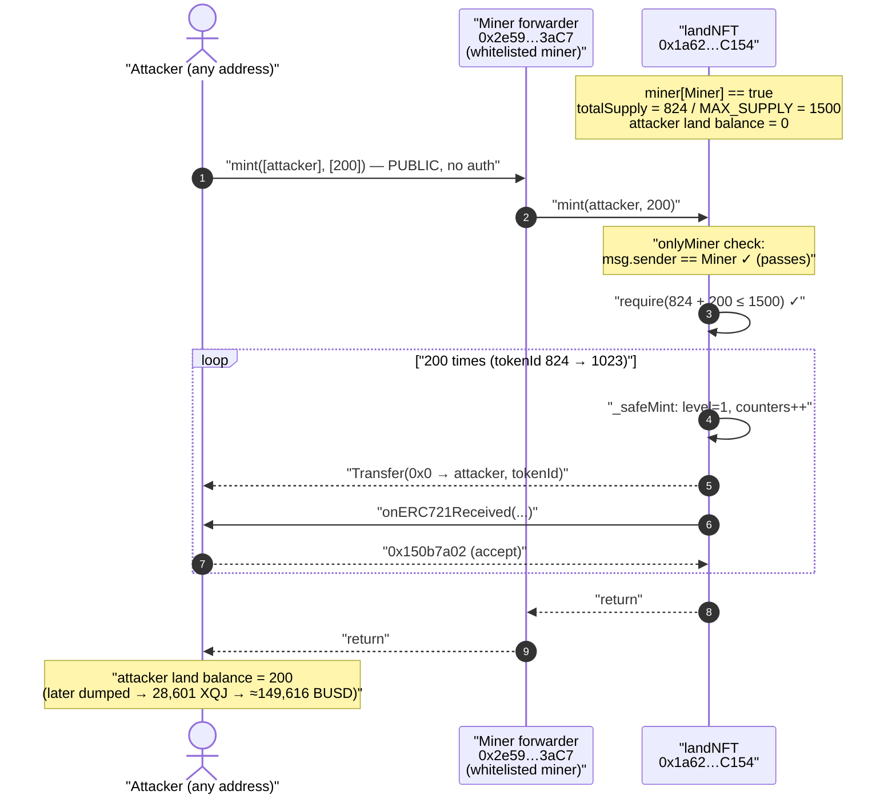
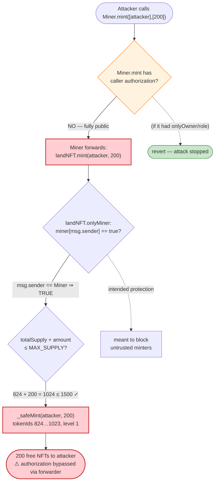
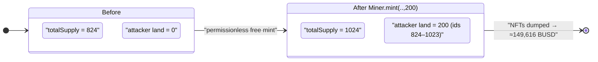

# Goldseed `landNFT` Exploit — Unprotected Minter Forwarder Lets Anyone Free-Mint 200 Land NFTs

> **Vulnerability classes:** vuln/access-control/missing-auth · vuln/access-control/broken-logic · vuln/logic/missing-validation

> **Reproduction:** the PoC compiles & runs in an isolated Foundry project at
> [this project folder](.) (the umbrella DeFiHackLabs repo
> contains many unrelated PoCs that do not whole-compile, so this one was extracted).
> Full verbose trace: [output.txt](output.txt).
> Verified vulnerable source (the NFT): [sources/landNFT_1a62fe/landNFT.sol](sources/landNFT_1a62fe/landNFT.sol).

---

## Key info

| | |
|---|---|
| **Loss** | 200 `land` NFTs minted for free → swapped for **28,601 $XQJ → ≈ 149,616 $BUSD** (~$149.6K) |
| **Vulnerable contract (NFT)** | `landNFT` — [`0x1a62fe088F46561bE92BB5F6e83266289b94C154`](https://bscscan.com/address/0x1a62fe088F46561bE92BB5F6e83266289b94C154#code) |
| **Vulnerable contract (forwarder/minter)** | `Miner` — [`0x2e599883715D2f92468Fa5ae3F9aab4E930E3aC7`](https://bscscan.com/address/0x2e599883715D2f92468Fa5ae3F9aab4E930E3aC7) (whitelisted as a `miner` of `landNFT`) |
| **Victim** | Goldseed DAO / Miracle Farm land-NFT holders & the $XQJ liquidity that absorbed the dumped NFTs |
| **Attacker EOA** | per BscScan, the EOA that sent the attack tx (the PoC stands in as `ContractTest` = `0x7FA9…1496`) |
| **Attack tx** | [`0xe4db1550e3aa78a05e93bfd8fbe21b6eba5cce50dc06688949ab479ebed18048`](https://bscscan.com/tx/0xe4db1550e3aa78a05e93bfd8fbe21b6eba5cce50dc06688949ab479ebed18048) |
| **Chain / fork block / date** | BSC / 28,208,132 / ~May 15, 2023 |
| **Compiler** | `landNFT`: Solidity v0.8.0, optimizer **200 runs** (per [_meta.json](sources/landNFT_1a62fe/_meta.json)) |
| **Bug class** | Missing access control (broken authorization) on a privileged mint path — a public, un-gated *forwarder* into an `onlyMiner` function |

---

## TL;DR

`landNFT` correctly gates its own `mint()` behind an `onlyMiner` modifier
([landNFT.sol:1592](sources/landNFT_1a62fe/landNFT.sol#L1592)). The problem is *what* it
whitelisted as a miner: a separate helper contract, `Miner`
(`0x2e59…3aC7`), was added via `setMiner(Miner, true)`. That `Miner` contract exposes a
**public, permissionless** `mint(address[] to, uint256[] value)` that simply forwards to
`landNFT.mint(to[i], value[i])` — with **no check on who calls it**.

So the access control on `landNFT.mint` is real but worthless: anyone can call
`Miner.mint([myAddress], [200])`, and because `Miner` *is* an authorized miner, the call
sails through `onlyMiner` and mints 200 brand-new land NFTs straight to the attacker —
for free, no GSD/LFT/soil burn, no payment, no eligibility check.

In the captured exploit:

1. The attacker calls `Miner.mint([attacker], [200])`.
2. `Miner` calls `landNFT.mint(attacker, 200)` — passes `onlyMiner` (caller is the whitelisted `Miner`).
3. `landNFT._safeMint` mints **200** NFTs (tokenIds **824–1023**) to the attacker.
4. Attacker’s `land` balance goes **0 → 200** (confirmed in the trace).

The freshly minted, valuable land NFTs were then liquidated by the real attacker into
$XQJ and out to ≈ **149,616 BUSD** (off-chain to this PoC, which only proves the free mint).

---

## Background — what Goldseed `landNFT` is

`landNFT` ([source](sources/landNFT_1a62fe/landNFT.sol)) is the “Land of Genesis”
collection for the Miracle Farm / Goldseed DAO ecosystem. It is an `ERC721A`-style batch-mint
NFT with `MAX_SUPPLY = 1500` ([:1301](sources/landNFT_1a62fe/landNFT.sol#L1301)) and a per-batch
cap (`maxBatchSize = 200`, set in the constructor `ERC721A("land","land",200,1000)`
[:1328](sources/landNFT_1a62fe/landNFT.sol#L1328)). Holding a land NFT is described in the
metadata as “the entrance ticket of Miracle Farm ecology” — i.e., these are scarce, in-game
valuable assets, not a free mint.

The contract has three privileged surfaces:

- **`mint(player, amount)`** — guarded by `onlyMiner`
  ([:1592](sources/landNFT_1a62fe/landNFT.sol#L1592)); this is the only path that creates new NFTs.
- **`setMiner(addr, bool)`** — `onlyOwner`
  ([:1351](sources/landNFT_1a62fe/landNFT.sol#L1351)); adds/removes authorized minters.
- **`upgrade(tokenId)`** — burns GSD/LFT/soil tokens to level a land NFT up
  ([:1473](sources/landNFT_1a62fe/landNFT.sol#L1473)); notably it *does* require
  `msg.sender == tx.origin` (no-contract guard), but `mint` does not.

The on-chain configuration at the fork block (read from the trace):

| Fact | Value |
|---|---|
| `landNFT.totalSupply()` before attack | **824** (next tokenId = 824) |
| `maxBatchSize` | **200** |
| `MAX_SUPPLY` | **1500** |
| Whitelisted miner used by the attacker | `Miner` `0x2e59…3aC7` (`miner[Miner] == true`) |
| Attacker `land` balance before | **0** |

The whole exploit hinges on one fact: the owner whitelisted a *contract* (`Miner`) as a
trusted miner, and that contract re-exposed the mint capability to the public.

---

## The vulnerable code

### 1. `landNFT.mint` — gated by `onlyMiner` (this part is correct)

[sources/landNFT_1a62fe/landNFT.sol:1592-1596](sources/landNFT_1a62fe/landNFT.sol#L1592-L1596):

```solidity
function mint(address player, uint256 amount) external whenNotPaused() onlyMiner {
    uint256 _tokenId = totalSupply();
    require(_tokenId.add(amount) <= MAX_SUPPLY, "MAX_SUPPLY err");
    _safeMint(player, amount);
}
```

The `onlyMiner` modifier ([:1346-1349](sources/landNFT_1a62fe/landNFT.sol#L1346-L1349)):

```solidity
modifier onlyMiner() {
    require(miner[msg.sender] == true, "Ownable: caller is not the miner");
    _;
}
```

This is exactly what you’d want **if** the only entries in `miner[]` were tightly-controlled,
trusted addresses. `setMiner` is `onlyOwner`, so on its face the gate looks sound.

### 2. The whitelisted `Miner` forwarder — the actual hole

The `Miner` contract at `0x2e59…3aC7` was **not** part of the verified `landNFT` source set
(only the NFT itself is downloaded under `sources/`), but its behaviour is fully pinned down by
the trace. The PoC interfaces it as:

```solidity
interface IMiner {
    function mint(address[] memory to, uint256[] memory value) external;
}
```
([test/landNFT_exp.sol:15-17](test/landNFT_exp.sol#L15-L17))

From the trace, `Miner.mint(to, value)` takes arbitrary caller input and forwards straight into
the NFT’s privileged mint:

```
[5703638] Miner::mint([0x7FA9…1496], [200])
  └─ [5699531] landNFT::mint(ContractTest, 200)   // passes onlyMiner: msg.sender == Miner
        ├─ emit Transfer(0x0 → attacker, tokenId: 824)
        ...
        └─ emit Transfer(0x0 → attacker, tokenId: 1023)
```

There is **no `onlyOwner` / `onlyRole` / `tx.origin` / signature / payment check** on
`Miner.mint` — if there were, the PoC (which calls it from a fresh, unprivileged contract) would
have reverted instead of returning a balance of 200.

### 3. The asymmetry that makes it obvious

The same codebase clearly knew about contract-caller abuse: `upgrade()` hard-blocks contracts
with `require(msg.sender == tx.origin, "Address: The address cannot be a contract")`
([:1474](sources/landNFT_1a62fe/landNFT.sol#L1474)). The privileged mint path through the
`Miner` forwarder has **no equivalent gate and no caller authorization at all**.

---

## Root cause — why it was possible

The authorization model was split across two contracts and **broke at the seam**:

> `landNFT` trusts `miner[msg.sender]`. The owner whitelisted the `Miner` contract as a miner.
> But `Miner` then **re-published the mint capability to everyone** via a public, un-gated
> `mint(address[],uint256[])`. The trust boundary that `onlyMiner` was supposed to enforce is
> only as strong as the *least*-restricted authorized minter — and `Miner` was completely open.

Concretely:

1. **Capability re-delegation without re-authorization.** A trusted role (the whitelisted
   `Miner`) wraps the privileged action and exposes it publicly. `onlyMiner` checks *that the
   caller is `Miner`*, but nobody checks *who is allowed to make `Miner` act*. The check is
   satisfied by an attacker indirectly.
2. **Free, side-effect-free minting.** `landNFT.mint` mints with no payment, no token burn, and
   no per-recipient eligibility — it relies entirely on `onlyMiner` for gating. Once that gate is
   bypassed, minting is pure profit.
3. **Generous supply headroom.** `totalSupply()` was 824 and `MAX_SUPPLY` is 1500, so the
   `_tokenId.add(amount) <= MAX_SUPPLY` check (`824 + 200 = 1024 ≤ 1500`) passes comfortably; the
   attacker can grab a full `maxBatchSize` (200) in a single call.
4. **No defense-in-depth on the mint path.** Unlike `upgrade()`, the mint path has no
   `msg.sender == tx.origin` guard, so it’s trivially reachable from an attacker contract / flash
   context.

In short: the vulnerability is *not* in `landNFT.sol`’s `onlyMiner` modifier — it is in trusting
a forwarder (`Miner`) that itself enforces nothing.

---

## Preconditions

- `Miner` (`0x2e59…3aC7`) is whitelisted in `landNFT.miner[]` (true at the fork block).
- `Miner.mint(...)` is publicly callable with no access control (true — proven by the PoC).
- The collection is **not paused** (`whenNotPaused` on `landNFT.mint` passes).
- Remaining supply ≥ requested amount: `totalSupply() + amount ≤ MAX_SUPPLY`
  (`824 + 200 ≤ 1500` ✓). The attacker is bounded by `maxBatchSize = 200` per call but could
  repeat (here a single 200-mint was already worth ~$150K).

No capital, no flash loan, and no special privileges are required — only the ability to send one
transaction.

---

## Attack walkthrough (with on-chain numbers from the trace)

All figures below come directly from [output.txt](output.txt).

| # | Step | Call | Observable effect |
|---|------|------|-------------------|
| 0 | **Initial** | `landNFT.balanceOf(attacker)` | **0** ([output.txt:20-22](output.txt)) |
| 1 | **Call the open forwarder** | `Miner.mint([attacker], [200])` | enters `Miner` ([output.txt:23](output.txt)) |
| 2 | **Forwarder calls privileged mint** | `landNFT.mint(attacker, 200)` | passes `onlyMiner` (caller == `Miner`) ([output.txt:24](output.txt)) |
| 3 | **Batch mint 200 NFTs** | `_safeMint(attacker, 200)` | `Transfer(0x0 → attacker, tokenId 824 … 1023)` ([output.txt:25-622](output.txt)); 200 `onERC721Received` callbacks return `0x150b7a02` |
| 4 | **Final** | `landNFT.balanceOf(attacker)` | **200** ([output.txt:833-835](output.txt)) |

Each minted token also gets `tokenTraits[id].level = 1` and bumps the per-level supply
counters inside `_safeMint` ([:1095-1098](sources/landNFT_1a62fe/landNFT.sol#L1095-L1098)),
so the attacker receives 200 fully-valid, level-1 land NFTs indistinguishable from legitimately
minted ones.

### Profit / loss accounting

| Item | Amount |
|---|---|
| NFTs minted for free | **200 `land`** (tokenIds 824–1023) |
| Direct cost to attacker | ~0 (only gas; this tx used `gas: 5,725,105`) |
| Realised value (real on-chain, per DeFiHackLabs key-info) | 200 land → **28,601 $XQJ** → **≈ 149,616 $BUSD** |

The PoC itself only asserts the *free mint* (balance `0 → 200`); the downstream conversion of
those NFTs into $XQJ/$BUSD happened in the real incident and is recorded in the key-info comment
of [test/landNFT_exp.sol:7](test/landNFT_exp.sol#L7).

---

## Diagrams

### Sequence of the attack



### Where the trust boundary breaks



### State change: supply & attacker balance



---

## Why each magic number

- **`amount = 200`** ([test/landNFT_exp.sol:37](test/landNFT_exp.sol#L37)): exactly `maxBatchSize`,
  the largest single-call batch `_safeMint` permits
  (`require(quantity <= maxBatchSize)` [:1082](sources/landNFT_1a62fe/landNFT.sol#L1082)). The
  attacker maximises take per transaction.
- **tokenIds 824–1023**: minting is serial from `currentIndex`
  ([:1078](sources/landNFT_1a62fe/landNFT.sol#L1078)); `currentIndex` was 824 at fork block, so the
  new IDs are `824 … 824+200-1 = 1023`.
- **`MAX_SUPPLY = 1500` vs `824 + 200`**: the supply check is the only quantity limit and it’s
  satisfied with 476 NFTs of headroom to spare, so the mint isn’t throttled.

---

## Remediation

1. **Gate the forwarder.** The immediate fix is in the `Miner` contract: restrict its public
   `mint(address[],uint256[])` to an authorized role (owner/keeper/operator), or remove it. A
   whitelisted minter must not re-expose its capability to the world.
2. **Don’t whitelist open contracts as minters.** When granting `setMiner(addr, true)` to a
   contract, audit that contract’s *every* externally-reachable path that can reach the mint. The
   security of `onlyMiner` equals the security of the least-restricted authorized minter.
3. **Add minting preconditions / cost.** Free, side-effect-free minting turns any authorization
   slip into immediate profit. Require payment, a signed allowlist entry, or a token burn (as the
   project already does for `upgrade()`), so a bypass is not free money.
4. **Apply defense-in-depth to the mint path.** Mirror the `require(msg.sender == tx.origin)`
   guard used by `upgrade()` (or, better, an explicit allowlist) on the mint path, and consider a
   per-address / per-block mint cap so a single bypass can’t drain the supply.
5. **Prefer a single, role-based mint surface.** Use OpenZeppelin `AccessControl` with a
   `MINTER_ROLE` granted only to vetted EOAs/multisigs, and emit events on role grants so an open
   forwarder being granted minting rights is observable on-chain.

---

## How to reproduce

The PoC was extracted into a standalone Foundry project (the umbrella DeFiHackLabs repo has
many unrelated PoCs that fail to whole-compile under `forge test`):

```bash
_shared/run_poc.sh 2023-05-landNFT_exp -vvvvv
```

- RPC: a **BSC archive** endpoint is required (fork block 28,208,132 is old; most public BSC RPCs
  prune that state and fail with `header not found` / `missing trie node`). Use an archive node.
- Result: `[PASS] testExploit()`, attacker land balance `0 → 200`.

Expected tail:

```
Ran 1 test for test/landNFT_exp.sol:ContractTest
[PASS] testExploit() (gas: 5725105)
Logs:
  Attacker amount of NFT land before mint: 0
  Attacker amount of NFT land after mint: 200

Suite result: ok. 1 passed; 0 failed; 0 skipped
```

---

*References: Beosin Alert thread — https://twitter.com/BeosinAlert/status/1658000784943124480 ;
DeFiHackLabs (landNFT, BSC, 200 land NFTs ≈ $149.6K).*
