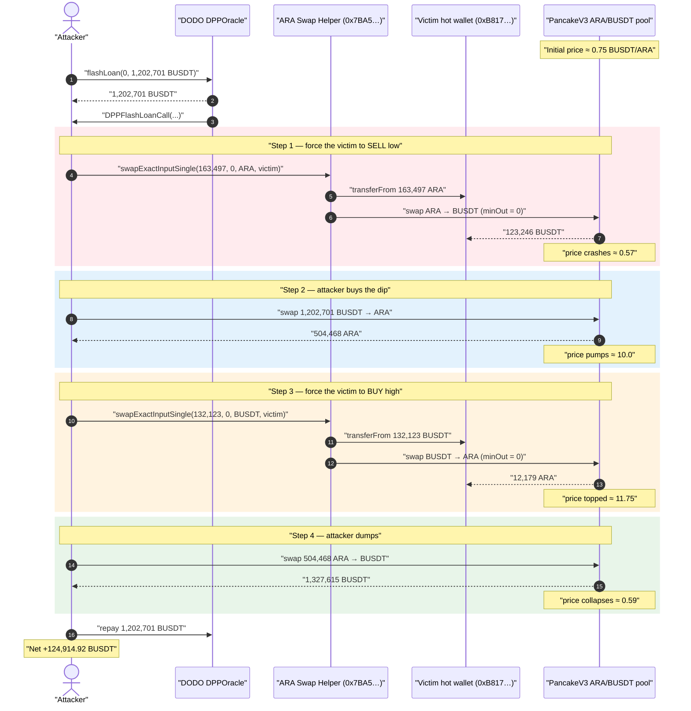
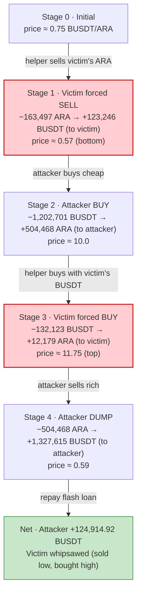
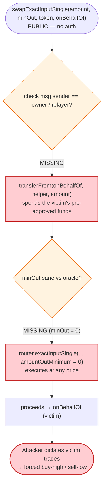

# ARA Exploit — Permissionless "Swap-on-Behalf" Helper Drains a Pre-Approved Address via Pool Price Manipulation

> **Vulnerability classes:** vuln/access-control/missing-auth · vuln/logic/missing-allowance · vuln/oracle/price-manipulation · vuln/defi/slippage

> **Reproduction:** the PoC compiles & runs in an isolated Foundry project at
> [this project folder](.) (the umbrella DeFiHackLabs repo contains many unrelated
> PoCs that don't compile, so this one was extracted).
> Full verbose trace: [output.txt](output.txt). PoC: [test/ARA_exp.sol](test/ARA_exp.sol).

---

## Key info

| | |
|---|---|
| **Loss** | ~**$125K** — attacker netted **124,914.92 BUSDT** (the pre-approved address was whipsawed for ~$407K of token value across the two legs) |
| **Vulnerable contract** | ARA swap helper ("Exploitable Contract") — [`0x7BA5dd9Bb357aFa2231446198c75baC17CEfCda9`](https://bscscan.com/address/0x7BA5dd9Bb357aFa2231446198c75baC17CEfCda9) |
| **Victim** | Pre-approved address (ARA project hot wallet) — [`0xB817Ef68d764F150b8d73A2ad7ce9269674538E0`](https://bscscan.com/address/0xB817Ef68d764F150b8d73A2ad7ce9269674538E0) |
| **Pool manipulated** | PancakeSwap V3 ARA/BUSDT pair (fee 0.01%) — `0x92974438C330d5c6790b4260e358e84513109872` |
| **Flash-loan source** | DODO `DPPOracle` — [`0x9ad32e3054268B849b84a8dBcC7c8f7c52E4e69A`](https://bscscan.com/address/0x9ad32e3054268B849b84a8dBcC7c8f7c52E4e69A) |
| **Tokens** | ARA `0x5542958FA9bD89C96cB86D1A6Cb7a3e644a3d46e`, BUSDT (BSC-USD) `0x55d398326f99059fF775485246999027B3197955` |
| **Attacker EOA** | [`0xf84efa8a9f7e68855cf17eaac9c2f97a9d131366`](https://bscscan.com/address/0xf84efa8a9f7e68855cf17eaac9c2f97a9d131366) |
| **Attacker contract** | [`0x98e241bd3be918e0d927af81b430be00d86b04f9`](https://bscscan.com/address/0x98e241bd3be918e0d927af81b430be00d86b04f9) |
| **Attack tx** | [`0xd87cdecd5320301bf9a985cc17f6944e7e7c1fbb471c80076ef2d031cc3023b2`](https://bscscan.com/tx/0xd87cdecd5320301bf9a985cc17f6944e7e7c1fbb471c80076ef2d031cc3023b2) |
| **Chain / block / date** | BSC / 29,214,010 (fork block in PoC) / ~June 18, 2023 |
| **Compiler** | PoC built with Solc 0.8.34; victim helper unverified, DODO pool `v0.6.9`, BUSDT `v0.5.16` |
| **Bug class** | Missing access control on a swap-on-behalf helper + AMM spot-price manipulation (sandwich of a forced victim trade) |
| **Analysis ref** | Beosin — https://twitter.com/BeosinAlert/status/1670638160550965248 |

---

## TL;DR

The ARA project deployed a "swap helper" contract,
[`0x7BA5dd9Bb357aFa2231446198c75baC17CEfCda9`](https://bscscan.com/address/0x7BA5dd9Bb357aFa2231446198c75baC17CEfCda9),
exposing a function `swapExactInputSingle(uint256 amount, uint256 minOut, address token, address onBehalfOf)`
(selector `0x135b43e9`, see [test/ARA_exp.sol:90-95](test/ARA_exp.sol#L90-L95)). The helper holds an
allowance from a project hot wallet (the **`approvedAddress`**
`0xB817Ef68d764F150b8d73A2ad7ce9269674538E0`) and, when called, **pulls `token` from that approved
address, swaps it on PancakeSwap V3, and sends the proceeds back to the approved address.**

The fatal property: **the function is permissionless.** Anyone can specify *how much* of the approved
address's tokens to swap, *which* direction, and with **`minOut = 0`** (no slippage protection). The
attacker therefore controls a large pool of someone else's capital and can force it to trade at any
price they wish.

The attacker wraps three actions in a single DODO flash-loan transaction:

1. **Force the victim to sell low** — call the helper to swap **163,497 ARA** out of the approved
   address into BUSDT, crashing the ARA spot price to ~**0.57 BUSDT/ARA**.
2. **Buy the dip with borrowed BUSDT** — flash-loan **1,202,701 BUSDT** and buy **504,468 ARA** for
   themselves, pushing the price up to ~**10 BUSDT/ARA** (avg fill ~2.38).
3. **Force the victim to buy high** — call the helper again to swap **132,123 BUSDT** of the approved
   address into ARA, pushing the price to the top (~**11.75 BUSDT/ARA**).
4. **Dump on the inflated pool** — sell the 504,468 ARA back for **1,327,615 BUSDT**, repay the loan,
   and keep the difference.

Net: the attacker walks with **124,914.92 BUSDT** in profit. The victim's hot wallet is left having
sold ARA at the bottom and bought ARA at the top — a forced "buy-high, sell-low" round-trip whose
slippage funded the attacker's sandwich.

---

## Background

There are three external contracts in play; only one is the *vulnerable* one:

- **The ARA swap helper** (`0x7BA5…`, "Exploitable Contract") — the vulnerable contract. It is an
  unverified ARA-project utility that performs a single-hop PancakeSwap V3 swap *on behalf of* a hard-coded
  / pre-approved address. From the trace, one call to selector `0x135b43e9` does exactly this
  ([output.txt:1638-1691](output.txt) for the ARA→BUSDT leg):
  1. `transferFrom(approvedAddress, helper, amount)` — pulls the victim's `token`.
  2. `approve(router, amount)` then `router.exactInputSingle({ tokenIn: token, …, recipient: approvedAddress, amountOutMinimum: 0 })`.
  3. Proceeds land back in `approvedAddress`.

  So the helper is a thin wrapper that says: *"swap this many of the approved address's `token` for the
  other token, no minimum out, send the result back to them."* Anyone may invoke it.

- **The approved address / victim** (`0xB817…`) — a project hot wallet that had granted the helper a
  near-infinite allowance on both ARA and BUSDT (trace shows allowances of `1e54`, e.g.
  [output.txt:1640-1642](output.txt)). It is the source of the funds the attacker abuses, and the bearer
  of the loss.

- **The DODO `DPPOracle`** ([sources/DPPOracle_9ad32e/DPPOracle.sol](sources/DPPOracle_9ad32e/DPPOracle.sol)) —
  just the flash-loan provider. Its `flashLoan()` lends BUSDT and invokes the borrower's
  `DPPFlashLoanCall` callback ([DPPOracle.sol:1193-1213](sources/DPPOracle_9ad32e/DPPOracle.sol#L1193-L1213)).
  It is **not** the vulnerable contract — it is the attacker's capital faucet.

The market venue is a thin PancakeSwap V3 ARA/BUSDT pool (`0x9297…`, 0.01% fee). Because the pool is
shallow relative to the size of the victim's allowance, the attacker can swing the spot price by an
order of magnitude in a single transaction.

---

## The vulnerable code

The helper contract is unverified on-chain, so its exact Solidity is not in `sources/`. Its behavior,
however, is fully and unambiguously determined by the trace. The vulnerable interface, reconstructed
from the PoC's call and the trace, is:

```solidity
// Selector 0x135b43e9 — reconstructed from test/ARA_exp.sol:90-95 and output.txt:1638-1691
function swapExactInputSingle(
    uint256 amountIn,      // attacker chooses how much of the victim's token to spend
    uint256 amountOutMin,  // attacker passes 0  -> NO slippage protection
    address token,         // attacker chooses direction (ARA or BUSDT)
    address onBehalfOf     // the pre-approved victim address whose funds are used
) external {
    // 1. pull the victim's tokens using the standing allowance
    IERC20(token).transferFrom(onBehalfOf, address(this), amountIn);   // <-- no auth on caller
    // 2. swap on PancakeSwap V3 with amountOutMinimum = 0
    IERC20(token).approve(router, amountIn);
    router.exactInputSingle(
        ExactInputSingleParams({
            tokenIn: token,
            tokenOut: otherToken,
            fee: 100,
            recipient: onBehalfOf,        // proceeds returned to the victim
            amountIn: amountIn,
            amountOutMinimum: amountOutMin, // = 0
            sqrtPriceLimitX96: 0
        })
    );
}
```

The way the PoC reaches it ([test/ARA_exp.sol:90-95](test/ARA_exp.sol#L90-L95)):

```solidity
function callSwapContract(uint256 amount, IERC20 token) internal {
    (bool success, ) = exploitableSwapContract.call(
        abi.encodeWithSelector(bytes4(0x135b43e9), amount, 0, address(token), approvedAddress)
    );
    require(success, "Swap not successful");
}
```

Two design flaws compose here:

1. **No access control.** `swapExactInputSingle` does not check `msg.sender`. Any address can move the
   approved address's tokens. (Contrast: a swap-on-behalf helper must only be callable by the owner of
   the funds, or by a trusted relayer with the owner's signed intent.)
2. **No slippage / price protection.** `amountOutMinimum` is taken from the (attacker-supplied) call
   and set to `0`, and there is no internal sanity check against an oracle. The attacker can therefore
   force the victim to swap at a price the attacker has just manufactured.

---

## Root cause

A swap helper that spends a third party's pre-approved balance is, in effect, **a public function that
turns the victim's wallet into a price-taker the attacker controls.** Combined with a shallow AMM pool,
this is a textbook *forced-victim sandwich*:

> The attacker uses the helper to push the pool price to a hostile level using the victim's own money
> (legs they don't profit from directly), and brackets that move with their *own* buy and sell. The
> victim eats the slippage on both forced legs; the attacker harvests it through their round-trip.

Concretely, four facts make it work:

1. **Permissionless `transferFrom` of the victim's tokens** — the attacker chooses amount, direction,
   and timing of the victim's trades.
2. **`amountOutMinimum = 0`** — the victim's forced trades execute at *any* price, including ones the
   attacker just created in the same transaction.
3. **A thin V3 pool** — 163,497 ARA and 1,202,701 BUSDT are each enough to swing the ARA/BUSDT spot
   price by ~20×, so the manipulation is cheap relative to the extractable value.
4. **Flash-loanable capital** — the attacker's own buy/sell legs need ~1.2M BUSDT for a few hundred
   milliseconds; DODO supplies it for free, so the attack needs **zero attacker capital**.

The single sentence root cause: **a public "swap on behalf of X" function with no caller
authorization and no slippage floor lets anyone trade X's pre-approved funds at an attacker-chosen
price.**

---

## Preconditions

- The victim (`approvedAddress` `0xB817…`) has granted the helper a large standing allowance on **both**
  ARA and BUSDT, and holds a balance in both (trace allowances ≈ `1e54`,
  [output.txt:1640-1642](output.txt), [1731-1734](output.txt)).
- The helper's `swapExactInputSingle` is callable by anyone (no `onlyOwner`/relayer check).
- A PancakeSwap V3 ARA/BUSDT pool exists and is shallow enough to manipulate (`0x9297…`, fee 0.01%).
- Access to flash-loan liquidity in BUSDT (DODO `DPPOracle`). Borrowed amount: **1,202,701 BUSDT**,
  fully repaid in-transaction. **No attacker capital required.**

---

## Attack walkthrough (with on-chain numbers from the trace)

The PoC forks BSC at block 29,214,010 ([test/ARA_exp.sol:43](test/ARA_exp.sol#L43)) and runs the whole
exploit inside the DODO flash-loan callback `DPPFlashLoanCall`
([test/ARA_exp.sol:68-88](test/ARA_exp.sol#L68-L88)). In the V3 pool, `token0 = ARA`, `token1 = BUSDT`,
so the quoted price below is **BUSDT per ARA**, derived from each `Swap` event's `sqrtPriceX96`.

| # | Action (who pays) | Trace | ARA flow | BUSDT flow | Pool price after (BUSDT/ARA) |
|---|---|---|---:|---:|---:|
| 0 | **Flash-loan** 1,202,701 BUSDT from DODO to attacker | [1630-1636](output.txt) | — | +1,202,701 to attacker | (initial ≈ 0.75) |
| 1 | **Force victim SELL** — helper swaps 163,497 ARA (victim's) → 123,246.44 BUSDT, sent to victim | [1638-1691](output.txt) | −163,497 victim ARA | +123,246.44 victim BUSDT | **≈ 0.57** (crashed) |
| 2 | **Attacker BUYS the dip** — swap 1,202,701 BUSDT → 504,468.16 ARA to attacker | [1692-1724](output.txt) | +504,468.16 attacker ARA | −1,202,701 attacker BUSDT | **≈ 10.01** (pumped) |
| 3 | **Force victim BUY** — helper swaps 132,123 BUSDT (victim's) → 12,179.79 ARA, sent to victim | [1730-1782](output.txt) | +12,179.79 victim ARA | −132,123 victim BUSDT | **≈ 11.75** (top) |
| 4 | **Attacker DUMPS** — swap 504,468.16 ARA → 1,327,615.92 BUSDT to attacker | [1785-1817](output.txt) | −504,468.16 attacker ARA | +1,327,615.92 attacker BUSDT | **≈ 0.59** (collapsed) |
| 5 | **Repay** 1,202,701 BUSDT to DODO | [1823-1828](output.txt) | — | −1,202,701 attacker BUSDT | — |

The attacker bought 504,468 ARA at an effective ~2.38 BUSDT/ARA and sold the same ARA at ~2.63
BUSDT/ARA. Both legs sat *inside* the victim's forced trades: leg 1 dropped the price so the attacker's
buy filled cheap, and leg 3 lifted the price so the attacker's dump filled rich. The victim's two
forced trades (sell at the bottom, buy at the top) supplied exactly the slippage the attacker pocketed.

Verbatim PoC log tail ([output.txt:1563-1567](output.txt)):

```
Attacker BUSDT balance before hack: 0.000000000000000000
Step 3. ARA amount out after first V3 swap: 504468.158749078470704724
Step 5. BUSDT amount out after second V3 swap: 1327615.916109788911433948
Attacker BUSDT balance after hack: 124914.916109788911433948
```

---

## Profit / loss accounting

**Attacker (only their own legs 2 and 4 move their balance):**

| Direction | Amount (BUSDT) | Trace |
|---|---:|---|
| Received from flash loan | +1,202,701.00 | [1630-1636](output.txt) |
| Spent buying ARA (leg 2) | −1,202,701.00 | [1707-1708](output.txt) |
| Received selling ARA (leg 4) | +1,327,615.92 | [1789-1790](output.txt) |
| Repaid flash loan | −1,202,701.00 | [1823-1824](output.txt) |
| **Net profit** | **+124,914.92** | final balance [1841](output.txt) |

The final on-chain balance read in the trace is `124914916109788911433948` wei = **124,914.92 BUSDT**,
matching to the wei.

**Victim (`approvedAddress` `0xB817…`), the bearer of the loss:**

| Leg | Gave | Got | Implied price |
|---|---|---|---|
| Forced sell (leg 1) | 163,497 ARA | 123,246.44 BUSDT | 0.754 BUSDT/ARA (sold at the bottom) |
| Forced buy (leg 3) | 132,123 BUSDT | 12,179.79 ARA | 10.85 BUSDT/ARA (bought at the top) |
| **Net** | **−151,317 ARA, −8,876.56 BUSDT** | | ≈ **$407K** of token value lost when ARA is marked near the attacker's realized ~2.63 BUSDT/ARA |

The victim is left short ~151k ARA and ~8.9k BUSDT. Valuing the lost ARA at the price the attacker
actually realized (~2.63 BUSDT/ARA) puts the victim's economic damage near **$407K**; the attacker's
clean take is **$124.9K** (the rest of the victim's loss is bled into pool fees / impermanent value left
in the pool). The widely reported figure for this incident is ~$125K (the attacker's net).

---

## Diagrams

### Sequence of the attack



### Price trajectory and who pays each leg



### The flaw inside the helper



---

## Why each magic number

- **163,497 ARA (forced sell, leg 1):** large enough to crash the shallow pool's ARA price to ~0.57
  before the attacker's own buy, so leg 2 fills cheaply. Paid entirely by the victim's ARA balance.
- **1,202,701 BUSDT (attacker buy, leg 2):** the flash-loan size; sized to pump the price ~17× and
  acquire 504,468 ARA at an average ~2.38 BUSDT/ARA. Fully repaid at the end.
- **132,123 BUSDT (forced buy, leg 3):** pushes the price from ~10 to the ~11.75 top using the victim's
  BUSDT, marking the inventory the attacker is about to dump even higher so leg 4 starts from the peak.
- **504,468 ARA (attacker dump, leg 4):** exactly the ARA bought in leg 2, sold back for 1,327,615 BUSDT
  (~2.63 BUSDT/ARA) — a higher effective price than the ~2.38 paid, the spread being the profit.

---

## Remediation

1. **Add access control to the helper.** `swapExactInputSingle` must verify `msg.sender` is the owner
   of the funds (`onBehalfOf == msg.sender`) or a trusted relayer acting on a signed, nonce-bound intent
   from the fund owner. A function that spends a third party's standing allowance must never be openly
   callable.
2. **Never grant a standing allowance to a permissionless mover.** The victim's hot wallet should not
   approve a contract that anyone can drive. Use per-transaction approvals, a pull pattern with explicit
   per-call authorization, or `permit`-style signed approvals scoped to a single swap.
3. **Enforce slippage / price bounds.** Reject `amountOutMinimum = 0`. Require a caller-supplied minimum
   that is itself sanity-checked against a manipulation-resistant oracle (e.g. a TWAP), so a swap cannot
   execute at a price freshly created in the same transaction.
4. **Use a manipulation-resistant reference price.** Any on-behalf swap should compare the V3 *spot*
   price against a TWAP and revert if they diverge beyond a small tolerance, neutralizing single-block
   sandwiches.
5. **Cap per-call size relative to pool depth.** Reject swaps whose size would move the target pool's
   price by more than a small percentage — the forced legs here moved price ~20×, which should never be
   allowed for a third-party-funded trade.

---

## How to reproduce

The PoC was extracted into a standalone Foundry project (the umbrella DeFiHackLabs repo has several
unrelated PoCs that fail `forge test`'s whole-project build):

```bash
_shared/run_poc.sh 2023-06-ARA_exp --mt testExploit -vvvvv
```

- RPC: a **BSC archive** endpoint is required (fork block 29,214,010); the project's `foundry.toml`
  is configured with a working archive endpoint. Pruned public RPCs fail with `header not found` /
  `missing trie node`.
- Result: `[PASS] testExploit()` with `Attacker BUSDT balance after hack: 124914.91…`.

Expected tail ([output.txt:1561-1567](output.txt)):

```
Ran 1 test for test/ARA_exp.sol:ARATest
[PASS] testExploit() (gas: 2421835)
  Attacker BUSDT balance before hack: 0.000000000000000000
  Step 3. ARA amount out after first V3 swap: 504468.158749078470704724
  Step 5. BUSDT amount out after second V3 swap: 1327615.916109788911433948
  Attacker BUSDT balance after hack: 124914.916109788911433948
```

---

*Reference: Beosin Alert — https://twitter.com/BeosinAlert/status/1670638160550965248 (ARA, BSC, ~$125K). The DODO `DPPOracle` is only the flash-loan source; the vulnerable contract is the ARA swap helper `0x7BA5dd9Bb357aFa2231446198c75baC17CEfCda9`.*
