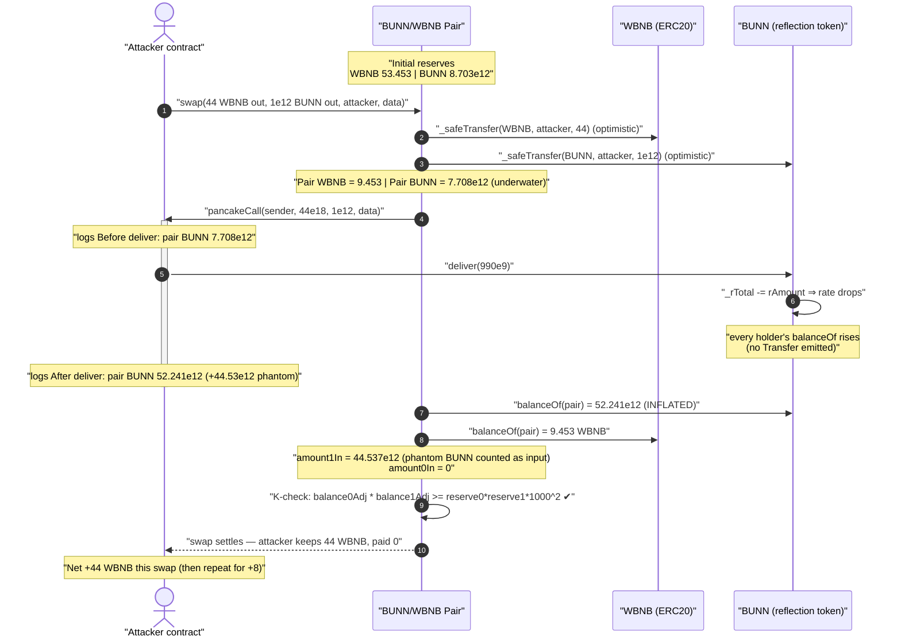
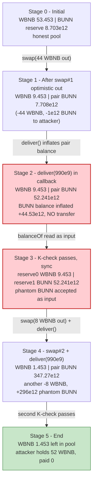
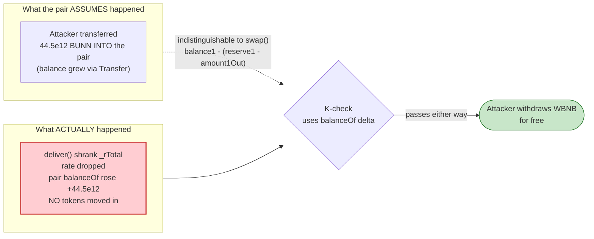

# Bunny Protocol (BUNN) Exploit — Reflection `deliver()` Inflates Pair Balance, Spoofing the AMM K-Check

> One-liner: BUNN is an RFI/reflection token; its permissionless `deliver()` shrinks `_rTotal`, which silently **inflates every holder's `balanceOf` — including the PancakeSwap pair's**. Called inside a flash-swap's `pancakeCall`, the inflated pair balance is counted by PancakePair as the attacker's "input," so the constant-product `K` check passes and the attacker walks off with WBNB having paid nothing.

> **Reproduction:** the PoC compiles & runs in an isolated Foundry project at
> [this project folder](.) (the umbrella DeFiHackLabs repo contains many unrelated PoCs that
> do not whole-compile, so this one was extracted). Full verbose trace:
> [output.txt](output.txt). Verified vulnerable source:
> [BunnyProtocol.sol](sources/BunnyProtocol_c54AAe/BunnyProtocol.sol),
> [PancakePair.sol](sources/PancakePair_b4B843/PancakePair.sol).

---

## Key info

| | |
|---|---|
| **Loss** | **52 WBNB** drained from the BUNN/WBNB PancakeSwap pair (≈ $12–13K at the June-2023 BNB price) |
| **Vulnerable contract** | `BunnyProtocol` (BUNN) — [`0xc54AAecF5fA1b6c007d019a9d14dFb4a77CC3039`](https://bscscan.com/address/0xc54AAecF5fA1b6c007d019a9d14dFb4a77CC3039#code) |
| **Victim pool** | BUNN/WBNB PancakeSwap V2 pair — [`0xb4B84375Ae9bb94d19F416D3db553827Be349520`](https://bscscan.com/address/0xb4B84375Ae9bb94d19F416D3db553827Be349520) |
| **Quote token drained** | WBNB — [`0xbb4CdB9CBd36B01bD1cBaEBF2De08d9173bc095c`](https://bscscan.com/address/0xbb4CdB9CBd36B01bD1cBaEBF2De08d9173bc095c) |
| **Attack tx** | [`0x24a68d2a4bbb02f398d3601acfd87b09f543d935fc24862c314aaf64c295acdb`](https://bscscan.com/tx/0x24a68d2a4bbb02f398d3601acfd87b09f543d935fc24862c314aaf64c295acdb) |
| **Chain / block / date** | BSC / 29,304,627 / June 22, 2023 |
| **Compiler** | BUNN: Solidity v0.6.12, optimizer off · Pair: v0.5.16 (PancakeSwap V2) |
| **Bug class** | Reflection-token (`balanceOf` not backed by real transfers) breaking the AMM constant-product invariant; spoofed swap input via deflationary supply change |
| **Analysis credit** | [@DecurityHQ](https://twitter.com/DecurityHQ/status/1671803688996806656) |

---

## TL;DR

`BunnyProtocol` is a fork of the **RFI / SafeMoon "reflection"** token design. Holder balances are
stored not as raw amounts but as *reflection units* `_rOwned`, and the visible balance is computed
on the fly:

```
balanceOf(account) = _rOwned[account] / rate ,  where  rate = _rTotal / _tTotal
```

The function `deliver(tAmount)` ([BunnyProtocol.sol:550-557](sources/BunnyProtocol_c54AAe/BunnyProtocol.sol#L550-L557))
lets **anyone** "reflect" (donate) their own tokens to all other holders: it subtracts the caller's
`_rOwned` and subtracts the same from the global `_rTotal`. Because `rate = _rTotal / _tTotal`,
shrinking `_rTotal` **lowers the rate**, which **raises `balanceOf` for every other holder
proportionally** — with **no `Transfer` event and no token actually moving**.

The PancakeSwap pair is just another holder. So after `deliver()`, the pair's BUNN `balanceOf`
**spontaneously grows**. PancakePair's `swap()` measures how much the caller "paid in" by reading
`balanceOf(pair)` *after* the user callback and comparing to the pre-swap reserve
([PancakePair.sol:468-477](sources/PancakePair_b4B843/PancakePair.sol#L468-L477)). The reflection
inflation is therefore mis-counted as **the attacker's BUNN deposit**, satisfying the
`balance0Adjusted · balance1Adjusted ≥ reserve0 · reserve1 · 1000²` (constant-product `K`) check —
even though the attacker deposited **zero** BUNN and **zero** WBNB.

The attacker exploits this with a single transaction containing two flash-swaps:

1. `pair.swap(44 WBNB out, 1e12 BUNN out, attacker, data)` — pulls 44 WBNB + a sliver of BUNN out.
2. Inside the mandatory `pancakeCall` callback, the attacker calls `BUNN.deliver(990e9)`, inflating
   the pair's BUNN balance by ≈ the WBNB they are removing.
3. `swap()` resumes, reads the inflated pair BUNN balance as "input," `K`-check passes, swap settles.
4. A second, smaller swap (8 WBNB out) repeats the trick.

Net: **52 WBNB out, 0 in.** The pair is left with 1.45 WBNB.

---

## Background — RFI reflection accounting

In an RFI token, total supply has two parallel representations:

- `_tTotal` — the "true" token total supply (here `10000000000000`, with **0 decimals**).
- `_rTotal` — a huge reflection-space total, initialized to `MAX - (MAX % _tTotal)` so the rate is
  an exact integer ([BunnyProtocol.sol:471-472](sources/BunnyProtocol_c54AAe/BunnyProtocol.sol#L471-L472)).

A holder's `_rOwned` is denominated in reflection space. The conversion is
([BunnyProtocol.sol:570-574](sources/BunnyProtocol_c54AAe/BunnyProtocol.sol#L570-L574),
[707-710](sources/BunnyProtocol_c54AAe/BunnyProtocol.sol#L707-L710)):

```solidity
function tokenFromReflection(uint256 rAmount) public view returns (uint256) {
    uint256 currentRate = _getRate();      // _rTotal / _tTotal
    return rAmount.div(currentRate);
}
function _getRate() private view returns (uint256) {
    (uint256 rSupply, uint256 tSupply) = _getCurrentSupply();
    return rSupply.div(tSupply);
}
```

`balanceOf` for a **non-excluded** account returns `tokenFromReflection(_rOwned[account])`
([BunnyProtocol.sol:503-506](sources/BunnyProtocol_c54AAe/BunnyProtocol.sol#L503-L506)). The pair is
non-excluded, so its visible balance tracks the live rate.

The "reflection" mechanic is intentional: when someone pays a fee or calls `deliver`, `_rTotal`
shrinks, the rate drops, and everyone's balance ticks up — that is how holders "earn" reflections.
The fatal property for an AMM integration is that **this balance change happens with no `Transfer`
and is driven by a function any address can call at will.**

At the fork block the live tax/burn fees were both `0` (`_taxFee = 0`, `_burnFee = 0`,
[BunnyProtocol.sol:479-480](sources/BunnyProtocol_c54AAe/BunnyProtocol.sol#L479-L480)), so `deliver`'s
entire `tAmount` becomes pure reflection (no burn split), maximizing the inflation per BUNN delivered.

---

## The vulnerable code

### 1. `deliver()` — permissionless supply-side reflection (BUNN)

```solidity
// BunnyProtocol.sol:550
function deliver(uint256 tAmount) public {
    address sender = _msgSender();
    require(!_isExcluded[sender], "Excluded addresses cannot call this function");
    (uint256 rAmount,,,,,) = _getValues(tAmount);
    _rOwned[sender] = _rOwned[sender].sub(rAmount);   // caller pays from its own reflection units
    _rTotal = _rTotal.sub(rAmount);                   // ⚠️ global reflection supply shrinks
    _tFeeTotal = _tFeeTotal.add(tAmount);
}
```

[BunnyProtocol.sol:550-557](sources/BunnyProtocol_c54AAe/BunnyProtocol.sol#L550-L557). No access
control. The caller burns `rAmount` of its own reflection units **and** the same amount from
`_rTotal`. Because the rate is `_rTotal / _tTotal` and `_tTotal` is unchanged, the rate drops and
**every other holder's `balanceOf` rises** — including the pair's.

### 2. PancakePair.swap() — infers "amount in" from post-callback `balanceOf` (Pair)

```solidity
// PancakePair.sol:454
function swap(uint amount0Out, uint amount1Out, address to, bytes calldata data) external lock {
    ...
    if (amount0Out > 0) _safeTransfer(_token0, to, amount0Out);  // optimistic WBNB out
    if (amount1Out > 0) _safeTransfer(_token1, to, amount1Out);  // optimistic BUNN out
    if (data.length > 0) IPancakeCallee(to).pancakeCall(msg.sender, amount0Out, amount1Out, data);
    balance0 = IERC20(_token0).balanceOf(address(this));   // WBNB balance (real)
    balance1 = IERC20(_token1).balanceOf(address(this));   // ⚠️ BUNN balance — INFLATED by deliver()
    }
    uint amount0In = balance0 > _reserve0 - amount0Out ? balance0 - (_reserve0 - amount0Out) : 0;
    uint amount1In = balance1 > _reserve1 - amount1Out ? balance1 - (_reserve1 - amount1Out) : 0;  // ⚠️ "fake" BUNN input
    require(amount0In > 0 || amount1In > 0, 'Pancake: INSUFFICIENT_INPUT_AMOUNT');
    {
    uint balance0Adjusted = balance0.mul(1000).sub(amount0In.mul(2));
    uint balance1Adjusted = balance1.mul(1000).sub(amount1In.mul(2));
    require(balance0Adjusted.mul(balance1Adjusted) >= uint(_reserve0).mul(_reserve1).mul(1000**2), 'Pancake: K'); // ⚠️ satisfied by phantom BUNN
    }
    _update(balance0, balance1, _reserve0, _reserve1);   // reserves now follow the inflated balances
    ...
}
```

[PancakePair.sol:454-482](sources/PancakePair_b4B843/PancakePair.sol#L454-L482). The pair has **no
way to tell** that the BUNN balance grew via reflection rather than via a real deposit. `amount1In`
is computed purely from the balance delta, so the reflection inflation is laundered into a valid
"input" that pays for the WBNB the attacker pulled out.

---

## Root cause — why it was possible

A Uniswap-V2/PancakeSwap pair enforces `x·y ≥ k` **only inside `swap()`**, and it determines how much
a caller paid in by **diffing token `balanceOf` before vs. after the user callback**. This is safe
only under the assumption that *a token's `balanceOf` changes solely through `transfer` /
`transferFrom` that the pair (or someone) initiated*.

`BunnyProtocol` violates that assumption fundamentally:

> `deliver()` lets **any** address change **every other holder's `balanceOf`** — including the
> pair's — **without a transfer**, just by shrinking `_rTotal`. The pair then reads its own
> spontaneously-grown BUNN balance and credits it to the swapping attacker as input.

The composing flaws:

1. **Reflection balances are not transfer-backed.** `balanceOf(pair)` is a function of the global
   rate, not of tokens the pair actually received. An AMM's optimistic-transfer/K-check accounting
   is incompatible with any token whose balance can move without a transfer.
2. **`deliver()` is permissionless and unconstrained.** Anyone can call it for any `tAmount` up to
   their reflection holdings, at any moment — in particular, *inside a flash-swap callback*, exactly
   when the pair is about to measure its balance.
3. **The attacker controls the timing via `pancakeCall`.** The flash-swap callback hands execution
   to the attacker **after** the optimistic transfer-out but **before** the balance read, the precise
   window where a `deliver()` will be picked up as "input."
4. **Fees were zero, so 100% of `deliver` becomes reflection inflation.** With `_taxFee = _burnFee = 0`,
   the entire delivered amount feeds the rate drop, giving the attacker maximum balance inflation for
   the pair per unit delivered.

This is the canonical "reflection token + AMM" hazard: the same class that broke many SafeMoon
forks. The pair can be drained because its accounting trusts a `balanceOf` that the token deliberately
makes mutable-without-transfer.

---

## Preconditions

- A live PancakeSwap V2 BUNN/WBNB pair holding WBNB (the prize) — here 53.453 WBNB.
- The attacker (or its contract) must hold enough BUNN reflection units to call `deliver()` with a
  `tAmount` whose reflection inflation of the pair's balance covers the WBNB being pulled. In the live
  attack the attacker acquired BUNN beforehand; the PoC reproduces the same end-state by flash-swapping
  out a sliver of BUNN and calling `deliver(990e9)` from the attacker contract.
- `deliver()` requires the caller be non-excluded (`!_isExcluded[sender]`,
  [BunnyProtocol.sol:552](sources/BunnyProtocol_c54AAe/BunnyProtocol.sol#L552)) — trivially satisfied
  for a fresh attacker address.
- No flash loan is strictly required: the attacker funds itself with BUNN and uses the pair's own
  flash-swap callback to time the `deliver()`. WBNB is *received*, never paid.

---

## Attack walkthrough (on-chain numbers from the trace)

Token ordering of the pair (confirmed from the `Swap` and `Sync` events in [output.txt](output.txt)):
**`token0 = WBNB`, `token1 = BUNN`**, so `reserve0 = WBNB`, `reserve1 = BUNN`. BUNN has **0 decimals**.

The attacker executes two identical flash-swaps from `testExploit()`
([test/BUNN_exp.sol:32-37](test/BUNN_exp.sol#L32-L37)); each runs `deliver(990e9)` inside
`pancakeCall` ([test/BUNN_exp.sol:39-43](test/BUNN_exp.sol#L39-L43)).

| # | Step | Pair WBNB (reserve0) | Pair BUNN (reserve1 / balance) | Effect |
|---|------|---------------------:|-------------------------------:|--------|
| 0 | **Initial reserves** | 53.453 WBNB | 8,703,352,552,995 BUNN | Honest pool. |
| 1 | `swap(44 WBNB out, 1e12 BUNN out, attacker)` — optimistic transfers fire | 9.453 WBNB *(53.453 − 44)* | 7,708,350,182,684 *(pair BUNN after the 1e12 sent out, logged "Before deliver")* | Attacker now holds 44 WBNB + 1e12 BUNN; pair temporarily underwater. |
| 2 | inside `pancakeCall`: **`BUNN.deliver(990,000,000,000)`** | 9.453 WBNB | **52,240,860,222,579** *(logged "After deliver")* | ⚠️ Pair BUNN balance **inflated by +44,532,510,039,895** with no transfer. |
| 3 | `swap()` resumes: `amount1In = balance1 − (reserve1 − amount1Out) = 44,537,507,669,584`; `K`-check passes | 9.453 WBNB | 52,240,860,222,579 | Phantom BUNN counted as the attacker's input. `Sync(reserve0=9.453e18, reserve1=5.224e13)`. |
| 4 | `swap(8 WBNB out, 1e12 BUNN out, attacker)` — optimistic transfers | 1.453 WBNB *(9.453 − 8)* | 51,240,860,222,579 *("Before deliver" #2)* | Second pull. |
| 5 | inside `pancakeCall`: **`BUNN.deliver(990,000,000,000)`** | 1.453 WBNB | **347,268,423,609,734** *("After deliver" #2)* | ⚠️ Pair BUNN inflated by **+296,027,563,387,155**. |
| 6 | `swap()` resumes: `amount1In = 296,027,563,387,155` (== inflation, exact); `K`-check passes | 1.453 WBNB | 347,268,423,609,734 | `Sync(reserve0=1.453e18, reserve1=3.472e14)`. |
| 7 | **End** | 1.453 WBNB | 347,268,423,609,734 | Attacker WBNB balance = **52.0 WBNB**. |

Two facts nail the mechanism:

- In **swap #2** the reflection inflation `296,027,563,387,155` equals `amount1In`
  in the `Swap` event **to the wei** — the phantom BUNN is exactly what the K-check accepted as the
  attacker's deposit.
- In both swaps `amount0In = 0` in the `Swap` event — the attacker paid **no WBNB** for the WBNB it
  withdrew.

### Why each magic number

- **`amount0Out = 44 ether` then `8 ether`:** the two WBNB chunks the attacker pulls out (total 52,
  draining all but 1.453 of the 53.453 WBNB present). Splitting into two swaps keeps each
  `deliver()`-inflation comfortably above the required `amount1In` so the K-check clears with margin.
- **`amount1Out = 1e12 BUNN` (per swap):** a small BUNN amount pulled alongside the WBNB. It is
  incidental — it ensures `balance1 < reserve1 − amount1Out` is false after the inflation so
  `amount1In > 0`, satisfying `INSUFFICIENT_INPUT_AMOUNT`.
- **`deliver(990,000,000,000)` (990e9 BUNN):** sized so the reflection-rate drop inflates the pair's
  BUNN balance by tens of trillions of units — far more than the `amount1In` the K-check needs to
  cover the WBNB removed. (Recall `_tTotal = 10e12`, so 990e9 is ~9.9% of supply each call.)

---

## Profit / loss accounting

| Direction | WBNB |
|---|---:|
| WBNB pulled out — swap #1 | 44.000 |
| WBNB pulled out — swap #2 | 8.000 |
| **Total WBNB received by attacker** | **52.000** |
| WBNB paid in | 0.000 |
| BUNN paid in (net) | 0 (only phantom reflection inflation) |
| **Net profit** | **52.000 WBNB** |

Trace confirmation ([output.txt:97-99](output.txt)):
`WBNB.balanceOf(attacker) = 52,000,000,000,000,000,000` → `[End] Attacker WBNB balance after exploit: 52.0`.
The pool started with 53.453 WBNB and was left with 1.453 WBNB — the attacker took essentially the
entire WBNB-side liquidity that real LPs had provided.

---

## Diagrams

### Sequence of one exploit swap



### Pool / accounting state evolution



### Why the K-check is fooled — reflection vs. real transfer



---

## Remediation

1. **Never pair a reflection / rebasing / fee-on-transfer token whose `balanceOf` can change without
   a transfer with a standard Uniswap-V2 AMM.** The V2 swap accounting (optimistic transfer +
   post-callback `balanceOf` diff + K-check) is structurally incompatible with such tokens; this is a
   *token-design* incompatibility, not a pair bug.
2. **Remove or gate `deliver()`.** A function that lets any caller mutate every other holder's balance
   (via `_rTotal`) is the core enabler. If a reflection mechanic is required, it must not be reachable
   permissionlessly during a third party's transaction — at minimum, exclude AMM pairs from receiving
   reflections so `balanceOf(pair)` is transfer-backed (`excludeAccount(pair)` so the pair uses the
   non-reflection `_tOwned` path, [BunnyProtocol.sol:503-506](sources/BunnyProtocol_c54AAe/BunnyProtocol.sol#L503-L506)).
3. **For integrators / LPs:** before providing liquidity, verify the token's `balanceOf` is a pure
   function of received transfers. Grep for `_rTotal`, `_rOwned`, `tokenFromReflection`, `deliver`,
   `reflect`, `rebase`, or any supply variable that mutates outside `_transfer`. Presence of these is a
   hard red flag for AMM listing.
4. **If a reflection token must be tradable, use a custodial wrapper** (e.g. an ERC-4626-style vault or
   a 1:1 wrapper that snapshots balances on deposit/withdraw) and pair the *wrapper* — whose
   `balanceOf` is transfer-backed — rather than the raw reflection token.

---

## How to reproduce

The PoC was extracted into a standalone Foundry project (the umbrella DeFiHackLabs repo has many
unrelated PoCs that fail to whole-compile under `forge test`):

```bash
_shared/run_poc.sh 2023-06-BUNN_exp -vvvvv
```

- Fork: BSC at block **29,304,627** (`createSelectFork("bsc", 29_304_627)`,
  [test/BUNN_exp.sol:28-30](test/BUNN_exp.sol#L28-L30)). A **BSC archive** endpoint is required —
  most public BSC RPCs prune state this old and fail with `header not found` / `missing trie node`.
- Result: `[PASS] testExploit()` with the attacker ending on **52 WBNB**.

Expected tail ([output.txt:97-104](output.txt)):

```
  Before deliver,pair bunn balance: 7708350182684
  After deliver,pair bunn balance: 52240860222579
  Before deliver,pair bunn balance: 51240860222579
  After deliver,pair bunn balance: 347268423609734
  [End] Attacker WBNB balance after exploit: 52.000000000000000000
Suite result: ok. 1 passed; 0 failed; 0 skipped; finished in 8.25s
```

---

*Reference: Decurity analysis — https://twitter.com/DecurityHQ/status/1671803688996806656 ·
DeFiHackLabs (BUNN / Bunny Protocol, BSC, June 22 2023).*
