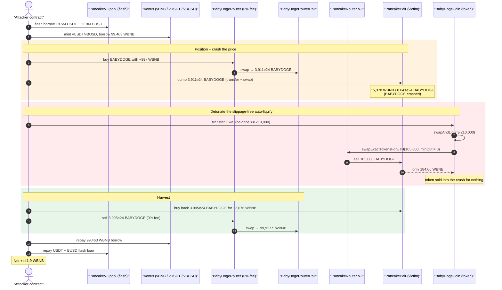
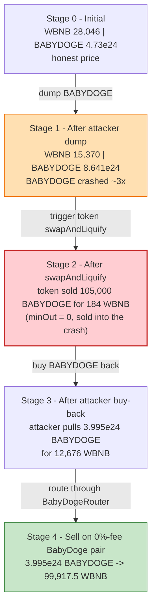
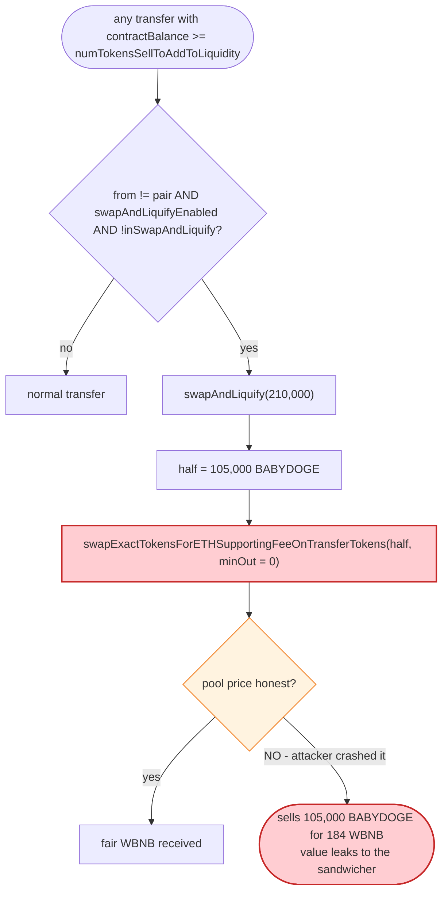

# BabyDogeCoin Exploit — Sandwiching the Token's Slippage-Free `swapAndLiquify`

> **Vulnerability classes:** vuln/defi/slippage · vuln/defi/sandwich-attack · vuln/oracle/price-manipulation

> **Reproduction:** the PoC compiles & runs in an isolated Foundry project at
> [this project folder](.) (the umbrella DeFiHackLabs repo contains many
> unrelated PoCs that do not compile together, so this one was extracted).
> Full verbose trace: [output.txt](output.txt).
> Verified vulnerable source: [CoinToken.sol](sources/CoinToken_c74867/CoinToken.sol).

---

## Key info

| | |
|---|---|
| **Loss** | ~$100K — net **441.9 WBNB** retained by the attacker after repaying all loans |
| **Vulnerable contract** | `BabyDogeCoin` (a `CoinToken` reflection/auto-liquify token) — [`0xc748673057861a797275CD8A068AbB95A902e8de`](https://bscscan.com/address/0xc748673057861a797275CD8A068AbB95A902e8de#code) |
| **Victim pool** | PancakeSwap V2 BabyDoge/WBNB pair — `0xc736cA3d9b1E90Af4230BD8F9626528B3D4e0Ee0` |
| **Attacker EOA** | [`0xee6764ac7aa45ed52482e4320906fd75615ba1d1`](https://bscscan.com/address/0xee6764ac7aa45ed52482e4320906fd75615ba1d1) |
| **Attacker contract** | `0x9a6b926281b0c7bc4f775e81f42b13eda9c1c98e` |
| **Attack tx** | [`0xbaf3e4841614eca5480c63662b41cd058ee5c85dc69198b29e7ab63b84bc866c`](https://bscscan.com/tx/0xbaf3e4841614eca5480c63662b41cd058ee5c85dc69198b29e7ab63b84bc866c) |
| **Chain / block / date** | BSC / 29,295,010 / June 21, 2023 |
| **Compiler** | `CoinToken` Solidity v0.6.12; `BabyDogeRouter` v0.6.6 |
| **Bug class** | Slippage-free internal AMM swap (`amountOutMin = 0`) sandwiched by a flash-funded price manipulation |

---

## TL;DR

`BabyDogeCoin` is an old-style "reflection + auto-liquify" token. On large transfers it accumulates a
liquidity fee in its own balance, and once that balance reaches
`numTokensSellToAddToLiquidity` (210,000 BABYDOGE) it runs `swapAndLiquify()`
([CoinToken.sol:1048-1069](sources/CoinToken_c74867/CoinToken.sol#L1048-L1069)). That routine sells half of
the accumulated tokens on PancakeSwap via
`swapExactTokensForETHSupportingFeeOnTransferTokens(half, **0**, …)`
([CoinToken.sol:1080-1086](sources/CoinToken_c74867/CoinToken.sol#L1080-L1086)) — **`amountOutMin = 0`, i.e. no
slippage protection at all**, and the swap fires *synchronously inside an ordinary `transfer()`* that anyone
can trigger.

The attacker sandwiches that internal swap:

1. **Flash-borrow** ~$30M of USDT+BUSD from a PancakeSwap V3 pool, deposit it into Venus, and **borrow
   99,463 WBNB** against it — pure working capital, repaid at the end.
2. **Crash the BabyDoge price** on the PancakeSwap V2 pair by dumping millions of BABYDOGE into it (so
   each BABYDOGE is worth far less WBNB inside that pool).
3. **Push the token contract's own balance up to 210,000 BABYDOGE** and then do a 1-wei `transfer`,
   **triggering `swapAndLiquify`**. The contract dutifully sells 105,000 BABYDOGE into the crashed pool
   for a pitiful **184.06 WBNB** — accepting any price because `amountOutMin = 0`.
4. **Buy back / unwind**: the attacker reverses its own dump, recovering the WBNB it injected *plus* the
   value the token contract just handed over by selling into the depressed pool.

The whole thing routes buys and sells through BabyDoge's *own* router
([BabyDogeRouter](sources/BabyDogeRouter_C9a0F6/contracts_DexOuterCore_BabyDogeRouter.sol)), whose
`transactionFee()` returns a **0% trading fee** for callers holding enough BABYDOGE
([BabyDogeRouter.sol:864-892](sources/BabyDogeRouter_C9a0F6/contracts_DexOuterCore_BabyDogeRouter.sol#L864-L892)),
removing the fee drag that would otherwise eat the sandwich profit.

Net result after repaying the USDT/BUSD flash loan and the Venus BNB borrow: **+441.9 WBNB** for the
attacker (the value drained out of the auto-liquify swap and the LPs sandwiched alongside it).

---

## Background — what BabyDogeCoin does

`BabyDogeCoin` is an instance of the well-known **`CoinToken`** template (Context + Ownable + reflection
accounting + Pancake auto-liquify). The relevant mechanics:

- **Reflection accounting** — balances are stored as "reflected" amounts (`_rOwned`) and a tax fee is
  redistributed to holders. Not central to this exploit.
- **Liquidity fee accumulation** — a `_liquidityFee` portion of each taxed transfer is credited to the
  token contract itself via `_takeLiquidity`
  ([CoinToken.sol:950-956](sources/CoinToken_c74867/CoinToken.sol#L950-L956)).
- **Auto-liquify** — at the *top* of every `_transfer`, if the contract's own balance is at or above
  `numTokensSellToAddToLiquidity` and the sender is not the pair, the contract runs `swapAndLiquify`
  ([CoinToken.sol:1019-1034](sources/CoinToken_c74867/CoinToken.sol#L1019-L1034)). This swaps **half** of the
  accumulated balance for BNB and pairs the other half back into the PancakeSwap pool.

The on-chain parameters at the fork block (read from the trace):

| Parameter | Value |
|---|---|
| `numTokensSellToAddToLiquidity` | **210,000 BABYDOGE** (`2.1e23`, 9 decimals) |
| BABYDOGE held by the token contract before the trigger | 209,999.99… (i.e. ≈ the threshold) |
| `swapAndLiquify` half sold for BNB | **105,000 BABYDOGE** |
| WBNB the contract received for those 105,000 BABYDOGE | **184.06 WBNB** (`1.84e20`) — heavily depressed |

There are **two** BabyDoge/WBNB markets in play, both holding real liquidity:

- **PancakePair** `0xc736…0Ee0` — the canonical PancakeSwap V2 BabyDoge/WBNB pair. This is where
  `swapAndLiquify` sells. Pre-sandwich reserves (from the trace): **28,046 WBNB / 4.73e24 BABYDOGE**.
- **BabyDogeRouterPair** `0x0536…12D1` — BabyDoge's *own* DEX pair, traded through `BabyDogeRouter`.
  Reserves at attack start: **30,722 WBNB / 5.128e24 BABYDOGE**
  ([output.txt L1654](output.txt)). The attacker uses this pool (0% fee) to do its profitable buy/sell legs.

---

## The vulnerable code

### 1. Auto-liquify fires inside an ordinary transfer, with no slippage bound

```solidity
// CoinToken._transfer
uint256 contractTokenBalance = balanceOf(address(this));
...
bool overMinTokenBalance = contractTokenBalance >= numTokensSellToAddToLiquidity;
if (
    overMinTokenBalance &&
    !inSwapAndLiquify &&
    from != uniswapV2Pair &&
    swapAndLiquifyEnabled
) {
    contractTokenBalance = numTokensSellToAddToLiquidity;
    swapAndLiquify(contractTokenBalance);   // ← triggered by ANY qualifying transfer
}
```
([CoinToken.sol:1017-1034](sources/CoinToken_c74867/CoinToken.sol#L1017-L1034))

```solidity
function swapAndLiquify(uint256 contractTokenBalance) private lockTheSwap {
    uint256 half = contractTokenBalance.div(2);          // 105,000
    uint256 otherHalf = contractTokenBalance.sub(half);
    uint256 initialBalance = address(this).balance;
    swapTokensForEth(half);                              // ⚠️ sells 105,000 BABYDOGE
    uint256 newBalance = address(this).balance.sub(initialBalance);
    addLiquidity(otherHalf, newBalance);
    emit SwapAndLiquify(half, newBalance, otherHalf);
}

function swapTokensForEth(uint256 tokenAmount) private {
    address[] memory path = new address[](2);
    path[0] = address(this);
    path[1] = uniswapV2Router.WETH();
    _approve(address(this), address(uniswapV2Router), tokenAmount);
    uniswapV2Router.swapExactTokensForETHSupportingFeeOnTransferTokens(
        tokenAmount,
        0,            // ⚠️⚠️ amountOutMin = 0  → NO slippage protection
        path,
        address(this),
        block.timestamp
    );
}
```
([CoinToken.sol:1048-1087](sources/CoinToken_c74867/CoinToken.sol#L1048-L1087))

The token sells 105,000 BABYDOGE at **whatever price the pool happens to be at**, accepting `0` WBNB as
the minimum. If an attacker has just crashed that pool's price, the contract sells into the crash and
the value difference flows to whoever set up the surrounding trades.

### 2. The BabyDoge router hands the attacker a 0% trading fee

`BabyDogeRouter.transactionFee()` returns a *higher* `fee` value to callers holding more BABYDOGE, and in
`BabyDogeLibrary.getAmountOut` a `fee` of `1_000_000` means **0% effective fee**:

```solidity
// BabyDogeLibrary.getAmountOut — fee == 1_000_000 ⇒ full input counts ⇒ 0% fee
uint256 amountInWithFee = amountIn.mul(fee);
uint256 numerator = amountInWithFee.mul(reserveOut);
uint256 denominator = reserveIn.mul(1000000).add(amountInWithFee);
amountOut = numerator / denominator;
```
([BabyDogeLibrary.sol:75-90](sources/BabyDogeRouter_C9a0F6/contracts_DexOuterCore_libraries_BabyDogeLibrary.sol#L75-L90))

By holding a large BABYDOGE balance, the attacker's buy/sell legs through `BabyDogeRouter` pay **no fee**,
so the sandwich is not bled by trading costs.

### 3. The FeeFreeRouter wrapper makes positioning convenient

The attacker also leans on `AddRemoveLiquidityForFeeOnTransferTokens` (the "FeeFreeRouter",
`0x9869…6C8e`), a helper that adds/removes liquidity for taxed tokens and **sweeps its entire token
balance to an arbitrary `to`** on removal
([AddRemoveLiquidityForFeeOnTransferTokens.sol:211-222](sources/AddRemoveLiquidityForFeeOnTransferTokens_986967/contracts_AddRemoveLiquidityForFeeOnTransferTokens.sol#L211-L222)).
This is used to shuttle BABYDOGE between the two pools and into the token contract without paying tax.

---

## Root cause — why it was possible

The terminal flaw is **#1: a slippage-free, externally-triggerable internal swap.** Everything else is
leverage/plumbing that makes the profit large and free.

1. **`swapExactTokensForETHSupportingFeeOnTransferTokens(half, 0, …)`** — the token sells its accumulated
   liquidity fee with `amountOutMin = 0`. It will execute at *any* price, including a price the attacker
   manufactured one instruction earlier in the same transaction.
2. **The swap is reachable on demand.** `swapAndLiquify` fires from inside `_transfer` whenever the
   contract's balance ≥ `numTokensSellToAddToLiquidity` and `from != pair`. An attacker can deterministically
   push the contract's balance to the threshold (by transferring BABYDOGE *to the contract*) and then make
   any tiny transfer to detonate it — there is no keeper restriction, no commit/reveal, no price reference.
3. **The pool price is freely manipulable in-transaction** because it is a spot AMM reserve with no oracle.
   The attacker dumps millions of BABYDOGE into the PancakeSwap pair to depress the BABYDOGE→WBNB rate, so
   the 105,000-token sale yields a tiny 184 WBNB.
4. **Capital is free.** A PancakeSwap V3 flash loan (USDT+BUSD) → Venus deposit → 99,463 WBNB borrow gives
   the attacker enormous, fully-recoverable working capital to move both pools. **Severity is therefore
   independent of attacker wealth** (flash-loanable).
5. **No fee drag.** Routing the profitable legs through `BabyDogeRouter` at a 0% fee
   ([BabyDogeRouter.sol:864-892](sources/BabyDogeRouter_C9a0F6/contracts_DexOuterCore_BabyDogeRouter.sol#L864-L892))
   means the price-recovery buy/sell loses nothing to fees.

The combination is the canonical "sandwich the auto-liquify" pattern: a deflationary token that sells into
the open market with no minimum-out is guaranteed to be front-/back-run, and a flash loan turns a small
edge into a six-figure extraction.

---

## Preconditions

- The token contract's own balance can be pushed to `numTokensSellToAddToLiquidity` (210,000 BABYDOGE).
  The attacker simply `transfer`s BABYDOGE to the contract address; the trace shows it topping the balance
  to `209,999.99…` then to `210,000.00…` before the trigger
  ([output.txt L2590-2606](output.txt)).
- A small qualifying transfer to detonate `swapAndLiquify` (the PoC uses
  `BabyDogeCoin.transfer(address(this), 1)`, [BabyDogeCoin02_exp.sol:186](test/BabyDogeCoin02_exp.sol#L186)).
- Working capital in WBNB to move both pools. Provided here by a PancakeSwap V3 flash loan of the pool's
  entire USDT+BUSD, lent into Venus, against which **99,463 WBNB** is borrowed
  ([output.txt L2079](output.txt)). All of it is repaid intra-transaction, so the attack is
  **flash-loanable** with ~0 own capital.

---

## Attack walkthrough (with on-chain numbers from the trace)

The PoC's structure: `init()` enters Venus markets → `AddBabyDogeCoinWBNBLiquidity()` seeds the attacker's
position in the BabyDoge DEX pair → `exploit()` opens the PancakeV3 flash loan, and everything happens in
the `pancakeV3FlashCallback`.

| # | Step (source) | Concrete on-chain values |
|---|---|---:|
| 0 | **Flash loan** USDT+BUSD from PancakeV3 `pool` ([exploit L129](test/BabyDogeCoin02_exp.sol#L129)) | 18.53M USDT + 11.89M BUSD borrowed |
| 1 | **Mint Venus collateral & borrow BNB** ([borrowBNB L142-151](test/BabyDogeCoin02_exp.sol#L142-L151)) | deposit USDT+BUSD → **borrow 99,463.29 WBNB** ([L2079](output.txt)) |
| 2 | **Buy BABYDOGE on BabyDogeRouter pair, route to token & Pancake pair** ([swapWBNB… L153-174](test/BabyDogeCoin02_exp.sol#L153-L174)) | swap 44,100 WBNB → BABYDOGE; later swap 99,419 WBNB → **3.911e24 BABYDOGE** ([L2426](output.txt)); BabyDogeRouter pair pushed to 130,185 WBNB / 1.21e24 BABYDOGE |
| 3 | **Dump BABYDOGE into PancakePair** (crash price) ([Sandwich L176-186](test/BabyDogeCoin02_exp.sol#L176-L186)) | 3.911e24 BABYDOGE pushed into PancakePair; pair now **15,370 WBNB / 8.641e24 BABYDOGE** — BABYDOGE crashed ([L2552](output.txt)) |
| 4 | **Top token balance to threshold + 1-wei transfer ⇒ `swapAndLiquify`** ([Sandwich L183-186](test/BabyDogeCoin02_exp.sol#L183-L186)) | contract balance → 210,000 BABYDOGE; sells **105,000 BABYDOGE → only 184.06 WBNB** into the crashed pool ([SwapAndLiquify L2655](output.txt)) |
| 5 | **Buy BABYDOGE back on PancakePair** (undo the crash, harvest) ([Sandwich L188-196](test/BabyDogeCoin02_exp.sol#L188-L196)) | swap 12,676 WBNB → **3.995e24 BABYDOGE** out of PancakePair ([L2731](output.txt)) |
| 6 | **Sell BABYDOGE on BabyDogeRouter pair at 0% fee** ([swapBabyDoge… L199-205](test/BabyDogeCoin02_exp.sol#L199-L205)) | 3.995e24 BABYDOGE → **99,917.5 WBNB** out ([L2814](output.txt)) |
| 7 | **Repay everything** ([repayFlashLoan L207-220](test/BabyDogeCoin02_exp.sol#L207-L220)) | withdraw 99,463 WBNB → repay Venus BNB; redeem & repay USDT/BUSD flash loan (paid0 1,852 USDT-equiv, paid1 1,189 BUSD-equiv fees) ([Flash L-tail](output.txt)) |
| 8 | **Profit** | attacker WBNB balance = **441.905524988599288965 WBNB** ([log L3265](output.txt)) |

### Why the 105,000-token sale only fetched 184 WBNB

Just before the trigger, the attacker had dumped ~3.9e24 BABYDOGE into PancakePair, moving it from
~28,046 WBNB / 4.73e24 BABYDOGE to **15,370 WBNB / 8.641e24 BABYDOGE**. At that ratio BABYDOGE is worth
roughly `15,370 / 8.641e24 ≈ 1.78e-21` WBNB each. Selling 105,000 BABYDOGE (`1.05e23`) at that depressed
marginal price yields on the order of `≈ 184 WBNB` — exactly what the contract accepted, because its
`amountOutMin` was `0`. In an honest pool those 105,000 tokens were worth materially more WBNB; the
difference is captured by the attacker when it buys the pool back in step 5 and sells in step 6.

### Profit accounting (WBNB, net of all repayments)

| Item | Amount (WBNB) |
|---|---:|
| Venus BNB borrow (repaid in full) | 99,463.29 → repaid |
| PancakeV3 USDT/BUSD flash loan (repaid + fee) | repaid |
| WBNB received from final 0%-fee sell (step 6) | 99,917.50 |
| WBNB spent re-buying / positioning (steps 2,5) | ≈ recovered |
| **Net retained by attacker** | **+441.91** |

The 441.9 WBNB the PoC prints is pure profit — the attacker started the transaction with no WBNB of its
own and walked away with it after every loan was settled. At ~$240/BNB (June 2023) that is ≈ **$106K**,
consistent with the reported ~$100K loss.

---

## Diagrams

### Sequence of the attack



### Pool state evolution (PancakePair, the victim)



### The flaw inside `swapAndLiquify`



---

## Remediation

1. **Add slippage protection to the internal swap.** `swapTokensForEth` must pass a non-zero
   `amountOutMin` derived from a manipulation-resistant reference (a TWAP/oracle), not `0`. As written,
   the contract will always sell into whatever spot price the attacker manufactures.
2. **Do not perform the auto-liquify swap synchronously inside arbitrary transfers.** Triggering market
   operations from inside `_transfer` lets any caller choose the exact moment (and surrounding state) of
   the swap. Move liquidity processing to a permissioned keeper, a separate function with its own
   slippage bounds, or batch it so it cannot be sandwiched in a single transaction.
3. **Guard against same-block sandwiching.** Skip `swapAndLiquify` when the pool reserves deviate sharply
   from a TWAP, or rate-limit it so it cannot run in the same transaction that just moved the pool.
4. **Reconsider the 0%-fee tier on `BabyDogeRouter`.** Returning `fee = 1_000_000` (0% effective fee) to
   high-balance holders removes the only economic friction on the round-trip and directly subsidizes the
   sandwich. At minimum, fee-free trading should not apply to the auto-liquify counterparty path.
5. **Treat reflection/auto-liquify tokens as inherently sandwichable.** Any deflationary token that
   market-sells with `minOut = 0` on a public AMM is exploitable; the only robust fix is to remove the
   on-chain market sell or fully oracle-gate it.

---

## How to reproduce

The PoC was extracted into a standalone Foundry project (the umbrella DeFiHackLabs repo has many unrelated
PoCs that fail to compile together under a single `forge test`):

```bash
_shared/run_poc.sh 2023-06-BabyDogeCoin02_exp -vvvvv
```

- RPC: a **BSC archive** endpoint is required (the fork pins block 29,295,010; pruned public RPCs fail
  with `header not found` / `missing trie node`).
- Result: `[PASS] testExploit()` with the attacker holding ~441.9 WBNB at the end.

Expected tail:

```
  Attacker WBNB balance after exploit: 441.905524988599288965

Suite result: ok. 1 passed; 0 failed; 0 skipped; finished in 87.72s (86.38s CPU time)

Ran 1 test suite in 108.69s: 1 tests passed, 0 failed, 0 skipped (1 total tests)
```

---

*Reference: hexagate analysis — https://twitter.com/hexagate_/status/1671517819840745475 (BabyDoge, BSC, ~$100K).*
