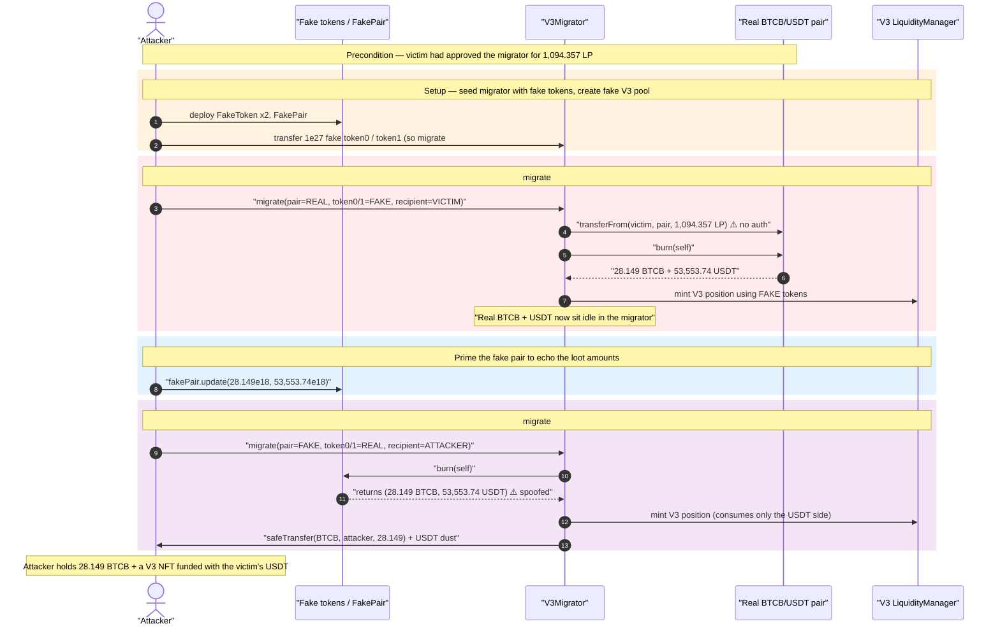
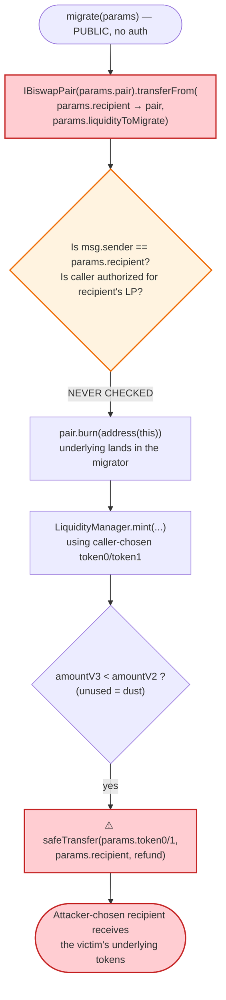
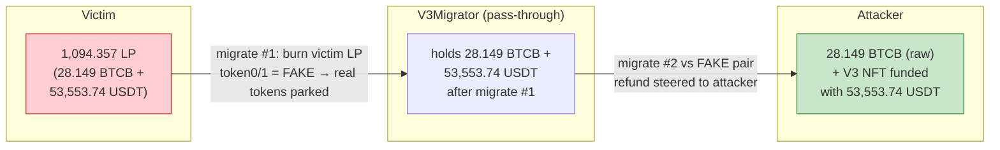

# Biswap V3Migrator Exploit — Arbitrary `recipient` LP Theft via Unauthorized `migrate()`

> **Reproduction:** the PoC compiles & runs in an isolated Foundry project at
> [this project folder](.) (the umbrella DeFiHackLabs repo contains many
> unrelated PoCs that do not whole-compile, so this one was extracted).
> Full verbose trace: [output.txt](output.txt). PoC: [test/Biswap_exp.sol](test/Biswap_exp.sol).
> Verified vulnerable source: [contracts_periphery_V3Migrator.sol](sources/V3Migrator_839b0A/contracts_periphery_V3Migrator.sol).

---

## Key info

| | |
|---|---|
| **Loss** | ~$72K — the victim's entire BTCB/BSC-USD V2 LP position (**≈ 28.149 BTCB + 53,553.74 BSC-USD** of underlying) |
| **Vulnerable contract** | `V3Migrator.migrate()` — [`0x839b0AFD0a0528ea184448E890cbaAFFD99C1dbf`](https://bscscan.com/address/0x839b0AFD0a0528ea184448E890cbaAFFD99C1dbf#code) |
| **Victim** | LP holder `0x2978D920a1655abAA315BAd5Baf48A2d89792618` (held **1,094.357 LP** of the Biswap V2 BTCB/USDT pair) |
| **Victim pair** | Biswap V2 BTCB/BSC-USD pair — `0x63b30de1A998e9E64FD58A21F68D323B9BcD8F85` |
| **Stolen tokens** | BTCB `0x2170Ed0880ac9A755fd29B2688956BD959F933F8`, BSC-USD `0x55d398326f99059fF775485246999027B3197955` |
| **Attacker EOA** | `0xa1E31b29f94296fc85FAc8739511360f279b1976` |
| **Attacker contract** | `0x1d448E9661c5abFC732Ea81330c6439B0aA449b5` |
| **Attack tx** | [`0xebe5248820241d8de80bcf66f4f1bfaaca62962824efaaa662db84bd27f5e47e`](https://bscscan.com/tx/0xebe5248820241d8de80bcf66f4f1bfaaca62962824efaaa662db84bd27f5e47e) |
| **Chain / block / date** | BSC / fork at 29,554,461 / June 30, 2023 |
| **Compiler** | Solidity v0.8.16, optimizer **200 runs** (per [_meta.json](sources/V3Migrator_839b0A/_meta.json)) |
| **Bug class** | Missing authorization — `transferFrom` from an attacker-chosen `recipient` whose approval was pre-granted |

---

## TL;DR

Biswap's `V3Migrator` is a periphery helper meant to let a user move their own Uniswap-V2-style
LP into a Biswap V3 concentrated-liquidity position. Its `migrate()` function takes a fully
caller-supplied `MigrateParams` struct and, on its very first line, does:

```solidity
IBiswapPair(params.pair).transferFrom(params.recipient, params.pair, params.liquidityToMigrate);
```

([contracts_periphery_V3Migrator.sol:51](sources/V3Migrator_839b0A/contracts_periphery_V3Migrator.sol#L51)).

It pulls LP tokens out of **`params.recipient`** — an arbitrary address chosen by the caller — and
**never checks that `msg.sender` is that recipient, or that the caller is authorized to spend
`recipient`'s LP**. The function's own interface comment even states `liquidityToMigrate` is
"expected to be `balanceOf(msg.sender)`" ([IV3Migrator.sol:11](sources/V3Migrator_839b0A/contracts_interfaces_IV3Migrator.sol#L11)),
but nothing in the code enforces that expectation.

Because the victim had previously `approve`d the migrator to spend their LP token (a normal
prerequisite for using the migrate flow), any attacker could call `migrate()` with
`recipient = victim` and drain the victim's LP. The attacker abuses the freedom further: the
migrator burns the victim's LP, **keeps the underlying BTCB + USDT in the migrator contract**, and
then the attacker performs a second `migrate()` against a self-deployed **fake pair** that reports
those same balances, redirecting the migrator's `safeTransfer` refund of the real tokens to the
**attacker** ([:85-104](sources/V3Migrator_839b0A/contracts_periphery_V3Migrator.sol#L85-L104)).

Net result in the PoC: the attacker ends up holding the victim's **28.149 BTCB** (plus a V3 position
funded with the victim's 53,553 BSC-USD). Profit = the victim's entire LP position.

---

## Background — what V3Migrator does

`V3Migrator` ([source](sources/V3Migrator_839b0A/contracts_periphery_V3Migrator.sol)) is a standard
"V2 → V3" liquidity migration helper, structurally a fork of Uniswap's `V3Migrator`. Its single
relevant entry point, `migrate(MigrateParams)`:

1. **Burns V2 liquidity** — transfers `liquidityToMigrate` LP from `params.recipient` into the pair,
   then calls `pair.burn(address(this))` so the underlying token0/token1 land in the **migrator**.
2. **Mints a V3 position** — approves the `LiquidityManager` and calls `mint(...)` to deposit the
   burned tokens into a Biswap V3 pool, with the NFT going to `params.recipient`.
3. **Refunds dust** — whatever the V3 mint didn't consume is `safeTransfer`'d back to
   `params.recipient`.

The intended user flow is: *a user* approves the migrator for *their own* LP, then calls
`migrate()` with `recipient = themselves`. The fatal assumption is that `recipient` is the caller.

Relevant on-chain facts at the fork block (read from the trace):

| Fact | Value |
|---|---|
| Victim LP balance (`pair.balanceOf(victim)`) | **1,094.357092264218434277 LP** |
| Underlying burned — token0 (BTCB) | **28.149267765302306856 BTCB** |
| Underlying burned — token1 (BSC-USD) | **53,553.740618437724760070 USDT** |
| Migrator's own pre-attack token balance | **0** (it holds nothing between txs) |
| Victim's LP approval to migrator | **pre-existing** (required to ever migrate) |

---

## The vulnerable code

### 1. `migrate()` pulls LP from an arbitrary `recipient` with no authorization

```solidity
function migrate(MigrateParams calldata params) external override returns(uint refund0, uint refund1){

    // burn v2 liquidity to this address
    IBiswapPair(params.pair).transferFrom(params.recipient, params.pair, params.liquidityToMigrate); // ⚠️ no auth on recipient
    (uint256 amount0V2, uint256 amount1V2) = IBiswapPair(params.pair).burn(address(this));            //    underlying lands in migrator
    ...
```

([contracts_periphery_V3Migrator.sol:48-52](sources/V3Migrator_839b0A/contracts_periphery_V3Migrator.sol#L48-L52))

There is **no** `require(msg.sender == params.recipient)`, no signature check, no permit, no pull
from `msg.sender`. Every field of `params` — `pair`, `recipient`, `token0`, `token1`, `fee`,
`liquidityToMigrate` — is attacker-controlled. The only implicit requirement is that
`params.recipient` has approved the migrator for at least `liquidityToMigrate` LP, which the victim
had done.

### 2. The dust refund is steered by the caller's `token0`/`token1`/`recipient`

```solidity
    if (amount0V3 < amount0V2) {
        ...
        refund0 = amount0V2 - amount0V3;
        ...
        safeTransfer(params.token0, params.recipient, refund0);   // ⚠️ token & recipient both caller-chosen
    }
    if (amount1V3 < amount1V2) {
        ...
        refund1 = amount1V2 - amount1V3;
        ...
        safeTransfer(params.token1, params.recipient, refund1);
    }
```

([contracts_periphery_V3Migrator.sol:80-105](sources/V3Migrator_839b0A/contracts_periphery_V3Migrator.sol#L80-L105))

The amounts `amount0V2`/`amount1V2` are taken from the burn result, and `safeTransfer` moves any
"unused" balance to `params.recipient` using `params.token0`/`params.token1`. The attacker can
therefore engineer a `migrate()` call where `amount0V2`/`amount1V2` describe a *real* token balance
the migrator is currently holding, while the V3 mint consumes ~none of it, so the entire balance is
refunded to an attacker-chosen address.

---

## Root cause — why it was possible

Two independent flaws compound:

1. **Authorization confusion between `msg.sender` and `recipient`.** `migrate()` spends
   `recipient`'s LP via `transferFrom`, but treats `recipient` purely as a *destination* field. The
   correct invariant — "only the owner of the LP (or someone they authorized) may migrate it" — is
   never expressed. Any pre-existing approval to the migrator becomes a free spend for anyone. This
   is the same "arbitrary `from`" / "approval-as-a-weapon" class that has drained countless periphery
   routers and migrators.

2. **The migrator burns to *itself* and refunds based on caller-controlled token addresses.** Because
   `burn(address(this))` deposits the underlying into the migrator and the refund path trusts
   `params.token0/token1` and `params.recipient`, the attacker can run a **second** `migrate()`
   against a self-deployed **fake pair** whose `burn()` returns the *same numbers* the migrator just
   acquired — tricking the migrator into `safeTransfer`-ing the **real** BTCB/USDT it is holding to
   the attacker as "dust refund."

The interface even documents the broken assumption:

> `uint256 liquidityToMigrate; // expected to be balanceOf(msg.sender)`
> ([IV3Migrator.sol:11](sources/V3Migrator_839b0A/contracts_interfaces_IV3Migrator.sol#L11))

"Expected" was never enforced. The comment is the spec; the code violates it.

---

## Preconditions

- The victim has an **outstanding LP approval** to the migrator (`pair.allowance(victim, migrator) ≥
  liquidityToMigrate`). This is the normal precondition for *ever* using the migrate feature, so any
  user who had prepared to migrate (or who used it once with a non-zero leftover allowance) was
  exposed.
- The victim holds the LP at attack time (the migrator pulls `balanceOf(victim)`-worth in the PoC).
- No capital, flash loan, or special role is required from the attacker — only gas. The attacker
  deploys a few helper contracts (a fake ERC20 pair) to capture the refund.

---

## Attack walkthrough (with on-chain numbers from the trace)

For the victim pair, `token0 = BTCB (0x2170…F8)`, `token1 = BSC-USD (0x55d3…55)`. All figures below
are taken directly from the `Transfer` / `Burn` / `Migrate` events in [output.txt](output.txt).

| # | Step | What happens | Numbers |
|---|------|--------------|---------|
| 0 | **Setup** | Attacker deploys two `FakeToken`s + a `FakePair`, creates a Biswap V3 pool for the fake tokens, and seeds the migrator with 1e27 of each fake token (so the first migrate's V3 mint succeeds). | — |
| 1 | **Read victim LP** | `pair.balanceOf(victim)` | **1,094.357092264218434277 LP** ([output.txt:82-83](output.txt)) |
| 2 | **migrate #1 (decoy)** — `pair = real BTCB/USDT pair`, `token0/token1 = FAKE tokens`, `recipient = victim` | Migrator `transferFrom(victim → pair, 1094.357 LP)` then `pair.burn(self)` → migrator receives the real underlying. The V3 mint uses the *fake* tokens (seeded in setup), so the real BTCB/USDT stay parked in the migrator. | Burned: **28.149267765302306856 BTCB** + **53,553.740618437724760070 USDT** ([output.txt:107-134](output.txt)) |
| 3 | **Snapshot migrator** | `BTCB.balanceOf(migrator)`, `USDT.balanceOf(migrator)` confirm the loot is sitting in the migrator. | **28.149 BTCB / 53,553.74 USDT** ([output.txt:231-234](output.txt)) |
| 4 | **Prime FakePair** | Attacker calls `fakePair.update(28.149e18, 53553.74e18)` so the fake pair's `burn()` will *return those exact amounts*. | t0=28.149e18, t1=53,553.74e18 ([output.txt:235-239](output.txt)) |
| 5 | **migrate #2 (theft)** — `pair = FAKE pair`, `token0/token1 = REAL BTCB/USDT`, `recipient = attacker` | Migrator `transferFrom`s worthless fake LP, then `fakePair.burn(self)` returns `(28.149 BTCB, 53,553.74 USDT)` *as if* that much was burned. The migrator then mints a V3 position with the real tokens, but the mint only consumes the USDT side; the full **28.149 BTCB** is treated as unused dust. | V3 mint consumes USDT `53,553.740618437724751290`; BTCB consumed ≈ 0 ([output.txt:288-313](output.txt)) |
| 6 | **Dust refund → attacker** | `safeTransfer(BTCB, attacker, 28.149 BTCB)` + tiny USDT dust. | Attacker receives **28.149267765302306856 BTCB** + 8,780 wei USDT ([output.txt:338-356](output.txt)) |

PoC final balances (test address stands in for the attacker contract):

```
this token0 before: 0.000000000000000000   (BTCB)
this token1 before: 0.010000000000000000   (seed USDT)
this token0 after : 28.149267765302306856  (BTCB stolen)
this token1 after : 0.010000000000008780   (USDT dust)
```
([output.txt:5-10](output.txt))

### Profit / loss accounting

| Party | Change |
|---|---:|
| **Victim** | −1,094.357 LP → **−28.149 BTCB and −53,553.74 USDT** of underlying liquidity |
| **Attacker** | **+28.149 BTCB** transferred out, **plus** the Biswap V3 BTCB/USDT position minted with the victim's 53,553.74 USDT (NFT id 1512, `recipient = attacker`) |
| **Migrator** | net zero (pass-through) |

The attacker walks off with the victim's full LP value: the BTCB side as raw tokens and the USDT
side as a freshly minted V3 NFT position they own. DeFiHackLabs reports the headline loss as ~$72K.

---

## Diagrams

### Sequence of the attack



### Authorization flaw inside `migrate()`



### Where the value goes — two-migrate redirection



---

## Remediation

1. **Spend only the caller's LP.** Pull liquidity from `msg.sender`, not from a caller-supplied
   `recipient`:
   ```solidity
   IBiswapPair(params.pair).transferFrom(msg.sender, params.pair, params.liquidityToMigrate);
   ```
   If migrating on behalf of someone is a genuine feature, require an explicit, scoped authorization
   (EIP-2612 `permit`, an on-chain allowlist, or a signed migration intent) — never a bare standing
   ERC20 approval.
2. **Never treat `recipient` as both the LP source and the refund destination.** Separate "who pays"
   (`msg.sender`) from "who receives" so a stolen approval can't be redirected.
3. **Validate the pair against the factory.** Reject any `params.pair` / `params.token0` /
   `params.token1` that is not a canonical Biswap pair, so a self-deployed `FakePair` can never be
   passed in. The fake-pair leg of the exploit dies if `pair` must be factory-derived from
   `(token0, token1)`.
4. **Tighten the refund path.** Compute refunds from the migrator's *actual measured* token balance
   delta, derive token addresses from the validated pair (not from caller input), and send dust back
   to `msg.sender`, not an arbitrary address.
5. **Honor the documented spec.** The interface says `liquidityToMigrate` is
   "`balanceOf(msg.sender)`" — assert it. Specs that live only in comments are not enforced.

---

## How to reproduce

The PoC was extracted into a standalone Foundry project (the umbrella DeFiHackLabs repo has many
unrelated PoCs that fail to compile under a whole-project `forge build`):

```bash
_shared/run_poc.sh 2023-06-Biswap_exp --mt testExploit -vvvvv
```

- RPC: a **BSC archive** endpoint is required — the test forks at block **29,554,461**
  (`vm.createFork("bsc", 29554461)`); most public BSC RPCs prune that far back and fail with
  `header not found` / `missing trie node`.
- Result: `[PASS] testExploit()`, with the attacker's BTCB balance going from `0` to
  **28.149267765302306856 BTCB**.

Expected tail:

```
Ran 1 test for test/Biswap_exp.sol:ContractTest
[PASS] testExploit() (gas: 8408183)
Logs:
  liquidity to migrate: 1094357092264218434277
  this token0 before: 0.000000000000000000
  this token1 before: 0.010000000000000000
  this token0 after: 28.149267765302306856
  this token1 after: 0.010000000000008780

Suite result: ok. 1 passed; 0 failed; 0 skipped
```

---

*Reference: MetaTrust alert — https://twitter.com/MetaTrustAlert/status/1674814217122349056 (Biswap V3Migrator, BSC, ~$72K).*
