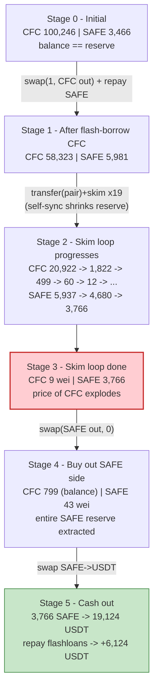
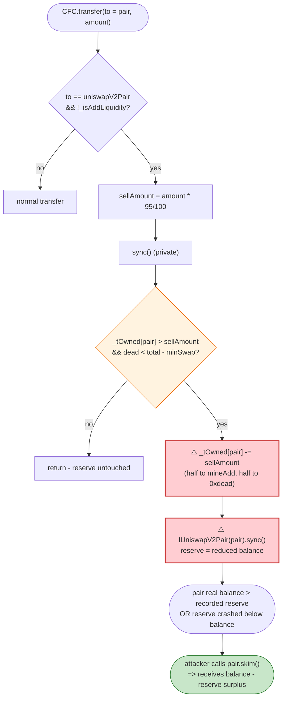

# CFC Exploit — Self-Burning `sync()` + `skim()` Reserve Drain

> **Vulnerability classes:** vuln/oracle/price-manipulation · vuln/logic/state-update · vuln/defi/slippage

> **Reproduction:** the PoC compiles & runs in an isolated Foundry project at
> [this project folder](.) (the umbrella DeFiHackLabs repo contains many unrelated PoCs that do
> not whole-compile, so this one was extracted).
> Full verbose trace: [output.txt](output.txt).
> Verified vulnerable source: [sources/CFC_dd9B22/CFC.sol](sources/CFC_dd9B22/CFC.sol).
> Pair source: [sources/PancakePair_595488/PancakePair.sol](sources/PancakePair_595488/PancakePair.sol).

---

## Key info

| | |
|---|---|
| **Loss** | **+6,124.40 BEP20USDT net profit** this transaction (PoC). SlowMist reported ~$16K total across the incident — this is the *second* exploit tx. |
| **Vulnerable contract** | `CFC` — [`0xdd9B223AEC6ea56567A62f21Ff89585ff125632c`](https://bscscan.com/address/0xdd9B223AEC6ea56567A62f21Ff89585ff125632c#code) |
| **Victim pool** | CFC/SAFE PancakeSwap pair (`CakeLP`) — [`0x595488F902C4d9Ec7236031a1D96cf63b0405CF0`](https://bscscan.com/address/0x595488F902C4d9Ec7236031a1D96cf63b0405CF0) |
| **Tokens** | `SAFE` `0x4d7Fa587…18a1` (token0), `CFC` `0xdd9B223A…632c` (token1), `BEP20USDT` `0x55d39832…7955` |
| **Attacker contract** | [`0x8213e87bb381919b292ace364d97d3a1ee38caa4`](https://bscscan.com/address/0x8213e87bb381919b292ace364d97d3a1ee38caa4) |
| **Attack tx** | `0xa3c130ed8348919f73cbefce0f22d46fa381c8def93654e391ddc95553240c1e` ([Phalcon](https://explorer.phalcon.xyz/tx/bsc/0xa3c130ed8348919f73cbefce0f22d46fa381c8def93654e391ddc95553240c1e)) |
| **Chain / block / date** | BSC / 29,116,478 / June 2023 |
| **Compiler** | CFC: Solidity v0.8.18 (optimizer off); Pair: v0.5.16 |
| **Bug class** | Token tampers with its own AMM reserve (`_tOwned[pair] -= …` + `pair.sync()`), creating a `balance > reserve` gap that `skim()` lets an attacker repeatedly harvest |

---

## TL;DR

`CFC` is a "tax + dividend" BEP20 whose `_transfer` runs an internal `sync()` helper on every **sell**
(any transfer where `to == uniswapV2Pair`). That helper directly mutates the pair's CFC token balance —
`_tOwned[uniswapV2Pair] -= sellAmount` — moving 95% of the sold amount to the `mineAdd`/`0xdead` addresses,
and then calls the real `pancakePair.sync()` to force the pair to adopt the reduced balance as its reserve
([CFC.sol:756-769](sources/CFC_dd9B22/CFC.sol#L756-L769)).

In other words, **the token destroys CFC sitting inside the pair, on the pair's behalf, on every sell.**
A Uniswap-V2 pair trusts that its `token.balanceOf(pair)` only changes through swaps/mints/burns it
mediates. CFC breaks that trust, so the attacker can engineer a persistent gap between the pair's *actual*
CFC balance and its *recorded* reserve, then sweep that gap with the permissionless `skim()`
([PancakePair.sol:483-488](sources/PancakePair_595488/PancakePair.sol#L483-L488)).

The attacker, funded by a chain of five DODO `DPPOracle` flashloans of BEP20USDT:

1. **Seeds** itself with SAFE (swaps 13,000 USDT → 2,515 SAFE on a different pair).
2. **Flash-borrows** ~41,922 CFC from the CFC/SAFE pair via a low-level `swap()` and repays it with the 2,515 SAFE, ending up holding ~39,826 CFC (net of CFC's 3% sell tax).
3. **Runs a `transfer → skim` loop 19 times**: each `CFC.transfer(pair, …)` fires CFC's self-`sync()`, which shrinks the pair's CFC reserve far below its real balance; then `CakeLP.skim(attacker)` ships the surplus CFC out to the attacker. The pair's CFC reserve is driven from **100,246 CFC → 9 wei**, while its SAFE reserve barely moves (it stays ~3,766 SAFE).
4. **Buys the entire SAFE side**: with the CFC reserve at ~9 wei, a single `swap` of ~800 CFC pulls out the whole 3,766 SAFE reserve.
5. **Re-mints LP and exits**: re-adds dust liquidity to grab the protocol-fee LP, swaps all harvested SAFE back to BEP20USDT, repays the five flashloans, and walks away with **6,124.40 USDT**.

---

## Background — what CFC does

`CFC` ([source](sources/CFC_dd9B22/CFC.sol)) is a 3.1M-supply BEP20 with a PancakeSwap CFC/`SAFE` pair
(`_token = SAFE = 0x4d7Fa587…18a1`) created in its constructor
([CFC.sol:519-562](sources/CFC_dd9B22/CFC.sol#L519-L562)). It layers three "tokenomics" features on top of
a basic ERC20:

- **Buy/sell taxes** — on any transfer touching the pair, it siphons 1% to the contract, 1% to `mineAdd`,
  1% to `nodeAdd`, and burns up to 2% to `0xdead`; the recipient only receives `97% − burn`
  ([CFC.sol:711-733](sources/CFC_dd9B22/CFC.sol#L711-L733)).
- **LP dividend distribution** in the `SAFE` token via a `TokenDistributor` and a shareholder loop.
- **The "rebase-on-sell" helper** — on every sell it calls a *private* `sync()` that **removes CFC from
  the pair itself** and re-syncs the pair. This is the vulnerable mechanism.

On-chain state at the fork block (CFC/SAFE pair, from the trace):

| Parameter | Value |
|---|---|
| `totalSupply` (`_tTotal`) | 3,100,000 CFC |
| `minSwap` | 155,000 CFC |
| Pair reserve0 = SAFE | **3,466.66 SAFE** |
| Pair reserve1 = CFC | **100,246.52 CFC** |
| Pair CFC balance == reserve1 | yes (honest, in sync) |

The pair holds ~3,466 SAFE that is the prize, priced against ~100,246 CFC.

---

## The vulnerable code

### 1. The token mutates the pair's reserve on every sell

`_transfer` — when `to == uniswapV2Pair` (a sell) and it is not an add-liquidity — sets
`sellAmount = amount·95/100` and calls the private `sync()`:

```solidity
// CFC.sol:706-733 (excerpt)
if (to == uniswapV2Pair && !_isAddLiquidity()) {
    sellAmount = amount.mul(95).div(100);   // 95% of the sell amount
    sync();                                  // ← mutate the pair, see below
}
```

```solidity
// CFC.sol:756-769
function sync() private {
    if (_tOwned[uniswapV2Pair] > sellAmount && _tOwned[address(0xdead)] < _tTotal - minSwap) {
        if (sellAmount > _tTotal - _tOwned[address(0xdead)] - minSwap) {
            sellAmount = _tTotal - _tOwned[address(0xdead)] - minSwap;
        }
        _tOwned[uniswapV2Pair] -= sellAmount;            // ⚠️ delete CFC from the PAIR's balance
        _tOwned[mineAdd]        += sellAmount.div(2);     //    give half to mineAdd
        _tOwned[address(0xdead)]+= sellAmount.div(2);     //    burn half
        emit Transfer(uniswapV2Pair, mineAdd, sellAmount.div(2));
        emit Transfer(uniswapV2Pair, address(0xdead), sellAmount.div(2));
        sellAmount = 0;
        IUniswapV2Pair(uniswapV2Pair).sync();             // ⚠️ force pair reserve = reduced balance
    }
}
```

This is executed **before** the actual `_basicTransfer` of the incoming amount happens, and it operates on
`_tOwned[uniswapV2Pair]` — the pair's *own* CFC balance. The pair never authorized this. After the helper
runs, the pair has lost 95% of `sellAmount` worth of CFC for free, and `IUniswapV2Pair.sync()` makes the
pair record the now-smaller balance as its reserve.

### 2. The pair's `skim()` ships out any balance-above-reserve surplus

```solidity
// PancakePair.sol:483-488
function skim(address to) external lock {
    _safeTransfer(_token0, to, IERC20(_token0).balanceOf(address(this)).sub(reserve0));
    _safeTransfer(_token1, to, IERC20(_token1).balanceOf(address(this)).sub(reserve1));
}
```

`skim` is permissionless and pays out `balanceOf(pair) − reserve` for each token. Combined with CFC's
self-`sync`, the attacker can manufacture exactly the `balance > reserve` discrepancy `skim` is designed to
flush — and pocket it.

---

## Root cause — why it was possible

The two contracts disagree about who owns the CFC inside the pair:

1. **CFC unilaterally edits the pair's balance.** `_tOwned[uniswapV2Pair] -= sellAmount` plus
   `pair.sync()` is a *donation of the pair's assets to `mineAdd`/`0xdead`*, performed by the token on every
   sell, without the pair's consent. A token must never decrement an AMM pair's balance and resync it; doing
   so corrupts the pair's accounting.

2. **`skim()` is the leak valve.** Each time the attacker pushes CFC into the pair and triggers the
   self-`sync` (which *lowers* the recorded reserve below the real balance), `skim()` lets them pull the
   surplus straight back out. Iterating this collapses the CFC reserve to dust while the attacker keeps
   recycling the same CFC.

3. **The SAFE side never re-prices fairly.** Because the CFC reserve is being annihilated independently of
   the SAFE reserve, the pair's price is driven to near-zero CFC reserve. A final `swap` then buys the entire
   SAFE reserve for a trivial amount of CFC — the classic broken-`x·y=k` outcome.

Concretely, the design decisions that compose into the bug:

- A token writing to `_tOwned[pair]` and calling `pair.sync()` (self-burn-from-pool pattern).
- The 95%-of-sell magnitude, which makes each self-sync remove a large slice of the pair's CFC reserve.
- The presence of `skim()` (standard Uniswap-V2) as a permissionless surplus-extraction primitive.

---

## Preconditions

- The pair's recorded reserve must currently equal its balance (true at the fork block).
- The attacker needs enough CFC to push into the pair so that `_tOwned[uniswapV2Pair] > sellAmount`
  (the guard in `sync()`); the flash-borrowed ~39,826 CFC satisfies this. The CFC itself is sourced via a
  flash `swap()` on the pair and repaid with cheaply-acquired SAFE.
- Working capital in BEP20USDT to buy the initial SAFE. The PoC obtains this through a stack of five DODO
  `DPPOracle` BEP20USDT flashloans, all repaid in the same transaction — so the attack is effectively
  zero-capital / flash-loanable.

---

## Attack walkthrough (with on-chain numbers from the trace)

The pair's `token0 = SAFE`, `token1 = CFC`, so in every `Sync(reserve0, reserve1)` event
**`reserve0 = SAFE`, `reserve1 = CFC`**. All figures are taken from the `Sync` / `Swap` / `Transfer` events
in [output.txt](output.txt).

| # | Step | CFC reserve (reserve1) | SAFE reserve (reserve0) | Effect |
|---|------|-----------------------:|------------------------:|--------|
| 0 | **Initial** ([:165-180](output.txt#L165)) | 100,246.52 | 3,466.66 | Honest pool. |
| 1 | **Seed**: swap 13,000 USDT → 2,515.33 SAFE on the SAFE/USDT pair ([:135-158](output.txt#L135)) | — | — | Attacker now holds 2,515 SAFE. |
| 2 | **Flash-borrow CFC**: `CakeLP.swap(1, 41,922.5 CFC out, …data)`; repay with 2,515 SAFE in `pancakeCall` ([:171-223](output.txt#L171)) | 58,323.98 | 5,981.98 | Attacker holds ~39,826 CFC (post 3% tax). Reserve already shrinking. |
| 3a | **Loop iter 1** — `CFC.transfer(pair, 37,835)` fires self-`sync` ([:285-290](output.txt#L285)) | 20,922.97 | 5,937.90 | Self-sync burned ~37,835 CFC *from the pair*, lowering reserve1 far below the pair's real CFC balance. |
| 3b | …then `CakeLP.skim(attacker)` ([:310-339](output.txt#L310)) | 20,922.97 | — | Pair ships ~35,943 CFC surplus back to the attacker (net of tax). CFC recycled. |
| 4 | **Loop iters 2-19** repeat transfer→skim ([Sync chain :379…:1639](output.txt#L379)) | 1,822 → 499 → 60.5 → 12.7 → 0.637 → 0.0318 → … → **9 wei** | 5,725 → 4,680 → 4,370 → **3,766.01** | CFC reserve annihilated to 9 wei; SAFE reserve barely touched. |
| 5 | **Sell ~800 CFC** then `CakeLP.swap(3,766.01 SAFE out, 0, …)` ([:1692-1741](output.txt#L1724)) | 799.66 (balance) | **43 wei** | One swap empties the entire SAFE reserve for ~800 CFC. Attacker now holds 3,766.01 SAFE. |
| 6 | **Re-mint LP** (grabs accrued fee-LP) + dust ([:1747-1796](output.txt#L1781)) | 31,986 | 1,808 | `mint` mints 5.99e25 LP to attacker; emits `Mint(amount0:1765, amount1:31,186)`. |
| 7 | **Swap 3,766.01 SAFE → 19,124.40 USDT** on the SAFE/USDT pair ([:1799-1824](output.txt#L1799)) | — | — | Convert spoils to USDT. |
| 8 | **Repay 5 DODO flashloans** ([:1831-1906](output.txt#L1831)) | — | — | All BEP20USDT borrowings returned. |
| 9 | **Final balance** ([:1918-1922](output.txt#L1918)) | — | — | Attacker BEP20USDT = **6,124.40** (started at 0). |

### Why the skim loop works (mechanism)

On each loop iteration the attacker calls `CFC.transfer(pair, X)` where `X ≈ pair's current CFC balance`.
Because `to == uniswapV2Pair`, CFC's `_transfer` first runs `sync()`, which does
`_tOwned[uniswapV2Pair] -= sellAmount (≈0.95·X)` and `pair.sync()` — so the pair's **recorded reserve1
drops to roughly 5% of its real balance**. Then `CakeLP.skim(attacker)` pays out
`balanceOf(CFC@pair) − reserve1`, which is the large surplus the self-sync just created, handing most of the
CFC straight back to the attacker. The same CFC is recycled 19 times, each pass shaving the pair's reserve
by ~95% (100,246 → 58k → 21k → 1.8k → … → 9 wei) while the SAFE reserve only bleeds from CFC's own tax
transfers (3,466 → 3,766 actually *rises* slightly from the flash-swap, then settles ~3,766).

### Profit accounting (BEP20USDT)

| Direction | Amount (USDT) |
|---|---:|
| Spent — buy initial SAFE | 13,000.00 |
| Received — sell drained 3,766.01 SAFE | 19,124.40 |
| **Net (after repaying all 5 flashloans)** | **+6,124.40** |

The attacker started with a `deal`'d balance of 0 BEP20USDT and ended the transaction holding
6,124.398799521459371489 USDT — verified by the PoC's logged before/after balances and the trace's final
`balanceOf` of 6,124.40 USDT ([:1918](output.txt#L1918)).

---

## Diagrams

### Sequence of the attack

```mermaid
sequenceDiagram
    autonumber
    actor A as Attacker
    participant D as "DODO DPPOracles (x5)"
    participant SU as "SAFE/USDT pair"
    participant P as "CFC/SAFE pair (CakeLP)"
    participant C as "CFC token"

    Note over P: "Initial reserves<br/>100,246 CFC / 3,466 SAFE<br/>balance == reserve (honest)"

    rect rgb(255,243,224)
    Note over A,D: "Step 1 — flashloan USDT + seed SAFE"
    D->>A: "flashLoan BEP20USDT (nested x5)"
    A->>SU: "swap 13,000 USDT -> 2,515 SAFE"
    end

    rect rgb(232,245,233)
    Note over A,P: "Step 2 — flash-borrow CFC, repay with SAFE"
    A->>P: "swap(1, 41,922 CFC out, data)"
    P-->>A: "41,922 CFC (optimistic)"
    A->>P: "pancakeCall: transfer 2,515 SAFE back"
    Note over P: "58,323 CFC / 5,981 SAFE"
    end

    rect rgb(255,235,238)
    Note over A,C: "Step 3 — the exploit loop (x19)"
    loop "19 times"
        A->>C: "transfer(pair, ~balanceOf(pair))"
        C->>C: "_transfer: to==pair => sync()"
        C->>P: "_tOwned[pair] -= 95% ; pair.sync()"
        Note over P: "recorded CFC reserve crashes below real balance"
        A->>P: "skim(attacker)"
        P-->>A: "surplus CFC (balance - reserve)"
    end
    Note over P: "CFC reserve -> 9 wei ; SAFE reserve ~3,766"
    end

    rect rgb(227,242,253)
    Note over A,P: "Step 4-5 — buy the whole SAFE side"
    A->>P: "swap(3,766 SAFE out, 0)  (pay ~800 CFC)"
    P-->>A: "3,766 SAFE"
    A->>P: "mint()  (grab fee-LP)"
    end

    rect rgb(243,229,245)
    Note over A,D: "Step 6-7 — cash out & repay"
    A->>SU: "swap 3,766 SAFE -> 19,124 USDT"
    A->>D: "repay all 5 flashloans"
    end

    Note over A: "Net +6,124.40 USDT"
```

### Pool reserve evolution



### The flaw: CFC vs. the pair's accounting



---

## Remediation

1. **A token must never write to a pair's balance.** Remove the `_tOwned[uniswapV2Pair] -= sellAmount` +
   `IUniswapV2Pair(uniswapV2Pair).sync()` pattern entirely
   ([CFC.sol:756-769](sources/CFC_dd9B22/CFC.sol#L756-L769)). Any "deflation/redistribution" must only ever
   move tokens the contract itself owns, never tokens held by an AMM pair. Self-burning from the pool plus
   `sync()` corrupts the pair's reserves and is the entire bug.
2. **Do not couple tax logic to `sync()` at all.** If a rebase effect is required, implement it as the
   protocol buying & burning from its own treasury so both reserves move together and `x·y=k` is preserved.
3. **Treat `skim()` as adversarial.** Because `skim()` is permissionless on every Uniswap-V2 pair, any token
   that can produce a `balance ≠ reserve` discrepancy on the pair will be drained through it. Eliminating the
   self-`sync` (item 1) removes the discrepancy and closes the `skim` vector.
4. **Add reserve-impact sanity checks.** Reject any single token operation that would move the pair's
   recorded reserve by more than a small percentage; a 95%-of-sell self-burn against the pool is a red flag.

---

## How to reproduce

The PoC was extracted into a standalone Foundry project (the umbrella DeFiHackLabs repo does not
whole-compile under `forge test`):

```bash
_shared/run_poc.sh 2023-06-CFC_exp -vvvvv
```

- RPC: a **BSC archive** endpoint is required (fork block 29,116,478). `foundry.toml` is configured with a
  BSC archive RPC; most public BSC RPCs prune state this old and fail with `header not found` /
  `missing trie node`.
- Result: `[PASS] testSkim()` with attacker BEP20USDT going from 0 → **6,124.40**.

Expected tail:

```
Ran 1 test for test/CFC_exp.sol:CFCTest
[PASS] testSkim() (gas: 3354509)
Logs:
  Attacker BEP20USDT balance before attack: 0.000000000000000000
  Attacker BEP20USDT balance after attack: 6124.398799521459371489

Suite result: ok. 1 passed; 0 failed; 0 skipped; finished in 28.07s
```

---

*Reference: hexagate_ thread — https://twitter.com/hexagate_/status/1669280632738906113 (second TX). SlowMist Hacked — https://hacked.slowmist.io/ (CFC, BSC).*
