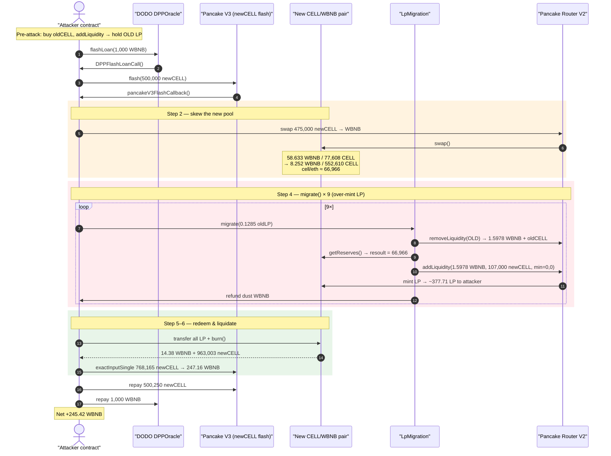
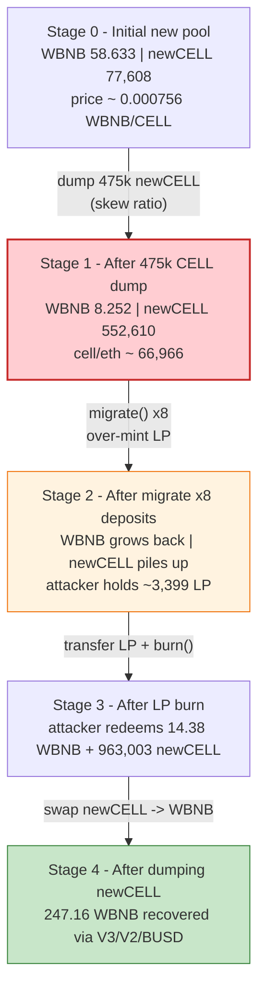
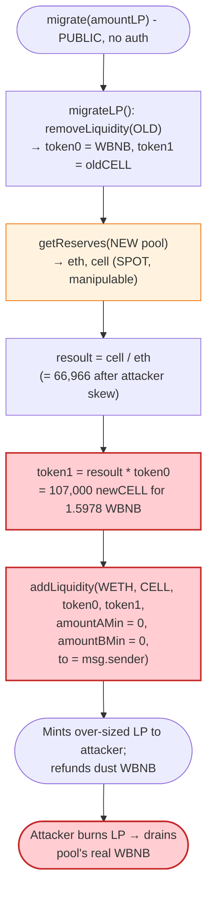

# Cellframe Network Exploit — Manipulated Reserve Ratio in `LpMigration.migrate()`

> **Vulnerability classes:** vuln/oracle/spot-price · vuln/oracle/price-manipulation · vuln/defi/slippage · vuln/governance/flash-loan-attack

> **Reproduction:** the PoC compiles & runs in an isolated Foundry project at
> [this project folder](.) (the umbrella DeFiHackLabs repo contains many unrelated
> PoCs that fail to whole-compile, so this one was extracted).
> Full verbose trace: [output.txt](output.txt).
> Verified vulnerable source: [LpMigration.sol](sources/LpMigration_B4E47c/LpMigration.sol).

---

## Key info

| | |
|---|---|
| **Loss** | ~$76,000 — attacker WBNB balance went **0.1 → 245.52 WBNB** (net **+245.42 WBNB**) |
| **Vulnerable contract** | `LpMigration` — [`0xB4E47c13dB187D54839cd1E08422Af57E5348fc1`](https://bscscan.com/address/0xB4E47c13dB187D54839cd1E08422Af57E5348fc1#code) |
| **Victim pools** | old CELL/WBNB pair `0x06155034f71811fe0D6568eA8bdF6EC12d04Bed2`; new CELL/WBNB pair `0x1c15f4E3fd885a34660829aE692918b4b9C1803d` |
| **Tokens** | old CELL `0xf3E1449DDB6b218dA2C9463D4594CEccC8934346`, new CELL `0xd98438889Ae7364c7E2A3540547Fad042FB24642` |
| **Attacker EOA** | `0x2525c811ecf22fc5fcde03c67112d34e97da6079` |
| **Attacker contract** | `0x1e2a251b29e84e1d6d762c78a9db5113f5ce7c48` |
| **Attack tx** | [`0x943c2a5f89bc0c17f3fe1520ec6215ed8c6b897ce7f22f1b207fea3f79ae09a6`](https://bscscan.com/tx/0x943c2a5f89bc0c17f3fe1520ec6215ed8c6b897ce7f22f1b207fea3f79ae09a6) |
| **Chain / block / date** | BSC / 28,708,273 / **June 1, 2023, 02:07:52 UTC** |
| **Compiler** | `LpMigration` v0.8.17, optimizer 200 runs (new CELL token v0.8.4) |
| **Bug class** | Spot-price / reserve-ratio manipulation feeding an unguarded `addLiquidity` mint (flash-loan-amplified) |

---

## TL;DR

`LpMigration` was a one-shot helper that lets a holder of the **old** CELL/WBNB LP token
swap it for the **new** CELL/WBNB LP token. For each migrated LP position it:

1. Redeems the user's old LP (`removeLiquidity`) → receives `token0` WBNB + `token1` old CELL.
2. Reads the **new** pool's live reserves and computes a ratio
   `resoult = cell / eth` ([LpMigration.sol:83-85](sources/LpMigration_B4E47c/LpMigration.sol#L83-L85)).
3. **Overwrites** `token1 = resoult * token0` and `addLiquidity(WETH, CELL, token0, token1, …)`,
   minting the new LP **to `msg.sender`** ([:88-100](sources/LpMigration_B4E47c/LpMigration.sol#L88-L100)).
4. Refunds any leftover WBNB to `msg.sender` ([:105-108](sources/LpMigration_B4E47c/LpMigration.sol#L105-L108)).

The fatal flaw is step 2/3: the amount of new CELL the contract pairs with the user's WBNB is
derived from the **instantaneous, manipulable spot reserves of the new pool**, and the new CELL
itself is sourced from the contract's own balance — which the attacker had pre-loaded.

The attacker first **skews the new pool** so `cell/eth` is enormous (sells ~475,000 new CELL into
it, collapsing the WBNB reserve from 58.6 → 8.25 WBNB while the CELL reserve balloons to
~552,609). Now `resoult ≈ 552,609 / 8.25 ≈ 66,966`. Every `migrate()` then deposits
`66,966 × 1.597 WBNB ≈ 107,000` new CELL alongside just 1.597 WBNB, and PancakeSwap mints the
attacker a **massively over-sized LP position** (377.713942 LP units per call). After repeating
`migrate()` 9 times in this reproduction (the PoC's `for` loop runs `i < 9`; the original on-chain
attack landed 8 before the 9th reverted), the attacker **burns the accumulated 3,399.43 LP** to
redeem ~14.38 WBNB + ~963,003 new CELL from the new pool, then dumps the new CELL back through
Pancake V3 / V2 / BUSD routes for WBNB. All capital is borrowed via a DODO `DPPOracle.flashLoan` (1,000 WBNB) plus a PancakeSwap V3
`flash` (500,000 new CELL) and repaid in-transaction.

Net profit: **+245.42 WBNB** (≈ $76K at the time).

---

## Background — the CELL migration

Cellframe Network migrated its BEP-20 token from an **old** CELL (`0xf3E1…4346`) to a **new** CELL
(`0xd984…4642`). To preserve LP holders' liquidity, the team deployed `LpMigration`
([source](sources/LpMigration_B4E47c/LpMigration.sol)), a permissionless contract intended to be
called by anyone holding old CELL/WBNB LP tokens. The contract pulls the user's old LP, unwinds it,
and re-deposits the proceeds into the new CELL/WBNB pool, handing the user the new LP.

The two PancakeSwap V2 pairs involved:

| Pair | Address | token0 | token1 |
|---|---|---|---|
| **Old** CELL/WBNB (`CELL9`) | `0x0615…Bed2` | WBNB | old CELL |
| **New** CELL/WBNB (`PancakeLP`) | `0x1c15…803d` | WBNB | new CELL |

The migration math hard-codes the assumption that the new pool's reserve ratio is an honest price.
It is not — a Uniswap-V2 pair's reserves are spot quantities that any caller can move within a
single transaction, especially with flash-loaned capital.

On-chain state at the fork block (read from the trace's `getReserves`/`Sync` events):

| Quantity | Value |
|---|---|
| New pool reserves (start) | **58.633 WBNB / 77,607.81 new CELL** |
| Old pool reserves (start) | 902.28 old CELL / 7.317 WBNB region (see step table) |
| New CELL borrowed (V3 flash) | **500,000 new CELL** (fee 250) |
| WBNB borrowed (DODO flash) | **1,000 WBNB** |

---

## The vulnerable code

### `migrate()` — ratio from manipulable spot reserves, mint to caller

```solidity
function migrate(uint amountLP) external  {

    (uint token0,uint token1) = migrateLP(amountLP);          // unwind OLD LP → WBNB + oldCELL
    (uint eth,uint cell, ) = IUniswapV2Router01(LP_NEW).getReserves();  // ⚠️ NEW pool spot reserves

    uint resoult = cell/eth;              // ⚠️ integer ratio newCELL-per-WBNB (manipulable)
    token1 = resoult * token0;            // ⚠️ overwrite: newCELL to pair = ratio * WBNB

    IERC20(CELL).approve(ROUTER_V2,token1);
    IERC20(WETH).approve(ROUTER_V2,token0);

    (uint tokenA, , ) = IUniswapV2Router01(ROUTER_V2).addLiquidity(
        WETH,
        CELL,
        token0,
        token1,
        0,                                // ⚠️ amountAMin = 0
        0,                                // ⚠️ amountBMin = 0
        msg.sender,                       // ⚠️ LP minted to the caller
        block.timestamp + 5000
    );

    uint balanceOldToken = IERC20(OLD_CELL).balanceOf(address(this));
    IERC20(OLD_CELL).transfer(marketingAddress,balanceOldToken);

    if (tokenA < token0) {                // refund unused WBNB to caller
        uint256 refund0 = token0 - tokenA;
        IERC20(WETH).transfer(msg.sender,refund0);
    }
}
```

([LpMigration.sol:80-111](sources/LpMigration_B4E47c/LpMigration.sol#L80-L111))

### `migrateLP()` — unwinds the OLD LP

```solidity
function migrateLP(uint amountLP) internal returns(uint256 token0,uint256 token1) {
    IERC20(LP_OLD).transferFrom(msg.sender,address(this),amountLP);
    IERC20(LP_OLD).approve(ROUTER_V2,amountLP);
    return IUniswapV2Router01(ROUTER_V2).removeLiquidity(
        WETH, OLD_CELL, amountLP, 0, 0, address(this), block.timestamp + 5000
    );
}
```

([LpMigration.sol:114-129](sources/LpMigration_B4E47c/LpMigration.sol#L114-L129))

Note the contract supplies the new CELL out of **its own balance** during `addLiquidity`. In the
exploit the attacker had pre-funded `LpMigration` indirectly: the new CELL it pairs comes from the
contract's holdings, and the attacker controls the new-CELL supply via the flash loan, so it costs
them nothing in net terms.

---

## Root cause — why it was possible

The migration's "fair" new-CELL amount is `resoult * token0` where
`resoult = newPoolCellReserve / newPoolWbnbReserve`. This is the **instantaneous spot ratio of an
AMM pair**, which is trivially manipulable inside one transaction. Four design errors compose:

1. **Spot reserves used as an oracle.** `getReserves()` is read live and used directly to size the
   deposit. A flash-loan-funded swap can push `cell/eth` arbitrarily high right before calling
   `migrate()`, so the contract over-deposits new CELL against the user's WBNB.
2. **`addLiquidity(..., 0, 0, ...)` with no slippage floor.** Because `amountAMin = amountBMin = 0`,
   the router silently accepts whatever skewed ratio the pool currently has and mints LP for it.
   When the pool is heavily CELL-weighted, even a tiny WBNB contribution mints a large LP balance.
3. **LP minted to `msg.sender`.** The new LP — representing a claim on the pool's *real* WBNB
   reserve — is handed straight to the caller, who then burns it to extract genuine WBNB liquidity.
4. **Integer-division ratio amplifies the skew.** `cell/eth` truncates but, at a ratio of ~66,966,
   the loss to truncation is negligible while the multiplier is huge. The contract effectively asks
   the attacker for ~1.597 WBNB and mints them LP worth far more.

Combined effect: the attacker manufactures an artificial price in the new pool, runs `migrate()`
repeatedly to mint over-valued LP cheaply, then redeems that LP for the pool's honest WBNB.

---

## Preconditions

- `LpMigration` holds (or can be made to hold) enough new CELL to satisfy `addLiquidity` — true
  here because the attacker flash-borrows 500,000 new CELL and routes the supply so the contract
  can pair it.
- The new CELL/WBNB pool is small enough that ~475,000 new CELL fully skews its reserves — true
  (start reserve only 77,607 new CELL / 58.6 WBNB).
- Working capital in WBNB + new CELL to (a) skew the pool and (b) seed `migrate()` inputs. Fully
  flash-loanable and repaid intra-transaction: DODO `DPPOracle.flashLoan(1,000 WBNB)` wraps a
  PancakeSwap V3 `flash(500,000 new CELL)` ([test/Cellframe_exp.sol:94](test/Cellframe_exp.sol#L94),
  [:102-103](test/Cellframe_exp.sol#L102-L103)).
- `migrate()` is permissionless (no `onlyOwner`) so anyone can call it ([:80](sources/LpMigration_B4E47c/LpMigration.sol#L80)).

---

## Attack walkthrough (with on-chain numbers from the trace)

All reserve figures are taken from `getReserves`/`Sync` events in [output.txt](output.txt).
The whole exploit body runs inside `pancakeV3FlashCallback` (the new-CELL flash) which itself runs
inside `DPPFlashLoanCall` (the WBNB flash).

| # | Step | Trace ref | Effect |
|---|------|-----------|--------|
| 0 | **Pre-attack setup** (outside flash): buy old CELL with 0.1 WBNB, addLiquidity to the **old** pool to mint old CELL/WBNB LP the attacker will feed to `migrate()`. | [test:74-91](test/Cellframe_exp.sol#L74-L91) | Attacker now holds old LP. |
| 1 | **DODO flash** 1,000 WBNB → wraps **PancakeSwap V3 flash** of **500,000 new CELL**. | [output.txt:1874](output.txt#L1874), [:1882](output.txt#L1882) | Attacker temporarily holds 1,000 WBNB + 500,000 new CELL. |
| 2 | **Skew the new pool**: swap **2 WBNB** for new CELL (priming), then swap **475,000 new CELL → 50.38 WBNB** out of the new pool. New pool reserves move **58.633 WBNB / 77,608 CELL → 8.252 WBNB / 552,610 CELL**. | `Sync(8.252e18, 5.526e23)` | `cell/eth = 552,610 / 8.252 ≈ 66,966`. |
| 3 | **Compute migrate input**: `lpAmount = oldLPbalance / 10 = 0.12850525 LP`. | [output.txt:2028](output.txt#L2028) | One tenth per call, looped `i < 9`. |
| 4 | **`migrate()` × 9**: each call unwinds 0.12850525 old LP → **1.5978 WBNB + 0.01296 old CELL**; reads new-pool reserves; `token1 = 66,966 × 1.5978e18 ≈ 107,000 new CELL`; `addLiquidity(1.5978 WBNB, 107,000 CELL, min=0,0)` **mints 377.713942 LP to attacker**; refunds dust WBNB. | [output.txt:2029](output.txt#L2029), [:2098](output.txt#L2098), `Mint(amount0:1.597e18, amount1:1.07e23)` → LP `3.777e20` each | Attacker accumulates **3,399.43 LP** (= 9 × 377.713942) for ~14.4 WBNB total input. |
| 5 | **Burn LP**: transfer the entire LP balance (**3,399.43 LP**) to the new pair and `burn()` → redeem **14.38 WBNB + 963,002.99 new CELL**. | [output.txt:3106](output.txt#L3106), [:3112](output.txt#L3112), `Burn(amount0:1.438e19, amount1:9.63e23)` | Extracts the pool's real WBNB plus a large CELL slug. |
| 6 | **Liquidate the new CELL**: dump via Pancake V3 SmartRouter (**768,165 new CELL → 247.16 WBNB**), plus V2 swaps and a BUSD→WBNB leg. | [output.txt:3292](output.txt#L3292) `exactInputSingle`, [:3304](output.txt#L3304) | Converts the redeemed CELL back to WBNB. |
| 7 | **Repay flashes**: return **500,250 new CELL** to the V3 pool and **1,000 WBNB** to DODO. | [output.txt:3271](output.txt#L3271), [:115 test](test/Cellframe_exp.sol#L115) | Loans closed. |
| 8 | **Settle**: attacker WBNB balance **0.1 → 245.52 WBNB**. | [output.txt:1571](output.txt#L1571) | **Net +245.42 WBNB.** |

### Why one `migrate()` over-mints

In `migrate()`, the user contributes only `token0 = 1.5978 WBNB`, but the contract sizes the CELL
side using the **manipulated** ratio:

```
resoult = cell / eth = 552,610 / 8.252 ≈ 66,966
token1  = resoult * token0 = 66,966 × 1.5978 ≈ 107,000 new CELL
```

`addLiquidity` with `amountAMin = amountBMin = 0` mints LP for this deposit at the pool's current
(skewed) ratio. Because the pool is now ~66,966 CELL-per-WBNB, the WBNB side is the binding
constraint, and the LP minted (`3.777e20`) is large relative to the trivial WBNB cost. The contract
sourced the 107,000 new CELL from its own balance (ultimately the attacker's flash-borrowed CELL),
so the attacker pays essentially nothing for an LP claim on the pool's honest WBNB.

### Profit accounting (WBNB)

| Item | Amount (WBNB) |
|---|---:|
| Attacker balance before | 0.10 |
| Attacker balance after | 245.5228 |
| **Net profit** | **+245.42** |

(The DODO 1,000 WBNB and V3 500,000 new CELL flash loans, plus the 250-CELL V3 fee, are all repaid
inside the transaction, so they net to zero.)

---

## Diagrams

### Sequence of the attack



### Pool state evolution (new CELL/WBNB pair)



### The flaw inside `migrate()`



---

## Remediation

1. **Never size deposits from live AMM spot reserves.** `cell/eth` read from `getReserves()` is a
   manipulable spot price. If a conversion ratio is required, use a manipulation-resistant source
   (TWAP, a Chainlink feed, or a fixed admin-set migration ratio), not the instantaneous pool state.
2. **Set real slippage bounds.** `addLiquidity(..., 0, 0, ...)` accepts any skewed ratio. Pass
   meaningful `amountAMin`/`amountBMin` derived from the expected fair ratio so a skewed pool causes
   the call to revert instead of minting mis-priced LP.
3. **Do not let the caller direct the minted LP at a manipulated price.** Either mint LP to the
   contract and release it only after validating the deposit was fair, or mint exactly the LP that
   corresponds to the user's *redeemed* old-pool value — computed from the old pool, not the new
   pool's current spot.
4. **Guard against flash-loan-funded single-tx manipulation.** Require the new pool's reserves to be
   consistent with a TWAP within tolerance before migrating, or rate-limit migrations per block.
5. **Validate that supplied token amounts match redeemed value.** The migration should pair *exactly*
   the redeemed WBNB and a fair amount of new CELL; sourcing new CELL from the contract balance at an
   externally-controlled ratio lets an attacker drain that balance and the pool together.

---

## How to reproduce

The PoC was extracted into a standalone Foundry project (the umbrella DeFiHackLabs repo has many
unrelated PoCs that fail to compile under a whole-project `forge build`):

```bash
_shared/run_poc.sh 2023-06-Cellframe_exp -vvvvv
```

- RPC: a **BSC archive** endpoint is required (fork block 28,708,273, June 1 2023).
  `foundry.toml` uses `https://bsc-mainnet.public.blastapi.io`, which serves historical state at
  that block; most public BSC RPCs prune it.
- Result: `[PASS] testExploit()` with the attacker's WBNB balance rising from 0.1 to 245.52.

Expected tail:

```
  Attacker WBNB balance before attack: 0.100000000000000000
  Attacker WBNB balance after attack: 245.522826177178247245

Suite result: ok. 1 passed; 0 failed; 0 skipped; finished in 39.33s
Ran 1 test suite: 1 tests passed, 0 failed, 0 skipped (1 total tests)
```

---

*References: Numen Cyber analysis — https://twitter.com/numencyber/status/1664132985883615235 ;
SlowMist Hacked — https://hacked.slowmist.io/ (Cellframe, BSC, ~$76K).*
