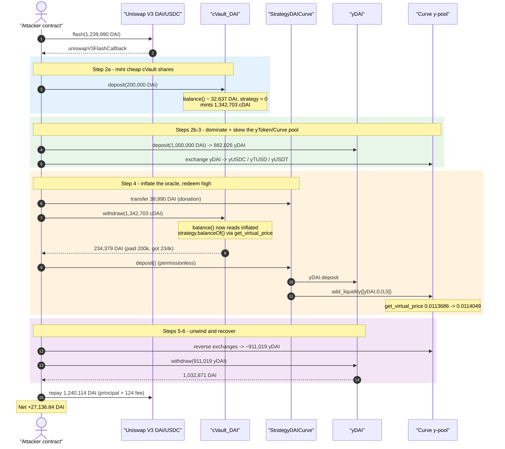
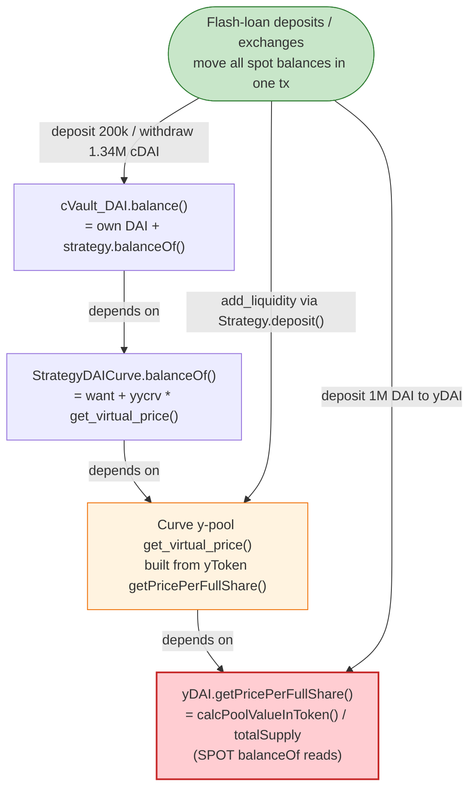
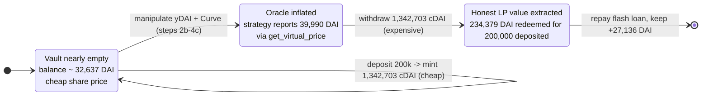

# Compounder Finance Exploit — Inflatable Share Price via Curve `get_virtual_price()` Manipulation

> **Reproduction:** the PoC compiles & runs in an isolated Foundry project at
> [this project folder](.) (the umbrella DeFiHackLabs repo contains many unrelated
> PoCs that do not compile together, so this one was extracted).
> Full verbose trace: [output.txt](output.txt).
> Verified vulnerable sources:
> [cVault_DAI.sol](sources/cVault_DAI_238174/cVault_DAI.sol),
> [StrategyDAICurve.sol](sources/StrategyDAICurve_af274e/StrategyDAICurve.sol),
> [yDAI.sol](sources/yDAI_16de59/yDAI.sol),
> [Curve y-pool (Vyper)](sources/Vyper_contract_45F783/Vyper_contract.sol).

---

## Key info

| | |
|---|---|
| **Loss (historical)** | ~$27.17M (per the `@KeyInfo` header in the PoC). The extracted PoC reproduces a representative slice: **+27,136.84 DAI profit** in a single flash-loaned transaction. |
| **Vulnerable contract** | `cVault_DAI` (Compounder DAI vault) — [`0x2381742592ab54dC2e89f193AF682D914A8b24C1`](https://etherscan.io/address/0x2381742592ab54dC2e89f193AF682D914A8b24C1#code) |
| **Vulnerable strategy** | `StrategyDAICurve` — [`0xaf274e912243b19B882f02d731dacd7CD13072D0`](https://etherscan.io/address/0xaf274e912243b19b882f02d731dacd7cd13072d0#code) |
| **Mispriced primitive** | iearn `yDAI` (`0x16de…Bd01`) + Curve **y-pool** (`0x45F7…5f51`) — share price is reserve-readable and manipulable |
| **Attacker EOA** | [`0x0e816b0d0a66252c72af822d3e0773a2676f3278`](https://etherscan.io/address/0x0e816b0d0a66252c72af822d3e0773a2676f3278) |
| **Attacker contract** | [`0x2d7973177d594237a9b347cd41082af4cbb40f2b`](https://etherscan.io/address/0x2d7973177d594237a9b347cd41082af4cbb40f2b) |
| **Attack tx** | [`0xcff84cc137c92e427f720ca1f2b36fbad793f34ec5117eed127060686e6797b1`](https://etherscan.io/tx/0xcff84cc137c92e427f720ca1f2b36fbad793f34ec5117eed127060686e6797b1) |
| **Chain / block / date** | Ethereum mainnet / fork at **17,426,064** / June 2023 |
| **Compiler** | cVault/Strategy: Solidity v0.6.12 (optimizer, 50000 runs); yDAI: v0.5.12; Curve: vyper 0.1.0b16 |
| **Bug class** | Vault share-price inflation via a manipulable, reserve-derived oracle (`get_virtual_price()` → `getPricePerFullShare()`) inside the same transaction |
| **Flash-loan source** | Uniswap V3 DAI/USDC pool (`0x5777…2168`), 1,239,990 DAI |

---

## TL;DR

Compounder Finance is a yield aggregator. Its `cVault_DAI` mints/redeems share tokens (`cDAI`)
priced off `balance()`, which equals the vault's own DAI plus the value reported by its strategy
`StrategyDAICurve.balanceOf()`. That strategy values its position **using the Curve y-pool's
`get_virtual_price()`** (see [StrategyDAICurve.sol:311](sources/StrategyDAICurve_af274e/StrategyDAICurve.sol#L311) /
[:318-319](sources/StrategyDAICurve_af274e/StrategyDAICurve.sol#L318-L319)).

The Curve y-pool's virtual price is **not** a safe oracle: it is computed from the underlying
yToken `getPricePerFullShare()` values
([Vyper_contract.sol:126-129](sources/Vyper_contract_45F783/Vyper_contract.sol#L126-L129)), and
each yToken (e.g. `yDAI`) prices its own shares from a **spot balance read**
(`_calcPoolValueInToken()` → raw `IERC20(DAI).balanceOf(yDAI)`, see
[yDAI.sol:712-731](sources/yDAI_16de59/yDAI.sol#L712-L731)). All of those are readable and
movable **within a single transaction** with enough capital — exactly what a flash loan provides.

The attacker flash-borrows **1,239,990 DAI** and, in one callback:

1. **Deposits 200,000 DAI into `cVault_DAI`** while the vault is nearly empty, minting an
   outsized **1,342,703 cDAI** ([trace L575 mint](output.txt)).
2. **Deposits 1,000,000 DAI into `yDAI`**, minting **882,026 yDAI**, and runs a sequence of
   Curve y-pool exchanges + a `StrategyDAICurve.deposit()` (which adds yDAI liquidity to the
   y-pool). These operations **inflate** the y-pool's `get_virtual_price()` and hence the value
   the strategy reports to the vault.
3. **Redeems the 1,342,703 cDAI**: because `cVault.balance()` now reads the inflated
   strategy value, the redemption pays out **234,379 DAI** for the 200,000-DAI deposit.
4. **Unwinds the Curve positions and withdraws the yDAI**, recovering **1,032,871 DAI** for the
   911,019 yDAI it still holds.
5. **Repays** the flash loan (1,239,990 DAI + 124 DAI fee) and walks away with **+27,136.84 DAI**.

The single root flaw is using a **manipulable, reserve-derived price** (`get_virtual_price` and
`getPricePerFullShare`) as the basis for vault share accounting, with no manipulation-resistant
oracle and no same-block guard.

---

## Background — the contracts and how they price shares

Compounder Finance (a yearn/iearn-style aggregator) layers three pricing primitives, each of
which derives value from **live balances**:

- **`cVault_DAI`** — the user-facing vault. Minting/redeeming `cDAI` is priced from
  [`balance()`](sources/cVault_DAI_238174/cVault_DAI.sol#L804-L807):
  ```solidity
  function balance() public view returns (uint) {
      return token.balanceOf(address(this))
              .add(IController(controller).balanceOf(address(token)));   // ← strategy value
  }
  ```
  `withdraw()` redeems `r = balance() * shares / totalSupply()`
  ([:893](sources/cVault_DAI_238174/cVault_DAI.sol#L893)); `deposit()` mints
  `shares = amount * totalSupply() / _pool` ([:866](sources/cVault_DAI_238174/cVault_DAI.sol#L866))
  where `_pool = balance()` *before* the transfer. The strategy term is the soft spot.

- **`StrategyDAICurve`** — the vault's strategy. It reports its value to the vault via
  [`balanceOf()`](sources/StrategyDAICurve_af274e/StrategyDAICurve.sol#L322-L325):
  ```solidity
  function balanceOf() public view returns (uint) {
      return balanceOfWant().add(balanceOfYYCRVinyTUSD());
  }
  function balanceOfYYCRVinyTUSD() public view returns (uint) {
      return balanceOfYYCRVinYCRV().mul(ICurveFi(curve).get_virtual_price()).div(1e18); // ← Curve oracle
  }
  ```
  So the strategy's reported value scales **linearly with the Curve y-pool's `get_virtual_price()`**.

- **iearn `yDAI` + Curve y-pool** — the underlying assets. The Curve y-pool's virtual price is
  built from the four yTokens' `getPricePerFullShare()`
  ([Vyper_contract.sol:126-129](sources/Vyper_contract_45F783/Vyper_contract.sol#L126-L129)):
  ```python
  def _stored_rates() -> uint256[N_COINS]:
      result: uint256[N_COINS] = PRECISION_MUL
      for i in range(N_COINS):
          result[i] *= yERC20(self.coins[i]).getPricePerFullShare()   # ← per-yToken spot price
  ```
  And `yDAI.getPricePerFullShare()` is a pure spot-balance computation
  ([yDAI.sol:728-731](sources/yDAI_16de59/yDAI.sol#L728-L731) → [:712-718](sources/yDAI_16de59/yDAI.sol#L712-L718)):
  ```solidity
  function getPricePerFullShare() public view returns (uint) {
      uint _pool = calcPoolValueInToken();        // sums balanceOf() of DAI in yDAI + lending positions
      return _pool.mul(1e18).div(_totalSupply);
  }
  ```

Every layer is priced from **instantaneous balances**, so a flash-loan-funded sequence of
deposits/exchanges can move all of them in lock-step inside one transaction.

The on-chain values observed in the trace at the fork block:

| Quantity | Value at deposit | Value at withdraw |
|---|---:|---:|
| `cVault_DAI` total supply (`cDAI`) | 219,108.44 | 1,561,811.48 (after attacker's 1.34M mint) |
| `cVault_DAI` DAI balance | 32,636.92 | 232,636.92 |
| `StrategyDAICurve.balanceOf()` | **0** | **39,990.00** |
| Curve y-pool `get_virtual_price()` | 0.011368624850042939 | 0.011404911181900881 |
| `yDAI` DAI balance | 14,696.24 | 1,014,696.24 (after 1M deposit) |

---

## The vulnerable code

### 1. Vault share value depends on a manipulable strategy oracle

[`cVault_DAI.sol:804-807`](sources/cVault_DAI_238174/cVault_DAI.sol#L804-L807) and the
redeem/mint math:

```solidity
// balance() = own DAI + strategy.balanceOf() (the manipulable term)
function balance() public view returns (uint) {
    return token.balanceOf(address(this))
            .add(IController(controller).balanceOf(address(token)));
}

// deposit(): shares minted off the PRE-transfer pool value
uint _pool = balance();                                   // L857
...
shares = (_amount.mul(totalSupply())).div(_pool);         // L866

// withdraw(): DAI returned off the LIVE (post-manipulation) pool value
uint r = (balance().mul(_shares)).div(totalSupply());     // L893
```

The asymmetry is the exploit primitive: **deposit when `balance()` (and thus share price) is low,
redeem after inflating `balance()` via the strategy oracle.**

### 2. Strategy values its position with `get_virtual_price()`

[`StrategyDAICurve.sol:310-319`](sources/StrategyDAICurve_af274e/StrategyDAICurve.sol#L310-L319):

```solidity
function balanceOfYYCRVinYCRV() public view returns (uint) {
    return balanceOfYYCRV().mul(yERC20(yycrv).getPricePerFullShare()).div(1e18);
}
function balanceOfYYCRVinyTUSD() public view returns (uint) {
    return balanceOfYYCRVinYCRV().mul(ICurveFi(curve).get_virtual_price()).div(1e18); // ⚠️
}
```

There is **no staleness check, no TWAP, no bound** on `get_virtual_price()`. Whatever the Curve
pool reports right now is taken at face value and multiplied straight into the vault's accounting.

### 3. The Curve virtual price is reserve-derived from yToken spot prices

[`Vyper_contract.sol:126-129`](sources/Vyper_contract_45F783/Vyper_contract.sol#L126-L129) →
[`yDAI.sol:712-731`](sources/yDAI_16de59/yDAI.sol#L712-L731):

```solidity
// yDAI: share price is a pure spot read of balances
function calcPoolValueInToken() public view returns (uint) {
    return balanceCompoundInToken()
      .add(balanceFulcrumInToken())
      .add(balanceDydx())
      .add(balanceAave())
      .add(balance());                 // IERC20(DAI).balanceOf(yDAI)  ← spot
}
```

`StrategyDAICurve.deposit()`
([:193-212](sources/StrategyDAICurve_af274e/StrategyDAICurve.sol#L193-L212)) is **permissionless**
and routes any DAI it holds into `yDAI.deposit()` then `curve.add_liquidity([_y,0,0,0],0)` — the
exact operation that lets the attacker push fresh yDAI liquidity into the y-pool and nudge its
virtual price during the attack window.

---

## Root cause — why it was possible

> **The vault prices its shares off an oracle (`get_virtual_price()` → `getPricePerFullShare()`)
> that is computed from live token balances and can be moved by the same caller, in the same
> transaction, with flash-loaned capital.**

Three composing design decisions turn that into a drain:

1. **Manipulable price feed.** Both `Curve.get_virtual_price()` and `yDAI.getPricePerFullShare()`
   are spot-balance functions. Depositing into yDAI and adding yDAI liquidity to the Curve y-pool
   (both reachable by anyone, the latter via the permissionless `StrategyDAICurve.deposit()`)
   changes those numbers immediately. There is no manipulation-resistant oracle anywhere in the
   chain `cVault.balance()` → `Strategy.balanceOf()` → `Curve.get_virtual_price()` →
   `yDAI.getPricePerFullShare()`.

2. **Deposit-low / redeem-high asymmetry in the same tx.** `cVault.deposit()` mints shares using
   the pool value *before* the deposit; `cVault.withdraw()` redeems using the *current* pool
   value. Nothing forces a holding period or a same-block check, so the attacker mints cheap and
   redeems expensive after inflating the oracle in between.

3. **No reentrancy/same-block guard linking deposit and withdraw.** The full mint → manipulate →
   redeem sequence executes inside one flash-loan callback. A "shares can only be redeemed in a
   later block" rule, or a redemption price floored at the deposit price, would have blocked it.

The economic engine of the profit is the **yDAI/Curve round-trip combined with the cVault share
inflation**: the attacker temporarily dominates the small yDAI pool (1M DAI deposit vs. ~14.7k DAI
sitting in yDAI), so the prices it reads are prices it itself created, and it unwinds them before
repaying the loan.

---

## Preconditions

- `cVault_DAI` must have a **low, manipulable share price at deposit time** — here the vault held
  only 32,637 DAI with the strategy reporting 0, so a 200k deposit minted an outsized 1.34M cDAI.
- The Compounder strategy must value its assets through **`Curve.get_virtual_price()`** with no
  oracle hardening (it does — [StrategyDAICurve.sol:311](sources/StrategyDAICurve_af274e/StrategyDAICurve.sol#L311)).
- The underlying yTokens must price shares from **spot balances** so the attacker can move them
  with a deposit (`yDAI`, [yDAI.sol:728-731](sources/yDAI_16de59/yDAI.sol#L728-L731)).
- Working capital large enough to dominate the yDAI/Curve reserves for one transaction. Fully
  **flash-loanable** — the PoC borrows 1,239,990 DAI from a Uniswap V3 pool
  ([CompounderFinance_exp.sol:83](test/CompounderFinance_exp.sol#L83)) and repays it intra-tx
  ([:121](test/CompounderFinance_exp.sol#L121)).

---

## Step-by-step attack walkthrough (numbers from the trace)

All figures are pulled directly from [output.txt](output.txt). `cDAI` = `cVault_DAI` share token.

| # | Step (PoC line) | On-chain effect | Numbers |
|---|---|---|---|
| 1 | **Flash loan** ([:83](test/CompounderFinance_exp.sol#L83)) | Borrow DAI from Uniswap V3 DAI/USDC pool | +1,239,990 DAI in; fee 123.999 DAI |
| 2a | **`cDAI.deposit(200,000 DAI)`** ([:98](test/CompounderFinance_exp.sol#L98)) | Vault near-empty (`balance()`≈32,637 DAI, strategy=0) → mints outsized shares | mint **1,342,703 cDAI**; vault DAI 32,637→232,637 |
| 2b | **`yDAI.deposit(1,000,000 DAI)`** ([:99](test/CompounderFinance_exp.sol#L99)) | Attacker dominates the small yDAI pool | mint **882,026 yDAI**; yDAI DAI bal 14,696→1,014,696 |
| 3 | **3× `CurveFiSwap.exchange`** ([:102-104](test/CompounderFinance_exp.sol#L102-L104)) | Swap yDAI→yUSDC/yTUSD/yUSDT; rebalances y-pool to set up the price move | 50k yDAI→yUSDC; 160k yDAI→yTUSD; 672,026 yDAI→yUSDT |
| 4a | **`DAI.transfer(Strategy, …)`** ([:108](test/CompounderFinance_exp.sol#L108)) | Donate remaining DAI to the strategy so `balanceOfWant()` rises | strategy DAI: 0→39,990 |
| 4b | **`cDAI.withdraw(1,342,703)`** ([:109](test/CompounderFinance_exp.sol#L109)) | Redeem at the now-inflated `balance()` (strategy reports 39,990 via `get_virtual_price`) | attacker receives **234,379 DAI** (vs 200k deposited) |
| 4c | **`StrategyDAICurve.deposit()`** ([:110](test/CompounderFinance_exp.sol#L110)) | Permissionless: routes the 38,247 DAI left in strategy → `yDAI.deposit` + `curve.add_liquidity` | 38,247 DAI → 33,735 yDAI added as Curve liquidity; `get_virtual_price` nudged 0.0113686→0.0114049 |
| 5 | **3× reverse `exchange`** ([:113-115](test/CompounderFinance_exp.sol#L113-L115)) | Swap yUSDC/yUSDT/yTUSD back to yDAI, recombining the attacker's yDAI | yields ~911,019 yDAI |
| 6 | **`yDAI.withdraw(911,019)`** ([:118](test/CompounderFinance_exp.sol#L118)) | Burn yDAI at the spot price the attacker engineered | receive **1,032,871 DAI** |
| 7 | **Repay flash loan** ([:121](test/CompounderFinance_exp.sol#L121)) | Return principal + fee | −1,240,114 DAI |
| ✓ | **Net** | Attacker DAI 0 → **27,136.84** | **+27,136.84 DAI** |

### Why each move matters

- **The 200k cVault deposit (step 2a)** is the share-inflation lever. Minting 1.34M cDAI against a
  219k-share / 32.6k-DAI vault means the redemption is dominated by the *post-manipulation*
  `balance()`. The +34,379 DAI delta on the cVault leg (234,379 received − 200,000 deposited)
  is paid out of honest LP value because `balance()` was inflated by the strategy's
  `get_virtual_price` term.
- **The 1M yDAI deposit + Curve exchanges (steps 2b/3/5/6)** are the price-engineering engine.
  By temporarily controlling the bulk of the yDAI/Curve reserves, the attacker reads (and then
  unwinds) prices it set itself, harvesting the spread on the yDAI round-trip.
- **`StrategyDAICurve.deposit()` (step 4c)** is the permissionless hook that both bumps
  `get_virtual_price()` (confirmed in the trace: 0.011368624850042939 → 0.011404911181900881) and
  parks the attacker's residual DAI as recoverable Curve liquidity.

---

## Profit / loss accounting (DAI)

| Direction | Amount (DAI) |
|---|---:|
| Flash loan received | +1,239,990.00 |
| `cDAI.deposit` (out) | −200,000.00 |
| `yDAI.deposit` (out) | −1,000,000.00 |
| `cDAI.withdraw` (in) | +234,379.75 |
| `yDAI.withdraw` (in) | +1,032,871.09 |
| (Curve exchanges + strategy donation net out within the above) | — |
| Flash-loan repay (principal + 123.999 fee) | −1,240,113.999 |
| **Net profit** | **+27,136.84** |

Verified against the trace tail: `Attacker amount of DAI after hack: 27136.844226131084991970`
([output.txt](output.txt)). The two value extractions sum to the profit: the cVault leg overpays
~34,380 DAI on redemption while the yDAI/Curve round-trip recovers the borrowed/donated capital
plus spread, and the flash-loan fee (124 DAI) is the only hard cost.

---

## Diagrams

### Sequence of the attack



### Value-flow / dependency of the mispricing



### Vault share-price asymmetry exploited



---

## Remediation

1. **Do not price vault shares off `get_virtual_price()` / `getPricePerFullShare()` spot values.**
   These are reserve-derived and trivially manipulable within a block. Use a manipulation-resistant
   oracle (TWAP, Chainlink, or an internally-tracked, write-time accounting value) for
   `Strategy.balanceOf()`.
2. **Break the deposit-low / redeem-high asymmetry.** Floor the redemption price at the deposit
   price for the same block/holder, or require a minimum holding period before shares can be
   redeemed, so that mint and burn cannot straddle an intra-transaction price move.
3. **Add a same-block / reentrancy guard spanning deposit→withdraw.** Disallow withdrawing shares
   in the same transaction in which they were minted; this alone defeats the flash-loan sandwich.
4. **Gate or harden `StrategyDAICurve.deposit()`.** A permissionless function that adds liquidity
   to the very Curve pool used as the strategy's price oracle is a self-manipulation hook —
   restrict it to a trusted keeper or remove the dependence of the oracle on attacker-movable
   reserves.
5. **Validate strategy-reported value against an independent reference** before using it in
   share math, and cap per-transaction movement of `balance()` to a small percentage so a sudden
   oracle spike reverts instead of paying out.

---

## How to reproduce

The PoC was extracted into a standalone Foundry project (the umbrella DeFiHackLabs repo has many
PoCs that fail to compile under a single whole-project `forge build`):

```bash
_shared/run_poc.sh 2023-06-CompounderFinance_exp -vvvvv
```

- RPC: an **Ethereum mainnet archive** endpoint is required (fork block 17,426,064). Pruned
  public RPCs will fail with `header not found` / `missing trie node`.
- Result: `[PASS] testExploit()` with the attacker ending on ~27,136.84 DAI.

Expected tail ([output.txt](output.txt)):

```
Ran 1 test for test/CompounderFinance_exp.sol:ContractTest
[PASS] testExploit() (gas: 3332456)
  Attacker amount of DAI before hack: 0.000000000000000000
  Attacker amount of DAI after hack: 27136.844226131084991970
Suite result: ok. 1 passed; 0 failed; 0 skipped
```

---

*References: PoC `@Analysis` link — https://twitter.com/numencyber/status/1666346419702362112 ;
SlowMist / DeFiHackLabs catalog (Compounder Finance, Ethereum, June 2023).*
