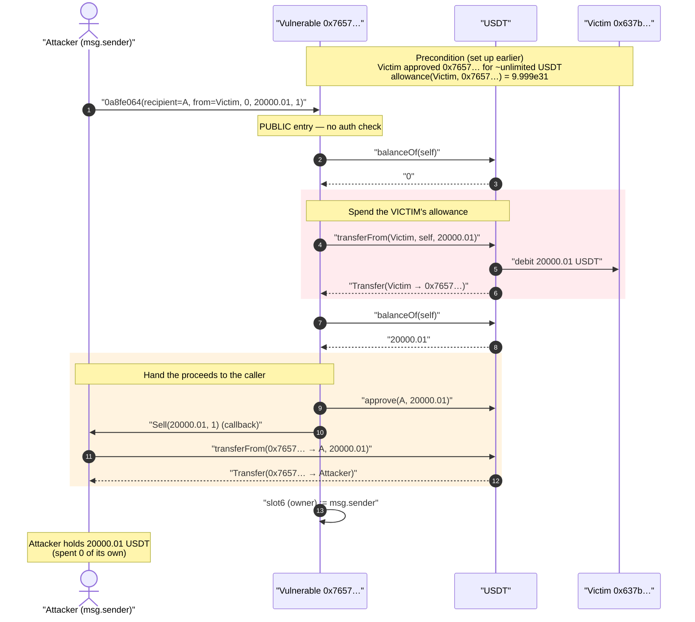
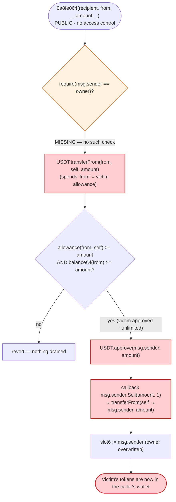
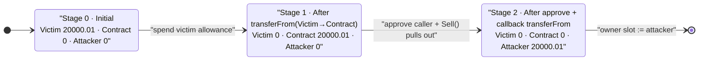

# Contract `0x7657…` Exploit — Permissionless `transferFrom`-Drain of Standing Approvals

> **Vulnerability classes:** vuln/access-control/missing-auth · vuln/logic/missing-allowance

> One-line summary: an unverified contract exposes a **public, unauthenticated** entry
> point (selector `0x0a8fe064`) that calls `USDT.transferFrom(victim → self)` for any
> address that had granted it an allowance, then hands the funds to `msg.sender` — letting
> anyone sweep the standing approvals of the contract's users.

> **Reproduction:** the PoC compiles & runs in an isolated Foundry project at
> [this project folder](.). Full verbose trace:
> [output.txt](output.txt). The PoC itself is
> [test/Contract_0x7657_exp.sol](test/Contract_0x7657_exp.sol).
>
> **Source caveat:** the vulnerable contract
> [`0x7657…CB77`](https://etherscan.io/address/0x76577603f99eae8320f70b410a350a83d744cb77)
> is **unverified** on Etherscan and has no published source. The mechanism below is
> reconstructed from (a) the `-vvvvv` execution trace, (b) on-chain reads via `cast`, and
> (c) targeted disassembly of the deployed runtime bytecode. The `sources/` directory is
> intentionally empty — there is no verified Solidity to quote.

---

## Key info

| | |
|---|---|
| **Loss (this PoC, fork block 17,511,177)** | **20,000.01 USDT** drained from the victim |
| **Loss (real incident, per DeFiHackLabs label)** | ~**$1,300 USDC** (victim held less at the real attack tx) |
| **Vulnerable contract** | unverified — [`0x76577603F99EAe8320F70B410a350a83D744CB77`](https://etherscan.io/address/0x76577603f99eae8320f70b410a350a83d744cb77) |
| **Token drained** | USDT — [`0xdAC17F958D2ee523a2206206994597C13D831ec7`](https://etherscan.io/address/0xdac17f958d2ee523a2206206994597c13d831ec7) |
| **Victim (approver)** | [`0x637b935CbA030Aeb876eae07Aa7FF637166de4D6`](https://etherscan.io/address/0x637b935cba030aeb876eae07aa7ff637166de4d6) |
| **Attacker EOA** | [`0x015d0b51d0a65ad11cf4425de2ec86a7b320db3f`](https://etherscan.io/address/0x015d0b51d0a65ad11cf4425de2ec86a7b320db3f) |
| **Attacker contract** | [`0xfe2011dad32ad6dfd128e55490c0fd999f3d2221`](https://etherscan.io/address/0xfe2011dad32ad6dfd128e55490c0fd999f3d2221) |
| **Attack tx** | [`0x74279a131dccd6479378b3454ea189a6ce350cce51de47d81a0ef23db1b134d5`](https://etherscan.io/tx/0x74279a131dccd6479378b3454ea189a6ce350cce51de47d81a0ef23db1b134d5) |
| **Chain / block / date** | Ethereum mainnet / 17,511,178 / 2023-06-19 03:40 UTC |
| **Compiler (PoC harness)** | Solidity 0.8.34 (the victim contract's own compiler is unknown — unverified) |
| **Bug class** | Missing access control — permissionless `transferFrom` of third-party allowances (approval-phishing drainer) |

---

## TL;DR

The contract at `0x7657…` holds a public function with selector `0x0a8fe064`. The function
takes five ABI words — `(address recipient, address from, uint256 _, uint256 amount, uint256 _)` —
and, **with no caller authentication of any kind**, executes:

1. `USDT.transferFrom(from, address(this), amount)` — pulling `amount` USDT out of `from` into
   the contract, relying on a **standing allowance** that `from` had previously granted to the
   contract.
2. `USDT.approve(msg.sender, amount)` — approving the caller to take everything that was just
   pulled in.
3. A callback into `msg.sender` (`Sell(amount, 1)`) during which the caller does
   `USDT.transferFrom(contract → msg.sender, amount)`, sweeping the funds out.
4. Writes `msg.sender` into storage slot `6` (an "owner"-style slot) as a side effect.

Because step 1 spends the **victim's** allowance and step 2/3 deliver the proceeds to the
**caller**, anyone who notices that a victim has approved this contract can drain that victim's
USDT for free. The victim `0x637b935C…` had granted the contract a near-infinite USDT allowance
(`9.999e31`), so the entire balance was takeable. In this PoC at the fork block the victim held
20,000.01 USDT and all of it was swept.

---

## Background — what the contract appears to be

`0x7657…` is an **unverified** drainer-style contract. Its public surface (recovered from the
bytecode dispatcher) routes a handful of selectors; the one the attacker uses, `0x0a8fe064`, is
**not present in the 4byte signature directory** — a hallmark of a bespoke / obfuscated entry
point rather than a standard ERC-20 or DeFi method.

What the bytecode and trace establish about `0x0a8fe064`:

- It internally constructs calls to the standard ERC-20 selectors `0x70a08231` (`balanceOf`),
  `0x23b872dd` (`transferFrom`) and `0x095ea7b3` (`approve`) — confirmed by `PUSH4` constants
  in the runtime ([disassembly](output.txt)).
- It executes a `CALLER` opcode and `SSTORE`s the result into slot `6`, i.e. it records
  `msg.sender` as the new "owner". Reading slot 6 at the fork block returns a *previous* owner
  `0x000…b986284c89cc9ca5427582222f5e1af4ea0ef99c`; the trace shows it overwritten with the
  attacker's address.
- It does **no** comparison of `CALLER` against any stored authority *before* doing the
  `transferFrom`/`approve`. The dispatcher jumps straight from the selector match at PC `0x41`
  to the function body at `0x0187` with no auth gate.

There is no honest "intended use" that this analysis can vouch for — the contract is unlabelled,
unverified, and the function is a generic "pull `from`'s approved tokens and forward them to the
caller" primitive. Whatever its author intended, **as deployed it lets any caller spend any
approver's allowance.**

---

## The vulnerable code

> The contract is unverified — there is no Solidity source to quote. The pseudocode below is the
> faithful reconstruction of selector `0x0a8fe064`, derived from the execution trace
> ([output.txt:1590-1620](output.txt)) and the
> runtime disassembly (dispatcher match at PC `0x41` → body `0x0187`; `CALLER`+`SSTORE` to slot 6
> at PC `0xc1d`/`0xc8b`).

```solidity
// selector 0x0a8fe064  —  PUBLIC, NO ACCESS CONTROL
function drain(
    address recipient,   // arg0 — where proceeds are sent (the caller passes itself)
    address from,        // arg1 — the VICTIM whose allowance is spent
    uint256 /*unused*/,  // arg2
    uint256 amount,      // arg3 — how much to pull
    uint256 /*unused*/   // arg4
) external {
    // (no onlyOwner / require(msg.sender == owner) before the value-moving calls)

    USDT.balanceOf(address(this));                       // == 0 here

    USDT.transferFrom(from, address(this), amount);      // ⚠️ spends VICTIM's standing allowance

    USDT.balanceOf(address(this));                       // == amount now

    USDT.approve(msg.sender, amount);                    // ⚠️ lets the CALLER take it all

    // callback into the caller; in the PoC this is Sell(amount, 1),
    // which does USDT.transferFrom(address(this) -> msg.sender, amount)
    msg.sender.Sell(amount, 1);                          // ⚠️ funds leave to the caller

    owner = msg.sender;                                  // slot 6 := msg.sender (side effect)
}
```

The attacker's side is trivial — it just receives the callback and pulls the approved funds:

[test/Contract_0x7657_exp.sol:46-49](test/Contract_0x7657_exp.sol#L46-L49):

```solidity
function Sell(uint256 _snipeID, uint256 _sellPercentage) external payable returns (bool) {
    // _snipeID is reused as the amount; selector 0x23b872dd == transferFrom
    address(USDT).call(abi.encodeWithSelector(bytes4(0x23b872dd), Contract_addr, address(this), _snipeID));
    return false;
}
```

And the single trigger that drives the whole drain
([test/Contract_0x7657_exp.sol:41-42](test/Contract_0x7657_exp.sol#L41-L42)):

```solidity
(bool success, bytes memory data) =
    Contract_addr.call(abi.encodeWithSelector(bytes4(0x0a8fe064), address(this), Victim, 0, Victim_balance, 1));
```

---

## Root cause — why it was possible

Two design facts compose into the loss:

1. **The value-moving function has no access control.** `0x0a8fe064` calls
   `transferFrom(from, …)` and `approve(msg.sender, …)` *before* (and entirely without) any
   `require(msg.sender == owner)` check. The only writeable "owner" slot (slot 6) is *set by*
   the function as a side effect, not *checked by* it — so even if there is an owner concept, it
   is `msg.sender`-overwritable and never gates the transfer. The dispatcher jumps from the
   selector match to the body with no guard in between.

2. **The function spends a third party's allowance.** The `from` address is an attacker-chosen
   parameter, and `transferFrom` succeeds for any `from` that has approved this contract. The
   victim `0x637b935C…` had granted the contract a near-infinite USDT allowance
   (`allowance(victim, contract) = 9.999e31` at the fork block), so an attacker can move the
   victim's *entire* balance.

In other words, this is the canonical **approval-phishing drainer** failure: a contract that
users have approved exposes an unauthenticated "pull from arbitrary `from`, deliver to
`msg.sender`" path. The standing allowance is the asset; the missing access check is the open
door. Anyone who races to call the function with `from = victim` collects the victim's tokens.

The contract being **unverified** is itself part of the story: users approved an opaque contract
whose only externally-reachable money-moving function turns out to be a free-for-all drainer.

---

## Preconditions

- **A victim with a standing allowance to the contract.** The exploit's entire input is the
  victim's allowance. Here `allowance(0x637b935C…, 0x7657…) ≈ 9.999e31` USDT — effectively
  unlimited — confirmed via `cast call` at block 17,511,177. Without a prior approval the
  `transferFrom` reverts and nothing is drained.
- **The victim holds a balance.** At the fork block the victim held 20,000.01 USDT; the PoC
  drains exactly that. (In the real on-chain incident the victim held less, hence the ~$1,300
  label.)
- **No capital required by the attacker.** The attacker spends none of its own tokens — it only
  needs to call the function and implement a `Sell` callback to receive the approved funds. The
  attack is a pure theft of pre-existing approvals.

---

## Step-by-step attack walkthrough (ground truth from the trace)

All values below are taken directly from [output.txt:1584-1624](output.txt).
`amount = 0x4a817ef10 = 20,000,010,000` (USDT has 6 decimals → 20,000.01 USDT).

| # | Action (trace line) | Concrete effect |
|---|---------------------|-----------------|
| 0 | **Setup** — read balances | Attacker USDT = `0`. Victim USDT = `20,000,010,000` (20,000.01). |
| 1 | Attacker → `Contract_addr.0a8fe064(self, Victim, 0, 20000010000, 1)` ([:1590](output.txt)) | Single permissionless call; args = `(recipient=attacker, from=Victim, _, amount, _)`. |
| 2 | `USDT.balanceOf(Contract_addr)` → `0` ([:1591](output.txt)) | Contract starts with zero USDT. |
| 3 | `USDT.transferFrom(Victim, Contract_addr, 20000010000)` ([:1593](output.txt)) | ⚠️ **Victim's standing allowance is spent.** 20,000.01 USDT moves Victim → contract. `Transfer(Victim→Contract)` emitted. |
| 4 | `USDT.balanceOf(Contract_addr)` → `20000010000` ([:1600](output.txt)) | Contract now holds the victim's funds. |
| 5 | `USDT.approve(attacker, 20000010000)` ([:1602](output.txt)) | ⚠️ Contract approves the **caller** for the full amount. |
| 6 | Callback `ContractTest.Sell(20000010000, 1)` ([:1607](output.txt)) | Caller's callback fires. |
| 7 | …inside `Sell`: `USDT.transferFrom(Contract_addr, attacker, 20000010000)` ([:1608](output.txt)) | ⚠️ Caller pulls the funds out using the fresh approval. `Transfer(Contract→Attacker)` emitted. |
| 8 | `Victim::fallback()` ([:1616](output.txt)) | No-op callback to victim address. |
| 9 | Storage slot `6`: `0x…b986284c…` → `0x…7FA9385b…` ([:1619](output.txt)) | "owner" overwritten with the attacker as a side effect. |
| 10 | Final `USDT.balanceOf(attacker)` → `20000010000` ([:1621](output.txt)) | **Attacker walked off with 20,000.01 USDT.** |

### Profit / loss accounting

| Party | USDT before | USDT after | Δ |
|---|---:|---:|---:|
| Victim `0x637b935C…` | 20,000.01 | 0 | **−20,000.01** |
| Attacker (test contract) | 0 | 20,000.01 | **+20,000.01** |
| Vulnerable contract `0x7657…` | 0 | 0 | 0 (pure pass-through) |

The attacker spent **zero** capital. Net profit = the full amount the victim's allowance + balance
allowed — 20,000.01 USDT in this PoC. (The DeFiHackLabs ~$1,300 figure reflects the smaller
balance the victim actually held at the real attack tx; the bug and the mechanism are identical.)

---

## Diagrams

### Sequence of the attack



### How the approval becomes theft



### Token balance state machine



---

## Remediation

1. **Add real access control to any function that calls `transferFrom(from, …)` for an
   attacker-chosen `from`.** Such a function must require `msg.sender == from` (a user can only
   move *their own* approved funds) or `msg.sender == trustedOwner`. Setting the owner as a
   *side effect* of the call (slot 6 := `msg.sender`) is meaningless — the check must happen
   *before* any value move and must compare against an authority that the caller cannot set in
   the same call.
2. **Never deliver `transferFrom` proceeds to `msg.sender`.** A function that pulls from `from`
   and forwards to the caller is a drainer by construction. Proceeds should go to `from`, to a
   fixed protocol address, or to a recipient that `from` authorized — never to whoever happened
   to call.
3. **For users / wallets: revoke stale and unlimited approvals.** The asset stolen here was the
   victim's standing `allowance`. Approve exact amounts, revoke after use, and never grant
   unlimited allowance to **unverified** contracts. The victim's `9.999e31` USDT approval is what
   turned a missing-check bug into a full-balance drain.
4. **Treat unverified contracts as hostile.** This contract published no source; its only
   reachable money-moving function was a free-for-all `transferFrom`. Wallet/UX layers should
   warn loudly before approving unverified bytecode.
5. **Use pull-payment / explicit-recipient patterns.** If a contract must move user funds, route
   them through a flow where the user signs/initiates and the recipient is fixed by the user, so
   a third party can never insert itself as the beneficiary.

---

## How to reproduce

The PoC is a standalone Foundry project (the umbrella DeFiHackLabs repo does not whole-compile):

```bash
_shared/run_poc.sh 2023-06-Contract_0x7657_exp --mt testExploit -vvvvv
```

- **RPC:** an Ethereum mainnet endpoint serving state at block `17,511,177` (the fork block,
  one before the attack). `foundry.toml` is configured for `mainnet`.
- **Result:** `[PASS] testExploit()` — the attacker's USDT balance goes from `0.000000` to
  `20000.010000`, proving the drain.

Expected tail:

```
Ran 1 test for test/Contract_0x7657_exp.sol:ContractTest
[PASS] testExploit() (gas: 115198)
Logs:
  Attacker USDT balance before attack: 0.000000
  Attacker USDT balance before attack: 20000.010000

Suite result: ok. 1 passed; 0 failed; 0 skipped; finished in 5.36s
```

(The PoC's second log line is mislabelled "before attack" in the source — it is actually the
attacker's balance *after* the drain, 20,000.01 USDT.)

---

*Reference: DeFiHackLabs — Contract `0x7657…` incident (Ethereum, ~$1,300 USDC). Vulnerable
contract is unverified; analysis reconstructed from the execution trace, on-chain reads, and
runtime-bytecode disassembly.*
