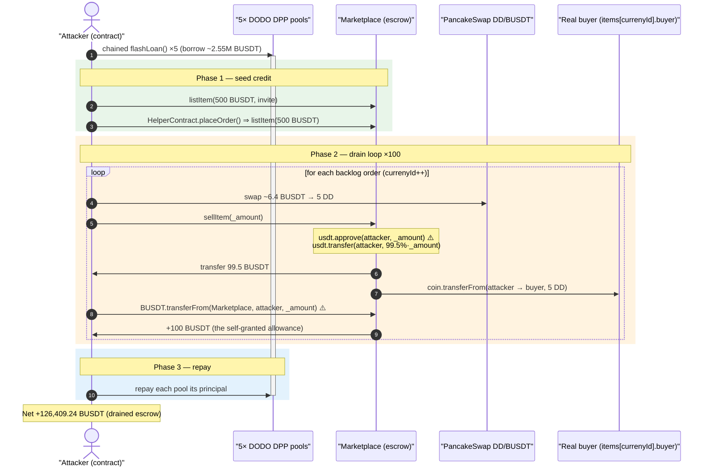
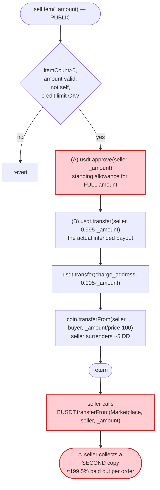
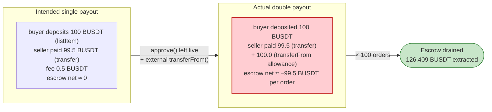

# DDCoin (DD) Marketplace Exploit — Self-Granted Allowance Lets the Seller Drain the Escrow Twice

> **Reproduction:** the PoC compiles & runs in an isolated Foundry project at
> [this project folder](.) (the umbrella DeFiHackLabs repo contains many
> unrelated PoCs that do not all compile together, so this one was extracted).
> Full verbose trace: [output.txt](output.txt).
> Verified vulnerable source: [Marketplace.sol](sources/Marketplace_b3a636/Marketplace.sol).

---

## Key info

| | |
|---|---|
| **Loss** | ~$300K reported; this reproduction nets **126,409.24 BUSDT** to the attacker in one transaction |
| **Vulnerable contract** | `Marketplace` — [`0xb3a636ac4c271e6CD962caD98Eae9Cf71f5A49c8`](https://bscscan.com/address/0xb3a636ac4c271e6cd962cad98eae9cf71f5a49c8#code) |
| **Victim / value source** | The marketplace's own BUSDT escrow (funded by all users' buy-orders) |
| **Drained token** | BUSDT — [`0x55d398326f99059fF775485246999027B3197955`](https://bscscan.com/token/0x55d398326f99059fF775485246999027B3197955) |
| **DD token / DEX pool** | DD `0x50ab0D88045F540b8B79C8A7Dc25790dB493BBC5`; DD/BUSDT PancakePair `0x976cfB9e0447D86f1e4c835c66062CAe113AF404` |
| **Attacker EOA** | [`0x0a3fee894eb8fcb6f84460d5828d71be50612762`](https://bscscan.com/address/0x0a3fee894eb8fcb6f84460d5828d71be50612762) |
| **Attacker contract** | [`0x105e9b0266ae0ae670b7fe9af08cf32049f0dd21`](https://bscscan.com/address/0x105e9b0266ae0ae670b7fe9af08cf32049f0dd21) |
| **Attack tx** | [`0xd92bf51b9bf464420e1261cfcd8b291ee05d5fbffbfbb316ec95131779f80809`](https://bscscan.com/tx/0xd92bf51b9bf464420e1261cfcd8b291ee05d5fbffbfbb316ec95131779f80809) |
| **Chain / fork block / date** | BSC / 28,714,107 / ~June 1, 2023 |
| **Compiler** | Solidity v0.8.19, optimizer 1 run, 200 runs |
| **Bug class** | Broken accounting — contract approves the seller for the full sale amount **and then transfers it too**, so an external `transferFrom` lets the seller pull the same money twice |

---

## TL;DR

`Marketplace.sellItem()` pays a seller in two pieces of code that should be mutually
exclusive but are not:

```solidity
usdt.approve(msg.sender, _amount);                       // (A) grant seller an allowance for the FULL amount
usdt.transfer(msg.sender, _amount * (1000-charge)/1000); // (B) ALSO send the seller 99.5% of it
```

([Marketplace.sol:352-353](sources/Marketplace_b3a636/Marketplace.sol#L352-L353))

Step (B) already pays the seller. Step (A) additionally leaves a standing
`allowance(Marketplace → seller) = _amount` that is **never consumed inside the
contract**. The seller simply calls `BUSDT.transferFrom(Marketplace, seller, _amount)`
afterwards and walks off with a *second* copy of the same money.

Each `sellItem` therefore drains roughly **199.5%** of the order's value out of the
marketplace's escrow, while the seller only has to surrender a few dollars' worth of
DD token (bought cheaply on PancakeSwap). The escrow holds BUSDT that *all* users
deposited via `listItem`, so the attacker is spending everyone else's money.

The attacker stacks five DODO `flashLoan`s to borrow ~2.55M BUSDT of working capital,
loops `sellItem` over 100 pre-existing buy-orders, repays the loans, and keeps the
net **126,409.24 BUSDT** profit — all in a single atomic transaction.

---

## Background — what the Marketplace does

`Marketplace` ([source](sources/Marketplace_b3a636/Marketplace.sol)) is an OTC-style
order book that brokers trades between BUSDT and the DD token (`coin`):

- **Buyers** call `listItem(_amount, invite)`
  ([:245-278](sources/Marketplace_b3a636/Marketplace.sol#L245-L278)). The contract
  pulls `_amount` BUSDT from the buyer (`usdt.transferFrom(msg.sender, address(this), _amount)`,
  [:275](sources/Marketplace_b3a636/Marketplace.sol#L275)) and records a `Listing` with
  a fixed `new_price` (2000, i.e. "20.00" after the `/100` display scaling). The
  BUSDT collected here is the escrow pool that later sellers are paid out of.
- **Sellers** call `sellItem(_amount)`
  ([:332-360](sources/Marketplace_b3a636/Marketplace.sol#L332-L360)). The contract
  pays the seller BUSDT and, in return, pulls DD from the seller and forwards it to the
  matched buyer (`coin.transferFrom(msg.sender, listedItem.buyer, _amount/price*100)`,
  [:357](sources/Marketplace_b3a636/Marketplace.sol#L357)).
- An **invite / credit-limit** system (`inviteLimit`, `getLimit`, `sellAmount`,
  [:289-330](sources/Marketplace_b3a636/Marketplace.sol#L289-L330)) is supposed to cap
  how much a given address may sell. In practice it is trivially satisfied (see
  Preconditions) and is not the line of defense that matters.

On-chain state at the fork block (read from the trace):

| Fact | Value |
|---|---|
| `currenyId` (next buy-order to match against) | starts at **351** |
| `itemCount` | 762 → grows as attacker lists |
| Fixed listing `price` on every matched order | **2000** |
| `charge` (fee, /1000) | **5** (0.5%) |
| DD/BUSDT pool reserves (`getReserves`) | `reserve0 = 445,155 DD`, `reserve1 = 569,065 BUSDT` ⇒ DD ≈ 1.28 BUSDT |
| DD pulled per matched 100-BUSDT order | `100e18 / 2000 * 100 = 5 DD` (~6.4 BUSDT cost) |

The matched buy-orders 351, 352, 353 … were created by **real users**
(buyers `0x8617…`, `0x5354…`, `0x3b48…`, etc., visible in the `items()` returns), each
of whom had deposited BUSDT. That deposited BUSDT is exactly what the attacker steals.

---

## The vulnerable code

### `sellItem` — pays the seller twice over

```solidity
function sellItem(uint256 _amount) external returns(SellListing memory ){
    require(itemCount > 0 && currenyId <= itemCount,"Not buy order");
    require(_amount % amount_double_sell == 0 && _amount > 0 && _amount <= amount_max_sell,"Illegal amount ");
    require(items[currenyId].buyer != msg.sender,"Cannot sell to oneself");
    require(limitAmount[msg.sender] + getLimit() + inviteLimit[msg.sender] - sellAmount[msg.sender] >= _amount,
            "Insufficient credit limit");
    Listing memory listedItem = items[currenyId];
    uint256 index = currenyId;
    if(_amount >= listedItem.amount){
        _amount = listedItem.amount;               // clamp to the order size
        items[currenyId].amount = 0;
        currenyId++;                               // advance to the next victim order
    }else{
        items[currenyId].amount -= _amount;
    }
    ...
    usdt.approve(msg.sender, _amount);                         // ⚠️ (A) standing allowance for the FULL amount
    usdt.transfer(msg.sender, _amount * (1000-charge)/1000);   // ⚠️ (B) ALSO pays 99.5% of the amount
    if(charge>0){
        usdt.transfer(charge_address, _amount * charge/1000);  // 0.5% fee
    }
    coin.transferFrom(msg.sender, listedItem.buyer, (_amount/listedItem.price * 100)); // seller surrenders DD
    emit ItemSell(msg.sender, listedItem.buyer, listedItem.price, _amount);
    return sell;
}
```

([Marketplace.sol:332-360](sources/Marketplace_b3a636/Marketplace.sol#L332-L360))

The intended payout is **only** line (B) — 99.5% of `_amount` in BUSDT. Line (A)
appears to be leftover/erroneous code (perhaps a copy of the `pay()`/`payCoin()`
pattern at [:364-371](sources/Marketplace_b3a636/Marketplace.sol#L364-L371), which also
pointlessly `approve`s `msg.sender` before transferring). Here it is actively harmful:
the allowance is **never spent by the contract itself**, so it survives the call as a
free claim ticket. Any seller can immediately do:

```solidity
BUSDT.transferFrom(address(Marketplace), seller, _amount); // collect the second copy
```

There is no reentrancy guard, no "amount already paid" bookkeeping, and no netting of
the approval against the transfer. The double payout is a pure accounting defect, not a
timing/reentrancy trick.

---

## Root cause — why it was possible

A correct escrow pays a seller **once**. `sellItem` instead performs two independent
value-release primitives against the same `_amount`:

1. **A push** — `usdt.transfer(seller, 0.995·_amount)` (the legitimate payout), and
2. **A pull grant** — `usdt.approve(seller, _amount)` (an allowance the seller can
   redeem at will).

Because BUSDT is a standard ERC20, the allowance from (2) is fully usable by the seller
from *any* context, including a follow-up call in the same transaction. The contract
never deducts, zeroes, or consumes that allowance, so the marketplace effectively
hands the seller `0.995·_amount` **plus** a voucher for another `1.0·_amount`.

The only thing the seller gives back is `_amount/price·100` DD tokens — at `price = 2000`
that is `5 DD` per 100-BUSDT order, worth ~6.4 BUSDT on PancakeSwap. So every matched
order is a guaranteed `≈ 199.5% − ~6.4%` profit on the order's face value, paid out of
*other users'* escrowed BUSDT.

Three design facts compose into the full drain:

1. **Permissionless `sellItem`.** Anyone can sell against the oldest open buy-order
   (`currenyId`), and `currenyId++` walks forward through the entire backlog of real
   user orders. The attacker just needs to satisfy the credit-limit `require`.
2. **The escrow is communal.** `listItem` deposits from every buyer accumulate in the
   one contract balance; `sellItem` pays out of that shared pot with no per-order
   solvency check. The attacker drains the *aggregate* deposits, not just their own.
3. **DD is cheap and liquid.** The DD the seller must surrender is a few dollars and is
   bought on the fly from the DD/BUSDT pool, so the "cost" side of each cycle is
   negligible relative to the doubled BUSDT payout.

---

## Preconditions

- **Open buy-orders exist** (`currenyId <= itemCount`) — true: the book had real
  orders from index 351 upward.
- **The `"Cannot sell to oneself"` check** ([:335](sources/Marketplace_b3a636/Marketplace.sol#L335))
  is satisfied because the matched `items[currenyId].buyer` is a *real third-party user*,
  not the attacker.
- **The credit-limit `require`** ([:336](sources/Marketplace_b3a636/Marketplace.sol#L336))
  must pass. The attacker seeds it cheaply: it calls `listItem(500e18, …)` twice (once
  directly, once via a `HelperContract` to dodge the one-order-per-day guard
  `getOrderByDay()`, [:295-304](sources/Marketplace_b3a636/Marketplace.sol#L295-L304)).
  Listing also threads the invite graph (`caclInviteLimit` → `inviteLimit`,
  [:289-310](sources/Marketplace_b3a636/Marketplace.sol#L289-L310)), and as the attacker
  records sells the `getLimit()`/`inviteLimit` accumulators stay ahead of `sellAmount`.
  In the trace **no `sellItem` call ever reverts** with "Insufficient credit limit", so
  this gate is not a real obstacle.
- **Working capital in BUSDT** to (a) front the small DD swaps and (b) the few listing
  deposits. The attacker borrows it via five chained DODO `flashLoan`s totalling
  ~2,549,459 BUSDT and repays them at the end of the same transaction — so the attack is
  effectively **zero-capital / flash-loan-funded**.

---

## Attack walkthrough (with on-chain numbers from the trace)

All figures below are read directly from [output.txt](output.txt).

### Phase 0 — borrow working capital (nested DODO flash loans)

`testExploit` opens `DPPOracle1.flashLoan` ([test/DDCoin_exp.sol:81](test/DDCoin_exp.sol#L81)),
whose callback recursively opens the next pool, stacking five loans before doing any work
([test/DDCoin_exp.sol:88-97](test/DDCoin_exp.sol#L88-L97)):

| DODO pool | BUSDT borrowed |
|---|---:|
| DPPOracle1 `0xFeAFe2…` | 335,491.77 |
| DPPOracle2 `0x9ad32e…` | 1,152,951.72 |
| DPPOracle3 `0x26d0c6…` | 725,047.22 |
| DPP `0x6098A5…` | 105,535.61 |
| DPPAdvanced `0x81917e…` | 230,433.70 |
| **Total** | **≈ 2,549,459.02** |

### Phase 1 — seed the attacker's credit / orders

| # | Action | Effect |
|---|--------|--------|
| 1 | `listItem(500e18, addrToInvite)` ([test/DDCoin_exp.sol:104](test/DDCoin_exp.sol#L104)) | deposits 500 BUSDT, registers attacker in the invite graph |
| 2 | deploy `HelperContract`, send it 500 BUSDT, call `placeOrder()` ([test/DDCoin_exp.sol:109-112](test/DDCoin_exp.sol#L109-L112)) | a second `listItem(500e18, attacker)` from a fresh address, bypassing the 1-order-per-day cap |

### Phase 2 — the drain loop (100 iterations)

For each iteration ([test/DDCoin_exp.sol:116-124](test/DDCoin_exp.sol#L116-L124)) against
the next real buy-order (`currenyId` = 351, 352, 353 …):

| Step | Code | Concrete values (order 351, `amount = 100 BUSDT`, `price = 2000`) |
|---|---|---|
| a | read `items(currenyId)` totalAmount | `totalAmount = 100e18` |
| b | `swapBUSDTToDD(totalAmount/20)` → buy DD | swap **6.41 BUSDT → 5 DD** on PancakeSwap |
| c | `sellItem(totalAmount)` | see breakdown below |
| d | `BUSDT.transferFrom(Marketplace, attacker, allowance)` | pulls the **100 BUSDT** allowance left by step (A) |

Inside `sellItem(100e18)` the trace shows, in order:

1. `BUSDT.approve(attacker, 100e18)` — the standing allowance (the bug).
2. `BUSDT.transfer(attacker, 99.5e18)` — 99.5% payout.
3. `BUSDT.transfer(charge_address 0xF84E…, 0.5e18)` — 0.5% fee.
4. `DD.transferFrom(attacker, buyer 0x8617…, 5e18)` — attacker surrenders 5 DD.
5. (back in the PoC) `allowance(Marketplace, attacker) = 100e18` → `transferFrom(Marketplace → attacker, 100e18)`.

Per 100-BUSDT order the attacker therefore:

| Flow | BUSDT |
|---|---:|
| received via `transfer` (99.5%) | +99.50 |
| received via the self-granted `transferFrom` | +100.00 |
| spent buying 5 DD on PancakeSwap | −6.41 |
| **net per order** | **≈ +193.09** |

The marketplace pays out ~199.5 BUSDT per order but only ever collected ~100 BUSDT from
that order's buyer — the ~99.5 BUSDT shortfall is drained from the *communal escrow*
funded by all the other users' deposits (and temporarily topped up by the flash loan).

### Phase 3 — repay and pocket the difference

After 100 iterations the callbacks unwind, repaying each DODO pool its principal
(`BUSDT.transfer(msg.sender, quoteAmount)`, [test/DDCoin_exp.sol:127](test/DDCoin_exp.sol#L127)).
Whatever remains is profit.

---

## Profit / loss accounting (BUSDT)

| | Value |
|---|---:|
| Attacker BUSDT before | 0.00 |
| Attacker BUSDT after | **126,409.24** |
| **Net profit (this reproduction)** | **+126,409.24 BUSDT** |

(The live incident is reported at ~$300K; the reproduction's profit depends on how many
backlog orders are looped — the PoC caps the loop at 100 iterations
[test/DDCoin_exp.sol:116](test/DDCoin_exp.sol#L116) "to precisely stick to the final
stolen BUSDT amount".) The flash-loaned ~2.55M BUSDT is fully repaid intra-transaction;
the profit is pure extraction from the marketplace's escrow.

---

## Diagrams

### Sequence of the attack



### Where the double-spend happens inside `sellItem`



### Escrow balance: intended vs. actual per order



---

## Remediation

1. **Delete the stray `approve`.** Line (A) `usdt.approve(msg.sender, _amount)` in
   `sellItem` ([:352](sources/Marketplace_b3a636/Marketplace.sol#L352)) serves no purpose
   — the contract pushes the payout itself in line (B). Removing it eliminates the bug
   entirely. The same dead `approve(msg.sender, …)` pattern in `pay()` and `payCoin()`
   ([:364-371](sources/Marketplace_b3a636/Marketplace.sol#L364-L371)) should be removed
   too; granting an allowance to the recipient of a `transfer` is always either redundant
   or dangerous.
2. **Never leave self-granted allowances.** As a defensive invariant, the contract should
   never hold a non-zero `usdt.allowance(address(this), anyUser)` after a function
   returns. If an internal allowance is genuinely needed for a sub-call, it must be set
   and reset (`approve(x); …; approve(0)`) within the same call.
3. **Enforce per-order solvency / single-payout accounting.** Track paid-out amounts so a
   single order cannot release more than it collected, and reject `sellItem` if it would
   pay out more than the matched order's escrowed deposit.
4. **Add a reentrancy guard / checks-effects-interactions ordering.** While this specific
   exploit needs no reentrancy, the contract performs multiple external token calls after
   state mutation; a `nonReentrant` guard and strict ordering harden it against related
   patterns.
5. **Reconsider the communal-escrow design.** Paying sellers out of an aggregate pool with
   no per-order isolation means any single payout bug socializes the loss across all
   users. Isolate each buy-order's funds, or settle buyer↔seller atomically without a
   pooled balance.

---

## How to reproduce

The PoC was extracted into a standalone Foundry project (the umbrella DeFiHackLabs repo
does not whole-compile under `forge test`):

```bash
_shared/run_poc.sh 2023-06-DDCoin_exp -vvvvv
```

- RPC: a **BSC archive** endpoint is required (fork block 28,714,107 is old; most public
  BSC RPCs prune that state and fail with `header not found` / `missing trie node`).
- Runtime is long (~7 min) because of the 100-iteration drain loop with full `-vvvvv`
  tracing.

Expected tail:

```
Ran 1 test for test/DDCoin_exp.sol:DDTest
[PASS] testExploit() (gas: 33819965)
Logs:
  BUSDT attacker balance before exploit: 0.000000000000000000
  BUSDT attacker balance after exploit: 126409.238724569852974088

Suite result: ok. 1 passed; 0 failed; 0 skipped
```

---

*Reference: DDCoin / DD marketplace hack, BSC, June 2023 (~$300K). Analyses:
[ImmuneBytes](https://twitter.com/ImmuneBytes/status/1664239580210495489),
[ChainAegis](https://twitter.com/ChainAegis/status/1664192344726581255).*
