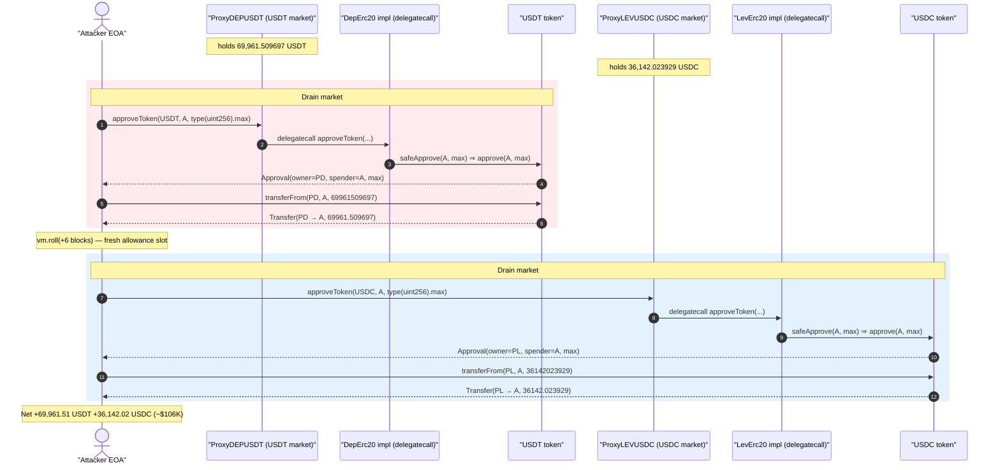
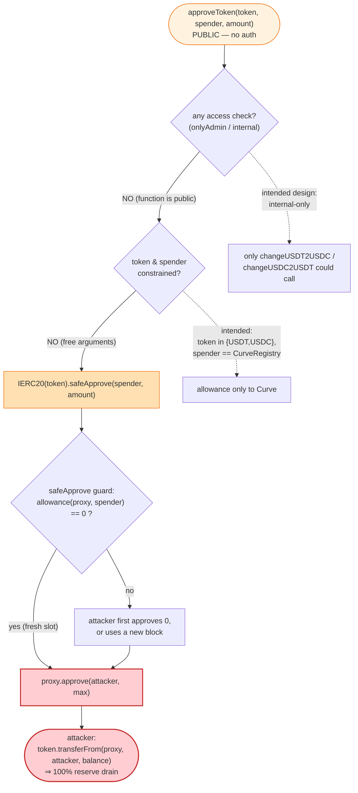
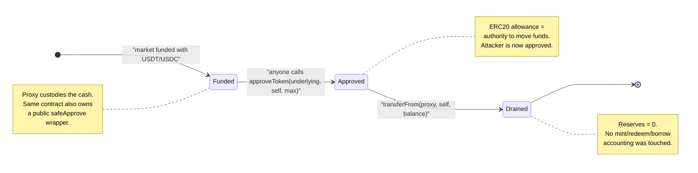

# Vortex DEPUSDT / LEVUSDC Exploit — Public `approveToken()` → Arbitrary Reserve Drain

> **Reproduction:** the PoC compiles & runs in this isolated Foundry project at
> [this project folder](.) (the umbrella DeFiHackLabs repo contains many unrelated PoCs that do
> not whole-compile under `forge test`, so this one was extracted).
> Full verbose trace: [output.txt](output.txt).
> Verified vulnerable source: [contracts_CurveSwap.sol](sources/DepErc20_942901/contracts_CurveSwap.sol).

---

## Key info

| | |
|---|---|
| **Loss** | ~$106K — **69,961.509697 USDT** (from the DEPUSDT market) + **36,142.023929 USDC** (from the LEVUSDC market) |
| **Vulnerable contract** | `CurveSwap.approveToken()`, inherited by the `DepErc20` / `LevErc20` money-market implementations |
| **DEPUSDT market (proxy / impl)** | proxy [`0x7b190a928Aa76EeCE5Cb3E0f6b3BdB24fcDd9b4f`](https://etherscan.io/address/0x7b190a928aa76eece5cb3e0f6b3bdb24fcdd9b4f) → impl `DepErc20` [`0x94290106D2A32Bc89BE9f1c3a3f3394F64578AA6`](https://etherscan.io/address/0x94290106D2A32Bc89BE9f1c3a3f3394F64578AA6#code) |
| **LEVUSDC market (proxy / impl)** | proxy [`0x2a2b195558cF89AA617979ce28880BbF7e17bc45`](https://etherscan.io/address/0x2a2b195558cf89aa617979ce28880bbf7e17bc45) → impl `LevErc20` [`0x27C55a6bd85e79C70C9B2CAA003D55A2EcE01565`](https://etherscan.io/address/0x27C55a6bd85e79C70C9B2CAA003D55A2EcE01565#code) |
| **Underlying drained** | USDT `0xdAC17F958D2ee523a2206206994597C13D831ec7`, USDC `0xA0b86991c6218b36c1d19D4a2e9Eb0cE3606eB48` |
| **Attacker (analysis-cited)** | EOA / contract per Numen Cyber writeup; PoC uses the test harness as the attacker |
| **Attack tx (DEPUSDT)** | `0xf0a13b445674094c455de9e947a25bade75cac9f5176695fca418898ea25742f` |
| **Attack tx (LEVUSDC)** | `0x800a5b3178f680feebb81af69bd3dff791b886d4ce31615e601f2bb1f543bb2e` |
| **Chain / block / date** | Ethereum mainnet / fork at 17,484,161 / June 16, 2023 |
| **Compiler** | impl `v0.8.15+commit.e14f2714`, optimizer **200 runs** (proxy `v0.8.9`) |
| **Bug class** | Missing access control — `public` token-approval helper callable by anyone, with attacker-controlled token + spender |

---

## TL;DR

The Vortex lending markets (`DepErc20` for USDT, `LevErc20` for USDC) inherit a Curve-swap helper
`CurveSwap` that exposes:

```solidity
function approveToken(address token, address spender, uint _amount) public returns (bool) {
    IERC20(token).safeApprove(spender, _amount);
    return true;
}
```
([contracts_CurveSwap.sol:60-63](sources/DepErc20_942901/contracts_CurveSwap.sol#L60-L63))

This function is **`public` with no `onlyAdmin` / `internal` restriction**, and every parameter is
attacker-controlled. Because the market proxy contract is the holder of the protocol's underlying
cash (real USDT / USDC), an attacker simply calls:

1. `proxy.approveToken(USDT, attacker, type(uint256).max)` — the **proxy approves the attacker** to
   spend its USDT.
2. `USDT.transferFrom(proxy, attacker, proxy.balanceOf())` — the attacker pulls the entire balance.

Repeat against the USDC (`LevErc20`) market. The PoC drains **69,961.509697 USDT** and
**36,142.023929 USDC** in one shot each, with no flash loan and no capital — the only "trick" is a
one-block `vm.roll` between the two markets so the second `safeApprove` starts from a zero allowance.

---

## Background — what the Vortex markets are

Vortex is a Compound-style lending protocol. Each market is a cToken-like wrapper around an
underlying stablecoin:

- `DepErc20` ([source](sources/DepErc20_942901/contracts_DepErc20.sol)) is the "deposit" market whose
  underlying is **USDT**.
- `LevErc20` ([source](sources/LevErc20_27C55a/contracts_LevErc20.sol)) is the "leverage" market whose
  underlying is **USDC**.

Both are deployed behind OpenZeppelin `TransparentUpgradeableProxy` contracts, so user-facing calls
land on the proxy address (which custodies the cash) and `delegatecall` into the implementation logic.

The implementation inheritance chain is:

```
DepErc20  is DepToken
DepToken  is DepTokenInterface, DepositWithdraw, CurveSwap, ExponentialNoError, TokenErrorReporter, Initializable
                                              └── CurveSwap.approveToken()  ← public, unguarded
```
([contracts_DepToken.sol:23](sources/DepErc20_942901/contracts_DepToken.sol#L23), confirmed identically
for `LevToken` at [contracts_LevToken.sol:18](sources/LevErc20_27C55a/contracts_LevToken.sol#L18))

`CurveSwap` exists so the market can swap USDT↔USDC on Curve's 3pool (`changeUSDT2USDC` /
`changeUSDC2USDT` at [contracts_CurveSwap.sol:46-58](sources/DepErc20_942901/contracts_CurveSwap.sol#L46-L58)).
Those internal swap routines need to set an ERC20 allowance for the Curve `Registry`, and the author
factored that out into `approveToken(...)`. The fatal mistake: that helper was left **`public`** and
generic over `(token, spender, amount)` instead of being `internal` or hard-coded to the Curve
registry.

The proxy/cash balances at the fork block (read directly in the trace):

| Market | Underlying | Proxy balance |
|---|---|---|
| DEPUSDT (`0x7b19…`) | USDT (6 dp) | `69961509697` = **69,961.509697 USDT** |
| LEVUSDC (`0x2a2b…`) | USDC (6 dp) | `36142023929` = **36,142.023929 USDC** |

---

## The vulnerable code

### The unguarded approval helper

```solidity
contract CurveSwap is CurveContractInterface {
    using SafeERC20 for IERC20;
    ...
    function changeUSDT2USDC(uint _amount, uint _expected, address _receiver) virtual internal returns (uint256) {
        address Registry = QueryAddressProvider(2);
        approveToken(USDT_ADDRESS, Registry, _amount);   // ← legitimate caller
        ...
    }

    function approveToken(address token, address spender, uint _amount) public returns (bool) {
        IERC20(token).safeApprove(spender, _amount);     // ⚠️ token & spender fully attacker-controlled
        return true;
    }
}
```
[contracts_CurveSwap.sol:46-63](sources/DepErc20_942901/contracts_CurveSwap.sol#L46-L63)

Two independent defects compound here:

1. **No access control.** The only legitimate caller is the internal `changeUSDT2USDC` /
   `changeUSDC2USDT` swap path, yet the function is `public`. It should have been `internal`. There is
   no `require(msg.sender == admin)`, no `onlyOwner`, nothing.
2. **No parameter constraint.** Even if it had to be public for some reason, `token` and `spender` are
   free arguments. A safe version would hard-bind `token ∈ {USDT, USDC}` and `spender == CurveRegistry`.
   As written, the caller can make the contract approve **any** ERC20 to **any** address.

### `safeApprove`'s zero-allowance precondition (why the PoC rolls a block)

```solidity
function safeApprove(IERC20 token, address spender, uint256 value) internal {
    require(
        (value == 0) || (token.allowance(address(this), spender) == 0),
        "SafeERC20: approve from non-zero to non-zero allowance"
    );
    _callOptionalReturn(token, abi.encodeWithSelector(token.approve.selector, spender, value));
}
```
[contracts_vendor_interfaces_SafeERC20.sol:45-58](sources/DepErc20_942901/contracts_vendor_interfaces_SafeERC20.sol#L45-L58)

OZ's `safeApprove` only allows a non-zero approval when the current allowance is **0**. In the trace
each market's existing `allowance(proxy, attacker)` is `0` (lines 26-27 for USDT, 47-50 for USDC), so
the `type(uint256).max` approval sails through. This is the only reason the two drains were separated
(distinct allowance slots / blocks), not a real obstacle.

---

## Root cause — why it was possible

The market contract is simultaneously:

- the **custodian** of real user funds (USDT/USDC sit in the proxy's balance), and
- the **owner** of a `public`, parameter-generic `safeApprove` wrapper.

Allowance is the ERC20 authority primitive: whoever the token-holder approves can move its tokens.
By exposing `approveToken(token, spender, amount)` publicly, the protocol handed *every* caller the
ability to make the fund-custodian approve them for an arbitrary amount of an arbitrary token. Once
`approve(attacker, max)` is set, a plain `transferFrom(proxy, attacker, balance)` exfiltrates the cash.
The lending protocol's own access-controlled deposit/borrow/redeem accounting is entirely bypassed —
the attacker never touches `mint`, `redeem`, or `borrow`; it goes straight to the ERC20 allowance layer.

The semantic invariant that was broken: *"a market only ever grants ERC20 allowances on its underlying
to the Curve registry, and only as a transient step inside an internal swap."* `approveToken` being
`public` with free `token`/`spender` violates that invariant unconditionally.

---

## Preconditions

- The market proxy holds a non-zero balance of its underlying stablecoin (it did: 69,961 USDT /
  36,142 USDC). This is the normal state of a funded lending market's cash reserves.
- `allowance(proxy, attacker) == 0` for the chosen `(token, spender)` pair, so OZ `safeApprove` permits
  a fresh non-zero approval. Trivially true for any address the protocol never approved before.
- **No capital, no flash loan, no special role.** Any EOA can execute the full drain.

---

## Step-by-step attack walkthrough (ground-truth from the trace)

The PoC ([test/DEPUSDT_LEVUSDC_exp.sol](test/DEPUSDT_LEVUSDC_exp.sol)) runs the attack twice, once per
market. `ContractTest` (address `0x7FA9…1496`) is the attacker. All numbers below are taken verbatim
from [output.txt](output.txt).

| # | Action | Call (from trace) | Result |
|---|--------|-------------------|--------|
| 0 | **Fork** mainnet @ 17,484,161 | `setUp()` | Markets funded; attacker holds 0. |
| 1 | **Self-approve the USDT market** | `ProxyDEPUSDT.approveToken(USDT, attacker, type(uint256).max)` → delegatecalls `DepErc20::approveToken` → `USDT.approve(attacker, 2^256-1)` | `Approval(owner: ProxyDEPUSDT, spender: attacker, value: max)` emitted; allowance slot `…074e: 0 → 0xff…ff`. |
| 2 | **Read victim's USDT balance** | `USDT.balanceOf(ProxyDEPUSDT)` | `69961509697` (= 69,961.509697 USDT). |
| 3 | **Drain USDT** | `USDT.transferFrom(ProxyDEPUSDT, attacker, 69961509697)` | `Transfer(ProxyDEPUSDT → attacker, 69961509697)`; proxy USDT balance → 0. |
| 4 | **Advance one block** | `vm.roll(17_484_167)` | Mirrors the two separate live txs; keeps USDC allowance fresh. |
| 5 | **Self-approve the USDC market** | `ProxyLEVUSDC.approveToken(USDC, attacker, type(uint256).max)` → delegatecalls `LevErc20::approveToken` → `USDC.approve(attacker, 2^256-1)` | `Approval(owner: ProxyLEVUSDC, spender: attacker, value: max)`. |
| 6 | **Read victim's USDC balance** | `USDC.balanceOf(ProxyLEVUSDC)` | `36142023929` (= 36,142.023929 USDC). |
| 7 | **Drain USDC** | `USDC.transferFrom(ProxyLEVUSDC, attacker, 36142023929)` | `Transfer(ProxyLEVUSDC → attacker, 36142023929)`; proxy USDC balance → 0. |
| 8 | **Confirm loot** | `balanceOf(attacker)` for both | DEPUSDT 69,961.509697 USDT; LEVUSDC 36,142.023929 USDC. |

> Note on naming: in the PoC the constant named `DEPUSDT` is the **USDT** token address and `LEVUSDC`
> is the **USDC** token address. The *markets* are the `ProxyDEPUSDT` / `ProxyLEVUSDC` contracts that
> custody those underlyings. USDC is itself a proxy, hence the inner `delegatecall` into
> `0xa2327a938…` (USDC's implementation) visible in the trace at lines 48-65.

### Profit / loss accounting

| Underlying | Stolen (raw, 6 dp) | Stolen (human) | Approx. USD |
|---|---:|---:|---:|
| USDT (DEPUSDT market) | 69,961,509,697 | 69,961.509697 USDT | ~$69,961 |
| USDC (LEVUSDC market) | 36,142,023,929 | 36,142.023929 USDC | ~$36,142 |
| **Total** | — | — | **~$106,103** |

Attacker cost: **0** (only gas). The stolen balances equal the markets' entire cash reserves at that
block — a 100% drain of available USDT/USDC liquidity from both proxies.

---

## Diagrams

### Sequence of the attack



### Why the approval is the whole exploit



### Where the funds custody and the exposed helper collide



---

## Remediation

1. **Make `approveToken` `internal`.** Its only legitimate callers are `changeUSDT2USDC` /
   `changeUSDC2USDT`. Changing `public` → `internal` removes the external attack surface entirely:
   ```solidity
   - function approveToken(address token, address spender, uint _amount) public returns (bool) {
   + function approveToken(address token, address spender, uint _amount) internal returns (bool) {
   ```
2. **Constrain the parameters.** If a callable approval is genuinely required, hard-bind the token and
   spender set: `require(token == USDT_ADDRESS || token == USDC_ADDRESS); require(spender == QueryAddressProvider(2));`
   so the contract can only ever approve the Curve registry for its own underlyings.
3. **Add access control to any privileged helper.** Functions that touch the contract's custody
   (approvals, sweeps, swaps) must be `onlyAdmin` / `onlyOwner` at minimum.
4. **Don't co-locate custody and generic approval logic.** A contract that holds user funds should
   never expose a primitive that can set an arbitrary allowance on those funds. Route swap approvals
   through a dedicated, fund-less router, or grant exact-amount, just-in-time approvals inside the swap
   call only.
5. **Audit the full inherited surface of upgradeable implementations.** The bug entered through a
   base contract (`CurveSwap`) far from the user-facing `DepErc20`/`LevErc20`; reviewing only the
   leaf contract would have missed it.

---

## How to reproduce

The PoC was extracted into this standalone Foundry project (the umbrella DeFiHackLabs repo does not
whole-compile under `forge test`):

```bash
_shared/run_poc.sh 2023-06-DEPUSDT_LEVUSDC_exp --mt testApprove -vvvvv
```

- RPC: a mainnet **archive** endpoint is required (fork block 17,484,161 is from June 2023). The
  project's `foundry.toml` `mainnet` alias must point at an archive node serving historical state, else
  the fork fails with `header not found` / `missing trie node`.
- Result: `[PASS] testApprove()` draining both markets.

Expected tail:

```
Ran 1 test for test/DEPUSDT_LEVUSDC_exp.sol:ContractTest
[PASS] testApprove() (gas: 192167)
Logs:
  Attacker DEPUSDT balance after hack: 69961.509697
  Attacker LEVUSDC balance after hack: 36142.023929

Suite result: ok. 1 passed; 0 failed; 0 skipped
```

---

*References: Numen Cyber analysis — https://twitter.com/numencyber/status/1669278694744150016 ;
DeFiHackLabs (Vortex / DEPUSDT+LEVUSDC, Ethereum, ~$106K).*
