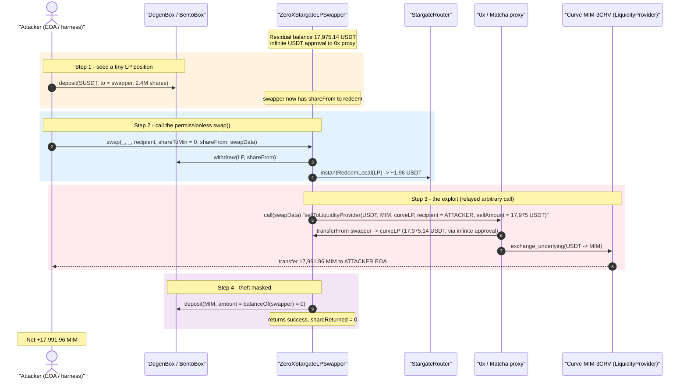
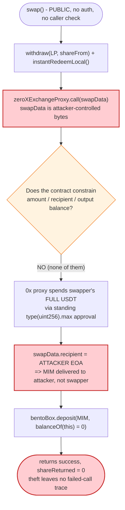
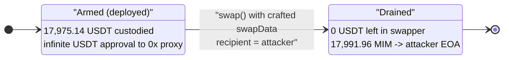

# Abracadabra / MIM `ZeroXStargateLPSwapper` Exploit — Arbitrary-Calldata Approval Drain

> **Reproduction:** the PoC compiles & runs in an isolated Foundry project at
> [this project folder](.) (the umbrella DeFiHackLabs repo
> contains many unrelated PoCs that do not build under a whole-project `forge test`, so this one was extracted).
> Full verbose trace: [output.txt](output.txt).
> Verified vulnerable source: [src_swappers_ZeroXStargateLPSwapper.sol](sources/ZeroXStargateLPSwapper_a5564a/src_swappers_ZeroXStargateLPSwapper.sol).

---

## Key info

| | |
|---|---|
| **Loss** | ~$17K — **17,991.96 MIM** stolen from the swapper's residual USDT balance |
| **Vulnerable contract** | `ZeroXStargateLPSwapper` — [`0xa5564a2d1190a141CAC438c9fde686aC48a18A79`](https://etherscan.io/address/0xa5564a2d1190a141CAC438c9fde686aC48a18A79#code) |
| **Victim funds** | ~17,975 USDT held by the swapper (residual from prior liquidations) + the swapper's `uint256.max` USDT approval to the 0x proxy |
| **Attacker EOA** | [`0x9d4fD681AacBc49D79c6405C9aA70d1afd5aCCF3`](https://etherscan.io/address/0x9d4fD681AacBc49D79c6405C9aA70d1afd5aCCF3) |
| **Attacker contract** | [`0x26fe84754a1967d67b7befaa01b10d7b35bbaf0a`](https://etherscan.io/address/0x26fe84754a1967d67b7befaa01b10d7b35bbaf0a) |
| **Attack tx** | [`0x2c9f87e285026601a2c8903cf5f10e5b3655fbd0264490c41514ce073c42a9c3`](https://etherscan.io/tx/0x2c9f87e285026601a2c8903cf5f10e5b3655fbd0264490c41514ce073c42a9c3) |
| **Chain / block / date** | Ethereum mainnet / 17,521,638 / June 16, 2023 |
| **Compiler** | Solidity v0.8.16, optimizer **200 runs** (per [`_meta.json`](sources/ZeroXStargateLPSwapper_a5564a/_meta.json)) |
| **Bug class** | Arbitrary external call with attacker-controlled calldata + standing infinite approval (recipient hijack) |

---

## TL;DR

`ZeroXStargateLPSwapper` is one of Abracadabra/MIM's "swapper" helper contracts. It liquidates a
Stargate-LP collateral position by (1) redeeming the LP for its underlying token (USDT), then (2)
swapping that USDT into MIM through the **0x / Matcha aggregator proxy**, then (3) re-depositing the
resulting MIM into BentoBox/DegenBox for the cauldron.

The fatal line is the swap-aggregator call
([src_swappers_ZeroXStargateLPSwapper.sol:68](sources/ZeroXStargateLPSwapper_a5564a/src_swappers_ZeroXStargateLPSwapper.sol#L68)):

```solidity
(bool success, ) = zeroXExchangeProxy.call(swapData);
```

`swapData` is **caller-controlled, opaque bytes** that the contract forwards *verbatim* to the 0x
proxy. The constructor grants the 0x proxy an **infinite (`type(uint256).max`) allowance** on the
underlying token
([:45](sources/ZeroXStargateLPSwapper_a5564a/src_swappers_ZeroXStargateLPSwapper.sol#L45)). So
anyone who calls `swap()` can make the 0x proxy spend the swapper's USDT however they like —
including a swap whose **output recipient is the attacker's own EOA**, not the swapper.

The attacker:

1. **Seeds** a trivial position (3 USDT-worth of Stargate LP) into DegenBox to the swapper's account,
   only so that the swapper has a (tiny) `shareFrom` to redeem and `swap()` runs without reverting.
2. **Calls `swap()`** with a hand-crafted `swapData` = `sellToLiquidityProvider(USDT, MIM,
   CurveLiquidityProvider, attackerEOA, sellAmount = swapper's full USDT balance, …)`.
3. The 0x proxy, spending the swapper's infinite-approved USDT, sells **17,975.14 USDT** through a
   Curve MIM-3CRV liquidity-provider route and delivers **17,991.96 MIM directly to the attacker's
   EOA** — never to the swapper.
4. Back in `swap()`, the swapper now holds **0 MIM**, so the closing
   `bentoBox.deposit(mim, …, mim.balanceOf(this) = 0)` deposits nothing. The function returns cleanly
   with `shareReturned = 0` — the theft leaves no failed-call trace.

Net result: the attacker walks off with **17,991.96 MIM** of value that belonged to the protocol,
having supplied essentially nothing.

---

## Background — what the swapper is for

In Abracadabra's "cauldron" lending, when a leveraged position using a Stargate LP as collateral is
liquidated or deleveraged, a *swapper* contract converts the collateral back into MIM so the debt can
be repaid. `ZeroXStargateLPSwapper`
([source](sources/ZeroXStargateLPSwapper_a5564a/src_swappers_ZeroXStargateLPSwapper.sol)) is the
swapper for Stargate-LP collateral. Its declared flow
([ISwapperV2.swap](sources/ZeroXStargateLPSwapper_a5564a/src_interfaces_ISwapperV2.sol#L10-L17)):

1. `bentoBox.withdraw(pool, this, this, 0, shareFrom)` — pull `shareFrom` of the Stargate LP out of
   BentoBox to itself.
2. `stargateRouter.instantRedeemLocal(poolId, amount, this)` — burn the LP for the underlying USDT.
3. `zeroXExchangeProxy.call(swapData)` — sell USDT → MIM via the 0x aggregator.
4. `bentoBox.deposit(mim, this, recipient, mim.balanceOf(this), 0)` — push the MIM back into
   BentoBox for the recipient (the cauldron), returning `extraShare = shareReturned - shareToMin`.

The design intent is that step 3 is "blind" because 0x quotes are computed off-chain and the calldata
is generated by 0x's API; the swapper just relays it. The standing infinite approval in the
constructor exists so the relayed 0x call can pull the USDT.

The on-chain state at the fork block, read directly from the trace:

| Fact | Value | Trace ref |
|---|---|---|
| USDT held by the swapper itself (residual) | **17,975.143719 USDT** | [output.txt:90-91](output.txt) |
| Swapper's USDT allowance to 0x proxy | `type(uint256).max` | [output.txt:132-133](output.txt) |
| Attacker's own capital injected | 3 USDT (as Stargate LP shares) | [output.txt:78-89](output.txt) |
| MIM delivered to attacker EOA | **17,991.956694335799894602 MIM** | [output.txt:215-224](output.txt) |

The 17,975 USDT was the swapper's *own* leftover balance — swappers are stateless relays and were
never supposed to custody value between calls, but a prior liquidation had left USDT parked there.
That residual, multiplied by the infinite approval, is the entire prize.

---

## The vulnerable code

### 1. Caller-supplied bytes are executed against a privileged proxy

```solidity
function swap(
    address,
    address,
    address recipient,
    uint256 shareToMin,
    uint256 shareFrom,
    bytes calldata swapData            // ← fully attacker-controlled
) public override returns (uint256 extraShare, uint256 shareReturned) {
    bentoBox.withdraw(IERC20(address(pool)), address(this), address(this), 0, shareFrom);

    uint256 amount = IERC20(address(pool)).balanceOf(address(this));
    stargateRouter.instantRedeemLocal(poolId, amount, address(this));
    require(IERC20(address(pool)).balanceOf(address(this)) == 0, "Cannot fully redeem");

    // underlying -> MIM
    (bool success, ) = zeroXExchangeProxy.call(swapData);   // ⚠️ arbitrary call, attacker calldata
    if (!success) {
        revert ErrSwapFailed();
    }

    (, shareReturned) = bentoBox.deposit(mim, address(this), recipient, mim.balanceOf(address(this)), 0);
    extraShare = shareReturned - shareToMin;                // 0 - 0 = 0 here
}
```

`swap()` is **`public`, has no access control, and no caller check.** It accepts opaque `swapData`
and forwards it to `zeroXExchangeProxy`
([:68](sources/ZeroXStargateLPSwapper_a5564a/src_swappers_ZeroXStargateLPSwapper.sol#L68)). The
contract performs **zero validation** that `swapData`:

- sells only the amount that was just redeemed (rather than the swapper's *entire* USDT balance);
- routes the output back to the swapper (rather than to an attacker-chosen `recipient` embedded
  inside `swapData`);
- even targets a USDT→MIM swap at all.

### 2. The infinite approval that arms it

```solidity
constructor( ... ) {
    ...
    underlyingToken = IERC20(_pool.token());
    underlyingToken.safeApprove(_zeroXExchangeProxy, type(uint256).max);   // ⚠️ infinite, standing
    mim.approve(address(_bentoBox), type(uint256).max);
}
```

The swapper grants the 0x proxy an **unbounded, permanent** USDT allowance
([:45](sources/ZeroXStargateLPSwapper_a5564a/src_swappers_ZeroXStargateLPSwapper.sol#L45)). Combined
with the arbitrary call in `swap()`, any USDT that ever sits in the swapper is spendable by anyone via
a crafted 0x order.

### 3. The closing deposit silently masks the theft

```solidity
(, shareReturned) = bentoBox.deposit(mim, address(this), recipient, mim.balanceOf(address(this)), 0);
```

Because the crafted swap routed all MIM to the attacker, `mim.balanceOf(address(this))` is **0**, so
the deposit is a no-op, `shareReturned = 0`, `extraShare = 0 - shareToMin (0) = 0`, and `swap()`
returns normally with no revert ([output.txt:228-236](output.txt)). The drain is invisible to a
naive caller.

---

## Root cause — why it was possible

The 0x aggregator API hands integrators an opaque calldata blob to relay. The "secure" way to relay
it is to **constrain everything around the blob**: pull exactly the redeemed amount into the call,
hard-set the swap recipient to `address(this)`, and verify the contract's MIM balance increased by at
least the expected minimum before returning. `ZeroXStargateLPSwapper` does **none** of these. It
relays raw bytes against a proxy that holds an infinite allowance on a token the contract custodies.

Concretely, three design decisions compose into the bug:

1. **Permissionless, unvalidated arbitrary call.** `swap()` is public and forwards caller bytes to a
   privileged proxy. The attacker therefore chooses *what* the swapper's allowance is spent on,
   *how much*, and *to whom the proceeds go* — by encoding `sellToLiquidityProvider(…, recipient =
   attackerEOA, sellAmount = full balance, …)`
   ([output.txt:90-99 in MIMSpell_exp.sol](test/MIMSpell_exp.sol#L90-L99)).
2. **Standing infinite approval on custodied funds.** The constructor's `type(uint256).max` USDT
   approval means the swapper's *entire* USDT balance — not just the freshly-redeemed sliver — is
   reachable through the relayed call. The 17,975 USDT residual was the actual target; the attacker's
   3 USDT seed was only there to satisfy the redeem step.
3. **No post-swap balance/recipient enforcement.** The contract never checks that the MIM it expected
   actually arrived in `address(this)`. Routing the output to the attacker leaves the contract with 0
   MIM, the closing deposit no-ops, and the function returns success — so nothing reverts the theft.

The intended `shareToMin` slippage guard is useless: it is checked as `shareReturned - shareToMin`
*after* the MIM has already left to the attacker, and the attacker simply passes `shareToMin = 0`.

---

## Preconditions

- The swapper holds a non-trivial balance of the underlying token (USDT). Here, **17,975 USDT** of
  residual liquidation dust sat in the contract. (Swappers were assumed to be transient relays; this
  residual is what made the hit meaningful.)
- The standing `type(uint256).max` USDT → 0x-proxy approval (set permanently in the constructor) is
  in place — always true for a deployed instance.
- A small `shareFrom` of Stargate LP exists in the swapper's BentoBox account so the redeem step does
  not revert. The attacker supplies this themselves by depositing ~3 USDT-worth of Stargate LP to the
  swapper's account ([MIMSpell_exp.sol:82-84](test/MIMSpell_exp.sol#L82-L84)).
- No timing, governance, or trusted-role gate exists — `swap()` is fully permissionless.

The attacker's net outlay was effectively the 3 USDT seed (consumed in the redeem) plus gas — the
attack is single-transaction and requires no flash loan, since the target funds were already custodied
by the swapper.

---

## Attack walkthrough (with on-chain numbers from the trace)

| # | Step | Call | Effect | Trace ref |
|---|------|------|--------|-----------|
| 0 | **Setup** | `deal(SUSDT, exploiter, 3e6)` then `transferFrom` to test harness | Attacker holds 3 Stargate-LP shares (≈3 USDT) | [output.txt:62-68](output.txt) |
| 1 | **Seed swapper** | `DegenBox.deposit(SUSDT, this, ZeroXStargateLPSwapper, 0, 2_400_000)` | 2.4M LP shares credited to the swapper's BentoBox account | [output.txt:78-89](output.txt) |
| 2 | **Read prize** | `USDT.balanceOf(ZeroXStargateLPSwapper)` | Confirms swapper holds **17,975.14 USDT** | [output.txt:90-91](output.txt) |
| 3 | **Call swap()** | `ZeroXStargateLPSwapper.swap(this, this, this, 0, 1_920_000, swapData)` | Enters the vulnerable function | [output.txt:92](output.txt) |
| 3a | ↳ withdraw LP | `DegenBox.withdraw(SUSDT, swapper, swapper, 0, 1_920_000)` → 1.955M LP | LP pulled to swapper | [output.txt:93-104](output.txt) |
| 3b | ↳ redeem LP | `stargateRouter.instantRedeemLocal(2, 1_955_253, swapper)` | 1.957 USDT minted to swapper (negligible) | [output.txt:107-127](output.txt) |
| 3c | ↳ **the call** | `zeroXExchangeProxy.call(swapData)` → `sellToLiquidityProvider(USDT, MIM, curveLP, **exploiter**, 17_975_143_719, …)` | 0x proxy spends the swapper's USDT via its infinite approval | [output.txt:130-227](output.txt) |
| 3d | ↳ USDT pulled | `USDT.transferFrom(swapper → curveLP, 17,975.14 USDT)` | Swapper's full USDT balance leaves | [output.txt:134-139](output.txt) |
| 3e | ↳ Curve swap | `exchange_underlying(3, 0, 17,975.14 USDT, minOut)` on MIM-3CRV | 17,991.96 MIM produced | [output.txt:148-211](output.txt) |
| 3f | ↳ **MIM to attacker** | `MIM.transfer(exploiter, 17,991.956694…)` | Proceeds delivered to the **attacker EOA**, not the swapper | [output.txt:215-224](output.txt) |
| 3g | ↳ closing deposit | `bentoBox.deposit(MIM, swapper, this, mim.balanceOf(swapper) = 0, 0)` | Deposits **0** — theft masked, returns success | [output.txt:228-236](output.txt) |
| 4 | **Confirm** | `MIM.balanceOf(exploiter)` | **17,991.956694335799894602 MIM** | [output.txt:237-241](output.txt) |

**The single decisive substitution:** inside the relayed `swapData`, argument 3 (`recipient`) is the
attacker's EOA `0x9d4f…accf3` and argument 4 (`sellAmount`) is `17,975,143,719` — the swapper's
*entire* USDT balance, not the ~1.957 USDT just redeemed. The contract relayed both without question.

### Profit accounting

| Direction | Amount |
|---|---:|
| Spent — Stargate-LP seed (consumed in redeem) | ~3 USDT |
| **MIM received by attacker EOA** | **17,991.956694335799894602 MIM** |
| **Net profit** | **≈ 17,991.96 MIM (~$17K)** |

The PoC asserts this exactly: MIM balance goes from `0` → `17991.956694335799894602`
([output.txt:5-7](output.txt)).

---

## Diagrams

### Sequence of the attack



### Where the value leaks



### State of the swapper's USDT before vs. after



---

## Why each crafted field matters

- **`inputToken = USDT`, `outputToken = MIM`:** matches the swapper's custodied token and its
  infinite approval, so the 0x proxy's `transferFrom(swapper, …)` succeeds.
- **`provider = CurveLiquidityProvider` + `auxiliaryData` (`exchange_underlying(3 → 0)`):** picks a
  liquid USDT→MIM route (Curve MIM-3CRV) so a clean fill is available; the attacker just needs *any*
  route that produces MIM ([MIMSpell_exp.sol:45-48,89](test/MIMSpell_exp.sol#L45-L48)).
- **`recipient = attacker EOA`:** the single field that converts a normal swap into theft — the MIM
  is delivered to the attacker, never to the swapper
  ([MIMSpell_exp.sol:94](test/MIMSpell_exp.sol#L94)).
- **`sellAmount = USDT.balanceOf(swapper)` (17,975.14 USDT):** drains the swapper's *entire* balance,
  not just the redeemed sliver, exploiting the unbounded approval
  ([MIMSpell_exp.sol:96](test/MIMSpell_exp.sol#L96)).
- **`shareToMin = 0`:** neutralizes the only slippage check, which in any case runs *after* the funds
  have left.

---

## Remediation

1. **Never relay unconstrained arbitrary calldata against a privileged proxy.** The swapper should
   build the 0x call itself from trusted parameters, or at minimum validate that the relayed call
   sells only the just-redeemed amount and cannot exceed it.
2. **Force the swap output back to the swapper, then verify it.** After the 0x call, assert
   `mim.balanceOf(address(this)) >= expectedMin` *before* depositing. Any swap whose output bypassed
   the contract leaves a 0 balance and must revert. Never trust a caller-embedded `recipient`.
3. **Eliminate standing infinite approvals on custodied funds.** Approve the exact amount immediately
   before the call and reset to 0 immediately after (`safeApprove(proxy, amount); …; safeApprove(proxy, 0);`),
   so a stale residual balance is never reachable by a later crafted call.
4. **Do not let value accumulate in stateless relays.** Swappers should hold no residual token
   balances between operations; sweep or forbid leftover USDT so there is nothing to steal even if the
   call surface is abused.
5. **Restrict `swap()` to the cauldron/liquidation flow** (the trusted caller that legitimately
   constructs slippage-bounded swaps), rather than leaving it fully permissionless.

---

## How to reproduce

The PoC was extracted into a standalone Foundry project (the umbrella DeFiHackLabs repo has many
unrelated PoCs that fail to compile under a whole-project `forge test` build):

```bash
_shared/run_poc.sh 2023-06-MIMSpell_exp --mt testTransaction -vvvvv
```

- RPC: an **Ethereum archive** endpoint is required (fork block 17,521,638, June 2023). Configure the
  `mainnet` alias in `foundry.toml` to an archive provider that serves historical state at that block;
  pruned RPCs will fail with `missing trie node` / `header not found`.
- Result: `[PASS] testTransaction()` with the attacker's MIM balance going from 0 to ~17,991.96.

Expected tail (from [output.txt](output.txt)):

```
Ran 1 test for test/MIMSpell_exp.sol:MIMTest
[PASS] testTransaction() (gas: 569096)
Logs:
  Exploiter's amount of MIM tokens before attack: 0.000000000000000000
  Exploiter's amount of MIM tokens after attack: 17991.956694335799894602

Suite result: ok. 1 passed; 0 failed; 0 skipped
```

---

*Reference: original analysis — Hexagate, https://twitter.com/hexagate_/status/1671188024607100928
(Abracadabra/MIM `ZeroXStargateLPSwapper`, Ethereum, ~$17K).*
