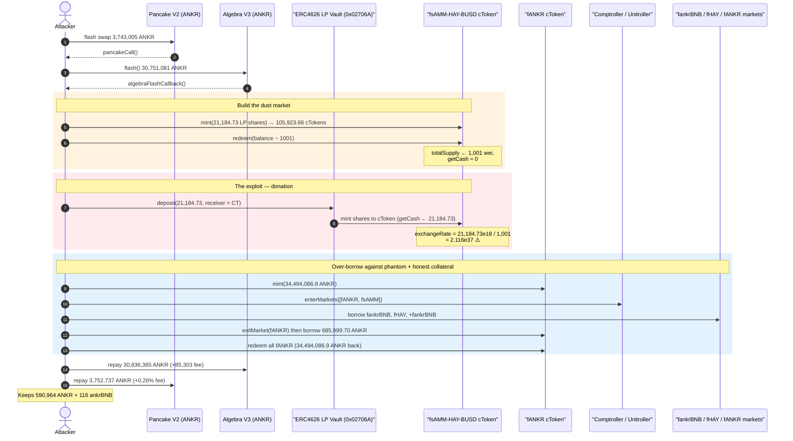
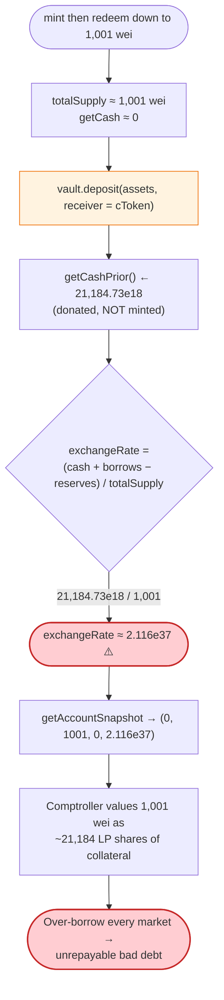
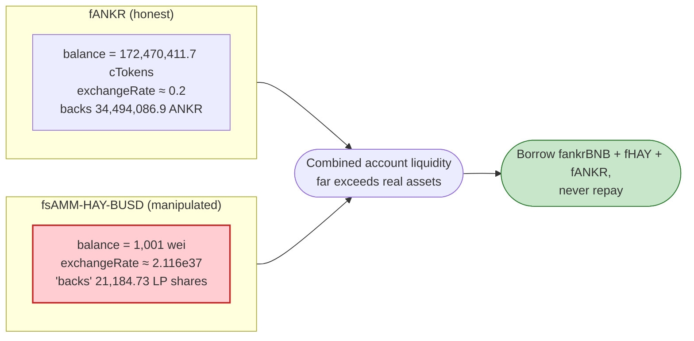

# Midas Capital Exploit — cToken Exchange-Rate Inflation via Donation Into a Near-Empty Market

> **Reproduction:** the PoC compiles & runs in an isolated Foundry project at
> [this project folder](.) (the umbrella DeFiHackLabs repo contains many unrelated
> PoCs that do not whole-compile under `forge test`, so this one was extracted).
> Full verbose trace: [output.txt](output.txt).
> Verified vulnerable sources downloaded under [sources/](sources/) (Compound/Fuse fork,
> `CToken` + `CErc20Delegator` + `Unitroller`).

---

## Key info

| | |
|---|---|
| **Loss** | ~$600K — attacker walked off with **590,964 ANKR** + **116 ankrBNB** plus borrowed HAY/ankrBNB, leaving the Midas BSC pool insolvent |
| **Vulnerable contract** | Midas `fsAMM-HAY-BUSD` market (`CErc20Delegator`) — [`0xF8527Dc5611B589CbB365aCACaac0d1DC70b25cB`](https://bscscan.com/address/0xf8527dc5611b589cbb365acacaac0d1dc70b25cb#code) (impl `0x13a2eb85…`) |
| **Root cause locus** | `CToken.exchangeRateStoredInternal()` — [contracts_compound_CToken.sol:404-440](sources/Unitroller_1851e3/contracts_compound_CToken.sol#L404-L440) |
| **Comptroller (Unitroller)** | [`0x1851e32F34565cb95754310b031C5a2Fc0a8a905`](https://bscscan.com/address/0x1851e32F34565cb95754310b031C5a2Fc0a8a905) |
| **Manipulated underlying** | ERC4626 vault over the Thena `sAMM-HAY/BUSD-T` LP — [`0x02706A482fc9f6B20238157B56763391a45bE60E`](https://bscscan.com/address/0x02706A482fc9f6B20238157B56763391a45bE60E) |
| **Attacker EOA** | [`0x4b92cc3452ef1e37528470495b86d3f976470734`](https://bscscan.com/address/0x4b92cc3452ef1e37528470495b86d3f976470734) |
| **Attacker contract** | [`0xc40119c7269a5fa813d878bf83d14e3462fc8fde`](https://bscscan.com/address/0xc40119c7269a5fa813d878bf83d14e3462fc8fde) |
| **Attack tx** | [`0x4a304ff08851106691f626045b0f55d403e3a0958363bdf82b96e8ce7209c3a6`](https://app.blocksec.com/explorer/tx/bsc/0x4a304ff08851106691f626045b0f55d403e3a0958363bdf82b96e8ce7209c3a6) |
| **Chain / fork block / date** | BSC / 29,185,768 / June 2023 |
| **Compiler** | Solidity v0.8.10, optimizer 200 runs |
| **Bug class** | Compound/Fuse cToken **exchange-rate inflation** via direct donation into a market with near-zero `totalSupply`; manipulated collateral → over-borrow → bad debt |

> Post-mortem: [Midas exploit post-mortem (Medium)](https://medium.com/midas-capital/midas-exploit-post-mortem-1ae266222994).

---

## TL;DR

Midas Capital is a Fuse/Compound-fork isolated-lending market. Several markets used
**ERC4626-vault-wrapped Thena LP tokens** as the cToken underlying.

The `fsAMM-HAY-BUSD` market (`0xF8527D…`) was almost empty. A Compound cToken prices each
share via:

```
exchangeRate = (getCash() + totalBorrows − reserves) / totalSupply
```

The attacker:

1. **Minted** ~105,924 `fsAMM` cTokens by depositing 21,184.7 LP-vault shares.
2. **Redeemed all but 1,001 wei** of those cTokens, pulling the 21,184.7 shares back out — leaving the market with `totalSupply ≈ 1,001 wei` and `getCash ≈ 0`.
3. **Donated** the very same 21,184.7 LP-vault shares straight back into the cToken's balance by calling the ERC4626 vault's `deposit(assets, receiver = fsAMM_HAY_BUSD)` — crediting the cToken's `getCash()` **without minting any cTokens**.

That single donation makes `exchangeRate = 21,184.7e18 / 1,001 ≈ 2.116e37` — the
trace shows `fsAMM_HAY_BUSD.getAccountSnapshot()` returning exchange rate
`21163567836568468923536463536463536463` for a position of only **1,001 wei**
([output.txt:1521](output.txt)). A dust-sized cToken balance is now valued as
tens of thousands of dollars of collateral.

With that phantom collateral (plus a legitimately-minted `fANKR` position seeded by
flash-loaned ANKR), the attacker borrowed out every market — `fankrBNB`, `fHAY`, and
finally `fANKR` itself — repaid two flash loans (PancakeSwap V2 swap + Algebra/Thena V3
`flash`), and kept the surplus: **590,964 ANKR + 116 ankrBNB**, leaving the pool with
unrepayable bad debt.

---

## Background — Midas / Fuse isolated lending

Midas (BSC) is a fork of Rari **Fuse**, itself a fork of **Compound v2**. Each asset is an
isolated `CErc20` market behind a `CErc20Delegator` proxy, all coordinated by a
`Comptroller` sitting behind a `Unitroller` proxy. Collateral value, borrow limits and
liquidation are all driven by two numbers per market:

- the **oracle price** of the underlying (`Oracle.getUnderlyingPrice(cToken)`), and
- the cToken **exchange rate** (`underlying per cToken`), computed from the market's own
  cash/borrows/supply.

The markets relevant here:

| Market (cToken) | Address | Underlying |
|---|---|---|
| `fsAMM-HAY-BUSD` (**target**) | `0xF8527D…` | ERC4626 vault `0x02706A…` over Thena `sAMM-HAY/BUSD-T` LP |
| `fANKR` | `0x13aE97…` | ANKR |
| `fankrBNB` | `0xb2b01D…` | ankrBNB |
| `fHAY` | `0x10b6f8…` | HAY |

The `fsAMM-HAY-BUSD` underlying is **not** a raw LP token — it is an ERC4626 vault wrapping
the LP. Crucially, ERC4626 `deposit(assets, receiver)` lets the caller choose **who
receives the minted vault shares**. The attacker used that to send shares directly to the
cToken contract, i.e. to *donate underlying into the market*.

The LP-token oracle (`0xf12BF36…`, reached through the `Oracle` proxy `0xB641c2…`) prices
the underlying using `HAY_BUSDT.getReserves()`, `totalSupply()`, the per-token chainlink
feeds and the Thena stable-pool `current()` quote
([output.txt:1526-1648](output.txt)). The price side was *not* the attack vector here —
the exploit corrupts the **exchange rate**, which is computed purely from the market's own
internal balances.

---

## The vulnerable code

### The exchange rate is `cash / totalSupply` with no floor on `totalSupply`

[contracts_compound_CToken.sol:404-440](sources/Unitroller_1851e3/contracts_compound_CToken.sol#L404-L440):

```solidity
function exchangeRateStoredInternal() internal view returns (MathError, uint256) {
    uint256 _totalSupply = totalSupply;
    if (_totalSupply == 0) {
        // If there are no tokens minted: exchangeRate = initialExchangeRate
        return (MathError.NO_ERROR, initialExchangeRateMantissa);
    } else {
        // exchangeRate = (totalCash + totalBorrows
        //                 - (totalReserves + totalFuseFees + totalAdminFees)) / totalSupply
        uint256 totalCash = getCashPrior();                 // ← reads the market's underlying balance
        uint256 cashPlusBorrowsMinusReserves;
        Exp memory exchangeRate;
        MathError mathErr;

        (mathErr, cashPlusBorrowsMinusReserves) = addThenSubUInt(
            totalCash,
            totalBorrows,
            add_(totalReserves, add_(totalAdminFees, totalFuseFees))
        );
        ...
        (mathErr, exchangeRate) = getExp(cashPlusBorrowsMinusReserves, _totalSupply);
        return (MathError.NO_ERROR, exchangeRate.mantissa);
    }
}
```

`getCashPrior()` (in the `CErc20` implementation) is simply the cToken's **current
underlying balance**. Because the underlying here is an ERC4626 vault whose
`deposit(assets, receiver)` lets *anyone* mint shares to *any* address, that balance can be
inflated by an external party at will, with **no corresponding increase in
`totalSupply`**.

The classic Compound guard — keeping `totalSupply` large enough that a donation cannot move
the exchange rate meaningfully — is absent the moment a market is left almost empty. The
attacker manufactured exactly that empty state by minting then redeeming down to 1,001 wei.

### The exchange rate flows straight into collateral value

`getAccountSnapshot()` returns `(err, cTokenBalance, borrowBalance, exchangeRateMantissa)`,
and the Comptroller multiplies `cTokenBalance × exchangeRate × oraclePrice × collateralFactor`
to derive account liquidity. The trace shows the corrupted tuple for the attacker's borrow
account on the `fsAMM` market:

```
fsAMM_HAY_BUSD.getAccountSnapshot(Borrower)
  → 0, 1001, 0, 21163567836568468923536463536463536463   // (err, balance=1001 wei, borrow=0, rate≈2.116e37)
```
([output.txt:1521](output.txt))

`getCashPrior()` for that market returned `21,184,731,404,405,037,392,460` (≈21,184.7 vault
shares) ([output.txt:1517-1518](output.txt)) — donated, not minted. With `totalSupply ≈
1,001 wei`, `21184.73e18 / 1001 ≈ 2.116e37`, exactly the snapshot rate.

---

## Root cause — why it was possible

A Compound cToken trusts that its underlying balance only changes through `mint`,
`redeem`, `borrow`, `repay` and `liquidate` — flows that also move `totalSupply`/`totalBorrows`
in lockstep, keeping the exchange rate continuous. Midas broke that assumption in two
compounding ways:

1. **No minimum-liquidity floor.** A market can be drained to a dust `totalSupply` (here
   1,001 wei) by ordinary `mint`+`redeem`. At that point any donation of underlying makes
   `exchangeRate = cash / dust` astronomically large.

2. **The underlying is donatable to an arbitrary receiver.** The `fsAMM` underlying is an
   ERC4626 vault. `vault.deposit(assets, receiver = cToken)`
   ([test/MidasCapitalXYZ_exp.sol:103](test/MidasCapitalXYZ_exp.sol#L103)) mints vault
   shares **into the cToken's own balance** — inflating `getCashPrior()` without minting a
   single cToken. The cToken has no notion of an "expected" cash level, so it accepts the
   donation as genuine value backing the 1,001-wei supply.

Together these turn a 1,001-wei cToken position into collateral worth ~21,184 LP shares.
The attacker then borrows against that phantom collateral and never repays — the loss
crystallises as protocol bad debt.

This is the canonical Compound/Fuse **first-depositor / donation exchange-rate inflation**,
weaponised against an *existing* market by first emptying it.

---

## Preconditions

- A Midas market (`fsAMM-HAY-BUSD`) whose underlying can be **donated to an arbitrary
  receiver** — satisfied because the underlying is an ERC4626 vault with
  `deposit(assets, receiver)`.
- Ability to drive that market's `totalSupply` to a dust value via `mint` then `redeem`
  (no per-account or per-market minimum-balance constraint).
- The market is **listed as collateral** with a non-zero collateral factor.
- Working capital, obtained intra-transaction and fully repaid:
  - a **PancakeSwap V2 flash swap** of 3,743,005 ANKR from `ankrBNB/ANKR` V2
    ([output.txt:113](output.txt));
  - an **Algebra/Thena V3 `flash`** of 30,751,081 ANKR from `ankrBNB/ANKR` V3
    ([output.txt:137](output.txt)).
- A `Borrower` helper contract (the one that holds the manipulated positions and enters the
  markets) — [test/MidasCapitalXYZ_exp.sol:145-183](test/MidasCapitalXYZ_exp.sol#L145-L183).

---

## Attack walkthrough (with on-chain numbers from the trace)

All figures are taken directly from events/returns in [output.txt](output.txt).

| # | Step | Concrete numbers | Effect |
|---|------|------------------|--------|
| 0 | **PancakeV2 flash swap** of ANKR from `ankrBNB/ANKR` V2; callback `pancakeCall` | 3,743,005.44 ANKR out ([:113](output.txt)) | Bootstraps ANKR working capital. |
| 1 | Inside `pancakeCall`: deploy `Borrower`, then take **Algebra V3 `flash`** of ANKR | 30,751,081.49 ANKR flashed ([:137](output.txt)) | More ANKR working capital. |
| 2 | **Mint LP-vault shares**: add 20,000 HAY + 22,369.6 BUSD-T to Thena pool → LP, deposit LP into ERC4626 vault | 21,184.73 vault shares minted ([:174](output.txt)) | Underlying for the target market. |
| 3 | **`fsAMM_HAY_BUSD.mint(21,184.73)`** | 105,923.66 cTokens minted ([:466](output.txt)) | Market now holds the shares; supply ≈ 105,924 cTokens. |
| 4 | **`fsAMM_HAY_BUSD.redeem(balance − 1001)`** | redeem 105,923.66 − 1,001 wei; 21,184.73 shares pulled back out; **supply ← 1,001 wei** ([:754](output.txt)) | Market emptied to dust supply, `getCash ≈ 0`. |
| 5 | **`vault.deposit(21,184.73 shares, receiver = fsAMM_HAY_BUSD)`** | `Transfer 0x0 → fsAMM` 21,184.73 shares; vault `Deposit(owner = fsAMM)` ([:785-800](output.txt)) | **Donation**: cToken `getCash` ← 21,184.73, supply still 1,001 wei. |
| 6 | **`fsAMM` exchange rate observed** | `getAccountSnapshot → (0, 1001, 0, 2.116e37)` ([:1521](output.txt)) | 1,001-wei position now worth ~21,184 shares of collateral. |
| 7 | **Seed a second, honest collateral**: `fANKR.mint(34,494,086.9 ANKR)` | 172,470,411.7 fANKR minted, rate 0.2 ([:1190](output.txt)) | Large legitimate collateral from flash-loaned ANKR. |
| 8 | **`Unitroller.enterMarkets([fANKR, fsAMM])`** | ([:1207](output.txt)) | Both positions counted as collateral. |
| 9 | **Borrow `fankrBNB`** (in `execute()`) | 1,148.26 ankrBNB ([:1802](output.txt)) | Drain ankrBNB market #1. |
| 10 | **Borrow `fHAY`** | 1,148.26 HAY ([:2559](output.txt)) | Drain HAY market. |
| 11 | **`exit()`**: borrow more `fankrBNB`, `exitMarket(fANKR)`, then borrow the rest of `fANKR` cash | +115 ankrBNB ([:4545](output.txt)); then **685,999.70 ANKR** from `fANKR` ([:5830](output.txt)) | Drain ankrBNB #2 + nearly all of fANKR. |
| 12 | **`fANKR.redeem(all fANKR)`** | 34,494,086.9 ANKR back to `Borrower` ([:6447](output.txt)) | Recover the honest fANKR collateral. |
| 13 | **Repay flash loans** | V3: 30,836,385 ANKR (`paid1` 85,303.5 fee, [:6529](output.txt)); V2: 3,752,737.26 ANKR (0.26 % fee, [:6533](output.txt)) | Both loans closed. |
| 14 | **Profit booked** | `Borrower → attacker` 35,180,086.6 ANKR + 116 ankrBNB; net kept **590,964.39 ANKR**, **116 ankrBNB** ([:6540](output.txt), [:6549](output.txt)) | Pool left insolvent. |

Test assertions from the run:

```
Exploiter ANKR balance before attack:        0.000000
Exploiter ankrBNB balance before attack:     0.000000
Exploiter ANKR balance after attack:    590964.388569997952122547
Exploiter ankrBNB balance after attack:    116.000000000000000000
```
([output.txt:6-9](output.txt))

### Profit / loss accounting

The two flash loans are fully self-funded and repaid with fees inside the single
transaction, so the attacker's net position is pure profit drawn from the lending pool:

| Item | Amount | Note |
|---|---:|---|
| Net ANKR kept by attacker | **590,964.39 ANKR** | left after repaying V2 + V3 flash loans |
| Net ankrBNB kept | **116 ankrBNB** | borrowed against phantom collateral |
| HAY borrowed | 1,148.26 HAY | never repaid → bad debt |
| ankrBNB borrowed | 1,148.26 + 115 ankrBNB | never repaid → bad debt |
| ANKR borrowed from `fANKR` | 685,999.70 ANKR | never repaid → bad debt |

The headline loss across the affected Midas markets is **~$600K** (matches the PoC header).
The borrowed HAY/ankrBNB/ANKR were never repaid: the 1,001-wei `fsAMM` collateral that
"backed" them is worth essentially nothing once the donation is unwound, so the debt is
unrecoverable.

---

## Diagrams

### Sequence of the attack



### The flaw inside `exchangeRateStoredInternal`



### Collateral value: honest vs. manipulated market



---

## Why each magic number

- **21,184.73 LP-vault shares**: the same shares are reused three times — minted into the
  cToken, redeemed back out, then donated back in. Only one batch of capital is ever at
  risk; the shares end up donated (lost), which is the only real cost besides flash fees.
- **`redeem(balance − 1001)`** ([test/MidasCapitalXYZ_exp.sol:101](test/MidasCapitalXYZ_exp.sol#L101)):
  leaves the market with `totalSupply` = 1,001 wei. Larger residual supply → smaller
  exchange-rate inflation; smaller (e.g. 0) would hit the `_totalSupply == 0 →
  initialExchangeRate` branch and not inflate. 1,001 wei is small enough to blow the rate
  up to ~2.1e37 while keeping the position non-empty.
- **34,494,086.9 ANKR into `fANKR`**: an honest, large second collateral, funded entirely by
  the two ANKR flash loans, so the borrow capacity is enormous and the final fANKR redeem
  cleanly returns the principal for flash-loan repayment.
- **685,999.70 ANKR borrow from `fANKR`** ([output.txt:5830](output.txt)): sized to take
  essentially all available `fANKR` cash (`totalBorrows` ends at 685,999.99 ANKR) right
  before redeeming the attacker's own fANKR — extracting the market's liquidity twice.

---

## Remediation

1. **Enforce a permanent minimum supply per market** (a "dead shares" / first-mint burn, as
   in modern Compound/ERC4626 hardening). If `totalSupply` can never fall below a meaningful
   floor, a donation cannot move the exchange rate by orders of magnitude.
2. **Track internal cash instead of trusting `token.balanceOf(this)`.** Compute
   `exchangeRate` from an internally-accounted `totalCash` that only changes through
   `mint`/`redeem`/`borrow`/`repay`, so unsolicited transfers (and ERC4626 deposits to an
   arbitrary `receiver`) cannot inflate it. Periodically `skim` any excess to reserves.
3. **Do not list freely-donatable underlyings as collateral without a virtual-balance
   accounting model.** ERC4626 vaults whose `deposit(assets, receiver)` lets a third party
   credit the cToken are especially dangerous; treat their balance as untrusted.
4. **Sanity-bound the exchange rate.** Reject or pause a market when `exchangeRate` deviates
   from its expected band (e.g. relative to a recent value or a configured ceiling) — an
   exchange rate of `2e37` is self-evidently nonsensical and should never be used to value
   collateral.
5. **Cap per-transaction collateral-value swings.** Disallow an account's collateral value
   from jumping by many orders of magnitude inside one transaction without a corresponding
   mint, which is the signature of donation-based inflation.

---

## How to reproduce

The PoC was extracted into a standalone Foundry project (the umbrella DeFiHackLabs repo has
many PoCs that fail to compile under `forge test`'s whole-project build):

```bash
_shared/run_poc.sh 2023-06-MidasCapitalXYZ_exp --mt testExploit -vvvvv
```

- RPC: a **BSC archive** endpoint is required (fork block 29,185,768 is long pruned by most
  public RPCs). `foundry.toml` uses `https://bsc-mainnet.public.blastapi.io`.
- Result: `[PASS] testExploit()`.

Expected tail:

```
Ran 1 test for test/MidasCapitalXYZ_exp.sol:MidasXYZExploit
[PASS] testExploit() (gas: 10383030)
  Exploiter ankrBNB balance before attack: 0.000000000000000000
  Exploiter ANKR balance before attack: 0.000000000000000000
  Exploiter ANKR balance after attack: 590964.388569997952122547
  Exploiter ankrBNB balance after attack: 116.000000000000000000

Suite result: ok. 1 passed; 0 failed; 0 skipped
```

---

*References: Midas Capital exploit post-mortem — https://medium.com/midas-capital/midas-exploit-post-mortem-1ae266222994 ; SlowMist Hacked database (Midas Capital, BSC, ~$600K).*
