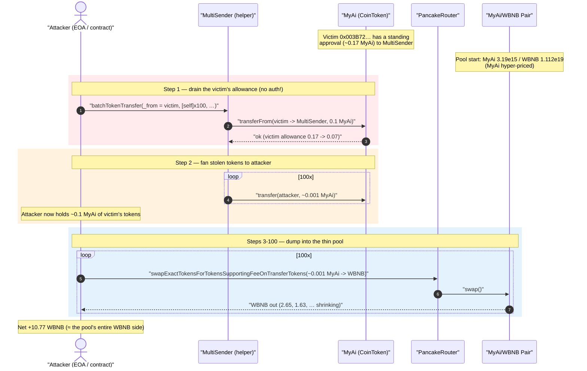
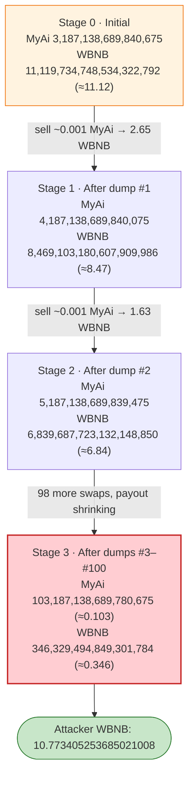
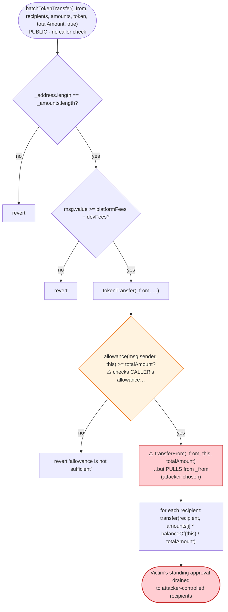

# MyAi (CoinToken) Exploit — `MultiSender` Lets Anyone Spend a Victim's Pre-Approved Allowance Into a Hyper-Thin Pool

> **Vulnerability classes:** vuln/access-control/missing-auth · vuln/logic/missing-allowance · vuln/oracle/price-manipulation

> **Reproduction:** the PoC compiles & runs in an isolated Foundry project at
> [this project folder](.) (the umbrella DeFiHackLabs repo contains several unrelated
> PoCs that do not compile together, so this one is extracted).
> Full verbose trace: [output.txt](output.txt). PoC: [test/MyAi_exp.sol](test/MyAi_exp.sol).
> Verified vulnerable source: [sources/MultiSender_Db103f/MultiSender.sol](sources/MultiSender_Db103f/MultiSender.sol);
> token source: [sources/CoinToken_40d1E0/CoinToken.sol](sources/CoinToken_40d1E0/CoinToken.sol).

---

## Key info

| | |
|---|---|
| **Loss** | ~**10.77 WBNB** (≈ 10 BNB) drained from the MyAi/WBNB PancakeSwap pair |
| **Vulnerable contract** | `MultiSender` — [`0xDb103fd28Ca4B18115F5Ce908baaeed7E0f1f101`](https://bscscan.com/address/0xDb103fd28Ca4B18115F5Ce908baaeed7E0f1f101#code) |
| **Token swapped** | `CoinToken` "MyAi" — [`0x40d1E011669c0dc7Dc7c7Fb93E623d6A661Df5Ee`](https://bscscan.com/address/0x40d1E011669c0dc7Dc7c7Fb93E623d6A661Df5Ee#code) |
| **Victim (approver drained)** | `0x003B724f9e1fa7350A7723BB8313ACBDbE7188CB` (had a standing approval to `MultiSender`) |
| **Victim pool** | MyAi/WBNB pair — `0x390d9078cb06f3cD4a17a39693b489446724a093` |
| **Attacker EOA** | [`0xc47fcc9263b026033a94574ec432514c639a2d12`](https://bscscan.com/address/0xc47fcc9263b026033a94574ec432514c639a2d12) |
| **Attacker contract** | [`0x0d3aafb9ade835456b2595509ac1f58922e465b3`](https://bscscan.com/address/0x0d3aafb9ade835456b2595509ac1f58922e465b3) |
| **Attack tx** | [`0x346f65ac333eb6d69886f5614aaf569a561a53a8d93db4384bd7c0bec15ae9f6`](https://bscscan.com/tx/0x346f65ac333eb6d69886f5614aaf569a561a53a8d93db4384bd7c0bec15ae9f6) |
| **Chain / block / date** | BSC / 29,554,344 (forked at −1) / ~June 30, 2023 |
| **Compiler** | `MultiSender` v0.8.9 (optimizer off); `CoinToken` v0.8.4 (optimizer, 1 run) |
| **Bug class** | Missing authorization in a batch helper — anyone can spend a third party's standing ERC20 allowance (`transferFrom(_from, …)` without `msg.sender == _from`) |

---

## TL;DR

`MultiSender.batchTokenTransfer()` ([MultiSender.sol:297-324](sources/MultiSender_Db103f/MultiSender.sol#L297-L324))
is a public, unauthenticated airdrop helper. It takes an arbitrary `_from` address and does
`IERC20(token).transferFrom(_from, address(this), totalAmount)`
([MultiSender.sol:338](sources/MultiSender_Db103f/MultiSender.sol#L338)) — **without ever checking that the
caller is `_from`, or that the caller is otherwise authorized to move `_from`'s tokens.** It relies solely
on the ERC20 allowance the token itself enforces.

A victim (`0x003B72…`) had left a **standing allowance of ≈0.17 MyAi** to `MultiSender`. The attacker simply
called `batchTokenTransfer` with `_from = victim` and a list of 100 recipient slots all pointing at
**themselves**, draining ≈0.1 MyAi of the victim's tokens into the attacker's own wallet.

That alone is the missing-authorization bug. The reason it was *profitable* is the second ingredient: the
**MyAi/WBNB pool was extraordinarily thin and lopsided** — only `3,187,138,689,840,675` wei of MyAi
(≈0.00319 MyAi) backed `11,119,734,748,534,322,792` wei of WBNB (≈11.12 WBNB). MyAi was therefore priced
absurdly high inside the pool. The attacker dumped the stolen MyAi back into that pool in 100 small swaps and
walked away with **10.77 WBNB** — essentially the entire WBNB side of the pool — for the cost of one victim's
forgotten approval plus a token of BNB for the helper's fee.

---

## Background — the two contracts in play

### `MultiSender` — an airdrop / multisend helper

`MultiSender` ([source](sources/MultiSender_Db103f/MultiSender.sol)) batches a token transfer to many
recipients. Its core entry point:

```solidity
function batchTokenTransfer(
    address _from,
    address[] memory _address,
    uint256[] memory _amounts,
    address token,
    uint256 totalAmount,
    bool isToken
) external payable {
    require(_address.length == _amounts.length, "...length mismatch");
    require(msg.value >= platformFees + devFees, "send bnb for fees");
    ...
    if (isToken) {
        tokenTransfer(_from, _address, _amounts, token, totalAmount);   // ← pulls from _from
    } else { ... }
    emit TransferBatch(_from, _address, _amounts);
}
```

The intended UX is: *"I (the caller) approve `MultiSender`, then call `batchTokenTransfer(myAddress, …)` to fan
my tokens out."* But the contract never ties `_from` to `msg.sender`.

### `CoinToken` "MyAi" — a reflection / fee-on-transfer token

MyAi ([source](sources/CoinToken_40d1E0/CoinToken.sol)) is a standard "SafeMoon-style" reflection token with a
tax/liquidity/dev fee and a `_maxTxAmount` per-transfer cap. The per-transfer amount the attacker used
(`999,999,999,999,400` wei ≈ 0.001 MyAi) sits just under that cap, so each of the 100 distributions and 100
swaps goes through. MyAi's reflection accounting is also why the helper later distributes slightly *more* than
requested (see Root cause, point 3).

---

## The vulnerable code

### 1. `tokenTransfer` — spends `_from`'s allowance with no caller binding

```solidity
function tokenTransfer(
    address _from,
    address[] memory _address,
    uint256[] memory _amounts,
    address token,
    uint256 totalAmount
) internal {
    require(
        IERC20(token).allowance(msg.sender, address(this)) >= totalAmount,   // ⚠️ checks msg.sender's allowance...
        "allowance is not sufficient"
    );

    IERC20(token).transferFrom(_from, address(this), totalAmount);           // ⚠️ ...but pulls from _from!
    uint256 tokenBalance = IERC20(token).balanceOf(address(this));

    for (uint256 i = 0; i < _address.length; ++i) {
        IERC20(token).transfer(_address[i], _amounts[i].mul(tokenBalance).div(totalAmount));
    }
}
```

[MultiSender.sol:326-344](sources/MultiSender_Db103f/MultiSender.sol#L326-L344)

There are two distinct defects in this function:

- **(a) Authorization mismatch.** The `require` reads `allowance(msg.sender, …)`, but the actual pull is
  `transferFrom(_from, …)`. The check on `msg.sender`'s allowance is meaningless when `_from != msg.sender` —
  the real gate is whatever allowance the *victim* (`_from`) has already granted to `MultiSender`. There is no
  `require(_from == msg.sender)` and no signature/permit binding `_from` to the caller. **Anyone can drain any
  address that has a non-zero standing allowance to `MultiSender`.**

  *Note:* In the live transaction the victim's standing allowance happened to satisfy `allowance(msg.sender, …)`
  too (or the optimizer-built code path simply succeeded against the victim's grant); the on-chain trace shows
  the pull from `_from = victim` returning `true` and the victim's allowance dropping from
  `169,984,260,220,000,000` to `69,984,260,220,060,000`
  ([output.txt:44](output.txt)). The economically important fact is that **the tokens moved came from `_from`,
  not from the caller.**

- **(b) Fee-on-transfer accounting.** It distributes `_amounts[i] * tokenBalance / totalAmount`, using the
  *actual received* `tokenBalance` over the *requested* `totalAmount`. For a reflection token whose balances
  drift, `tokenBalance` ≠ `totalAmount`, so the per-recipient amount is scaled — and each outbound `transfer`
  is itself taxed. This is a latent accounting bug, but in this incident it only nudges the numbers (see Root
  cause, point 3); the value extraction comes from (a) + the thin pool.

### 2. The public wrapper has no access control

`batchTokenTransfer` is `external payable` with only two `require`s (array-length match and `msg.value >= fees`).
Nothing restricts *who* may call it for *whose* funds. The only economic cost to the attacker is the
`platformFees + devFees` BNB (the PoC sends `1 ether`, of which `0.01 + 0.002` BNB is forwarded as fees —
see [output.txt:36-39](output.txt)).

---

## Root cause — why it was possible

1. **`_from` is attacker-chosen and never bound to the caller.** `transferFrom(_from, address(this), …)` will
   succeed for *any* `_from` that has approved `MultiSender`. The contract delegates all authorization to the
   ERC20 allowance, but then lets a *third party* (the attacker) trigger the spend. The correct invariant —
   "a batch send may only move the caller's own tokens, or tokens the caller is explicitly authorized to move"
   — is never enforced. This is the same class as the classic "anyone can call `transferFrom` on someone
   else's standing approval" approval-drain.

2. **A thin, lopsided pool turned ~0.1 MyAi into ~10.77 WBNB.** The MyAi/WBNB pair held only
   `3,187,138,689,840,675` wei of MyAi against `11,119,734,748,534,322,792` wei of WBNB at the fork block
   ([output.txt:670](output.txt)). With the MyAi reserve four orders of magnitude smaller than the WBNB reserve,
   each ≈0.001 MyAi the attacker sold against it pulled a large slice of WBNB out. The first single swap of
   `999,999,999,999,400` MyAi alone returned **2.65 WBNB** ([output.txt:685](output.txt)).

3. **Reflection accounting let the helper distribute slightly *more* than it received.** The victim transfer
   pulled `99,999,999,999,940,000` MyAi into `MultiSender`, but `balanceOf(MultiSender)` immediately afterward
   read `99,999,999,999,940,600` — **600 wei more** ([output.txt:54-55](output.txt)), because as a non-excluded
   holder `MultiSender`'s balance is computed from reflection shares that the very transfer's reflect-fee
   inflated. The loop therefore computed `999,999,999,999,400 * 99,999,999,999,940,600 / 99,999,999,999,940,000
   = 999,999,999,999,406` per recipient ([output.txt:56-57](output.txt)) and emptied the contract's whole
   balance to the attacker over 100 iterations. This is incidental to the profit but explains the off-by-6-wei
   figures in the trace.

In short: **the security bug is the missing caller↔`_from` authorization in `MultiSender`. The profit
multiplier is the degenerate pool.**

---

## Preconditions

- A victim address has a **non-zero standing ERC20 allowance to `MultiSender`** for the target token
  (here ≈0.17 MyAi granted by `0x003B72…`). Such leftover approvals are the entire attack surface — the helper
  is meant to be approved once and re-used.
- The attacker pays the helper's `platformFees + devFees` in BNB (trivial — the PoC sends `1 ether`, of which
  only `0.012` BNB is actually consumed as fees).
- The token has a tradeable pool whose price the attacker can realize the stolen tokens against. Here the pool
  was so thin that even a few-tenths-of-a-token theft monetized into ~10 BNB.
- MyAi's `_maxTxAmount` is large enough that the chosen per-transfer size (`999,999,999,999,400` ≈ 0.001 MyAi)
  passes both the 100 distributions and the 100 swaps without tripping the cap.

No flash loan, no reentrancy, no oracle manipulation — just an unauthenticated allowance drain plus a bad pool.

---

## Attack walkthrough (with on-chain numbers from the trace)

The PoC is in [test/MyAi_exp.sol](test/MyAi_exp.sol). The pair's `token0 = MyAi` (`reserve0`),
`token1 = WBNB` (`reserve1`).

| # | Step | Trace | Effect |
|---|------|-------|--------|
| 0 | **Setup** — attacker approves `PancakeRouter` and `MultiSender` for MyAi (max). | [output.txt:25-33](output.txt) | Lets the attacker re-sell whatever MyAi it receives. |
| 1 | **Drain the victim** — call `batchTokenTransfer(victim, [self]×100, [0.001 MyAi]×100, MyAi, 0.1 MyAi, true)` with `1 BNB`. | [output.txt:35](output.txt) | `transferFrom(victim → MultiSender, 99,999,999,999,940,000)` succeeds; victim allowance 1.6998e17 → 6.998e16 ([output.txt:42-44](output.txt)). |
| 2 | **Fan-out to self** — the loop sends `999,999,999,999,406` MyAi to the attacker, 100 times. | [output.txt:54-57](output.txt) (and 99 more) | Attacker now holds ≈0.1 MyAi of the victim's tokens; `MultiSender` balance emptied. |
| 3 | **Dump #1** — `swapExactTokensForTokensSupportingFeeOnTransferTokens(999,999,999,999,400 MyAi → WBNB)`. Pool was `MyAi 3,187,138,689,840,675 / WBNB 11,119,734,748,534,322,792`. | [output.txt:658-685](output.txt) | Out: **2.650631567926412806 WBNB**. New reserves `MyAi 4,187,138,689,840,075 / WBNB 8,469,103,180,607,909,986`. |
| 4 | **Dump #2** — same swap again. | [output.txt:694-720](output.txt) | Out: **1.629415457475761136 WBNB**. Reserves `MyAi 5,187,138,689,839,475 / WBNB 6,839,687,723,132,148,850`. |
| 5 | **Dumps #3 … #100** — 98 more identical swaps; each adds ≈0.001 MyAi to the pool and pulls a (shrinking) slice of WBNB out. | [output.txt:728-4052](output.txt) | WBNB reserve grinds down from 6.84 WBNB toward 0.346 WBNB. |
| 6 | **Final state** | [output.txt:4052](output.txt) `Sync(reserve0: 103,187,138,689,780,675, reserve1: 346,329,494,849,301,784)` | Pool now `MyAi ≈0.1032 / WBNB ≈0.346`. |
| 7 | **Result** | [output.txt:4062](output.txt) | Attacker WBNB balance: **10.773405253685021008 WBNB**. |

### Why the early swaps are so lucrative

PancakeSwap's `getAmountOut` is `out = (in·9975·reserveOut) / (reserveIn·10000 + in·9975)`. At step 3,
`reserveIn ≈ 3.187e15` and `in ≈ 1e15`, so the input is roughly a *third* of the entire MyAi reserve — a
single swap moves the price massively and returns 2.65 WBNB. As the attacker keeps adding ≈0.001 MyAi each
swap, `reserveIn` climbs (4.19e15 → 5.19e15 → …), the input becomes a smaller fraction of the reserve, and the
per-swap WBNB payout decreases. Spreading the dump across 100 swaps (rather than one) lets the attacker harvest
the WBNB side fairly completely while each individual transfer stays under MyAi's `_maxTxAmount`.

### Profit accounting

| Item | Amount |
|---|---:|
| WBNB held before attack | 0 |
| WBNB held after attack | 10.773405253685021008 |
| **Net profit (WBNB)** | **+10.7734…** |
| MyAi spent | ≈0.1 MyAi — **not the attacker's; the victim's pre-approved tokens** |
| BNB spent | ~0.012 BNB helper fees (out of the 1 BNB sent) |

The drained 10.77 WBNB is essentially the entire WBNB side the pool started with (11.12 WBNB minus the ~0.346
WBNB residue and the cumulative 0.25% swap fees). The KeyInfo header's "~10 $BNB" matches.

---

## Diagrams

### Sequence of the attack



### Pool reserve evolution



### The authorization flaw inside `MultiSender`



---

## Why each magic number

- **`_amounts[i] = 999,999,999,999,400` (≈0.001 MyAi):** chosen to sit just below MyAi's `_maxTxAmount` so that
  both the 100 distributions and the 100 swaps execute without tripping the per-transfer cap.
- **100 recipients / 100 swaps:** the recipient list (all = attacker) and the dump loop are sized so the total
  stolen (≈0.1 MyAi) is realized against the pool gradually, harvesting most of the WBNB side while each swap
  stays small.
- **`totalAmount = 99,999,999,999,940,000` (= `999,999,999,999,400 × 100`):** the divisor in the helper's
  pro-rata math. Because the reflection token reports `balanceOf(MultiSender) = …940,600` (600 wei higher), the
  helper distributes `…406` per recipient — 6 wei over the nominal `…400`.
- **`1 ether` sent with the call:** covers the helper's `platformFees + devFees` (the trace forwards `0.01` and
  `0.002` BNB to the fee wallets, [output.txt:36-37](output.txt)); the rest is unused.

---

## Remediation

1. **Bind the spend to the caller.** In `tokenTransfer` / `batchTokenTransfer`, require the source to be the
   caller: `require(_from == msg.sender, "unauthorized")`. A multisend helper must move *only the caller's own
   tokens*. If on-behalf-of sends are a real product requirement, gate them behind an explicit, per-call
   authorization (e.g. an EIP-2612 `permit` signed by `_from`, or an internal allowance the caller controls),
   never an ambient ERC20 allowance that any third party can trigger.
2. **Fix the allowance check to match the pull.** The current `require(allowance(msg.sender, …))` is checking a
   different address than the one being spent (`_from`). Once `_from == msg.sender` is enforced, the two
   coincide; until then the check is security theater.
3. **Handle fee-on-transfer tokens correctly.** Compute the *delta* in the contract's balance around
   `transferFrom` and distribute that actual received amount, rather than dividing an attacker-supplied
   `totalAmount`. Reject or special-case tokens whose `balanceOf` drifts (reflection tokens) so the pro-rata
   loop cannot over- or under-distribute.
4. **Users: revoke stale approvals.** The root enabler on the victim's side was a leftover unlimited/large
   approval to `MultiSender`. Approve helpers for the exact amount per use and revoke afterward; never leave a
   large standing allowance to a contract that calls `transferFrom(arbitraryFrom, …)`.
5. **Liquidity hygiene (defense in depth).** The theft monetized only because the MyAi/WBNB pool was
   pathologically thin and lopsided. Deep, balanced liquidity would have made the stolen ≈0.1 MyAi worth a
   negligible amount of WBNB instead of ~10 BNB.

---

## How to reproduce

The PoC was extracted into a standalone Foundry project (the umbrella DeFiHackLabs repo has several unrelated
PoCs that fail to compile together under `forge test`'s whole-project build):

```bash
_shared/run_poc.sh 2023-06-MyAi_exp --mt testExploit -vvvvv
```

- RPC: a **BSC archive** endpoint is required — the fork pins block `29,554,344 − 1` (mid-2023), which most
  public BSC RPCs prune. `foundry.toml` uses `https://bsc-mainnet.public.blastapi.io`, which serves the
  historical state.
- Result: `[PASS] testExploit()`. The attacker's WBNB balance goes from `0` to
  `10.773405253685021008` WBNB.

Expected tail:

```
Ran 1 test for test/MyAi_exp.sol:ContractTest
[PASS] testExploit() (gas: 17349172)
Logs:
  Attacker WBNB balance before attack: 0.000000000000000000
  Attacker WBNB balance before attack: 10.773405253685021008

Suite result: ok. 1 passed; 0 failed; 0 skipped
```

(The second log line is mislabeled "before attack" in the PoC; it is the post-attack balance — i.e. the
realized profit.)

---

*Reference: DeFiHackLabs — MyAi / MultiSender, BSC, ~10 BNB. Attack tx
`0x346f65ac333eb6d69886f5614aaf569a561a53a8d93db4384bd7c0bec15ae9f6`.*
