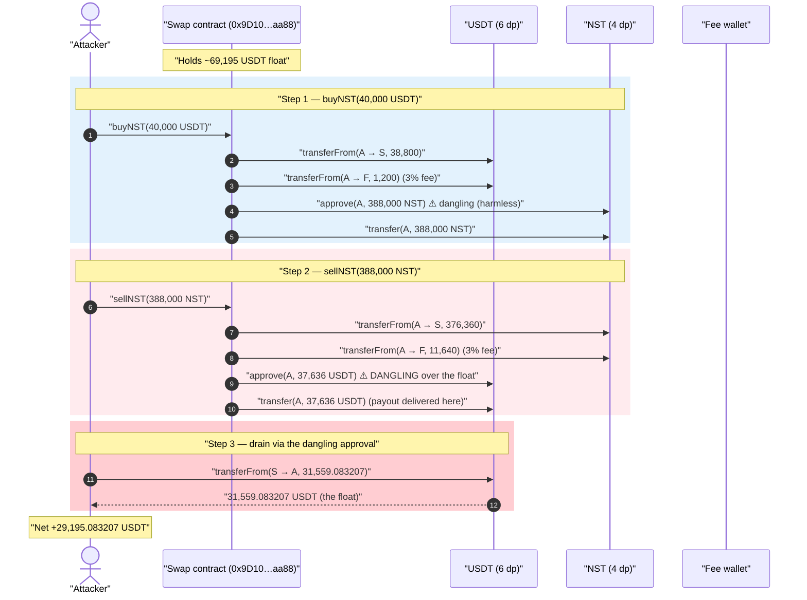
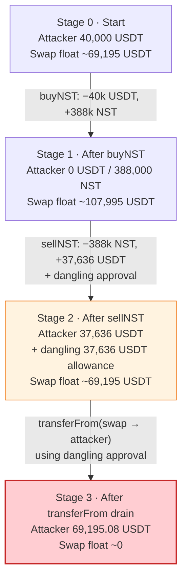
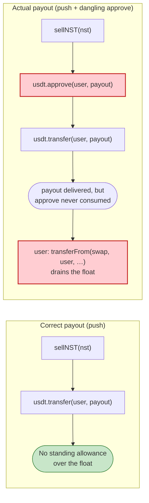

# NST Swap Exploit — Dangling `approve()` lets the buyer drain the swap contract's USDT reserves

> **Reproduction:** the PoC compiles & runs in an isolated Foundry project at
> [this project folder](.) (the umbrella DeFiHackLabs repo contains many unrelated PoCs that do
> not all compile, so this one was extracted into a standalone project).
> Full verbose trace: [output.txt](output.txt).
> Verified token source: [NSTToken.sol](sources/NSTToken_83eE54/NSTToken.sol).
> **Caveat:** the actually-vulnerable contract is the **swap contract**
> `0x9D10…aa88`, which was **never verified on-chain** — so the snippets below for its
> `buyNST` / `sellNST` logic are *reconstructed from the execution trace*, not copied from
> verified source. The NST token itself (verified) is benign.

---

## Key info

| | |
|---|---|
| **Loss** | **29,195.083207 USDT (~$29,195)** stolen from the swap contract |
| **Vulnerable contract** | NST **Swap** contract `0x9D101E71064971165Cd801E39c6B07234B65aa88` (**unverified**) — [`bscscan/polygonscan`](https://polygonscan.com/address/0x9D101E71064971165Cd801E39c6B07234B65aa88) |
| **Tokens involved** | USDT [`0xc2132D05D31c914a87C6611C10748AEb04B58e8F`](https://polygonscan.com/address/0xc2132D05D31c914a87C6611C10748AEb04B58e8F) (6 dp) ↔ NST [`0x83eE54ccf462255ea3Ec56Fa8dE6797d679276e7`](https://polygonscan.com/address/0x83eE54ccf462255ea3Ec56Fa8dE6797d679276e7) (4 dp) |
| **Attacker EOA** | `0xcb3585f3e09f0238a3f61838502590a23f15bb5b` |
| **Attacker contract** | `0x3bb7a0f2fe88aba35408c64f588345481490fe93` |
| **Attack tx** | [`0xa1f2377fc6c24d7cd9ca084cafec29e5d5c8442a10aae4e7e304a4fbf548be6d`](https://polygonscan.com/tx/0xa1f2377fc6c24d7cd9ca084cafec29e5d5c8442a10aae4e7e304a4fbf548be6d) |
| **Chain / block / date** | Polygon / fork **43,430,814** / ~June 2023 |
| **Compiler** | NST token: Solidity v0.8.9, optimizer 1000 runs (swap contract unverified) |
| **Bug class** | Leftover/dangling ERC-20 `approve()` over the contract's own reserves → reuse via `transferFrom` |

---

## TL;DR

Milktech's NST swap contract is a simple fixed-price exchange between **USDT** (6 decimals) and the
company token **NST** (4 decimals), holding a USDT float to pay out sellers.

When you call `sellNST`, the contract sends you your USDT payout, but it does so by **first
`approve()`-ing you for that payout amount and then paying you with a plain `transfer()`** — instead
of letting *you* pull it. The `transfer()` moves the money, but the `approve()` is never consumed and
never reset. The result is a **dangling allowance**: after a sell, the attacker holds an ERC-20
allowance over the swap contract's *own* USDT balance equal to the payout it just received.

The attacker then simply calls `usdt.transferFrom(swapContract, attacker, …)` and walks off with the
swap contract's remaining USDT reserves — the company's deposited liquidity.

Concretely (all numbers from [output.txt](output.txt)):

1. **Buy:** deposit `40,000 USDT`; after a 3% fee the contract sends back `388,000.0000 NST`
   (`3,880,000,000` raw NST units).
2. **Sell:** sell those `388,000 NST` back; after a 3% fee the contract pays out `37,636 USDT`
   (`37,636,000,000` raw units) — and **`approve(attacker, 37,636,000,000)`** on USDT, then
   `transfer`s the same amount.
3. **Drain:** the attacker uses that dangling `37,636` USDT allowance to
   `transferFrom(swapContract, attacker, 31,559.083207 USDT)` — emptying the swap contract's USDT
   float down to ~0.

Net: started with 40,000 USDT, ended with **69,195.083207 USDT** → **+29,195.083207 USDT profit**, all
of it pulled out of the swap contract's reserves. The PoC mocks the attacker's `40k` working capital
with `deal` (the real attacker flash-loaned it from Balancer).

---

## Background — what the NST system is

- **NST token** ([NSTToken.sol](sources/NSTToken_83eE54/NSTToken.sol)) is a verified, fairly vanilla
  OpenZeppelin-style ERC-20 with `Pausable`, `Ownable`, and a custom `Minter` role. It has **4
  decimals** ([NSTToken.sol:1146-1148](sources/NSTToken_83eE54/NSTToken.sol#L1146-L1148)) and forbids
  transfers *to the token contract itself*
  ([NSTToken.sol:1190-1193](sources/NSTToken_83eE54/NSTToken.sol#L1190-L1193)). **The token is not the
  bug.**
- **USDT** on Polygon is a 6-decimal proxy token
  ([UChildERC20Proxy.sol](sources/UChildERC20Proxy_c2132D/UChildERC20Proxy.sol)). In the trace its
  logic lives behind a `delegatecall` to `0x7FFB…c1e2`.
- **Swap contract** `0x9D10…aa88` (**unverified**) is the heart of the system: it offers `buyNST(usdtIn)`
  and `sellNST(nstIn)` at a *fixed* USD price, takes a 3% fee to a fee wallet
  (`0xbb5a92c69355Dd75480e66Db8D07cEA4443CbEa1`), and keeps a USDT float so sellers can be paid.
  Because it was never verified, the attacker had to reverse the selectors:
  - `buyNST` = `0x6e41592c`
  - `sellNST` = `0x7cd0599b`

From the trace, the swap held ~**69,195 USDT** of float just before the attack
(`USDT.balanceOf(swapper) = 69,195,083,207`, [output.txt:118-121](output.txt)) — this is the prize.

The fixed exchange rate is visible in the raw units: in both directions the contract uses a constant
**×10 between raw USDT units and raw NST units** (after the 3% fee):

- buy: `38,800,000,000` effective USDT units → `3,880,000,000` NST units (÷10)
- sell: `3,763,600,000` effective NST units → `37,636,000,000` USDT units (×10)

(USDT 6 dp vs NST 4 dp differ by 100×; the contract's ×10 constant is the protocol's chosen price of
`0.1 USD/NST` baked into raw-unit math. The decimal handling is *not* the vulnerability — the
round-trip is value-neutral apart from fees; the theft comes entirely from the dangling approval.)

---

## The vulnerable code (reconstructed from the trace)

> The swap contract is unverified. The following is the **behaviour observed in the trace**, written
> as the equivalent Solidity. The two damning facts are: (a) the payout is delivered with
> `token.transfer(msg.sender, …)`, and (b) it is immediately preceded by
> `token.approve(msg.sender, …)` for the **same amount** — an allowance that is therefore never spent
> and never cleared.

### `sellNST` — the leaky payout

```solidity
// selector 0x7cd0599b  — RECONSTRUCTED from output.txt, NOT verified source
function sellNST(uint256 nstAmount) external returns (uint256 usdtOut) {
    uint256 fee  = nstAmount * 3 / 100;          // 116,400,000 NST units in the trace
    uint256 net  = nstAmount - fee;              // 3,763,600,000 NST units

    nst.transferFrom(msg.sender, address(this), net); // [output.txt:125-130]
    nst.transferFrom(msg.sender, feeWallet,    fee);  // [output.txt:131-136]

    usdtOut = net * 10;                          // 37,636,000,000 USDT units (fixed price ×10)

    usdt.approve(msg.sender, usdtOut);           // ⚠️ [output.txt:137-143] DANGLING APPROVAL over the float
    usdt.transfer(msg.sender, usdtOut);          //    [output.txt:144-151] payout actually delivered here
    return usdtOut;                              //    the approve() above is never consumed / reset
}
```

### `buyNST` — same anti-pattern (less harmful here)

```solidity
// selector 0x6e41592c  — RECONSTRUCTED from output.txt
function buyNST(uint256 usdtAmount) external returns (uint256 nstOut) {
    uint256 fee = usdtAmount * 3 / 100;          // 1,200,000,000 USDT units
    uint256 net = usdtAmount - fee;              // 38,800,000,000 USDT units

    usdt.transferFrom(msg.sender, address(this), net); // [output.txt:83-92]
    usdt.transferFrom(msg.sender, feeWallet,    fee);  // [output.txt:93-102]

    nstOut = net / 10;                           // 3,880,000,000 NST units

    nst.approve(msg.sender, nstOut);             // ⚠️ [output.txt:103-107] dangling NST approval
    nst.transfer(msg.sender, nstOut);            //    [output.txt:108-113] payout delivered
    return nstOut;
}
```

The benign NST token code (for contrast) — a textbook ERC-20 with nothing wrong in `transfer` /
`transferFrom` / `approve` ([NSTToken.sol:804-858](sources/NSTToken_83eE54/NSTToken.sol#L804-L858)).
The token did exactly what it was told; the swap contract is what mis-issued the approval.

---

## Root cause — why it was possible

A correct exchange contract that holds a reserve must **never grant an external caller an ERC-20
allowance over its own reserve balance.** The only legitimate way to pay a user out of a held balance
is a direct `transfer(user, amount)` — `transfer` itself *is* the authorization. An `approve(user,
amount)` on top of that is not just redundant; it is a standing license for `user` to take that much
*again* from the contract's balance whenever they want, via `transferFrom(contract, user, amount)`,
until the allowance is exhausted or reset.

The swap contract does exactly the wrong thing:

> In `sellNST` it calls `usdt.approve(msg.sender, usdtOut)` **and** `usdt.transfer(msg.sender,
> usdtOut)`. The `transfer` pays the seller correctly. The `approve` then leaves the seller with a
> live `usdtOut`-sized allowance over the contract's *remaining* float. Because the float is shared
> across all users, the seller can `transferFrom` it out — that float is other people's (and the
> company's) money.

Three design facts compose into the theft:

1. **`approve` + `transfer` instead of `transfer` alone.** The redundant `approve` creates a dangling
   allowance equal to the payout, scoped to the contract's own balance.
2. **The allowance is never consumed.** Since payout is delivered with `transfer` (not
   `transferFrom`), the `approve` is *not* spent. A correct "pull" design (`approve` then have the
   *user* `transferFrom`) would have consumed it; this hybrid leaves it dangling.
3. **A shared reserve to steal from.** The contract holds a USDT float (~69k USDT) so it can pay
   sellers. The dangling allowance points straight at that shared pot, so the attacker drains
   everyone's liquidity, not just their own deposit.

The 3% fees and the fixed ×10 price are economically irrelevant to the exploit — they merely shave a
small amount off a value-neutral round trip. **100% of the attacker's profit comes from re-using the
dangling approval to `transferFrom` the contract's float.**

---

## Preconditions

- The swap contract holds a **USDT reserve** large enough to be worth stealing (it held ~69,195 USDT).
- `sellNST` issues a USDT `approve(msg.sender, payout)` to the caller (the dangling approval). This is
  unconditional — every seller gets it.
- The attacker needs working capital ≥ the round-trip size to *generate* a large dangling allowance.
  Here `40,000 USDT` was enough to mint a `37,636 USDT` allowance; the real attacker **flash-loaned**
  the 40k from Balancer (the PoC mocks this with `deal`, [test/NST_exp.sol:49-51](test/NST_exp.sol#L49-L51)).
- No timing, no privileged role, no oracle — it is permissionless and single-transaction.

---

## Attack walkthrough (with on-chain numbers from the trace)

All raw units below are from [output.txt](output.txt). USDT has 6 decimals (`40_000_000_000` =
40,000 USDT); NST has 4 decimals (`3_880_000_000` = 388,000 NST).

| # | Step (trace ref) | Attacker USDT | Attacker NST | Swap contract USDT float | Effect |
|---|------------------|--------------:|-------------:|-------------------------:|--------|
| 0 | **Start** — `deal` 40k USDT to attacker ([test:51](test/NST_exp.sol#L51)) | 40,000.000000 | 0 | ~69,195.083207 | Attacker funded; swap holds the float. |
| 1 | **`buyNST(40,000 USDT)`** ([output.txt:73-114](output.txt)): 38,800 USDT → swap, 1,200 USDT → fee wallet, swap `approve`s + `transfer`s 388,000 NST | 0 | 388,000.0000 | ~107,995.083207 | Attacker holds NST + a dangling **388,000 NST** allowance (harmless side-effect). |
| 2 | **`sellNST(388,000 NST)`** ([output.txt:115-152](output.txt)): 3,763,600,000 NST → swap, fee → fee wallet; swap **`approve(attacker, 37,636 USDT)`** then **`transfer(attacker, 37,636 USDT)`** | 37,636.000000 | 0 | ~69,195.083207 | ⚠️ Attacker now holds a **dangling 37,636 USDT allowance** over the swap's float. |
| 3 | **`usdt.transferFrom(swap → attacker, 31,559.083207)`** ([output.txt:153-162](test/NST_exp.sol#L60)) | **69,195.083207** | 0 | **0** | Float drained using the dangling allowance. Remaining allowance 6,076.916793 left unused. |

**Why the final pull is exactly `31,559.083207`:** after step 2 the swap contract's USDT balance is
`69,195,083,207` units. The attacker's dangling allowance is `37,636,000,000` units, but the contract
only *has* `69,195,083,207 − 37,636,000,000 = 31,559,083,207` units left after paying the sell, so the
attacker pulls all of it (`transferFrom` reverts if it exceeds the balance, so the attacker pulls the
balance, not the full allowance). The trace confirms the residual allowance afterwards:
`Approval(swapper → test, 6,076,916,793)` ([output.txt:156](output.txt)), and
`37,636,000,000 − 31,559,083,207 = 6,076,916,793` ✓.

### Profit / loss accounting (USDT)

| Direction | Amount (USDT) |
|---|---:|
| In — initial capital (flash-loaned, mocked via `deal`) | 40,000.000000 |
| Out — `buyNST` cost (38,800 to pool + 1,200 fee) | −40,000.000000 |
| In — `sellNST` payout | +37,636.000000 |
| In — **dangling-allowance drain** | +31,559.083207 |
| **Net profit** | **+29,195.083207** |

The PoC asserts this exactly: `console.log("USDT Theft", 29195083207)` ([output.txt:5-7](output.txt))
and the final balance is `69,195,083,207` ([output.txt:163-166](output.txt)). After repaying the 40k
flash loan, the attacker keeps the **29,195.08 USDT**.

---

## Diagrams

### Sequence of the attack



### Pool / float state evolution



### Why the approval is the bug — correct vs. actual payout



---

## Remediation

1. **Pay out with `transfer` only — never `approve` your own reserve to a user.** Delete the
   `usdt.approve(msg.sender, …)` (and the symmetric `nst.approve(msg.sender, …)` in `buyNST`). The
   `transfer` alone correctly and safely delivers the payout. This single change eliminates the bug.
2. **If a pull pattern is genuinely required**, make it consistent: `approve(user, amount)` and let the
   *user* call `transferFrom(swap, user, amount)` — and never also `transfer` the same funds. Mixing
   push (`transfer`) and pull (`approve`) is what creates the dangling allowance.
3. **Reset allowances defensively.** Any function that issues an allowance over the contract's own
   balance should zero it again before returning (`approve(user, 0)`), so no allowance survives the
   call.
4. **Don't co-mingle a shared reserve with per-user allowances.** Treat the swap float as protected
   capital; never expose it through an allowance to arbitrary callers.
5. **Verify and audit the contract that holds the money.** The token was verified and clean; the
   *swap* contract — the one custodying the float — was unverified and unaudited. The asset-holding
   contract is exactly where review matters most.

---

## How to reproduce

The PoC was extracted into a standalone Foundry project:

```bash
_shared/run_poc.sh 2023-06-NST_exp --mt testExploit -vvvvv
```

- **Fork:** Polygon at block `43,430,814` (`foundry.toml` uses `https://polygon.drpc.org`; any Polygon
  archive RPC that serves state at this block works). The swap contract is on-chain at that block, so
  no source is needed to run the PoC — it calls the live bytecode via raw selectors
  (`0x6e41592c` buyNST, `0x7cd0599b` sellNST, [test/NST_exp.sol:53-57](test/NST_exp.sol#L53-L57)).
- **Capital:** the attacker's 40k USDT working capital is mocked with `deal` instead of the original
  Balancer flash loan ([test/NST_exp.sol:49-51](test/NST_exp.sol#L49-L51)).
- **Result:** `[PASS] testExploit()` with `USDT Theft 29195083207` (≈ 29,195.08 USDT).

Expected tail:

```
Ran 1 test for test/NST_exp.sol:NstExploitTest
[PASS] testExploit() (gas: 415500)
Logs:
  USDT Theft 29195083207

Suite result: ok. 1 passed; 0 failed; 0 skipped; finished in 8.07s
```

---

*References: write-up by [@eugenioclrc](https://twitter.com/eugenioclrc); attack tx
[`0xa1f2377f…548be6d`](https://polygonscan.com/tx/0xa1f2377fc6c24d7cd9ca084cafec29e5d5c8442a10aae4e7e304a4fbf548be6d).
NST = Milktech "Instante" token, Polygon, ~$29.2K loss.*
