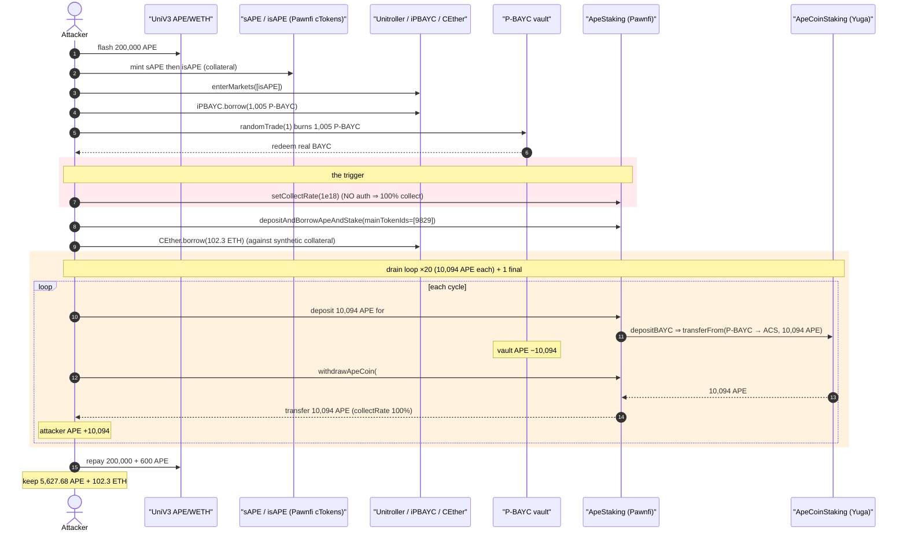
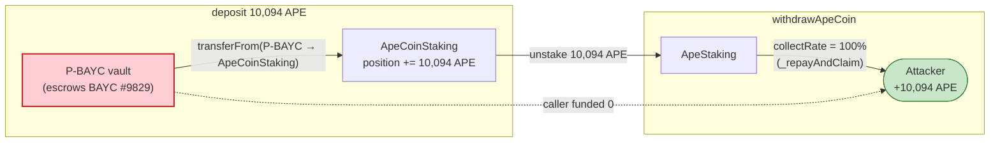
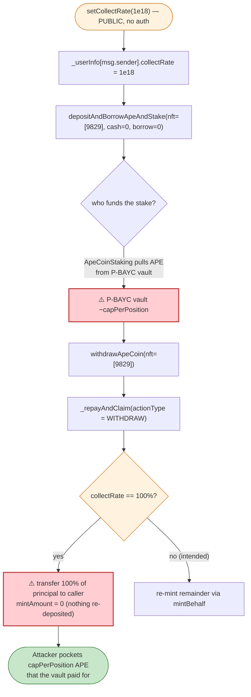

# Pawnfi `ApeStaking` Exploit — Unrestricted `collectRate` + Vault-Funded Staking Drains the P-BAYC ApeCoin Reserve

> **Vulnerability classes:** vuln/access-control/missing-auth · vuln/access-control/missing-modifier · vuln/logic/missing-validation

> **Reproduction:** the PoC compiles & runs in an isolated Foundry project at
> [this project folder](.) (the umbrella DeFiHackLabs repo contains many unrelated PoCs that do not
> compile under a single `forge build`, so this one was extracted).
> Full verbose trace: [output.txt](output.txt).
> Verified vulnerable source: [contracts_ApeStaking.sol](sources/ApeStaking_85018C/contracts_ApeStaking.sol).

---

## Key info

| | |
|---|---|
| **Loss** | ~$820K — drained the ApeCoin (APE) reserve held by Pawnfi's **P-BAYC** vault, plus ~102.3 ETH borrowed against synthetic collateral |
| **Vulnerable contract** | `ApeStaking` (Pawnfi) — implementation [`0x85018CF6F53c8bbD03c3137E71F4FCa226cDa92C`](https://etherscan.io/address/0x85018CF6F53c8bbD03c3137E71F4FCa226cDa92C#code), called via proxy `ApeStaking1` `0x0B89032E2722b103386aDCcaE18B2F5D4986aFa0` |
| **Victim asset / pool** | APE held by **P-BAYC** `0x5f0A4a59C8B39CDdBCf0C683a6374655b4f5D76e`; ETH liquidity in **CEther** `0x37B614714e96227D81fFffBdbDc4489e46eAce8C` |
| **Attacker EOA** | [`0x8f7370d5d461559f24b83ba675b4c7e2fdb514cc`](https://etherscan.io/address/0x8f7370d5d461559f24b83ba675b4c7e2fdb514cc) |
| **Attacker contract** | [`0xb618d91fe014bfcb9c8d440468b6c78e9ada9da1`](https://etherscan.io/address/0xb618d91fe014bfcb9c8d440468b6c78e9ada9da1) |
| **Attack tx** | [`0x8d3036371ccf27579d3cb3d4b4b71e99334cae8d7e8088247517ec640c7a59a5`](https://etherscan.io/tx/0x8d3036371ccf27579d3cb3d4b4b71e99334cae8d7e8088247517ec640c7a59a5) |
| **Chain / fork block / date** | Ethereum mainnet / 17,496,619 / June 16–17, 2023 |
| **Compiler** | Source `^0.8.10` (PoC built with Solc 0.8.34 in the isolated project) |
| **Bug class** | Broken staking-reward accounting — unrestricted `collectRate` setter + principal funded from the shared vault but credited 1:1 to the caller |
| **Reference** | SolidityScan — https://blog.solidityscan.com/pawnfi-hack-analysis-38ac9160cbb4 |

---

## TL;DR

Pawnfi's `ApeStaking` lets a user deposit a "P-BAYC" wrapped NFT, have the protocol stake the
underlying BAYC into Yuga's `ApeCoinStaking`, and later withdraw the staked ApeCoin. Two design flaws
combine into a self-funding money pump:

1. **`setCollectRate()` has no access control** ([contracts_ApeStaking.sol:752-756](sources/ApeStaking_85018C/contracts_ApeStaking.sol#L752-L756)).
   Anyone can set their own `collectRate` to `1e18` (100%), meaning **100% of any withdrawn ApeCoin is
   handed directly to the caller** instead of being re-minted back into the protocol's lending position
   ([`_repayAndClaim`:562-563](sources/ApeStaking_85018C/contracts_ApeStaking.sol#L562-L563)).
2. **The staked principal is paid out of the P-BAYC vault, not the caller.** When `depositAndBorrowApeAndStake`
   stakes `amount` ApeCoin for an NFT, that ApeCoin is `transferFrom`'d **out of the P-BAYC contract's own
   balance** by `ApeCoinStaking.depositBAYC` (the BAYC is escrowed in P-BAYC, so Yuga pulls APE from P-BAYC).
   The caller never funds the deposit — yet on `withdrawApeCoin` the caller receives the full amount.

So each `deposit(amount) → withdraw(amount)` cycle moves `amount` APE **from the P-BAYC vault to the
attacker for free**. The attacker simply loops this with `amount = capPerPosition` (the max ApeCoin a
single BAYC position may hold, **10,094 APE** at the fork block) until P-BAYC's APE balance is empty.

The attacker bootstrapped a BAYC NFT to drive the cycle by flash-borrowing 200,000 APE, minting synthetic
`isAPE` collateral, borrowing 1,005 P-BAYC from the lending market, and calling `randomTrade(1)` to redeem
a real BAYC (#9829) out of the vault. The same synthetic collateral was then reused to drain **~102.3 ETH**
from `CEther`.

---

## Background — what `ApeStaking` does

Pawnfi wraps blue-chip NFTs into fungible "P-Tokens" (e.g. **P-BAYC**) backed by NFTs escrowed in the
P-Token contract, and runs a Compound-style lending market (Unitroller + cTokens like `iPBAYC`, `isAPE`,
`CEther`). `ApeStaking` ([source](sources/ApeStaking_85018C/contracts_ApeStaking.sol)) is the glue that
lets a P-BAYC holder put the underlying BAYC to work in Yuga Labs' `ApeCoinStaking`:

- **`depositAndBorrowApeAndStake`** ([:321-358](sources/ApeStaking_85018C/contracts_ApeStaking.sol#L321-L358))
  records the user as staker of an NFT and forwards a staking call to the P-Token agency
  (`IPTokenApeStaking(ptokenStaking).depositApeCoin`), which in turn calls `ApeCoinStaking.depositBAYC`.
- **`withdrawApeCoin`** ([:382-464](sources/ApeStaking_85018C/contracts_ApeStaking.sol#L382-L464))
  unstakes the principal + rewards and routes the proceeds through `_repayAndClaim`.
- **`_repayAndClaim`** ([:528-570](sources/ApeStaking_85018C/contracts_ApeStaking.sol#L528-L570)) repays
  any ApeCoin debt, then splits the remainder: `collectRate` of it is sent straight to the user, the rest
  is re-minted into the protocol via `mintBehalf`.
- **`collectRate`** is a per-user fraction (scaled by `BASE_PERCENTS = 1e18`) controlling that split.

On-chain facts at the fork block (from the trace):

| Parameter | Value |
|---|---|
| `BASE_PERCENTS` | `1e18` ([ApeStakingStorage.sol:11](sources/ApeStaking_85018C/contracts_ApeStakingStorage.sol#L11)) |
| `capPerPosition` (BAYC pool, range 2) | **10,094 APE** = `10094000000000000000000` ([output.txt:2534](output.txt)) |
| APE balance held by **P-BAYC** vault | **206,227.68 APE** (`206227682165404022135955`) — the prize |
| BAYC NFT redeemed by attacker | tokenId **9829** ([output.txt:2074](output.txt)) |
| P-BAYC borrowed from `iPBAYC` | **1,005 P-BAYC** ([output.txt:1838](output.txt)) |

> The PoC sets `deal(address(APE), address(PBAYC), 206_227_682_165_404_022_135_955)` to restore the P-BAYC
> APE balance that the live attack consumed; the inline comment notes that without it
> `APE.balanceOf(P-BAYC)` reads 0 on the fork and the staking deposit reverts with
> `ERC20: transfer amount exceeds balance` ([Pawnfi_exp.sol:142-145](test/Pawnfi_exp.sol#L142-L145)). This
> is the very balance the exploit drains.

---

## The vulnerable code

### 1. Anyone can set their own collect rate to 100%

```solidity
// contracts_ApeStaking.sol:752-756
function setCollectRate(uint256 newCollectRate) external {   // ⚠️ NO access control
    require(newCollectRate <= BASE_PERCENTS);                // only an upper bound
    _userInfo[msg.sender].collectRate = newCollectRate;
    emit SetCollectRate(msg.sender, newCollectRate);
}
```

The attacker calls `setCollectRate(1e18)` ([output.txt:2100](output.txt)) so that `collectRate == BASE_PERCENTS`.

### 2. `collectRate` decides how much withdrawn ApeCoin goes straight to the caller

```solidity
// contracts_ApeStaking.sol:554-568  (inside _repayAndClaim)
totalAmount = allAmount + allClaimAmount;
if(totalAmount > 0) {
    if(actionType == RewardAction.REDEEM || actionType == RewardAction.ONREDEEM) {
        ...
    } else {
        uint256 claimAmount = totalAmount * _userInfo[userAddr].collectRate / BASE_PERCENTS; // 100% → all
        _transferAsset(apeCoin, userAddr, claimAmount);   // ⚠️ entire withdrawn principal to caller
        if(totalAmount > claimAmount) {
            uint256 mintAmount = totalAmount - claimAmount;       // 0 when collectRate == 100%
            IApePool(apePool).mintBehalf(userAddr, mintAmount);   // nothing re-deposited
        }
    }
}
```

With `collectRate == 1e18`, `claimAmount == totalAmount`, so **the entire unstaked principal is transferred
to the caller** and **nothing is re-minted back into the protocol**.

### 3. The deposited principal is pulled from the P-BAYC vault, not from the caller

`depositAndBorrowApeAndStake` only requires the caller to be the NFT's staker; for a `borrowAmount == 0`,
`cashAmount == 0` call it transfers **no ApeCoin from the caller**:

```solidity
// contracts_ApeStaking.sol:330-352  (borrowAmount==0, cashAmount==0 → both blocks skipped)
if(stakingInfo.borrowAmount > 0) { ... }   // skipped
if(stakingInfo.cashAmount  > 0) { ... }    // skipped
...
if(_nfts.length > 0) {
    IPTokenApeStaking(ptokenStaking).depositApeCoin(nftAmount, _nfts);  // funded by P-BAYC, not caller
}
```

In the trace, the underlying `ApeCoinStaking.depositBAYC` pulls the staking amount **out of the P-BAYC
contract's balance**:

```
ApeStaking2::depositBAYC([(9829, 10094 APE)])
  APE::transferFrom(PBAYC → ApeStaking2, 10094 APE)   // ← funded by the vault   (output.txt:2680)
```

And the matching withdraw immediately routes that same 10,094 APE to the attacker:

```
ApeStaking2 → ApeStaking1 : transfer 10094 APE          (output.txt:2628)
ApeStaking1 → PawnfiTest  : transfer 10094 APE          (output.txt:2643, collectRate=100%)
```

The deposit debits the vault; the withdraw credits the attacker. Repeat.

---

## Root cause — why it was possible

`ApeStaking` mixed up *who owns the staked ApeCoin*:

> The ApeCoin staked for a BAYC position is sourced from the **shared P-BAYC vault** (because Yuga's
> `ApeCoinStaking` pulls APE from whoever escrows the BAYC — the P-Token contract). But on the way back
> out, `_repayAndClaim` treats 100% of that principal as the **individual caller's** to collect, gated only
> by a `collectRate` that the caller sets on themselves with **no authorization**.

Three independent failures compose:

1. **Missing access control on `setCollectRate`.** `collectRate` is a value-routing parameter — it decides
   how much protocol-held ApeCoin a user walks away with. Letting anyone set it to 100% is the trigger.
   (Contrast with `setFeeTo`/`setStakingConfiguration`, both correctly `onlyRole(DEFAULT_ADMIN_ROLE)`
   — [:762-772](sources/ApeStaking_85018C/contracts_ApeStaking.sol#L762-L772).)
2. **No conservation check between deposit and withdraw.** The deposit consumed vault funds, but the
   withdraw never verifies the caller actually contributed those funds (`cashAmount`/`borrowAmount` were
   both zero). `withdrawApeCoin` happily returns the full `capPerPosition` principal to a caller who
   funded none of it.
3. **`capPerPosition` is an attacker-chosen, repeatable knob.** Yuga allows up to `capPerPosition` ApeCoin
   per BAYC position. The attacker reads it live (`ApeStaking2.getTimeRangeBy(1, lastRewardsRangeIndex)`,
   [Pawnfi_exp.sol:194-197](test/Pawnfi_exp.sol#L194-L197)) and stakes/unstakes exactly that amount each
   loop, extracting `capPerPosition` APE from the vault per iteration with no cooldown.

The synthetic-collateral bootstrap (mint `sAPE`→`isAPE` from flash-loaned APE, then borrow against it) is
what gave the attacker (a) a BAYC NFT to drive the cycle and (b) a free ~102.3 ETH borrow from `CEther` —
all repaid/kept inside the single flash-loan transaction.

---

## Preconditions

- The P-BAYC vault holds a non-trivial APE balance (it did: **206,227 APE**). This is what gets drained.
- The caller controls a BAYC NFT registered as their staked position in `ApeStaking`. The attacker
  manufactured one by borrowing 1,005 P-BAYC and calling `randomTrade(1)` to redeem real BAYC #9829.
- Working capital to bootstrap: the PoC flash-borrows **200,000 APE** from the Uniswap V3 APE/WETH pool
  ([Pawnfi_exp.sol:153](test/Pawnfi_exp.sol#L153)) and repays `200,000 + fee0` (`600` APE fee) at the end
  ([Pawnfi_exp.sol:200](test/Pawnfi_exp.sol#L200)). The whole attack is flash-loan-atomic.

---

## Attack walkthrough (with on-chain numbers from the trace)

| # | Step | Call (trace line) | Effect |
|---|------|-------------------|--------|
| 0 | **Flash loan** 200,000 APE | `UniV3Pool.flash(this, 200000e18, 0)` ([:1652](output.txt)) | Working capital; repay `200,600` APE at end. |
| 1 | **Mint sAPE** with all 200,000 APE | `sAPE.mint(200000e18)` ([:1673](output.txt)) | APE → sAPE receipt token. |
| 2 | **Mint isAPE** collateral | `isAPE.mint(977136094625932)` ([:1775](output.txt)) | sAPE → `isAPE` (the Compound-style collateral). |
| 3 | **Enter market** with isAPE | `Unitroller.enterMarkets([isAPE])` ([:1829](output.txt)) | Enables borrowing against isAPE. |
| 4 | **Borrow 1,005 P-BAYC** | `iPBAYC.borrow(1005e18)` ([:1838](output.txt)) | Borrow the fungible BAYC wrapper. |
| 5 | **`randomTrade(1)`** burns 1,000 + 5 P-BAYC, redeems **BAYC #9829** | `PBAYC.randomTrade(1)` ([:2020](output.txt)) → `BAYC.safeTransferFrom(PBAYC → attacker, 9829)` ([:2067](output.txt)) | Attacker now owns a real BAYC to drive staking. |
| 6 | **`setCollectRate(1e18)`** — *the unrestricted setter* | `ApeStaking1.setCollectRate(1e18)` ([:2100](output.txt)) | Caller's collect rate = 100%. |
| 7 | **Deposit & stake BAYC #9829** (NFT deposit, no cash) | `depositAndBorrowApeAndStake(... mainTokenIds:[9829] ...)` ([:2107](output.txt)) | Registers attacker as staker; escrows NFT in P-BAYC. |
| 8 | **Drain ~102.3 ETH** from CEther against the synthetic collateral | `CEther.borrow(102.306 ETH)` ([:2388](output.txt)) | Free ETH; attacker ETH balance ends at **102.31 ETH**. |
| 9 | **Loop ×20:** stake `capPerPosition` = 10,094 APE then immediately withdraw it | `deposit(10094 APE)` ([:2652](output.txt)) → `withdraw → transfer 10094 APE to attacker` ([:2643](output.txt)) | Each cycle moves **10,094 APE vault → attacker**. APE comes from P-BAYC via `transferFrom(PBAYC→ApeStaking2)` ([:2680](output.txt)). |
| 10 | **Final cycle:** stake/withdraw the **remaining** P-BAYC APE balance (4,347.68 APE) | `depositBorrowWithdrawApe(APE.balanceOf(PBAYC))` ([:4873](output.txt)) | Empties the vault's APE down to dust. |
| 11 | **Repay flash loan** 200,000 + 600 APE | `APE.transfer(UniV3Pool, 200600e18)` ([:5000-ish](output.txt)) | Loan closed; profit kept. |

**The drain identity (per loop):** deposit of `X` APE is `transferFrom(P-BAYC → ApeCoinStaking, X)`; the
matching withdraw is `transfer(ApeCoinStaking → ApeStaking1, X)` then `transfer(ApeStaking1 → attacker, X)`.
Net: **−X from the P-BAYC vault, +X to the attacker**, with the attacker contributing nothing. 20 full
cycles × 10,094 APE + 1 partial cycle × 4,347.68 APE ≈ the vault's entire 206,227 APE balance.

### Final balances (from the trace tail)

| Quantity | Before | After |
|---|---:|---:|
| Attacker ETH | 0 ([:1637](output.txt)) | **102.306 ETH** (`102306728072590094735`, [:5001](output.txt)) |
| Attacker APE | 0 ([:1642](output.txt)) | **5,627.68 APE** (`5627682165404022135955`, [:5006](output.txt)) net of the 200,600 flash repayment |
| Attacker isAPE | 0 ([:1651](output.txt)) | 0.4886 isAPE residual ([:5015](output.txt)) |

The headline ~$820K loss is the combination of the drained P-BAYC ApeCoin reserve and the ETH borrowed
against worthless synthetic collateral (the lending market is left holding an undercollateralized debt).

---

## Profit / loss accounting

- **Drained from P-BAYC vault:** ~206,227 APE of ApeCoin staking reserves (moved out 10,094 APE at a time).
  Most was cycled back to repay the 200,000 + 600 APE flash loan; the attacker pocketed **5,627.68 APE**
  net plus had already siphoned value via the ETH borrow.
- **Drained from CEther:** **102.306 ETH**, borrowed against `isAPE` collateral that was itself minted from
  the *flash-borrowed* APE — so the collateral evaporates with the loan repayment, leaving the borrow
  effectively unbacked.
- **Cost:** 600 APE flash-loan fee (`paid0`, [output.txt](output.txt)) + gas.
- **Net:** ~$820K extracted (per SolidityScan / DeFiHackLabs header), the attacker walking off with ETH and
  APE while the Pawnfi lending market eats the bad debt.

---

## Diagrams

### Sequence of the attack



### Value flow per drain cycle



### The flaw inside `setCollectRate` / `_repayAndClaim`



---

## Why each magic number

- **200,000 APE flash loan** — enough to mint sufficient `isAPE` collateral to (a) borrow 1,005 P-BAYC and
  (b) borrow ~102.3 ETH from `CEther`. Repaid `200,000 + 600` (the Uniswap V3 `paid0` fee) at the end.
- **1,005 P-BAYC borrowed** — `randomTrade(1)` consumes ~1,000 P-BAYC (+5 fee) to redeem one BAYC NFT; the
  attacker borrows just over that.
- **`setCollectRate(1e18)`** — `1e18 == BASE_PERCENTS`, i.e. a 100% collect rate, so `_repayAndClaim` ships
  the entire withdrawn principal to the caller and re-mints nothing.
- **10,094 APE per loop (`capPerPosition`)** — the maximum ApeCoin a single BAYC position may hold under
  Yuga's `ApeCoinStaking` time-range config at this block; staking exactly the cap maximizes the per-cycle
  drain. Read live from `getTimeRangeBy(1, lastRewardsRangeIndex)` ([output.txt:2534](output.txt)).
- **20 iterations + a final partial** — 20 × 10,094 APE drains most of the vault; the final
  `depositBorrowWithdrawApe(APE.balanceOf(PBAYC))` cycle (4,347.68 APE remaining) sweeps the dust.

---

## Remediation

1. **Gate `setCollectRate`.** A parameter that controls how much protocol-held ApeCoin a user can withdraw
   to themselves must be authorized — restrict it to `DEFAULT_ADMIN_ROLE`/governance, or remove the
   user-settable knob entirely and use a single protocol-wide rate.
2. **Enforce deposit/withdraw conservation.** `withdrawApeCoin` must only return ApeCoin that the *caller*
   actually contributed (via `cashAmount`/`borrowAmount` they funded). Track each user's net contributed
   principal and cap withdrawals to it; never let a caller withdraw vault-funded principal as if it were
   their own.
3. **Separate "principal" from "collectable reward".** `collectRate` should apply only to *rewards*, never
   to the staked principal. Route the principal back to the funding source (the P-BAYC vault) on unstake;
   apply the collect split only to `claimAmount`/`pendingRewards`.
4. **Make staking pull funds from the caller.** If a user wants to stake ApeCoin for their NFT, require the
   ApeCoin to come from `msg.sender` (or their funded borrow), not from the shared P-Token vault balance.
5. **Re-examine synthetic-collateral pricing.** Allowing `isAPE` minted from flash-loaned APE to back a
   same-transaction ETH borrow let the attacker walk off with CEther's ETH against collateral that
   disappears on loan repayment. Use manipulation-resistant pricing / borrow caps / same-block guards.

---

## How to reproduce

The PoC was extracted into a standalone Foundry project (the umbrella DeFiHackLabs repo has many unrelated
PoCs that fail to compile under `forge test`'s whole-project build):

```bash
_shared/run_poc.sh 2023-06-Pawnfi_exp --mt testExploit -vvvvv
```

- RPC: an **Ethereum mainnet archive** endpoint is required (fork block 17,496,619). The PoC restores the
  P-BAYC APE balance with `deal(...)` (see the note in the Background section) so the staking deposit does
  not revert with `ERC20: transfer amount exceeds balance`.
- Result: `[PASS] testExploit()` — attacker ends with ~102.31 ETH and ~5,627.68 APE.

Expected tail:

```
  Attacker ETH balance after attack: 102.306728072590094735
  Attacker APE balance after attack: 5627.682165404022135955
  Attacker isAPE balance after attack: 0.48856804
Suite result: ok. 1 passed; 0 failed; 0 skipped
```
