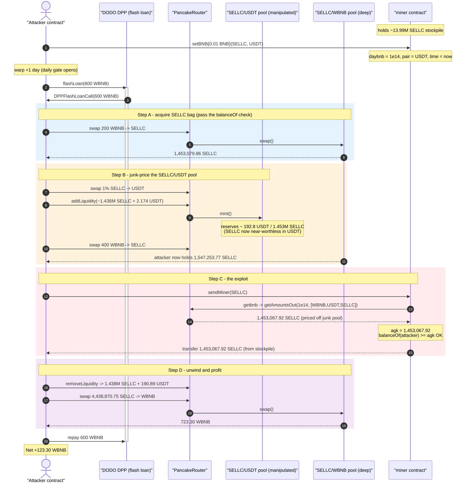
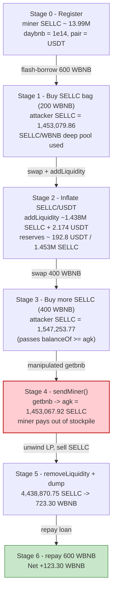
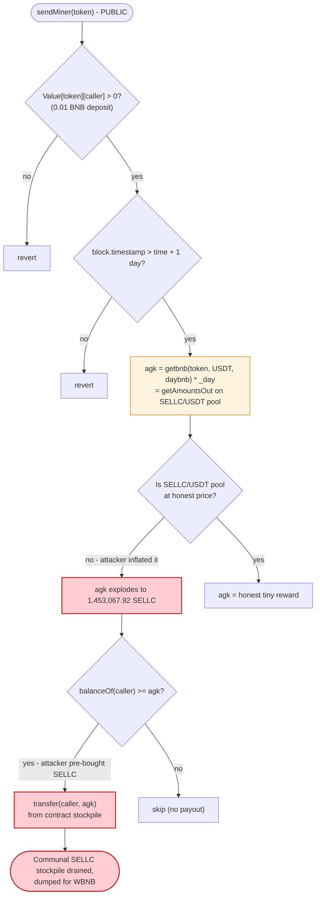

# SellToken `miner` Exploit — Spot-Price Reward Oracle Drained via Flash-Loaned Liquidity

> **Reproduction:** the PoC compiles & runs in an isolated Foundry project at
> [this project folder](.) (the umbrella DeFiHackLabs repo does not whole-compile,
> so this PoC was extracted into a standalone project).
> Full verbose trace: [output.txt](output.txt).
> Verified vulnerable source: [miner.sol](sources/miner_84Be94/miner.sol).

---

## Key info

| | |
|---|---|
| **Loss** | ~**123.30 WBNB** net profit drained from the `miner` contract's SELLC stockpile (≈ US$30–35K at the time) |
| **Vulnerable contract** | `miner` — [`0x84Be9475051a08ee5364fBA44De7FE83a5eCC4f1`](https://bscscan.com/address/0x84Be9475051a08ee5364fBA44De7FE83a5eCC4f1#code) |
| **Victim asset** | The `miner` contract's SELLC balance (~13.99M SELLC) + SELLC/WBNB pool liquidity |
| **Manipulated pool** | SELLC/USDT pair — [`0x9523B023E1D2C490c65D26fad3691b024d0305D7`](https://bscscan.com/address/0x9523B023E1D2C490c65D26fad3691b024d0305D7) |
| **Dump pool** | SELLC/WBNB pair — `0x358EfC593134f99833C66894cCeCD41F550051b6` |
| **Flash-loan source** | DODO DPP `0x6098A5638d8D7e9Ed2f952d35B2b67c34EC6B476` (delegates to `0x85351262...`) |
| **Attacker EOA** | [`0x0060129430df7ea188be3d8818404a2d40896089`](https://bscscan.com/address/0x0060129430df7ea188be3d8818404a2d40896089) |
| **Attacker contract** | [`0x2cc392c0207d080aec0befe5272659d3bb8a7052`](https://bscscan.com/address/0x2cc392c0207d080aec0befe5272659d3bb8a7052) |
| **Attack tx** | [`0xe968e648b2353cea06fc3da39714fb964b9354a1ee05750a3c5cc118da23444b`](https://bscscan.com/tx/0xe968e648b2353cea06fc3da39714fb964b9354a1ee05750a3c5cc118da23444b) |
| **Chain / fork block / date** | BSC / 29,005,754 / June 2023 |
| **Compiler** | `miner` v0.8.19 (optimizer off); SellToken v0.8.16 (optimizer 1 run) |
| **Bug class** | Spot-price (AMM `getAmountsOut`) reward oracle manipulated via flash-loaned liquidity |

---

## TL;DR

`miner` is a yield/"mining" contract that lets a user register a deposit (`setBNB`) and then,
once per day, claim a SELLC reward via `sendMiner()`
([miner.sol:308-329](sources/miner_84Be94/miner.sol#L308-L329)). The reward amount is computed
**live, from the spot price of the SELLC/USDT PancakeSwap pool** through the router's
`getAmountsOut` (`getbnb`, [:477-494](sources/miner_84Be94/miner.sol#L477-L494)), and is paid out
**in SELLC from the `miner` contract's own balance**.

Nothing prevents the caller from inflating that pool *inside the same transaction* right before
calling `sendMiner()`. The attacker:

1. **Registers** as a miner with a trivial 0.01 BNB deposit (`setBNB`), which sets
   `daybnb = 0.01e18 / 100 = 1e14`.
2. **Waits one day** (`warp`) so the daily-claim gate `block.timestamp > time + DAYSTIME` passes.
3. **Flash-borrows 600 WBNB** from DODO and uses it to **stuff the SELLC/USDT pool with liquidity**
   (`addLiquidity`), making SELLC look extremely cheap in USDT terms (pool ends ≈ 192.8 USDT /
   1.453M SELLC).
4. **Calls `sendMiner()`** — `getbnb(SELLC, USDT, daybnb)` now reports that `1e14` BNB-worth buys
   **1,453,067 SELLC**, so `agk` explodes and the contract transfers **1.453M SELLC** of its
   stockpile to the attacker.
5. **Unwinds**: removes the liquidity, dumps all SELLC (≈4.44M) into the *deep* SELLC/WBNB pool for
   **723.3 WBNB**, repays the 600 WBNB loan, and walks away with **123.3 WBNB**.

The single broken assumption is that `getAmountsOut` on a live AMM pool is a trustworthy price for
deciding how many tokens to pay out. It is not — it is manipulable within one block, and here it is
manipulable *by the very person being paid*.

---

## Background — what `miner` does

`miner` ([source](sources/miner_84Be94/miner.sol)) is a deposit-and-mine contract paired with the
SELLC token. Users call `setBNB{value: x}(token, pairQuote)` to "stake": the contract buys `token`
(SELLC) with 92% of the BNB, takes a 3% admin cut, burns/relists a slice, and records the user's
position in a `user` struct ([:247-254](sources/miner_84Be94/miner.sol#L247-L254)):

```solidity
struct user {
    address pair;   // quote token: USDT or WBNB
    uint mybnb;     // deposited BNB
    uint daybnb;    // mybnb / 100  -> the per-day "yield basis"
    uint ds;        // days already claimed
    uint time;      // last-claim timestamp
    uint sumAGK;
}
```

`setBNB` records `daybnb = _bnb/100` ([:276](sources/miner_84Be94/miner.sol#L276)) and
`Value[token][user] += _bnb` ([:277](sources/miner_84Be94/miner.sol#L277)).

The contract accumulates a large SELLC balance from everyone's deposits — at the fork block it held
**13,999,968,013,150,066,415,287,033 SELLC ≈ 13.99M SELLC**
([output.txt:39](output.txt)). That stockpile is what funds the rewards, and what the attacker drains.

---

## The vulnerable code

### 1. `sendMiner()` pays a reward priced off a live AMM pool

```solidity
// miner.sol:308-329
function sendMiner(address token) public {
    uint[] memory vid = MyminerID[_msgSender()][token];
    address token1 = selladdress[token][vid[0]].pair;          // USDT (attacker's choice)
    require(token1 == _USDT || token1 == _WBNB);
    require(Value[token][_msgSender()] > 0);                    // satisfied by the 0.01 BNB deposit
    require(vid.length > 0);
    for (uint i = 0; i < vid.length; i++) {
        require(selladdress[token][vid[i]].time > 0
                && block.timestamp > selladdress[token][vid[i]].time + DAYSTIME);  // 1-day gate
        require(inMiner[token][vid[i]] == _msgSender());
        if (block.timestamp > selladdress[token][vid[i]].time + DAYSTIME
                && selladdress[token][vid[i]].ds < 366) {
            uint _day = (block.timestamp - selladdress[token][vid[i]].time) / DAYSTIME;  // = 1
            require(_day >= 1 && _day < 366);
            uint agk = getbnb(token, token1, selladdress[token][vid[i]].daybnb) * _day;  // ⚠️ spot-price reward
            if (IERC20(token).balanceOf(_msgSender()) >= agk) {                          // ⚠️ "you must hold it" — attacker pre-buys it
                IERC20(token).transfer(_msgSender(), agk);                               // ⚠️ pays from contract's stockpile
                selladdress[token][vid[i]].ds += _day;
                selladdress[token][vid[i]].sumAGK += agk;
                selladdress[token][vid[i]].time = selladdress[token][vid[i]].time + DAYSTIME * _day;
            }
        }
    }
}
```

### 2. `getbnb()` — the reward "oracle" is just `getAmountsOut`

```solidity
// miner.sol:477-494
function getbnb(address _tolens, address bnbOrUsdt, uint bnb) public view returns (uint) {
    if (_tolens == address(0)) return 0;
    address isbnb;
    if (bnbOrUsdt == _WBNB) {
        ...
    } else {  // bnbOrUsdt == USDT  (the path the attacker uses)
        isbnb = _USDT;
        address[] memory routePath = new address[](3);
        routePath[0] = _WBNB;
        routePath[1] = isbnb;      // USDT
        routePath[2] = _tolens;    // SELLC
        return IRouter(_router).getAmountsOut(bnb, routePath)[2];  // ⚠️ how much SELLC `bnb` WBNB buys, AT SPOT
    }
}
```

`agk = getbnb(SELLC, USDT, daybnb)` answers "how many SELLC does `daybnb` (1e14) BNB-worth buy on the
SELLC/USDT pool *right now*." Because that pool can be re-priced inside the same transaction, the
"reward" is whatever the attacker wants it to be — capped only by the contract's SELLC balance and by
the `balanceOf(caller) >= agk` check, which the attacker trivially satisfies by buying SELLC first.

The `balanceOf(_msgSender()) >= agk` line *looks* like a guard but is not: it does not lock or consume
the caller's SELLC, it merely requires the caller to be holding at least `agk` at the moment of the
call. The attacker buys a big SELLC bag on the *other* (WBNB) pool before claiming, passes the check,
keeps that bag, and adds the freshly-minted reward on top.

---

## Root cause — why it was possible

Three design decisions compose into a critical bug:

1. **Spot-price reward.** The payout is derived from `getAmountsOut` on a live PancakeSwap pool. AMM
   spot price is manipulable within a single block by anyone with capital; combining it with a
   flash loan makes that capital free. The reward should have been derived from the user's recorded
   deposit value (`mybnb`/`daybnb` denominated in a stable unit), not re-quoted against a live pool
   at claim time.

2. **Attacker controls which pool prices the reward.** `setBNB` lets the depositor pick `token1`
   (the quote/pair), and `sendMiner` uses that same `token1` for `getbnb`. The attacker chose USDT,
   then manipulated *the SELLC/USDT pool specifically*, while leaving the deep SELLC/WBNB pool intact
   to dump into afterward.

3. **Reward is paid from a shared communal stockpile.** All depositors' SELLC sits in one contract
   balance, and `sendMiner` pays out of it with no per-user accounting cap tied to actual deposited
   value. A single manipulated claim drains everyone's principal — the attacker turned a 0.01 BNB
   deposit into a 1.453M SELLC withdrawal.

The flash loan is not strictly required (a well-capitalised attacker could do the same with own
funds), but it makes the attack costless and atomic: borrow → inflate pool → claim → dump → repay,
all in one transaction.

---

## Preconditions

- A registered miner position with `Value[token][attacker] > 0` and `time` at least one
  `DAYSTIME` (86,400 s) old. Created by `setBNB{value: 0.01 ether}` then `warp(+1 day +1)`
  ([SELLC03_exp.sol:50-51](test/SELLC03_exp.sol#L50-L51)).
- The `miner` contract holds a large SELLC balance to drain (13.99M at the fork block).
- Sufficient working capital to (a) buy a SELLC bag on the SELLC/WBNB pool and (b) stuff the
  SELLC/USDT pool with liquidity. In the PoC this is a **600 WBNB DODO flash loan**
  ([SELLC03_exp.sol:52](test/SELLC03_exp.sol#L52)); it is fully repaid intra-transaction, so the
  attack is self-funding.
- A deep SELLC/WBNB pool to dump the harvested SELLC into for real WBNB.

---

## Attack walkthrough (with on-chain numbers from the trace)

All figures are taken directly from the `Sync`/`Swap`/`Transfer` events and `balanceOf` static calls
in [output.txt](output.txt). Two PancakeSwap pools matter:

- **SELLC/USDT** = `0x9523B0…` — the pool the attacker *inflates* to fool `getbnb`.
- **SELLC/WBNB** = `0x358Ef…` — the deep pool the attacker *dumps* into for profit.

| # | Step | What happens | Key numbers (from trace) |
|---|------|--------------|--------------------------|
| 0 | **Register** `setBNB{0.01 BNB}(SELLC, USDT)` | Records `daybnb = 1e14`, `pair = USDT`, `time = now`; buys a sliver of SELLC. Miner holds **13.99M SELLC**. | [output.txt:37-39](output.txt) |
| 1 | **Warp +1 day** | Makes the `sendMiner` daily-claim gate pass (`_day = 1`). | [output.txt:217](output.txt) |
| 2 | **Flash-loan 600 WBNB** from DODO DPP | Borrowed, `DPPFlashLoanCall` begins. | [output.txt:219-227](output.txt) |
| 3 | **Buy SELLC bag** — swap 200 WBNB → SELLC on SELLC/WBNB pool | Receives **1,453,079.86 SELLC** (1.453e24). Pre-loads the `balanceOf ≥ agk` check. | [output.txt:228-260](output.txt) |
| 4 | **Seed USDT** — swap 1% of that SELLC → USDT | 14,530.79 SELLC → **2.164 USDT** on SELLC/USDT pool. | [output.txt:264-296](output.txt) |
| 5 | **Inflate SELLC/USDT** — `addLiquidity(SELLC, USDT, ~1.438M SELLC, 2.174 USDT)` | Pool reserves become **≈ 192.8 USDT / 1,453,079.86 SELLC** — SELLC now absurdly cheap in USDT. | [output.txt:302-339](output.txt) (Sync L330) |
| 6 | **Buy more SELLC** — swap 400 WBNB → SELLC on SELLC/WBNB pool | Attacker now holds **1,547,253.77 SELLC** (1.547e24). | [output.txt:340-371](output.txt) |
| 7 | **`sendMiner(SELLC)`** — the exploit | `getbnb(SELLC, USDT, 1e14)` returns **1,453,067.92 SELLC** (because the SELLC/USDT pool is junk-priced). `agk = 1,453,067.92`. Check `balanceOf(attacker)=1.547M ≥ agk` ✓. Miner **transfers 1,453,067.92 SELLC** to attacker. | [output.txt:372-391](output.txt) (getAmountsOut L373-378, transfer L381-382) |
| 8 | **Remove liquidity** | Reclaims **1,438,549.07 SELLC + 190.89 USDT** back from the SELLC/USDT pool. | [output.txt:394-433](output.txt) |
| 9 | **Dump** — swap all **4,438,870.75 SELLC** → WBNB on the deep SELLC/WBNB pool | Receives **723.30 WBNB** (7.232e20). | [output.txt:436-467](output.txt) (Swap L461) |
| 10 | **Repay** 600 WBNB to DODO | Loan settled; `DODOFlashLoan` event fires. | [output.txt:468-484](output.txt) |
| 11 | **End** | Attacker WBNB balance = **123.296300556608510348 WBNB**. | [output.txt:486-490](output.txt) |

### Why `getbnb` returns 1.453M SELLC for 0.0001 BNB

`getbnb(SELLC, USDT, 1e14)` evaluates the path `WBNB → USDT → SELLC` via `getAmountsOut(1e14, path)`.
The trace ([output.txt:373-378](output.txt)) shows the intermediate hops:

```
getAmountsOut(1e14, [WBNB, USDT, SELLC]) = [1e14, 23522071737900667, 1453067918367736966237357]
                                            └ 1e14 WBNB → 0.0235 USDT → 1,453,067.92 SELLC
```

That last leg uses the **manipulated** SELLC/USDT reserves (≈192.8 USDT / 1.453M SELLC). With SELLC
priced at ~0.0000132 USDT, even a fraction of a cent's worth of USDT "buys" over a million SELLC — and
the contract dutifully pays that out of its stockpile.

### Profit accounting (WBNB)

| Direction | Amount (WBNB) | Source |
|---|---:|---|
| Borrowed (DODO flash loan) | 600.000 | [output.txt:219](output.txt) |
| Repaid (DODO flash loan) | 600.000 | [output.txt:468](output.txt) |
| Received from final SELLC dump | 723.296 | [output.txt:449-461](output.txt) |
| **Net profit** | **+123.296** | [output.txt:487](output.txt) |

(The 200 + 400 = 600 WBNB spent buying SELLC came from the loan and is the same 600 repaid; the 0.01
BNB `setBNB` deposit is the only out-of-pocket cost.) The entire 723.3 WBNB recovered from dumping
~4.44M SELLC is sourced from (a) the 1.453M SELLC freshly drained out of the `miner` contract plus
(b) the attacker's own re-bought bag, sold back into the same SELLC/WBNB pool.

---

## Diagrams

### Sequence of the attack



### Pool / balance state evolution



### The flaw inside `sendMiner` / `getbnb`



---

## Remediation

1. **Never price a payout from `getAmountsOut` on a live AMM pool.** Spot reserves are manipulable
   within a single block (here, by the payee). Derive the reward from the user's *recorded* deposit
   value (`mybnb` / `daybnb`) denominated in a unit fixed at deposit time, not re-quoted at claim
   time.
2. **If an external price is genuinely needed, use a manipulation-resistant oracle** — a Chainlink
   feed or a multi-block TWAP — not an instantaneous pool quote.
3. **Tie each user's lifetime payout to their actual deposited principal.** A 0.01 BNB deposit should
   never be able to withdraw 1.4M tokens. Cap `sumAGK` (and the per-claim `agk`) against the value
   the user actually contributed.
4. **Don't let the depositor choose the pricing pool.** The attacker selecting `pair = USDT` and then
   manipulating that exact pool is part of the attack. Fix the reference market, or validate it
   against an independent source.
5. **Add reentrancy/flash-loan-aware guards.** Reject claims whose enabling state (pool reserves,
   liquidity) changed within the same transaction, e.g. by comparing a TWAP to spot and reverting on
   large divergence.

---

## How to reproduce

The PoC was extracted into a standalone Foundry project (the umbrella DeFiHackLabs repo has several
unrelated PoCs that fail to compile under `forge test`'s whole-project build):

```bash
_shared/run_poc.sh 2023-06-SELLC03_exp --mt testExploit -vvvvv
```

- RPC: a **BSC archive** endpoint is required (fork block 29,005,754). `foundry.toml` uses
  `https://bsc-mainnet.public.blastapi.io`, which serves historical state at that block; most pruned
  public BSC RPCs fail with `header not found` / `missing trie node`.
- Result: `[PASS] testExploit()` with the attacker's ending WBNB balance ≈ **123.30 WBNB**.

Expected tail:

```
Ran 1 test for test/SELLC03_exp.sol:ContractTest
[PASS] testExploit() (gas: 1009674)
Logs:
  [End] Attacker WBNB balance after exploit: 123.296300556608510348

Suite result: ok. 1 passed; 0 failed; 0 skipped
```

---

*Reference: EoceneSecurity — https://twitter.com/EoceneSecurity/status/1668468933723328513 (SellToken / SELLC, BSC, June 2023).*
