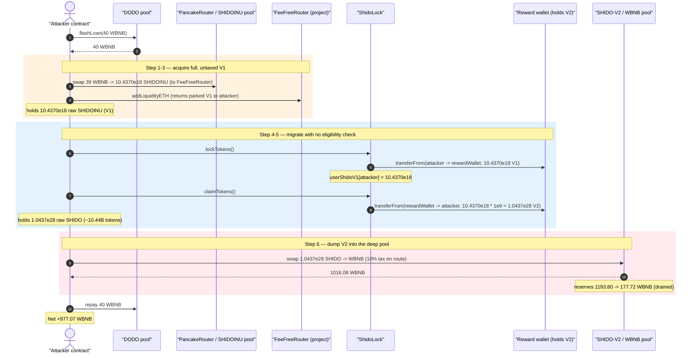
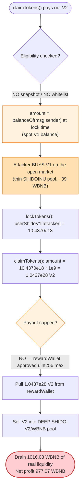
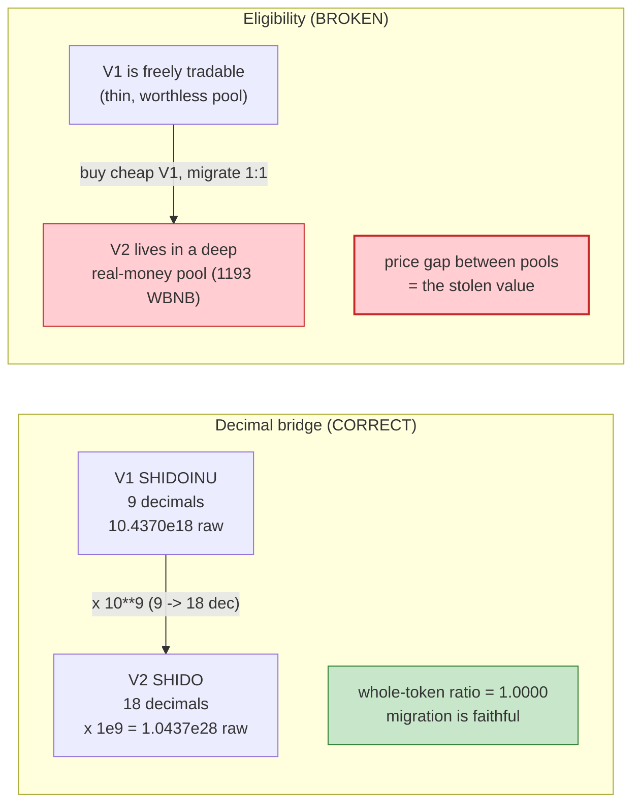

# SHIDO Exploit — `ShidoLock` Migration Mint With No Eligibility Check

> **Reproduction:** the PoC compiles & runs in an isolated Foundry project at
> [this project folder](.) (the umbrella DeFiHackLabs repo does not whole-compile,
> so this PoC was extracted into a standalone project).
> Full verbose trace: [output.txt](output.txt).
> Verified vulnerable source: [ShidoLock.sol](sources/ShidoLock_aF0CA2/ShidoLock.sol).

---

## Key info

| | |
|---|---|
| **Loss** | ~**977.07 WBNB** net (≈ $230K at the June-2023 BNB price) drained from the SHIDO-V2/WBNB pool |
| **Vulnerable contract** | `ShidoLock` (migration contract) — [`0xaF0CA21363219C8f3D8050E7B61Bb5f04e02F8D4`](https://bscscan.com/address/0xaF0CA21363219C8f3D8050E7B61Bb5f04e02F8D4) |
| **Tokens** | V1 `SHIDOINU` (9 dec) [`0x733Af3…F9e0`](https://bscscan.com/address/0x733Af324146DCfe743515D8D77DC25140a07F9e0) · V2 `SHIDO` (18 dec) [`0xa963eE…B640`](https://bscscan.com/address/0xa963eE460Cf4b474c35ded8fFF91c4eC011FB640#code) |
| **Victim pool** | SHIDO-V2/WBNB PancakeSwap pair — `0x0fb0dA54b6eF183fB4b67BFe01af44e06D576Ef3` |
| **Reward wallet (drained of V2)** | `0x7ef6E527969054afbc0980E00C51D2E645b4A5ef` |
| **Attacker EOA** | [`0x69810917928b80636178b1bb011c746efe61770d`](https://bscscan.com/address/0x69810917928b80636178b1bb011c746efe61770d) |
| **Attacker contract** | [`0xcdb3d057ca0cfdf630baf3f90e9045ddeb9ea4cc`](https://bscscan.com/address/0xcdb3d057ca0cfdf630baf3f90e9045ddeb9ea4cc) |
| **Attack tx** | [`0x72f8dd2bcfe2c9fbf0d933678170417802ac8a0d8995ff9a56bfbabe3aa712d6`](https://bscscan.com/tx/0x72f8dd2bcfe2c9fbf0d933678170417802ac8a0d8995ff9a56bfbabe3aa712d6) |
| **Chain / fork block / date** | BSC / 29,365,171 / June 23, 2023 |
| **Compiler** | `ShidoLock` v0.8.19, optimizer 1 run · V2 `StandardToken` v0.8.18 · V1 `AntiBotLiquidityGeneratorToken` v0.8.4 |
| **Bug class** | Missing eligibility/access control on a token-migration mint (untrusted, market-buyable input drives a privileged payout) |

---

## TL;DR

`ShidoLock` is the contract that migrates holders of the old **SHIDOINU (V1, 9 decimals)** token
to the new **SHIDO (V2, 18 decimals)** token. Migration is two steps:

1. `lockTokens()` — reads the caller's **current V1 balance** and pulls it into a `rewardWallet`,
   crediting `userShidoV1[msg.sender] += amount`
   ([ShidoLock.sol:122-130](sources/ShidoLock_aF0CA2/ShidoLock.sol#L122-L130)).
2. `claimTokens()` — pays the caller `userShidoV1[msg.sender] * 10 ** 9` of V2, pulled from the
   `rewardWallet` (which has pre-approved the lock contract for `type(uint256).max` V2)
   ([ShidoLock.sol:132-144](sources/ShidoLock_aF0CA2/ShidoLock.sol#L132-L144)).

The `* 10 ** 9` is the *legitimate* decimal bridge (V1 has 9 decimals, V2 has 18 — in whole-token
terms the migration is exactly **1:1**, verified below). The fatal flaw is that **`lockTokens()`
trusts whatever V1 balance the caller happens to hold, with no snapshot, no whitelist, no per-user
cap, and no proof the V1 was held before the migration was announced.** V1 (SHIDOINU) is a freely
tradable token whose liquidity pool is tiny and worthless, whereas V2 (SHIDO) has a deep,
real-money pool.

So the attacker:

1. **Flash-borrows 40 WBNB** from a DODO pool (`0x8191…fC1d`).
2. **Buys ~10.44e18 raw SHIDOINU (V1)** for ~39 WBNB out of the thin SHIDOINU/WBNB pool, routing it
   through the project's own "fee-free" router + `addLiquidityETH` round-trip to dodge SHIDOINU's
   fee-on-transfer so the full amount lands in the attacker's wallet.
3. **`lockTokens()`** — migrates that 10.44e18 raw V1.
4. **`claimTokens()`** — receives `10.44e18 × 1e9 = 1.0437e28` raw SHIDO (V2) — ~10.4 billion whole
   SHIDO — straight out of the reward wallet.
5. **Dumps the V2** into the SHIDO-V2/WBNB pool for **1016.08 WBNB**.
6. Repays the 40 WBNB loan; walks away with **977.07 WBNB**.

The attacker spent ~39 WBNB worth of a worthless token and turned it into 1016 WBNB of real
liquidity — a 26x gross multiple — because the migration contract minted V2 against a quantity the
attacker could buy on the open market for almost nothing.

---

## Background — the SHIDO V1 → V2 migration

The Shido project re-deployed its token (V1 `SHIDOINU` → V2 `SHIDO`) and stood up `ShidoLock` to let
legacy holders swap old for new. The intended flow: a genuine V1 holder calls `lockTokens()` to
surrender their V1, then after a timelock calls `claimTokens()` to receive the equivalent V2.

Three facts make this migration exploitable:

- **V1 is still a live, tradable token.** SHIDOINU has its own PancakeSwap pool. Anyone can buy
  arbitrary amounts of V1 for BNB at any time — there is nothing special about "holding V1."
- **The two tokens trade at vastly different prices.** At the fork block the SHIDO-V2/WBNB pool held
  ~1193 WBNB against ~1.64e27 raw SHIDO; the SHIDOINU/WBNB pool held only tens of WBNB. The migration
  contract converts *raw units 1:1 (after the decimal bridge)* regardless of the gulf in market value.
- **The reward wallet pre-funded and pre-approved the lock contract for V2.** The lock contract can
  pull effectively unlimited V2 out of `rewardWallet` via `transferFrom`
  ([ShidoLock.sol:143](sources/ShidoLock_aF0CA2/ShidoLock.sol#L143)), so the only thing standing
  between an attacker and a large V2 payout is the (absent) eligibility check in `lockTokens()`.

Key on-chain parameters (read from the trace at fork block 29,365,171):

| Parameter | Value |
|---|---|
| V1 SHIDOINU decimals | **9** ([AntiBotLiquidityGeneratorToken.sol:1030](sources/AntiBotLiquidityGeneratorToken_733Af3/AntiBotLiquidityGeneratorToken.sol#L1030)) |
| V2 SHIDO decimals | **18** |
| `claimTokens` multiplier | `* 10 ** 9` (the 9→18 decimal bridge) |
| Reward-wallet V2 allowance to lock contract | unlimited (`type(uint256).max`) |
| SHIDO-V2/WBNB pool reserves (pre-dump) | 1.6388e27 SHIDO / **1193.80 WBNB** ← the prize |
| V2 transfer tax | **10%** (1/10 of every transfer routed to the SHIDO contract) |

---

## The vulnerable code

### 1. `lockTokens()` trusts the caller's spot V1 balance

```solidity
function lockTokens() external {
    uint256 amount = IERC20(shidoV1).balanceOf(msg.sender);   // ← spot balance, no snapshot

    if (amount == 0) revert ZeroAmount();

    userShidoV1[msg.sender] += amount;                        // ← credit grows with market-buyable V1

    IERC20(shidoV1).transferFrom(msg.sender, rewardWallet, amount);
}
```

[ShidoLock.sol:122-130](sources/ShidoLock_aF0CA2/ShidoLock.sol#L122-L130)

There is **no eligibility gate of any kind**:

- no whitelist / Merkle proof of pre-migration holders,
- no snapshot of balances taken at an announcement block,
- no per-address cap,
- no check that the V1 has any value or wasn't just bought a block ago.

Anyone who can hold V1 — i.e. anyone with BNB and access to the SHIDOINU pool — can inflate
`userShidoV1[msg.sender]` to an arbitrary number.

### 2. `claimTokens()` pays V2 out of the pre-approved reward wallet

```solidity
function claimTokens() external {
    if (block.timestamp < lockTimestamp) revert WaitNotOver();   // ← only the timelock; already elapsed at attack time

    uint256 amount = userShidoV1[msg.sender] * 10 ** 9;          // ← 9→18 decimal bridge, 1:1 in whole tokens

    if (amount == 0) revert ZeroAmount();

    userShidoV1[msg.sender] = 0;

    userShidoV2[msg.sender] += amount;

    IERC20(shidoV2).transferFrom(rewardWallet, msg.sender, amount);  // ← unlimited allowance ⇒ unbounded payout
}
```

[ShidoLock.sol:132-144](sources/ShidoLock_aF0CA2/ShidoLock.sol#L132-L144)

`claimTokens()` faithfully converts whatever `lockTokens()` recorded. The conversion math is *correct*
(see Root cause). The vulnerability is entirely upstream: the recorded amount is attacker-controlled
and unbounded.

---

## Root cause — why it was possible

The `* 10 ** 9` factor is **not** the bug. V1 has 9 decimals and V2 has 18, so a 1:1 whole-token
migration *requires* multiplying raw V1 units by `10 ** (18 - 9) = 1e9`. Confirmed against the trace:

| | Raw units | Whole tokens |
|---|---:|---:|
| V1 locked | 10,436,974,088,156,420,258 | 10,436,974,088.156 (÷1e9) |
| V2 claimed | 10,436,974,088,156,420,258,000,000,000 | 10,436,974,088.156 (÷1e18) |

The whole-token ratio is **1.0000000000…** — a faithful migration.

The bug is that a **migration is a privileged airdrop, and `ShidoLock` performs it against an input
the attacker controls for free.** A correct migration must answer "did *this* address legitimately
hold V1 *before* migration was announced, and how much?" `ShidoLock` answers neither question — it
reads `balanceOf(msg.sender)` *right now* and pays out 1:1. Because V1 is a live, cheap, tradable
token, the attacker manufactures the "legitimacy" by simply buying V1 on the open market a single
block before locking it. The value extraction comes from the **price gap between the two pools**: V1
is acquired in a worthless pool and the equivalent V2 is dumped into a deep, real-money pool.

Three design decisions compose into the loss:

1. **No snapshot / whitelist.** Migration eligibility is derived from spot balance, which is
   trivially bought. ([ShidoLock.sol:123](sources/ShidoLock_aF0CA2/ShidoLock.sol#L123))
2. **Unbounded payout source.** The reward wallet pre-approved the lock contract for
   `type(uint256).max` V2, so there is no cap that would have limited the damage to a sane per-user
   migration size. ([ShidoLock.sol:143](sources/ShidoLock_aF0CA2/ShidoLock.sol#L143))
3. **Asymmetric liquidity.** The protocol left a tradable, thin V1 pool standing while seeding a deep
   V2 pool. The migration contract is the bridge that lets value flow from the deep pool to anyone
   holding the cheap token.

The timelock (`block.timestamp < lockTimestamp`,
[ShidoLock.sol:133](sources/ShidoLock_aF0CA2/ShidoLock.sol#L133)) was the only guard, and it had
already elapsed by the attack — so lock and claim happen back-to-back in the same transaction.

---

## Preconditions

- The migration timelock has elapsed (`block.timestamp >= lockTimestamp`), so `claimTokens()` does
  not revert. True at the attack block; lock+claim execute in one tx.
- The `rewardWallet` holds enough V2 and has approved `ShidoLock` for it (it approved `uint256.max`).
- A SHIDOINU (V1) pool exists with enough depth to buy a meaningful raw quantity of V1.
- Working capital in WBNB to buy the V1. Fully flash-loanable: the attack borrows 40 WBNB from DODO,
  uses ~39 to buy V1, and repays the loan out of the V2-sale proceeds in the same transaction.

---

## Attack walkthrough (with on-chain numbers from the trace)

All figures are taken directly from the events / return values in
[output.txt](output.txt). The whole flow runs inside DODO's `DPPFlashLoanCall` callback
([SHIDO_exp.sol:65-71](test/SHIDO_exp.sol#L65-L71)).

| # | Step (trace line) | Concrete amounts | Effect |
|---|---|---|---|
| 0 | **Flash-loan 40 WBNB** from DODO ([:31-34](output.txt#L31)) | 40.00 WBNB borrowed | Working capital. |
| 1 | **Buy V1** — swap 39 WBNB → SHIDOINU, recipient = FeeFreeRouter ([:45-79](output.txt#L45)) | 39 WBNB → 10.4370e18 raw SHIDOINU (held by FeeFreeRouter) | Acquire cheap V1; routed to the project router to dodge V1 fee-on-transfer. |
| 2 | **Seed self with a dust SHIDOINU** — withdraw 0.01 WBNB, swap 0.01 WBNB → V1 to self ([:80-122](output.txt#L80)) | +1.4035e12 raw SHIDOINU to attacker | Needed so `addLiquidityETH` has a base to return the parked V1. |
| 3 | **`addLiquidityETH`** on FeeFreeRouter returns the parked 10.4370e18 SHIDOINU to the attacker ([:128-201](output.txt#L128), [:190-195](output.txt#L190)) | attacker now holds 10,436,974,088,156,420,258 raw V1 | Full V1 amount in attacker's own wallet, fee-free. |
| 4 | **`lockTokens()`** ([:207-220](output.txt#L207)) | records `userShidoV1 = 10.4370e18`; V1 sent to reward wallet `0x7ef6…A5ef` | Eligibility manufactured. |
| 5 | **`claimTokens()`** ([:221-231](output.txt#L221)) | pulls `10.4370e18 × 1e9 = 1.0437e28` raw SHIDO from reward wallet to attacker | ~10.44 **billion** whole SHIDO minted to attacker. |
| 6 | **Dump V2** — swap 1.0437e28 SHIDO → WBNB ([:239-276](output.txt#L239)) | 10% tax skims 1.0437e27 to the SHIDO contract; 9.3933e27 hits the pool → **1016.08 WBNB out** | Drains the deep V2 pool (reserves 1.6388e27 SHIDO / 1193.80 WBNB → 1.103e28 SHIDO / 177.72 WBNB). |
| 7 | **Repay** 40 WBNB to DODO ([:277-282](output.txt#L277)) | −40 WBNB | Loan closed. |
| 8 | **Final** ([:295-299](output.txt#L295)) | attacker WBNB balance = **977.0651 WBNB** | Profit. |

### Why step 1 routes V1 through the project's "fee-free" router

SHIDOINU is a fee-on-transfer token. A direct `swap → attacker` would shave the fee off the bought
amount, reducing the eventual V2 claim. The attacker swaps the V1 to the project's own
`FeeFreeRouter` (`0x9869…6C8e`) and then uses its `addLiquidityETH` + an internal `transfer` path to
get the *full, untaxed* 10.4370e18 raw V1 back into its own wallet — maximizing the raw figure that
later gets multiplied by `1e9`.

### Profit accounting (WBNB)

| Direction | Amount (WBNB) |
|---|---:|
| Borrowed (flash loan) | 40.00 |
| Spent — buy V1 (main swap) | 39.00 |
| Spent — dust swap + addLiquidity ETH | ~0.02 |
| Received — dump V2 into SHIDO-V2/WBNB pool | **1016.0851** |
| Repaid — flash loan | −40.00 |
| **Net profit** | **≈ 977.07** |

The realized 1016.08 WBNB came directly out of the SHIDO-V2/WBNB pool's 1193.80 WBNB reserve — i.e.
the honest LPs' real money — bought with V1 that cost the attacker ~39 WBNB. Gross multiple ≈ **26x**.

---

## Diagrams

### Sequence of the attack



### Value-flow / root-cause view



### Why the migration math is correct but the design is broken



---

## Remediation

1. **Gate migration eligibility with a pre-migration snapshot or Merkle whitelist.** Eligibility must
   reflect balances held *before* the migration was announced, not the spot balance at lock time.
   Reading `balanceOf(msg.sender)` ([ShidoLock.sol:123](sources/ShidoLock_aF0CA2/ShidoLock.sol#L123))
   the moment of locking is the core mistake — it lets anyone manufacture eligibility by buying V1.
2. **Never leave the old token freely tradable during an open-ended migration.** If V1 can still be
   bought, pause its pool / disable its transfers, or require burning V1 obtained only from a frozen
   snapshot. A migration is only safe when the input quantity is fixed before attackers can react.
3. **Cap the payout source.** Approving `rewardWallet` for `type(uint256).max` V2
   ([ShidoLock.sol:143](sources/ShidoLock_aF0CA2/ShidoLock.sol#L143)) removed the last backstop.
   Approve only the exact total eligible migration amount, or enforce a per-address cap.
4. **Validate value, not just decimals.** The `* 10 ** 9` correctly converts decimals but encodes an
   implicit assumption that raw V1 and raw V2 are interchangeable at par. If V1 and V2 have different
   market values, a 1:1 raw migration is a value transfer; the contract must verify the input
   represents legitimate, pre-migration holdings rather than market-bought tokens.
5. **Treat any open external→privileged-payout path as untrusted.** A migration mint is functionally
   an airdrop; the input (V1 holdings) must be treated as adversary-controlled.

---

## How to reproduce

The PoC runs in a standalone Foundry project (the umbrella DeFiHackLabs repo has unrelated PoCs that
fail to compile under a whole-project `forge build`):

```bash
_shared/run_poc.sh 2023-06-SHIDO_exp -vvvvv
```

- RPC: a **BSC archive** endpoint is required (fork block 29,365,171). Most public BSC RPCs prune
  state this old and fail with `header not found` / `missing trie node`; a QuickNode/archive endpoint
  serves it.
- Result: `[PASS] testExploit()` with the attacker holding ~977 WBNB net.

Expected tail (from [output.txt](output.txt)):

```
Ran 1 test for test/SHIDO_exp.sol:ContractTest
[PASS] testExploit() (gas: 1221286)
Logs:
  Attacker WBNB balance after exploit: 977.065114464703755854

Suite result: ok. 1 passed; 0 failed; 0 skipped
```

---

*References: Phalcon — https://twitter.com/Phalcon_xyz/status/1672473343734480896 ·
Ancilia — https://twitter.com/AnciliaInc/status/1672382613473083393 · (SHIDO migration, BSC, ~$230K).*
