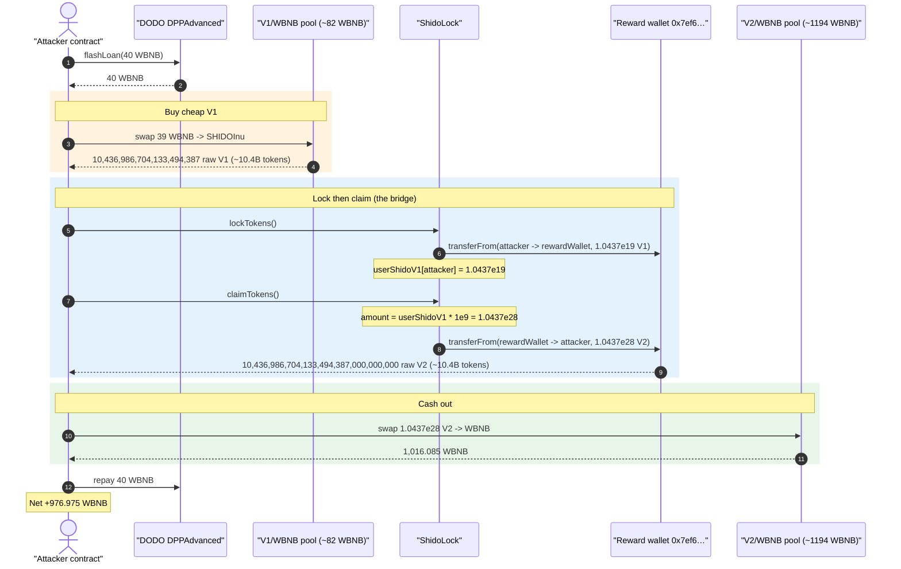
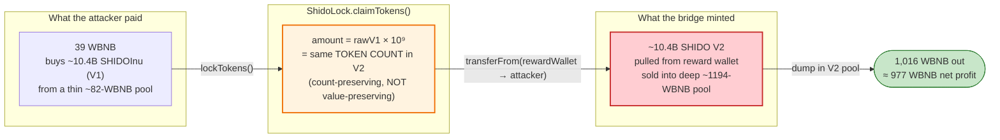
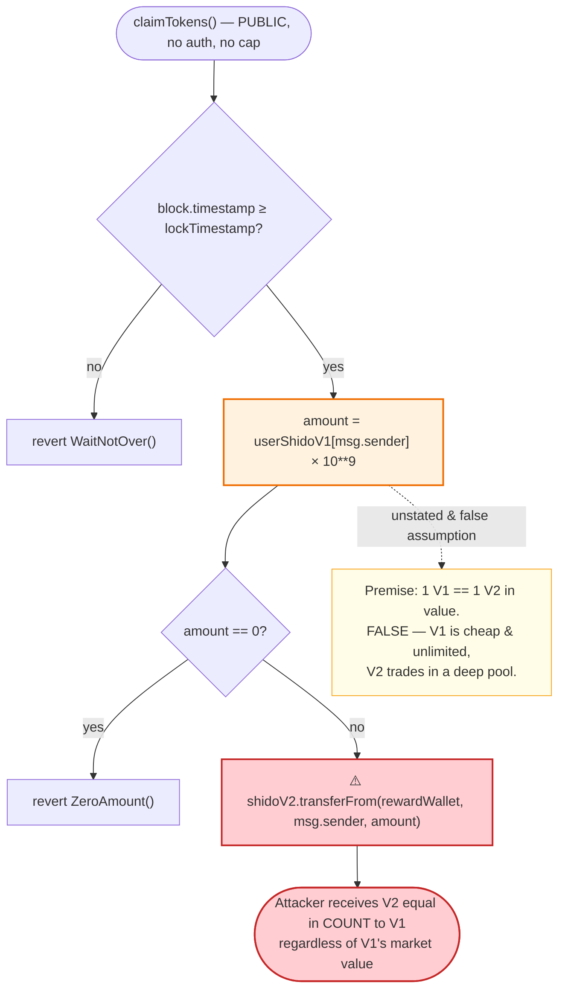

# SHIDO Migration Exploit — `claimTokens()` Blind `× 10⁹` Decimal Scaling Drains the Reward Wallet

> **Reproduction:** the PoC compiles & runs in this isolated Foundry project at
> [this project folder](.). Full verbose trace: [output.txt](output.txt).
> Verified vulnerable source: [ShidoLock.sol](sources/ShidoLock_aF0CA2/ShidoLock.sol).

---

## Key info

| | |
|---|---|
| **Loss** | **~976.98 WBNB** (≈ $283K at the time) extracted from the SHIDO migration reward wallet, monetized via the SHIDO-V2/WBNB pool |
| **Vulnerable contract** | `ShidoLock` — [`0xaF0CA21363219C8f3D8050E7B61Bb5f04e02F8D4`](https://bscscan.com/address/0xaF0CA21363219C8f3D8050E7B61Bb5f04e02F8D4#code) |
| **Victim** | Migration reward wallet `0x7ef6E527969054afbc0980E00C51D2E645b4A5ef` (holds the SHIDO-V2 supply) + SHIDO-V2/WBNB pool `0x0fb0dA54b6eF183fB4b67BFe01af44e06D576Ef3` |
| **Tokens** | SHIDO V1 = `AntiBotLiquidityGeneratorToken` (SHIDOInu) [`0x733Af324146DCfe743515D8D77DC25140a07F9e0`](https://bscscan.com/address/0x733Af324146DCfe743515D8D77DC25140a07F9e0), **9 decimals** · SHIDO V2 = `StandardToken` [`0xa963eE460Cf4b474c35ded8fFF91c4eC011FB640`](https://bscscan.com/address/0xa963eE460Cf4b474c35ded8fFF91c4eC011FB640), **18 decimals** |
| **Attacker EOA** | `0x69810917928b80636178b1bb011c746efe61770d` |
| **Attacker contract** | `0xcdb3d057ca0cfdf630baf3f90e9045ddeb9ea4cc` |
| **Attack tx** | [`0x72f8dd2bcfe2c9fbf0d933678170417802ac8a0d8995ff9a56bfbabe3aa712d6`](https://bscscan.com/tx/0x72f8dd2bcfe2c9fbf0d933678170417802ac8a0d8995ff9a56bfbabe3aa712d6) |
| **Chain / block / date** | BSC / 29,365,171 / 2023-06-23 |
| **Compiler** | `ShidoLock` Solidity v0.8.19, optimizer 1 run (test harness built with 0.8.34) |
| **Bug class** | Token-migration decimal-scaling error: raw 9-decimal balance multiplied by `10⁹` to mint 18-decimal V2, granting **1e9× the intended value** |

---

## TL;DR

`ShidoLock` is the migration bridge from SHIDO V1 (`SHIDOInu`, **9 decimals**) to SHIDO V2
(`StandardToken`, **18 decimals**). A user calls `lockTokens()` to deposit their V1 balance, then
`claimTokens()` to receive V2.

The conversion in `claimTokens()` is a single, fatal line
([ShidoLock.sol:135](sources/ShidoLock_aF0CA2/ShidoLock.sol#L135)):

```solidity
uint256 amount = userShidoV1[msg.sender] * 10 ** 9;
```

It scales the **raw** V1 balance by `10⁹` — the decimal gap between 9 and 18 — and mints that many
raw V2 units. That is the correct **decimal** adjustment but the wrong **value** policy: it
preserves the *token count*. Migrating "N tokens of V1" into "N tokens of V2" is only fair if one V1
is worth one V2. It is not: V1 is a near-worthless fee-on-transfer token sitting in a thin
~82-WBNB pool, while V2 trades in a deep ~1,194-WBNB pool. Anyone can buy a huge pile of cheap V1,
run it through the bridge, and walk away with an equal **count** of expensive V2 — paid for out of
the migration **reward wallet**, which had pre-funded the bridge with the entire V2 supply and
granted it an unlimited allowance.

The attacker, with a 40 WBNB flash loan:

1. Buys **10,436,986,704,133,494,387** raw SHIDOInu (≈ 10.44 × 10¹⁸, i.e. ~10.4 *billion* tokens
   at 9 decimals) for **39 WBNB** in the thin V1 pool.
2. `lockTokens()` — deposits all of it; `userShidoV1[attacker]` = 1.0437 × 10¹⁹.
3. `claimTokens()` — receives `1.0437e19 × 1e9 = 1.0437 × 10²⁸` raw SHIDO V2 (≈ 10.4 billion V2
   tokens at 18 decimals), pulled straight from the reward wallet.
4. Sells the 1.0437 × 10²⁸ SHIDO V2 into the V2/WBNB pool for **1,016.09 WBNB**.
5. Repays the 40 WBNB loan. **Net profit ≈ 976.98 WBNB.**

The bridge converts ~$11 of bought-on-the-spot V1 into ~$294K of V2 value, because the only thing
that survives the migration is the (manipulable, near-free) token count.

---

## Background — what the system does

Three contracts matter:

- **SHIDO V1 — `AntiBotLiquidityGeneratorToken` (SHIDOInu).** A standard "liquidity generator /
  anti-bot" fee-on-transfer token, **9 decimals**
  ([AntiBotLiquidityGeneratorToken.sol:1030](sources/AntiBotLiquidityGeneratorToken_733Af3/AntiBotLiquidityGeneratorToken.sol#L1030),
  [:1087-1088](sources/AntiBotLiquidityGeneratorToken_733Af3/AntiBotLiquidityGeneratorToken.sol#L1087-L1088)).
  Its WBNB pool was tiny — only ~82 WBNB of liquidity at the fork block — so its tokens are
  extremely cheap and easy to acquire in bulk.

- **SHIDO V2 — `StandardToken`.** An ordinary 18-decimal ERC20
  ([StandardToken.sol:509-510](sources/StandardToken_a963eE/contracts_Tokens_StandardTokens_StandardToken.sol#L509-L510)).
  This is the "real" token, trading in a deep V2/WBNB pool (~1,194 WBNB of liquidity).

- **`ShidoLock`** — the migration contract. It records each user's deposited V1 amount and later
  hands them V2 from a `rewardWallet`. The reward wallet pre-deposited the V2 migration supply and
  approved `ShidoLock` to move it (the trace shows an effectively unlimited allowance being spent).

The migration is meant to be a 1:1 *holder* migration: a legitimate V1 holder locks the V1 they
already own and receives the V2 equivalent. The design implicitly trusts that the V1 a user holds
was acquired at V1's "real" value — an assumption an attacker simply ignores by buying V1 on the
open market moments before migrating.

On-chain facts at the fork block (block 29,365,171):

| Fact | Value |
|---|---|
| SHIDO V1 (SHIDOInu) decimals | **9** |
| SHIDO V2 (StandardToken) decimals | **18** |
| `claimTokens` scaling factor | `10 ** 9` (the 9→18 decimal gap) |
| V1/WBNB pool liquidity (`0xd0A1…d464`) | ~82 WBNB |
| V2/WBNB pool reserves (`0x0fb0…6Ef3`) | 1,638,814,202 V2 / **1,193.80 WBNB** |
| Reward wallet | `0x7ef6E527969054afbc0980E00C51D2E645b4A5ef` |

---

## The vulnerable code

### 1. `claimTokens()` multiplies the raw V1 balance by `10⁹`

```solidity
function lockTokens() external {
    uint256 amount = IERC20(shidoV1).balanceOf(msg.sender);
    if (amount == 0) revert ZeroAmount();
    userShidoV1[msg.sender] += amount;                       // raw V1 balance recorded (9 dp)
    IERC20(shidoV1).transferFrom(msg.sender, rewardWallet, amount);
}

function claimTokens() external {
    if (block.timestamp < lockTimestamp) revert WaitNotOver();
    uint256 amount = userShidoV1[msg.sender] * 10 ** 9;      // ⚠️ raw count × 1e9 → V2 units
    if (amount == 0) revert ZeroAmount();
    userShidoV1[msg.sender] = 0;
    userShidoV2[msg.sender] += amount;
    IERC20(shidoV2).transferFrom(rewardWallet, msg.sender, amount);   // ⚠️ minted from reward wallet
}
```

[ShidoLock.sol:122-144](sources/ShidoLock_aF0CA2/ShidoLock.sol#L122-L144)

`lockTokens()` records the **raw** V1 balance (`balanceOf`, in 9-decimal units). `claimTokens()`
then multiplies that raw number by `10⁹` and transfers exactly that many **raw V2 units** out of
the reward wallet. Because V2 has 18 decimals, `rawV1 × 1e9` raw-V2 units equals *the same number of
whole tokens* — i.e. the migration is **1 V1 token → 1 V2 token**, decimals-corrected.

### 2. There is no access control, no allowlist, no price check

Both functions are plain `external` with no `onlyOwner`, no per-address cap, no snapshot of
historical V1 holders, and no oracle. Eligibility is "do you hold V1 right now?" — and V1 is
purchasable on a DEX by anyone, in unlimited quantity, for almost nothing.

---

## Root cause

The bridge enforces **decimal correctness** while ignoring **value correctness**.

`× 10⁹` is exactly the right factor to turn a 9-decimal quantity into an 18-decimal quantity that
represents *the same number of tokens*. The flaw is the unstated premise behind a 1:1 token-count
migration:

> A 1:1 *count* migration is only sound when 1 unit of the old asset is worth 1 unit of the new
> asset. SHIDO V1 and V2 had wildly different market prices (different pools, different depths,
> different decimals, V1 being a thin fee-on-transfer token). The bridge let an attacker mint V2 at
> the *V1 acquisition cost*, not at V1's notional value.

Four design decisions compose into the loss:

1. **Count-preserving conversion, not value-preserving.** The migration credits V2 1:1 by token
   count. It should have credited V2 by the *value* of the V1 deposited (or restricted migration to
   a fixed, pre-snapshotted holder set).
2. **V1 is cheap and unlimited.** With only ~82 WBNB backing the V1 pool, 39 WBNB buys ~10.4 billion
   V1 tokens. Those 10.4 billion tokens become 10.4 billion V2 tokens through the bridge.
3. **Permissionless entry + reward wallet pre-funded with unlimited allowance.** `lockTokens()` /
   `claimTokens()` are callable by anyone, and the reward wallet had already granted `ShidoLock`
   enough allowance to move its entire V2 stash. The attacker just needed to *qualify*, which means
   "hold some V1."
4. **The deep V2 pool gives an exit.** The 10.4 billion freshly-minted V2 are dumped into the
   ~1,194-WBNB V2 pool for ~1,016 WBNB — the bridge created the inventory, the pool provided the
   cash-out.

This is the same *economic* shape as the BY-token reserve-burn exploit (a permissionless action that
mints value out of thin air), but the *mechanism* is a classic decimal-scaling/migration accounting
bug rather than an AMM-invariant break.

---

## Preconditions

- `block.timestamp >= lockTimestamp` so `claimTokens()` does not revert with `WaitNotOver()` (true
  at the fork block — the migration window had opened).
- The reward wallet holds a large V2 balance and has approved `ShidoLock` to spend it (true; the
  trace shows the `SHIDO.transferFrom(rewardWallet → attacker, 1.0437e28)` succeeding with ample
  allowance).
- A liquid-enough V1 market to buy V1 cheaply, and a liquid-enough V2 market to sell V2 into. Both
  existed.
- Working WBNB to corner V1 — **flash-loanable**. The PoC borrows **40 WBNB** from the DODO
  `DPPAdvanced` pool ([SHIDO_exp2.sol:46](test/SHIDO_exp2.sol#L46)) and repays it in the same
  transaction.

---

## Attack walkthrough (with on-chain numbers from the trace)

All figures are taken directly from the events/returns in [output.txt](output.txt). The V1 pool is
`0xd0A1…d464` (token0 = SHIDOInu, token1 = WBNB); the V2 pool is `0x0fb0…6Ef3` (token0 = SHIDO V2,
token1 = WBNB).

| # | Step | Trace evidence | Result |
|---|------|----------------|--------|
| 0 | **Flash loan 40 WBNB** from DODO `DPPAdvanced` | [`flashLoan(40e18,…)`](output.txt) L1598 | Attacker funded with 40 WBNB. |
| 1 | **Corner V1** — swap 39 WBNB → SHIDOInu (FoT, supporting-fee swap) | `Swap(amount1In: 39e18, amount0Out: 1.0437e19)` L1652 | Attacker accumulates **10,436,986,704,133,494,387** raw SHIDOInu (≈10.4B tokens). |
| 2 | Minor top-up swap (0.1 WBNB → V1) + a small `addLiquidityETH` to satisfy the FoT helper | L1668-1866 | Housekeeping for the fee-on-transfer token; net V1 still ~1.0437e19. |
| 3 | **`lockTokens()`** — deposits entire V1 balance to reward wallet | `transferFrom(attacker → 0x7ef6…, 1.0437e19)` L1870-1871; storage `userShidoV1 = 0x…90d7a01c215a1673` (1.0437e19) L1879 | `userShidoV1[attacker]` = 1.0437 × 10¹⁹. |
| 4 | **`claimTokens()`** — `amount = userShidoV1 × 1e9` | `SHIDO.transferFrom(0x7ef6… → attacker, 1.0437e28)` L1882-1883 | Attacker receives **10,436,986,704,133,494,387,000,000,000** raw V2 (≈10.4B V2 tokens). |
| 5 | **Dump V2** — swap all 1.0437e28 SHIDO V2 → WBNB (FoT supporting swap) | `Swap(amount0In: 9.393e27, amount1Out: 1.016e21)` L1923 | Receives **1,016.085 WBNB**. |
| 6 | **Repay** 40 WBNB to DODO | `transfer(DPPAdvanced, 40e18)` L1932 | Loan closed. |

**Final balances (trace L1950-1954):** WBNB before = **0**, WBNB after = **976.975297305562276696**.

### The decimal blow-up in one line

```
userShidoV1[attacker] = 10,436,986,704,133,494,387            (raw 9-dp V1  ≈ 10.437e9 tokens)
claimTokens:  amount  = 10,436,986,704,133,494,387 × 10**9
                      = 10,436,986,704,133,494,387,000,000,000 (raw 18-dp V2 ≈ 10.437e9 tokens)
```

The attacker spent 39 WBNB to obtain ~10.437 billion V1 tokens; the bridge handed back ~10.437
billion V2 tokens; selling those V2 into the deep pool returned 1,016 WBNB. The `× 10**9` is doing
exactly what it was coded to do — and that is precisely the bug.

### Profit accounting (WBNB)

| Direction | Amount |
|---|---:|
| Borrowed (flash loan) | 40.000 |
| Spent — corner V1 buy | 39.000 |
| Spent — top-up / FoT liquidity housekeeping | ~0.11 |
| Received — sell 1.0437e28 V2 → WBNB | **1,016.085** |
| Repaid — flash loan | 40.000 |
| **Net profit** | **≈ 976.975** |

The DeFiHackLabs key-info header records the loss as **~977 WBNB**, matching the measured
`976.975297305562276696`.

---

## Diagrams

### Sequence of the attack



### Value flow — why the migration is theft



### The flaw inside `claimTokens()`



---

## Why each magic number

- **`flashLoan(40e18)`** — just enough WBNB to corner the thin V1 pool; fully repaid in-transaction.
- **`swap 39 WBNB → V1`** — the V1/WBNB pool only holds ~82 WBNB, so 39 WBNB buys roughly a third of
  the curve, yielding ~10.4 billion V1 tokens. More V1 bought ⇒ more V2 minted ⇒ more WBNB out, but
  past a point the V1-pool slippage and the V2-pool sell-side slippage cap the marginal gain; ~39
  WBNB is near the sweet spot for this pool pair.
- **`× 10 ** 9`** — the hard-coded decimal gap (18 − 9). It is the entire bug: it makes the migration
  count-preserving, letting the attacker convert a cheaply-acquired V1 *count* into an equal,
  expensively-valued V2 *count*.
- **Sell all 1.0437e28 V2** — the deep V2 pool (~1,194 WBNB) absorbs the dump for ~1,016 WBNB; even
  with heavy slippage the V2 received is worth ~26× the WBNB spent acquiring the V1.

---

## Remediation

1. **Migrate by value, not by raw count.** If V1 and V2 are not 1:1 in value, the bridge must price
   the deposit (oracle/TWAP) and credit V2 accordingly — or convert against a fixed, audited V1→V2
   ratio that reflects supply parity, not just the decimal gap.
2. **Snapshot eligibility.** Restrict migration to a pre-recorded set of legitimate V1 holders and
   balances captured *before* the bridge went live. This removes the "buy V1 on a DEX, then migrate"
   path entirely.
3. **Per-address and global caps.** Cap how much V2 any address can claim and how much the bridge
   can ever distribute, so a single actor cannot drain the reward wallet even if the ratio is wrong.
4. **Do not pre-fund the bridge with the entire supply + unlimited allowance.** Fund/approve only
   what the expected migration cohort needs; release in tranches behind a guardian.
5. **Sanity-check the conversion against token economics.** Any migration whose output token *count*
   can be inflated by buying the input token on a manipulable market is unsafe by construction —
   add an invariant that total V2 distributed ≤ total V2 backing the *legitimate* V1 supply.

---

## How to reproduce

The PoC runs in this standalone Foundry project (the umbrella DeFiHackLabs repo contains several
unrelated PoCs that fail under a whole-project `forge build`, so this one was extracted):

```bash
_shared/run_poc.sh 2023-06-SHIDO_exp2 --mt testExploit -vvvvv
```

- RPC: a **BSC archive** endpoint is required (the fork pins block 29,365,171, June 2023). Most
  public BSC RPCs prune state that old and fail with `header not found` / `missing trie node`.
- Result: `[PASS] testExploit()` — the attacker starts with 0 WBNB and ends with ~976.98 WBNB.

Expected tail:

```
Ran 1 test for test/SHIDO_exp2.sol:ShidoTest
[PASS] testExploit() (gas: 1532042)
  [Start] WBNB amount before attack: 0.000000000000000000
  [End] WBNB amount after attack: 976.975297305562276696
Suite result: ok. 1 passed; 0 failed; 0 skipped
```

---

*Reference: Phalcon analysis — https://twitter.com/Phalcon_xyz/status/1672473343734480896 (SHIDO migration, BSC, ~977 WBNB).*
