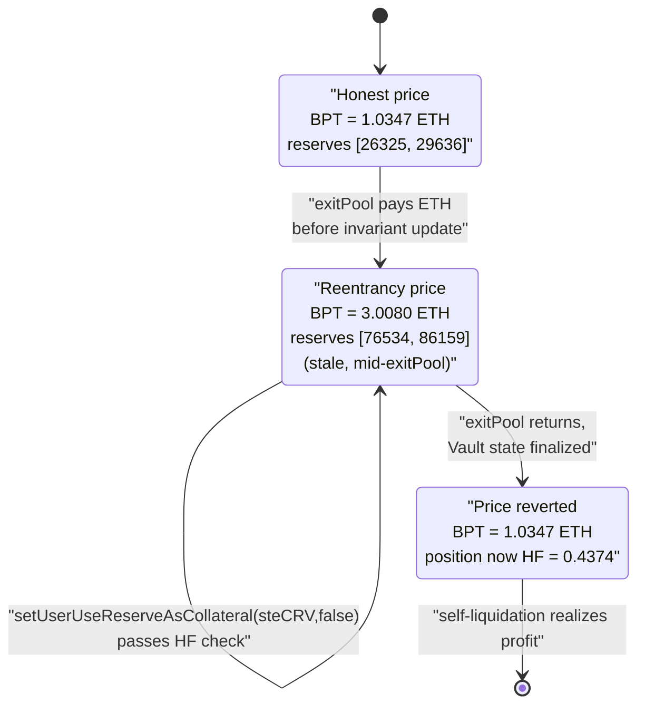
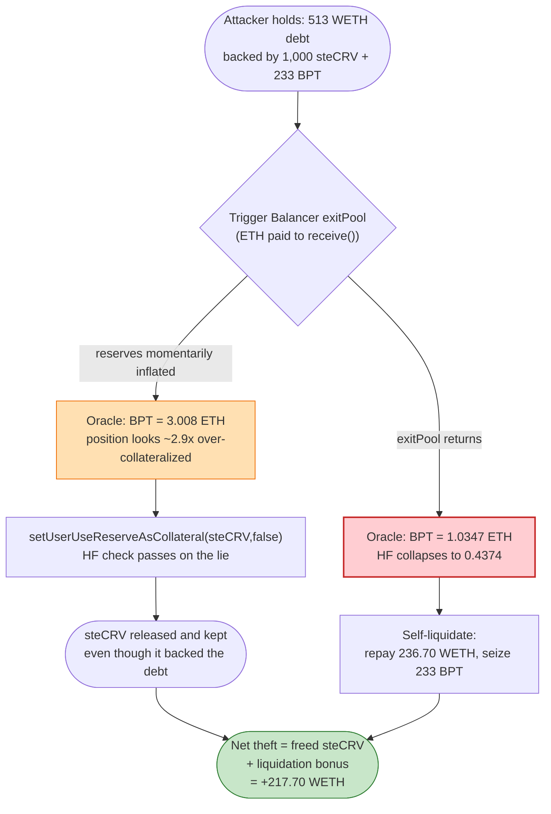

# Sturdy Finance Exploit — Balancer Read-Only Reentrancy Inflates LP-Token Collateral Price

> **Reproduction:** the PoC compiles & runs in an isolated Foundry project at
> [this project folder](.) (the umbrella DeFiHackLabs repo contains many
> unrelated PoCs that do not whole-compile, so this one was extracted).
> Full verbose trace: [output.txt](output.txt).
> Verified vulnerable source: [SturdyOracle.sol](sources/SturdyOracle_e5d78e/contracts_misc_SturdyOracle.sol)
> and the Aave-fork lending logic under [LendingPool_46bea9/](sources/LendingPool_46bea9/).

---

## Key info

| | |
|---|---|
| **Loss** | ~$800K (≈442 ETH across the live multi-iteration attack). This single-pass PoC nets **217.70 WETH** profit. |
| **Vulnerable contract** | `SturdyOracle` (proxied lending logic) — [`0x46bea99d977f269399fb3a4637077bb35f075516`](https://etherscan.io/address/0x46bea99d977f269399fb3a4637077bb35f075516#code) (LendingPool impl); oracle at [`0xe5d78eB340627B8D5bcFf63590Ebec1EF9118C89`](https://etherscan.io/address/0xe5d78eB340627B8D5bcFf63590Ebec1EF9118C89#code) |
| **Lending pool (proxy)** | `0x9f72DC67ceC672bB99e3d02CbEA0a21536a2b657` |
| **Victim collateral / oracle source** | `cB-stETH-STABLE` aToken `0x10aA9eea35A3102Cc47d4d93Bc0BA9aE45557746`; price source (BPT oracle) `0x232a8829570058a693D1D9C4f4F8d52C9691F5ea` |
| **Manipulated pool** | Balancer `B-stETH-STABLE` MetaStablePool `0x32296969Ef14EB0c6d29669C550D4a0449130230` |
| **Attacker EOA** | [`0x1e8419e724d51e87f78e222d935fbbdeb631a08b`](https://etherscan.io/address/0x1e8419e724d51e87f78e222d935fbbdeb631a08b) |
| **Attacker contract** | [`0x0b09c86260c12294e3b967f0d523b4b2bcdfbeab`](https://etherscan.io/address/0x0b09c86260c12294e3b967f0d523b4b2bcdfbeab) |
| **Attack tx** | [`0xeb87ebc0a18aca7d2a9ffcabf61aa69c9e8d3c6efade9e2303f8857717fb9eb7`](https://etherscan.io/tx/0xeb87ebc0a18aca7d2a9ffcabf61aa69c9e8d3c6efade9e2303f8857717fb9eb7) |
| **Chain / block / date** | Ethereum mainnet / fork at **17,460,609** / June 12, 2023 |
| **Compiler** | Solidity v0.8.10, optimizer 200 runs (PoC pragma `^0.8.10`) |
| **Bug class** | Read-only reentrancy → manipulable LP-token (BPT) oracle price → unfair collateral / liquidation accounting |

---

## TL;DR

Sturdy is an Aave-v2 fork that accepts Balancer/Curve LP tokens as collateral. It prices the
`B-stETH-STABLE` BPT through a custom Chainlink-shaped source (`0x232a8829…`) whose
`latestAnswer()` derives the BPT price from the **live** pool reserves via
`B_STETH_STABLE.getRate()` → `Balancer.getPoolTokens()`.

Balancer's V2 Vault has a well-known **read-only reentrancy** flaw: during `exitPool`, the Vault
sends ETH to the recipient **before** it updates the pool's cached invariant / protocol-fee
accounting. A contract that receives that ETH can re-enter *view* functions — like
`getPoolTokens()`/`getRate()` — and observe **inflated, mid-transaction reserves**.

The attacker:

1. Flash-borrows 50,000 wstETH + 60,000 WETH from Aave V3.
2. Mints a huge `B-stETH-STABLE` LP position and a small `steCRV` position, deposits a sliver of
   each into Sturdy as collateral, and borrows 513 WETH against them.
3. Calls `Balancer.exitPool` to redeem its big BPT position. Inside the ETH-receive callback —
   *while the pool's reserves are momentarily stale/inflated* — Sturdy's oracle reports the BPT
   collateral at **3.008 ETH** instead of its true **1.0347 ETH** (≈2.9×).
4. With the position artificially over-collateralized, the attacker calls
   `setUserUseReserveAsCollateral(steCRV, false)` to **release its steCRV collateral** even though
   it should have been needed to back the 513-WETH debt.
5. The reentrancy ends, the BPT price snaps back to 1.0347 ETH, the position is now **underwater
   (health factor 0.4374)**, and the attacker **self-liquidates** — repaying 236.70 WETH of debt
   to seize 233.35 BPT collateral worth ~226 ETH, while having already pocketed the freed steCRV.

Net for this PoC pass: **+217.70 WETH** after repaying the flash loan + premiums.

---

## Background — how Sturdy prices LP-token collateral

`SturdyOracle.getAssetPrice` ([SturdyOracle.sol:103-118](sources/SturdyOracle_e5d78e/contracts_misc_SturdyOracle.sol#L103-L118))
is a thin Aave-style aggregator router: for each asset it stores a `source` and calls
`IChainlinkAggregator(source).latestAnswer()`:

```solidity
function getAssetPrice(address asset) public view override returns (uint256) {
    address source = assetsSources[asset];
    if (asset == BASE_CURRENCY) {
        return BASE_CURRENCY_UNIT;
    } else if (source == address(0)) {
        return _fallbackOracle.getAssetPrice(asset);
    } else {
        int256 price = IChainlinkAggregator(source).latestAnswer();   // ← BPT source is NOT a real Chainlink feed
        if (price > 0) {
            return uint256(price);
        } else {
            return _fallbackOracle.getAssetPrice(asset);
        }
    }
}
```

For the `cB-stETH-STABLE` collateral (`0x10aA9eea…`) the configured `source` is **`0x232a8829…`** —
a *custom* "BPT price" contract that pretends to be a Chainlink aggregator. Its `latestAnswer()`
computes the per-BPT value from:

- the underlying token spot price (wstETH via a Chainlink wstETH/stETH feed `0x86392dC1…`), and
- **`B_STETH_STABLE.getRate()`**, which internally reads **`Balancer.getPoolTokens(poolId)`** — the
  pool's *current* token reserves — to derive the invariant per BPT.

That last dependency is the entire vulnerability. The trace shows the source's call graph
explicitly: `0x232a8829…::latestAnswer()` → `B_STETH_STABLE::getRate()` →
`Balancer::getPoolTokens(...)` ([output.txt:1011-1024](output.txt)). Because the price is a pure
function of *live* pool reserves, anyone who can make the pool report **inconsistent** reserves for
the duration of a call can make the BPT price read anything they want.

The lending side that consumes the price is a standard Aave-v2 fork. Two consumers matter:

- `validateSetUseReserveAsCollateral` → `GenericLogic.balanceDecreaseAllowed`, which recomputes the
  health factor (using `oracle.getAssetPrice` for every collateral) and only lets a user *disable*
  a collateral asset if the position stays at HF ≥ 1 afterwards
  ([ValidationLogic.sol:282-314](sources/LendingPool_46bea9/contracts_protocol_libraries_logic_ValidationLogic.sol#L282-L314)).
- `liquidationCall`, which lets *anyone* repay an underwater user's debt and seize collateral at a
  bonus.

---

## The vulnerable code

### 1. Oracle price is a function of live, reentrancy-manipulable reserves

`SturdyOracle.getAssetPrice` forwards to `0x232a8829…latestAnswer()`. That source is not in the
verified Sturdy bundle (it is the BPT-oracle helper), but its behavior is fully visible in the
trace: it calls `B_STETH_STABLE.getRate()` which calls `Balancer.getPoolTokens()`. The returned
price depends entirely on the reserves Balancer reports at the instant of the call:

| When `getPoolTokens()` is read | Reserves returned `[wstETH, WETH]` | Resulting BPT price |
|---|---|---|
| Before exit (honest) | `[26,325 , 29,636]` (post-state values shown) | **1.0347 ETH** |
| **Inside `exitPool` ETH callback (stale/inflated)** | `[76,534 , 86,159]` | **3.0080 ETH** |

(See [output.txt:1014-1027](output.txt) for the in-reentrancy read at 3.008, and
[output.txt:1473-1481](output.txt) for the post-reentrancy read at 1.0347.)

### 2. Collateral release trusts the spot price (no reentrancy guard)

`validateSetUseReserveAsCollateral` only checks that disabling a collateral keeps the position
healthy — but "healthy" is computed from `oracle.getAssetPrice`, which is currently lying:

```solidity
// ValidationLogic.sol:300-313
require(
    useAsCollateral ||
        GenericLogic.balanceDecreaseAllowed(
            reserveAddress, msg.sender, underlyingBalance,
            reservesData, userConfig, reserves, reservesCount, oracle
        ),
    Errors.VL_DEPOSIT_ALREADY_IN_USE
);
```

`GenericLogic.balanceDecreaseAllowed`
([GenericLogic.sol:53-118](sources/LendingPool_46bea9/contracts_protocol_libraries_logic_GenericLogic.sol#L53-L118))
recomputes `healthFactorAfterDecrease` using the inflated BPT price. With B-stETH-STABLE valued at
3.008 ETH, the attacker's remaining 233 BPT looks like ~700 ETH of collateral — far more than
enough to back the 513-WETH debt — so the protocol happily lets the attacker drop its steCRV
collateral and keep it.

`HEALTH_FACTOR_LIQUIDATION_THRESHOLD = 1 ether`
([GenericLogic.sol:25](sources/LendingPool_46bea9/contracts_protocol_libraries_logic_GenericLogic.sol#L25)).

---

## Root cause — why it was possible

Three design facts compose into a critical bug:

1. **Spot-reserve LP pricing.** The BPT collateral price is derived from `getPoolTokens()` /
   `getRate()` — the pool's *instantaneous* reserves — with no TWAP, no manipulation guard, and no
   re-derivation from underlying market prices. Any momentary inconsistency in the reported
   reserves is taken at face value.

2. **Balancer V2 read-only reentrancy.** `exitPool` pays out the recipient (here, native ETH via
   `WETH.withdraw` → `receive()`) **before** the Vault finalizes the pool's cached invariant /
   protocol-fee state. During that window the pool's `getRate()` returns an inflated value
   (it accounts for tokens already paid out but a not-yet-decremented invariant), so the BPT looks
   far more valuable than it is. Sturdy made `getAssetPrice` reachable from inside this window
   because nothing in the read path is reentrancy-guarded.

3. **Collateral toggling + self-liquidation under a manipulated price.** The attacker never needed
   to *borrow more* at the inflated price. Instead it used the inflated price for a single decision
   — releasing steCRV collateral via `setUserUseReserveAsCollateral(...false)` — and then let the
   price revert so its own position became liquidatable. The liquidation bonus + the freed steCRV +
   the redeemed BPT add up to more than the debt repaid.

In short: **an oracle that reads live AMM reserves, queried from inside a Balancer exit callback,
returns a price the attacker controls — and the lending protocol makes irreversible accounting
decisions based on that price.**

---

## Preconditions

- Sturdy must accept the Balancer BPT as collateral and price it via the
  `getRate()`/`getPoolTokens()`-based source (true at block 17,460,609).
- The attacker must hold a large BPT position to redeem, so the `exitPool` it triggers moves enough
  ETH through the `receive()` callback to (a) be worth re-entering and (b) make the stale-reserve
  reading meaningfully inflated. The PoC mints **109,517 BPT** by adding 50,000 wstETH + 57,000
  WETH.
- Working capital in wstETH/WETH to set up the position; fully recovered intra-transaction, hence
  **flash-loanable**. The PoC borrows 50,000 wstETH + 60,000 WETH from Aave V3
  ([Sturdy_exp.sol:136-137](test/Sturdy_exp.sol#L136-L137)).
- A small Sturdy borrow position (513 WETH) backed by a sliver of steCRV (1,000) + BPT (233) so
  there is something to "save" by releasing collateral and something to self-liquidate.

---

## Attack walkthrough (with on-chain numbers from the trace)

Pool order for `B-stETH-STABLE` is `token0 = wstETH`, `token1 = WETH`. The collateral price below
is the value of one `B-stETH-STABLE` BPT in ETH as reported by `SturdyOracle.getAssetPrice`.

| # | Step | Source / trace ref | Result |
|---|------|--------------------|--------|
| 0 | **Flash loan** 50,000 wstETH + 60,000 WETH from Aave V3 (premiums 25 wstETH / 30 WETH) | [Sturdy_exp.sol:136](test/Sturdy_exp.sol#L136), [output.txt:61](output.txt) | Attacker funded. |
| 1 | Convert 1,100 ETH → **1,023.8 steCRV** in the Lido Curve pool | [Sturdy_exp.sol:156](test/Sturdy_exp.sol#L156), [output.txt:98-119](output.txt) | steCRV obtained. |
| 2 | Join Balancer pool with 50,000 wstETH + 57,000 WETH → mint **109,517 B-stETH-STABLE** | [Sturdy_exp.sol:244](test/Sturdy_exp.sol#L244), [output.txt:198](output.txt) | Big BPT position to redeem later. |
| 3 | Deposit **1,000 steCRV** + **233.35 B-stETH-STABLE** as Sturdy collateral | [Sturdy_exp.sol:249-252](test/Sturdy_exp.sol#L249-L252) | Collateral posted. |
| 4 | **Borrow 513.37 WETH** from Sturdy (variable rate) | [Sturdy_exp.sol:255](test/Sturdy_exp.sol#L255), [output.txt:801](output.txt) | Debt opened. |
| 5 | `Balancer.exitPool` of 109,284 BPT → pays wstETH + (via `WETH.withdraw`) **56,523 ETH** to attacker `receive()` | [Sturdy_exp.sol:291](test/Sturdy_exp.sol#L291), [output.txt:989-1010](output.txt) | **Reentrancy window opens.** |
| 5a | *Inside* `receive()`: read collateral price → **3.0080 ETH** (true value 1.0347) — reserves read as `[76,534 , 86,159]` | [output.txt:1014-1028](output.txt) | Price inflated ≈2.9×. |
| 5b | *Inside* `receive()`: `setUserUseReserveAsCollateral(csteCRV, false)` — passes HF check thanks to inflated BPT | [Sturdy_exp.sol:306](test/Sturdy_exp.sol#L306), [output.txt:1031-1141](output.txt) | **steCRV released** (`ReserveUsedAsCollateralDisabled`). |
| 6 | `exitPool` returns; price snaps back to **1.0347 ETH**; reserves now `[26,325 , 29,636]` | [output.txt:1132-1146](output.txt) | Window closes. |
| 7 | Withdraw the freed **1,000 steCRV** from Sturdy | [Sturdy_exp.sol:318](test/Sturdy_exp.sol#L318), [output.txt:1151](output.txt) | steCRV pocketed. |
| 8 | `getUserAccountData` → collateral 241.44 ETH, debt 513.37 ETH, **HF = 0.4374** | [output.txt:1360-1395](output.txt) | Position now liquidatable. |
| 9 | **Self-`liquidationCall`**: repay 236.70 WETH, seize 233.35 BPT (LT 9300, bonus) | [Sturdy_exp.sol:324](test/Sturdy_exp.sol#L324), [output.txt:1403-1500](output.txt) | Collateral reclaimed cheaply. |
| 10 | `exitPool` the seized 233 BPT → 106 wstETH + 120 WETH; unwind everything to WETH; repay flash loan | [Sturdy_exp.sol:336](test/Sturdy_exp.sol#L336), [output.txt:1791](output.txt) | Profit realized. |

The key invariant break is at step 5b: the protocol let the attacker remove steCRV collateral it
genuinely needed, because for the duration of the Balancer callback the BPT collateral was valued
~2.9× too high. When the price reverted (step 6), the loss had already been locked in — the
attacker keeps the steCRV, and the now-underwater position is unwound profitably via
self-liquidation.

### Profit accounting (this PoC pass)

| Item | Amount (WETH-equivalent) |
|---|---:|
| Aave flash loan principal | 50,000 wstETH + 60,000 WETH |
| Aave flash loan premium (0.05%) | 25 wstETH + 30 WETH |
| Flash loan repaid | 50,025 wstETH + 60,030 WETH |
| **Attacker WETH balance after full unwind & repayment** | **217.702947457148592295** |

Final assertion from the run ([output.txt:22](output.txt) / [output.txt:2078](output.txt)):

```
Attacker WETH balance after exploit: 217.702947457148592295
```

The live attack repeated this loop, draining ~442 ETH (~$800K) total; the PoC demonstrates one
profitable iteration.

---

## Diagrams

### Sequence of the attack

```mermaid
sequenceDiagram
    autonumber
    actor A as "Attacker contract"
    participant AV as "Aave V3"
    participant BP as "Balancer Vault / B-stETH-STABLE pool"
    participant SO as "SturdyOracle (+BPT source)"
    participant LP as "Sturdy LendingPool"

    A->>AV: "flashLoan 50k wstETH + 60k WETH"
    A->>BP: "joinPool -> mint 109,517 BPT"
    A->>LP: "deposit 1,000 steCRV + 233 BPT as collateral"
    A->>LP: "borrow 513.37 WETH"

    rect rgb(255,235,238)
    Note over A,BP: "exitPool 109,284 BPT (reentrancy window)"
    A->>BP: "exitPool(...)"
    BP-->>A: "pay wstETH + 56,523 ETH via WETH.withdraw -> receive()"
    Note over A,SO: "INSIDE receive() — reserves stale/inflated"
    A->>SO: "getAssetPrice(BPT)"
    SO->>BP: "getRate() -> getPoolTokens() = [76534, 86159]"
    SO-->>A: "price = 3.008 ETH (true 1.0347)"
    A->>LP: "setUserUseReserveAsCollateral(steCRV, false)"
    LP->>SO: "HF check uses inflated BPT price -> passes"
    LP-->>A: "steCRV collateral released"
    end

    Note over BP: "exitPool returns; price reverts to 1.0347 ETH"
    A->>LP: "withdraw 1,000 steCRV (now free)"
    A->>LP: "getUserAccountData -> HF = 0.4374 (underwater)"
    A->>LP: "liquidationCall: repay 236.70 WETH, seize 233 BPT"
    A->>BP: "exitPool seized BPT -> 106 wstETH + 120 WETH"
    A->>AV: "repay 50,025 wstETH + 60,030 WETH"
    Note over A: "Net +217.70 WETH"
```

### Oracle-price state machine across the reentrancy window



### Why the released collateral is theft



---

## Remediation

1. **Add a Balancer read-only-reentrancy guard to the oracle.** Before reading
   `getRate()`/`getPoolTokens()`, call the Vault's reentrancy check
   (`VaultReentrancyLib.ensureNotInVaultContext` / `manageUserBalance` no-op probe). If the Vault is
   mid-operation, revert. This is exactly the fix Balancer published for this class of bug after the
   2023 wave of incidents. (Note: the bundle's `checkOracle`/`check()` path
   ([SturdyOracle.sol:147-151](sources/SturdyOracle_e5d78e/contracts_misc_SturdyOracle.sol#L147-L151))
   *does* probe `manageUserBalance` during `liquidationCall` — but it is **not** invoked on the
   `getAssetPrice` read path used by `setUserUseReserveAsCollateral`, leaving the manipulation
   window open.)
2. **Do not derive LP-token prices from live reserves at all.** Price BPTs from the underlying
   asset market prices and the pool's *manipulation-resistant* invariant (e.g. using
   `getRate()` only after the reentrancy guard, or a TWAP of underlying prices), never from raw
   `getPoolTokens()` spot balances.
3. **Re-validate every state-changing decision against a fresh, guarded price.** Collateral-toggle
   and borrow paths should not be reachable from inside an external pool callback; add a global
   `nonReentrant`-style guard around `getAssetPrice` consumers, or snapshot prices at function entry
   from a guarded oracle.
4. **Use a price-deviation circuit breaker.** A single read jumping ~2.9× from the prior block's
   value should trip a sanity bound and revert rather than be trusted for accounting.

---

## How to reproduce

The PoC was extracted into a standalone Foundry project (the umbrella DeFiHackLabs repo has many
unrelated PoCs that fail to compile under `forge test`'s whole-project build):

```bash
_shared/run_poc.sh 2023-06-Sturdy_exp --mt testExploit -vvvvv
```

- RPC: a mainnet **archive** endpoint is required (`vm.createSelectFork("mainnet", 17_460_609)` —
  see [Sturdy_exp.sol:109](test/Sturdy_exp.sol#L109)). Configure `mainnet` in `foundry.toml`'s
  `[rpc_endpoints]`; pruned full nodes will fail to serve state at this historical block.
- Result: `[PASS] testExploit()` with the three printed collateral prices showing the
  read-only-reentrancy spike (`1.0347 → 3.0080 → 1.0347`).

Expected tail ([output.txt:3-22](output.txt)):

```
Ran 1 test for test/Sturdy_exp.sol:ContractTest
[PASS] testExploit() (gas: 8367710)
Logs:
  ...
  Before Read-Only-Reentrancy Collateral Price 	: 1.034659153774359740
  In Read-Only-Reentrancy Collateral Price 	: 3.008014050489596735
  After Read-Only-Reentrancy Collateral Price 	: 1.034659153774359743
  ...
  Attacker WETH balance after exploit: 217.702947457148592295
```

---

*References: Sturdy Finance post-mortem — https://sturdyfinance.medium.com/exploit-post-mortem-49261493307a ; BlockSec & Ancilia analyses (linked in the PoC header).*
