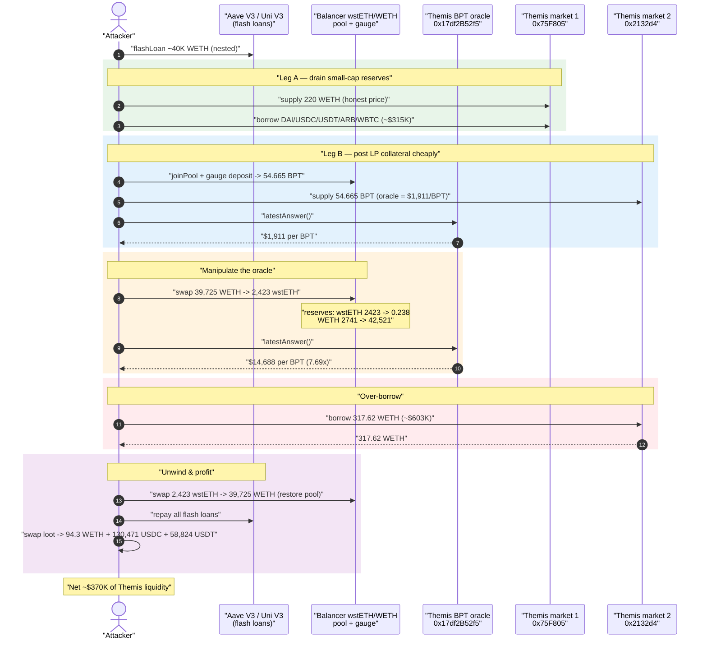
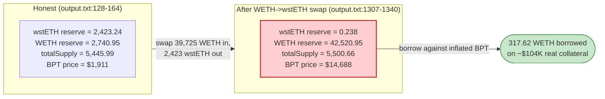
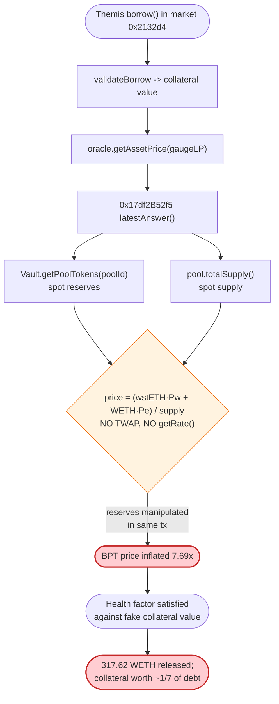

# Themis Protocol Exploit — Manipulable Balancer-LP (BPT) Price Oracle Enables Over-Borrowing

> **Reproduction:** the PoC compiles & runs in this isolated Foundry project at
> [this project folder](.) (the umbrella DeFiHackLabs repo contains many unrelated
> PoCs that do not whole-compile, so this one is extracted).
> Full verbose trace: [output.txt](output.txt). PoC: [test/Themis_exp.sol](test/Themis_exp.sol).
> The Themis lending contracts (an Aave V3 fork) and the wstETH/BPT oracle were unverified
> on-chain, so the downloaded [sources/](sources/) contain the *legitimate* external protocols
> the attacker leaned on — Aave V3 flash-loan pool, Balancer V2 MetaStablePool, and the
> Balancer gauge — not the vulnerable oracle itself. The oracle's broken formula is reconstructed
> precisely from the trace.

---

## Key info

| | |
|---|---|
| **Loss** | ~$370,000 (≈ 94.32 WETH + 130,471.92 USDC + 58,824.33 USDT walked off-chain) |
| **Vulnerable contract** | Themis lending markets (Aave V3 fork) — [`0x75F805e2fB248462e7817F0230B36E9Fae0280Fc`](https://arbiscan.io/address/0x75f805e2fb248462e7817f0230b36e9fae0280fc) and [`0x2132d49157D6148dEe8753f059fAd1C1b09C477c`](https://arbiscan.io/address/0x2132d49157D6148dEe8753f059fAd1C1b09C477c) |
| **Root vulnerable component** | wstETH/WETH BPT price oracle [`0x17df2B52f5D756420846c78c69F4fE4fF10e57A4`](https://arbiscan.io/address/0x17df2b52f5d756420846c78c69f4fe4ff10e57a4) — prices the Balancer LP token from **live spot reserves** |
| **Victim pool / collateral asset** | Balancer wstETH/WETH MetaStablePool [`0x36bf227d6BaC96e2aB1EbB5492ECec69C691943f`](https://arbiscan.io/address/0x36bf227d6BaC96e2aB1EbB5492ECec69C691943f) and its gauge [`0x8F0B53F3BA19Ee31C0A73a6F6D84106340fadf5f`](https://arbiscan.io/address/0x8F0B53F3BA19Ee31C0A73a6F6D84106340fadf5f) |
| **Attacker EOA** | [`0xdb73eb484e7dea3785520d750eabef50a9b9ab33`](https://arbiscan.io/address/0xdb73eb484e7dea3785520d750eabef50a9b9ab33) |
| **Attack contracts** | [`0x05a1b877330c168451f081bfaf32d690ea964fca`](https://arbiscan.io/address/0x05a1b877330c168451f081bfaf32d690ea964fca), [`0x33f3fb58ea0f91f4bd8612d9f477420b01023f25`](https://arbiscan.io/address/0x33f3fb58ea0f91f4bd8612d9f477420b01023f25) |
| **Attack tx** | [`0xff368294ccb3cd6e7e263526b5c820b22dea2b2fd8617119ba5c3ab8417403d8`](https://arbiscan.io/tx/0xff368294ccb3cd6e7e263526b5c820b22dea2b2fd8617119ba5c3ab8417403d8) |
| **Chain / fork block / date** | Arbitrum One / 105,524,523 / June 27, 2023 |
| **Compiler (oracle deps)** | Aave V3 fork `v0.8.10`; Balancer MetaStablePool `v0.7.1`; gauge Vyper `0.3.3` |
| **Bug class** | Oracle manipulation — LP-token (BPT) price derived from instantaneous, flash-loan-manipulable pool reserves |

---

## TL;DR

Themis is an Aave V3 fork on Arbitrum that accepted the **Balancer wstETH/WETH gauge LP token** as
collateral. To value that LP token it called an oracle at `0x17df2B52f5…`, whose `latestAnswer()`
computes the BPT price as:

```
BPT_price = (wstETH_reserve · wstETH_USD + WETH_reserve · WETH_USD) / pool.totalSupply()
```

reading **`Vault.getPoolTokens()` live spot reserves** every call ([output.txt:126-164](output.txt)).
A constant-product/stable pool's spot reserves can be moved arbitrarily inside a single transaction,
so this price is **flash-loan-manipulable**.

The attacker, funded by an Aave V3 WETH flash loan nested inside two Uniswap V3 flash loans:

1. Deposited 54.665 BPT (via the Balancer gauge) into Themis as collateral, routed through the gauge-staking proxy `0xdE85D18A…`, while the BPT's honest price was **$1,911**.
2. **Swapped 39,725 WETH → 2,423 wstETH** through the same Balancer pool, draining its wstETH reserve from 2,423.24 → **0.238** and inflating WETH to 42,520.95. Because the oracle just sums spot reserves, the BPT price jumped to **$14,688 — a 7.69× inflation** ([output.txt:1302-1340](output.txt)).
3. Borrowed **317.62 WETH** against the now-overvalued collateral ([output.txt:1348-1353](output.txt)), far beyond its true backing.
4. Swapped the 2,423 wstETH back to ~39,725 WETH (un-doing the manipulation, [output.txt:1514](output.txt)) and repaid all flash loans.

A parallel leg supplied 220 WETH to the first Themis market and drained its DAI/USDC/USDT/ARB/WBTC
reserves; combined, the attacker walked away with ~**$370K** of protocol liquidity, leaving Themis
holding under-collateralised debt.

---

## Background — what Themis is and how the collateral was priced

Themis Protocol was a lending market on Arbitrum forked from **Aave V3**. The trace shows the
canonical Aave V3 machinery: a `Pool` behind an `InitializableImmutableAdminUpgradeabilityProxy`,
`AToken`/`VariableDebtToken` reserves, `ReserveConfiguration`, and a `PriceOracle`
(`0xC8f42dB9eB6aB58bBFA6E2642107A6086CB4473B`) that resolves each reserve asset to a USD price via a
per-asset Chainlink-style `getAssetPrice()` ([output.txt:156-164](output.txt)).

The novelty — and the bug — is that Themis listed the **Balancer wstETH/WETH gauge LP token**
(`0x8F0B53…`) as a borrowable collateral asset, and pointed its price source at a custom aggregator
`0x17df2B52f5…`. For ordinary assets (WETH, wstETH) that aggregator just forwards to Chainlink:

- WETH/USD feed `0x639Fe6ab…` → `190007440273` ≈ **$1,900.07** ([output.txt:157-164](output.txt))
- wstETH/USD via `0x222e5b5f…` → `214558781790` ≈ **$2,145.59** ([output.txt:146-152](output.txt))

But for the **BPT/gauge token** it computes a "fair value per share" from the Balancer pool's live
balances. The reserves and totalSupply it reads come straight from the Balancer Vault:

- `MetaStablePool.totalSupply()` ([output.txt:126](output.txt))
- `Vault.getPoolTokens(poolId)` → `[wstETH, WETH]` reserves ([output.txt:128](output.txt))

That is the manipulable input.

### On-chain parameters at the fork block (read from the trace)

| Parameter | Value (honest, pre-attack) | Source |
|---|---|---|
| Balancer pool reserves | wstETH **2,423.24**, WETH **2,740.95** | [output.txt:128](output.txt) |
| Balancer pool `totalSupply` (BPT) | **5,445.99** | [output.txt:126](output.txt) |
| WETH/USD (Chainlink) | $1,900.07 | [output.txt:157-164](output.txt) |
| wstETH/USD (Chainlink) | $2,145.59 | [output.txt:146-152](output.txt) |
| **BPT price returned by `0x17df2B52f5…::latestAnswer()`** | **191,099,705,466** = **$1,910.997** | [output.txt:164](output.txt) |

Sanity check of the oracle formula with those numbers:
`(2423.24·2145.59 + 2740.95·1900.07) / 5445.99 ≈ 1,911` — matches `$1,910.997` to the dollar,
confirming the spot-reserve-summation price model.

---

## The vulnerable code

The Themis BPT oracle (`0x17df2B52f5…`) was unverified, so no Solidity source is in [sources/](sources/).
Its exact behaviour, however, is unambiguous from the call tree. Two consecutive invocations with the
**same** Chainlink prices but **different** pool reserves return wildly different answers — proving the
price is a pure function of `getPoolTokens()` + `totalSupply()`:

```text
// HONEST  — output.txt:123-164
0x17df2B52f5…::latestAnswer()
 ├─ MetaStablePool.totalSupply()          → 5,445.99e18
 ├─ Vault.getPoolTokens(poolId)           → [wstETH 2,423.24, WETH 2,740.95]
 ├─ getAssetPrice(wstETH)                 → 214558781790   ($2,145.59)
 ├─ getAssetPrice(WETH)                   → 190007440273   ($1,900.07)
 └─ ← 191099705466                        ($1,910.997 per BPT)

// MANIPULATED — output.txt:1302-1340 (identical Chainlink prices!)
0x17df2B52f5…::latestAnswer()
 ├─ MetaStablePool.totalSupply()          → 5,500.66e18
 ├─ Vault.getPoolTokens(poolId)           → [wstETH 0.238, WETH 42,520.95]   ⚠️ drained
 ├─ getAssetPrice(wstETH)                 → 214558781790   ($2,145.59)   (unchanged)
 ├─ getAssetPrice(WETH)                   → 190007440273   ($1,900.07)   (unchanged)
 └─ ← 1468795169887                       ($14,687.95 per BPT)  ⚠️ 7.69× inflated
```

Reconstructed formula (matches both data points to the dollar):

```solidity
function latestAnswer() external view returns (uint256) {
    (, uint256[] memory balances,) = vault.getPoolTokens(poolId);   // ⚠️ spot reserves
    uint256 supply = pool.totalSupply();                            // ⚠️ spot supply
    uint256 wstUsd  = oracle.getAssetPrice(wstETH);
    uint256 wethUsd = oracle.getAssetPrice(WETH);
    // value-per-share from instantaneous balances — NO TWAP, NO getRate()
    return (balances[0] * wstUsd + balances[1] * wethUsd) / supply;
}
```

The attacker's read of this price is wired up explicitly in the PoC via the `IAggregator Aggregator`
calls ([test/Themis_exp.sol:125](test/Themis_exp.sol#L125) and
[test/Themis_exp.sol:230](test/Themis_exp.sol#L230)), and the manipulating swap is
[test/Themis_exp.sol:141](test/Themis_exp.sol#L141) (`balancerSwap(wstETH, WETH, …)`) plus the
`AttackContract`'s `balancerSwap(WETH, wstETH, 39725e18)`
([test/Themis_exp.sol:245-252](test/Themis_exp.sol#L245-L252)).

### What a *correct* oracle looks like — and Themis didn't use it

Balancer ships exactly the safe primitives Themis ignored. They are in the verified MetaStablePool
sources here:

- **TWAP** (`getTimeWeightedAverage`) in
  [PoolPriceOracle.sol:90](sources/MetaStablePool_36bf22/balancer-labs_v2-pool-utils_contracts_oracle_PoolPriceOracle.sol#L90) — time-averaged, not spot.
- **Manipulation-resistant BPT pricing** via `StableOracleMath._calcLogBptPrice` /
  `_calcSpotPrice` in
  [StableOracleMath.sol:34-42](sources/MetaStablePool_36bf22/contracts_meta_StableOracleMath.sol#L34-L42).
- **`getRate()`** (invariant-per-share) in
  [StablePool.sol:592](sources/MetaStablePool_36bf22/contracts_StablePool.sol#L592).

Any of these would have made the price flash-resistant. The Themis aggregator instead summed raw
`getPoolTokens()` balances.

---

## Root cause — why it was possible

A Balancer (or any AMM) pool's instantaneous reserves are **not** a safe price source: they can be
pushed to any value within a single atomic transaction with borrowed capital. Themis' BPT oracle
read those reserves directly and returned a value-per-share, so the collateral's reported worth moved
1:1 with whatever the attacker did to the pool *in the same transaction* as the borrow.

Concretely, three design decisions compose into a critical bug:

1. **Spot-reserve LP pricing.** The oracle valued the gauge LP token off `getPoolTokens()` +
   `totalSupply()`, with no TWAP, no `getRate()`, and no invariant-based fair-value calculation. A
   single large swap that imbalances the pool (draining wstETH, inflating WETH) raises the summed
   value-per-share, because the cheap-side reserve shrinks faster in *units* than its price falls.
2. **Borrow valuation reads the live oracle.** Aave V3's `validateBorrow`/`GenericLogic` recomputes
   collateral value via `getAssetPrice()` at borrow time
   ([output.txt:1369-1384](output.txt) shows the borrow re-querying the same manipulated oracle).
   So the attacker only had to (a) deposit collateral cheaply, (b) inflate the oracle, (c) borrow —
   all atomically.
3. **No bound on reserve-impact / no health-factor sanity floor.** Nothing capped how far one
   transaction could move the underlying pool, and nothing cross-checked the LP value against a
   slow-moving reference, so a 7.69× swing was accepted without question.

The manipulation is fully self-financing (and thus flash-loanable): the WETH spent imbalancing the
pool is recovered by swapping the wstETH back out a few calls later
([output.txt:1514](output.txt) returns 39,724.94 WETH for the 2,423 wstETH), so the only "cost" of
inflating the price is swap fees.

---

## Preconditions

- Themis lists a manipulable LP/gauge token as collateral and prices it from spot pool reserves.
- The underlying Balancer pool is small enough (≈2,423 wstETH / 2,741 WETH ≈ $10M two-sided) that a
  ~40K-WETH swap reduces one reserve to near-zero — the larger the imbalance, the larger the price
  inflation per share.
- Working capital to (a) imbalance the pool and (b) post collateral. Both are flash-loan-sourced:
  Aave V3 WETH flash loan of 22,000 WETH ([test/Themis_exp.sol:84-87](test/Themis_exp.sol#L84-L87))
  nested with Uniswap V3 `flash()` borrows of 10,000 + 8,000 WETH
  ([test/Themis_exp.sol:110](test/Themis_exp.sol#L110), [test/Themis_exp.sol:116-117](test/Themis_exp.sol#L116-L117)).
- The borrow and the price-manipulation must occur in the same transaction (they do — atomic).

---

## Attack walkthrough (with on-chain numbers from the trace)

All figures are taken from [output.txt](output.txt). The whole exploit is one transaction; flash
loans are nested Aave V3 → Uni V3 pool #1 → Uni V3 pool #2.

| # | Step | Trace | Effect |
|---|------|-------|--------|
| 0 | **Flash-loan stack** — Aave V3 `flashLoan(22,000 WETH)` → `UniPool1.flash(10,000 WETH)` → `UniPool2.flash(8,000 WETH)` | [:32](output.txt), [:52](output.txt), [:72](output.txt) | Assembles ~40K WETH of working capital. |
| 1 | **Leg A — first Themis market.** Supply **220 WETH** as collateral; mark it usable | [:165](output.txt), [:235](output.txt) | Honest-priced collateral (~$418K). |
| 2 | **Leg A — drain reserves**: borrow DAI 44,758.27, USDC 85,753.78, USDT 58,824.33, ARB 85,149.64, WBTC 1.0895 from market `0x75F805…` | [:261](output.txt), [:348](output.txt), [:453](output.txt), [:572](output.txt), [:707](output.txt) | Empties the small-cap reserves; loot ≈ $315K. |
| 3 | **Leg B — post LP collateral.** Wrap 55 WETH into the Balancer pool (`joinPool`), stake into gauge → **54.665 BPT**, then route through gauge-staking proxy `0xdE85D18A…` (selector `0x41d11324`) which `supply`s the gauge token into the **second** Themis market `0x2132d49…` | [:894](output.txt), [:941](output.txt), [:990](output.txt), [:1078](output.txt), [:1150](output.txt) | Collateral booked while BPT honestly ≈ **$1,911** (≈ $104K total). |
| 4 | **Inflate the oracle.** `balancerSwap(WETH → wstETH, 39,725 WETH)` on the same pool | [:1269-1282](output.txt) | Reserves go **wstETH 2,423.24 → 0.238**, **WETH 2,740.95 → 42,520.95**. |
| 5 | **Re-read oracle.** `0x17df2B52f5…::latestAnswer()` | [:1302-1340](output.txt) | BPT price **$1,911 → $14,688** (7.69×); collateral now "worth" ≈ $803K. |
| 6 | **Over-borrow.** Borrow **317.62 WETH** from market `0x2132d49…` against the inflated BPT collateral | [:1348-1353](output.txt) | Extracts ~$603K of WETH on ~$104K of real collateral. |
| 7 | **Unwind the manipulation.** `balancerSwap(wstETH → WETH, 2,423.00 wstETH)` returns **39,724.94 WETH** | [:1514](output.txt) | Pool restored; manipulation cost ≈ swap fees only. |
| 8 | **Repay flash loans.** Return 8,004 WETH to UniPool2, 10,005 WETH to UniPool1, 22,011 WETH to Aave (`handleRepayment`) | [:1568](output.txt), [:1574](output.txt), [:1621](output.txt) | All borrowed capital returned. |
| 9 | **Liquidate loot to stables/WETH.** Swap DAI→USDC, ARB→WETH, WBTC→WETH on Uniswap V3 | [:1640](output.txt), [:1671](output.txt), [:1714](output.txt) | Consolidates into 94.32 WETH + 130,471.92 USDC + 58,824.33 USDT. |

Final attacker balances (test logs):

```
Attacker's amount of WETH after exploit: 94.322625772666716128
Attacker's amount of USDC after exploit: 130471.920034
Attacker's amount of USDT after exploit: 58824.329320
```

### Why the BPT price inflates when wstETH is drained

The oracle's value-per-share is `Σ(reserveᵢ · priceᵢ) / totalSupply`. Draining the cheaper/leg
reserve (wstETH) to ~0 while the WETH it bought *stays inside the pool* (the swap merely moves WETH
in and wstETH out, so the WETH reserve balloons) **increases** the dollar-weighted sum, because
42,520.95 WETH × $1,900 dwarfs the lost 2,423 wstETH × $2,146. Numerically:

- Before: `(2423.24·2145.59 + 2740.95·1900.07) / 5445.99 ≈ $1,911`
- After: `(0.238·2145.59 + 42520.95·1900.07) / 5500.66 ≈ $14,688`

A real fair-value oracle (Balancer `getRate()` / `StableOracleMath`) is invariant to this imbalance
because it prices the *invariant per share*, not the raw reserve sum.

---

## Profit / loss accounting

The profit center is **Leg B**: ~$104K of real BPT collateral was leveraged into ~$603K of borrowed
WETH via the 7.69× oracle inflation. Leg A drains the first market's small-cap reserves directly.
After repaying every flash loan and unwinding the Balancer swap, the attacker's net take is the
final wallet contents:

| Asset kept | Amount | ≈ USD |
|---|---:|---:|
| WETH | 94.3226 | ~$179K |
| USDC | 130,471.92 | ~$130K |
| USDT | 58,824.33 | ~$59K |
| **Total** | | **~$370K** |

(DAI was swapped into USDC; ARB and WBTC were swapped into WETH — see steps 9.) The figure matches
the publicly reported ~$370K loss. What Themis is left holding: bad debt on both markets — the
317.62-WETH loan in market `0x2132d49…` is backed only by ~$104K of honest BPT, and the first
market's reserves were emptied against 220 WETH that no longer covers them.

---

## Diagrams

### Sequence of the attack



### Oracle manipulation: BPT value-per-share before vs after



### The flaw inside the oracle / borrow path



---

## Remediation

1. **Never price LP/BPT collateral from spot reserves.** Use a manipulation-resistant fair-value
   oracle. Balancer provides exactly this in the verified sources here:
   - `StablePool.getRate()` ([StablePool.sol:592](sources/MetaStablePool_36bf22/contracts_StablePool.sol#L592)) — invariant-per-share, robust to swaps that keep the invariant.
   - `StableOracleMath` BPT pricing ([StableOracleMath.sol:34-42](sources/MetaStablePool_36bf22/contracts_meta_StableOracleMath.sol#L34-L42)) combined with Chainlink under-token prices.
   - The pool's built-in TWAP `getTimeWeightedAverage` ([PoolPriceOracle.sol:90](sources/MetaStablePool_36bf22/balancer-labs_v2-pool-utils_contracts_oracle_PoolPriceOracle.sol#L90)).
   The canonical safe construction is `getRate()` × (Chainlink-priced underlying), which cannot be
   moved by a single swap.
2. **Cross-check against a slow reference.** Bound any single-block deviation of the LP price against
   a TWAP/EMA and revert (or freeze borrowing) on large divergence.
3. **Disallow same-transaction price-and-borrow.** Snapshot collateral prices on a delay, or require
   that a borrow's collateral value cannot exceed a recently-cached value — defeating atomic
   manipulate-then-borrow.
4. **Conservative listing of exotic collateral.** Gauge/LP wrappers should carry low LTV and tight
   supply caps; the second market accepted a thinly-backed LP token at an LTV that let $104K of
   collateral release $603K of WETH.
5. **Audit forks for the parts you changed.** Aave V3's core math is sound; the *introduced* custom
   oracle was the failure. Forks must re-audit every oracle and collateral integration they add.

---

## How to reproduce

This PoC was extracted into a standalone Foundry project (the umbrella DeFiHackLabs repo has many
unrelated PoCs that fail to whole-compile under `forge test`):

```bash
_shared/run_poc.sh 2023-06-Themis_exp -vvvvv
```

- RPC: an **Arbitrum archive** endpoint is required (fork block 105,524,523 is historical). Most
  pruned public RPCs fail with `header not found` / `missing trie node`.
- Result: `[PASS] testExploit()`.

Expected tail:

```
Ran 1 test for test/Themis_exp.sol:ThemisTest
[PASS] testExploit() (gas: 6419539)
Logs:
  Attacker's amount of WETH after exploit: 94.322625772666716128
  Attacker's amount of USDC after exploit: 130471.920034
  Attacker's amount of USDT after exploit: 58824.329320

Suite result: ok. 1 passed; 0 failed; 0 skipped
```

---

*References:*
- *Beosin analysis — https://twitter.com/BeosinAlert/status/1673930979348717570*
- *BlockSec detailed steps — https://twitter.com/BlockSecTeam/status/1673897088617426946*
