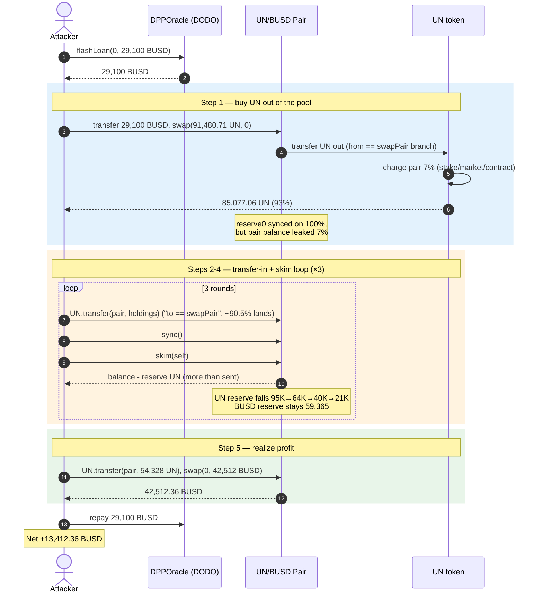
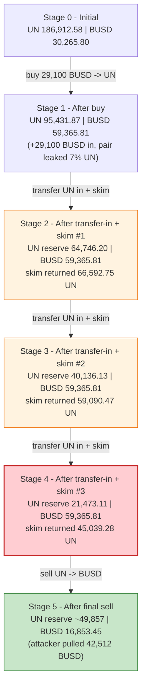
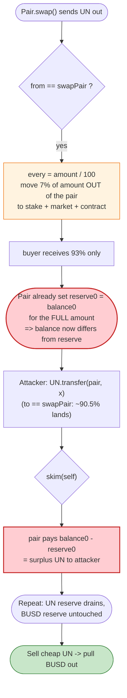

# UN Token Exploit — Fee-on-`swap`-out + `skim()` Reserve Drain

> **Vulnerability classes:** vuln/oracle/price-manipulation · vuln/logic/incorrect-order-of-operations · vuln/logic/fee-calculation

> **Reproduction:** the PoC compiles & runs in an isolated Foundry project at
> [this project folder](.) (the umbrella DeFiHackLabs repo
> contains many unrelated PoCs that fail to whole-compile, so this one was extracted).
> Full verbose trace: [output.txt](output.txt).
> Verified vulnerable source: [UN.sol](sources/UN_1aFA48/UN.sol).

---

## Key info

| | |
|---|---|
| **Loss** | ~$13,412 — **13,412.36 BUSD** profit drained from the UN/BUSD PancakeSwap pair |
| **Vulnerable contract** | `UN` token — [`0x1aFA48B74bA7aC0C3C5A2c8B7E24eB71D440846F`](https://bscscan.com/address/0x1aFA48B74bA7aC0C3C5A2c8B7E24eB71D440846F#code) |
| **Victim pool** | UN/BUSD pair (`swapPair`) — [`0x5F739a4AdE4341D4AEe049E679095BcCbe904Ee1`](https://bscscan.com/address/0x5F739a4AdE4341D4AEe049E679095BcCbe904Ee1) |
| **Flash-loan source** | DODO `DPPOracle` — [`0xFeAFe253802b77456B4627F8c2306a9CeBb5d681`](https://bscscan.com/address/0xFeAFe253802b77456B4627F8c2306a9CeBb5d681) |
| **Attacker EOA** | [`0xf84efa8a9f7e68855cf17eaac9c2f97a9d131366`](https://bscscan.com/address/0xf84efa8a9f7e68855cf17eaac9c2f97a9d131366) |
| **Attacker contract** | [`0x98e241bd3be918e0d927af81b430be00d86b04f9`](https://bscscan.com/address/0x98e241bd3be918e0d927af81b430be00d86b04f9) |
| **Attack tx** | [`0xff5515268d53df41d407036f547b206e288b226989da496fda367bfeb31c5b8b`](https://bscscan.com/tx/0xff5515268d53df41d407036f547b206e288b226989da496fda367bfeb31c5b8b) |
| **Chain / block / date** | BSC / 28,864,173 / June 8, 2023 (`blockTimestampLast = 1686054150`) |
| **Compiler** | Solidity v0.8.17, optimizer 200 runs |
| **Bug class** | Fee-on-transfer charged against the AMM pair's *own* balance + `skim()`-extractable excess (broken AMM reserve accounting) |

> SlowMist / MetaTrust pegged the headline loss higher (~$26K) because they counted the gross UN siphoned; the *net realized* profit reproduced here is **13,412.36 BUSD**.

---

## TL;DR

`UN` is a fee-on-transfer token whose `_transfer` override applies its tax **to the wrong account on the
buy side**. When someone buys UN out of the registered `swapPair`, the `from == swapPair` branch
([UN.sol:810-816](sources/UN_1aFA48/UN.sol#L810-L816)) routes 7% of the bought amount to fee wallets
**by debiting the pair's balance** rather than the buyer's. The pair has already done its constant-product
math and `_update()`d its reserves *before* this extra 7% is moved, so after the swap the pair's *recorded*
`reserve0` (UN) no longer matches its *actual* UN token balance.

That mismatch is freely harvestable: PancakeSwap's `skim(to)` pays out `balanceOf(pair) - reserve` to anyone.
The attacker repeatedly **transfers UN back into the pair and immediately `skim()`s**, and because every
hop's fee math keeps the pair's balance above its synced reserve, each round returns *more* UN than was
needed to trigger it. The loop bleeds the pool's UN reserve down from ~95K to ~21K UN while the BUSD reserve
stays pinned at 59,365 BUSD, after which one ordinary UN→BUSD swap lifts 42,512 BUSD out of the pool.

The whole thing is funded by a **0-cost DODO flash loan** of 29,100 BUSD, repaid in the same transaction.
Net theft = **13,412.36 BUSD**.

---

## Background — what UN does

`UN` ([source](sources/UN_1aFA48/UN.sol)) is a deflationary fee-on-transfer ERC20 with referral
("`Refer`") and staking-reward bolt-ons. Its constructor mints 10,000,000 UN and wires up several
privileged addresses ([UN.sol:706-721](sources/UN_1aFA48/UN.sol#L706-L721)):

- `market = 0x760FcC8A…` — fee wallet
- `stake` (set later via `setStake`) — receives reward fees and gets a `sendReward()` callback
- `swapPair` (set via `setSwapPair`) — the **fee-charged** AMM pair (the victim here, `0x5F739a…`)
- `pancakePair` (set via `setPancakePair`) — a second AMM pair with a *different*, lighter fee schedule

The `_transfer` override ([UN.sol:787-861](sources/UN_1aFA48/UN.sol#L787-L861)) branches on which
pair is the counterparty. The fee-exempt fast-path (`isFeeExempt[from] || isFeeExempt[to]`) is *not*
taken for the pair, so all pair interactions run the taxed branches.

The on-chain state at the fork block (from the trace):

| Parameter | Value |
|---|---|
| Pair `token0` / `reserve0` | **UN**, 186,912.58 UN ([output.txt:40](output.txt)) |
| Pair `token1` / `reserve1` | **BUSD**, 30,265.80 BUSD ([output.txt:40](output.txt)) |
| `minTotalSupply` | 100,000 UN (`setMinTotalSupply(10_0000 * 1e18)`) |
| Buy-side fee (`from == swapPair`) | **7%** (3% stake + 1% contract + 3% market) |
| Sell-side fee (`to == swapPair`) | **9.5%** (3.3% stake + 1% contract + 3.2% market + 2% burn/refer) |

---

## The vulnerable code

### 1. Buy side: the 7% fee is debited from the **pair**, not the buyer

When UN flows *out* of the pair (a buy), `from` is the pair:

```solidity
} else if (from == swapPair) {
    uint256 every = amount.div(100);
    super._transfer(from, address(stake), every * 3);   // pair → stake  (3%)
    stake.sendReward(every * 3);                          // external callback
    super._transfer(from, address(this), every);          // pair → token   (1%)
    super._transfer(from, market, every * 3);             // pair → market  (3%)
    super._transfer(from, to, amount - every * 7);        // pair → buyer   (93%)
}
```
[UN.sol:810-816](sources/UN_1aFA48/UN.sol#L810-L816)

`amount` here is the full `amount0Out` the pair decided to send during `swap()`. The pair has *already*
computed its k-invariant on that full `amount` and called its internal `_update()` to set
`reserve0 = balance0`. But this branch then moves an **extra 7%** of UN *out of the pair* to the fee
wallets. The result: the pair's `reserve0` is recorded as if the buyer received the full `amount`, while
the pair's *actual* UN balance is `amount` lower than the swap math assumed — the fee wallets siphoned
pair-owned tokens after the reserve snapshot.

### 2. Sell side: a `skim()`-friendly residue is left in the pair

When UN flows *into* the pair (a sell / a plain transfer to the pair):

```solidity
} else if (to == swapPair) {
    uint256 every = amount.div(1000);
    super._transfer(from, address(stake), every * 33);
    stake.sendReward(every * 33);
    super._transfer(from, address(this), every * 10);
    super._transfer(from, market, every * 32);
    // ... referral burn/forwarding ...
    super._transfer(from, to, amount - every * 95);       // only ~90.5% reaches the pair
}
```
[UN.sol:817-842](sources/UN_1aFA48/UN.sol#L817-L842)

A plain `UN.transfer(pair, x)` (which is exactly what the PoC does) takes this branch and credits the
pair only `~90.5% * x`. Combined with the buy-side leak above, after each round the pair's **token
balance sits above its synced `reserve0`** — and that gap is exactly what `skim()` exists to give away.

### 3. The free-money primitive: `skim()`

PancakeSwap's pair exposes:

```solidity
function skim(address to) external {  // forces balances to match reserves
    _safeTransfer(token0, to, balanceOf(pair, token0) - reserve0);
    _safeTransfer(token1, to, balanceOf(pair, token1) - reserve1);
}
```
[interface.sol:512](interface.sol#L512)

Anyone can call `skim` to pocket `balance − reserve`. UN's fee accounting *guarantees* a positive UN gap
after a buy, so `skim` becomes a withdrawal faucet for pool-owned UN.

---

## Root cause — why it was possible

The protocol-level invariant a Uniswap-V2/PancakeSwap pair relies on is:

> Between `_update()` calls, the pair's *token balance* changes only by amounts the pair itself reasons
> about (mint / burn / swap / direct deposits it later `sync`s in). `reserve == balance` is restored on
> every interaction.

UN's `_transfer` violates this in two compounding ways:

1. **Fee charged to the wrong side on a buy.** `from == swapPair` moves 7% of the *bought* amount out of
   the **pair's** balance to fee wallets, *after* the pair already set `reserve0 = balance0` for the full
   bought amount. The pair's recorded reserve is now larger than the math intended relative to its real
   role, and — because the buyer receives 93% while the reserve was snapped on 100% — the relationship
   between `reserve0`, `balance0`, and what was actually paid is corrupted. This is the classic
   "deflationary token in a vanilla V2 pool" footgun, made worse by debiting the *pair* rather than the
   *recipient*.

2. **`skim()` monetizes the corruption permissionlessly.** Every fee hop above leaves the pair's UN
   *balance* and `reserve0` out of sync in the attacker's favour, and `skim()` lets anyone withdraw the
   difference. There is no access control, no per-block guard, and the fee branches re-create harvestable
   excess on every transfer.

3. **Asymmetric, balance-relative fees enable a profitable cycle.** Because the buy leak (7% of the pair's
   balance) and the sell residue (~9.5% withheld from what reaches the pair) both operate on
   *balances the attacker can recycle*, transferring UN into the pair and `skim()`-ing it out returns more
   UN than was committed — a strict-gain loop until the UN reserve is nearly exhausted.

The intended deflation hooks (`burnSwapPool` / `_swapBurn`, [UN.sol:875-894](sources/UN_1aFA48/UN.sol#L875-L894))
also call `_burn(swapPair, …)` + `sync()`, i.e. the token already *expects* to mutate the pair's balance —
but the per-transfer fee math layered on top is what turns a buy into a `skim`-able surplus.

---

## Preconditions

- UN's `swapPair` is a live PancakeSwap-V2 pair with non-trivial reserves (186,912 UN / 30,265 BUSD here).
- The pair is **not** fee-exempt for UN's `_transfer` (it is the `swapPair`, so every interaction is taxed).
- The pair exposes the standard permissionless `skim()` / `swap()` / `sync()`.
- Working BUSD capital to open the cycle — obtained for **zero cost** via the DODO `DPPOracle.flashLoan`
  ([UN_exp.sol:38](test/UN_exp.sol#L38), [interface.sol:1849](interface.sol#L1849)) and repaid in the same tx.

No timing gate, no privileged role, no governance step — purely permissionless.

---

## Attack walkthrough (with on-chain numbers from the trace)

The pair's `token0 = UN` (`reserve0`), `token1 = BUSD` (`reserve1`). All figures below are read directly
from the `Sync` / `Swap` events and `balanceOf` static-calls in [output.txt](output.txt). The entire body
runs inside `DPPFlashLoanCall` ([UN_exp.sol:45-66](test/UN_exp.sol#L45-L66)).

| # | Step | Pair UN reserve | Pair BUSD reserve | Attacker UN | Source |
|---|------|----------------:|------------------:|------------:|--------|
| 0 | **Flash loan** 29,100 BUSD from `DPPOracle` | 186,912.58 | 30,265.80 | 0 | [output.txt:31-40](output.txt) |
| 1 | **Buy** — transfer 29,100.01 BUSD to pair, `swap(91,480.71 UN, 0)`. Buy-fee branch sends only 93% to attacker; pair charged extra 7% | 95,431.87 | 59,365.81 | **85,077.06** | [output.txt:49-81](output.txt) |
| 2a | **Sell-in #1** — `UN.transfer(pair, 79,121.67)` (93% of holdings). ~90.5% lands; `sync()` | 64,746.20 | 59,365.81 | 5,955.39 | [output.txt:82-93](output.txt) |
| 2b | **`skim(self)` #1** — pair UN balance 136,351.31 vs reserve → returns **66,592.75 UN** | 64,746.20 | 59,365.81 | **72,548.15** | [output.txt:115-144](output.txt) |
| 3a | **Sell-in #2** — `UN.transfer(pair, 65,293.33)` (90% of holdings); `sync()` | 40,136.13 | 59,365.81 | 7,254.81 | [output.txt:145-156](output.txt) |
| 3b | **`skim(self)` #2** — pair UN balance 99,226.60 → returns **59,090.47 UN** | 40,136.13 | 59,365.81 | **62,208.95** | [output.txt:178-207](output.txt) |
| 4a | **Sell-in #3** — `UN.transfer(pair, 49,767.16)` (80% of holdings); `sync()` | 21,473.11 | 59,365.81 | 12,441.79 | [output.txt:208-219](output.txt) |
| 4b | **`skim(self)` #3** — pair UN balance 66,512.39 → returns **45,039.28 UN** | 21,473.11 | 59,365.81 | **54,328.32** | [output.txt:241-272](output.txt) |
| 5 | **Final sell** — `UN.transfer(pair, 54,328.32)` then `swap(0, 42,512.36 BUSD)` — UN reserve now tiny vs BUSD reserve | ~49,857 | 16,853.45 | 0 | [output.txt:273-321](output.txt) |
| 6 | **Repay** flash loan 29,100 BUSD to `DPPOracle` | — | — | — | [output.txt:322-327](output.txt) |

**Why each `skim` over-pays.** After step 1, the pair's `reserve0` (UN) was synced to 95,431.87 by the
`swap`, but the buy-fee branch had quietly removed 7% of the swapped UN from the pair into fee wallets.
When the attacker then *adds* UN back via `transfer` (only ~90.5% of which the pair "officially" counts,
but the *full* amount physically arrives because `super._transfer` moves real tokens minus the fees that
go to *other* addresses), the pair's actual UN balance (e.g. 136,351.31 at [output.txt:116](output.txt))
exceeds its still-stale `reserve0`. `skim()` hands the surplus (66,592.75 UN) to the attacker. Each round
shrinks `reserve0` after the in-transfer's `sync()` while the BUSD reserve never moves, so the attacker
accumulates UN cheaply and the UN/BUSD price collapses in their favour.

### Profit / loss accounting (BUSD)

| Direction | Amount (BUSD) | Source |
|---|---:|--------|
| Flash-loaned in (cost-free, repaid) | 29,100.00 | [output.txt:31](output.txt) |
| Spent — initial buy (BUSD → pool) | 29,100.01 | [output.txt:43](output.txt) |
| Received — final sell (pool → attacker) | 42,512.36 | [output.txt:307](output.txt) |
| Repaid — flash loan to `DPPOracle` | 29,100.00 | [output.txt:322](output.txt) |
| **Net profit** | **+13,412.36** | [output.txt:340-343](output.txt) |

Attacker BUSD before: `0.01` → after: `13,412.36` ([output.txt:7-8](output.txt)). The profit is the BUSD
side of the pool's liquidity, extracted by manufacturing `skim`-able UN faster than the pool's reserve
accounting could keep up.

---

## Diagrams

### Sequence of the attack



### Pool reserve evolution



### The flaw inside `UN._transfer` / `skim`



---

## Remediation

1. **Never charge fee-on-transfer against the pool's own balance on a buy.** If a deflationary token must
   tax buys, deduct the fee from the *recipient's* received amount, not by moving the **pair's** tokens
   after the AMM has snapshotted its reserves. Debiting `from == swapPair` directly corrupts the
   reserve/balance relationship the pair depends on.
2. **Do not deploy a fee-on-transfer / rebasing token into a vanilla Uniswap-V2/PancakeSwap pool.** The
   V2 pair assumes `balance == reserve` between interactions; any token logic that changes pair balances
   outside `mint`/`burn`/`swap` is `skim()`/`sync()`-exploitable. Use a fee-aware pool, or make the pair
   fee-exempt **and** route all deflation through the pair's own `burn()` so both reserves move together.
3. **Make the pair fee- and tax-exempt symmetrically, or block transfers to/from it entirely except via a
   controlled router.** The current design taxes pair interactions, which is precisely what creates the
   harvestable surplus.
4. **Eliminate the external `sendReward` callback during transfers** (or make it non-reentrant and
   state-final). Although not the root cause here, calling out to `stake.sendReward()` mid-`_transfer`
   ([UN.sol:813](sources/UN_1aFA48/UN.sol#L813)) is an unnecessary reentrancy surface inside critical
   accounting.
5. **Cap or rate-limit per-block reserve movement.** A single transaction that can repeatedly `skim` a
   pool and move its reserve by tens of percent should be impossible; bound the per-operation reserve delta.

---

## How to reproduce

The PoC was extracted into a standalone Foundry project (the umbrella DeFiHackLabs repo has many PoCs that
fail to build under a single `forge test`):

```bash
_shared/run_poc.sh 2023-06-UN_exp --mt testExploit -vvvvv
```

- RPC: a **BSC archive** endpoint is required (fork block 28,864,173 is old). `foundry.toml` uses
  `https://bsc-mainnet.public.blastapi.io`, which serves historical state; most pruning public BSC RPCs
  fail at this block with `header not found` / `missing trie node`.
- Result: `[PASS] testExploit()`.

Expected tail ([output.txt:3-8](output.txt)):

```
Ran 1 test for test/UN_exp.sol:ContractTest
[PASS] testExploit() (gas: 489625)
Logs:
  Attacker BUSD balance before attack: 0.010000000000000000
  Attacker BUSD balance after attack: 13412.363310180390856151
```

---

*Reference: MetaTrust Alert — https://twitter.com/MetaTrustAlert/status/1667041877428932608 (UN, BSC, June 2023).*
