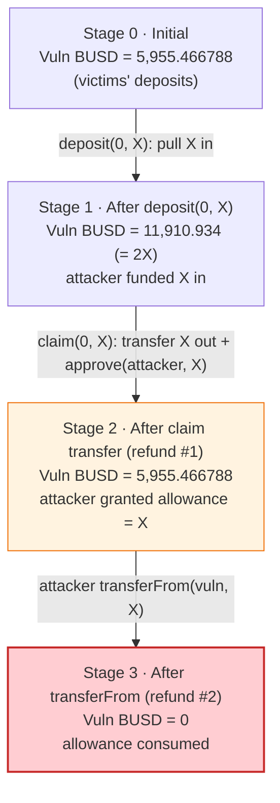
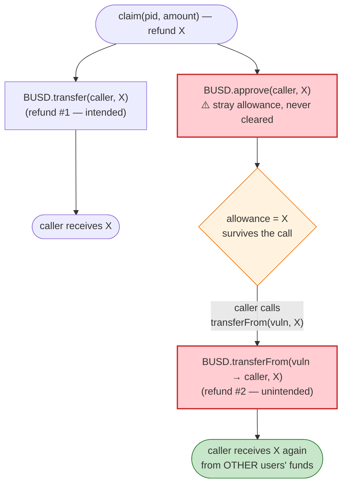

# Unverified Staking Contract — `claim()` Double-Spend of Deposited BUSD

> **Vulnerability classes:** vuln/logic/missing-allowance · vuln/logic/state-update · vuln/logic/incorrect-order-of-operations

> **Reproduction:** the PoC compiles & runs in an isolated Foundry project at
> [this project folder](.). Full verbose trace: [output.txt](output.txt).
> Verified source available for the flash-loan provider only
> ([DPPOracle.sol](sources/DPPOracle_9ad32e/DPPOracle.sol)); the **vulnerable
> contract itself is unverified** on BscScan (hence the "UnverifiedContr" name).
> The mechanism below is reconstructed entirely from the on-chain call/event
> trace.

---

## Key info

| | |
|---|---|
| **Loss** | ~$5,955 — **5,955.466788 BUSD** drained from the staking contract |
| **Vulnerable contract** | Unverified staking/farm — [`0xAC899Ef647533E0dE91E269202f1169d7D47Ae92`](https://bscscan.com/address/0xAC899Ef647533E0dE91E269202f1169d7D47Ae92) |
| **Asset stolen** | BUSD (Binance-Peg) — [`0x55d398326f99059fF775485246999027B3197955`](https://bscscan.com/address/0x55d398326f99059fF775485246999027B3197955) |
| **Flash-loan source** | DODO `DPPOracle` — [`0x9ad32e3054268B849b84a8dBcC7c8f7c52E4e69A`](https://bscscan.com/address/0x9ad32e3054268B849b84a8dBcC7c8f7c52E4e69A#code) (not at fault) |
| **Attacker EOA / contract** | [`0xab90a897cf6c56c69a4579ead3c900260dfba02d`](https://bscscan.com/address/0xab90a897cf6c56c69a4579ead3c900260dfba02d) |
| **Attack tx** | [`0xe1bf84b7a57498c0573361b20b16077cc933e4c47aa0821bcea5b158a60ef505`](https://app.blocksec.com/explorer/tx/bsc/0xe1bf84b7a57498c0573361b20b16077cc933e4c47aa0821bcea5b158a60ef505) |
| **Chain / block / date** | BSC / fork at 29,469,587 / June 27, 2023 |
| **Compiler** | DPPOracle: Solidity v0.6.9, optimizer 200 runs. Vulnerable contract: unverified. |
| **Bug class** | Accounting flaw — a deposit refunded twice (residual ERC20 allowance + direct transfer) |

> Note: the token addresses 0x55d398… (BUSD here) and the small absolute loss are
> consistent with the `~$5,955` figure quoted in the PoC header
> ([test/UnverifiedContr_9ad32_exp.sol:7](test/UnverifiedContr_9ad32_exp.sol#L7)).
> The `[KeyInfo]` USD figure is the loss; the BUSD amount drained is 5,955.466788.

---

## TL;DR

A small BUSD staking/farm contract at `0xAC899…` lets a user `deposit(pid, amount)`
and later `claim(pid, amount)`. The trace shows that `claim()` returns the staked
principal to the caller in **two** redundant ways for the **same** `amount`:

1. it performs a direct `BUSD.transfer(caller, amount)` (the legitimate refund), **and**
2. it leaves the caller holding an **ERC20 allowance of `amount`** on the contract's
   own BUSD balance, which the caller then drains with a follow-up
   `BUSD.transferFrom(vulnContract, caller, amount)`.

So one `deposit` of `X` is refunded as `2·X`. Because the contract was pre-funded
with exactly **5,955.466788 BUSD** of other users' value, the attacker simply:

1. Took a DODO `DPPOracle` flash loan of BUSD (working capital, **fully repaid**).
2. `deposit(0, 5955.466788)` — paid the contract `X`, raising its balance to `2X`.
3. `claim(0, 5955.466788)` — got `X` back by transfer **and** an allowance of `X`.
4. `transferFrom(vuln → self, 5955.466788)` — pulled the second `X` (the victims' money).
5. Repaid the flash loan.

Net theft = `X` = **5,955.466788 BUSD** — exactly the contract's entire BUSD balance,
which is now **0**.

The flash loan is *incidental*: it only supplies the BUSD the attacker briefly fronts
for the deposit. The bug needs no price manipulation and no oracle — it is a pure
double-refund accounting error in an unaudited, unverified contract.

---

## Background — the two contracts involved

There are two contracts in this incident, and only one is buggy.

### 1. DODO `DPPOracle` (`0x9ad32e…`) — the flash-loan tap (NOT vulnerable)

This is a standard DODO Private Pool with oracle pricing. Its
`flashLoan(baseAmount, quoteAmount, assetTo, data)`
([DPPOracle.sol:1193-1276](sources/DPPOracle_9ad32e/DPPOracle.sol#L1193-L1276))
optimistically sends out the requested amounts, calls back into the borrower via
`DPPFlashLoanCall(...)`, and then requires the reserves to be made whole:

```solidity
function flashLoan(uint256 baseAmount, uint256 quoteAmount, address _assetTo, bytes calldata data)
    external preventReentrant
{
    address assetTo = _assetTo;
    _transferBaseOut(assetTo, baseAmount);
    _transferQuoteOut(assetTo, quoteAmount);          // ← sends the loan out

    if (data.length > 0)
        IDODOCallee(assetTo).DPPFlashLoanCall(msg.sender, baseAmount, quoteAmount, data);

    uint256 baseBalance  = _BASE_TOKEN_.balanceOf(address(this));
    uint256 quoteBalance = _QUOTE_TOKEN_.balanceOf(address(this));

    // no input -> pure loss
    require(baseBalance >= _BASE_RESERVE_ || quoteBalance >= _QUOTE_RESERVE_, "FLASH_LOAN_FAILED");
    ...
    _sync();
}
```

The attacker borrows **1,243,763.24 BUSD** as the `quoteAmount`, and repays the
exact same amount before the function returns. The DODO pool ends the transaction
with its original BUSD balance (`1,243,763.24`) intact — confirmed by the trailing
`balanceOf` static-calls in the trace. **DODO loses nothing**; it is purely the
capital source.

### 2. The unverified staking contract (`0xAC899…`) — the victim

No verified source exists. From the trace we can recover its public interface:

- `deposit(uint256 pid, uint256 amount)` — selector `0xe2bbb158`
- `claim(uint256 pid, uint256 amount)` — selector `0xc3490263`

Behaviorally (reconstructed from emitted `Approval`/`Transfer` events):

| Function | Observed behavior |
|---|---|
| `deposit(0, X)` | Contract does `BUSD.approve(self, X)` then `BUSD.transferFrom(caller, self, X)` — pulls `X` BUSD from the caller into the contract. |
| `claim(0, X)` | Contract does `BUSD.approve(caller, X)` then `BUSD.transfer(caller, X)` — sends `X` BUSD back to the caller **and** grants the caller an allowance of `X` over the contract's own BUSD. |

That stray `approve(caller, X)` inside `claim` is the entire bug.

---

## The vulnerable code

The vulnerable contract is **not verified**, so we cannot quote its Solidity. But
the trace is unambiguous. The defect is reconstructed as:

```solidity
// PSEUDOCODE reconstructed from the on-chain trace of 0xAC899…
function claim(uint256 pid, uint256 amount) external {
    // ... reward / principal bookkeeping ...

    BUSD.approve(msg.sender, amount);   // ⚠️ BUG: gives the caller a standing
                                        //    allowance over the CONTRACT's BUSD
    BUSD.transfer(msg.sender, amount);  // legitimate principal/refund payout

    // ⚠️ the allowance from approve() is NEVER consumed or reset here,
    //    so it survives the call and the caller can transferFrom() again.
}
```

For comparison, the **non-vulnerable** pattern in the trace is `deposit`, which
correctly uses `transferFrom` to *pull* funds in (and the `approve(self, amount)`
it issues is consumed in the same call). The mistake in `claim` is using an
allowance grant where a plain transfer was already sufficient — paying the
principal out via **both** an `approve` (which the user later drains) and a
`transfer`.

The driver code in the PoC encodes the two raw selector calls directly
([test/UnverifiedContr_9ad32_exp.sol:31-34](test/UnverifiedContr_9ad32_exp.sol#L31-L34)):

```solidity
BUSD.approve(address(Vulncontract), 9999 ether);
address(Vulncontract).call(abi.encodeWithSelector(bytes4(0xe2bbb158), 0, 5_955_466_788_004_705_247_296)); // deposit
address(Vulncontract).call(abi.encodeWithSelector(bytes4(0xc3490263), 0, 5_955_466_788_004_705_247_296)); // claim
BUSD.transferFrom(address(Vulncontract), address(this), 5_955_466_788_004_705_247_296);                   // drain residual allowance
```

---

## Root cause — why it was possible

A single `claim(0, X)` refunds the staked principal **twice**:

> **Refund #1 (intended):** `BUSD.transfer(caller, X)` — sends `X` back.
> **Refund #2 (unintended):** `BUSD.approve(caller, X)` leaves a standing allowance
> the caller drains with `BUSD.transferFrom(vulnContract, caller, X)`.

Both refunds draw on the contract's BUSD balance. Because the contract held the
deposits of other users, the second refund is paid out of **someone else's money**.

The composition of design errors:

1. **Spurious `approve` in a payout path.** A refund only needs `transfer`. Granting
   the recipient an *allowance* of the same size, and never clearing it, is a free
   second withdrawal voucher.
2. **No internal accounting decrement before the external token movement.** The
   contract does not net out "principal already returned" — so calling `claim`'s
   refund and then spending the leftover allowance both succeed against the same
   stored balance.
3. **Funds are fungible and pooled.** The contract custodies all users' BUSD in one
   balance, so the double-refund is satisfiable from any depositor's principal, not
   just the attacker's own.

The flash loan is **not** the root cause — it only removes the capital requirement.
A user with 5,955 BUSD of their own could have executed the identical
deposit → claim → transferFrom sequence with no loan at all.

---

## Preconditions

- The unverified contract must already hold ≥ `X` BUSD of other users' deposits
  (it held exactly **5,955.466788 BUSD**, so `X` is sized to match and drain it to 0).
- The caller must have ≥ `X` BUSD to front the `deposit` (provided here by the DODO
  flash loan; could equally be the attacker's own capital).
- The caller must have approved the contract enough BUSD for the `deposit` pull
  (PoC approves `9999 ether`).
- No timing, oracle, or price-manipulation prerequisite. Permissionless,
  single-transaction, atomic.

---

## Attack walkthrough (with on-chain numbers from the trace)

All figures are decoded directly from the BUSD `Transfer`/`Approval` events and the
storage diffs in [output.txt](output.txt#L1577-L1646). BUSD has 18 decimals;
`X = 5,955.466788004705 BUSD`. The attacker starts with a dust balance of
**0.01 BUSD**.

| # | Step (caller = attacker contract `0x7FA9…` / on-chain `0xab90…`) | Attacker BUSD | Vuln contract BUSD | Effect |
|---|------|--------------:|-------------------:|--------|
| 0 | **Initial** | 0.01 | 5,955.466788 | Contract holds victims' deposits. |
| 1 | `DPPOracle.flashLoan(0, 1,243,763.24, self)` → BUSD sent to attacker | 1,243,763.25 | 5,955.466788 | Working capital borrowed (to be repaid). |
| 2 | `BUSD.approve(vuln, 9999)` | 1,243,763.25 | 5,955.466788 | Allowance so `deposit` can pull. |
| 3 | `deposit(0, X)` → `transferFrom(attacker→vuln, X)` | 1,237,807.78 | **11,910.934** | Attacker funds `X` in; contract now holds `2X`. |
| 4 | `claim(0, X)` → `transfer(vuln→attacker, X)` **+** `approve(attacker, X)` | 1,243,763.25 | 5,955.466788 | Refund #1 paid; **residual allowance of `X` granted**. |
| 5 | `BUSD.transferFrom(vuln→attacker, X)` (drains the allowance) | **1,249,718.72** | **0** | Refund #2 — victims' money taken; allowance → 0. |
| 6 | `BUSD.transfer(DPPOracle, 1,243,763.24)` (repay loan) | 5,955.477 | 0 | Flash loan repaid; pool whole. |

After step 6 the attacker holds **5,955.476788 BUSD** (the original 0.01 dust + the
stolen `X`), and the staking contract holds **0 BUSD**.

### Profit / loss accounting (BUSD)

| Line | Amount |
|---|---:|
| Attacker BUSD before | 0.010000 |
| Attacker BUSD after | 5,955.476788 |
| **Net profit** | **+5,955.466788** |
| Flash loan borrowed | 1,243,763.239828 |
| Flash loan repaid | 1,243,763.239828 |
| **DODO pool net** | **0** |
| Vuln contract BUSD before → after | 5,955.466788 → **0** |

The profit equals the deposit amount equals the contract's entire prior balance —
confirming the attacker walked off with 100% of the other depositors' BUSD by
having a single deposit refunded twice.

---

## Diagrams

### Sequence of the attack

```mermaid
sequenceDiagram
    autonumber
    actor A as "Attacker (0xab90…)"
    participant D as "DODO DPPOracle (0x9ad32…)"
    participant B as "BUSD token"
    participant V as "Unverified staking (0xAC899…)"

    Note over V: "Holds 5,955.466788 BUSD<br/>(other users' deposits)"

    rect rgb(227,242,253)
    Note over A,D: "Step 1 — borrow working capital"
    A->>D: "flashLoan(0, 1,243,763.24 BUSD, self)"
    D->>B: "transfer(attacker, 1,243,763.24)"
    D-->>A: "DPPFlashLoanCall(...)"
    end

    rect rgb(255,243,224)
    Note over A,V: "Step 2 — deposit X = 5,955.466788"
    A->>B: "approve(vuln, 9999)"
    A->>V: "deposit(0, X)"
    V->>B: "transferFrom(attacker → vuln, X)"
    Note over V: "Vuln BUSD: 5,955.47 → 11,910.93 (=2X)"
    end

    rect rgb(255,235,238)
    Note over A,V: "Step 3 — claim refunds X TWICE"
    A->>V: "claim(0, X)"
    V->>B: "approve(attacker, X)  ⚠️ stray allowance"
    V->>B: "transfer(vuln → attacker, X)  (refund #1)"
    Note over V: "Vuln BUSD back to 5,955.47;<br/>attacker now holds allowance X"
    A->>B: "transferFrom(vuln → attacker, X)  (refund #2)"
    Note over V: "Vuln BUSD: 5,955.47 → 0  ⚠️ drained"
    end

    rect rgb(232,245,233)
    Note over A,D: "Step 4 — repay & profit"
    A->>D: "transfer(DPPOracle, 1,243,763.24)  (repay)"
    Note over A: "Net +5,955.466788 BUSD"
    end
```

### BUSD balance evolution (vulnerable contract)



### The flaw inside `claim()` — one principal, two refunds



---

## Why each number

- **Flash loan = 1,243,763.24 BUSD:** the attacker's choice of working capital; only
  ~5,955 BUSD of it is actually needed for the deposit. The whole amount is repaid in
  step 6, so the size is irrelevant to the profit — it merely had to be `≥ X`.
- **`X` = 5,955.466788004705 BUSD:** chosen to equal the vulnerable contract's *entire*
  BUSD balance. Sizing the deposit to the victim balance lets `claim`'s double-refund
  drain the contract to exactly `0` in a single pass.
- **`approve(vuln, 9999 ether)`:** loose headroom so the `deposit` pull (`X ≈ 5,955.47`)
  succeeds; the trace shows the allowance ending at `9999 − X = 4043.53` after the pull.
- **Profit = `X`:** refund #2 is pure theft of the contract's pre-existing balance;
  refund #1 just returns the attacker's own deposit.

---

## Remediation

1. **Never grant the recipient an ERC20 allowance in a payout/refund path.** A refund
   needs only `transfer(recipient, amount)`. The `approve(caller, amount)` in `claim`
   serves no purpose and is the entire vulnerability — remove it.
2. **Decrement internal accounting before paying out, and follow checks-effects-interactions.**
   Mark the principal as returned (e.g. zero the user's staked balance) *before* the
   `transfer`, so the same principal cannot be claimed/withdrawn a second time by any path.
3. **If an allowance is ever genuinely required, reset it after use** (`approve(x, 0)`)
   or use `safeIncreaseAllowance`/`safeDecreaseAllowance` scoped to the exact operation,
   never leaving a standing allowance over the contract's pooled funds.
4. **Add an invariant test:** the sum of all users' withdrawable principal must never
   exceed the contract's token balance, and a single `deposit(X)` followed by `claim(X)`
   must net to **zero** change in the contract's balance — not `−X`.
5. **Audit and verify the contract.** This contract was unverified and shipped with a
   trivially exploitable double-refund; an external review or even a basic property
   test would have caught it.

---

## How to reproduce

The PoC runs in a standalone Foundry project (the umbrella DeFiHackLabs repo has
many unrelated PoCs that fail a whole-project build):

```bash
_shared/run_poc.sh 2023-06-UnverifiedContr_9ad32_exp -vvvvv
```

- RPC: a **BSC archive** endpoint is required (fork block 29,469,587, set in
  [test/UnverifiedContr_9ad32_exp.sol:19](test/UnverifiedContr_9ad32_exp.sol#L19)).
  Configure it in `foundry.toml`'s `[rpc_endpoints] bsc = ...`; most public BSC RPCs
  prune state this old and fail with `header not found` / `missing trie node`.
- Result: `[PASS] testExploit()`.

Expected tail (from [output.txt](output.txt#L1560-L1576)):

```
Ran 1 test for test/UnverifiedContr_9ad32_exp.sol:Exploit
[PASS] testExploit() (gas: 151604)
Logs:
  [End] Attacker BUSD after exploit: 0.010000000000000000
  [End] Attacker BUSD after exploit: 5955.476788004705247296
```

The attacker's BUSD balance rises from **0.01** to **5,955.476788**, a net theft of
**5,955.466788 BUSD** — the unverified staking contract's full balance, now zeroed.

---

*Reference: Decurity disclosure — https://x.com/DecurityHQ/status/1673708133926031360 (BSC, ~$5,955).*
