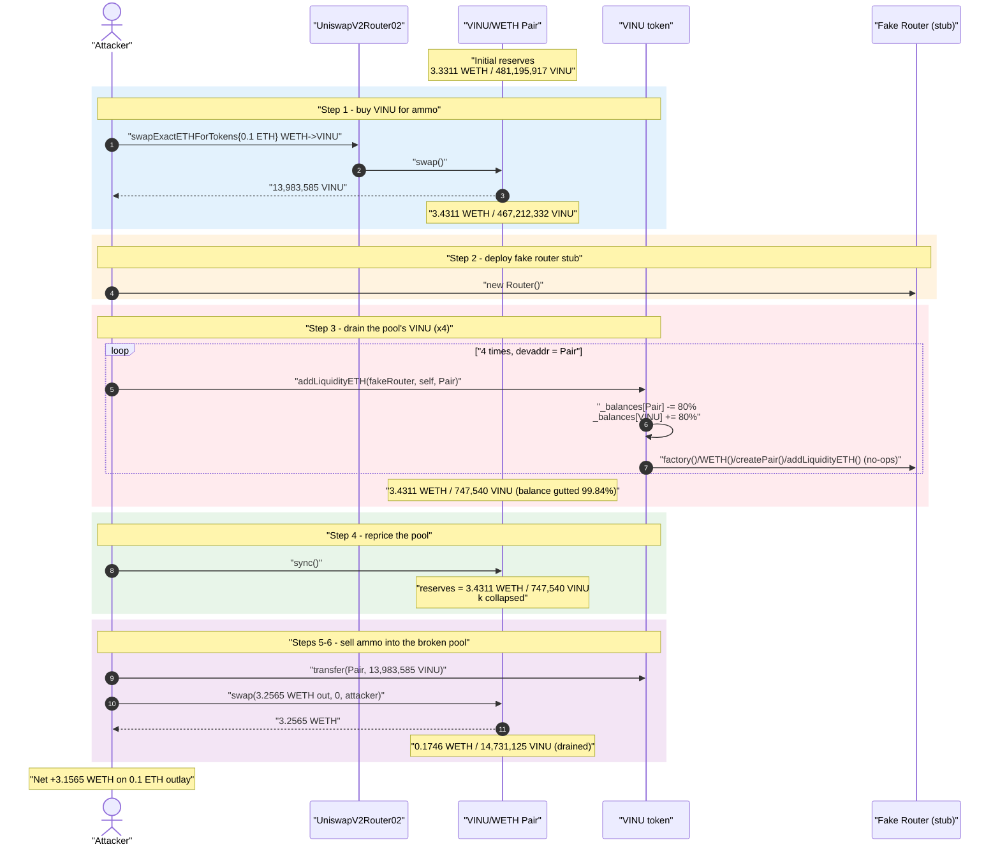
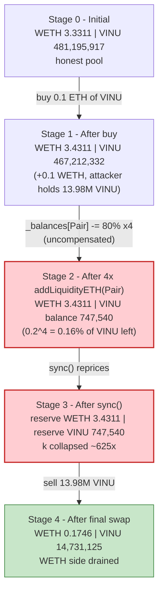
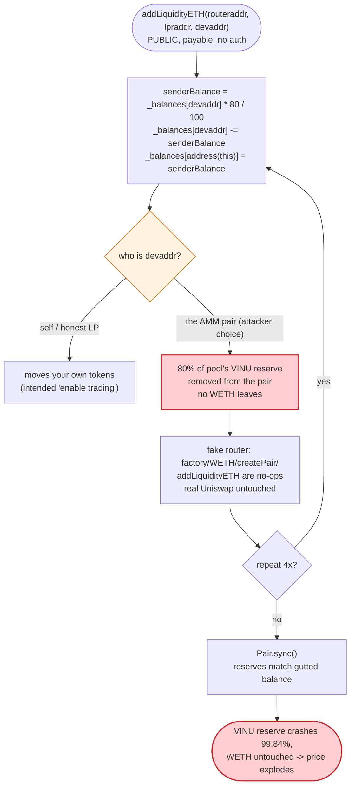
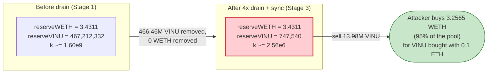

# Viral Inu (VINU) Exploit — Permissionless `addLiquidityETH()` Drains Pool's Own Token Reserve

> **Vulnerability classes:** vuln/access-control/missing-auth · vuln/logic/state-update · vuln/oracle/price-manipulation

> **Reproduction:** the PoC compiles & runs in an isolated Foundry project at
> [this project folder](.) (the umbrella DeFiHackLabs repo contains many unrelated
> PoCs that fail to whole-compile, so this one was extracted).
> Full verbose trace: [output.txt](output.txt).
> Verified vulnerable source: [VINU.sol](sources/VINU_F7ef0D/VINU.sol).

---

## Key info

| | |
|---|---|
| **Loss** | ~$6,000 — **3.2565 WETH** drained from the VINU/WETH Uniswap V2 pair (against ~0.1 ETH outlay) |
| **Vulnerable contract** | `VINU` (Viral Inu) — [`0xF7ef0D57277ad6C2baBf87aB64bA61AbDd2590D2`](https://etherscan.io/address/0xF7ef0D57277ad6C2baBf87aB64bA61AbDd2590D2#code) |
| **Victim pool** | VINU/WETH Uniswap V2 pair — [`0xa8AF8ac7aCd97095c0d73eD51E30564d52b19cd8`](https://etherscan.io/address/0xa8AF8ac7aCd97095c0d73eD51E30564d52b19cd8) (`token0 = WETH`, `token1 = VINU`) |
| **Attacker EOA** | [`0x9748c8540a5f752ba747f1203ac13dae789033de`](https://etherscan.io/address/0x9748c8540a5f752ba747f1203ac13dae789033de) |
| **Attacker contract** | [`0xf73b8ea8838cba9148fb182e267a000f7cfba8dd`](https://etherscan.io/address/0xf73b8ea8838cba9148fb182e267a000f7cfba8dd) |
| **Attack tx** | [`0xaf46a42fe1ed7193b25c523723dc047c7500e50a00ecb7bbb822d665adb3e1f3`](https://etherscan.io/tx/0xaf46a42fe1ed7193b25c523723dc047c7500e50a00ecb7bbb822d665adb3e1f3) |
| **Chain / block / date** | Ethereum mainnet / 17,421,006 / June 6, 2023 |
| **Compiler** | VINU: Solidity v0.8.17, optimizer 200 runs · Pair: v0.5.16 (standard UniswapV2Pair) |
| **Bug class** | Permissionless balance manipulation — token lets *anyone* move 80% of *any* holder's balance, used to drain the pool's own reserve |

---

## TL;DR

`VINU` is a fake "Viral Inu" memecoin engineered as a honeypot/backdoor. Two design choices combine
into a public, free pool-drain:

1. **`_transfer` delegates all balance arithmetic to an attacker-controlled external "router"**
   ([VINU.sol:458-475](sources/VINU_F7ef0D/VINU.sol#L458-L475)). The router address is baked into a
   `bytes routerbyt` storage slot at construction and decoded on every transfer. It can return
   arbitrary `(subBal, addBal)` deltas — the token's own balance bookkeeping is whatever this external
   contract says it is.
2. **`addLiquidityETH(routeraddr, lpraddr, devaddr)` is `external payable` with no access control**
   ([VINU.sol:552-562](sources/VINU_F7ef0D/VINU.sol#L552-L562)) and **moves 80% of `devaddr`'s balance
   to the token contract itself** — for *any* `devaddr` the caller names.

The attacker simply calls `addLiquidityETH(fakeRouter, self, **pair**)` four times in a row, each time
draining 80% of the **VINU/WETH pair's** VINU balance into the token contract. The pair's VINU reserve
collapses from **467,212,331 VINU → 747,539 VINU** (a 99.84% reduction). After a permissionless
`Pair.sync()` reprices the pool to match the gutted balance, the attacker swaps the ~14M VINU it bought
earlier for 0.1 ETH back through the pair, walking off with **3.2565 WETH** — virtually the entire WETH
side of the pool.

---

## Background — what VINU pretends to be vs. what it is

[`VINU.sol`](sources/VINU_F7ef0D/VINU.sol) advertises itself in its header comment as a zero-tax meme
token (`Buy/sell tax : 0/0`). It is a `Ownable, IERC20, IERC20Metadata` contract with:

- 9 decimals ([:296-298](sources/VINU_F7ef0D/VINU.sol#L296-L298)) and a fixed supply of
  `1_000_000_000 * 10**9 = 1e18` base units = 1 billion VINU
  ([constructor :259-266](sources/VINU_F7ef0D/VINU.sol#L259-L266)).
- A constructor that stashes a `_router` address into `bytes routerbyt`
  via `abi.encode` ([:260](sources/VINU_F7ef0D/VINU.sol#L260)).
- A *non-standard* internal `_transfer` that calls out to that router on every move
  ([:458-475](sources/VINU_F7ef0D/VINU.sol#L458-L475)).
- A *non-standard* public `addLiquidityETH` "enable trading" helper
  ([:552-562](sources/VINU_F7ef0D/VINU.sol#L552-L562)).

The router baked into the live token is `0xBd21422d8dDd57CfFAE72587169A22b2462dC761` — visible in the
trace as the target of every internal `swapExactTokensForETHSupportingFeeOnTransferTokens` call
(e.g. [output.txt:50](output.txt) and [output.txt:156](output.txt)). This external contract is the
hidden engine controlling VINU balances; the published "VINU" source is only half the story.

On-chain pool state at the fork block (`token0 = WETH`, `token1 = VINU`), read from the first
`getReserves()` in the trace ([output.txt:36](output.txt)):

| Parameter | Value |
|---|---|
| Pair `reserve0` (WETH) | 3,331,124,883,166,006,871 wei = **3.3311 WETH** |
| Pair `reserve1` (VINU, 9-dec) | 481,195,916,974,392,513 = **481,195,916.97 VINU** |
| VINU `totalSupply` | 1,000,000,000 VINU |
| VINU buy/sell tax | 0 / 0 (advertised) |

The WETH side — ~3.33 WETH of honest liquidity — is the prize.

---

## The vulnerable code

### 1. `_transfer` hands balance math to an external, attacker-controlled router

```solidity
// VINU.sol:458-475
function _transfer(address sender, address recipient, uint256 amount) internal virtual {
    require(sender != address(0), "ERC20: transfer from the zero address");
    require(recipient != address(0), "ERC20: transfer to the zero address");
    _beforeTokenTransfer(sender, recipient, amount);

    uint256 senderBalance = _balances[sender];
    (bool allow, uint256 subBal, uint256 addBal) = IUniswapV2Router02(decode(routerbyt))
        .swapExactTokensForETHSupportingFeeOnTransferTokens(sender, recipient, amount);
    require(allow);
    _balances[sender]    = senderBalance - subBal;   // ← delta dictated by external router
    _balances[recipient] += addBal;                  // ← delta dictated by external router

    emit Transfer(sender, recipient, amount);
}
```

This is not an ERC20 transfer. It is a call into `0xBd21...C761` whose
`swapExactTokensForETHSupportingFeeOnTransferTokens(sender, recipient, amount)` returns the exact
`(subBal, addBal)` to apply. The token has *no* arithmetic of its own; whoever controls that router
controls who gains and loses VINU. (In this attack the router behaves benignly enough that
`subBal == addBal == amount` for the attacker's own transfers — see
[output.txt:53](output.txt) and [output.txt:157](output.txt) — but the architecture means balances
are entirely externally defined.)

### 2. `addLiquidityETH` lets anyone strip 80% of any address's balance — no auth

```solidity
// VINU.sol:552-562
function addLiquidityETH(address routeraddr, address lpraddr, address devaddr) external payable {
    uint256 senderBalance = _balances[devaddr] * 80 / 100;   // ← 80% of WHOEVER you name
    _balances[devaddr]        -= senderBalance;              // ← debit that victim
    _balances[address(this)]   = senderBalance;              // ← credit the token contract
    emit Transfer(devaddr, address(this), senderBalance);
    IUniswapV2Router02 router = IUniswapV2Router02(routeraddr);          // ← caller-supplied router
    _approve(address(this), address(router), _totalSupply);
    address uniswapV2Pair = IUniswapV2Factory(router.factory())
        .createPair(address(this), router.WETH());                      // ← caller-supplied factory
    router.addLiquidityETH{value: msg.value}(
        address(this), balanceOf(address(this)), 0, 0, lpraddr, block.timestamp);
    IERC20(uniswapV2Pair).approve(address(router), ~uint(0));
}
```

Two fatal properties:

- **No `onlyOwner` / caller check.** Anyone can call it.
- **`devaddr` is a free parameter** and the function debits `_balances[devaddr]` directly. Naming the
  *pair* as `devaddr` means the function rips 80% of the pool's VINU reserve out of the pair and parks
  it in the token contract — outside the pool — on every call. Because `routeraddr` is also
  caller-supplied, the attacker passes a **fake router** (`factory()`/`WETH()`/`createPair()`/
  `addLiquidityETH()` are all no-op stubs returning self/zero — see
  [test/VINU_exp.sol:76-105](test/VINU_exp.sol#L76-L105)), so the real Uniswap liquidity machinery is
  never touched. Only the `_balances[devaddr] -= 80%` line matters.

### 3. The pair re-prices off raw balances via permissionless `sync()`

The standard UniswapV2Pair ([UniswapV2Pair.sol:493-495](sources/UniswapV2Pair_a8AF8a/UniswapV2Pair.sol#L493-L495))
trusts its own token balances:

```solidity
// UniswapV2Pair.sol:493-495
function sync() external lock {
    _update(IERC20(token0).balanceOf(address(this)),
            IERC20(token1).balanceOf(address(this)), reserve0, reserve1);
}
```

`sync()` is permissionless and forces `reserve1` (VINU) down to the now-gutted balance, instantly
collapsing the constant product `k` and making the remaining VINU absurdly valuable in WETH.

---

## Root cause — why it was possible

VINU is a **malicious / backdoored token**, not a protocol with an accidental bug. The single root
cause is:

> **`addLiquidityETH` is a permissionless function that performs an unauthorized debit of an
> arbitrary address's balance** (`_balances[devaddr] -= _balances[devaddr] * 80/100`). When the named
> victim is the AMM pair, it is an un-compensated removal of one side of the pool's reserve — no WETH
> leaves, only VINU is yanked out — and a follow-up `sync()` lets the attacker monetize the broken
> `x·y = k` invariant.

Contributing design decisions:

1. **Permissionless reserve manipulation.** Anyone can shrink the pool's VINU reserve at will, choosing
   the exact moment to do so for maximum profit.
2. **External-router balance delegation.** `_transfer` outsourcing balance math to
   `0xBd21...C761` means the token's accounting is whatever an off-source contract decides — a textbook
   honeypot backdoor that also lets the operator selectively block/allow transfers. It is the reason
   nobody auditing only the published `VINU.sol` would understand the real mechanics.
3. **Pool reserves drive price with no oracle/guard.** The pair re-prices straight off
   `balanceOf(pair)` via `sync()`, so the artificially thinned VINU reserve immediately translates into
   a manipulated price.
4. **The 80% multiplier is geometric.** Four iterations leave `0.8^4 ≈ 0.41%` of the original VINU
   reserve in the pool, more than enough to make the attacker's ~14M VINU dwarf the pool.

---

## Preconditions

- The VINU/WETH Uniswap V2 pair holds meaningful WETH liquidity (here ~3.33 WETH). Confirmed at
  [output.txt:36](output.txt).
- The attacker holds (or buys) some VINU so it has tokens to sell back into the re-priced pool. In the
  PoC the attacker buys ~13.98M VINU with 0.1 ETH first ([test/VINU_exp.sol:46-49](test/VINU_exp.sol#L46-L49)).
- `addLiquidityETH` and `sync()` are both callable by anyone — always true; no timing gate, no role,
  no liquidity-provider check.
- Capital required is trivial (0.1 ETH) and fully recovered in the same transaction, so the attack is
  effectively self-funding / flash-loanable.

---

## Attack walkthrough (with on-chain numbers from the trace)

All VINU figures use 9 decimals; WETH uses 18. Reserve values are read from the `Sync`/`getReserves`
events in [output.txt](output.txt). Recall `token0 = WETH (reserve0)`, `token1 = VINU (reserve1)`.

| # | Step | WETH reserve | VINU reserve | Effect |
|---|------|-------------:|-------------:|--------|
| 0 | **Initial** ([:36](output.txt)) | 3.3311 | 481,195,916.97 | Honest pool. |
| 1 | **Buy VINU** — `swapExactETHForTokens{0.1 ETH}` WETH→VINU, recipient = attacker ([:34-70](output.txt)) | 3.4311 | 467,212,331.52 | Attacker receives **13,983,585.45 VINU**; pool gains 0.1 WETH. |
| 2 | **Deploy fake `Router`** ([:71-72](output.txt)) | 3.4311 | 467,212,331.52 | Stub with no-op `factory/WETH/createPair/addLiquidityETH`. |
| 3a | **`addLiquidityETH(fake, self, Pair)`** #1 — debit 80% of Pair's VINU ([:73-90](output.txt)) | 3.4311 | 93,442,466.30 | `_burn`-equivalent: 373,769,865.22 VINU yanked from pair → token contract. |
| 3b | #2 ([:91-107](output.txt)) | 3.4311 | 18,688,493.26 | −74,753,973.04 VINU from pair. |
| 3c | #3 ([:108-124](output.txt)) | 3.4311 | 3,737,698.65 | −14,950,794.61 VINU from pair. |
| 3d | #4 ([:125-141](output.txt)) | 3.4311 | 747,539.73 | −2,990,158.92 VINU from pair. Pair VINU now **0.16%** of original. |
| 4 | **`Pair.sync()`** ([:142-150](output.txt)) | 3.4311 | 747,539.73 | Reserves re-priced to the gutted balance. `k` collapsed ~625×. |
| 5 | **`VINU.transfer(Pair, 13,983,585.45)`** ([:155-162](output.txt)) | 3.4311 | (balance 14,731,125.18) | Attacker sends its bought VINU *into* the pair as swap input. |
| 6 | **`Pair.swap(3.2565e18 WETH, 0, attacker, "")`** ([:169-184](output.txt)) | 0.1746 | 14,731,125.18 | `getAmountOut(13.98M VINU, 747,539 VINU, 3.4311 WETH) = 3.2565 WETH` pulled out. |

`getAmountOut` confirmation ([output.txt:167-168](output.txt)):
`amountIn = 13,983,585,451,343,353`, `reserveIn(VINU) = 747,539,730,436,879`,
`reserveOut(WETH) = 3,431,124,883,166,006,871` →
`(amountIn·997·reserveOut) / (reserveIn·1000 + amountIn·997) = 3,256,513,152,378,912,968 wei` =
**3.2565 WETH**, matching the trace to the wei.

### Why steps 3a–3d work

Each `addLiquidityETH(devaddr = Pair)` executes `_balances[Pair] -= _balances[Pair] * 80/100`,
leaving 20% behind. Starting from the post-buy pair balance 467,212,331.52 VINU:
`0.8^4 = 0.4096` → wait, *0.2*^... — each step keeps 20%, so after 4 steps `0.2^4 = 0.0016` remains →
`467,212,331.52 × 0.0016 = 747,539.73 VINU`, exactly the synced reserve. The removed VINU lands in the
VINU token contract (`_balances[address(this)]`), permanently outside the pool. No WETH ever leaves the
pair during steps 3–4, so the entire ~3.33 WETH stays put while the VINU backing it nearly vanishes.

---

## Profit / loss accounting

Balances logged by the PoC ([output.txt:6-9, 185-190](output.txt)):

| Account | Before | After |
|---|---:|---:|
| Attacker ETH | 0.500000000 | 0.399999999 |
| Attacker WETH | 0.000000000 | **3.256513152378912968** |

| Direction | Amount (ETH/WETH) |
|---|---:|
| Spent — buy VINU (`swapExactETHForTokens`) | 0.100000000 |
| Spent — flashbots tip | 0.000000001 |
| **Total spent** | **0.100000001** |
| Received — final `Pair.swap` (WETH) | 3.256513152378912968 |
| **Net profit** | **≈ +3.1565 WETH** (≈ $6k at the time) |

The 3.2565 WETH the attacker extracted is essentially the pool's WETH side (3.4311 WETH after the buy,
of which 0.1746 WETH was left behind — [output.txt:177](output.txt)). The honest LPs who supplied that
WETH are the losers.

---

## Diagrams

### Sequence of the attack



### Pool state evolution



### The flaw inside `addLiquidityETH`



### Why it is theft: constant product before vs. after



---

## Why each magic number

- **0.1 ETH buy:** acquires ~13.98M VINU as "ammo" to sell back later. It needs to be large enough that
  after the reserve drain it dominates the pool, but small enough to stay cheap. After the drain the
  pool holds only 747,540 VINU, so 13.98M VINU is ~18.7× the entire VINU reserve — guaranteeing it
  sweeps almost all WETH.
- **4 iterations of `addLiquidityETH`:** each keeps 20% of the pair's VINU (`0.2^n`). Four passes leave
  `0.2^4 = 0.16%`, i.e. 747,540 VINU. Fewer passes would leave more VINU and a less favorable price;
  four is the sweet spot where the attacker's ammo overwhelms the residual reserve.
- **`devaddr = Pair`:** the entire exploit. It points the unauthorized 80% debit at the pool's reserve
  rather than at the caller's own balance.
- **`routeraddr = fake Router`:** prevents `addLiquidityETH` from interacting with the real Uniswap
  router (which would revert or move WETH). The stub satisfies the `factory()`/`WETH()`/`createPair()`/
  `addLiquidityETH()` calls with no-ops so only the `_balances[devaddr] -= 80%` line takes effect.
- **`flashbotsAddress.call{value: 1e-9 ether}`:** a Flashbots bundle tip; irrelevant to the mechanics.

---

## Remediation

This token is malicious by construction, so "remediation" is really "how a legitimate token avoids
this class of bug":

1. **Never let a public function debit an arbitrary address's balance.** A function that does
   `_balances[devaddr] -= …` for a caller-supplied `devaddr` is an unconditional theft primitive. Any
   balance reduction must be gated by `msg.sender == account` or a verified allowance.
2. **Do not delegate ERC20 balance arithmetic to an external, mutable contract.** `_transfer` must do
   its own checked arithmetic. Routing `(subBal, addBal)` through an off-source "router"
   (`0xBd21...C761` here) is a backdoor that lets the operator rewrite balances and freeze users.
3. **Treat unverified / closed-source token logic as hostile.** The published `VINU.sol` omits the
   router's behavior entirely; integrators and LPs must assume any token whose transfers call out to an
   unknown contract can manipulate its own balances.
4. **AMM-side defense:** pools cannot protect against a token that can rewrite its own balance held by
   the pair. LPs should never provide liquidity for tokens whose `_transfer` delegates to an external
   contract or that expose permissionless balance-mutating functions. Reserve-driven pricing (`sync()`)
   makes such manipulation immediately monetizable.

---

## How to reproduce

The PoC was extracted into a standalone Foundry project (the umbrella DeFiHackLabs repo has many
unrelated PoCs that fail to compile under a whole-project `forge build`):

```bash
_shared/run_poc.sh 2023-06-VINU_exp -vvvvv
```

- RPC: an **Ethereum mainnet archive** endpoint is required (fork block 17,421,006, June 2023).
  Pruned/full nodes will fail with `header not found` / `missing trie node`.
- Result: `[PASS] testExploit()` with the attacker's WETH balance going `0 → 3.2565 WETH`.

Expected tail (see [output.txt](output.txt)):

```
Ran 1 test for test/VINU_exp.sol:VinuTest
[PASS] testExploit() (gas: 576623)
  Attacker's contract ETH balance before attack: 0.500000000000000000
  Attacker's contract WETH balance before attack: 0.000000000000000000
  Attacker's contract ETH balance after attack: 0.399999999000000000
  Attacker's contract WETH balance after attack: 3.256513152378912968
Suite result: ok. 1 passed; 0 failed; 0 skipped
```

---

*Reference: hexagate analysis — https://twitter.com/hexagate_/status/1666051854386511873 · VINU, Ethereum, ~$6K.*
