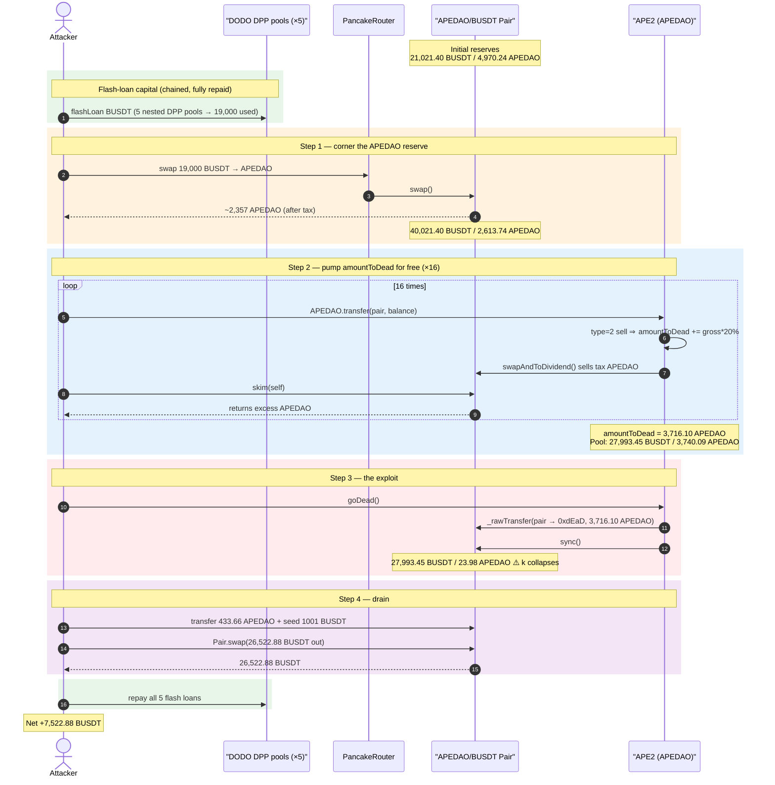
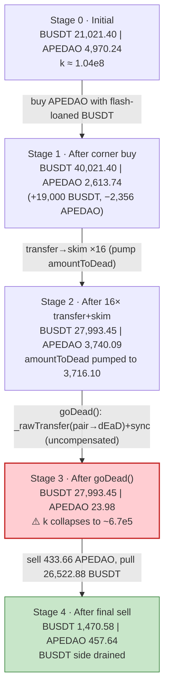
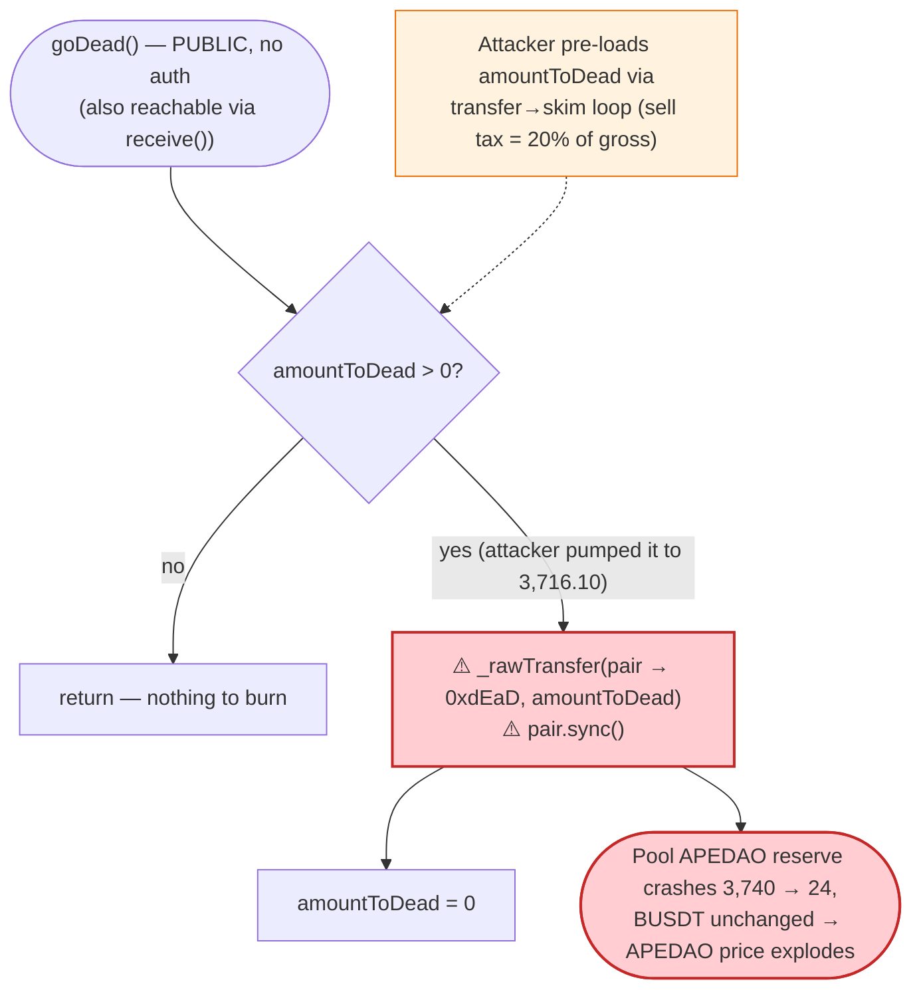
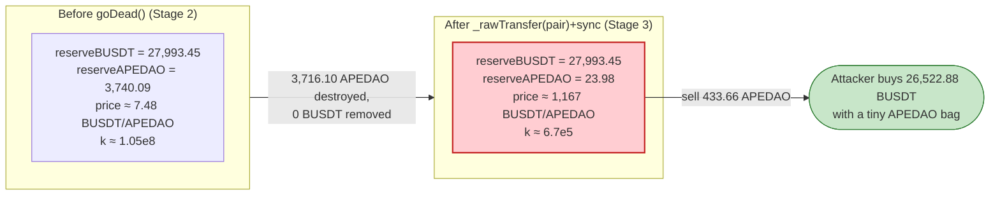

# ApeDAO (APE2) Exploit — Permissionless `goDead()` Pool-Reserve Burn + `skim()` Tax Pump

> **Reproduction:** the PoC compiles & runs in an isolated Foundry project at
> [this project folder](.) (the umbrella DeFiHackLabs repo contains many unrelated PoCs
> that do not whole-compile, so this one was extracted into a standalone project).
> Full verbose trace: [output.txt](output.txt).
> Verified vulnerable source: [contracts_kape_APE2.sol](sources/APE2_B47955/contracts_kape_APE2.sol).

---

## Key info

| | |
|---|---|
| **Loss** | **~7,522.88 BUSDT** (~$7.5K) drained from the APEDAO/BUSDT PancakeSwap pair |
| **Vulnerable contract** | `APE2` (APEDAO) — [`0xB47955B5B7EAF49C815EBc389850eb576C460092`](https://bscscan.com/address/0xB47955B5B7EAF49C815EBc389850eb576C460092#code) |
| **Victim pool** | APEDAO/BUSDT pair — [`0xee2a9D05B943C1F33f3920C750Ac88F74D0220c3`](https://bscscan.com/address/0xee2a9D05B943C1F33f3920C750Ac88F74D0220c3) |
| **Attacker EOA** | [`0x10703f7114dce7beaf8d23cde4bf72130bb0f56a`](https://bscscan.com/address/0x10703f7114dce7beaf8d23cde4bf72130bb0f56a) |
| **Attack contract** | [`0x45aa258ad08eeeb841c1c02eca7658f9dd4779c0`](https://bscscan.com/address/0x45aa258ad08eeeb841c1c02eca7658f9dd4779c0) |
| **Attack tx** | [`0x8d35dfd9968ce61fb969ffe8dcc29eeeae864e466d2cb0b7d26ce63644691994`](https://bscscan.com/tx/0x8d35dfd9968ce61fb969ffe8dcc29eeeae864e466d2cb0b7d26ce63644691994) |
| **Chain / block / date** | BSC / 30,072,293 / July 18, 2023 |
| **Compiler** | Solidity v0.8.4 (optimizer, 200 runs) — per [`_meta.json`](sources/APE2_B47955/_meta.json) |
| **Bug class** | Broken AMM invariant via a permissionless, un-compensated pool-reserve burn + skim-based tax amplification |

---

## TL;DR

APEDAO is a fee-on-transfer "dividend" token. Two design flaws compose into a critical bug:

1. **`goDead()` is permissionless and burns APEDAO directly out of the AMM pair**, then calls
   `pair.sync()` ([contracts_kape_APE2.sol:614-620](sources/APE2_B47955/contracts_kape_APE2.sol#L614-L620)).
   This is an *un-compensated* deletion of one side of the pool's reserves — APEDAO is destroyed from
   the pair with no matching BUSDT outflow, and `sync()` forces the pair to accept the reduced balance
   as its new reserve. That single operation **breaks the constant-product invariant `x·y = k`** in
   the burner's favor.

2. **The burn amount `amountToDead` is attacker-controllable through the sell tax.** Every "sell"
   transfer adds `amountx * 20 / 100` to `amountToDead`
   ([:606-611](sources/APE2_B47955/contracts_kape_APE2.sol#L606-L611)). The attacker pumps this counter
   for free by repeatedly transferring APEDAO into the pair and immediately calling the pair's `skim()`
   to retrieve almost all of it back — each round inflates `amountToDead` by ~20% of the moved amount
   without the attacker actually parting with the tokens.

The attacker:

1. **Flash-loans 19,000 BUSDT** (chained across five DODO DPP pools) and buys ~2,357 APEDAO, draining
   the pool's APEDAO reserve from 4,970 → 2,614.
2. **Runs a 16-iteration `transfer → skim` loop**: each round counts as a taxed "sell," ratcheting
   `amountToDead` up to **3,716.10 APEDAO** while the attacker keeps recovering its tokens via `skim`.
3. **Calls `goDead()`** — burns 3,716.10 APEDAO out of the pair (which then held 3,740.09 APEDAO),
   collapsing the APEDAO reserve to **23.98** while the BUSDT reserve stays at **27,993.45**.
4. **Sells a small APEDAO bag** (433.66 APEDAO + 1001 BUSDT seed) into the now-degenerate pool and
   pulls **26,522.88 BUSDT** out.
5. **Repays all five flash loans** and walks away with **7,522.88 BUSDT** of pure profit.

---

## Background — what APE2 (APEDAO) does

`APE2` ([source](sources/APE2_B47955/contracts_kape_APE2.sol)) is an ERC20 with a fee-on-transfer
"reflections + NFT dividend" engine bolted on. The features that matter for the exploit:

- **Transfer-type classification.** On every transfer it computes a "type" from whether `from`/`to`
  is the AMM pair and whether the pair's *balance* differs from its cached *reserve*
  (`_getTransferType` / `_isLiquidity`, [:382-445](sources/APE2_B47955/contracts_kape_APE2.sol#L382-L445)).
  Type 1 = buy, type 2 = sell, type 3 = add LP, type 4 = remove LP.
- **Sell tax.** A sell (type 2) skims 2% LP + 2% NFT + 1% childCoin (and a time-window 15% if inside
  the launch window) off the transfer amount ([:569-596](sources/APE2_B47955/contracts_kape_APE2.sol#L569-L596)).
- **`amountToDead` accumulator.** On every sell, `amountToDead += amountx * 20 / 100` where `amountx`
  is the *gross* transfer amount ([:606-611](sources/APE2_B47955/contracts_kape_APE2.sol#L606-L611)).
- **`goDead()` — the deflation sink.** A **public, unguarded** function that burns the accumulated
  `amountToDead` *from the pair's balance* and re-syncs the pair
  ([:614-620](sources/APE2_B47955/contracts_kape_APE2.sol#L614-L620)). It is also invoked from
  `receive()` ([:749-751](sources/APE2_B47955/contracts_kape_APE2.sol#L749-L751)).

The on-chain state of the APEDAO/BUSDT pair at the fork block (pair `token0 = BUSDT`, `token1 = APEDAO`,
read from the trace's first `getReserves`):

| Parameter | Value |
|---|---|
| Pair `token0` / `reserve0` | BUSDT / **21,021.40 BUSDT** |
| Pair `token1` / `reserve1` | APEDAO / **4,970.24 APEDAO** |
| Sell tax components | 2% LP + 2% NFT + 1% child = 5% |
| `amountToDead` accrual per sell | **20% of gross sell amount** |
| `isOpenToDead` | `true` (pool-burn path enabled) |

The thinness of the pool (only ~5K APEDAO of reserve) is what makes the fixed-multiplier `amountToDead`
pump land as a near-total wipe of the APEDAO side.

---

## The vulnerable code

### 1. `goDead()` — permissionless, burns from the pool, then `sync()`

```solidity
function goDead() public {                           // ← no access control
    if (amountToDead > 0){
        _rawTransfer(address(pair), address(0xdEaD), amountToDead);  // ⚠️ destroys pair's APEDAO
        pair.sync();                                  // ⚠️ forces the smaller balance to be the reserve
        amountToDead = 0;
    }
}
```

[contracts_kape_APE2.sol:614-620](sources/APE2_B47955/contracts_kape_APE2.sol#L614-L620)

`_rawTransfer(pair, 0xdEaD, amountToDead)` moves APEDAO *out of the pair* to the dead address; no BUSDT
leaves. `pair.sync()` then writes the reduced balance as the pair's new reserve. The constant product
`k = reserveBUSDT · reserveAPEDAO` collapses, and the marginal price of APEDAO explodes — for free,
callable by anyone.

### 2. `amountToDead` grows 20% on every "sell" — and a sell is cheap to fake

```solidity
if (_transferType == 2){
    if (isOpenToDead){
        amountToDead += amountx * 20 /100;           // ⚠️ 20% of GROSS amount, attacker-pumpable
    }
}
```

[contracts_kape_APE2.sol:606-611](sources/APE2_B47955/contracts_kape_APE2.sol#L606-L611)

`amountx` is the *gross* pre-tax amount ([:519](sources/APE2_B47955/contracts_kape_APE2.sol#L519)).
Crucially the transfer that triggers this still delivers ~95% of the tokens to the pair via
`_rawTransfer(_from, _to, _amount)` ([:593](sources/APE2_B47955/contracts_kape_APE2.sol#L593)) — but
because the pair never `mint`s/`swap`s those tokens, they sit as *excess balance over reserve* and can
be reclaimed with the standard PancakeSwap `skim()`. So the attacker repeatedly moves the same bag in,
ratchets `amountToDead`, and skims the bag back out.

### 3. The transfer-type classifier keys off live pair balance vs. reserve

```solidity
function _isLiquidity() internal view returns(uint){
    ...
    (uint r0,uint r1,) = IPancakePair(address(pair)).getReserves();
    uint bal1 = IERC20(token1).balanceOf(address(pair));
    uint bal0 = IERC20(token0).balanceOf(address(pair));
    ...                       // returns 3 (addLP) / 4 (removeLP) / 0 based on bal vs reserve drift
}
```

[contracts_kape_APE2.sol:385-415](sources/APE2_B47955/contracts_kape_APE2.sol#L385-L415)

Sending APEDAO straight to the pair makes `bal > reserve`, but the drift heuristic still routes the
transfer to type 2 (sell) rather than type 3 (add-LP), so the 20%-to-dead tax fires.

---

## Root cause — why it was possible

A Uniswap-V2/PancakeSwap pair prices assets purely from its cached reserves and only enforces `x·y ≥ k`
*inside `swap()`*. `sync()` exists so the pair can adopt its real balance as the reserve — it trusts
that balances only change through `mint`/`burn`/`swap`/transfers it can reason about.

APE2 violates that trust twice over:

> `goDead()` **destroys** APEDAO held by the pair (`_rawTransfer(pair, 0xdEaD, …)`) and then calls
> `pair.sync()`, telling the pair "your APEDAO reserve is now this much smaller." No BUSDT leaves. `k`
> collapses and the price of APEDAO explodes — and the size of that destruction (`amountToDead`) is a
> value the attacker can inflate for free.

The four composing defects:

1. **Permissionless, pool-targeting burn.** `goDead()` has no `onlyOwner`/keeper guard, so the attacker
   chooses *when* the reserve-shrinking burn happens — right after positioning to profit from it.
2. **The burn is an un-compensated value transfer to APEDAO holders.** Removing APEDAO from the pair
   without removing BUSDT shifts the whole BUSDT side toward whoever still holds APEDAO. The attacker
   makes sure *they* hold a meaningful bag (433.66 APEDAO) before burning.
3. **`amountToDead` is attacker-controllable and uncapped per call.** Because the tax accumulator grows
   20% per *sell* and a "sell" can be faked with `transfer → skim`, the attacker pre-loads it to
   3,716.10 APEDAO — almost the entire APEDAO reserve of the thinned pool.
4. **`skim()` makes the pump free.** PancakeSwap's `skim()` returns the pair's balance-over-reserve
   excess to any caller, so the APEDAO moved in to trigger each taxed "sell" is fully recovered.

---

## Preconditions

- `isOpenToDead == true` so the pool-burn path in `goDead()` is live (it was).
- The pool's APEDAO reserve is small relative to the achievable `amountToDead` — true here
  (~5K APEDAO reserve). The corner buy + skim loop drive `amountToDead` to ~75% of the post-buy
  APEDAO reserve, so the burn nearly empties the APEDAO side.
- Working capital in BUSDT for the initial corner buy. In the live attack this was sourced from a chain
  of **five DODO DPP flash loans** (`DPPOracle1 → DPPOracle2 → DPPAdvanced → DPPOracle3 → DPP`,
  [ApeDAO_exp.sol:57-83](test/ApeDAO_exp.sol#L57-L83)), then fully repaid — i.e. the attack is
  effectively zero-capital.

---

## Attack walkthrough (with on-chain numbers from the trace)

Pair `token0 = BUSDT (reserve0)`, `token1 = APEDAO (reserve1)`. Figures below are taken directly from
the `Sync` events and `getReserves` calls in [output.txt](output.txt).

| # | Step | reserve0 BUSDT | reserve1 APEDAO | Effect |
|---|------|---------------:|----------------:|--------|
| 0 | **Initial** | 21,021.40 | 4,970.24 | Honest pool. |
| 1 | **Corner buy** — swap 19,000 BUSDT → ~2,357 APEDAO to attacker (after tax) | 40,021.40 | 2,613.74 | APEDAO reserve halved; attacker holds the bought APEDAO. |
| 2 | **16× `transfer(pair, bal) → skim(self)`** — each round is a taxed "sell" that adds 20% to `amountToDead` and the swap-to-dividend sells tax APEDAO into the pool | 27,993.45 | 3,740.09 | `amountToDead` ratchets to **3,716.10**; pool's BUSDT slowly bled into the dividend distributor; attacker keeps reclaiming its APEDAO via skim. |
| 3 | **`goDead()`** — `_rawTransfer(pair, 0xdEaD, 3,716.10)` + `sync()` | 27,993.45 | **23.98** | **Invariant broken**: APEDAO reserve annihilated, BUSDT untouched. |
| 4 | **Final sell** — seed 1001 BUSDT, transfer 433.66 APEDAO to pair, `Pair.swap()` out 26,522.88 BUSDT | 1,470.58 | 457.64 | Attacker buys the BUSDT side with a tiny APEDAO bag. |
| 5 | **Repay 5 flash loans** | — | — | All DPP loans returned; residual = profit. |

**Why step 2 ratchets `amountToDead` for free:** each `APEDAO.transfer(pair, balance)` is classified as
a sell (type 2). The contract takes its 5% tax (routed to itself / the NFT distributor) and runs the
internal `swapAndToDividend()` which sells the tax APEDAO for BUSDT *out of the pool* (each iteration's
`Pair::swap(... , 0, 0x3B80…Distributor)` event), then adds `gross * 20% ` to `amountToDead`. The bulk
(~95%) of the transferred APEDAO is delivered to the pair as excess balance, and the very next call
`Pair.skim(self)` returns it. Sixteen rounds accumulate `amountToDead = 3,716.10 APEDAO` while the
attacker's APEDAO holdings barely change.

**Why step 3 is theft:** before the burn the pool held `27,993.45 BUSDT / 3,740.09 APEDAO`
(price ≈ 7.48 BUSDT/APEDAO, `k ≈ 1.05e8`). `goDead()` burns 3,716.10 APEDAO out of the pair → reserve
becomes `27,993.45 BUSDT / 23.98 APEDAO` (price ≈ 1,167 BUSDT/APEDAO, `k ≈ 6.7e5`). No BUSDT moved; the
attacker's 433.66 APEDAO bag is now worth a fortune against the unchanged BUSDT side.

### Profit accounting (BUSDT)

| Direction | Amount |
|---|---:|
| Flash-loaned in (chained DPP pools) | 2,071,408.55 (all repaid) |
| Spent — corner buy | 19,000.00 |
| Seed before final sell | 0.000000000000001001 |
| **Received — final `Pair.swap`** | **26,522.88** |
| BUSDT bled to dividend distributor during skim loop / net flows | (absorbed) |
| **Net profit (balance after − before)** | **+7,522.88** |

The PoC's terminal assertions confirm it:

```
BUSDT balance of attacker before exploit: 0.000000000000000000
BUSDT balance of attacker after exploit : 7522.878140068228227274
```

([output.txt](output.txt) lines 1564-1565; final swap out = 26,522.878140068228228275 BUSDT, line 8932.)

---

## Diagrams

### Sequence of the attack



### Pool state evolution



### The flaw inside `goDead()`



### Why the burn is theft: constant-product before vs. after



---

## Why each magic number

- **Corner buy = 19,000 BUSDT** ([ApeDAO_exp.sol:90](test/ApeDAO_exp.sol#L90)): big enough to roughly
  halve the pool's APEDAO reserve (4,970 → 2,614) and give the attacker the APEDAO bag it will recycle
  through the skim loop, without moving the price so far that the round trip is unprofitable.
- **16 iterations of `transfer → skim`** ([ApeDAO_exp.sol:70-74](test/ApeDAO_exp.sol#L70-L74)): each
  round adds ~20% of the moved APEDAO to `amountToDead`. Sixteen rounds drive `amountToDead` to
  3,716.10 APEDAO ≈ 99% of the pool's APEDAO reserve at burn time, so `goDead()` leaves only ~24 APEDAO.
- **`goDead()`** ([ApeDAO_exp.sol:76](test/ApeDAO_exp.sol#L76)): the actual exploit — converts the
  pumped `amountToDead` into a one-sided reserve deletion.
- **Seed `BUSDT.transfer(pair, 1001)`** ([ApeDAO_exp.sol:78](test/ApeDAO_exp.sol#L78)): primes the pair
  with a dust BUSDT input so the manual `Pair.swap` accounting (amount0In = 1001) validates while the
  real input is the 433.66 APEDAO transferred in just before.
- **Final manual `Pair.swap(amounts[1], 0, …)`** ([ApeDAO_exp.sol:93-101](test/ApeDAO_exp.sol#L93-L101)):
  sells the 433.66 APEDAO against the degenerate reserve, extracting 26,522.88 BUSDT directly from the
  pair (bypassing the router so the sell tax / `amountToDead` machinery does not interfere).

---

## Remediation

1. **Never burn from the liquidity pool.** A burn must only destroy tokens the protocol *owns*
   (its own balance or a treasury). Removing `_rawTransfer(address(pair), 0xdEaD, …)` + `pair.sync()`
   from `goDead()` eliminates the core bug. If "deflation reaching the pool" is a product requirement,
   implement it as the protocol *buying & burning* from its own funds, not as a side-channel reserve
   deletion.
2. **Gate `goDead()`.** Restrict it to a trusted keeper/owner; do not also expose the pool-burn path via
   `receive()`. A public, anyone-can-call burn that touches pool reserves is inherently weaponizable.
3. **Do not let an attacker-controllable counter size a pool burn.** `amountToDead` is incremented by
   20% of every gross "sell," and a sell is forgeable via `transfer → skim`. Cap the per-call burn to a
   small fraction of the pool, and/or accrue deflation from the protocol's own balance rather than the
   pair's.
4. **Make transfer classification immune to balance/reserve drift games.** `_isLiquidity()` and
   `_getTransferType()` decide buy/sell/add/remove from instantaneous `balanceOf(pair)` vs. cached
   reserves, which a direct token send manipulates. Classify by call context (router/known entry points)
   rather than reserve drift, and treat un-minted excess sent to the pair as add-liquidity, not sells.
5. **Cap single-operation reserve impact.** Any operation that can move a pool reserve by more than a
   few percent should revert. A burn that lands as ~99% of a thinned pool's APEDAO side is a red flag.

---

## How to reproduce

The PoC was extracted into a standalone Foundry project (the umbrella DeFiHackLabs repo has many
unrelated PoCs that fail under `forge test`'s whole-project build):

```bash
_shared/run_poc.sh 2023-07-ApeDAO_exp --mt testExploit -vvvvv
```

- RPC: a **BSC archive** endpoint is required (the fork pins block 30,072,293, July 2023).
  `foundry.toml` uses `https://bsc-mainnet.public.blastapi.io`, which serves historical state at that
  block; most pruned public BSC RPCs fail with `header not found` / `missing trie node`.
- Result: `[PASS] testExploit()` with `BUSDT balance of attacker after exploit: 7522.878…`.

Expected tail:

```
Ran 1 test for test/ApeDAO_exp.sol:ApeDAOTest
[PASS] testExploit() (gas: 8133829)
  BUSDT balance of attacker before exploit: 0.000000000000000000
  BUSDT balance of attacker after exploit: 7522.878140068228227274
Suite result: ok. 1 passed; 0 failed; 0 skipped
```

---

*References: DeFiHackLabs PoC ([test/ApeDAO_exp.sol](test/ApeDAO_exp.sol)); BeosinAlert analysis —
https://twitter.com/BeosinAlert/status/1681316257034035201 (APEDAO, BSC, ~$7K).*
