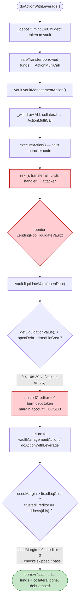
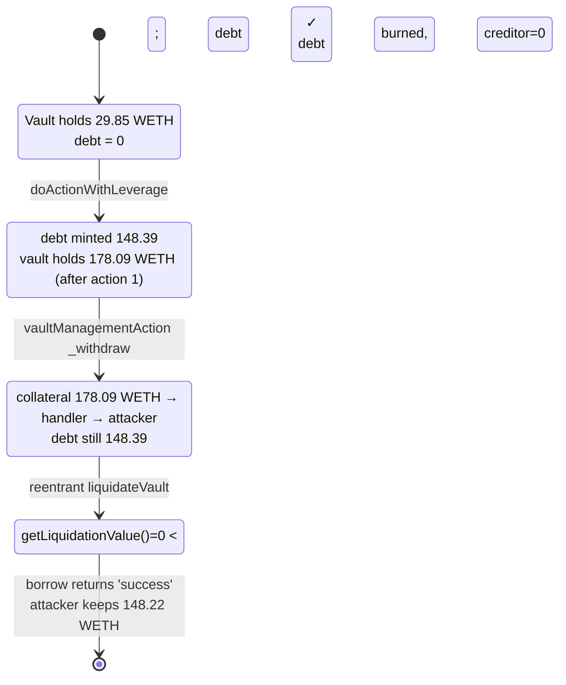

# Arcadia Finance Exploit — Reentrant Self-Liquidation Drains the Lending Pools

> **Reproduction:** the PoC compiles & runs in an isolated Foundry project at
> [this project folder](.) (the umbrella DeFiHackLabs repo
> contains many unrelated PoCs that fail to whole-compile, so this one was extracted).
> Full verbose trace: [output.txt](output.txt).
> Verified vulnerable sources: [`Vault.sol`](sources/Vault_3ae354/src_Vault.sol),
> [`LendingPool.sol`](sources/LendingPool_D417c2/lib_arcadia-lending_src_LendingPool.sol),
> [`MultiCall.sol`](sources/ActionMultiCall_2dE7Bb/src_actions_MultiCall.sol).

---

## Key info

| | |
|---|---|
| **Loss** | ~$334K recovered at this fork block (148.22 WETH + 59,527 USDC); the live incident totalled ≈ $455K across all of Arcadia's Optimism pools |
| **Vulnerable contract** | Arcadia `Vault` logic — [`0x3Ae354d7E49039CcD582f1F3c9e65034fFd17baD`](https://optimistic.etherscan.io/address/0x3ae354d7e49039ccd582f1f3c9e65034ffd17bad#code) |
| **Victim pools** | `darcWETH` LendingPool [`0xD417c28aF20884088F600e724441a3baB38b22cc`](https://optimistic.etherscan.io/address/0xD417c28aF20884088F600e724441a3baB38b22cc) · `darcUSDC` LendingPool [`0x9aa024D3fd962701ED17F76c17CaB22d3dc9D92d`](https://optimistic.etherscan.io/address/0x9aa024D3fd962701ED17F76c17CaB22d3dc9D92d) |
| **Attacker EOA** | [`0xd3641c912a6a4c30338787e3c464420b561a9467`](https://optimistic.etherscan.io/address/0xd3641c912a6a4c30338787e3c464420b561a9467) |
| **Attacker contract** | [`0x01a4d9089c243ccaebe40aa224ad0cab573b83c6`](https://optimistic.etherscan.io/address/0x01a4d9089c243ccaebe40aa224ad0cab573b83c6) |
| **Attack tx** | [`0xca7c1a0fde444e1a68a8c2b8ae3fb76ec384d1f7ae9a50d26f8bfdd37c7a0afe`](https://optimistic.etherscan.io/tx/0xca7c1a0fde444e1a68a8c2b8ae3fb76ec384d1f7ae9a50d26f8bfdd37c7a0afe) |
| **Chain / fork block / date** | Optimism / 106,676,494 / July 10, 2023 |
| **Compiler** | Solidity ^0.8.13 |
| **Bug class** | Cross-contract reentrancy via attacker-supplied action handler → self-liquidation that erases debt while collateral is already off-vault |

---

## TL;DR

Arcadia's `Vault` is an on-chain margin account. To support leveraged DeFi actions, the
`LendingPool` mints debt to a vault, ships the borrowed funds + the vault's collateral to an
attacker-chosen **action handler**, and only re-checks vault health *after* the handler returns
([`LendingPool.sol:528-547`](sources/LendingPool_D417c2/lib_arcadia-lending_src_LendingPool.sol#L528-L547),
[`Vault.sol:529-555`](sources/Vault_3ae354/src_Vault.sol#L529-L555)). This is the classic
"optimistic call, validate at the end" pattern — but the *validation at the end is never reached*.

While the borrowed funds and collateral sit inside the `ActionMultiCall` handler, the attacker's
handler call does two things:

1. **Sweeps every token out** of the handler to the attacker's own contract.
2. **Reenters the LendingPool and liquidates the very vault that is mid-action**
   ([`MultiCall.sol:43-50`](sources/ActionMultiCall_2dE7Bb/src_actions_MultiCall.sol#L43-L50)
   calling the helper's `rekt()`,
   [test/ArcadiaFi_exp.sol:263-266](test/ArcadiaFi_exp.sol#L263-L266)).

The vault is now empty, so `getLiquidationValue()` returns **0**, which trivially satisfies
`liquidateVault`'s health check `getLiquidationValue() < openDebt + fixedLiquidationCost`
([`Vault.sol:481`](sources/Vault_3ae354/src_Vault.sol#L481)). Liquidation closes the margin
account and burns the debt token. When control returns to `doActionWithLeverage`, the final health
gate `require(trustedCreditor == address(this) ...)` passes because the margin account was *closed*
during liquidation (`trustedCreditor` is now `address(0)`).

Net effect: the attacker keeps both the **borrowed funds** and the **deposited collateral**, while
the debt is annihilated by a self-liquidation. They repeat it once per pool (WETH, then USDC),
draining each LendingPool of its available liquidity. Everything is wrapped in an Aave V3 flash
loan, so no capital is required.

---

## Background — Arcadia margin accounts & leveraged actions

Arcadia Finance is a margin/collateral protocol on Optimism:

- A **Vault** ([`Vault.sol`](sources/Vault_3ae354/src_Vault.sol)) is a per-user smart account that
  custodies collateral (ERC20/721/1155) and tracks a single *trusted creditor*. Vaults are minted
  by the `Factory` and run behind an EIP-1967 proxy.
- A **LendingPool** (`darcWETH`, `darcUSDC`) is the trusted creditor. It is an ERC4626 debt-token
  accountant that lends its underlying asset against vault collateral.
- **Leveraged actions**: `LendingPool.doActionWithLeverage()` lets a vault borrow, hand the funds
  to an arbitrary `actionHandler` (an allowlisted multicall contract) to do swaps/deposits, then
  deposit the proceeds back — all in one transaction, with a single health check at the very end.
  This is modelled on flash loans ("optimistically calls external logic and checks for the vault
  state at the very end" — comment at
  [`Vault.sol:524`](sources/Vault_3ae354/src_Vault.sol#L524)).

The on-chain parameters at the fork block (read from the trace):

| Parameter | WETH leg | USDC leg |
|---|---|---|
| LendingPool liquidity available before borrow | 149.239068119735379843 WETH | 59,583.3835 USDC |
| Attacker collateral deposited | 29.847813623947075968 WETH | 11,916.6767 USDC |
| Amount borrowed (`balance − dust`) | 148.239068119735379843 WETH | 59,533.3835 USDC |
| `fixedLiquidationCost` (from `openMarginAccount`) | 0.002 WETH (2e15) | 2 USDC (2e6) |
| Liquidator | `0xD2A34731586bD10B645f870f4C9DcAF4F9e3823C` | same |

---

## The vulnerable code

### 1. `doActionWithLeverage` mints debt, ships funds out, then validates last

```solidity
// LendingPool.sol:508-550
function doActionWithLeverage(uint256 amountBorrowed, address vault, address actionHandler, ...) external ... {
    ...
    //Mint debt tokens to the vault, debt must be minted Before the actions in the vault are performed.
    _deposit(amountBorrowedWithFee, vault);                     // ← debt token minted to vault
    ...
    //Send Borrowed funds to the actionHandler.
    asset.safeTransfer(actionHandler, amountBorrowed);          // ← borrowed funds leave the pool

    // optimistically calls external logic and checks for the vault state at the very end.
    (address trustedCreditor, uint256 vaultVersion) =
        IVault(vault).vaultManagementAction(actionHandler, actionData);   // ← attacker-controlled
    require(trustedCreditor == address(this) && isValidVersion[vaultVersion], "LP_DAWL: Reverted");
}
```
[`LendingPool.sol:508-550`](sources/LendingPool_D417c2/lib_arcadia-lending_src_LendingPool.sol#L508-L550)

### 2. `vaultManagementAction` withdraws collateral to the handler, then calls it

```solidity
// Vault.sol:529-555
function vaultManagementAction(address actionHandler, bytes calldata actionData)
    external onlyAssetManager returns (address, uint256)
{
    require(IMainRegistry(registry).isActionAllowed(actionHandler), "V_VMA: Action not allowed");
    (ActionData memory outgoing,,,) = abi.decode(actionData, (ActionData, ActionData, address[], bytes[]));

    // Withdraw assets to actionHandler.
    _withdraw(outgoing.assets, outgoing.assetIds, outgoing.assetAmounts, actionHandler);   // ← collateral leaves vault

    // Execute Action(s).
    ActionData memory incoming = IActionBase(actionHandler).executeAction(actionData);     // ← REENTRANCY POINT

    // Deposit assets from actionHandler into vault.
    _deposit(incoming.assets, incoming.assetIds, incoming.assetAmounts, actionHandler);

    uint256 usedMargin = getUsedMargin();
    if (usedMargin > fixedLiquidationCost) {
        require(getCollateralValue() >= usedMargin, "V_VMA: Vault Unhealthy");             // ← never reached as intended
    }
    return (trustedCreditor, vaultVersion);
}
```
[`Vault.sol:529-555`](sources/Vault_3ae354/src_Vault.sol#L529-L555)

### 3. The action handler executes arbitrary calls — including the reentrant `rekt()`

```solidity
// MultiCall.sol:35-66
function executeAction(bytes calldata actionData) external override returns (ActionData memory) {
    (, ActionData memory incoming, address[] memory to, bytes[] memory data) = abi.decode(...);
    for (uint256 i; i < to.length;) {
        (bool success, bytes memory result) = to[i].call(data[i]);   // ← arbitrary external call
        require(success, string(result));
        unchecked { ++i; }
    }
    // returns its own post-call balances as the "incoming" assets to deposit back
    ...
}
```
[`MultiCall.sol:35-66`](sources/ActionMultiCall_2dE7Bb/src_actions_MultiCall.sol#L35-L66)

The attacker registers a `Helper.rekt()` call inside `actionData`. `rekt()` runs while the
handler still holds all the funds:

```solidity
// test/ArcadiaFi_exp.sol:263-266 (Helper1)
function rekt() external {
    WETH.transferFrom(ActionMultiCall, owner, WETH.balanceOf(address(ActionMultiCall)));  // sweep funds to attacker
    darcWETH.liquidateVault(proxy);                                                        // self-liquidate the empty vault
}
```
[test/ArcadiaFi_exp.sol:263-266](test/ArcadiaFi_exp.sol#L263-L266)

### 4. The self-liquidation that passes a "health" check on an empty vault

`LendingPool.liquidateVault` burns the debt and closes the margin account; the inner
`Vault.liquidateVault` only requires that the (now-zero) liquidation value is below the debt:

```solidity
// Vault.sol:461-496
function liquidateVault(uint256 openDebt) external returns (...) {
    require(msg.sender == liquidator, "V_LV: Only Liquidator");
    //Close margin account.
    isTrustedCreditorSet = false;
    trustedCreditor = address(0);          // ← this is why the final require in doActionWithLeverage still passes
    liquidator = address(0);
    require(getLiquidationValue() < openDebt + fixedLiquidationCost, "V_LV: liqValue above usedMargin");  // 0 < debt ✓
    ...
}
```
[`Vault.sol:461-496`](sources/Vault_3ae354/src_Vault.sol#L461-L496)

```solidity
// LendingPool.sol:765-791
function liquidateVault(address vault) external whenLiquidationNotPaused processInterests {
    uint256 openDebt = maxWithdraw(vault);
    require(openDebt != 0, "LP_LV: Not a Vault with debt");
    ...
    //Remove debt from Vault (burn DebtTokens).
    _withdraw(openDebt, vault, vault);     // ← debt erased
}
```
[`LendingPool.sol:765-791`](sources/LendingPool_D417c2/lib_arcadia-lending_src_LendingPool.sol#L765-L791)

---

## Root cause — why it was possible

The protocol's "optimistic action, validate at the end" model assumes the vault is **still a
debtor** when control returns, so that `vaultManagementAction`'s final health check (or
`doActionWithLeverage`'s `trustedCreditor == address(this)` check) catches under-collateralisation.
The reentrancy breaks every assumption that makes the final check meaningful:

1. **No reentrancy guard on the leveraged-action path.** `doActionWithLeverage` →
   `vaultManagementAction` → `executeAction` calls *attacker code* (`to[i].call(data[i])`) while
   the borrowed funds and collateral are sitting in the action handler, with the in-flight debt
   still open. Nothing prevents that code from calling back into `LendingPool.liquidateVault`.

2. **`liquidateVault` is callable mid-action and judges health on a *transiently empty* vault.**
   At the reentry point the collateral has already been withdrawn to the handler (and from there
   swept to the attacker), so `getLiquidationValue()` returns 0. The "is this vault liquidatable?"
   test `0 < openDebt + fixedLiquidationCost` is trivially true. The protocol liquidates a vault
   whose assets it itself just moved off-balance one call frame earlier.

3. **Liquidation is a *value-destroying* state transition that the final gate treats as success.**
   `Vault.liquidateVault` sets `trustedCreditor = address(0)` and `LendingPool.liquidateVault`
   burns the debt token. So when `doActionWithLeverage` reaches
   `require(trustedCreditor == address(this) ...)`, `trustedCreditor` is `0` — the check *should*
   fail, but it is read from the return value of `vaultManagementAction`, which re-reads the
   now-cleared storage. The debt is gone and the assets are gone; the borrow is treated as
   complete.

4. **The action handler is a generic, fund-passing multicall.** `ActionMultiCall` approves and
   calls arbitrary targets and reports its own balance back as the "deposited" amount. An attacker
   simply moves the funds out before that balance snapshot, so the vault "receives back" nothing.

In short: the system optimistically lends, then lets the borrower run arbitrary code that
**liquidates the loan from the inside** — converting an under-collateralised position into a
"successfully closed" one while the borrower walks off with both the principal and the collateral.

---

## Preconditions

- Attacker can create a vault and open a trusted margin account against a target LendingPool
  (permissionless: `Factory.createVault` + `Vault.openTrustedMarginAccount`).
- The chosen action handler (`ActionMultiCall`) is allowlisted by the MainRegistry
  (it is — `isActionAllowed` returns `true` in the trace) and forwards arbitrary calls.
- The attacker controls the vault (is its owner / asset manager), so it can drive
  `doActionWithLeverage` and embed a reentrant call in the action data.
- Working capital to seed each vault's collateral; sourced from an Aave V3 flash loan and fully
  repaid in the same transaction, so the attack is effectively zero-capital.

---

## Attack walkthrough (with on-chain numbers from the trace)

The PoC runs the same drain twice — once per pool. Numbers below are taken directly from
[output.txt](output.txt).

### WETH leg (darcWETH)

| # | Step | On-chain value | Source |
|---|------|----------------|--------|
| 0 | Flash-loan **29.847813623947075968 WETH** from Aave V3 | flashLoan amount | [output.txt:28](output.txt) |
| 1 | `createVault(15113, v1, WETH)` → Proxy1, `openTrustedMarginAccount(darcWETH)` | liquidator `0xD2A3…823C`, fixedLiqCost 2e15 | trace L34-44 |
| 2 | `deposit` 29.847813… WETH as collateral | vault WETH = 29.847813… | trace L50-71 |
| 3 | `doActionWithLeverage(borrow = bal(darcWETH) − 1e18 = **148.239068119735379843 WETH**)`; debt minted ≈ **148.387307187855115223** | Borrow event | trace L74, L132 |
| 4 | 1st action (no-op `approve`) deposits the 148.239 WETH back; vault now holds **178.086881743682455811 WETH** | balanceOf(Proxy1) | trace L4(file2) |
| 5 | 2nd `vaultManagementAction`: vault withdraws all **178.086881743682455811 WETH** to ActionMultiCall | Transfer Proxy1→handler | trace L16-18(file2) |
| 6 | `executeAction` → `Helper1.rekt()`: `transferFrom(handler → attacker, 178.086881743682455811 WETH)` | funds swept | trace L23-28(file2) |
| 7 | `rekt()` reenters `darcWETH.liquidateVault(Proxy1)`; `getLiquidationValue()` = **0** < 148.387… ✓; debt burned (146.739… shares), NFT to liquidator | self-liquidation | trace L29-60(file2) |
| 8 | Control returns; `doActionWithLeverage` final require passes (margin account closed) | `← 0x0…0, 1` | trace L67-68(file2) |

### USDC leg (darcUSDC) — identical pattern

| # | Step | On-chain value |
|---|------|----------------|
| 0 | Flash-loan **11,916.6767 USDC** | flashLoan amount |
| 1-2 | `createVault(15114)` → Proxy2; deposit 11,916.6767 USDC collateral | trace L69-106(file2) |
| 3 | `doActionWithLeverage(borrow = bal(darcUSDC) − 50e6 = **59,533.3835 USDC**)` | trace L107-109(file2) |
| 4-5 | Vault holds **71,450.0602 USDC** (collateral + borrowed); withdrawn to handler | trace |
| 6 | `Helper2.rekt()` sweeps **71,450.0602 USDC** to attacker | trace `rekt()` returns 71450060200 |
| 7 | `darcUSDC.liquidateVault(Proxy2)`; `getLiquidationValue()` = **0** < 59,592.9168… ✓; debt burned | trace L (USDC liquidateVault) |

### Settle the flash loan

| Asset | Borrowed | Premium | Repaid | Attacker keeps |
|---|---:|---:|---:|---:|
| WETH | 29.847813623947075968 | 0.014923906811973538 | 29.862737530759049506 | — |
| USDC | 11,916.6767 | 5.958338 | 11,922.635038 | — |

---

## Profit/loss accounting

After repaying both flash loans, the attacker contract is left with (final `balanceOf`, trace tail):

| Asset | Final balance | Chainlink price (trace) | USD |
|---|---:|---:|---:|
| WETH | **148.224144212923406305** | $1,852.65 (185265000000 / 1e8) | ≈ $274,608 |
| USDC | **59,527.425162** | $1.00 | ≈ $59,527 |
| **Total** | | | **≈ $334,135** |

The profit is essentially `(borrowed + collateral) − flash-loan repayment` for each leg:

- **WETH**: swept 178.086881… − repaid 29.862737… ≈ **148.224 WETH** of pure profit, sourced from
  the 148.239 WETH the pool lent out (the pool's available liquidity) plus the attacker's own
  collateral round-tripped back.
- **USDC**: swept 71,450.0602 − repaid 11,922.635 ≈ **59,527 USDC**, again the pool's lent
  liquidity plus round-tripped collateral.

Each LendingPool is left having burned the debt token (so it believes nothing is owed) while its
underlying-asset balance has been drained to the attacker. The live incident, run against the full
pools (not just this fork snapshot), totalled approximately **$455K** across Arcadia's Optimism
markets.

---

## Diagrams

### Sequence of the attack (one leg)

```mermaid
sequenceDiagram
    autonumber
    actor A as "Attacker contract"
    participant FL as "Aave V3 (flash loan)"
    participant F as "Factory"
    participant LP as "LendingPool (darcWETH)"
    participant V as "Vault (Proxy1)"
    participant MC as "ActionMultiCall (handler)"
    participant H as "Helper.rekt()"

    A->>FL: flashLoan(29.85 WETH)
    FL-->>A: 29.85 WETH
    A->>F: createVault() → Proxy1
    A->>V: openTrustedMarginAccount(darcWETH)
    A->>V: deposit(29.85 WETH collateral)

    rect rgb(227,242,253)
    Note over A,MC: doActionWithLeverage — optimistic borrow
    A->>LP: doActionWithLeverage(borrow 148.24 WETH)
    LP->>LP: _deposit(debt token) → mint 148.39 debt to vault
    LP->>MC: safeTransfer(148.24 WETH)
    LP->>V: vaultManagementAction(handler, data)
    V->>MC: _withdraw(all 178.09 WETH collateral+borrowed)
    V->>MC: executeAction(data)
    end

    rect rgb(255,235,238)
    Note over MC,H: REENTRANCY — handler runs attacker code
    MC->>H: rekt()
    H->>MC: transferFrom(handler → attacker, 178.09 WETH)
    Note over MC: handler now empty
    H->>LP: liquidateVault(Proxy1)
    LP->>V: liquidateVault(openDebt = 148.39)
    Note over V: getLiquidationValue()=0 < 148.39 ✓<br/>trustedCreditor = 0, margin account closed
    LP->>LP: _withdraw(openDebt) → burn debt token
    end

    Note over V,LP: control returns; final health gate passes<br/>(vault no longer a debtor)
    A->>FL: repay 29.86 WETH (+premium)
    Note over A: keeps 148.22 WETH profit
```

### Why the final health check never protects the pool



### Vault state through the exploit (WETH leg)



---

## Remediation

1. **Add a reentrancy guard around the entire leveraged-action flow.**
   `doActionWithLeverage`, `vaultManagementAction`, and `liquidateVault` must not be reachable
   from inside one another. A `nonReentrant` lock spanning the borrow→action→health-check sequence
   (and blocking `liquidateVault` while it is held) closes the attack outright. This was Arcadia's
   actual fix.

2. **Forbid liquidation of a vault that is mid-action.** Track an "action in progress" flag set in
   `vaultManagementAction` before `executeAction` and cleared after the final health check; have
   `liquidateVault` revert while it is set. A vault whose assets are transiently in the action
   handler is not in a well-defined state for liquidation.

3. **Do not let a value-destroying transition (liquidation) masquerade as a passing post-condition.**
   The final gate in `doActionWithLeverage` reads `trustedCreditor` from the call's return value;
   it should explicitly assert the vault is *still* the protocol's debtor with the expected debt,
   and treat "margin account was closed during the action" as a hard revert, not success.

4. **Make `getLiquidationValue() == 0` non-liquidatable, or require positive recovered value.**
   A liquidation that recovers zero collateral against a non-zero debt is pure bad-debt creation;
   it should not be an unconditionally-allowed path, especially not one an attacker can trigger.

5. **Constrain the action handler / never trust handler-reported balances as deposits.** The vault
   re-credits whatever the handler claims it holds after arbitrary calls. Snapshot the vault's
   *expected* incoming assets independently, and verify the collateral value covers the debt using
   pre-committed amounts rather than post-call handler balances.

---

## How to reproduce

```bash
_shared/run_poc.sh 2023-07-ArcadiaFi_exp --mt testExploit -vvvvv
```

- RPC: an **Optimism archive** endpoint is required (fork block 106,676,494, July 2023). Configure
  the `optimism` alias in `foundry.toml`. Public non-archival RPCs will fail with
  `header not found` / `missing trie node` at this historical block.
- Result: `[PASS] testExploit()`.

Expected tail:

```
Ran 1 test for test/ArcadiaFi_exp.sol:ContractTest
[PASS] testExploit() (gas: 2842015)
Logs:
  Attacker USDC balance after exploit: 59527.425162
  Attacker WETH balance after exploit: 148.224144212923406305
```

---

*References: Arcadia Finance post-mortem — https://arcadiafinance.medium.com/post-mortem-72e9d24a79b0 ·
Phalcon — https://twitter.com/Phalcon_xyz/status/1678250590709899264 ·
PeckShield — https://twitter.com/peckshield/status/1678265212770693121*
